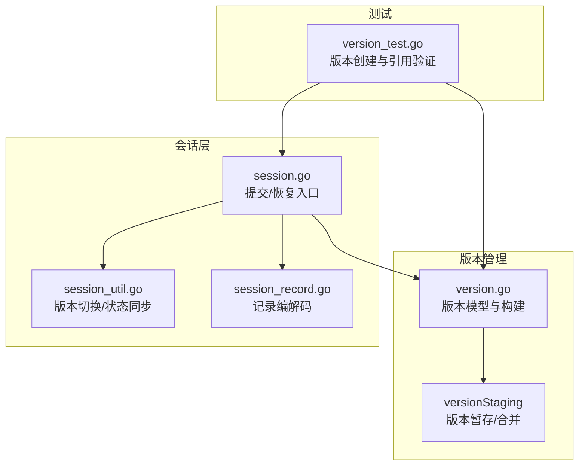
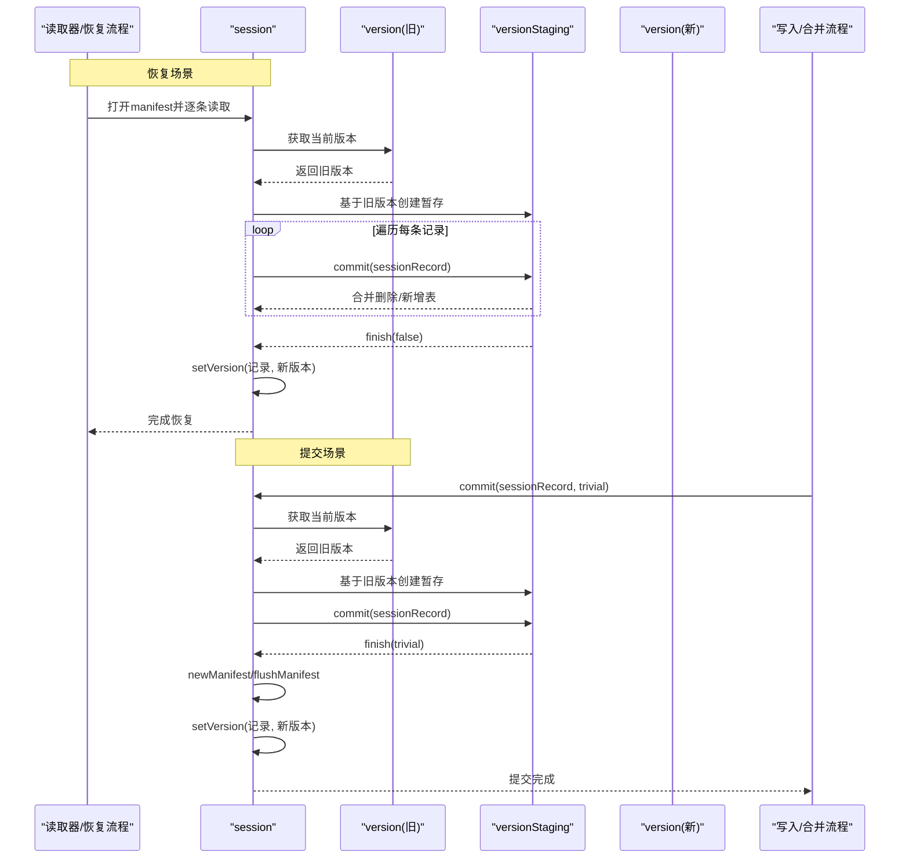
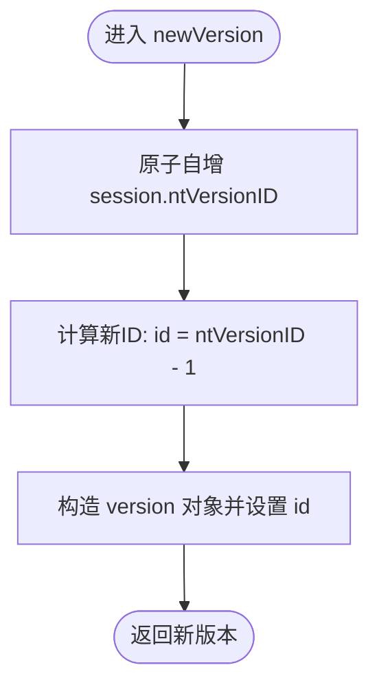
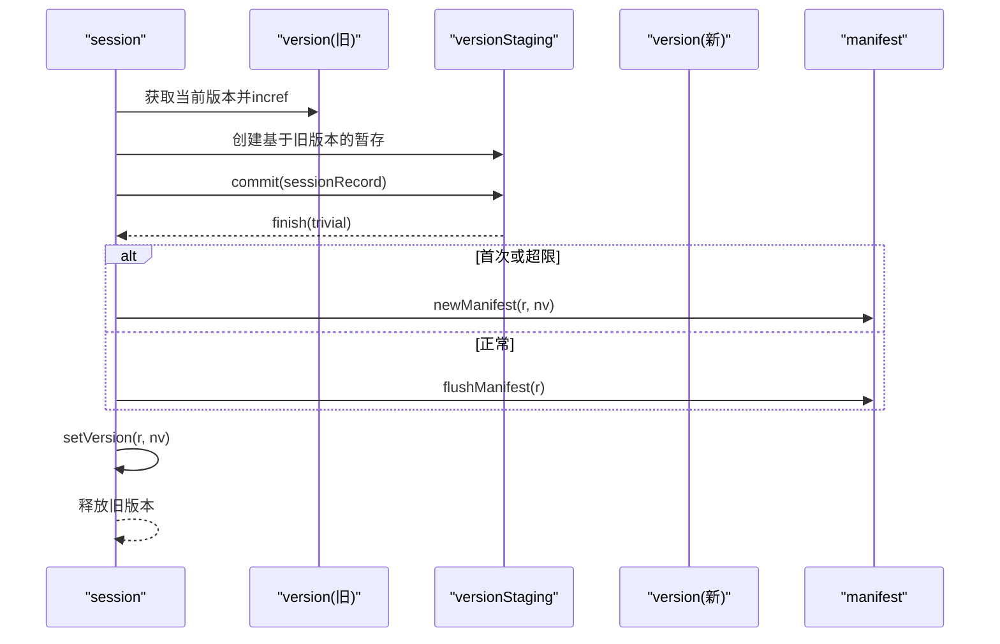
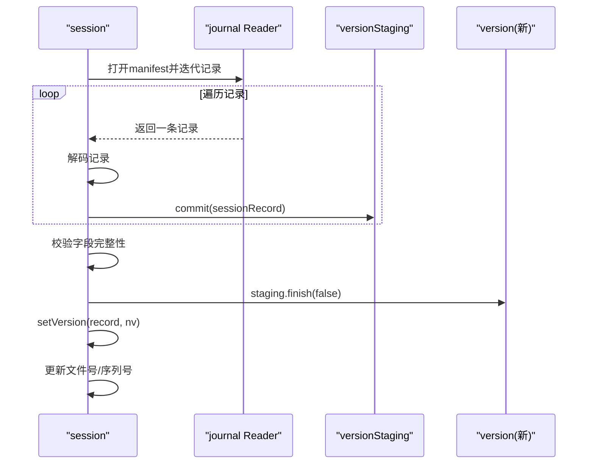
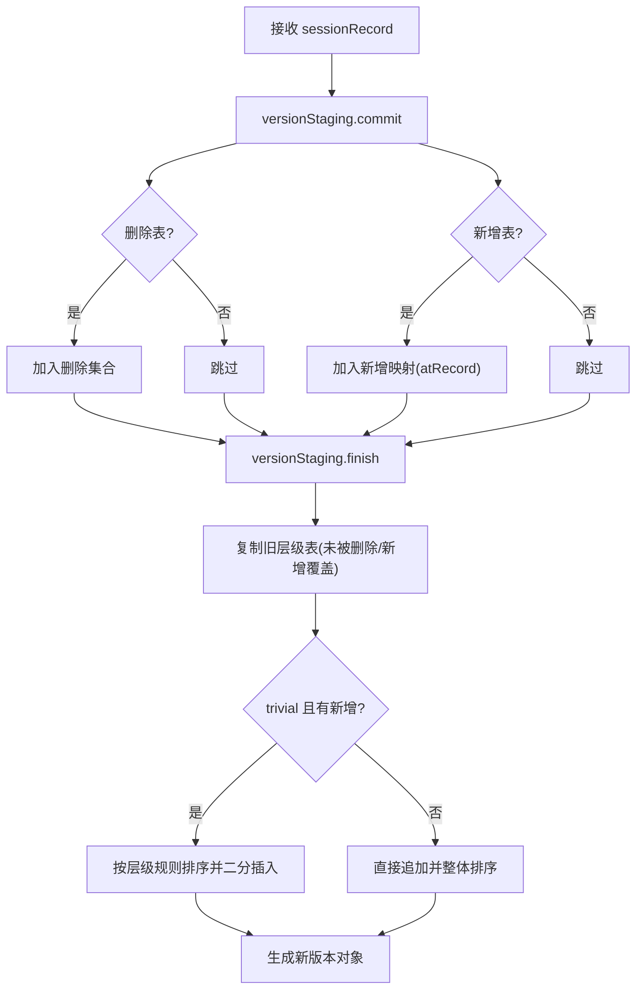
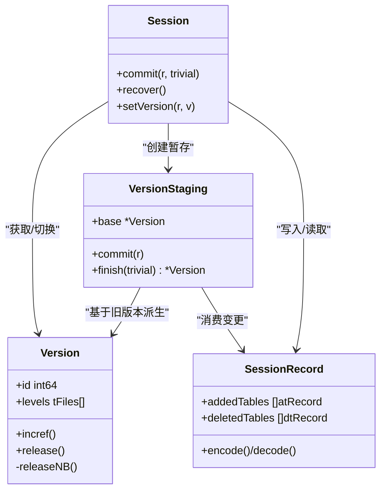
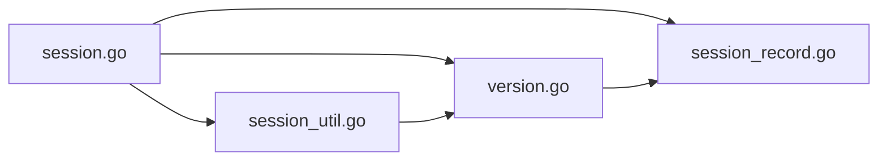

# 版本创建

<cite>
**本文引用的文件**
- [version.go](file://leveldb/version.go)
- [session.go](file://leveldb/session.go)
- [session_record.go](file://leveldb/session_record.go)
- [session_util.go](file://leveldb/session_util.go)
- [version_test.go](file://leveldb/version_test.go)
</cite>

## 目录
1. [简介](#简介)
2. [项目结构](#项目结构)
3. [核心组件](#核心组件)
4. [架构总览](#架构总览)
5. [详细组件分析](#详细组件分析)
6. [依赖分析](#依赖分析)
7. [性能考量](#性能考量)
8. [故障排查指南](#故障排查指南)
9. [结论](#结论)

## 简介
本文聚焦于 avccDB 的版本管理机制，围绕“版本创建”这一主题，系统阐述以下内容：
- newVersion 函数与版本 ID 分配机制（基于原子计数）
- session.commit 方法在正常提交流程中如何生成新版本
- 通过 sessionRecord 生成新版本的完整路径：从记录到 versionStaging 再到新 version 对象
- 数据库恢复（recover）与正常提交（commit）在版本创建上的差异
- manifest 日志在版本创建中的作用与职责边界
- 版本创建过程中对 SSTable 文件的引用管理策略

## 项目结构
与版本创建直接相关的模块主要分布在以下文件：
- 版本模型与版本构建：version.go
- 会话与提交/恢复入口：session.go、session_util.go
- 会话记录编码/解码：session_record.go
- 测试用例与行为验证：version_test.go

图表来源
- [version.go](file://leveldb/version.go#L45-L120)
- [session.go](file://leveldb/session.go#L120-L243)
- [session_util.go](file://leveldb/session_util.go#L250-L320)
- [session_record.go](file://leveldb/session_record.go#L190-L324)
- [version_test.go](file://leveldb/version_test.go#L287-L376)

章节来源
- [version.go](file://leveldb/version.go#L45-L120)
- [session.go](file://leveldb/session.go#L120-L243)
- [session_util.go](file://leveldb/session_util.go#L250-L320)
- [session_record.go](file://leveldb/session_record.go#L190-L324)
- [version_test.go](file://leveldb/version_test.go#L287-L376)

## 核心组件
- 版本模型 version：包含层级化的 SSTable 列表、版本 ID、引用计数等；提供基于当前版本派生新版本的能力。
- 版本暂存 versionStaging：接收 sessionRecord 的变更，进行“删除/新增”表的合并与排序，最终产出新版本。
- 会话 session：对外提供 commit/recover 接口；负责将变更写入 manifest 并应用到当前版本。
- 会话记录 sessionRecord：承载 manifest 中的元数据条目，如新增/删除表、比较器、序列号、压缩指针等。

章节来源
- [version.go](file://leveldb/version.go#L26-L60)
- [version.go](file://leveldb/version.go#L702-L759)
- [session.go](file://leveldb/session.go#L120-L243)
- [session_record.go](file://leveldb/session_record.go#L55-L132)

## 架构总览
下面以序列图展示从 sessionRecord 到新 version 的关键调用链路，涵盖 recover 与 commit 两条路径。

图表来源
- [session.go](file://leveldb/session.go#L128-L207)
- [session.go](file://leveldb/session.go#L210-L241)
- [version.go](file://leveldb/version.go#L566-L575)
- [version.go](file://leveldb/version.go#L716-L742)
- [version.go](file://leveldb/version.go#L744-L849)

## 详细组件分析

### newVersion 函数与版本 ID 分配
- newVersion 负责为新版本分配单调递增的唯一 ID。其实现使用原子操作对 session 的 ntVersionID 进行自增，确保并发安全且全局唯一。
- 返回的新版本对象持有该 ID，并与当前 session 关联，用于后续引用计数与版本切换。

图表来源
- [version.go](file://leveldb/version.go#L45-L49)

章节来源
- [version.go](file://leveldb/version.go#L45-L49)

### session.commit 正常提交流程
- 获取当前版本并增加其引用计数，避免在构建新版本期间被释放。
- 基于当前版本创建 versionStaging，将本次 sessionRecord 的变更合并到暂存。
- 若发生错误，丢弃新版本 ID，防止阻塞版本处理循环。
- 将变更写入 manifest（首次创建或超过大小阈值时重建，否则追加），成功后通过 setVersion 应用新版本。

图表来源
- [session.go](file://leveldb/session.go#L210-L241)
- [version.go](file://leveldb/version.go#L566-L575)
- [version.go](file://leveldb/version.go#L744-L849)

章节来源
- [session.go](file://leveldb/session.go#L210-L241)
- [version.go](file://leveldb/version.go#L566-L575)
- [version.go](file://leveldb/version.go#L744-L849)

### session.recover 恢复流程
- 从存储中打开 manifest 元文件，逐条读取 journal 记录。
- 对每条记录执行解码，保存压缩指针，然后 commit 到 versionStaging。
- 完成所有记录后，校验关键字段完整性，随后通过 setVersion 应用新版本，并更新文件号、序列号等状态。

图表来源
- [session.go](file://leveldb/session.go#L128-L207)
- [session_record.go](file://leveldb/session_record.go#L258-L324)
- [version.go](file://leveldb/version.go#L744-L849)

章节来源
- [session.go](file://leveldb/session.go#L128-L207)
- [session_record.go](file://leveldb/session_record.go#L258-L324)
- [version.go](file://leveldb/version.go#L744-L849)

### 从 sessionRecord 到新 version 的转换过程
- sessionRecord 包含新增/删除的 SSTable 描述（level、num、size、imin/imax 等），以及比较器、序列号、压缩指针等元信息。
- versionStaging.commit 将这些变更映射到“删除集合”和“新增映射”，并在 finish 阶段：
  - 复制未受影响层级的表
  - 移除已标记删除的表
  - 将新增表按 trivial/非 trivial 规则插入并排序
  - 最终构建新版本并计算压缩评分

图表来源
- [session_record.go](file://leveldb/session_record.go#L109-L131)
- [version.go](file://leveldb/version.go#L716-L742)
- [version.go](file://leveldb/version.go#L744-L849)

章节来源
- [session_record.go](file://leveldb/session_record.go#L109-L131)
- [version.go](file://leveldb/version.go#L716-L742)
- [version.go](file://leveldb/version.go#L744-L849)

### 版本继承关系与引用管理
- 版本对象维护引用计数与“已释放”标记，通过 incref/releaseNB 实现惰性任务通知（refCh/relCh），用于跟踪活跃文件的生命周期。
- setVersion 在切换新版本前先对新版本 incref，再 release 旧版本，保证在切换瞬间不会出现“正在使用却被释放”的情况。
- versionStaging.finish 生成的新版本在应用前不立即暴露给外部，仅在 setVersion 成功后才对外可见。

图表来源
- [version.go](file://leveldb/version.go#L26-L60)
- [version.go](file://leveldb/version.go#L520-L575)
- [session_util.go](file://leveldb/session_util.go#L266-L295)
- [session.go](file://leveldb/session.go#L210-L241)
- [session_record.go](file://leveldb/session_record.go#L55-L132)

章节来源
- [version.go](file://leveldb/version.go#L26-L60)
- [version.go](file://leveldb/version.go#L520-L575)
- [session_util.go](file://leveldb/session_util.go#L266-L295)
- [session.go](file://leveldb/session.go#L210-L241)
- [session_record.go](file://leveldb/session_record.go#L55-L132)

### manifest 日志在版本创建中的作用
- manifest 是持久化记录数据库状态变更的 journal 文件，包含新增/删除表、比较器、序列号、压缩指针等。
- commit 流程中，若 manifest 不存在或超过阈值，则通过 newManifest 写入快照与增量；否则使用 flushManifest 追加增量。
- recover 流程中，逐条读取 manifest 记录，构建 versionStaging 并最终应用新版本。

章节来源
- [session.go](file://leveldb/session.go#L210-L241)
- [session.go](file://leveldb/session.go#L128-L207)
- [session_util.go](file://leveldb/session_util.go#L403-L449)
- [session_record.go](file://leveldb/session_record.go#L190-L324)

### 版本创建时对 SSTable 文件的引用管理
- 版本切换通过 setVersion 完成：先对新版本 incref，再 release 旧版本，确保在切换瞬间不会释放仍在使用的文件。
- versionStaging.finish 生成的新版本在应用前不暴露，仅在 setVersion 成功后才对外可见。
- 测试用例验证了在大量并发读写场景下，文件引用计数与版本任务队列的行为正确性。

章节来源
- [session_util.go](file://leveldb/session_util.go#L266-L295)
- [version_test.go](file://leveldb/version_test.go#L287-L376)

## 依赖分析
- session 依赖 version 与 versionStaging 进行版本派生与合并。
- session 依赖 sessionRecord 进行元数据编解码与 manifest 写入。
- version 依赖 session 的文件号分配、比较器、表操作接口等运行时资源。
- session_util 提供版本切换与状态同步的通用逻辑。

图表来源
- [session.go](file://leveldb/session.go#L120-L243)
- [version.go](file://leveldb/version.go#L45-L120)
- [session_record.go](file://leveldb/session_record.go#L190-L324)
- [session_util.go](file://leveldb/session_util.go#L250-L320)

章节来源
- [session.go](file://leveldb/session.go#L120-L243)
- [version.go](file://leveldb/version.go#L45-L120)
- [session_record.go](file://leveldb/session_record.go#L190-L324)
- [session_util.go](file://leveldb/session_util.go#L250-L320)

## 性能考量
- 版本 ID 分配采用原子自增，避免锁竞争，适合高并发写入场景。
- versionStaging.finish 在 trivial 场景下使用二分查找与批量插入，减少排序成本，提升大文件合并效率。
- setVersion 采用“先持有一个新版本，再释放旧版本”的顺序，避免中间态导致的资源误释放。
- manifest 写入采用阈值控制（大小超过上限时重建），平衡磁盘空间与重放成本。

## 故障排查指南
- 恢复失败：检查 manifest 字段完整性校验（比较器、下一个文件号、journal 号、序列号）。若缺失或不匹配，将返回“manifest corrupted”错误。
- 提交失败回滚：commit 在出错时会丢弃新版本 ID，避免阻塞版本处理循环；同时记录日志便于定位。
- 引用异常：若发现版本引用计数异常或负值，应检查 incref/release 的配对调用是否正确，以及 setVersion 的顺序是否符合“先持有一个新版本，再释放旧版本”。

章节来源
- [session.go](file://leveldb/session.go#L189-L207)
- [session.go](file://leveldb/session.go#L210-L241)
- [version.go](file://leveldb/version.go#L52-L83)
- [session_util.go](file://leveldb/session_util.go#L266-L295)

## 结论
avccDB 的版本创建机制通过 newVersion 的原子 ID 分配、versionStaging 的变更合并与排序、以及 session.commit/recover 的统一入口，实现了稳定、可追溯且高性能的版本演进。manifest 日志作为事实来源，在恢复与提交过程中承担了关键角色；而版本切换与引用管理策略确保了在并发场景下的安全性与一致性。结合测试用例，可以进一步验证在复杂工作负载下的正确性与鲁棒性。