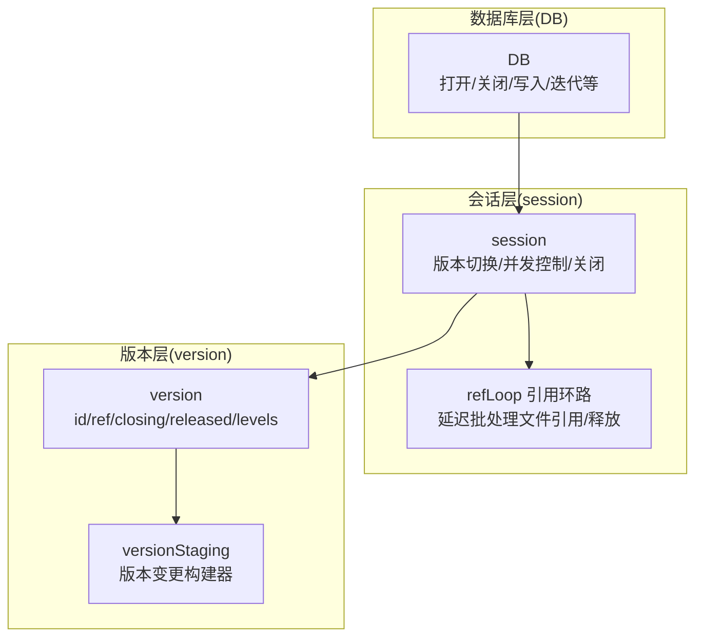
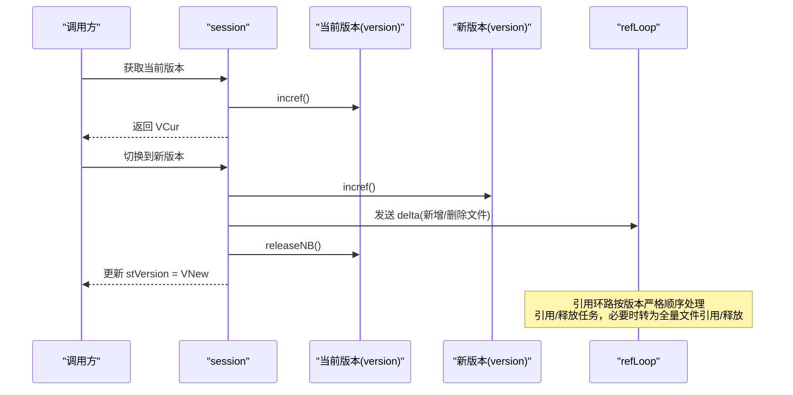
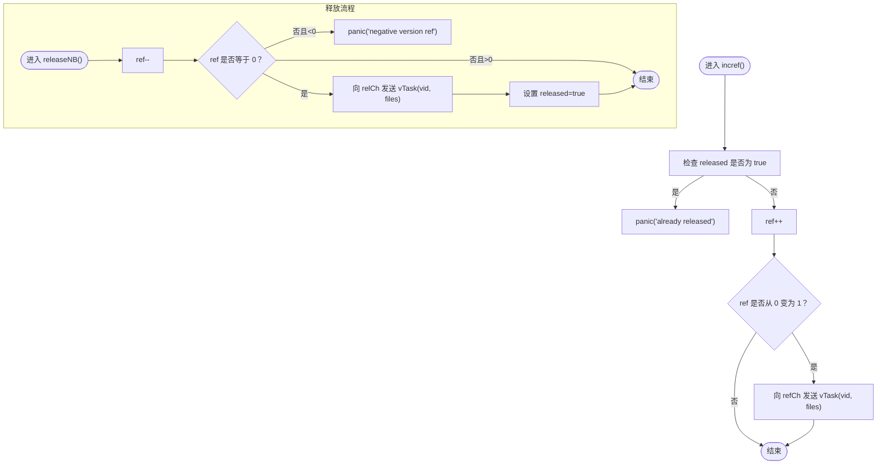
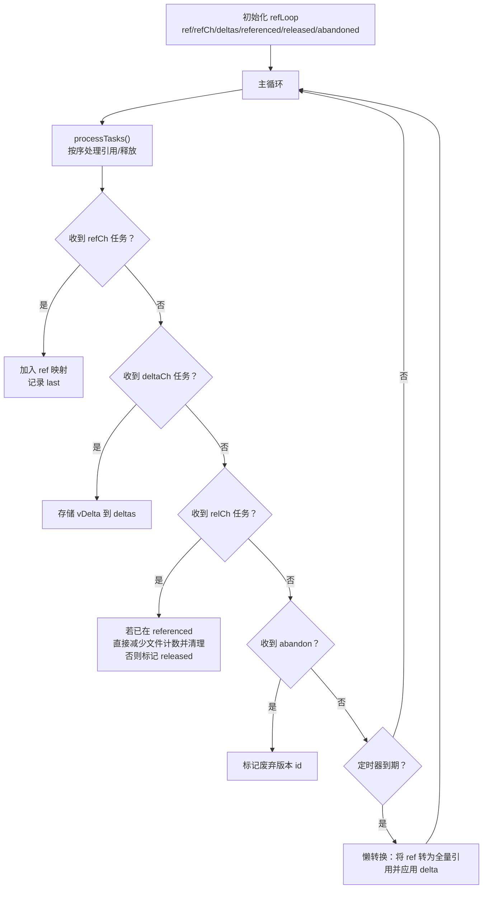
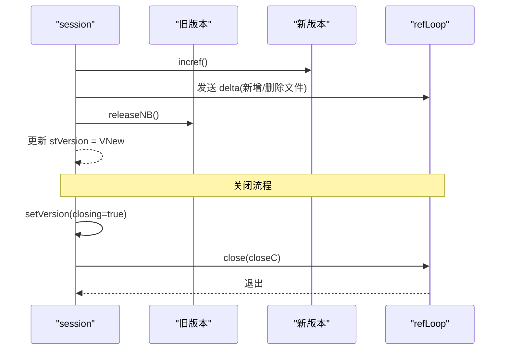
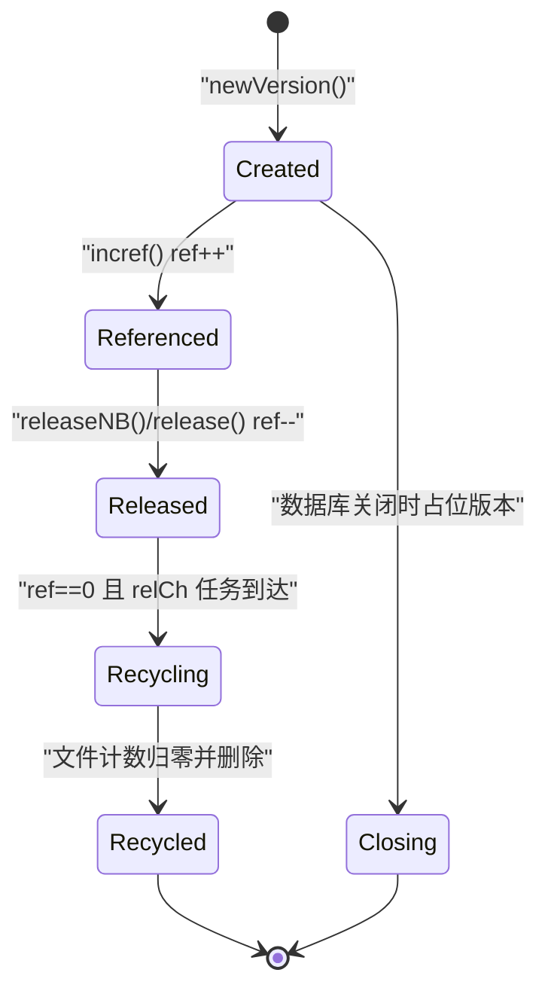
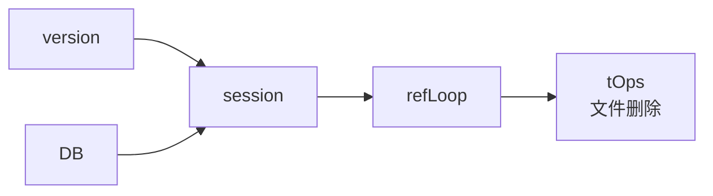

# 版本生命周期管理

<cite>
**本文引用的文件列表**
- [version.go](file://leveldb/version.go)
- [session_util.go](file://leveldb/session_util.go)
- [session.go](file://leveldb/session.go)
- [version_test.go](file://leveldb/version_test.go)
- [db.go](file://leveldb/db.go)
</cite>

## 目录
1. [简介](#简介)
2. [项目结构与定位](#项目结构与定位)
3. [核心组件](#核心组件)
4. [架构总览](#架构总览)
5. [详细组件分析](#详细组件分析)
6. [依赖关系分析](#依赖关系分析)
7. [性能考量](#性能考量)
8. [故障排查指南](#故障排查指南)
9. [结论](#结论)
10. [附录：多线程引用计数使用示例路径](#附录多线程引用计数使用示例路径)

## 简介
本文围绕 avccDB 的版本生命周期管理进行系统化技术文档整理，重点聚焦于 version 结构体中的引用计数机制（ref 字段）与 release 方法的实现，解释 incref 与 release 如何协同工作以确保版本对象的安全生命周期管理；阐述 closing 与 released 标志位的作用及数据库关闭时版本对象的特殊处理流程；并提供生命周期状态图与多线程场景下的正确使用方式参考路径。

## 项目结构与定位
- 版本生命周期管理的核心逻辑位于 leveldb/version.go 中的 version 结构体及其方法，配合会话层的引用环路 refLoop（在 leveldb/session_util.go 中实现）完成延迟批量化的文件引用/释放。
- 会话层负责版本切换、并发安全与关闭流程，关键入口在 leveldb/session.go。
- 数据库关闭流程在 leveldb/db.go 中体现，贯穿到会话层的关闭与引用环路退出。
- 测试用例在 leveldb/version_test.go 中验证引用计数与并发行为。

图表来源
- [session.go](file://leveldb/session.go#L36-L115)
- [session_util.go](file://leveldb/session_util.go#L70-L248)
- [version.go](file://leveldb/version.go#L26-L83)

章节来源
- [session.go](file://leveldb/session.go#L36-L115)
- [session_util.go](file://leveldb/session_util.go#L70-L248)
- [version.go](file://leveldb/version.go#L26-L83)

## 核心组件
- version 结构体
  - 关键字段：id、s（所属会话）、levels（各层级表文件集合）、cLevel、cScore、cSeek、closing、ref、released。
  - 关键方法：incref、release、releaseNB、spawn、newStaging、computeCompaction 等。
- session 会话
  - 维护当前版本 stVersion、版本号分配 ntVersionID、引用通道 refCh/relCh/deltaCh、关闭通道 closeC、版本互斥锁 vmu。
  - 提供版本获取与切换 setVersion、关闭 close、创建新版本 newVersion 等。
- refLoop 引用环路
  - 负责将分散的版本引用/释放任务聚合为批量文件级引用/释放，避免频繁小粒度操作，支持按版本严格顺序处理与超时/数量阈值的懒处理策略。

章节来源
- [version.go](file://leveldb/version.go#L26-L83)
- [session.go](file://leveldb/session.go#L36-L115)
- [session_util.go](file://leveldb/session_util.go#L45-L116)

## 架构总览
版本生命周期管理的关键流程：
- 获取版本：通过 session.version() 增加当前版本引用计数并返回。
- 版本切换：通过 session.setVersion() 完成新旧版本替换，期间向 refLoop 发送增量 delta，旧版本 releaseNB() 并标记 released。
- 引用环路：refLoop 按版本严格顺序处理引用/释放任务，支持“delta 缓存 + 超时/数量阈值触发全量转换”的策略，最终对表文件执行增删计数与清理。
- 数据库关闭：session.close() 将 stVersion 设置为 closing=true 的占位版本并关闭后台 goroutine，refLoop 在 closeC 信号下退出。

图表来源
- [session_util.go](file://leveldb/session_util.go#L251-L295)
- [session_util.go](file://leveldb/session_util.go#L70-L248)
- [version.go](file://leveldb/version.go#L52-L89)

章节来源
- [session_util.go](file://leveldb/session_util.go#L251-L295)
- [session_util.go](file://leveldb/session_util.go#L70-L248)
- [version.go](file://leveldb/version.go#L52-L89)

## 详细组件分析

### version 结构体与引用计数机制
- 字段说明
  - id：单调递增的版本标识，用于 refLoop 的严格顺序处理。
  - s：所属会话指针，用于与 refLoop 通信。
  - levels：各层级的表文件集合，不可变，可直接安全传递给 refLoop。
  - closing：数据库关闭时的占位标记，读路径遇到该标志应返回 ErrClosed。
  - ref：引用计数，初始为 0。
  - released：是否已释放标记，releaseNB() 后置为 true。
- 增加引用 incref()
  - 若 released 已为 true，则直接 panic，防止对已释放对象再次引用。
  - ref++；当 ref 从 0 变为 1 时，向 refCh 发送 vTask（包含 vid 与 files），由 refLoop 执行文件级引用。
- 释放引用 releaseNB()/release()
  - release() 先持锁再调用 releaseNB()，确保并发安全。
  - releaseNB()：ref--；若 ref==0，向 relCh 发送 vTask；若 ref<0，panic；最后设置 released=true。
- 读路径保护
  - 读取函数在开头检查 closing，若为 true，直接返回 ErrClosed，避免在关闭过程中访问已失效的版本。

图表来源
- [version.go](file://leveldb/version.go#L52-L89)
- [version.go](file://leveldb/version.go#L142-L150)

章节来源
- [version.go](file://leveldb/version.go#L52-L89)
- [version.go](file://leveldb/version.go#L142-L150)

### 引用环路 refLoop 的作用与策略
- 目标
  - 将分散的版本引用/释放请求聚合为批量文件级引用/释放，降低频繁小粒度操作成本。
- 关键机制
  - vTask：携带版本 id 与该版本所含文件集合。
  - vDelta：记录版本变更带来的文件新增/删除集合。
  - ref/refCh：待处理的“引用”任务队列（按版本 id 严格排序）。
  - relCh：待处理的“释放”任务队列。
  - deltaCh：版本变更的 delta 信息。
  - referenced：已转换为全量引用的任务。
  - released：等待处理的“释放”任务（可能因超时或数量阈值未及时转换）。
  - abandon：废弃版本 id 的通知。
- 处理策略
  - 严格顺序：必须按版本 id 严格顺序处理，否则可能导致文件被提前删除。
  - 懒处理：当引用任务在一段时间内未被消费或超过最大缓存数量时，refLoop 将其转换为全量文件引用，随后应用 delta。
  - 超时与数量阈值：通过 maxCachedTime 与 maxCachedNumber 控制缓存上限，避免阻塞。
- 文件级引用/释放
  - 对文件编号维护计数器，归零时调用 tops.remove 删除对应表文件。

图表来源
- [session_util.go](file://leveldb/session_util.go#L70-L248)

章节来源
- [session_util.go](file://leveldb/session_util.go#L45-L116)
- [session_util.go](file://leveldb/session_util.go#L117-L248)

### 版本切换与数据库关闭流程
- 版本切换 setVersion()
  - 新版本先 incref()，再对旧版本 releaseNB()，随后更新 stVersion。
  - 若存在变更记录，向 deltaCh 发送 vDelta（新增/删除文件号），以便 refLoop 应用到文件计数。
- 数据库关闭 close()
  - 创建一个 closing=true 的占位版本并设置为 stVersion，随后关闭 refLoop（通过 closeC 通道）。
  - 关闭完成后等待所有后台 goroutine 退出。

图表来源
- [session_util.go](file://leveldb/session_util.go#L266-L295)
- [session.go](file://leveldb/session.go#L99-L115)

章节来源
- [session_util.go](file://leveldb/session_util.go#L266-L295)
- [session.go](file://leveldb/session.go#L99-L115)

### 生命周期状态图
从创建、引用、释放到最终回收的完整过程如下：

图表来源
- [version.go](file://leveldb/version.go#L52-L89)
- [session_util.go](file://leveldb/session_util.go#L117-L248)
- [session.go](file://leveldb/session.go#L99-L115)

章节来源
- [version.go](file://leveldb/version.go#L52-L89)
- [session_util.go](file://leveldb/session_util.go#L117-L248)
- [session.go](file://leveldb/session.go#L99-L115)

### 多线程环境下的正确使用
- 获取版本后必须配对调用 release() 或通过 versionReleaser 的 Release() 保证释放。
- 读取函数在开头检查 closing，若为 true，应立即返回 ErrClosed，避免在关闭过程中访问已失效版本。
- 并发场景下，建议：
  - 使用 session.version() 获取当前版本，确保 vmu 锁保护。
  - 在业务逻辑中，尽量缩短持有版本的时间，避免长时间占用导致 refLoop 懒转换延迟。
  - 避免对已 released 的版本进行任何操作，否则会触发 panic。

章节来源
- [version.go](file://leveldb/version.go#L142-L150)
- [version.go](file://leveldb/version.go#L851-L865)
- [session_util.go](file://leveldb/session_util.go#L251-L258)

## 依赖关系分析
- version 依赖 session 提供的 refCh/relCh/deltaCh/closeC 通道与 vmu 互斥锁。
- refLoop 依赖 tOps 进行表文件的删除操作。
- session.setVersion() 在切换版本时向 refLoop 发送增量 delta，确保文件计数正确性。
- DB.Close() 最终调用 s.close()，使 refLoop 退出，从而保证资源回收。

图表来源
- [version.go](file://leveldb/version.go#L52-L89)
- [session_util.go](file://leveldb/session_util.go#L70-L248)
- [session.go](file://leveldb/session.go#L99-L115)
- [db.go](file://leveldb/db.go#L1573-L1642)

章节来源
- [version.go](file://leveldb/version.go#L52-L89)
- [session_util.go](file://leveldb/session_util.go#L70-L248)
- [session.go](file://leveldb/session.go#L99-L115)
- [db.go](file://leveldb/db.go#L1573-L1642)

## 性能考量
- 懒处理策略：通过 maxCachedNumber 与 maxCachedTime 控制 refLoop 的缓存上限，避免过多任务堆积导致阻塞。
- 批量化：将多个版本任务合并为全量文件引用/释放，减少频繁小粒度操作。
- 严格顺序：按版本 id 严格顺序处理，避免错误删除文件。
- 读路径短路：closing 标志位使读取在关闭阶段快速失败，避免无效计算。

[本节为通用性能讨论，不直接分析具体文件，故无章节来源]

## 故障排查指南
- panic('already released')
  - 触发原因：对已 released 的版本再次调用 incref()。
  - 排查要点：确认版本是否已被 releaseNB()/release() 释放；确保每次获取的版本都有对应的释放。
- panic('negative version ref')
  - 触发原因：releaseNB() 中 ref 计数变为负数。
  - 排查要点：检查是否存在重复 release 或未配对的 incref；核对业务并发逻辑。
- 读取返回 ErrClosed
  - 触发原因：版本的 closing 标志为 true。
  - 排查要点：确认数据库是否处于关闭流程；在关闭期间不应访问版本数据。
- 文件未被删除
  - 触发原因：refLoop 懒转换未及时触发或任务积压。
  - 排查要点：检查 refCh/relCh/deltaCh 是否正常；确认 maxCachedNumber/maxCachedTime 设置合理；观察 abandon 通知是否被正确处理。

章节来源
- [version.go](file://leveldb/version.go#L52-L89)
- [version.go](file://leveldb/version.go#L142-L150)
- [session_util.go](file://leveldb/session_util.go#L117-L248)

## 结论
avccDB 的版本生命周期管理通过 version 的引用计数与 session 的 refLoop 实现了高效、安全的版本对象生命周期控制。incref 与 release 协同工作，结合 closing 与 released 标志位，确保在多线程与并发场景下版本对象不会被过早释放或重复释放。数据库关闭时，通过占位版本与 closeC 通道保障引用环路有序退出，最终完成资源回收。测试用例覆盖了引用计数与并发行为，验证了该机制的正确性与鲁棒性。

[本节为总结性内容，不直接分析具体文件，故无章节来源]

## 附录：多线程引用计数使用示例路径
以下示例路径展示了在并发场景下正确使用版本引用计数的方式（请在相应文件中查看具体实现与注释）：
- 获取当前版本并释放
  - 示例路径：[version_test.go](file://leveldb/version_test.go#L310-L335)
- 版本切换与增量 delta 发送
  - 示例路径：[session_util.go](file://leveldb/session_util.go#L266-L295)
- 数据库关闭时的占位版本设置
  - 示例路径：[session.go](file://leveldb/session.go#L99-L115)
- 读取函数中的 closing 标志检查
  - 示例路径：[version.go](file://leveldb/version.go#L142-L150)

章节来源
- [version_test.go](file://leveldb/version_test.go#L310-L335)
- [session_util.go](file://leveldb/session_util.go#L266-L295)
- [session.go](file://leveldb/session.go#L99-L115)
- [version.go](file://leveldb/version.go#L142-L150)