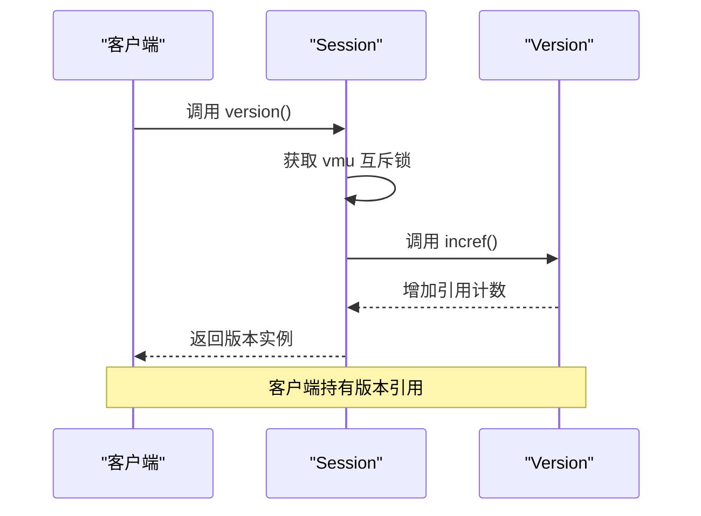
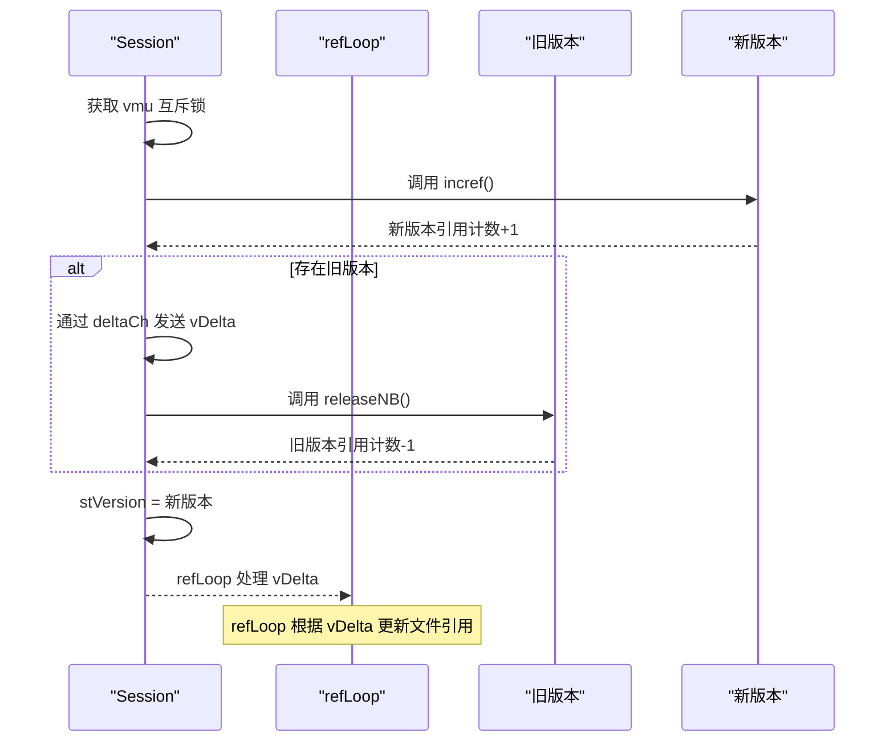
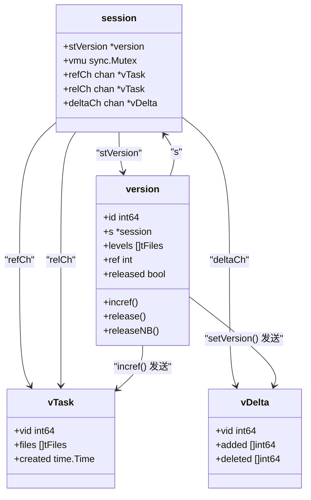
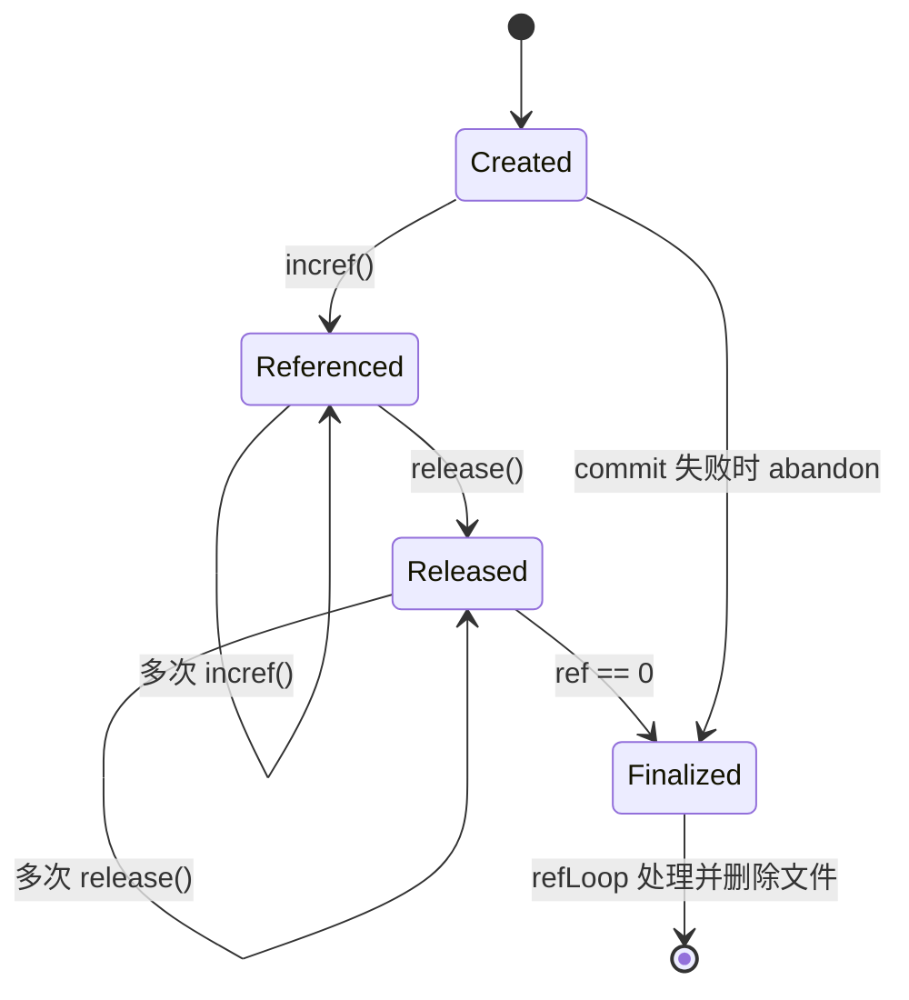
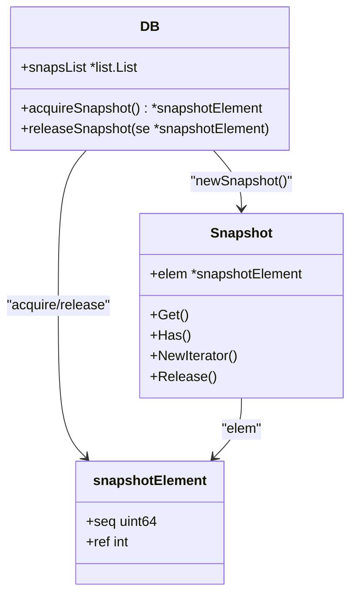
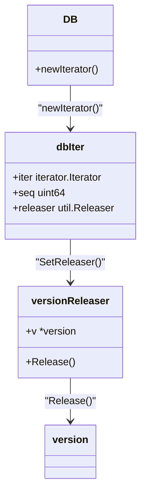

# 版本管理

<cite>
**本文档引用的文件**   
- [session.go](file://leveldb\session.go)
- [version.go](file://leveldb\version.go)
- [db_snapshot.go](file://leveldb\db_snapshot.go)
- [db_iter.go](file://leveldb\db_iter.go)
- [session_util.go](file://leveldb\session_util.go)
- [db.go](file://leveldb\db.go)
- [key.go](file://leveldb\key.go)
- [mlsm_version_history_test.go](file://leveldb\mlsm_version_history_test.go)
</cite>

## 目录
1. [简介](#简介)
2. [版本管理机制](#版本管理机制)
3. [核心方法实现](#核心方法实现)
4. [版本引用计数与安全访问](#版本引用计数与安全访问)
5. [版本变更与delta传播](#版本变更与delta传播)
6. [版本生命周期](#版本生命周期)
7. [多版本并发访问示例](#多版本并发访问示例)
8. [快照与迭代器中的版本管理](#快照与迭代器中的版本管理)

## 简介
avccDB的Session组件实现了复杂的版本管理机制，用于管理数据库在不同时间点的状态。该机制通过`stVersion`字段和一系列核心方法（如`version()`、`setVersion()`）来实现版本的创建、切换和释放。版本管理不仅支持传统的快照功能，还扩展了对多版本数据的管理，允许查询特定版本或版本范围内的数据，这对于需要数据溯源和历史查询的应用场景至关重要。

## 版本管理机制
avccDB的版本管理基于LevelDB的架构，通过`session`结构体中的`stVersion`字段来维护当前版本。每个版本（`version`结构体）代表数据库在某一时刻的完整状态，包含所有SSTable文件的层级分布。版本的变更通过创建新版本来实现，而不是直接修改现有版本，这保证了版本的不可变性（immutability），从而支持多版本并发访问。

版本管理的核心在于`version`结构体，它包含以下关键字段：
- `id`：唯一且单调递增的版本ID。
- `s`：指向所属的`session`。
- `levels`：一个切片，存储了各个层级的SSTable文件列表。
- `ref`：引用计数，用于跟踪有多少个对象（如迭代器、快照）正在使用此版本。
- `released`：标记该版本是否已被释放。

当数据库发生写入或合并操作时，会生成一个新的版本。这个过程通过`versionStaging`结构体来暂存变更，然后调用`finish()`方法生成最终的`version`实例。新版本会继承旧版本的大部分文件，并根据变更记录（`sessionRecord`）添加新文件或删除旧文件。

**Section sources**
- [session.go](file://leveldb\session.go#L37-L65)
- [version.go](file://leveldb\version.go#L26-L43)

## 核心方法实现
版本管理的核心方法包括`version()`和`setVersion()`，它们分别用于获取当前版本和设置新的当前版本。

### version() 方法
`version()`方法用于获取当前的版本实例。它首先通过`vmu`互斥锁锁定`session`，然后调用当前版本的`incref()`方法增加其引用计数，最后返回版本实例。调用者在使用完版本后，必须调用其`release()`方法来减少引用计数。



**Diagram sources**
- [session_util.go](file://leveldb\session_util.go#L253-L258)

### setVersion() 方法
`setVersion()`方法用于将数据库的当前版本切换到一个新的版本。这是一个关键的线程安全操作，其流程如下：
1. 获取`vmu`互斥锁。
2. 调用新版本的`incref()`方法，确保新版本在被设置前不会被释放。
3. 如果存在旧版本，则通过`deltaCh`通道发送一个`vDelta`消息，该消息包含了从旧版本到新版本的文件变更（新增和删除的文件号）。
4. 调用旧版本的`releaseNB()`方法，减少其引用计数。
5. 将`session`的`stVersion`字段指向新版本。



**Diagram sources**
- [session_util.go](file://leveldb\session_util.go#L267-L295)

## 版本引用计数与安全访问
为了保证版本的安全访问，avccDB实现了一套基于引用计数和互斥锁的机制。

### vmu互斥锁
`session`结构体中的`vmu`互斥锁是版本管理的基石。它保护了所有对`stVersion`字段的读写操作，确保了`version()`和`setVersion()`方法的原子性。任何需要读取或修改当前版本的操作都必须先获取此锁。

### 引用计数 (ref)
每个`version`实例都维护一个`ref`计数器。当一个对象（如迭代器或快照）开始使用一个版本时，会调用该版本的`incref()`方法。当不再需要时，必须调用`release()`方法。`release()`方法会减少引用计数，当计数降为0时，该版本会被标记为可释放。

`incref()`方法的实现非常巧妙。它不仅增加`ref`计数，还会将版本信息（包括其`id`和包含的文件列表）通过`refCh`通道发送给后台的`refLoop`协程。`refLoop`负责维护所有被引用版本的文件引用计数，确保SSTable文件在被任何版本引用时都不会被物理删除。



**Diagram sources**
- [session.go](file://leveldb\session.go#L37-L65)
- [version.go](file://leveldb\version.go#L26-L43)
- [session_util.go](file://leveldb\session_util.go#L57-L68)

## 版本变更与delta传播
当数据库状态发生变化（如完成一次合并操作）时，会通过`commit()`方法提交一个`sessionRecord`，从而触发版本的变更。这个过程会生成一个新的版本，并通过`deltaCh`通道传播变更信息。

`deltaCh`通道接收`vDelta`结构体，它包含了：
- `vid`：发生变更的旧版本的ID。
- `added`：在此变更中新增的SSTable文件号列表。
- `deleted`：在此变更中删除的SSTable文件号列表。

后台的`refLoop`协程会监听`deltaCh`。当收到`vDelta`消息时，它会根据`vid`找到对应的版本任务，并应用这些变更。具体来说，它会为`added`列表中的每个文件号增加文件引用计数，为`deleted`列表中的每个文件号减少引用计数。当一个文件的引用计数降为0时，`refLoop`会调用`tops.remove()`将其从文件系统中移除。

这种delta传播机制极大地优化了性能。它避免了在每次版本切换时都遍历所有文件来更新引用计数，而是只处理发生变化的文件。

**Section sources**
- [session.go](file://leveldb\session.go#L210-L242)
- [session_util.go](file://leveldb\session_util.go#L275-L289)

## 版本生命周期
版本的生命周期从创建开始，到所有引用被释放并被`refLoop`处理后结束。下图展示了版本从创建到最终被删除的完整流程。



1. **创建 (Created)**：通过`newVersion()`或`spawn()`方法创建一个新版本，此时`ref`为0。
2. **被引用 (Referenced)**：当`version()`被调用时，`incref()`被触发，`ref`计数增加。一个版本可以被多个对象同时引用。
3. **被释放 (Released)**：当使用者调用`release()`时，`ref`计数减少。只要`ref`大于0，该版本就处于活跃状态。
4. **最终化 (Finalized)**：当`ref`计数降为0时，版本进入最终化阶段。`refLoop`协程会处理与该版本相关的所有`vDelta`，更新文件引用计数，并可能删除不再被任何版本引用的SSTable文件。

**Diagram sources**
- [version.go](file://leveldb\version.go#L52-L89)
- [session_util.go](file://leveldb\session_util.go#L70-L248)

## 多版本并发访问示例
avccDB的版本管理机制天然支持多版本并发访问。以下是一个代码示例，展示了多个goroutine如何安全地访问不同版本的数据库：

```go
// 示例代码路径: leveldb\mlsm_version_history_test.go
// 此示例展示了如何并发地查询不同版本的数据

// 启动多个goroutine进行并发读取
for i := 0; i < 10; i++ {
    go func() {
        // 获取当前版本
        v := s.version()
        defer v.release() // 确保释放引用
        
        // 在此版本上执行读取操作
        // 由于版本是不可变的，即使数据库在后台发生变更，
        // 此goroutine看到的数据也是一致的。
        value, err := db.get(nil, nil, key, 0, v.id, ro)
        // 处理结果...
    }()
}
```

在这个例子中，每个goroutine通过`version()`获取当前版本并增加其引用计数。即使在goroutine执行期间，`setVersion()`被调用创建了新版本，旧版本也不会被立即删除，因为它的`ref`计数大于0。这保证了每个goroutine都能看到一个一致的、隔离的数据库视图。

**Section sources**
- [mlsm_version_history_test.go](file://leveldb\mlsm_version_history_test.go#L253-L320)

## 快照与迭代器中的版本管理
版本管理机制是avccDB快照（Snapshot）和迭代器（Iterator）功能的基础。

### 快照 (Snapshot)
`Snapshot`结构体通过在创建时获取一个`version`实例来实现。`acquireSnapshot()`方法会获取当前的序列号（seq），并将其与一个引用计数关联。当用户通过快照读取数据时，系统会使用这个固定的序列号来查找数据，从而保证读取到的是创建快照时的数据状态。



**Diagram sources**
- [db_snapshot.go](file://leveldb\db_snapshot.go#L21-L188)

### 迭代器 (Iterator)
迭代器在创建时也会获取一个版本引用。`newIterator()`方法会调用`version()`来获取当前版本，并将该版本的引用传递给`versionReleaser`。当迭代器被释放时，`versionReleaser`会自动调用版本的`release()`方法。



**Diagram sources**
- [db_iter.go](file://leveldb\db_iter.go#L108-L393)