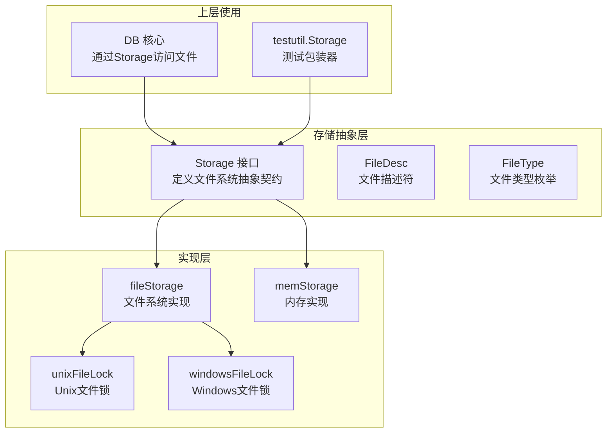
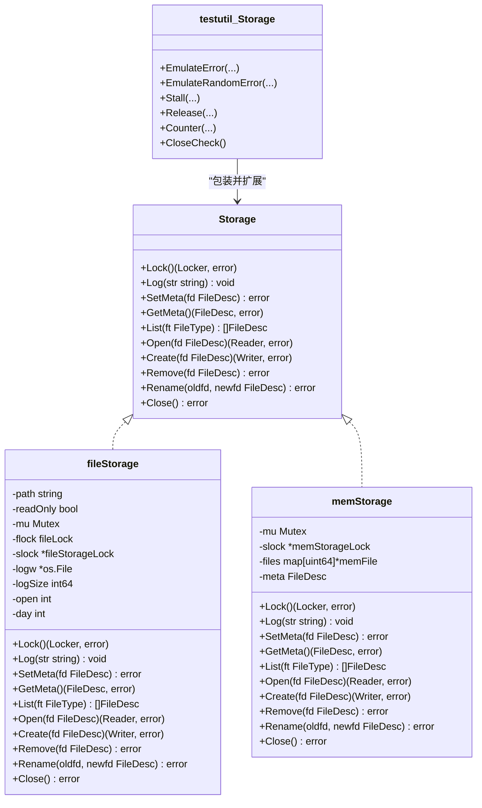
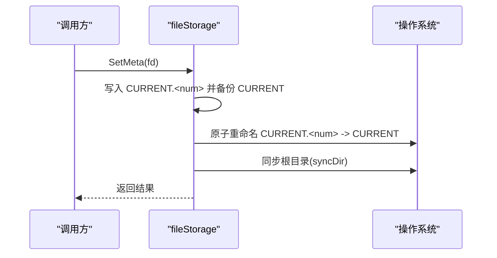
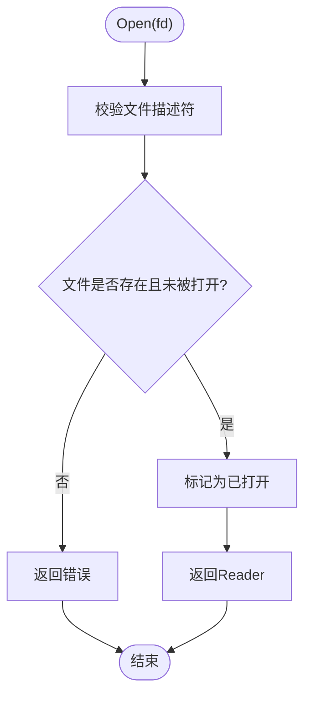
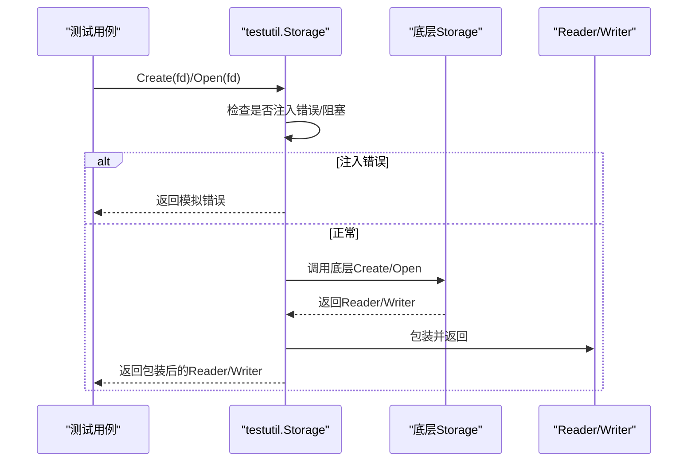
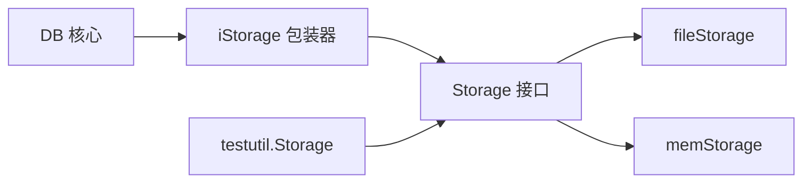

# Storage组件

<cite>
**本文引用的文件列表**
- [storage.go](file://leveldb/storage/storage.go)
- [file_storage.go](file://leveldb/storage/file_storage.go)
- [file_storage_unix.go](file://leveldb/storage/file_storage_unix.go)
- [file_storage_windows.go](file://leveldb/storage/file_storage_windows.go)
- [mem_storage.go](file://leveldb/storage/mem_storage.go)
- [storage.go](file://leveldb/storage.go)
- [storage.go](file://leveldb/testutil/storage.go)
- [file_storage_test.go](file://leveldb/storage/file_storage_test.go)
- [mem_storage_test.go](file://leveldb/storage/mem_storage_test.go)
</cite>

## 目录
1. [简介](#简介)
2. [项目结构](#项目结构)
3. [核心组件](#核心组件)
4. [架构总览](#架构总览)
5. [详细组件分析](#详细组件分析)
6. [依赖关系分析](#依赖关系分析)
7. [性能考量](#性能考量)
8. [故障排查指南](#故障排查指南)
9. [结论](#结论)
10. [附录](#附录)

## 简介
本文件面向avccDB的Storage组件，聚焦于其作为存储层抽象的设计与实现。Storage接口定义了数据库与底层文件系统之间的统一契约，包括锁管理、日志、元数据、文件列举、打开/创建/删除/重命名等核心能力，并通过fileStorage（文件系统实现）与memStorage（内存实现）分别适配真实磁盘与测试场景。本文将系统阐述：
- Storage接口的契约与行为规范
- fileStorage与memStorage的实现差异与适用场景
- 跨平台文件系统操作（Unix、Windows）的适配策略
- 接口设计与实现类图
- 在测试中的应用（testutil.Storage的错误注入与并发控制）
- 对数据库可靠性与可测试性的贡献

## 项目结构
Storage相关代码位于leveldb/storage目录，包含：
- 抽象接口与类型定义：storage.go
- 文件系统实现：file_storage.go 及平台特化文件 file_storage_unix.go、file_storage_windows.go
- 内存实现：mem_storage.go
- 测试与测试工具：file_storage_test.go、mem_storage_test.go、testutil/storage.go

图表来源
- [storage.go](file://leveldb/storage/storage.go#L140-L189)
- [file_storage.go](file://leveldb/storage/file_storage.go#L71-L145)
- [mem_storage.go](file://leveldb/storage/mem_storage.go#L34-L80)
- [file_storage_unix.go](file://leveldb/storage/file_storage_unix.go#L17-L49)
- [file_storage_windows.go](file://leveldb/storage/file_storage_windows.go#L24-L53)
- [storage.go](file://leveldb/storage.go#L8-L35)
- [storage.go](file://leveldb/testutil/storage.go#L246-L335)

章节来源
- [storage.go](file://leveldb/storage/storage.go#L140-L189)
- [file_storage.go](file://leveldb/storage/file_storage.go#L71-L145)
- [mem_storage.go](file://leveldb/storage/mem_storage.go#L34-L80)
- [file_storage_unix.go](file://leveldb/storage/file_storage_unix.go#L17-L49)
- [file_storage_windows.go](file://leveldb/storage/file_storage_windows.go#L24-L53)
- [storage.go](file://leveldb/storage.go#L8-L35)
- [storage.go](file://leveldb/testutil/storage.go#L246-L335)

## 核心组件
- Storage接口：定义锁、日志、元数据、文件列举、打开/创建/删除/重命名、关闭等方法，保证并发安全。
- fileStorage：基于文件系统的实现，负责文件名解析/生成、CURRENT元数据管理、日志轮转、目录同步、跨平台文件锁与重命名。
- memStorage：基于内存的实现，用于测试与快速验证，提供基本的文件生命周期管理。
- testutil.Storage：对Storage进行包装，提供错误注入、随机错误、并发阻塞、计数统计与关闭检查等测试辅助能力。

章节来源
- [storage.go](file://leveldb/storage/storage.go#L140-L189)
- [file_storage.go](file://leveldb/storage/file_storage.go#L71-L145)
- [mem_storage.go](file://leveldb/storage/mem_storage.go#L34-L80)
- [storage.go](file://leveldb/testutil/storage.go#L246-L335)

## 架构总览
Storage组件通过接口抽象屏蔽底层差异，DB核心仅依赖Storage接口，从而实现“数据库逻辑”与“存储实现”的解耦。fileStorage负责真实持久化，memStorage负责测试隔离，testutil.Storage在测试中提供可控的失败与并发场景。

图表来源
- [storage.go](file://leveldb/storage/storage.go#L140-L189)
- [file_storage.go](file://leveldb/storage/file_storage.go#L71-L145)
- [mem_storage.go](file://leveldb/storage/mem_storage.go#L34-L80)
- [storage.go](file://leveldb/testutil/storage.go#L246-L335)

## 详细组件分析

### Storage接口契约与行为
- Lock/Unlock：提供存储级互斥锁，避免多进程/多实例同时写入；重复加锁应返回锁定错误；释放后可再次获取。
- Log：写入日志，支持按天轮转与阈值切换；只读模式下不写日志。
- SetMeta/GetMeta：以CURRENT/CURRENT.bak/CURRENT.<num>形式原子性更新当前Manifest文件；恢复时优先选择“待提交”文件且目标文件存在；对损坏或缺失目标文件进行错误分类。
- List：列出指定类型的文件，按名称解析并过滤。
- Open/Create/Remove/Rename：对文件进行读写、创建、删除与重命名；对旧文件名兼容处理（表文件历史扩展名）；只读模式禁止写操作。
- Close：确保资源回收，记录未关闭文件警告；释放文件锁。

章节来源
- [storage.go](file://leveldb/storage/storage.go#L140-L189)

### fileStorage实现（文件系统）
- 初始化与路径校验：OpenFile会校验路径是否为目录，非只读时创建目录；尝试获取文件锁（LOCK文件），失败则回滚。
- 日志系统：按天打印分隔行，超过阈值自动轮转LOG与LOG.old；新日志打开后强制重新打印日期。
- 元数据管理：SetMeta采用“先写临时CURRENT.<num>再原子重命名为CURRENT”的策略，并同步根目录；GetMeta按优先级解析CURRENT、CURRENT.bak与待提交文件，校验目标文件存在性。
- 文件操作：Open/Create/Remove/Rename均进行参数校验与只读保护；Remove兼容旧表文件扩展名；Rename通过平台函数实现。
- 平台适配：
  - Unix：使用fcntl flock（共享/独占锁，非阻塞）；目录同步通过打开目录并Sync，忽略EINVAL。
  - Windows：使用CreateFile/MoveFileEx实现文件锁与重命名；目录同步为空操作。
- 目录同步：Manifest文件写入后同步父目录，确保元数据持久化顺序正确。

图表来源
- [file_storage.go](file://leveldb/storage/file_storage.go#L247-L284)
- [file_storage_unix.go](file://leveldb/storage/file_storage_unix.go#L82-L99)
- [file_storage_windows.go](file://leveldb/storage/file_storage_windows.go#L66-L78)

章节来源
- [file_storage.go](file://leveldb/storage/file_storage.go#L71-L145)
- [file_storage.go](file://leveldb/storage/file_storage.go#L247-L284)
- [file_storage_unix.go](file://leveldb/storage/file_storage_unix.go#L17-L49)
- [file_storage_unix.go](file://leveldb/storage/file_storage_unix.go#L82-L99)
- [file_storage_windows.go](file://leveldb/storage/file_storage_windows.go#L24-L53)
- [file_storage_windows.go](file://leveldb/storage/file_storage_windows.go#L66-L78)

### memStorage实现（内存）
- 结构：以map[打包键]memFile存储文件内容，打包键由文件类型与编号组合；维护元数据FileDesc。
- 行为：Lock/Unlock提供存储级互斥；Open/Create/Remove/Rename均进行打开状态检查与互斥；Close为空操作。
- 适用场景：单元测试、快速验证与隔离测试环境。

图表来源
- [mem_storage.go](file://leveldb/storage/mem_storage.go#L94-L110)

章节来源
- [mem_storage.go](file://leveldb/storage/mem_storage.go#L34-L80)
- [mem_storage.go](file://leveldb/storage/mem_storage.go#L94-L110)
- [mem_storage_test.go](file://leveldb/storage/mem_storage_test.go#L15-L72)

### 跨平台文件系统操作
- Unix：
  - 文件锁：OpenFile打开LOCK文件后调用setFileLock设置共享/独占锁；释放时解锁并关闭文件。
  - 重命名：直接使用os.Rename。
  - 目录同步：打开目录并Sync，忽略EINVAL。
- Windows：
  - 文件锁：CreateFile打开或创建LOCK文件句柄；释放时Close句柄。
  - 重命名：MoveFileEx实现替换现有目标文件的重命名。
  - 目录同步：空操作（不支持目录Sync）。

章节来源
- [file_storage_unix.go](file://leveldb/storage/file_storage_unix.go#L17-L49)
- [file_storage_unix.go](file://leveldb/storage/file_storage_unix.go#L63-L80)
- [file_storage_unix.go](file://leveldb/storage/file_storage_unix.go#L82-L99)
- [file_storage_windows.go](file://leveldb/storage/file_storage_windows.go#L24-L53)
- [file_storage_windows.go](file://leveldb/storage/file_storage_windows.go#L66-L78)

### testutil.Storage在测试中的应用
- 错误模拟：支持对Open/Create/Remove/Rename/Read/Write/Sync/Close等操作按模式与文件类型注入固定错误或按概率触发随机错误。
- 并发控制：通过Stall/Release对指定模式与类型的操作进行阻塞与唤醒，模拟网络抖动、磁盘慢IO等场景。
- 统计与审计：对各模式/类型的调用次数与字节数进行累计，便于测试断言与回归分析。
- 关闭检查：Close前断言无未关闭文件，防止资源泄漏；支持保留临时目录以便调试。
- 工厂方法：NewStorage根据配置选择FS或MEM实现，自动分配唯一路径并初始化日志。

图表来源
- [storage.go](file://leveldb/testutil/storage.go#L246-L335)
- [storage.go](file://leveldb/testutil/storage.go#L409-L451)
- [storage.go](file://leveldb/testutil/storage.go#L453-L512)

章节来源
- [storage.go](file://leveldb/testutil/storage.go#L246-L335)
- [storage.go](file://leveldb/testutil/storage.go#L409-L451)
- [storage.go](file://leveldb/testutil/storage.go#L453-L512)
- [storage.go](file://leveldb/testutil/storage.go#L592-L634)
- [storage.go](file://leveldb/testutil/storage.go#L635-L660)
- [storage.go](file://leveldb/testutil/storage.go#L661-L696)

## 依赖关系分析
- Storage接口是DB与具体存储实现的唯一依赖点，DB通过包装器iStorage对读写进行计数统计，体现“关注点分离”。
- fileStorage依赖平台特化模块完成文件锁与重命名；memStorage独立于文件系统，仅依赖内存结构。
- testutil.Storage包装Storage，增加可观测性与可控性，不改变接口契约。

图表来源
- [storage.go](file://leveldb/storage.go#L8-L35)
- [storage.go](file://leveldb/storage/storage.go#L140-L189)
- [file_storage.go](file://leveldb/storage/file_storage.go#L71-L145)
- [mem_storage.go](file://leveldb/storage/mem_storage.go#L34-L80)
- [storage.go](file://leveldb/testutil/storage.go#L246-L335)

章节来源
- [storage.go](file://leveldb/storage.go#L8-L35)
- [storage.go](file://leveldb/storage/storage.go#L140-L189)
- [file_storage.go](file://leveldb/storage/file_storage.go#L71-L145)
- [mem_storage.go](file://leveldb/storage/mem_storage.go#L34-L80)
- [storage.go](file://leveldb/testutil/storage.go#L246-L335)

## 性能考量
- fileStorage：
  - 元数据更新采用原子重命名与目录同步，确保崩溃后一致性；但频繁重命名与目录Sync可能带来额外开销。
  - 日志轮转阈值限制避免日志过大；按天打印分隔行便于定位问题。
  - 打开/关闭文件计数与最终化回收有助于资源管理。
- memStorage：
  - 无磁盘IO，适合高吞吐测试；但无法覆盖磁盘行为差异。
- testutil.Storage：
  - 随机错误与阻塞可放大潜在竞态与异常路径，提升健壮性；需谨慎控制概率与持续时间。

[本节为通用性能讨论，无需列出具体文件来源]

## 故障排查指南
- 常见错误类型：
  - ErrLocked：同一存储多次加锁；确认锁释放后再尝试。
  - ErrClosed：存储已关闭仍调用操作；确保在Close前完成所有操作。
  - ErrCorrupted：CURRENT文件损坏或目标文件缺失；检查文件完整性与命名格式。
  - os.ErrNotExist：文件不存在；核对文件类型与编号。
- 定位手段：
  - 使用testutil.Storage的Counter统计读写次数与字节数，结合日志定位异常。
  - 通过EmulateError/EmulateRandomError注入错误，复现并修复异常分支。
  - 使用Stall/Release控制并发，观察竞态条件与死锁风险。
- 平台差异：
  - Unix：目录Sync可能返回EINVAL，需忽略；文件锁为非阻塞。
  - Windows：MoveFileEx替换现有目标文件；目录Sync为空操作。

章节来源
- [storage.go](file://leveldb/storage/storage.go#L43-L73)
- [file_storage.go](file://leveldb/storage/file_storage.go#L302-L446)
- [file_storage_unix.go](file://leveldb/storage/file_storage_unix.go#L63-L80)
- [file_storage_windows.go](file://leveldb/storage/file_storage_windows.go#L66-L78)
- [storage.go](file://leveldb/testutil/storage.go#L592-L634)
- [storage.go](file://leveldb/testutil/storage.go#L635-L660)

## 结论
Storage组件通过清晰的接口契约与双实现策略，成功将数据库核心逻辑与底层存储细节解耦。fileStorage在真实环境中提供稳健的元数据管理与跨平台适配，memStorage满足测试需求，testutil.Storage进一步增强了可测试性与可靠性。该设计既保证了生产可用性，也为复杂场景下的稳定性验证提供了坚实基础。

[本节为总结性内容，无需列出具体文件来源]

## 附录
- 测试用例要点：
  - file_storage_test：验证文件名生成/解析、元数据设置/获取、锁行为、只读模式等。
  - mem_storage_test：验证内存文件的创建/打开/重命名/删除与打开状态约束。
- 上层集成：
  - DB通过iStorage包装器对读写进行计数统计，体现对存储层的透明增强。

章节来源
- [file_storage_test.go](file://leveldb/storage/file_storage_test.go#L68-L106)
- [file_storage_test.go](file://leveldb/storage/file_storage_test.go#L108-L294)
- [file_storage_test.go](file://leveldb/storage/file_storage_test.go#L296-L321)
- [file_storage_test.go](file://leveldb/storage/file_storage_test.go#L322-L403)
- [mem_storage_test.go](file://leveldb/storage/mem_storage_test.go#L15-L72)
- [mem_storage_test.go](file://leveldb/storage/mem_storage_test.go#L74-L124)
- [storage.go](file://leveldb/storage.go#L8-L35)