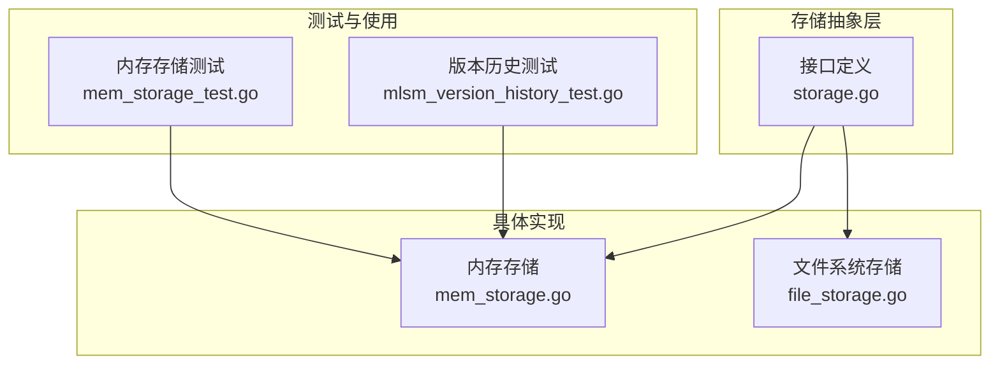
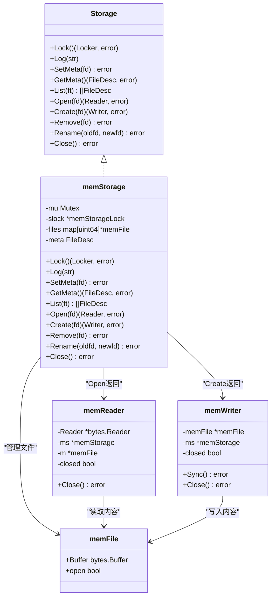
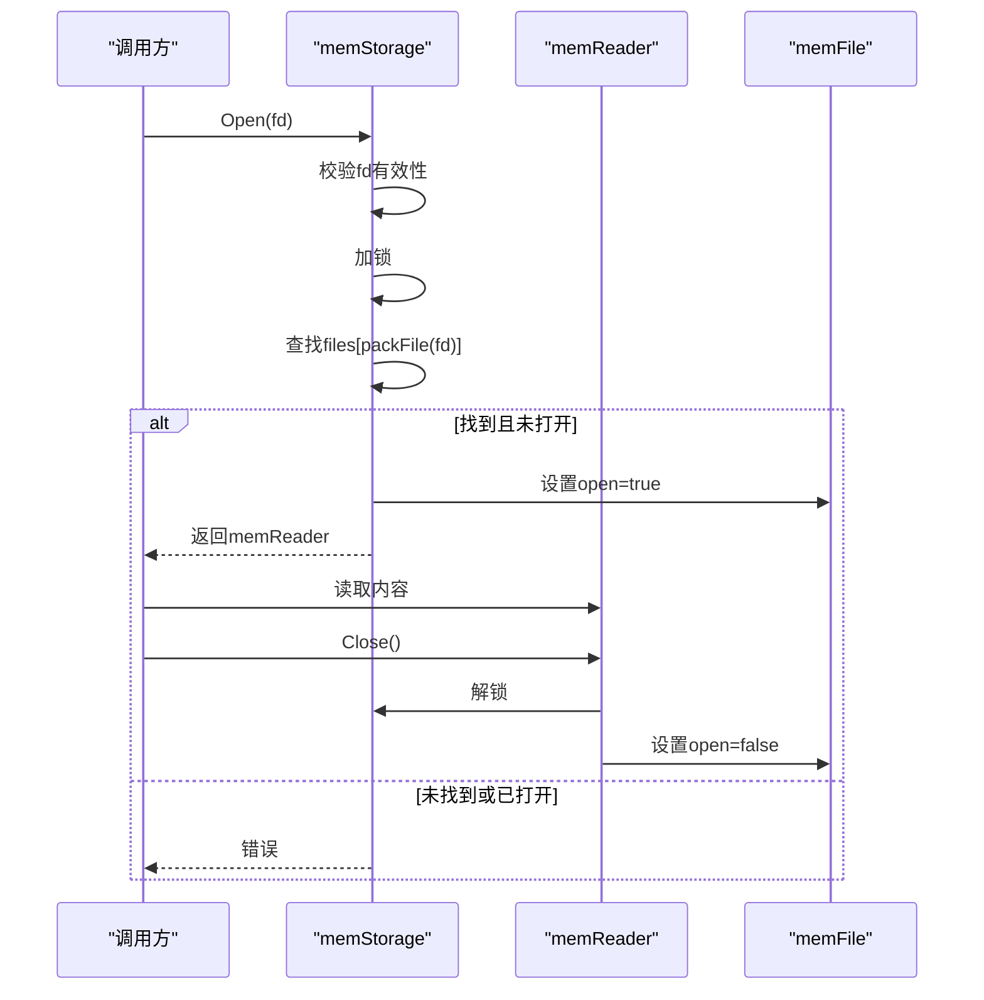
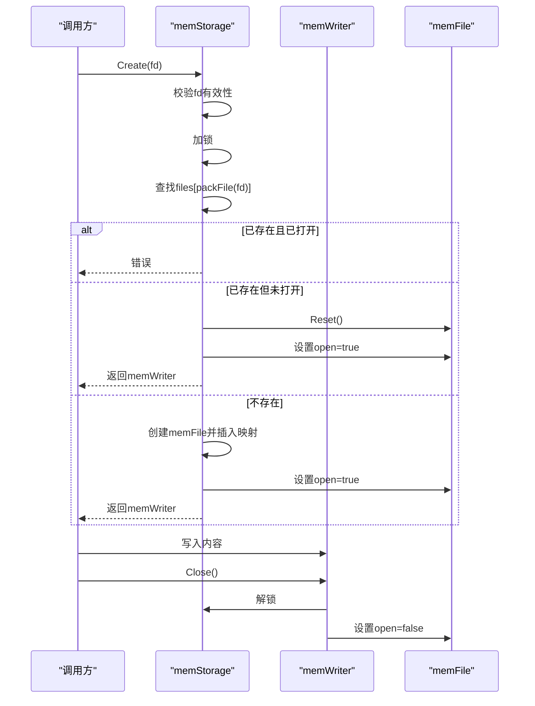
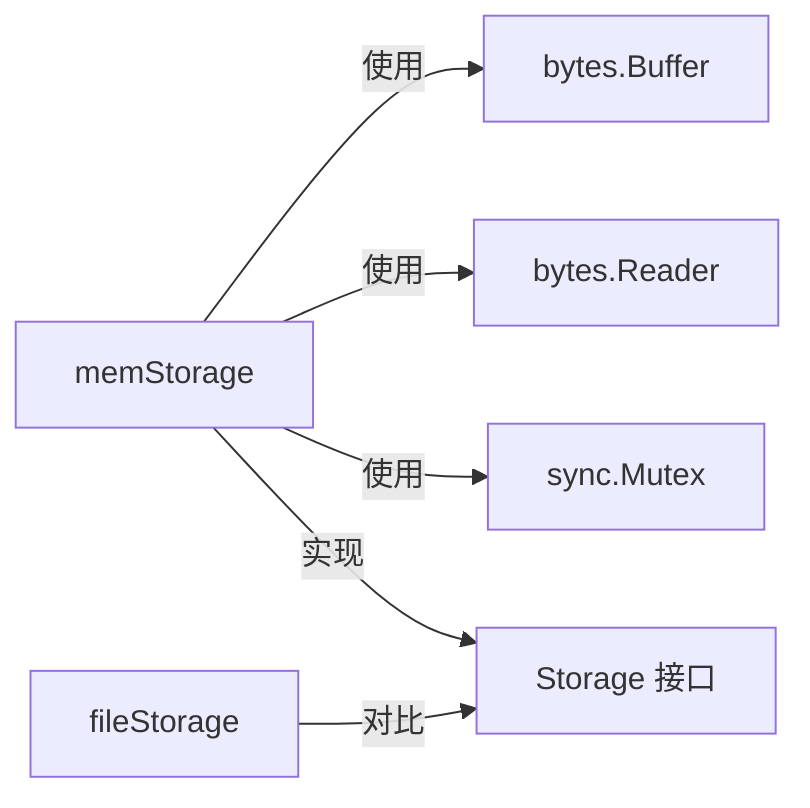

# 内存存储实现

<cite>
**本文引用的文件列表**
- [mem_storage.go](file://leveldb/storage/mem_storage.go)
- [storage.go](file://leveldb/storage/storage.go)
- [mem_storage_test.go](file://leveldb/storage/mem_storage_test.go)
- [file_storage.go](file://leveldb/storage/file_storage.go)
- [mlsm_version_history_test.go](file://leveldb/mlsm_version_history_test.go)
</cite>

## 目录
1. [简介](#简介)
2. [项目结构](#项目结构)
3. [核心组件](#核心组件)
4. [架构总览](#架构总览)
5. [详细组件分析](#详细组件分析)
6. [依赖关系分析](#依赖关系分析)
7. [性能考量](#性能考量)
8. [故障排查指南](#故障排查指南)
9. [结论](#结论)
10. [附录](#附录)

## 简介
本文件面向开发者与测试工程师，系统化阐述内存存储实现（memStorage）的设计目标、实现机制与行为特性。memStorage是LevelDB存储抽象层的一个内存后端实现，用于在不依赖磁盘的情况下进行文件级读写操作，典型用途包括：
- 单元测试：避免磁盘I/O开销与文件系统副作用，提升测试稳定性与速度
- 快速原型验证：在无持久化需求的场景下快速迭代
- 隔离性测试：通过内存文件隔离不同测试用例，避免状态污染

该实现严格遵循Storage接口契约，提供锁、元信息、文件列表、打开/创建/删除/重命名等能力，并以内存中的字节缓冲区模拟文件内容，同时维护文件打开状态以防止并发冲突。

## 项目结构
围绕内存存储实现的关键文件与职责如下：
- 存储接口定义：storage.go 定义了Storage接口及文件类型、错误常量、Reader/Writer/Locker等抽象
- 内存存储实现：mem_storage.go 提供memStorage的具体实现，包含NewMemStorage工厂函数、文件映射、Reader/Writer包装器
- 文件系统存储实现：file_storage.go 提供基于文件系统的存储实现，便于对比与理解
- 测试与使用示例：mem_storage_test.go 展示基本功能测试；mlsm_version_history_test.go 在版本历史测试中直接使用内存存储

图表来源
- [storage.go](file://leveldb/storage/storage.go#L140-L189)
- [mem_storage.go](file://leveldb/storage/mem_storage.go#L42-L221)
- [file_storage.go](file://leveldb/storage/file_storage.go#L73-L145)
- [mem_storage_test.go](file://leveldb/storage/mem_storage_test.go#L15-L72)
- [mlsm_version_history_test.go](file://leveldb/mlsm_version_history_test.go#L12-L20)

章节来源
- [storage.go](file://leveldb/storage/storage.go#L140-L189)
- [mem_storage.go](file://leveldb/storage/mem_storage.go#L42-L221)
- [file_storage.go](file://leveldb/storage/file_storage.go#L73-L145)
- [mem_storage_test.go](file://leveldb/storage/mem_storage_test.go#L15-L72)
- [mlsm_version_history_test.go](file://leveldb/mlsm_version_history_test.go#L12-L20)

## 核心组件
- Storage接口：定义锁、日志、元信息、文件列表、打开/创建/删除/重命名、关闭等方法
- memStorage：内存存储实现，内部以互斥锁保护状态，以map[打包键]memFile管理内存文件
- memFile：继承自bytes.Buffer，额外维护open标志位
- memReader/memWriter：分别封装bytes.Reader与memFile，负责打开状态与关闭时的清理
- 工具函数packFile/unpackFile：将FileDesc的类型与编号打包为uint64键，反向解包还原

章节来源
- [storage.go](file://leveldb/storage/storage.go#L140-L189)
- [mem_storage.go](file://leveldb/storage/mem_storage.go#L34-L221)

## 架构总览
memStorage通过以下方式实现Storage接口：
- 初始化：NewMemStorage创建memStorage实例并初始化空的文件映射
- 文件管理：以packFile(fd)为键，将FileDesc映射到memFile；List遍历map并按类型过滤
- 打开/创建：Open返回基于memFile内容的bytes.Reader包装；Create返回写入memFile的Writer包装
- 并发控制：所有公共方法均加锁；文件打开状态由memFile.open维护，防止重复打开或重命名时文件仍被占用
- 元信息：SetMeta/GetMeta简单地保存/读取FileDesc（不涉及磁盘）

图表来源
- [storage.go](file://leveldb/storage/storage.go#L140-L189)
- [mem_storage.go](file://leveldb/storage/mem_storage.go#L34-L221)

## 详细组件分析

### NewMemStorage与初始化流程
- NewMemStorage返回一个新的memStorage实例，内部初始化空的文件映射，确保后续Create/Open/Rename/Remove等操作可直接使用
- 初始化时未设置meta，GetMeta在meta为空时返回“不存在”错误

章节来源
- [mem_storage.go](file://leveldb/storage/mem_storage.go#L42-L47)
- [mem_storage.go](file://leveldb/storage/mem_storage.go#L61-L79)

### 文件映射与键打包策略
- packFile将FileDesc的Num左移typeShift位并与Type按位或，形成唯一键；unpackFile逆向还原
- typeShift保证TypeAll覆盖所有FileType枚举值，避免键冲突
- files映射表以打包键为索引，值为memFile（含内容与打开状态）

章节来源
- [mem_storage.go](file://leveldb/storage/mem_storage.go#L15-L21)
- [mem_storage.go](file://leveldb/storage/mem_storage.go#L215-L221)

### Open：返回内存Reader的内部机制
- 参数校验：若FileDesc无效则返回错误
- 加锁：进入临界区
- 查找：根据packFile(fd)查找memFile
- 打开状态检查：若memFile.open为true，返回“文件已打开”错误
- 设置打开状态：标记memFile.open为true
- 返回：构造memReader，内部持有memFile指针与memStorage指针，以便在Close时解除打开状态

图表来源
- [mem_storage.go](file://leveldb/storage/mem_storage.go#L94-L109)
- [mem_storage.go](file://leveldb/storage/mem_storage.go#L180-L195)

章节来源
- [mem_storage.go](file://leveldb/storage/mem_storage.go#L94-L109)
- [mem_storage.go](file://leveldb/storage/mem_storage.go#L180-L195)

### Create：返回内存Writer的内部机制
- 参数校验：若FileDesc无效则返回错误
- 加锁：进入临界区
- 查找：根据packFile(fd)查找memFile
- 若存在且已打开：返回“文件已打开”错误
- 若存在且未打开：Reset清空内容
- 若不存在：创建新memFile并插入映射
- 设置打开状态：标记memFile.open为true
- 返回：构造memWriter，内部持有memFile与memStorage指针，以便在Close时解除打开状态

图表来源
- [mem_storage.go](file://leveldb/storage/mem_storage.go#L111-L131)
- [mem_storage.go](file://leveldb/storage/mem_storage.go#L197-L213)

章节来源
- [mem_storage.go](file://leveldb/storage/mem_storage.go#L111-L131)
- [mem_storage.go](file://leveldb/storage/mem_storage.go#L197-L213)

### List：列出匹配类型的文件
- 加锁：进入临界区
- 遍历files映射：对每个键执行unpackFile还原FileDesc
- 类型过滤：仅保留Type与请求类型ft按位与非零的文件
- 解锁：返回结果切片

章节来源
- [mem_storage.go](file://leveldb/storage/mem_storage.go#L81-L92)

### SetMeta/GetMeta：元信息管理
- SetMeta：校验fd有效性后，将meta字段赋值为传入fd
- GetMeta：若meta为零值则返回“不存在”，否则返回meta

章节来源
- [mem_storage.go](file://leveldb/storage/mem_storage.go#L61-L79)

### Remove/Rename：文件删除与重命名
- Remove：校验fd有效性，加锁后查找并删除对应键；若不存在返回“不存在”
- Rename：校验fd有效性且oldfd≠newfd；加锁后检查old/new是否处于打开状态，若任一打开则返回“文件已打开”；否则删除旧键并插入新键

章节来源
- [mem_storage.go](file://leveldb/storage/mem_storage.go#L133-L171)

### Close：存储关闭
- Close方法当前为空实现，表示内存存储无需资源释放

章节来源
- [mem_storage.go](file://leveldb/storage/mem_storage.go#L173-L173)

### Reader/Writer生命周期与并发安全
- memReader.Close：加锁后检查是否已关闭，若未关闭则将对应memFile.open置为false
- memWriter.Close：加锁后检查是否已关闭，若未关闭则将对应memFile.open置为false
- memWriter.Sync：当前实现为空操作

章节来源
- [mem_storage.go](file://leveldb/storage/mem_storage.go#L180-L213)

### 锁机制与并发控制
- memStorage.Lock：支持单实例独占锁；若已有锁则返回“已锁定”错误
- Unlock：释放锁，将slock置空

章节来源
- [mem_storage.go](file://leveldb/storage/mem_storage.go#L49-L57)

## 依赖关系分析
- memStorage依赖bytes.Reader/bytes.Buffer实现内存读写
- memStorage依赖互斥锁保证并发安全
- memStorage依赖Storage接口契约，确保与上层DB模块的兼容性
- file_storage.go提供文件系统实现作为对比参考

图表来源
- [mem_storage.go](file://leveldb/storage/mem_storage.go#L34-L221)
- [storage.go](file://leveldb/storage/storage.go#L140-L189)
- [file_storage.go](file://leveldb/storage/file_storage.go#L73-L145)

章节来源
- [mem_storage.go](file://leveldb/storage/mem_storage.go#L34-L221)
- [storage.go](file://leveldb/storage/storage.go#L140-L189)
- [file_storage.go](file://leveldb/storage/file_storage.go#L73-L145)

## 性能考量
- 读写延迟
  - 内存存储：Open/Create均直接基于内存缓冲区，无磁盘I/O，延迟极低
  - 文件系统存储：Open/Create需要系统调用打开文件、分配句柄，存在系统调用与内核调度开销
- 吞吐量
  - 内存存储：在高并发写入场景下，由于仅受Go运行时调度与互斥锁影响，通常具备更高吞吐
  - 文件系统存储：受磁盘写入速度、文件系统缓存策略、同步策略等因素影响
- 数据易失性
  - 内存存储：进程内存中的数据在进程退出或显式释放前不会持久化，适合短时测试与原型
- 容量限制
  - 内存存储：受限于可用内存大小，大文件或大量文件会快速消耗内存
- 同步语义
  - memWriter.Sync当前为空实现；fileWrap.Sync在特定类型文件时会触发目录同步，增强可靠性但增加延迟

章节来源
- [mem_storage.go](file://leveldb/storage/mem_storage.go#L203-L203)
- [file_storage.go](file://leveldb/storage/file_storage.go#L591-L604)

## 故障排查指南
- 常见错误与定位
  - “文件已打开”：Open/Create在同一文件上重复调用或Rename时文件仍被占用
  - “已锁定”：同一实例多次Lock导致
  - “不存在”：Open/Remove/Rename针对不存在的文件或键
  - “已关闭”：对已关闭的Reader/Writer再次操作
- 调试建议
  - 使用mem_storage_test.go中的测试用例作为参考，逐步复现问题
  - 在调用Open/Create前确认文件是否已被打开
  - 在调用Rename前确认old/new文件均未处于打开状态
  - 对于并发场景，确保外部逻辑避免同时对同一文件执行Open/Create

章节来源
- [mem_storage.go](file://leveldb/storage/mem_storage.go#L94-L109)
- [mem_storage.go](file://leveldb/storage/mem_storage.go#L111-L131)
- [mem_storage.go](file://leveldb/storage/mem_storage.go#L148-L171)
- [mem_storage.go](file://leveldb/storage/mem_storage.go#L180-L213)
- [mem_storage_test.go](file://leveldb/storage/mem_storage_test.go#L15-L72)

## 结论
memStorage通过简洁的内存映射与严格的打开状态管理，实现了对Storage接口的完整模拟。它在单元测试与快速原型场景中具有显著优势：低延迟、高吞吐、无磁盘依赖。但需注意其数据易失性与内存容量限制，在生产环境中应谨慎使用。与fileStorage相比，memStorage在读写延迟与吞吐量方面具备明显优势，但在可靠性与持久化方面无法替代文件系统存储。

## 附录
- 使用示例参考
  - 版本历史测试中直接使用NewMemStorage创建内存存储实例，随后打开数据库进行版本历史查询
- 关键路径参考
  - NewMemStorage初始化：[mem_storage.go](file://leveldb/storage/mem_storage.go#L42-L47)
  - Open返回Reader：[mem_storage.go](file://leveldb/storage/mem_storage.go#L94-L109)
  - Create返回Writer：[mem_storage.go](file://leveldb/storage/mem_storage.go#L111-L131)
  - List/Remove/Rename：[mem_storage.go](file://leveldb/storage/mem_storage.go#L81-L92), [mem_storage.go](file://leveldb/storage/mem_storage.go#L133-L171)
  - 元信息管理：[mem_storage.go](file://leveldb/storage/mem_storage.go#L61-L79)
  - Reader/Writer生命周期：[mem_storage.go](file://leveldb/storage/mem_storage.go#L180-L213)
  - 接口契约定义：[storage.go](file://leveldb/storage/storage.go#L140-L189)
  - 文件系统存储对比：[file_storage.go](file://leveldb/storage/file_storage.go#L73-L145)

章节来源
- [mlsm_version_history_test.go](file://leveldb/mlsm_version_history_test.go#L12-L20)
- [mem_storage.go](file://leveldb/storage/mem_storage.go#L42-L221)
- [storage.go](file://leveldb/storage/storage.go#L140-L189)
- [file_storage.go](file://leveldb/storage/file_storage.go#L73-L145)