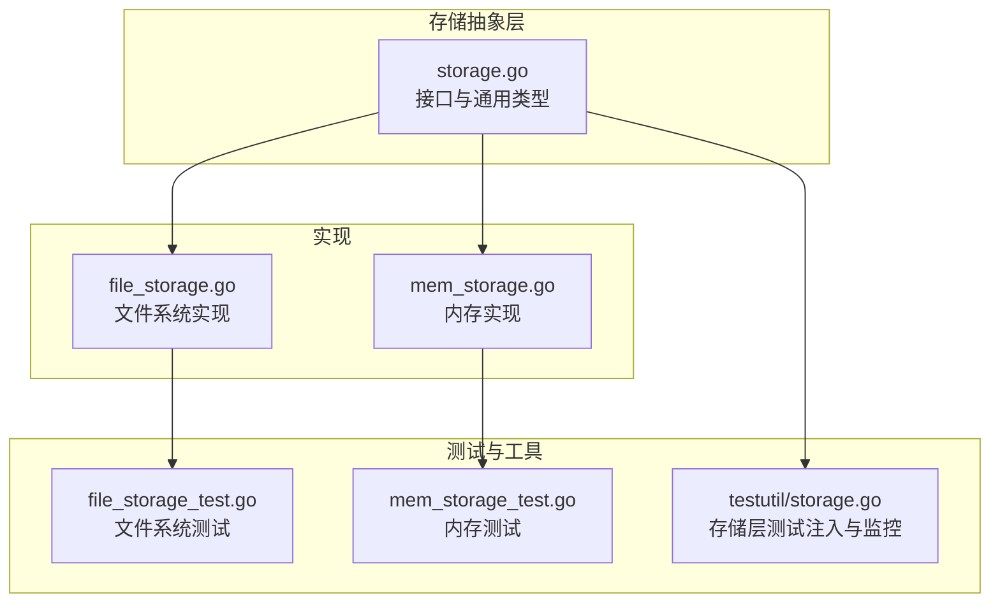
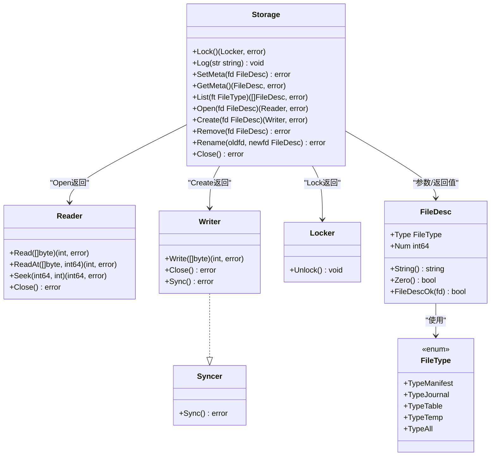
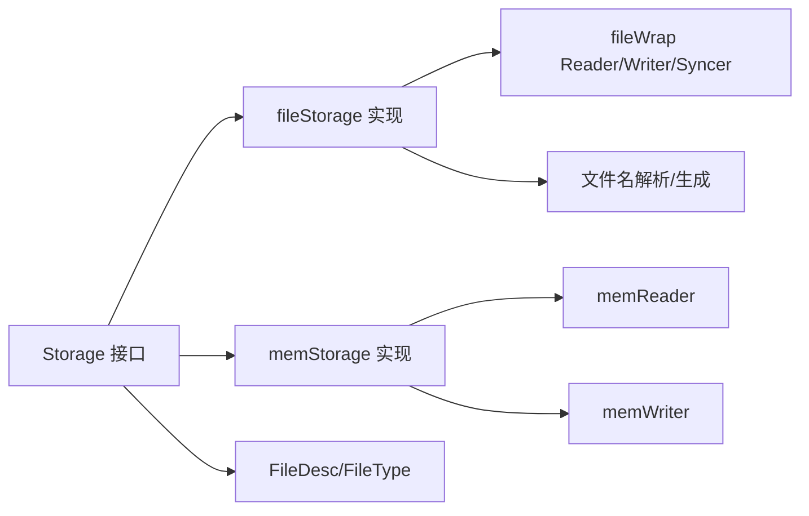

# 存储接口

<cite>
**本文引用的文件列表**
- [storage.go](file://leveldb/storage/storage.go)
- [file_storage.go](file://leveldb/storage/file_storage.go)
- [mem_storage.go](file://leveldb/storage/mem_storage.go)
- [file_storage_test.go](file://leveldb/storage/file_storage_test.go)
- [mem_storage_test.go](file://leveldb/storage/mem_storage_test.go)
- [storage.go](file://leveldb/testutil/storage.go)
</cite>

## 目录
1. [简介](#简介)
2. [项目结构](#项目结构)
3. [核心组件](#核心组件)
4. [架构总览](#架构总览)
5. [详细组件分析](#详细组件分析)
6. [依赖关系分析](#依赖关系分析)
7. [性能考量](#性能考量)
8. [故障排查指南](#故障排查指南)
9. [结论](#结论)

## 简介
本文件面向 avccDB 的存储抽象层，系统性梳理 Storage 接口的设计与实现，重点阐述其作为数据库与底层存储解耦的关键角色。文档覆盖以下内容：
- Storage 接口方法的契约、前置条件、后置条件与错误处理策略
- FileDesc 类型在文件描述中的作用及 FileType 枚举的组合使用
- 与 Reader、Writer、Locker 等接口的关系
- 文件系统与内存两种后端实现（fileStorage、memStorage）的行为差异
- 如何通过接口实现多后端扩展、测试注入与监控埋点

## 项目结构
Storage 抽象位于 leveldb/storage 包中，包含接口定义、文件系统实现、内存实现以及配套测试与工具。

图表来源
- [storage.go](file://leveldb/storage/storage.go#L1-L189)
- [file_storage.go](file://leveldb/storage/file_storage.go#L1-L680)
- [mem_storage.go](file://leveldb/storage/mem_storage.go#L1-L222)
- [file_storage_test.go](file://leveldb/storage/file_storage_test.go#L1-L403)
- [mem_storage_test.go](file://leveldb/storage/mem_storage_test.go#L1-L123)
- [storage.go](file://leveldb/testutil/storage.go#L79-L404)

章节来源
- [storage.go](file://leveldb/storage/storage.go#L1-L189)
- [file_storage.go](file://leveldb/storage/file_storage.go#L1-L680)
- [mem_storage.go](file://leveldb/storage/mem_storage.go#L1-L222)
- [file_storage_test.go](file://leveldb/storage/file_storage_test.go#L1-L403)
- [mem_storage_test.go](file://leveldb/storage/mem_storage_test.go#L1-L123)
- [storage.go](file://leveldb/testutil/storage.go#L79-L404)

## 核心组件
- Storage 接口：统一的存储抽象，定义锁、日志、元数据、文件列举、打开/创建/删除/重命名、关闭等操作。
- FileDesc：文件描述符，由 FileType 和编号组成，用于唯一标识不同类型的文件。
- FileType：文件类型枚举，支持按位或组合，便于 List 按类型过滤。
- Reader/Writer/Syncer/Locker：与 Storage 协作的辅助接口，分别负责读写、同步与加解锁。

章节来源
- [storage.go](file://leveldb/storage/storage.go#L16-L189)

## 架构总览
Storage 将数据库核心逻辑与底层存储实现解耦，通过统一接口屏蔽文件系统差异，支持多后端扩展（如文件系统、内存、云存储等）。接口方法与实现之间的契约清晰，错误类型明确，便于上层进行一致性处理与监控埋点。

图表来源
- [storage.go](file://leveldb/storage/storage.go#L16-L189)

## 详细组件分析

### Storage 接口方法契约与行为语义
- Lock
  - 前置条件：未处于只读模式；若已存在存储级锁则拒绝再次加锁。
  - 后置条件：成功返回 Locker；后续需调用 Unlock 释放。
  - 错误：已锁定时返回特定错误；关闭状态返回关闭错误。
- Log
  - 前置条件：非只读；存储未关闭。
  - 后置条件：写入日志（文件系统实现会进行日志轮转与目录同步）。
  - 错误：只读或关闭状态下不写入。
- SetMeta
  - 前置条件：fd 必须有效；非只读；存储未关闭。
  - 后置条件：原子性更新元数据文件（文件系统实现采用备份与重命名策略）。
  - 错误：无效文件描述、只读、关闭、底层 I/O 错误。
- GetMeta
  - 前置条件：存储未关闭。
  - 后置条件：返回当前有效的元数据文件描述；若不存在或损坏返回相应错误。
  - 错误：不存在、损坏（ErrCorrupted）、关闭、权限等。
- List
  - 前置条件：存储未关闭。
  - 后置条件：返回匹配类型的文件描述集合（支持按位或组合过滤）。
  - 错误：关闭、权限等。
- Open
  - 前置条件：fd 有效；存储未关闭。
  - 后置条件：返回只读 Reader；支持旧文件名兼容（表文件）。
  - 错误：不存在、关闭、底层 I/O 错误。
- Create
  - 前置条件：fd 有效；非只读；存储未关闭。
  - 后置条件：返回写入端 Writer；内部计数器增加。
  - 错误：只读、关闭、底层 I/O 错误。
- Remove
  - 前置条件：fd 有效；非只读；存储未关闭。
  - 后置条件：删除对应文件；支持旧文件名兼容。
  - 错误：只读、关闭、底层 I/O 错误。
- Rename
  - 前置条件：oldfd/newfd 有效；非只读；存储未关闭；oldfd != newfd。
  - 后置条件：重命名文件；内部计数器保持不变。
  - 错误：只读、关闭、底层 I/O 错误。
- Close
  - 前置条件：无。
  - 后置条件：关闭存储，释放锁资源；多次调用安全；禁止继续使用其他方法。
  - 错误：重复关闭返回关闭错误。

章节来源
- [storage.go](file://leveldb/storage/storage.go#L139-L189)
- [file_storage.go](file://leveldb/storage/file_storage.go#L147-L582)
- [mem_storage.go](file://leveldb/storage/mem_storage.go#L49-L173)

### FileDesc 与 FileType
- FileDesc
  - 作用：统一表示文件类型与编号，作为文件标识与路径生成依据。
  - 方法：字符串化、零值判断、有效性校验。
- FileType
  - 定义：枚举常量，支持按位或组合（TypeAll）。
  - 使用：List 过滤、文件名解析与生成、元数据管理。
- 组合使用
  - List(ft) 支持传入多个类型按位或，返回匹配集合。
  - SetMeta/GetMeta 配合元数据文件 CURRENT/CURRENT.bak 与“待重命名”文件，保证原子性与一致性。

章节来源
- [storage.go](file://leveldb/storage/storage.go#L16-L138)
- [file_storage.go](file://leveldb/storage/file_storage.go#L621-L680)

### 文件系统实现（fileStorage）
- 关键特性
  - 文件锁：通过平台锁确保同一目录下仅一个实例运行。
  - 日志：自动轮转与目录同步，保证崩溃后可恢复。
  - 元数据：采用 CURRENT、CURRENT.bak 与 CURRENT.<num> 待重命名文件，实现原子切换。
  - 文件名映射：新旧文件名兼容（表文件）。
  - Reader/Writer：封装 os.File 并在 Manifest 写入后同步父目录。
- 行为要点
  - 打开/创建/删除/重命名均受全局互斥保护与关闭状态检查。
  - 只读模式下禁止写操作与锁竞争。
  - 文件打开计数与关闭状态用于健壮性检测。

章节来源
- [file_storage.go](file://leveldb/storage/file_storage.go#L1-L680)
- [file_storage_test.go](file://leveldb/storage/file_storage_test.go#L1-L403)

### 内存实现（memStorage）
- 关键特性
  - 基于内存字节缓冲区模拟文件系统，适合测试与快速验证。
  - 文件标识打包：将类型与编号打包到 uint64，避免哈希冲突。
  - 打开状态跟踪：防止并发重复打开同一文件。
- 行为要点
  - SetMeta/GetMeta 直接读写内存元数据。
  - Open/Create/Remove/Rename 在内存中完成，不涉及磁盘。
  - Close 对外无副作用。

章节来源
- [mem_storage.go](file://leveldb/storage/mem_storage.go#L1-L222)
- [mem_storage_test.go](file://leveldb/storage/mem_storage_test.go#L1-L123)

### 与 Reader/Writer/Syncer/Locker 的关系
- Reader/Writer/Syncer：Storage.Open 返回 Reader，Storage.Create 返回 Writer（Writer 实现 Syncer），用于读写与同步。
- Locker：Storage.Lock 返回 Locker，调用 Unlock 释放存储级锁。
- 这些接口与 Storage 解耦，便于替换具体实现与注入监控。

章节来源
- [storage.go](file://leveldb/storage/storage.go#L74-L138)

### 多后端扩展与测试注入
- 多后端扩展
  - 通过 Storage 接口屏蔽实现差异，新增后端只需实现接口方法。
- 测试注入与监控
  - testutil 中的 Storage 包装器对 Open/Create/Read/Write/Sync/Close 等操作进行错误模拟、延迟与计数统计，便于压力与故障注入测试。
  - 提供模式枚举（ModeOpen/ModeCreate/...）与类型枚举（TypeManifest/...）组合定位具体操作与文件类型。

章节来源
- [storage.go](file://leveldb/testutil/storage.go#L79-L404)

## 依赖关系分析
- 接口与实现
  - Storage 是抽象，fileStorage 与 memStorage 分别实现之。
  - fileWrap 与 memReader/memWriter 实现 Reader/Writer/Syncer。
- 错误与类型
  - ErrCorrupted、ErrLocked、ErrClosed 等错误类型贯穿接口与实现。
- 文件名解析与生成
  - fsGenName/fsParseName/fsHasOldName/fsGenOldName 负责文件名映射与兼容。

图表来源
- [storage.go](file://leveldb/storage/storage.go#L16-L189)
- [file_storage.go](file://leveldb/storage/file_storage.go#L584-L680)
- [mem_storage.go](file://leveldb/storage/mem_storage.go#L175-L222)

## 性能考量
- 文件系统实现
  - 元数据写入采用备份+重命名+目录同步，保证原子性但有额外 I/O 成本。
  - 日志轮转阈值控制日志文件大小，减少单次写放大。
  - 打开计数与关闭状态检查有助于避免资源泄漏。
- 内存实现
  - 无磁盘 I/O，适合高吞吐测试；注意内存占用随文件数量增长。
- 读写路径
  - Writer.Sync 在 Manifest 类型时同步父目录，确保元数据持久化顺序正确。

章节来源
- [file_storage.go](file://leveldb/storage/file_storage.go#L189-L227)
- [file_storage.go](file://leveldb/storage/file_storage.go#L584-L604)

## 故障排查指南
- 常见错误与定位
  - ErrLocked：存储已被锁定，检查是否已有实例运行或未正确释放锁。
  - ErrClosed：存储已关闭，确认 Close 调用次数与生命周期。
  - ErrCorrupted：元数据文件损坏或目标文件缺失，检查 CURRENT/CURRENT.bak 与目标文件是否存在。
  - os.ErrNotExist：文件不存在或被删除，核对文件名生成规则与编号。
  - 只读错误：在只读模式下调用了写操作（SetMeta/Create/Remove/Rename）。
- 诊断步骤
  - 检查存储状态（是否关闭/锁定）。
  - 校验 FileDesc 是否有效（类型与编号范围）。
  - 查看日志文件（文件系统实现的日志轮转与目录同步）。
  - 使用 testutil 的存储包装器进行错误模拟与延迟注入，复现问题。

章节来源
- [storage.go](file://leveldb/storage/storage.go#L43-L73)
- [file_storage.go](file://leveldb/storage/file_storage.go#L302-L446)
- [file_storage_test.go](file://leveldb/storage/file_storage_test.go#L108-L294)

## 结论
Storage 接口通过清晰的契约与严格的错误语义，实现了数据库核心逻辑与底层存储的彻底解耦。FileDesc 与 FileType 的组合设计使得文件识别与过滤简单可靠；文件系统与内存两种实现展示了多后端扩展能力。配合 testutil 的注入与监控机制，Storage 为测试、故障注入与运维可观测性提供了良好基础。