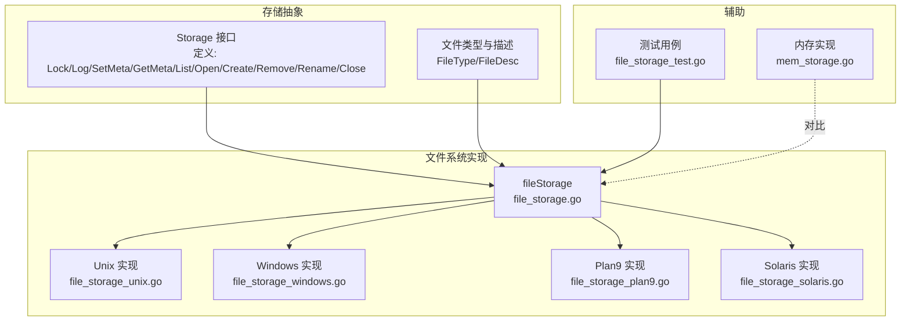
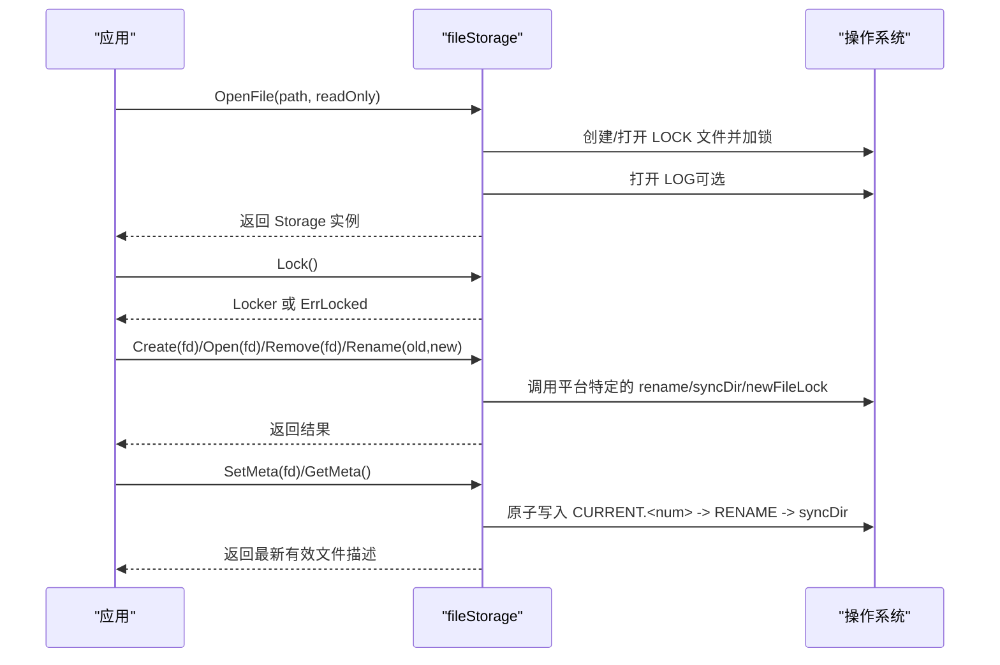
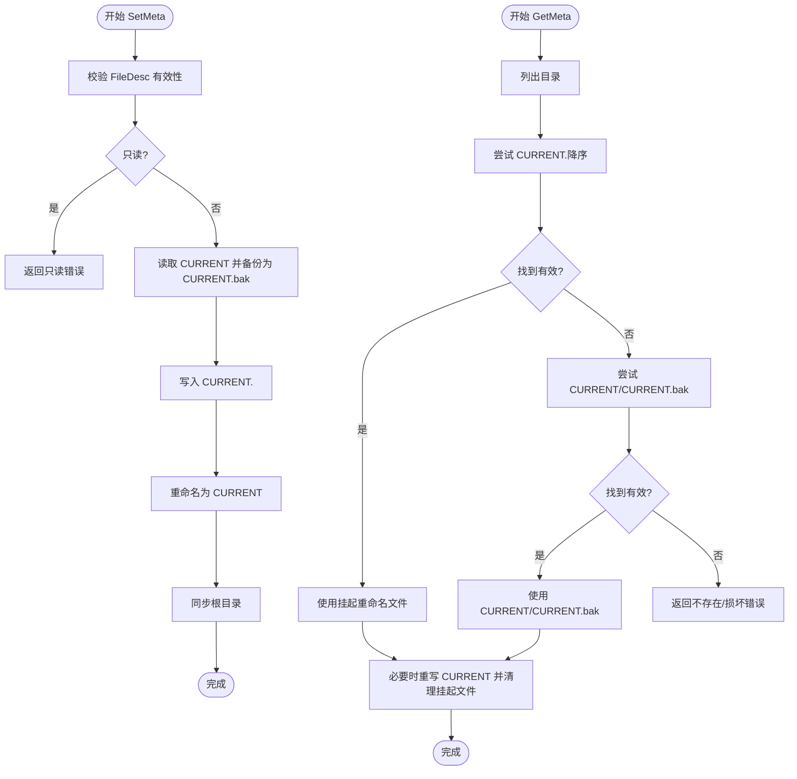
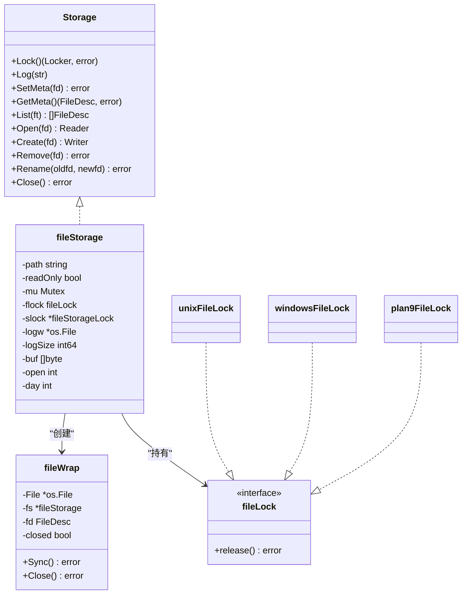

# 文件存储实现

<cite>
**本文引用的文件列表**
- [file_storage.go](file://leveldb/storage/file_storage.go)
- [storage.go](file://leveldb/storage/storage.go)
- [file_storage_unix.go](file://leveldb/storage/file_storage_unix.go)
- [file_storage_windows.go](file://leveldb/storage/file_storage_windows.go)
- [file_storage_plan9.go](file://leveldb/storage/file_storage_plan9.go)
- [file_storage_solaris.go](file://leveldb/storage/file_storage_solaris.go)
- [file_storage_test.go](file://leveldb/storage/file_storage_test.go)
- [mem_storage.go](file://leveldb/storage/mem_storage.go)
</cite>

## 目录
1. [简介](#简介)
2. [项目结构与定位](#项目结构与定位)
3. [核心组件总览](#核心组件总览)
4. [架构概览](#架构概览)
5. [关键组件深度解析](#关键组件深度解析)
6. [依赖关系分析](#依赖关系分析)
7. [性能与可靠性考量](#性能与可靠性考量)
8. [故障排查指南](#故障排查指南)
9. [结论](#结论)

## 简介
本文件聚焦 avccDB 中基于操作系统文件系统的持久化实现——fileStorage。它通过统一的 Storage 接口对外提供文件读写、元数据管理、文件列表与重命名等能力，并以条件编译的方式适配 Unix、Windows、Plan9、Solaris 等平台的文件锁、重命名与目录同步差异。本文将深入解析 Open、Create、Rename 等方法的实现细节，阐述文件锁、权限设置与原子性保障策略；同时详解 SetMeta/GetMeta 的元数据管理机制及如何利用标准文件系统特性确保数据一致性，并结合测试用例与平台差异说明生产环境中的可靠性设计与性能考量。

## 项目结构与定位
- 存储抽象层位于 leveldb/storage，定义了通用接口与文件类型枚举。
- fileStorage 是基于文件系统的具体实现，负责：
  - 文件打开/创建/删除/重命名
  - 元数据 CURRENT 文件的原子更新
  - 日志记录与轮转
  - 平台差异：文件锁、重命名、目录同步
- 其他实现包括内存存储 memStorage，用于测试与对比。

图表来源
- [storage.go](file://leveldb/storage/storage.go#L140-L189)
- [file_storage.go](file://leveldb/storage/file_storage.go#L73-L145)
- [file_storage_unix.go](file://leveldb/storage/file_storage_unix.go#L1-L64)
- [file_storage_windows.go](file://leveldb/storage/file_storage_windows.go#L1-L79)
- [file_storage_plan9.go](file://leveldb/storage/file_storage_plan9.go#L1-L64)
- [file_storage_solaris.go](file://leveldb/storage/file_storage_solaris.go#L1-L83)
- [mem_storage.go](file://leveldb/storage/mem_storage.go#L1-L70)
- [file_storage_test.go](file://leveldb/storage/file_storage_test.go#L1-L120)

章节来源
- [storage.go](file://leveldb/storage/storage.go#L140-L189)
- [file_storage.go](file://leveldb/storage/file_storage.go#L73-L145)

## 核心组件总览
- fileStorage：文件系统持久化实现，持有路径、只读标志、互斥锁、文件锁、日志句柄、打开计数等。
- fileLock 接口与各平台实现：Unix 使用 flock，Windows 使用 CreateFile/MoveFileEx，Plan9 使用独占模式，Solaris 使用 fcntl flock。
- fileWrap：包装 os.File，提供 Sync/Close 行为，并在 Manifest 类型时额外同步父目录。
- SetMeta/GetMeta：通过 CURRENT/CURRENT.bak/CURRENT.<num> 的约定实现原子切换与恢复。

章节来源
- [file_storage.go](file://leveldb/storage/file_storage.go#L73-L145)
- [file_storage_unix.go](file://leveldb/storage/file_storage_unix.go#L1-L64)
- [file_storage_windows.go](file://leveldb/storage/file_storage_windows.go#L1-L79)
- [file_storage_plan9.go](file://leveldb/storage/file_storage_plan9.go#L1-L64)
- [file_storage_solaris.go](file://leveldb/storage/file_storage_solaris.go#L1-L83)

## 架构概览
fileStorage 将“文件系统持久化”与“平台差异”解耦：
- 统一逻辑集中在 file_storage.go，包含 Open、Create、Rename、SetMeta、GetMeta、List、Open、Remove、Close 等。
- 平台差异通过独立文件实现：newFileLock/rename/syncDir/isErrInvalid/setFileLock 等函数按平台替换。

图表来源
- [file_storage.go](file://leveldb/storage/file_storage.go#L94-L145)
- [file_storage_unix.go](file://leveldb/storage/file_storage_unix.go#L28-L64)
- [file_storage_windows.go](file://leveldb/storage/file_storage_windows.go#L32-L79)
- [file_storage_plan9.go](file://leveldb/storage/file_storage_plan9.go#L21-L51)
- [file_storage_solaris.go](file://leveldb/storage/file_storage_solaris.go#L28-L71)

## 关键组件深度解析

### Open 与 Create：文件打开与创建
- Open：根据 FileDesc 生成文件名，优先尝试新命名，若不存在且存在旧命名则回退到旧命名，成功后增加打开计数。
- Create：以截断方式创建文件，权限为 0644，成功后增加打开计数。
- 两者均受互斥锁保护，避免并发冲突；关闭时减少计数并在 Close 中校验未关闭文件数量。

章节来源
- [file_storage.go](file://leveldb/storage/file_storage.go#L473-L517)

### Rename：原子重命名与跨平台差异
- Rename：先做参数校验，再执行平台特定的 rename 操作。fileWrap.Sync 在 Manifest 类型时会同步父目录，确保元数据落盘。
- 平台差异：
  - Unix/Solaris：使用 os.Rename；Solaris 额外处理 flock 语义。
  - Windows：使用 MoveFileExW 替换目标文件，保证原子性。
  - Plan9：若目标存在则先删除再重命名。
  - Solaris：目录同步返回值需忽略特定错误码。

章节来源
- [file_storage.go](file://leveldb/storage/file_storage.go#L546-L563)
- [file_storage_unix.go](file://leveldb/storage/file_storage_unix.go#L63-L64)
- [file_storage_windows.go](file://leveldb/storage/file_storage_windows.go#L66-L76)
- [file_storage_plan9.go](file://leveldb/storage/file_storage_plan9.go#L43-L51)
- [file_storage_solaris.go](file://leveldb/storage/file_storage_solaris.go#L68-L71)

### SetMeta/GetMeta：元数据管理与原子性
- SetMeta 流程：
  - 备份当前 CURRENT -> 写入 CURRENT.<num> -> 原子重命名为 CURRENT -> 同步根目录。
  - 若备份失败或写入失败，保留原 CURRENT 不变，避免损坏。
- GetMeta 流程：
  - 顺序尝试 CURRENT.<num>（降序）、CURRENT、CURRENT.bak。
  - 忽略缺失或损坏文件；若目标文件不存在，视为缺失。
  - 成功后如存在挂起重命名文件，则清理之；必要时重新写回 CURRENT 以修复状态。
- fileWrap.Sync 在 TypeManifest 时同步父目录，确保 MANIFEST 变更持久化。

图表来源
- [file_storage.go](file://leveldb/storage/file_storage.go#L247-L300)
- [file_storage.go](file://leveldb/storage/file_storage.go#L302-L446)
- [file_storage.go](file://leveldb/storage/file_storage.go#L591-L604)

章节来源
- [file_storage.go](file://leveldb/storage/file_storage.go#L247-L300)
- [file_storage.go](file://leveldb/storage/file_storage.go#L302-L446)
- [file_storage.go](file://leveldb/storage/file_storage.go#L591-L604)

### 文件锁与并发控制
- Storage 层级锁：Lock 返回 Locker，同一 Storage 仅允许一个锁；只读模式下返回空锁对象。
- 文件锁：OpenFile 时创建并持有 LOCK 文件锁，阻止其他进程/实例同时访问同一路径。
- fileWrap：跟踪单个文件的打开状态，重复关闭返回 ErrClosed。

章节来源
- [file_storage.go](file://leveldb/storage/file_storage.go#L147-L161)
- [file_storage.go](file://leveldb/storage/file_storage.go#L565-L582)
- [file_storage.go](file://leveldb/storage/file_storage.go#L606-L619)

### 平台差异与条件编译
- Unix/Linux/BSD：flock 加排他/共享锁；rename 直接使用 os.Rename；目录同步通过打开目录并 Sync，忽略特定无效错误。
- Windows：使用 CreateFile 打开/创建 LOCK，MoveFileExW 原子替换重命名；目录同步为空操作。
- Plan9：独占模式打开 LOCK；重命名前删除目标以保证原子性；目录同步打开目录并 Sync。
- Solaris：fcntl flock；rename 直接 os.Rename；目录同步打开目录并 Sync。

章节来源
- [file_storage_unix.go](file://leveldb/storage/file_storage_unix.go#L1-L64)
- [file_storage_windows.go](file://leveldb/storage/file_storage_windows.go#L1-L79)
- [file_storage_plan9.go](file://leveldb/storage/file_storage_plan9.go#L1-L64)
- [file_storage_solaris.go](file://leveldb/storage/file_storage_solaris.go#L1-L83)

### 日志与轮转
- fileStorage 维护 LOG 文件，超过阈值自动轮转（关闭当前 LOG -> 重命名为 LOG.old -> 重新打开新的 LOG），并按天打印分隔信息。
- 日志写入受互斥锁保护，避免并发写入竞争。

章节来源
- [file_storage.go](file://leveldb/storage/file_storage.go#L180-L227)

## 依赖关系分析

图表来源
- [storage.go](file://leveldb/storage/storage.go#L140-L189)
- [file_storage.go](file://leveldb/storage/file_storage.go#L73-L145)
- [file_storage_unix.go](file://leveldb/storage/file_storage_unix.go#L17-L26)
- [file_storage_windows.go](file://leveldb/storage/file_storage_windows.go#L24-L31)
- [file_storage_plan9.go](file://leveldb/storage/file_storage_plan9.go#L13-L20)

章节来源
- [storage.go](file://leveldb/storage/storage.go#L140-L189)
- [file_storage.go](file://leveldb/storage/file_storage.go#L73-L145)

## 性能与可靠性考量

- 原子性保障
  - SetMeta 采用“写临时 -> 原子重命名 -> 同步目录”的三段式，确保即使崩溃也能回到一致状态。
  - Rename 在 Windows 上使用 MoveFileExW，保证覆盖现有目标文件的原子性。
  - GetMeta 支持挂起重命名文件降序回退，避免因中断导致的数据不一致。

- 数据一致性
  - fileWrap.Sync 在 TypeManifest 时同步父目录，满足 LevelDB 对 MANIFEST 变更的强一致要求。
  - syncDir 在 Unix/Linux 上忽略特定无效错误，兼容不同内核行为。

- 并发与资源管理
  - 所有公共方法均受互斥锁保护；fileWrap 记录打开状态，防止重复关闭。
  - Close 清理 finalizer 并检查未关闭文件数量，避免资源泄漏。

- 生产建议
  - 使用只读模式时，OpenFile 会拒绝写操作，适合多实例只读场景。
  - 建议在高并发写入场景下配合合适的文件系统（支持原子重命名与目录同步）。
  - 注意不同平台的文件锁语义差异，避免跨平台部署时出现意外阻塞。

章节来源
- [file_storage.go](file://leveldb/storage/file_storage.go#L247-L300)
- [file_storage.go](file://leveldb/storage/file_storage.go#L546-L563)
- [file_storage.go](file://leveldb/storage/file_storage.go#L591-L604)
- [file_storage_unix.go](file://leveldb/storage/file_storage_unix.go#L82-L99)
- [file_storage_windows.go](file://leveldb/storage/file_storage_windows.go#L66-L79)
- [file_storage_plan9.go](file://leveldb/storage/file_storage_plan9.go#L43-L64)
- [file_storage_solaris.go](file://leveldb/storage/file_storage_solaris.go#L68-L83)

## 故障排查指南

- 常见错误与定位
  - ErrLocked：同一 Storage 已被锁定，需等待释放后再试。
  - ErrClosed：Storage 已关闭，无法继续调用。
  - ErrInvalidFile：传入的 FileDesc 无效（类型或编号非法）。
  - ErrCorrupted：CURRENT 文件损坏或指向不存在的目标文件。
  - os.ErrNotExist：目标文件不存在，或 CURRENT 指向的文件缺失。

- 典型问题与处理
  - 多实例同时启动：OpenFile 会尝试获取 LOCK 文件锁，若失败说明已有实例运行；请检查路径是否正确或等待其他实例退出。
  - SetMeta 失败：检查磁盘空间、权限与文件系统是否支持原子重命名；确认 syncDir 是否报错。
  - Rename 失败：Windows 下 MoveFileExW 失败通常与目标文件被占用有关；Plan9 下重命名前删除目标可解决冲突。
  - GetMeta 返回不存在：确认是否存在 CURRENT/CURRENT.bak 或挂起重命名文件；检查目标文件是否存在。

- 测试参考
  - 元数据读写与回退：测试用例覆盖 CURRENT.<num>、CURRENT、CURRENT.bak 的优先级与损坏处理。
  - 锁定行为：验证同一路径不可重复打开，只读模式下的锁行为。
  - 文件名解析：验证新旧命名格式与解析正确性。

章节来源
- [file_storage_test.go](file://leveldb/storage/file_storage_test.go#L108-L294)
- [file_storage_test.go](file://leveldb/storage/file_storage_test.go#L322-L403)

## 结论
fileStorage 通过统一接口与平台适配，实现了在多种操作系统上的可靠文件持久化。其核心优势在于：
- 以“写临时 -> 原子重命名 -> 同步目录”的方式保障元数据变更的原子性与一致性；
- 通过文件锁与 Storage 锁双重约束，避免并发冲突；
- 针对不同平台的文件锁、重命名与目录同步差异进行精确适配；
- 提供完善的日志与轮转机制，便于运维与诊断。

在生产环境中，建议结合业务特点选择合适的文件系统与部署拓扑，严格遵循只读/写入模式划分，并在关键路径上关注平台差异带来的行为差异，以获得最佳的稳定性与性能表现。