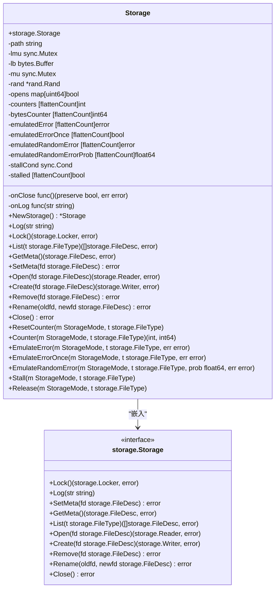
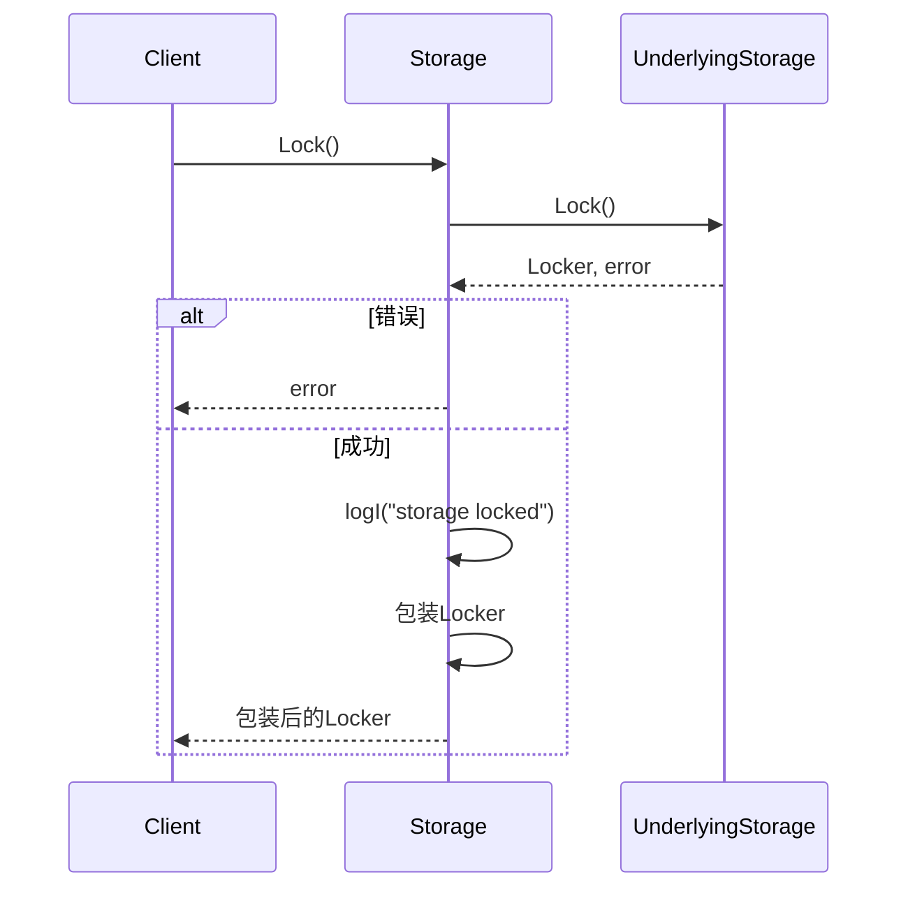
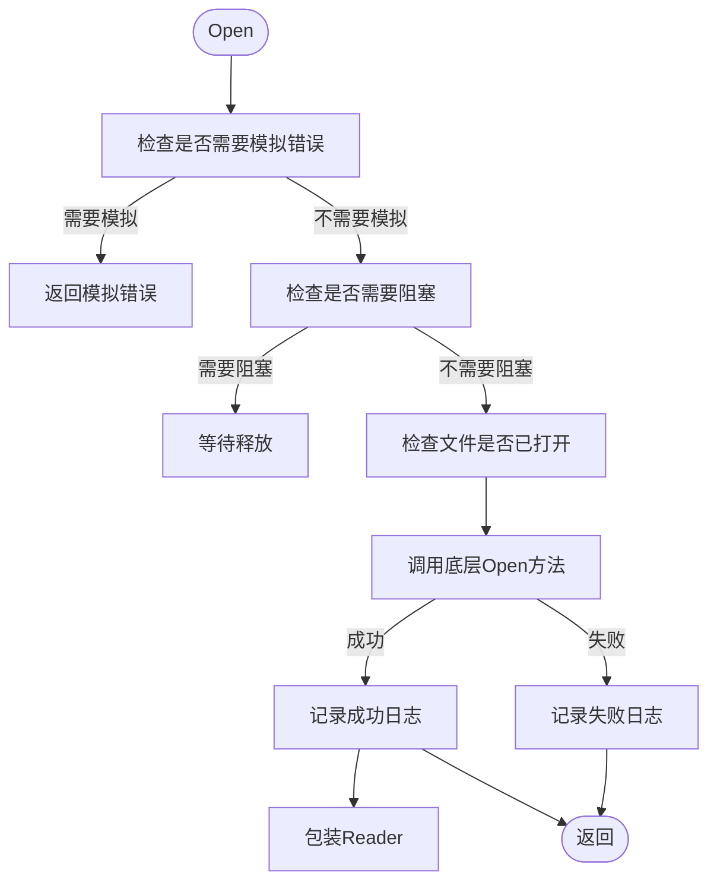
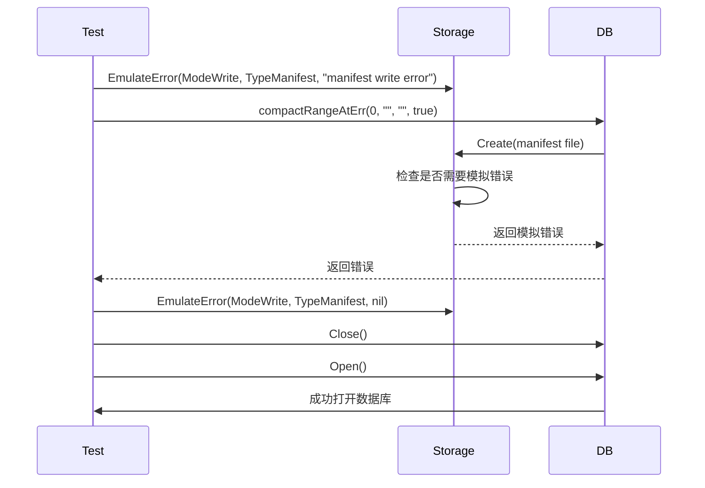
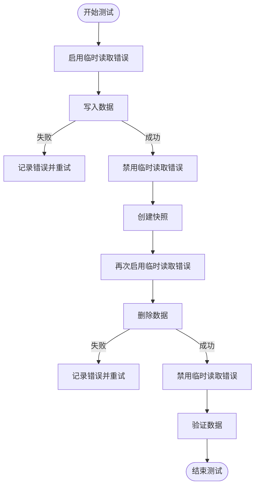
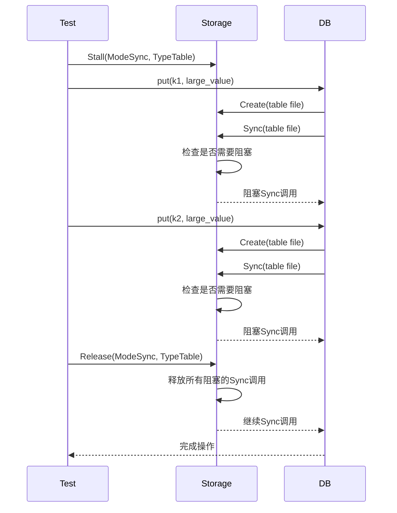

# 测试存储包装器

<cite>
**本文档引用的文件**
- [storage.go](file://leveldb/testutil/storage.go)
- [storage.go](file://leveldb/storage/storage.go)
- [db_test.go](file://leveldb/db_test.go)
- [testutil_test.go](file://leveldb/testutil_test.go)
</cite>

## 目录
1. [简介](#简介)
2. [核心设计与功能](#核心设计与功能)
3. [方法增强逻辑](#方法增强逻辑)
4. [测试用例与应用场景](#测试用例与应用场景)
5. [总结](#总结)

## 简介
`testutil`包中的`Storage`包装器是为增强可测试性而设计的关键工具。它通过嵌入基础`Storage`接口并添加测试专用字段，提供了对数据库存储层的细粒度控制。该包装器能够模拟各种异常条件，如文件打开失败、读写错误等，从而验证系统在异常情况下的恢复能力。

## 核心设计与功能
`Storage`结构体通过嵌入`storage.Storage`接口实现了对底层存储的包装。它添加了多个测试专用字段，包括错误模拟、随机错误注入、操作计数器和阻塞控制。

**图源**
- [storage.go](file://leveldb/testutil/storage.go#L246-L697)

**本节源**
- [storage.go](file://leveldb/testutil/storage.go#L246-L697)

## 方法增强逻辑
`Storage`包装器对`Lock`、`Open`、`List`等方法进行了增强，添加了日志记录、错误模拟触发和资源跟踪功能。

### 锁定操作增强
`Lock`方法在调用底层存储的`Lock`方法后，会记录日志并包装返回的`Locker`，以便在解锁时记录日志。

**图源**
- [storage.go](file://leveldb/testutil/storage.go#L337-L345)

### 文件操作增强
`Open`、`Create`、`Remove`等文件操作方法都添加了错误模拟和日志记录功能。在调用底层方法前，会检查是否需要模拟错误，并在操作完成后记录日志。

**图源**
- [storage.go](file://leveldb/testutil/storage.go#L409-L428)

**本节源**
- [storage.go](file://leveldb/testutil/storage.go#L337-L502)

## 测试用例与应用场景
`Storage`包装器在多个测试用例中被用来验证数据库在异常条件下的行为。

### 模拟文件打开错误
在`TestDB_ManifestWriteError`测试中，通过`EmulateError`方法模拟清单文件的写入和同步错误，验证数据库在元数据更新失败时的恢复能力。

**图源**
- [db_test.go](file://leveldb/db_test.go#L1501-L1517)

### 模拟临时读取错误
在`TestDB_TableTransientReadError`测试中，通过`EmulateError`方法模拟表文件的临时读取错误，验证数据库在读取失败时的重试机制。

**图源**
- [db_test.go](file://leveldb/db_test.go#L2384-L2417)

### 阻塞同步操作
在`TestDB_SyncRace`测试中，通过`Stall`和`Release`方法控制同步操作的执行时机，验证数据库在并发写入和同步时的行为。

**图源**
- [db_test.go](file://leveldb/db_test.go#L638-L650)

**本节源**
- [db_test.go](file://leveldb/db_test.go#L1354-L1517)
- [db_test.go](file://leveldb/db_test.go#L2384-L2417)
- [db_test.go](file://leveldb/db_test.go#L638-L650)

## 总结
`testutil`包中的`Storage`包装器是一个强大的测试工具，它通过嵌入基础`Storage`接口并添加测试专用功能，为数据库的异常条件测试提供了全面的支持。通过错误模拟、随机错误注入、操作计数器和阻塞控制等功能，可以有效地验证系统在各种异常情况下的健壮性和恢复能力。