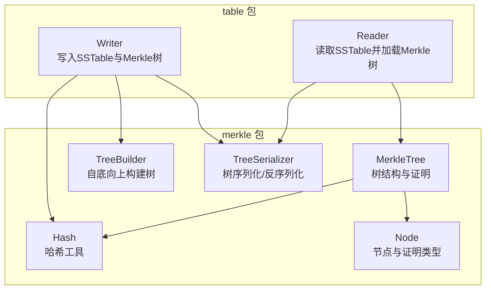
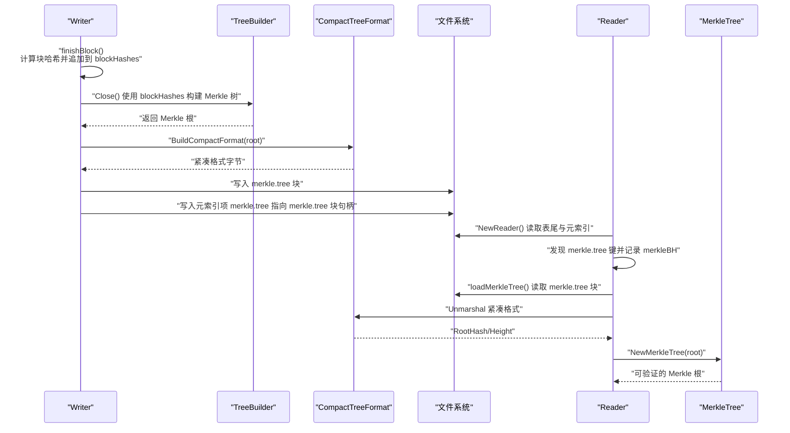
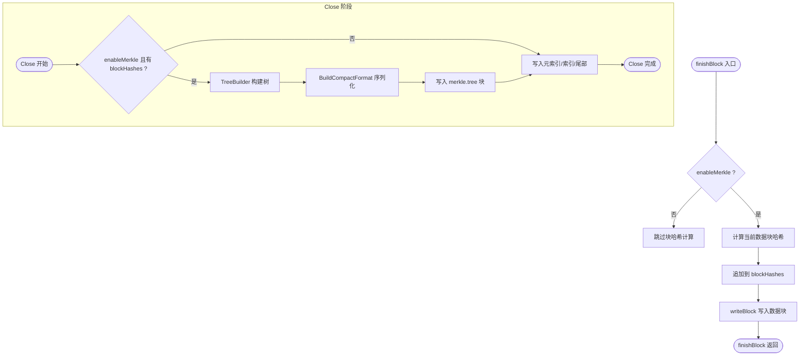
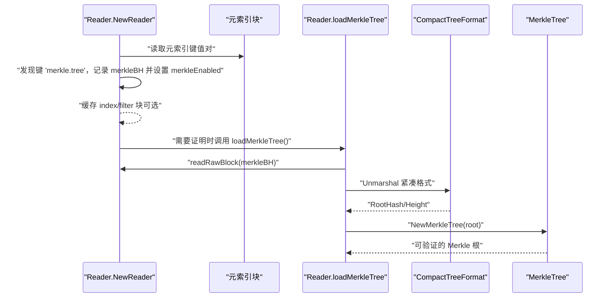
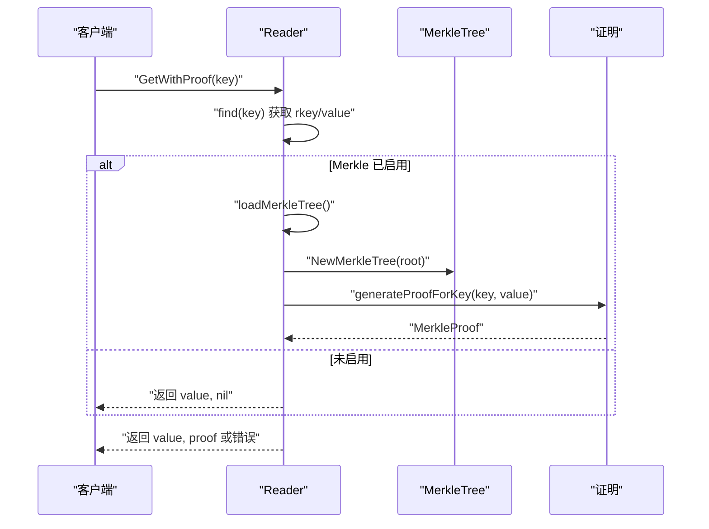
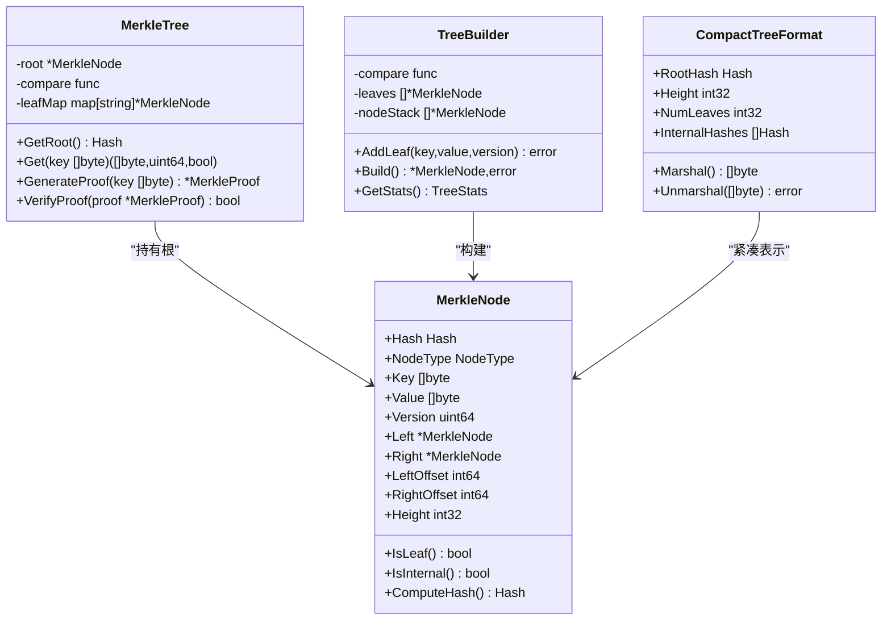
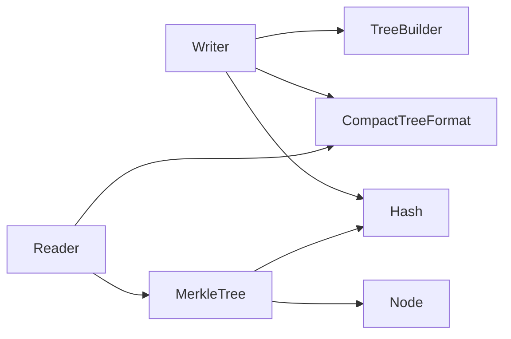

# Merkle集成

<cite>
**本文引用的文件**
- [leveldb/table/writer.go](file://leveldb/table/writer.go)
- [leveldb/table/reader.go](file://leveldb/table/reader.go)
- [leveldb/table/reader_merkle_test.go](file://leveldb/table/reader_merkle_test.go)
- [leveldb/merkle/tree.go](file://leveldb/merkle/tree.go)
- [leveldb/merkle/tree_builder.go](file://leveldb/merkle/tree_builder.go)
- [leveldb/merkle/tree_serializer.go](file://leveldb/merkle/tree_serializer.go)
- [leveldb/merkle/hash.go](file://leveldb/merkle/hash.go)
- [leveldb/merkle/node.go](file://leveldb/merkle/node.go)
</cite>

## 目录
1. [简介](#简介)
2. [项目结构](#项目结构)
3. [核心组件](#核心组件)
4. [架构总览](#架构总览)
5. [详细组件分析](#详细组件分析)
6. [依赖关系分析](#依赖关系分析)
7. [性能考量](#性能考量)
8. [故障排查指南](#故障排查指南)
9. [结论](#结论)
10. [附录](#附录)

## 简介
本文件面向 avccDB 的 SSTable 与 Merkle 树集成机制，系统性阐述以下关键点：
- TableWriter 中 enableMerkle 标志如何控制 Merkle 树生成；blockHashes 切片如何在 finishBlock 时收集每个数据块的哈希。
- TableWriter.Finish 阶段如何基于 blockHashes 构建 Merkle 树，序列化为紧凑格式并写入“merkle.tree”元索引项。
- TableReader 端 loadMerkleTree 如何从元索引块中读取 Merkle 块句柄，加载并反序列化紧凑格式，构造可验证的 Merkle 根。
- GetWithProof、GetProof、GetMerkleRoot 等方法如何利用已加载的 Merkle 结构为读取操作生成或返回可验证的数据完整性证明。
- 基于 reader_merkle_test.go 的测试用例，说明 Merkle 功能的正确性验证流程。

## 项目结构
围绕 Merkle 集成的关键代码分布在 table 与 merkle 两个包中：
- table 包：负责 SSTable 写入（Writer）与读取（Reader），包含 Merkle 树生成与加载逻辑。
- merkle 包：提供 Merkle 节点、树、证明、序列化与哈希计算等核心能力。

图表来源
- [leveldb/table/writer.go](file://leveldb/table/writer.go#L148-L490)
- [leveldb/table/reader.go](file://leveldb/table/reader.go#L1004-L1156)
- [leveldb/merkle/tree.go](file://leveldb/merkle/tree.go#L1-L286)
- [leveldb/merkle/tree_builder.go](file://leveldb/merkle/tree_builder.go#L1-L430)
- [leveldb/merkle/tree_serializer.go](file://leveldb/merkle/tree_serializer.go#L1-L377)
- [leveldb/merkle/hash.go](file://leveldb/merkle/hash.go#L1-L153)
- [leveldb/merkle/node.go](file://leveldb/merkle/node.go#L1-L370)

章节来源
- [leveldb/table/writer.go](file://leveldb/table/writer.go#L148-L490)
- [leveldb/table/reader.go](file://leveldb/table/reader.go#L1004-L1156)
- [leveldb/merkle/tree.go](file://leveldb/merkle/tree.go#L1-L286)
- [leveldb/merkle/tree_builder.go](file://leveldb/merkle/tree_builder.go#L1-L430)
- [leveldb/merkle/tree_serializer.go](file://leveldb/merkle/tree_serializer.go#L1-L377)
- [leveldb/merkle/hash.go](file://leveldb/merkle/hash.go#L1-L153)
- [leveldb/merkle/node.go](file://leveldb/merkle/node.go#L1-L370)

## 核心组件
- TableWriter（SSTable 写入器）
  - enableMerkle 控制是否启用 Merkle 树生成。
  - finishBlock 在写入数据块前计算块哈希并追加到 blockHashes。
  - Close 阶段：若启用 Merkle，则使用 TreeBuilder 将 blockHashes 构建为 Merkle 树，序列化为紧凑格式写入“merkle.tree”，并将该句柄写入元索引。
- TableReader（SSTable 读取器）
  - NewReader 解析表尾，读取元索引，发现“merkle.tree”键并记录其块句柄，设置 merkleEnabled。
  - loadMerkleTree 读取并反序列化紧凑格式，构造 MerkleTree（仅保存根与元信息）。
  - GetWithProof/GetProof/GetMerkleRoot 提供基于 Merkle 的读取与证明能力。
- Merkle 树与工具
  - TreeBuilder 自底向上平衡构建树，支持流式构建。
  - TreeSerializer/CompactTreeFormat 支持树的序列化与紧凑表示。
  - Hash/Node 提供哈希计算、节点结构与证明类型。

章节来源
- [leveldb/table/writer.go](file://leveldb/table/writer.go#L148-L490)
- [leveldb/table/reader.go](file://leveldb/table/reader.go#L1004-L1156)
- [leveldb/merkle/tree.go](file://leveldb/merkle/tree.go#L1-L286)
- [leveldb/merkle/tree_builder.go](file://leveldb/merkle/tree_builder.go#L1-L430)
- [leveldb/merkle/tree_serializer.go](file://leveldb/merkle/tree_serializer.go#L1-L377)
- [leveldb/merkle/hash.go](file://leveldb/merkle/hash.go#L1-L153)
- [leveldb/merkle/node.go](file://leveldb/merkle/node.go#L1-L370)

## 架构总览
下图展示 Writer 与 Reader 在 Merkle 集成中的交互路径，以及 Merkle 树在 SSTable 中的存储位置。

图表来源
- [leveldb/table/writer.go](file://leveldb/table/writer.go#L238-L449)
- [leveldb/table/reader.go](file://leveldb/table/reader.go#L1004-L1156)
- [leveldb/merkle/tree_builder.go](file://leveldb/merkle/tree_builder.go#L82-L131)
- [leveldb/merkle/tree_serializer.go](file://leveldb/merkle/tree_serializer.go#L261-L377)

## 详细组件分析

### TableWriter：enableMerkle 与 blockHashes 收集
- enableMerkle 字段默认开启，用于控制是否生成 Merkle 树。
- finishBlock 在写入数据块前，对数据块原始字节进行哈希计算，并将结果追加到 blockHashes。
- Close 阶段：
  - 若 enableMerkle 且存在 blockHashes，则使用 TreeBuilder 将每个块哈希作为叶子逐个加入，构建平衡 Merkle 树。
  - 使用 BuildCompactFormat 将树的根哈希、高度与内部节点哈希数组序列化为紧凑格式。
  - 将紧凑格式写入一个独立的数据块（merkle.tree），并将该块句柄写入元索引，键名为“merkle.tree”。

图表来源
- [leveldb/table/writer.go](file://leveldb/table/writer.go#L238-L449)
- [leveldb/merkle/tree_builder.go](file://leveldb/merkle/tree_builder.go#L82-L131)
- [leveldb/merkle/tree_serializer.go](file://leveldb/merkle/tree_serializer.go#L261-L377)

章节来源
- [leveldb/table/writer.go](file://leveldb/table/writer.go#L238-L449)
- [leveldb/merkle/tree_builder.go](file://leveldb/merkle/tree_builder.go#L82-L131)
- [leveldb/merkle/tree_serializer.go](file://leveldb/merkle/tree_serializer.go#L261-L377)

### TableReader：元索引解析与 Merkle 树加载
- NewReader 解析表尾，读取元索引块，遍历键值对：
  - 若键为“merkle.tree”，则记录 merkleBH 并设置 merkleEnabled。
  - 同时更新 dataEnd，确保后续读取范围正确。
- loadMerkleTree：
  - 读取 merkleBH 对应的块，反序列化为 CompactTreeFormat。
  - 仅保留根哈希与高度，构造 MerkleTree（不重建完整树结构）以支持后续证明生成。

图表来源
- [leveldb/table/reader.go](file://leveldb/table/reader.go#L1219-L1318)
- [leveldb/table/reader.go](file://leveldb/table/reader.go#L1004-L1038)
- [leveldb/merkle/tree_serializer.go](file://leveldb/merkle/tree_serializer.go#L309-L377)

章节来源
- [leveldb/table/reader.go](file://leveldb/table/reader.go#L1004-L1038)
- [leveldb/table/reader.go](file://leveldb/table/reader.go#L1219-L1318)
- [leveldb/merkle/tree_serializer.go](file://leveldb/merkle/tree_serializer.go#L309-L377)

### 读取接口：GetWithProof、GetProof、GetMerkleRoot
- GetWithProof
  - 先通过标准查找路径定位键值。
  - 若启用 Merkle，加载 Merkle 树后生成证明；即使加载失败也返回值与错误。
- GetProof
  - 仅生成证明，不返回值；需先加载 Merkle 树。
- GetMerkleRoot
  - 返回 Merkle 根哈希；若未启用 Merkle 或加载失败，返回空或错误。

图表来源
- [leveldb/table/reader.go](file://leveldb/table/reader.go#L1043-L1081)
- [leveldb/table/reader.go](file://leveldb/table/reader.go#L1085-L1103)
- [leveldb/table/reader.go](file://leveldb/table/reader.go#L1106-L1125)
- [leveldb/table/reader.go](file://leveldb/table/reader.go#L1129-L1156)

章节来源
- [leveldb/table/reader.go](file://leveldb/table/reader.go#L1043-L1125)
- [leveldb/table/reader.go](file://leveldb/table/reader.go#L1129-L1156)

### Merkle 树与证明：数据模型与序列化
- MerkleNode
  - 叶子节点保存 key/value/version，内部节点保存左右子节点指针与高度。
  - 提供哈希计算与二进制编解码。
- MerkleTree
  - 维护根节点、比较函数与叶节点映射，支持生成存在/不存在证明。
  - 提供 VerifyProof 验证证明。
- CompactTreeFormat
  - 仅存储根哈希、高度与内部节点哈希数组，适合 SSTable 存储。
- TreeBuilder
  - 自底向上平衡构建树，支持流式构建与统计信息。
- Hash
  - 提供叶子、内部节点、带版本叶子的哈希计算，以及块级哈希（HashBlock）。

图表来源
- [leveldb/merkle/node.go](file://leveldb/merkle/node.go#L1-L370)
- [leveldb/merkle/tree.go](file://leveldb/merkle/tree.go#L1-L286)
- [leveldb/merkle/tree_builder.go](file://leveldb/merkle/tree_builder.go#L1-L430)
- [leveldb/merkle/tree_serializer.go](file://leveldb/merkle/tree_serializer.go#L261-L377)

章节来源
- [leveldb/merkle/node.go](file://leveldb/merkle/node.go#L1-L370)
- [leveldb/merkle/tree.go](file://leveldb/merkle/tree.go#L1-L286)
- [leveldb/merkle/tree_builder.go](file://leveldb/merkle/tree_builder.go#L1-L430)
- [leveldb/merkle/tree_serializer.go](file://leveldb/merkle/tree_serializer.go#L261-L377)
- [leveldb/merkle/hash.go](file://leveldb/merkle/hash.go#L1-L153)

## 依赖关系分析
- Writer 依赖 TreeBuilder、Hash、CompactTreeFormat 进行 Merkle 树构建与存储。
- Reader 依赖 CompactTreeFormat、MerkleTree 进行加载与验证。
- MerkleTree 依赖 Hash、Node 类型完成证明生成与校验。

图表来源
- [leveldb/table/writer.go](file://leveldb/table/writer.go#L238-L449)
- [leveldb/table/reader.go](file://leveldb/table/reader.go#L1004-L1156)
- [leveldb/merkle/tree_builder.go](file://leveldb/merkle/tree_builder.go#L82-L131)
- [leveldb/merkle/tree_serializer.go](file://leveldb/merkle/tree_serializer.go#L261-L377)
- [leveldb/merkle/tree.go](file://leveldb/merkle/tree.go#L1-L286)
- [leveldb/merkle/node.go](file://leveldb/merkle/node.go#L1-L370)
- [leveldb/merkle/hash.go](file://leveldb/merkle/hash.go#L1-L153)

章节来源
- [leveldb/table/writer.go](file://leveldb/table/writer.go#L238-L449)
- [leveldb/table/reader.go](file://leveldb/table/reader.go#L1004-L1156)
- [leveldb/merkle/tree_builder.go](file://leveldb/merkle/tree_builder.go#L82-L131)
- [leveldb/merkle/tree_serializer.go](file://leveldb/merkle/tree_serializer.go#L261-L377)
- [leveldb/merkle/tree.go](file://leveldb/merkle/tree.go#L1-L286)
- [leveldb/merkle/node.go](file://leveldb/merkle/node.go#L1-L370)
- [leveldb/merkle/hash.go](file://leveldb/merkle/hash.go#L1-L153)

## 性能考量
- Merkle 树构建
  - TreeBuilder 采用自底向上平衡策略，时间复杂度 O(n)，空间复杂度受堆栈与叶子集合影响。
  - 流式构建（StreamingTreeBuilder）适合大规模数据，限制内存占用并分批合并。
- SSTable 写入
  - 每个数据块哈希计算与 blockHashes 追加为 O(1) 操作；整体写入阶段 Merkle 树构建为 O(n)。
- SSTable 读取
  - Merkle 树加载仅反序列化紧凑格式，不重建完整树，降低内存与 CPU 开销。
  - 证明生成在 Reader 层通过现有结构与根哈希即可完成，避免全树扫描。

[本节为通用指导，无需具体文件引用]

## 故障排查指南
- Merkle 未启用
  - 现象：GetWithProof 返回值但无证明；GetMerkleRoot 返回空。
  - 排查：确认 Writer.enableMerkle 是否为 true；检查元索引中是否存在“merkle.tree”键。
- Merkle 树加载失败
  - 现象：GetWithProof 返回值但伴随错误；loadMerkleTree 报错。
  - 排查：检查 merkle.tree 块是否可读、校验和是否一致；确认 CompactTreeFormat 反序列化成功。
- 证明验证失败
  - 现象：VerifyProof 返回 false。
  - 排查：确认证明中的根哈希与当前 Merkle 根一致；核对证明路径与兄弟节点顺序。

章节来源
- [leveldb/table/reader.go](file://leveldb/table/reader.go#L1004-L1156)
- [leveldb/merkle/tree.go](file://leveldb/merkle/tree.go#L1-L286)

## 结论
- avccDB 的 SSTable 与 Merkle 集成通过 Writer 在 Close 阶段将每个数据块的哈希汇总并构建 Merkle 树，以紧凑格式持久化至“merkle.tree”元索引项。
- Reader 在 NewReader 时解析元索引并按需加载 Merkle 树，提供 GetWithProof、GetProof、GetMerkleRoot 等接口以支撑可验证的数据完整性。
- 当前实现采用紧凑格式与根哈希驱动的证明生成方式，兼顾存储效率与验证性能；未来可在 generateProofForKey 中进一步完善基于数据块索引与紧凑树结构的完整路径重建。

[本节为总结性内容，无需具体文件引用]

## 附录

### 测试用例要点（基于 reader_merkle_test.go）
- 启用 Merkle：Writer.enableMerkle = true，写入若干键值后关闭，元索引包含“merkle.tree”。
- 关闭 Merkle：Writer.enableMerkle = false，GetWithProof 返回值但无证明。
- 加载 Merkle：Reader.NewReader 后调用 loadMerkleTree，验证 Merkle 树根哈希非零。
- GetWithProof：对存在的键获取值与证明，断言值与根哈希有效。

章节来源
- [leveldb/table/reader_merkle_test.go](file://leveldb/table/reader_merkle_test.go#L1-L275)