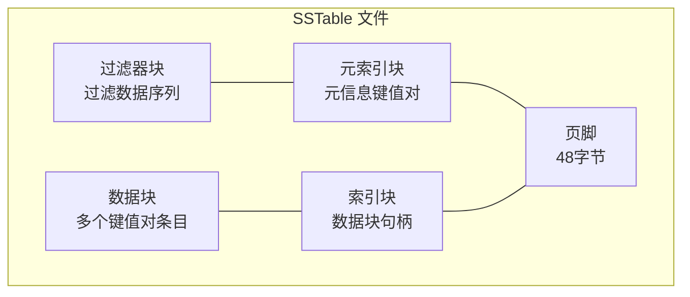
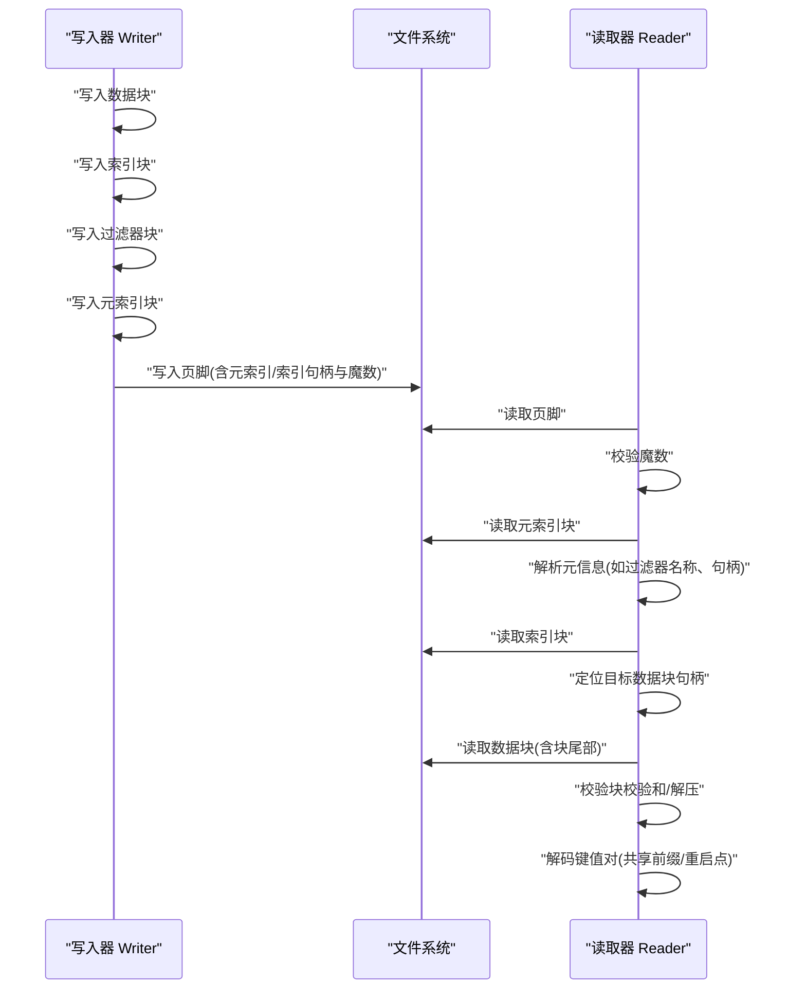
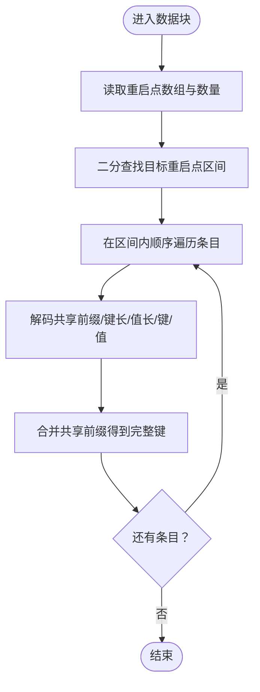
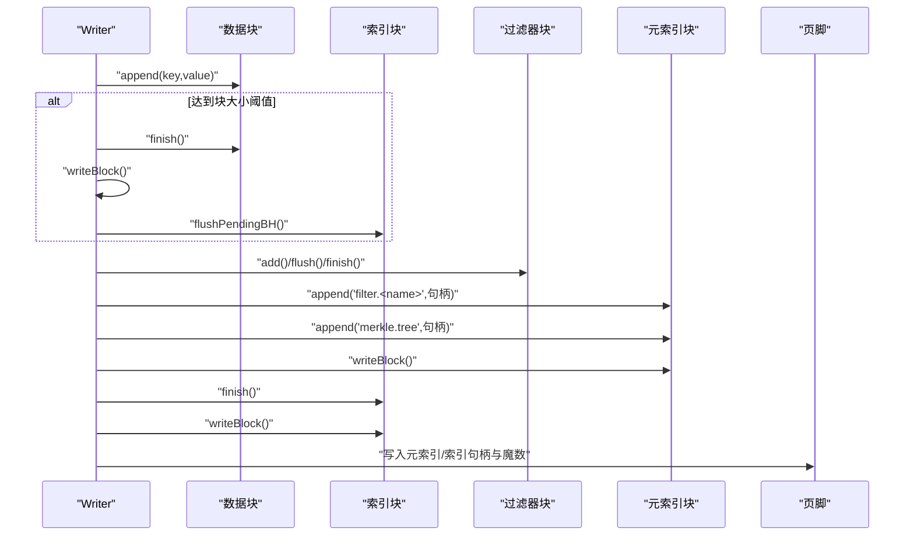
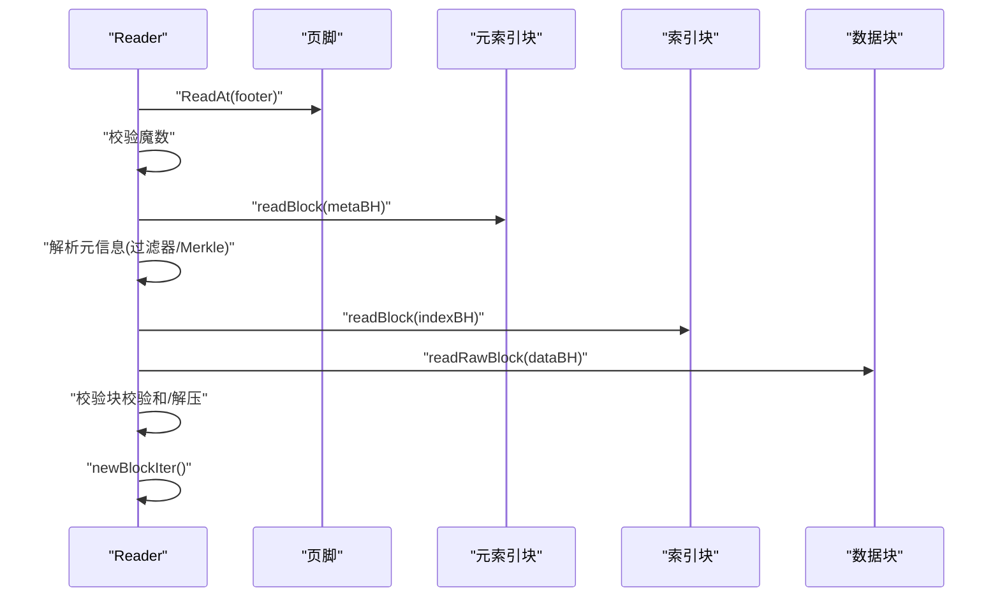
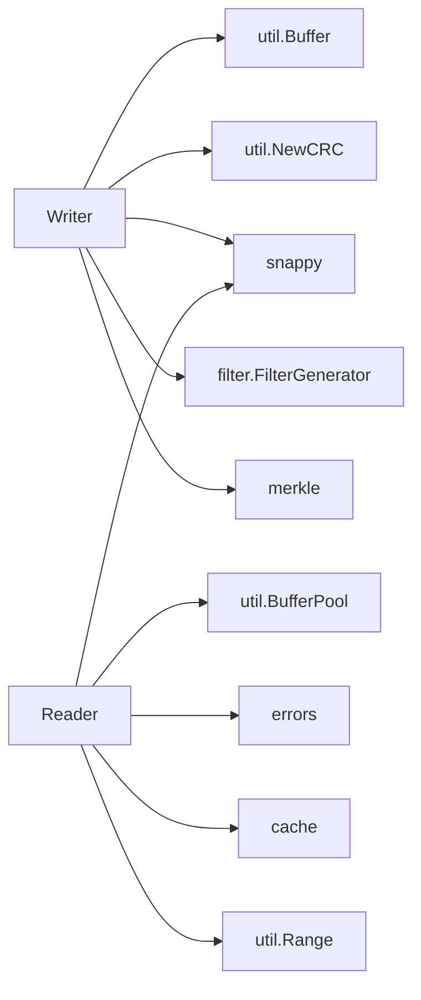

# SSTable格式

<cite>
**本文引用的文件**
- [table.go](file://leveldb/table/table.go)
- [writer.go](file://leveldb/table/writer.go)
- [reader.go](file://leveldb/table/reader.go)
- [block_test.go](file://leveldb/table/block_test.go)
</cite>

## 目录
1. [简介](#简介)
2. [项目结构](#项目结构)
3. [核心组件](#核心组件)
4. [架构总览](#架构总览)
5. [详细组件分析](#详细组件分析)
6. [依赖关系分析](#依赖关系分析)
7. [性能考量](#性能考量)
8. [故障排查指南](#故障排查指南)
9. [结论](#结论)

## 简介
本文件面向 avccDB 的 SSTable 文件格式，系统性梳理其物理布局与编码规则，重点覆盖以下内容：
- 文件整体布局：数据块、索引块、过滤器块、元索引块与页脚
- 块级结构：数据块、索引块、过滤器块的内部组织与编码
- 校验机制：块尾部的压缩类型与 CRC32 校验，以及 48 字节页脚中的魔数
- 键值对编码：共享前缀、非共享长度、值长度与实际数据的变长编码
- 小端序约定：固定长度整数均采用小端序存储
- 读写流程：从写入到读取的关键步骤与错误处理

## 项目结构
SSTable 的实现集中在 leveldb/table 包中，核心文件如下：
- table.go：定义 SSTable 的总体布局、块尾部与页脚规范，以及常量与辅助类型
- writer.go：负责将键值对写入数据块，生成索引块、过滤器块、元索引块与页脚
- reader.go：负责解析页脚、读取并校验块、解码键值对、构建迭代器
- block_test.go：验证块内编码与迭代行为的单元测试

图表来源
- [table.go](file://leveldb/table/table.go#L14-L56)
- [writer.go](file://leveldb/table/writer.go#L386-L449)
- [reader.go](file://leveldb/table/reader.go#L1204-L1318)

章节来源
- [table.go](file://leveldb/table/table.go#L14-L56)
- [writer.go](file://leveldb/table/writer.go#L386-L449)
- [reader.go](file://leveldb/table/reader.go#L1204-L1318)

## 核心组件
- 块句柄 blockHandle：记录块的偏移与长度，使用变长编码
- 写入器 Writer：管理数据块、索引块、过滤器块的生成与落盘
- 读取器 Reader：解析页脚、读取块、校验校验和、构建迭代器
- 过滤器块 filterBlock：保存过滤器数据与偏移表，支持快速存在性判断
- 数据块 block：包含键值对条目与重启点数组，支持二分查找与顺序遍历

章节来源
- [table.go](file://leveldb/table/table.go#L156-L173)
- [writer.go](file://leveldb/table/writer.go#L148-L176)
- [reader.go](file://leveldb/table/reader.go#L57-L118)
- [reader.go](file://leveldb/table/reader.go#L457-L484)

## 架构总览
SSTable 文件由若干数据块、可选的过滤器块、元索引块、索引块与页脚组成。每个块后跟随一个 5 字节的块尾部，包含压缩类型与 CRC32 校验；页脚为 48 字节，包含元索引块句柄、索引块句柄与 8 字节魔数。

图表来源
- [writer.go](file://leveldb/table/writer.go#L386-L449)
- [reader.go](file://leveldb/table/reader.go#L1204-L1318)

## 详细组件分析

### 文件页脚（Footer）
- 长度：48 字节
- 组成：
  - 元索引块句柄（变长编码）
  - 索引块句柄（变长编码）
  - 魔数：8 字节（SHA-1 前 64 位）
- 读取流程：
  - 从文件末尾读取 48 字节
  - 校验魔数
  - 解析元索引块句柄与索引块句柄
  - 读取元索引块，解析其中的元信息（如过滤器名称与句柄、Merkele树句柄）

章节来源
- [table.go](file://leveldb/table/table.go#L45-L56)
- [reader.go](file://leveldb/table/reader.go#L1204-L1318)

### 块尾部（Block Trailer）
- 长度：5 字节
- 组成：
  - 压缩类型：1 字节
  - 校验和：4 字节（CRC32，Castagnoli 多项式）
- 写入流程：
  - 若启用 Snappy 压缩，则压缩后的数据后追加 1 字节压缩类型与 4 字节校验和
  - 若未压缩，则直接追加 1 字节压缩类型（0）与 4 字节校验和
- 读取流程：
  - 读取块数据与块尾部
  - 校验块尾部校验和
  - 根据压缩类型决定是否解压

章节来源
- [table.go](file://leveldb/table/table.go#L34-L44)
- [writer.go](file://leveldb/table/writer.go#L178-L209)
- [reader.go](file://leveldb/table/reader.go#L568-L606)

### 数据块（Data Block）
- 结构：
  - 变长键值对条目序列
  - 块尾部：重启点数组 + 重启点数量（4 字节）
- 键值对编码：
  - 共享前缀长度（varint）
  - 非共享键长度（varint）
  - 值长度（varint）
  - 非共享键字节
  - 值字节
- 重启点：
  - 每隔固定间隔记录一次重启点，重启点处存储完整键
  - 重启点数组以小端序 4 字节整型存储，末尾额外存储重启点数量
- 迭代与查找：
  - 使用二分查找定位重启点区间
  - 在重启点区间内顺序遍历条目还原完整键

图表来源
- [table.go](file://leveldb/table/table.go#L58-L116)
- [reader.go](file://leveldb/table/reader.go#L57-L118)
- [reader.go](file://leveldb/table/reader.go#L88-L112)

章节来源
- [table.go](file://leveldb/table/table.go#L58-L116)
- [reader.go](file://leveldb/table/reader.go#L57-L118)
- [reader.go](file://leveldb/table/reader.go#L88-L112)
- [block_test.go](file://leveldb/table/block_test.go#L31-L55)

### 索引块（Index Block）
- 作用：记录各数据块的边界信息，用于快速定位目标数据块
- 键：索引块的键采用“前一块的最后键”、“相邻块间的短分隔键”或“最后一块的最后键的短后继”
- 值：对应数据块的块句柄（变长编码）
- 重启间隔：索引块使用重启间隔为 1，确保每个数据块边界都有明确的重启点

章节来源
- [table.go](file://leveldb/table/table.go#L14-L33)
- [writer.go](file://leveldb/table/writer.go#L211-L236)
- [writer.go](file://leveldb/table/writer.go#L423-L432)

### 过滤器块（Filter Block）
- 作用：按块粒度存储过滤器数据，支持快速判断某键是否存在
- 结构：
  - 过滤器数据序列
  - 块尾部：数据偏移数组 + trailer 偏移（4 字节）+ base Lg（1 字节）
- 写入流程：
  - 按 base Lg 划分数据块，生成过滤器并记录偏移
  - 写入偏移数组与 base Lg
- 读取流程：
  - 解析 trailer 偏移与 base Lg
  - 计算目标块的过滤器偏移范围，调用具体过滤器进行存在性判断

章节来源
- [table.go](file://leveldb/table/table.go#L118-L142)
- [writer.go](file://leveldb/table/writer.go#L96-L147)
- [reader.go](file://leveldb/table/reader.go#L457-L484)

### 元索引块（Metaindex Block）
- 作用：存放元信息键值对，如过滤器名称与对应的过滤器块句柄、Merkele树句柄等
- 写入流程：
  - 当存在过滤器时，写入形如 “filter.<name>” 的键与过滤器块句柄
  - 当启用 Merkle 支持时，写入 “merkle.tree” 与 Merkle 树块句柄
- 读取流程：
  - 读取元索引块，解析键值对，设置过滤器与 Merkle 树句柄

章节来源
- [writer.go](file://leveldb/table/writer.go#L398-L416)
- [reader.go](file://leveldb/table/reader.go#L1248-L1291)

### 写入流程（Writer）
- 关键步骤：
  - 追加键值对到数据块，必要时完成当前数据块并写入
  - 生成索引块条目（使用分隔键/后继键）
  - 生成过滤器块
  - 生成元索引块（包含过滤器与 Merkle 树句柄）
  - 写入索引块与页脚（含魔数）
- 校验与压缩：
  - 计算块校验和并写入块尾部
  - 根据配置选择压缩类型

图表来源
- [writer.go](file://leveldb/table/writer.go#L262-L315)
- [writer.go](file://leveldb/table/writer.go#L316-L449)

章节来源
- [writer.go](file://leveldb/table/writer.go#L262-L315)
- [writer.go](file://leveldb/table/writer.go#L316-L449)

### 读取流程（Reader）
- 关键步骤：
  - 读取页脚，校验魔数，解析元索引与索引块句柄
  - 读取元索引块，设置过滤器与 Merkle 树句柄
  - 读取索引块，定位目标数据块句柄
  - 读取数据块，校验块尾部校验和，必要时解压
  - 解码键值对，构建迭代器

图表来源
- [reader.go](file://leveldb/table/reader.go#L1204-L1318)
- [reader.go](file://leveldb/table/reader.go#L568-L606)
- [reader.go](file://leveldb/table/reader.go#L716-L776)

章节来源
- [reader.go](file://leveldb/table/reader.go#L1204-L1318)
- [reader.go](file://leveldb/table/reader.go#L568-L606)
- [reader.go](file://leveldb/table/reader.go#L716-L776)

## 依赖关系分析
- Writer 依赖：
  - util.Buffer：缓冲区管理
  - util.NewCRC：计算块校验和
  - snappy：压缩算法
  - filter.FilterGenerator：过滤器生成
  - merkle：Merkle 树支持
- Reader 依赖：
  - util.BufferPool：内存池
  - snappy：解压
  - errors：错误封装
  - cache：缓存接口
  - util.Range：范围切片

图表来源
- [writer.go](file://leveldb/table/writer.go#L9-L22)
- [reader.go](file://leveldb/table/reader.go#L9-L28)

章节来源
- [writer.go](file://leveldb/table/writer.go#L9-L22)
- [reader.go](file://leveldb/table/reader.go#L9-L28)

## 性能考量
- 压缩策略：Snappy 压缩可显著降低磁盘占用，但会增加 CPU 开销；需根据工作负载权衡
- 重启间隔：较小重启间隔提升查找效率，但会增加重启点开销；默认索引块重启间隔为 1
- 缓存策略：通过缓存索引块与过滤器块可减少随机读放大
- 校验成本：块校验和与魔数校验带来少量 CPU 成本，但能有效保障数据完整性

## 故障排查指南
- 魔数不匹配：页脚末尾魔数校验失败，通常表示文件损坏或版本不兼容
- 块校验和不一致：块尾部 CRC32 校验失败，检查压缩与写入流程
- 页脚句柄解析失败：元索引/索引句柄变长编码异常，检查页脚写入逻辑
- 索引块定位失败：索引键分隔/后继计算错误导致无法定位数据块
- 过滤器块偏移异常：过滤器偏移数组越界或 trailer 偏移非法

章节来源
- [reader.go](file://leveldb/table/reader.go#L1204-L1318)
- [reader.go](file://leveldb/table/reader.go#L568-L606)
- [reader.go](file://leveldb/table/reader.go#L658-L714)

## 结论
avccDB 的 SSTable 文件格式遵循标准的 LevelDB/SSTable 规范，具备清晰的块级结构与严格的校验机制。通过合理的压缩、重启点与缓存策略，可在保证数据一致性的同时获得良好的读写性能。建议在生产环境中启用严格校验与缓存，结合过滤器与 Merkle 树增强查询效率与数据可信度。