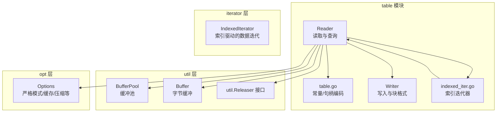
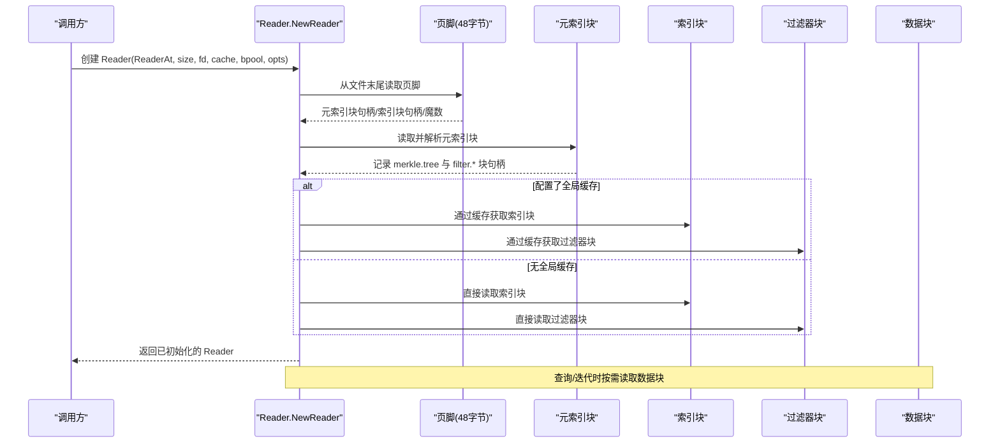
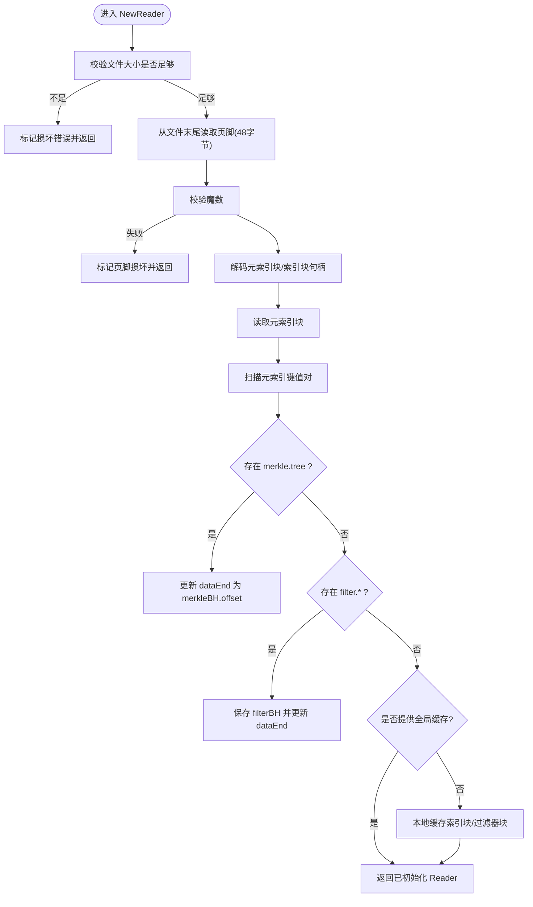
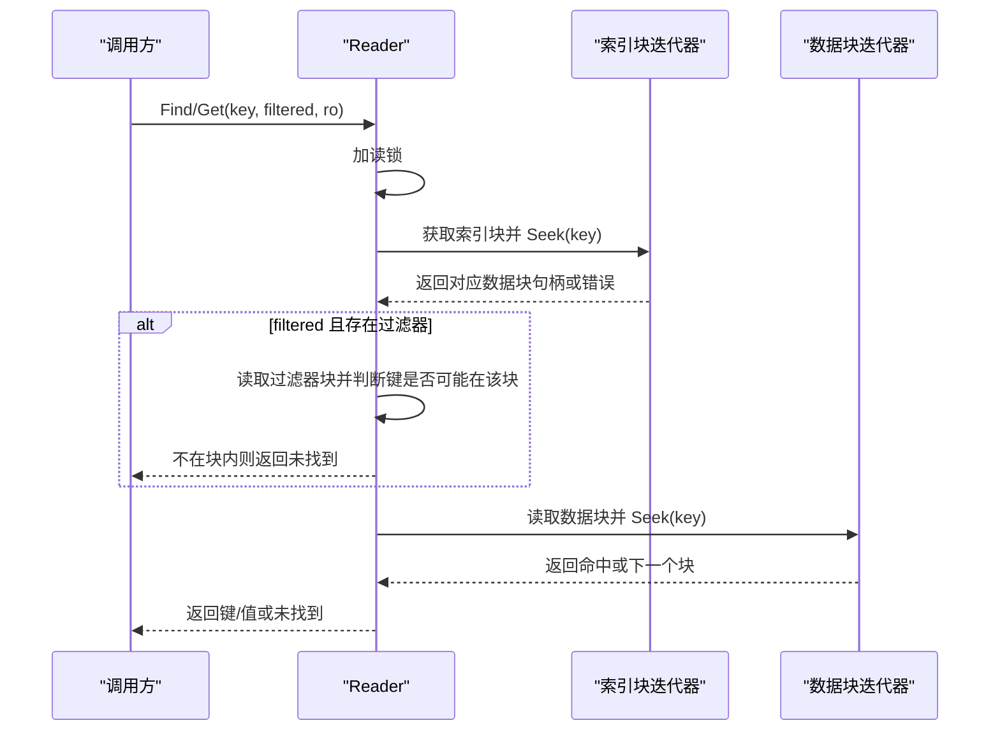
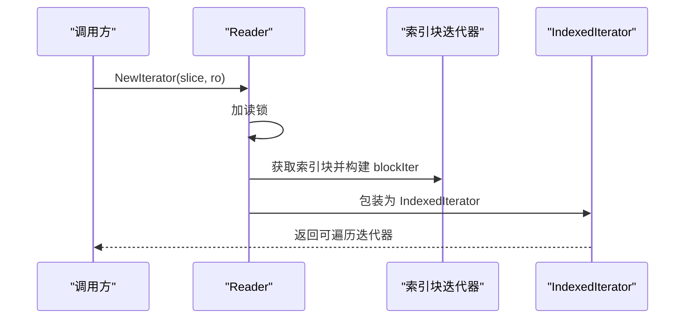
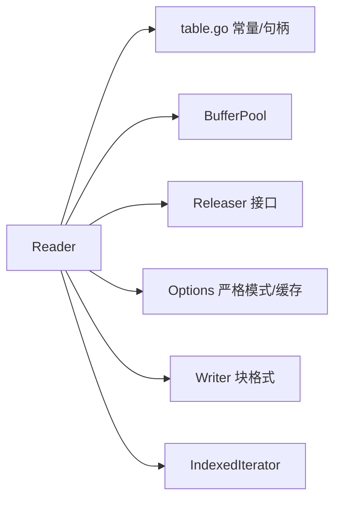

# TableReader

<cite>
**本文引用的文件列表**
- [reader.go](file://leveldb/table/reader.go)
- [table.go](file://leveldb/table/table.go)
- [table_test.go](file://leveldb/table/table_test.go)
- [writer.go](file://leveldb/table/writer.go)
- [indexed_iter.go](file://leveldb/iterator/indexed_iter.go)
- [buffer_pool.go](file://leveldb/util/buffer_pool.go)
- [buffer.go](file://leveldb/util/buffer.go)
- [util.go](file://leveldb/util/util.go)
- [options.go](file://leveldb/opt/options.go)
- [README.md](file://README.md)
</cite>

## 目录
1. [简介](#简介)
2. [项目结构](#项目结构)
3. [核心组件](#核心组件)
4. [架构总览](#架构总览)
5. [详细组件分析](#详细组件分析)
6. [依赖关系分析](#依赖关系分析)
7. [性能考量](#性能考量)
8. [故障排查指南](#故障排查指南)
9. [结论](#结论)

## 简介
本文件面向 avccDB 的 TableReader 组件，系统性梳理其初始化流程、并发安全设计、数据访问路径（Get、Find）、迭代器创建（NewIterator）以及关键内部字段的职责与行为。重点解释：
- NewReader 如何从文件末尾读取固定长度页脚，解析出元索引块与索引块的句柄，并按需加载过滤器块与索引块；
- Get 与 Find 的实现细节，如何利用索引块快速定位目标数据块并在数据块内进行二分查找；
- NewIterator 如何创建遍历整个 SSTable 的迭代器；
- Reader 的并发安全策略：使用 RWMutex 保护内部状态；
- Reader 结构体关键字段（indexBlock、filterBlock、metaBH、merkleBH）的作用与生命周期。

## 项目结构
TableReader 所在模块位于 leveldb/table 目录，围绕“表”（SSTable）的读取与遍历展开；与之配套的 Writer 负责写入；迭代器层提供索引迭代器封装；util 提供缓冲池与通用资源释放接口；opt 提供严格模式与缓存配置等。

图表来源
- [reader.go](file://leveldb/table/reader.go#L1185-L1319)
- [table.go](file://leveldb/table/table.go#L144-L173)
- [writer.go](file://leveldb/table/writer.go#L148-L200)
- [indexed_iter.go](file://leveldb/iterator/indexed_iter.go#L1-L200)
- [buffer_pool.go](file://leveldb/util/buffer_pool.go#L1-L136)
- [buffer.go](file://leveldb/util/buffer.go#L1-L200)
- [util.go](file://leveldb/util/util.go#L1-L74)
- [options.go](file://leveldb/opt/options.go#L1-L200)

章节来源
- [reader.go](file://leveldb/table/reader.go#L1185-L1319)
- [table.go](file://leveldb/table/table.go#L144-L173)
- [writer.go](file://leveldb/table/writer.go#L148-L200)
- [indexed_iter.go](file://leveldb/iterator/indexed_iter.go#L1-L200)
- [buffer_pool.go](file://leveldb/util/buffer_pool.go#L1-L136)
- [buffer.go](file://leveldb/util/buffer.go#L1-L200)
- [util.go](file://leveldb/util/util.go#L1-L74)
- [options.go](file://leveldb/opt/options.go#L1-L200)

## 核心组件
- Reader：SSTable 读取器，负责初始化、索引/过滤器块加载、数据块读取、键值查询、范围迭代与资源释放。
- blockHandle：块句柄，包含偏移与长度，用于记录元索引、索引、数据、过滤器、Merkle 树等块的位置信息。
- blockIter：块级迭代器，基于重启点进行二分查找与顺序遍历。
- filterBlock：过滤器块，按块粒度存储过滤器数据，支持快速判定键是否可能存在于某块。
- IndexedIterator：索引迭代器，将索引块与数据块迭代器组合，实现跨块遍历。
- BufferPool：缓冲池，复用字节切片，降低分配开销。
- Releaser 接口：统一资源释放语义，避免重复释放与泄漏。

章节来源
- [reader.go](file://leveldb/table/reader.go#L511-L534)
- [reader.go](file://leveldb/table/reader.go#L568-L656)
- [reader.go](file://leveldb/table/reader.go#L658-L714)
- [reader.go](file://leveldb/table/reader.go#L716-L768)
- [reader.go](file://leveldb/table/reader.go#L770-L787)
- [table.go](file://leveldb/table/table.go#L156-L173)
- [indexed_iter.go](file://leveldb/iterator/indexed_iter.go#L1-L200)
- [buffer_pool.go](file://leveldb/util/buffer_pool.go#L1-L136)
- [util.go](file://leveldb/util/util.go#L1-L74)

## 架构总览
下图展示 Reader 初始化、查询与迭代的整体流程及组件交互。

图表来源
- [reader.go](file://leveldb/table/reader.go#L1185-L1319)
- [table.go](file://leveldb/table/table.go#L144-L173)

## 详细组件分析

### NewReader 初始化流程
- 输入参数：io.ReaderAt、文件大小、文件描述、可选缓存与缓冲池、选项。
- 校验文件大小，确保至少包含页脚长度。
- 从文件末尾读取固定长度页脚，校验魔数，解码出元索引块与索引块的句柄。
- 读取元索引块，扫描其中的键值对，识别 merkle.tree 与 filter.* 条目，解析对应的块句柄，更新 dataEnd。
- 若未提供全局缓存，则本地缓存索引块与过滤器块，以便后续查询减少 IO。
- 设置校验标志（严格模式下验证块校验和），设置比较器与过滤器实例。

图表来源
- [reader.go](file://leveldb/table/reader.go#L1185-L1319)
- [table.go](file://leveldb/table/table.go#L144-L173)

章节来源
- [reader.go](file://leveldb/table/reader.go#L1185-L1319)
- [table.go](file://leveldb/table/table.go#L144-L173)

### Get 与 Find 方法实现
- 两者均先持读锁，随后通过索引块定位目标数据块句柄；Find 支持可选的过滤器短路判断。
- 定位到数据块后，构造数据块迭代器，执行二分查找定位目标键；若未命中且存在“下一个块”，则切换到下一个数据块继续查找。
- Get 在返回前会对比键是否完全相等，不相等则返回未找到。

图表来源
- [reader.go](file://leveldb/table/reader.go#L826-L915)
- [reader.go](file://leveldb/table/reader.go#L917-L943)
- [reader.go](file://leveldb/table/reader.go#L945-L966)

章节来源
- [reader.go](file://leveldb/table/reader.go#L826-L915)
- [reader.go](file://leveldb/table/reader.go#L917-L966)

### NewIterator 方法
- 持读锁，获取索引块迭代器，包装为索引迭代器，内部根据索引块位置动态打开对应数据块迭代器。
- 支持传入 Range 进行切片遍历，索引迭代器在边界处自动切换数据块迭代器。
- 返回的迭代器不是并发安全的，应在单线程使用或外部加锁。

图表来源
- [reader.go](file://leveldb/table/reader.go#L800-L824)
- [indexed_iter.go](file://leveldb/iterator/indexed_iter.go#L1-L200)

章节来源
- [reader.go](file://leveldb/table/reader.go#L800-L824)
- [indexed_iter.go](file://leveldb/iterator/indexed_iter.go#L1-L200)

### Reader 并发安全设计
- 使用 sync.RWMutex 保护内部状态：初始化、查询、迭代、释放等操作均在读锁或写锁下进行。
- Release 将 reader、cache、bpool 等置空并标记已释放，防止后续误用。
- 迭代器自身也实现了 util.Releaser，确保资源正确回收。

章节来源
- [reader.go](file://leveldb/table/reader.go#L511-L534)
- [reader.go](file://leveldb/table/reader.go#L1159-L1183)
- [util.go](file://leveldb/util/util.go#L1-L74)

### Reader 关键字段说明
- fd：文件描述，用于错误报告与标识。
- reader：底层只读访问接口，支持按偏移读取。
- cache：命名空间缓存获取器，用于缓存块数据。
- bpool：缓冲池，复用字节切片，降低分配与 GC 压力。
- o/cmp/filter/verifyChecksum：选项、比较器、过滤器与校验开关。
- dataEnd：数据区域结束位置，受元索引与 merkleBH 影响。
- metaBH/indexBH/filterBH：元索引、索引、过滤器块句柄。
- indexBlock/filterBlock：本地缓存的索引与过滤器块对象。
- merkleBH/merkleTree/merkleEnabled：Merkle 树支持相关字段。

章节来源
- [reader.go](file://leveldb/table/reader.go#L511-L534)
- [reader.go](file://leveldb/table/reader.go#L1234-L1319)

## 依赖关系分析
- Reader 依赖 table.go 中的块句柄编码/解码、页脚长度与魔数常量。
- Reader 通过 util.BufferPool 复用内存，通过 util.Releaser 统一资源释放。
- Reader 与 Writer 在块格式上保持一致：块尾含压缩类型与校验和，重启点数组位于块尾部。
- Reader 与迭代器层协作，通过 IndexedIterator 实现索引驱动的数据遍历。

图表来源
- [reader.go](file://leveldb/table/reader.go#L1185-L1319)
- [table.go](file://leveldb/table/table.go#L144-L173)
- [buffer_pool.go](file://leveldb/util/buffer_pool.go#L1-L136)
- [util.go](file://leveldb/util/util.go#L1-L74)
- [options.go](file://leveldb/opt/options.go#L1-L200)
- [writer.go](file://leveldb/table/writer.go#L148-L200)
- [indexed_iter.go](file://leveldb/iterator/indexed_iter.go#L1-L200)

章节来源
- [reader.go](file://leveldb/table/reader.go#L1185-L1319)
- [table.go](file://leveldb/table/table.go#L144-L173)
- [buffer_pool.go](file://leveldb/util/buffer_pool.go#L1-L136)
- [util.go](file://leveldb/util/util.go#L1-L74)
- [options.go](file://leveldb/opt/options.go#L1-L200)
- [writer.go](file://leveldb/table/writer.go#L148-L200)
- [indexed_iter.go](file://leveldb/iterator/indexed_iter.go#L1-L200)

## 性能考量
- 缓冲池与缓存：通过 BufferPool 与可选的全局缓存减少内存分配与 IO；Reader 在无全局缓存时本地缓存索引与过滤器块，降低后续查询成本。
- 压缩与校验：块尾包含压缩类型与校验和，严格模式下启用校验可提升可靠性但增加 CPU 开销。
- 二分查找与重启点：索引块与数据块均采用重启点加速二分查找，减少键比较次数。
- 迭代器切片：IndexedIterator 支持 Range 切片，避免全表扫描，提高范围查询效率。

[本节为通用指导，无需列出具体文件来源]

## 故障排查指南
- 页脚损坏：NewReader 在页脚魔数校验失败或句柄解码失败时返回损坏错误，应检查文件完整性与页脚格式。
- 数据块损坏：Reader 在读取块时校验校验和，若不匹配会返回损坏错误；必要时启用严格模式以提前暴露问题。
- 未找到键：Get/Find 返回未找到时，确认键是否存在于该 SSTable，或是否存在过滤器短路导致的误判。
- 迭代器释放：迭代器实现 Releaser，务必在使用完毕后调用 Release，避免资源泄漏。
- 并发使用：Reader 的查询与迭代方法内部持锁，避免在多线程中同时进行长时间阻塞操作；迭代器本身非并发安全。

章节来源
- [reader.go](file://leveldb/table/reader.go#L1185-L1319)
- [reader.go](file://leveldb/table/reader.go#L826-L915)
- [reader.go](file://leveldb/table/reader.go#L800-L824)
- [util.go](file://leveldb/util/util.go#L1-L74)

## 结论
TableReader 通过严格的页脚解析与元索引扫描完成初始化，结合索引块与数据块的二分查找实现高效的键值查询；通过过滤器块与可选的 Merkle 树增强检索与证明能力；借助缓冲池与缓存优化内存与 IO；并发安全通过 RWMutex 与 Releaser 保障。NewIterator 提供了高效、可切片的遍历能力，适合范围扫描与批量处理场景。