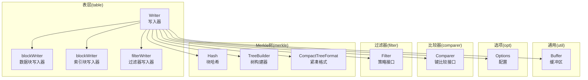
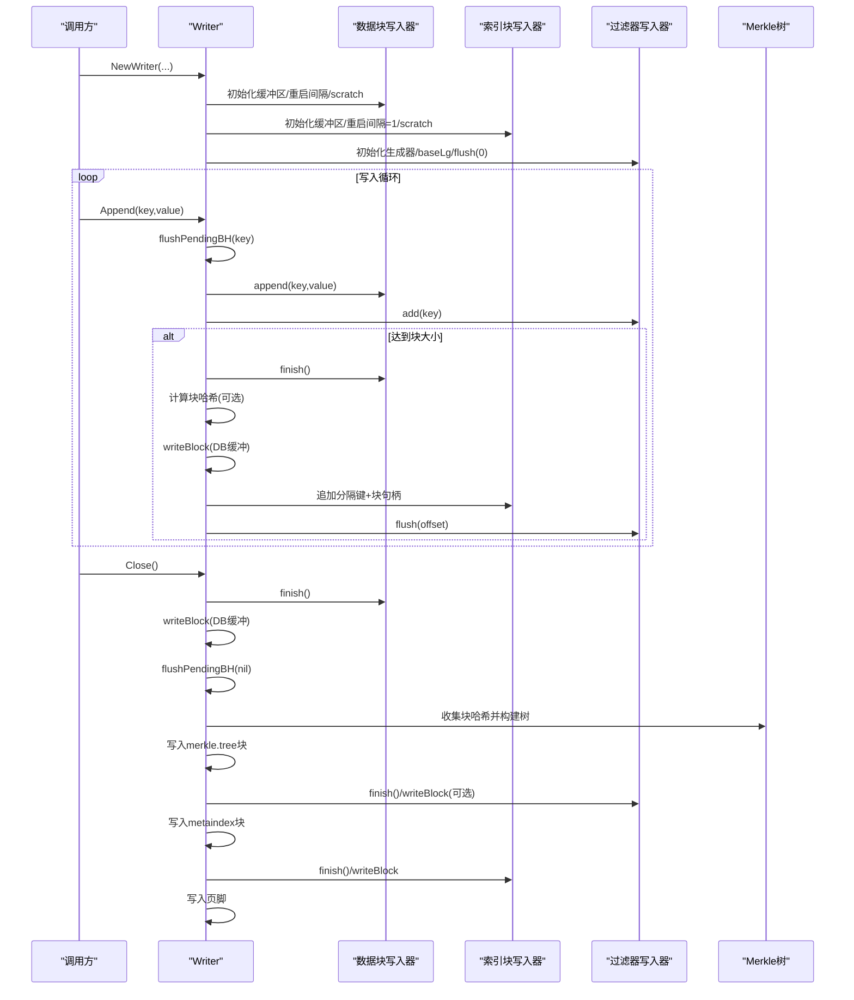
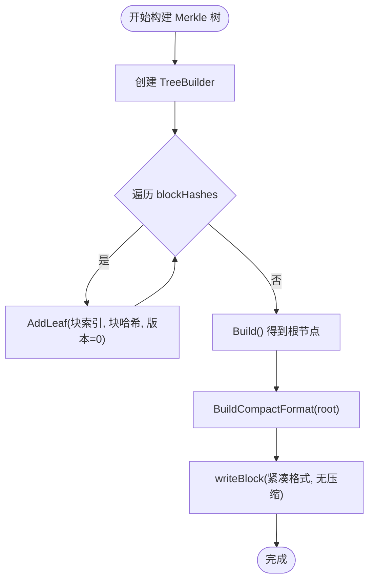
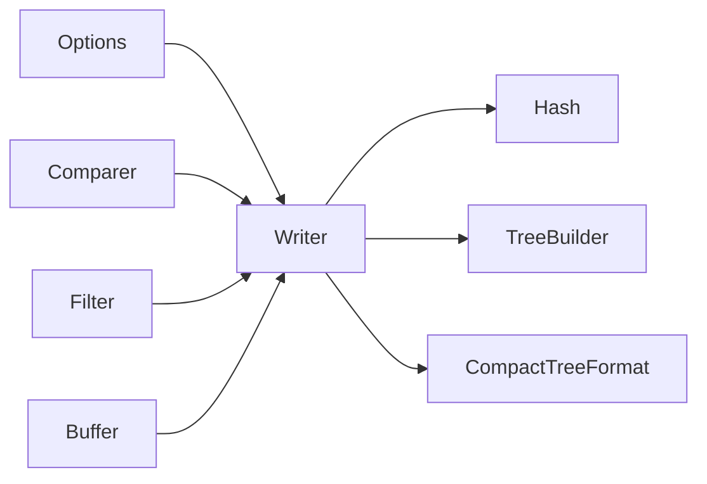

# TableWriter

<cite>
**本文引用的文件列表**
- [writer.go](file://leveldb/table/writer.go)
- [table.go](file://leveldb/table/table.go)
- [tree.go](file://leveldb/merkle/tree.go)
- [tree_builder.go](file://leveldb/merkle/tree_builder.go)
- [hash.go](file://leveldb/merkle/hash.go)
- [tree_serializer.go](file://leveldb/merkle/tree_serializer.go)
- [buffer.go](file://leveldb/util/buffer.go)
- [options.go](file://leveldb/opt/options.go)
- [comparer.go](file://leveldb/comparer/comparer.go)
- [filter.go](file://leveldb/filter/filter.go)
</cite>

## 目录
1. [简介](#简介)
2. [项目结构](#项目结构)
3. [核心组件](#核心组件)
4. [架构总览](#架构总览)
5. [详细组件分析](#详细组件分析)
6. [依赖关系分析](#依赖关系分析)
7. [性能考量](#性能考量)
8. [故障排查指南](#故障排查指南)
9. [结论](#结论)

## 简介
本文件面向 avccDB 的 TableWriter 组件，系统性梳理其初始化与写入流程，重点覆盖：
- NewWriter 初始化：如何依据 Options 配置数据块、索引块与过滤器块
- Append 追加键值对：如何保证键有序、写入数据块、更新过滤器，并在达到块大小时触发 finishBlock
- finishBlock 与 Close：如何写入数据块、索引块、过滤器块、元索引块与页脚
- Merkle 树集成：blockHashes 如何收集每个数据块哈希，Finish 时如何构建 Merkle 树并写入“merkle.tree”元项

## 项目结构
TableWriter 位于表层模块，围绕“块”进行组织，涉及：
- 表格格式定义与块句柄编码
- 数据块、索引块、过滤器块的写入与校验
- Merkle 树的哈希采集与树构建、序列化

图表来源
- [writer.go](file://leveldb/table/writer.go#L148-L489)
- [table.go](file://leveldb/table/table.go#L144-L174)
- [options.go](file://leveldb/opt/options.go#L456-L468)
- [comparer.go](file://leveldb/comparer/comparer.go#L11-L58)
- [filter.go](file://leveldb/filter/filter.go#L16-L61)
- [hash.go](file://leveldb/merkle/hash.go#L107-L112)
- [tree_builder.go](file://leveldb/merkle/tree_builder.go#L12-L43)
- [tree_serializer.go](file://leveldb/merkle/tree_serializer.go#L261-L377)

章节来源
- [writer.go](file://leveldb/table/writer.go#L148-L489)
- [table.go](file://leveldb/table/table.go#L144-L174)

## 核心组件
- Writer：表写入器，负责整体流程编排，维护数据块、索引块、过滤器块、偏移量等状态
- blockWriter：通用块写入器，封装键压缩编码、重启点、重启数组写入与块尾部
- filterWriter：过滤器写入器，按 baseLg 分批生成过滤器并记录偏移
- Merkle 树相关：Hash、TreeBuilder、CompactTreeFormat，用于块级哈希收集与树构建

章节来源
- [writer.go](file://leveldb/table/writer.go#L35-L176)
- [writer.go](file://leveldb/table/writer.go#L178-L209)
- [writer.go](file://leveldb/table/writer.go#L211-L260)
- [writer.go](file://leveldb/table/writer.go#L262-L315)
- [writer.go](file://leveldb/table/writer.go#L316-L449)
- [writer.go](file://leveldb/table/writer.go#L451-L489)
- [buffer.go](file://leveldb/util/buffer.go#L1-L315)
- [hash.go](file://leveldb/merkle/hash.go#L107-L112)
- [tree_builder.go](file://leveldb/merkle/tree_builder.go#L12-L43)
- [tree_serializer.go](file://leveldb/merkle/tree_serializer.go#L261-L377)

## 架构总览
TableWriter 的写入顺序与目标块如下：
- 数据块：按 Options 配置的 BlockSize 与 BlockRestartInterval 编码键值对
- 索引块：记录每个数据块的分隔键（Separator/Successor），作为块边界
- 过滤器块：按 FilterBaseLg 分批生成过滤器数据
- 元索引块：记录 filter 块与 merkle.tree 块的块句柄
- 索引块：记录每个数据块的块句柄
- 页脚：包含元索引块与索引块的块句柄及魔数

图表来源
- [writer.go](file://leveldb/table/writer.go#L211-L260)
- [writer.go](file://leveldb/table/writer.go#L262-L315)
- [writer.go](file://leveldb/table/writer.go#L316-L449)
- [writer.go](file://leveldb/table/writer.go#L451-L489)
- [table.go](file://leveldb/table/table.go#L144-L174)

## 详细组件分析

### NewWriter 初始化流程
- 从 Options 获取比较器、过滤器、压缩类型、块大小、重启间隔、过滤器 baseLg
- 为 Writer 的 dataBlock、indexBlock、filterBlock 设置缓冲区、重启间隔与 scratch 区域
- 初始化 Merkle 开关与 blockHashes 容器
- 若存在过滤器，则创建 FilterGenerator 并立即 flush(0) 以预热偏移

关键要点
- dataBlock 使用 Options 的 BlockRestartInterval；indexBlock 固定 restartInterval=1
- scratch[20:] 作为 blockWriter 的内部 scratch，避免与 blockHandle 编码冲突
- enableMerkle 默认开启

章节来源
- [writer.go](file://leveldb/table/writer.go#L451-L489)
- [options.go](file://leveldb/opt/options.go#L456-L468)
- [options.go](file://leveldb/opt/options.go#L606-L611)
- [options.go](file://leveldb/opt/options.go#L687-L692)
- [comparer.go](file://leveldb/comparer/comparer.go#L11-L58)
- [filter.go](file://leveldb/filter/filter.go#L16-L61)

### Append 方法：键序保证与块写入
- 键序检查：若当前已写入过且 Compare(prevKey, key) >= 0，则报错并标记 w.err
- flushPendingBH(key)：当有 pendingBH 时，先计算分隔键（Separator 或 Successor），将 pendingBH 写入索引块
- dataBlock.append(key,value)：按共享前缀编码写入键值对
- filterBlock.add(key)：向过滤器生成器注册键
- 块大小判断：若 dataBlock.bytesLen() >= blockSize，则 finishBlock()

注意
- Append 返回后允许调用者修改参数内容（内部会复制）

章节来源
- [writer.go](file://leveldb/table/writer.go#L262-L315)
- [comparer.go](file://leveldb/comparer/comparer.go#L11-L58)

### finishBlock：数据块收尾与索引块更新
- dataBlock.finish()：写入重启点数组与重启点数量
- 可选 Merkle：计算当前数据块的哈希并加入 blockHashes
- writeBlock：对 dataBlock.buf 压缩（可选 Snappy）、附加校验、写入文件并更新 offset
- pendingBH 记录该数据块句柄
- 重置 dataBlock.buf，清空重启点
- filterBlock.flush(offset)：按当前 offset 推进过滤器批次

章节来源
- [writer.go](file://leveldb/table/writer.go#L238-L260)
- [writer.go](file://leveldb/table/writer.go#L178-L209)
- [hash.go](file://leveldb/merkle/hash.go#L107-L112)

### Close：最终落盘与页脚写入
- 处理剩余数据块：若 dataBlock.nEntries > 0 或者从未写入过，则 finishBlock
- flushPendingBH(nil)：写入最后一个分隔键，确保索引块完整
- Merkle 树构建与写入：
  - 若启用 Merkle 且 blockHashes 非空：使用 TreeBuilder 将每个块哈希作为叶子构建树
  - 序列化为紧凑格式（CompactTreeFormat），写入一个无压缩的数据块
- 过滤器块：
  - filterBlock.finish() 生成最后一批过滤器并写入
- 元索引块（metaindex）：
  - 若存在过滤器块，写入 "filter.<策略名>" -> 块句柄
  - 若存在 merkle.tree 块，写入 "merkle.tree" -> 块句柄
  - finish() 并写入 metaindex 块
- 索引块：
  - indexBlock.finish() 并写入
- 页脚：
  - 写入 metaindex 块句柄、index 块句柄与魔数

章节来源
- [writer.go](file://leveldb/table/writer.go#L316-L449)
- [tree_builder.go](file://leveldb/merkle/tree_builder.go#L12-L43)
- [tree_serializer.go](file://leveldb/merkle/tree_serializer.go#L261-L377)
- [table.go](file://leveldb/table/table.go#L144-L174)

### Merkle 树集成机制
- 收集阶段：finishBlock 中对每个数据块写入前计算 HashBlock 并追加到 blockHashes
- 构建阶段：Close 中，使用 TreeBuilder 逐个添加叶子（键为块索引，值为块哈希）
- 序列化阶段：BuildCompactFormat 输出紧凑格式，写入一个独立的 merkle.tree 块
- 元索引登记：将 "merkle.tree" -> merkleBH 写入 metaindex

图表来源
- [writer.go](file://leveldb/table/writer.go#L346-L384)
- [tree_builder.go](file://leveldb/merkle/tree_builder.go#L12-L43)
- [tree_serializer.go](file://leveldb/merkle/tree_serializer.go#L261-L377)
- [hash.go](file://leveldb/merkle/hash.go#L107-L112)

## 依赖关系分析
- Writer 依赖 Options 提供的配置（比较器、过滤器、压缩、块大小、重启间隔、过滤器 baseLg）
- Writer 依赖 util.Buffer 实现高效的内存缓冲与写入
- Writer 依赖 comparer.Comparer 提供键比较、Separator、Successor
- Writer 依赖 filter.Filter 生成过滤器数据
- Writer 依赖 merkle.Hash、TreeBuilder、CompactTreeFormat 实现 Merkle 树

图表来源
- [writer.go](file://leveldb/table/writer.go#L451-L489)
- [options.go](file://leveldb/opt/options.go#L456-L468)
- [comparer.go](file://leveldb/comparer/comparer.go#L11-L58)
- [filter.go](file://leveldb/filter/filter.go#L16-L61)
- [buffer.go](file://leveldb/util/buffer.go#L1-L315)
- [hash.go](file://leveldb/merkle/hash.go#L107-L112)
- [tree_builder.go](file://leveldb/merkle/tree_builder.go#L12-L43)
- [tree_serializer.go](file://leveldb/merkle/tree_serializer.go#L261-L377)

章节来源
- [writer.go](file://leveldb/table/writer.go#L451-L489)
- [options.go](file://leveldb/opt/options.go#L456-L468)
- [buffer.go](file://leveldb/util/buffer.go#L1-L315)

## 性能考量
- 压缩策略：Snappy 压缩可显著降低磁盘占用，但会增加 CPU 开销；默认启用
- 块大小：过大导致随机访问延迟上升，过小增加索引与元数据开销；需结合读放大与写放大权衡
- 重启间隔：较小重启间隔提升前缀压缩率，但重启点数组增大；默认 16
- 过滤器 baseLg：决定每批键数量与过滤器大小；越大越节省空间但增加 IO 次数
- Merkle 树：构建与序列化带来额外 CPU 与 IO；仅在需要完整性证明时启用

## 故障排查指南
- 键序错误：Append 会检测 Compare(prevKey, key) >= 0 并返回错误；请确认外部传入键严格递增
- 写入失败：writeBlock、writeBlock、writeBlock、writeBlock、writeBlock 任一步骤失败都会设置 w.err 并中断后续流程
- 过滤器生成异常：filterBlock.finish() 或 filterBlock.generate() 异常；检查过滤器策略与键集合
- Merkle 树构建失败：TreeBuilder.AddLeaf 对于重复键或版本顺序不满足要求会报错；确保块哈希输入有序
- 页脚写入失败：页脚包含两个块句柄与魔数，若写入失败，表文件不可读

章节来源
- [writer.go](file://leveldb/table/writer.go#L262-L315)
- [writer.go](file://leveldb/table/writer.go#L316-L449)
- [tree_builder.go](file://leveldb/merkle/tree_builder.go#L45-L67)

## 结论
TableWriter 通过清晰的职责划分与严格的块格式约束，实现了高效、可验证的表写入。其 Merkle 集成提供了块级完整性证明能力，适合在需要强一致校验与增量验证的场景使用。合理配置 Options 参数可平衡吞吐、延迟与存储占用。