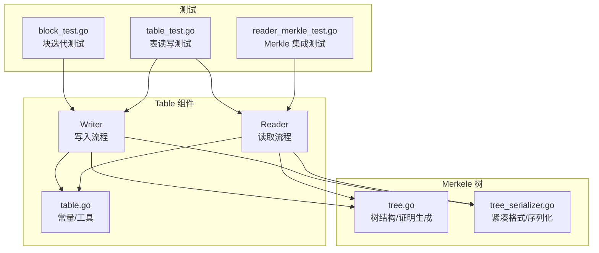
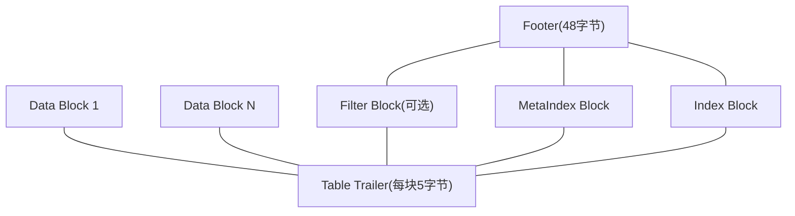
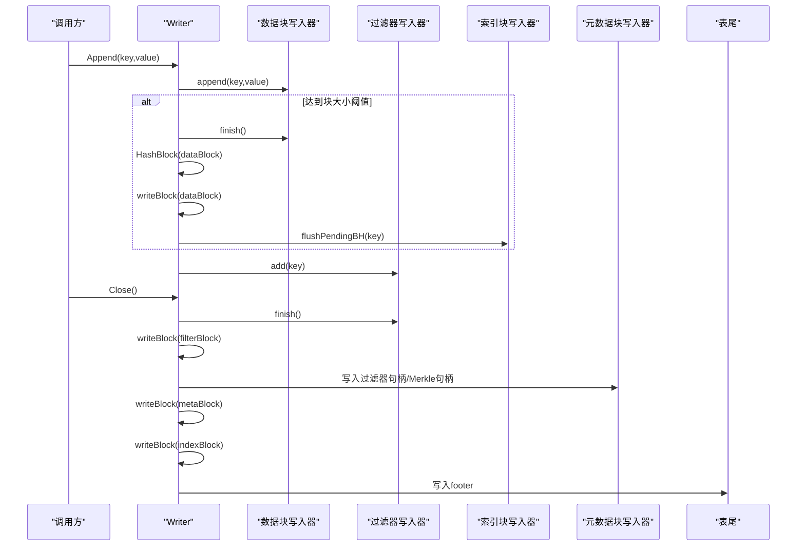
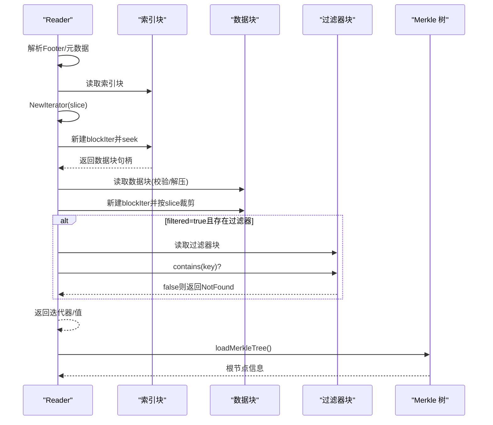
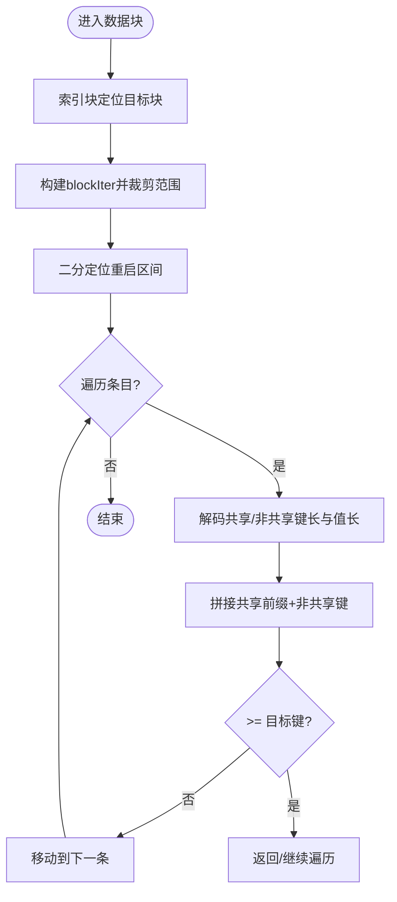
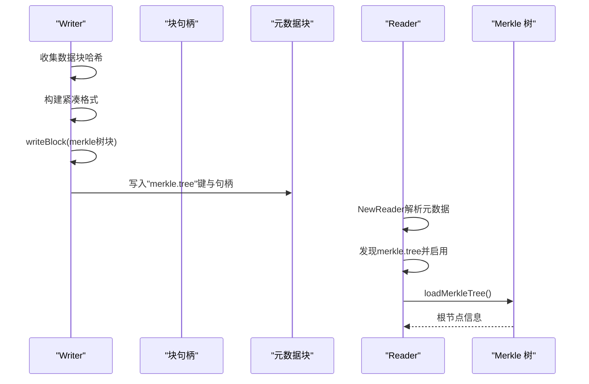
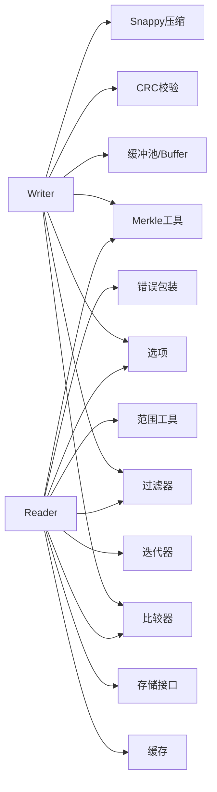

# Table组件

<cite>
**本文引用的文件列表**
- [table.go](file://leveldb/table/table.go)
- [writer.go](file://leveldb/table/writer.go)
- [reader.go](file://leveldb/table/reader.go)
- [block_test.go](file://leveldb/table/block_test.go)
- [table_test.go](file://leveldb/table/table_test.go)
- [reader_merkle_test.go](file://leveldb/table/reader_merkle_test.go)
- [tree.go](file://leveldb/merkle/tree.go)
- [tree_serializer.go](file://leveldb/merkle/tree_serializer.go)
</cite>

## 目录
1. [简介](#简介)
2. [项目结构](#项目结构)
3. [核心组件](#核心组件)
4. [架构总览](#架构总览)
5. [详细组件分析](#详细组件分析)
6. [依赖关系分析](#依赖关系分析)
7. [性能考量](#性能考量)
8. [故障排查指南](#故障排查指南)
9. [结论](#结论)
10. [附录](#附录)

## 简介
本文件面向 avccDB 的 Table 组件，系统性阐述 SSTable（Sorted String Table）的文件格式与实现细节，重点覆盖：
- 文件格式：数据块（Data Block）、索引块（Index Block）、过滤器块（Filter Block）、元数据块（Meta Block）与表尾（Footer）
- 关键流程：TableWriter 的 Append、Finish（Close）与块写入；TableReader 的 NewIterator、OffsetOf、Get、Find、loadMerkleTree 等
- 读取路径与范围查询：基于索引块的二分定位 + 数据块内的重启点跳转
- Merkle 树集成：块哈希收集、序列化存储、元数据索引与读取时加载

## 项目结构
Table 组件位于 leveldb/table 目录，核心文件如下：
- table.go：定义 SSTable 基本常量、块句柄结构与编码/解码工具
- writer.go：实现 TableWriter，负责键值对写入、块构建、压缩与校验、过滤器生成、元数据与索引维护、Merkle 树构建与落盘
- reader.go：实现 TableReader，负责文件解析、块读取与解压、校验、迭代器构造、范围查询、过滤器命中判定、Merkle 树加载与证明生成

图表来源
- [writer.go](file://leveldb/table/writer.go#L1-L490)
- [reader.go](file://leveldb/table/reader.go#L1-L1319)
- [table.go](file://leveldb/table/table.go#L1-L174)
- [tree.go](file://leveldb/merkle/tree.go#L1-L286)
- [tree_serializer.go](file://leveldb/merkle/tree_serializer.go#L1-L377)
- [block_test.go](file://leveldb/table/block_test.go#L1-L140)
- [table_test.go](file://leveldb/table/table_test.go#L1-L132)
- [reader_merkle_test.go](file://leveldb/table/reader_merkle_test.go#L1-L275)

章节来源
- [writer.go](file://leveldb/table/writer.go#L1-L490)
- [reader.go](file://leveldb/table/reader.go#L1-L1319)
- [table.go](file://leveldb/table/table.go#L1-L174)

## 核心组件
- TableWriter：按选项配置写入键值对，自动切分数据块，生成索引块条目，可选生成过滤器块，最后写入元数据块、索引块与表尾，并可选择性构建并写入 Merkle 树块
- TableReader：打开 SSTable，解析表尾，读取元数据块以定位过滤器与 Merkle 树，按需缓存索引与过滤器，提供迭代器、范围查询、近似偏移计算与 Merkle 树加载

章节来源
- [writer.go](file://leveldb/table/writer.go#L148-L490)
- [reader.go](file://leveldb/table/reader.go#L512-L1319)
- [table.go](file://leveldb/table/table.go#L144-L174)

## 架构总览
SSTable 文件由若干数据块、可选过滤器块、元数据块、索引块与表尾组成。Reader 通过表尾获取元数据块与索引块位置，再根据索引块定位具体数据块，使用数据块内的重启点进行二分查找与顺序遍历。

图表来源
- [table.go](file://leveldb/table/table.go#L45-L116)
- [table.go](file://leveldb/table/table.go#L144-L174)

## 详细组件分析

### 文件格式与块布局
- 数据块（Data Block）
  - 结构：重启点数组 + 变长键值条目 + 重启点长度字段（4字节小端）
  - 条目编码：共享前缀长度、非共享键长度、值长度（均为变长整型），随后是非共享键与值
  - 重启点：restart_interval 指定的间隔处记录绝对偏移，便于二分定位
- 索引块（Index Block）
  - 用途：记录每个数据块的“最后键”的分隔键或后继键作为该块的边界键，重启间隔为1
  - 内容：键为边界键，值为该数据块的块句柄（offset,length）
- 过滤器块（Filter Block）
  - 用途：按块粒度快速判断某键是否可能存在于该块，减少不必要的数据块读取
  - 结构：若干过滤器数据 + 过滤器偏移表 + trailer（包含数据偏移表起始位置与 baseLg）
- 元数据块（Meta Block）
  - 用途：存放元信息，如过滤器名称与对应块句柄、Merkle 树块句柄等
- 表尾（Footer）
  - 固定长度 48 字节，包含元数据块句柄、索引块句柄、魔数（magic）

章节来源
- [table.go](file://leveldb/table/table.go#L144-L174)
- [table.go](file://leveldb/table/table.go#L1-L116)

### TableWriter 实现要点
- 键值写入与块切分
  - Append(key,value)：校验键序递增，追加到当前数据块；当数据块字节数达到阈值时调用 finishBlock 切分
  - finishBlock：完成数据块尾部（写入重启点数组），计算块哈希（若启用 Merkle），写入块并记录块句柄到 pendingBH
  - flushPendingBH：根据当前 key 与数据块 prevKey 计算分隔键/后继键，将 pendingBH 写入索引块
- 压缩与校验
  - writeBlock：按选项选择压缩（Snappy 或无压缩），计算 CRC32 校验，写入块尾（压缩类型+校验）
- 过滤器
  - filterWriter：按 baseLg 将键分组生成过滤器，记录偏移表，最终写入过滤器块
- 元数据与索引
  - Close：写入过滤器块（如有）、元数据块（含过滤器与 Merkle 树句柄）、索引块；最后写入表尾
- Merkle 树
  - 收集所有数据块哈希，构建紧凑格式，序列化后写入一个独立的 Merkle 树块，并在元数据中登记

图表来源
- [writer.go](file://leveldb/table/writer.go#L262-L449)

章节来源
- [writer.go](file://leveldb/table/writer.go#L262-L449)

### TableReader 实现要点
- 初始化与表尾解析
  - NewReader：读取并校验 Footer，解析元数据块句柄与索引块句柄，读取元数据块，解析其中的过滤器与 Merkle 树信息，设置 dataEnd
- 块读取与校验
  - readRawBlock：按块句柄读取，校验压缩类型与 CRC32；必要时解压
  - readBlock/readBlockCached：解析重启点数组，封装 block 对象
  - readFilterBlock/readFilterBlockCached：解析过滤器块 trailer，建立偏移表
- 迭代器与范围查询
  - NewIterator：基于索引块构建索引迭代器，内部委托数据块迭代器
  - OffsetOf：通过索引块二分定位最近块起始偏移
  - Find/Get：先定位块，再在数据块内二分+顺序遍历；可选使用过滤器快速排除
- Merkle 树加载
  - loadMerkleTree：从元数据中读取 Merkle 树块，反序列化紧凑格式，保存根节点信息供后续证明生成

图表来源
- [reader.go](file://leveldb/table/reader.go#L800-L1319)

章节来源
- [reader.go](file://leveldb/table/reader.go#L800-L1319)

### 数据块迭代与范围查询算法
- 二分定位重启点：根据比较器判断目标键落在哪个重启区间
- 顺序遍历条目：从重启点开始，逐条解码键值，拼接共享前缀，直到目标键或结束
- 范围裁剪：根据 Range.Start/Limit 调整重启区间与偏移起点/终点，确保只遍历目标范围

图表来源
- [reader.go](file://leveldb/table/reader.go#L1-L403)

章节来源
- [reader.go](file://leveldb/table/reader.go#L1-L403)
- [block_test.go](file://leveldb/table/block_test.go#L1-L140)

### Merkle 树集成与数据完整性
- Writer 端
  - 收集每个数据块的哈希，构建紧凑格式（仅内部节点哈希与高度），序列化后写入一个独立的 Merkle 树块
  - 在元数据块中登记 "merkle.tree" 与该块句柄，供 Reader 识别启用 Merkle
- Reader 端
  - NewReader 解析元数据时发现 merkle.tree，标记启用并更新 dataEnd
  - loadMerkleTree 读取并反序列化紧凑格式，保存根节点信息
  - GetWithProof/GetProof 提供带证明的读取能力（当前实现返回基础证明结构，完整路径生成将在优化阶段完善）

图表来源
- [writer.go](file://leveldb/table/writer.go#L346-L449)
- [reader.go](file://leveldb/table/reader.go#L1252-L1317)
- [tree_serializer.go](file://leveldb/merkle/tree_serializer.go#L261-L377)

章节来源
- [writer.go](file://leveldb/table/writer.go#L346-L449)
- [reader.go](file://leveldb/table/reader.go#L1252-L1317)
- [tree_serializer.go](file://leveldb/merkle/tree_serializer.go#L261-L377)

## 依赖关系分析
- Writer 依赖
  - 压缩库（Snappy）、比较器、过滤器、选项、缓冲池、CRC 校验
  - Merkle 工具：HashBlock、树构建器、紧凑格式序列化
- Reader 依赖
  - 缓冲池、缓存命名空间、比较器、过滤器、存储接口、迭代器、范围工具、错误包装
  - Merkle 工具：紧凑格式反序列化、树对象

图表来源
- [writer.go](file://leveldb/table/writer.go#L1-L170)
- [reader.go](file://leveldb/table/reader.go#L1-L120)
- [tree_serializer.go](file://leveldb/merkle/tree_serializer.go#L1-L120)

章节来源
- [writer.go](file://leveldb/table/writer.go#L1-L170)
- [reader.go](file://leveldb/table/reader.go#L1-L120)

## 性能考量
- 压缩策略：Snappy 压缩可显著降低磁盘占用，但会增加 CPU 开销；可根据场景选择 NoCompression
- 块大小：过小导致索引块过大、随机访问频繁；过大影响范围扫描与缓存命中
- 重启间隔：较小重启点提升二分定位精度，但增加重启点开销；默认值在 Writer 初始化时设置
- 过滤器：Bloom 过滤器可大幅减少无效数据块读取，适合高命中率场景
- 缓存：Reader 支持全局缓存与本地缓存（索引/过滤器），合理配置可提升热点命中率
- Merkle：紧凑格式仅存储内部节点哈希，避免全树加载，适合只做根校验与证明生成

## 故障排查指南
- 常见错误类型
  - ErrCorrupted：块尾校验失败、压缩类型未知、条目偏移未对齐、过滤器 trailer 不合法等
  - ErrNotFound：键不存在或过滤器判定不存在
  - Reader/Iterator 已释放：并发使用或提前释放资源
- 定位手段
  - 使用 newErrCorrupted/newErrCorruptedBH 包装错误，携带块类型、位置与原因
  - 通过 OffsetOf 获取近似偏移，辅助定位问题块
  - 关闭严格校验（StrictBlockChecksum）可绕过校验，但不建议在生产环境使用
- 建议
  - 优先检查 Writer 的键序与块大小阈值
  - 确认过滤器与 Merkle 配置一致
  - 使用测试用例验证迭代器与范围查询行为

章节来源
- [reader.go](file://leveldb/table/reader.go#L31-L79)
- [reader.go](file://leveldb/table/reader.go#L550-L606)
- [reader.go](file://leveldb/table/reader.go#L800-L915)

## 结论
Table 组件通过标准的 SSTable 文件格式与高效的块布局，实现了高性能的顺序写入与随机读取。结合过滤器与 Merkle 树，既提升了查询效率，又增强了数据完整性保障。Writer 侧的块哈希收集与紧凑格式序列化，使得 Merkle 树的加载与验证成本可控，适合在生产环境中部署。

## 附录
- 关键 API 路径参考
  - Writer.Append：[writer.go](file://leveldb/table/writer.go#L262-L294)
  - Writer.Close：[writer.go](file://leveldb/table/writer.go#L316-L449)
  - Reader.NewIterator：[reader.go](file://leveldb/table/reader.go#L800-L824)
  - Reader.OffsetOf：[reader.go](file://leveldb/table/reader.go#L968-L1002)
  - Reader.Get/Find：[reader.go](file://leveldb/table/reader.go#L945-L966), [reader.go](file://leveldb/table/reader.go#L917-L944)
  - Reader.loadMerkleTree：[reader.go](file://leveldb/table/reader.go#L1004-L1039)
- 测试参考
  - 表读写与近似偏移测试：[table_test.go](file://leveldb/table/table_test.go#L1-L132)
  - Merkle 集成测试：[reader_merkle_test.go](file://leveldb/table/reader_merkle_test.go#L1-L275)
  - 块迭代与范围查询测试：[block_test.go](file://leveldb/table/block_test.go#L1-L140)