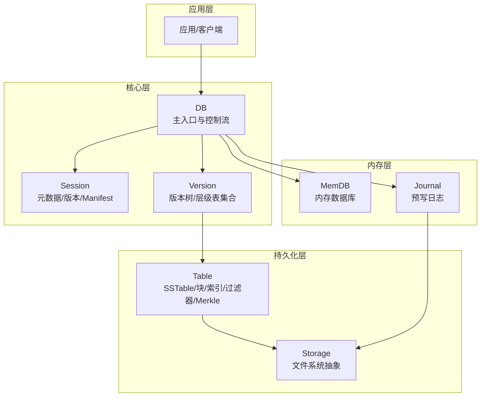
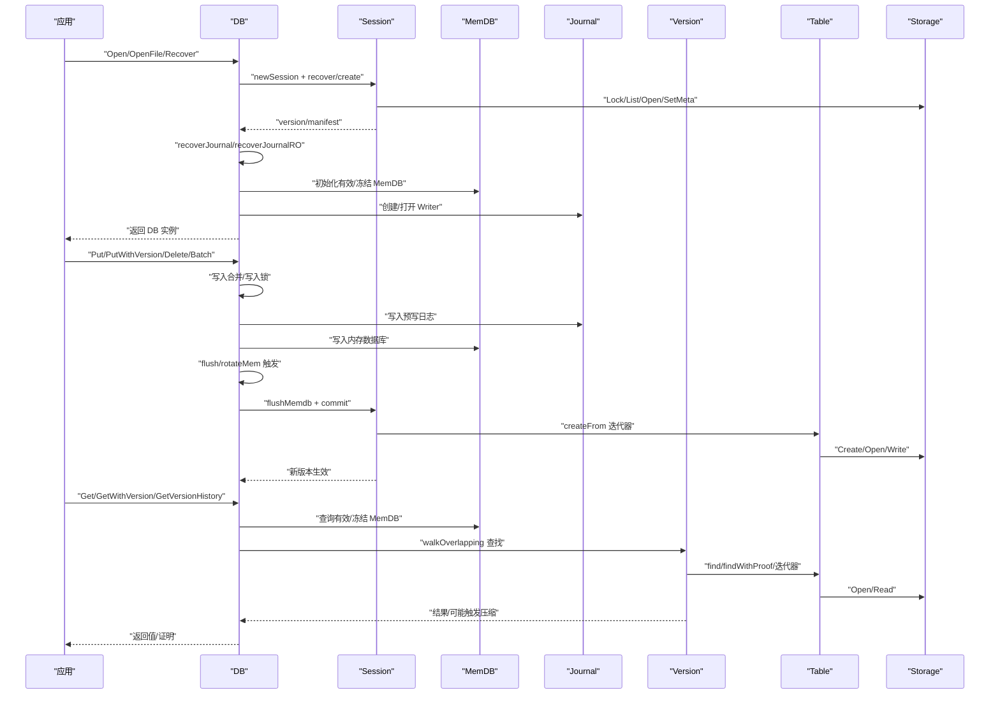
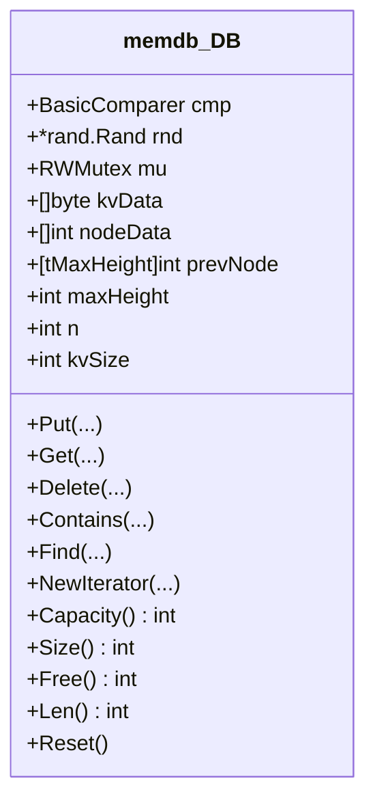
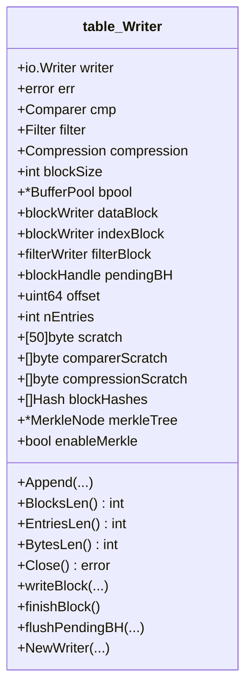
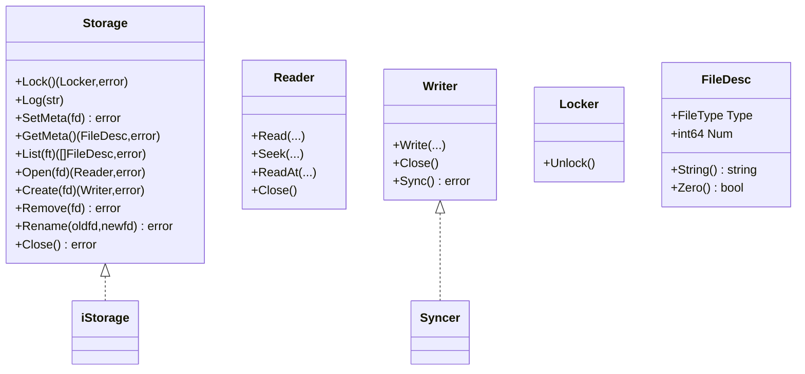
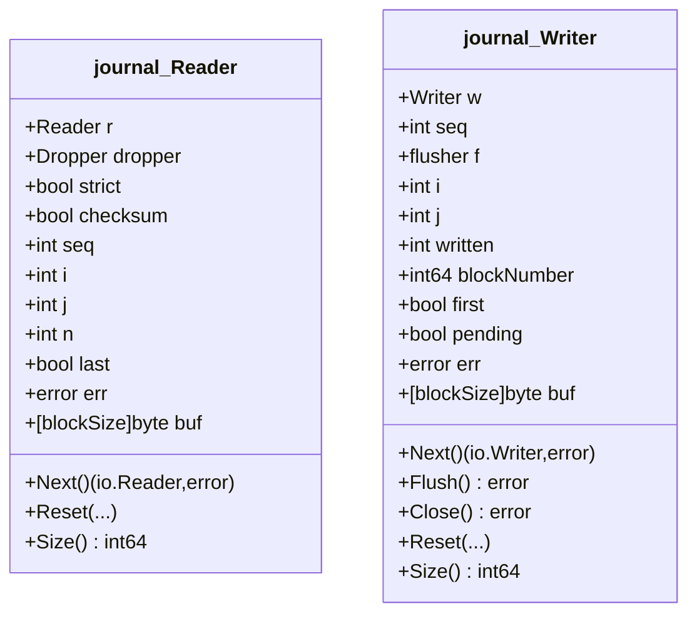
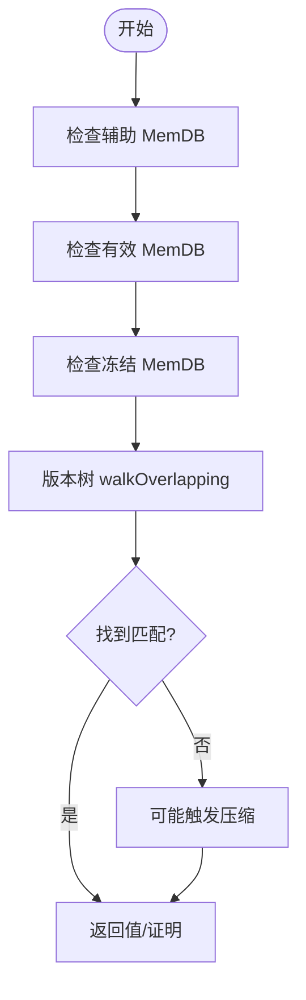
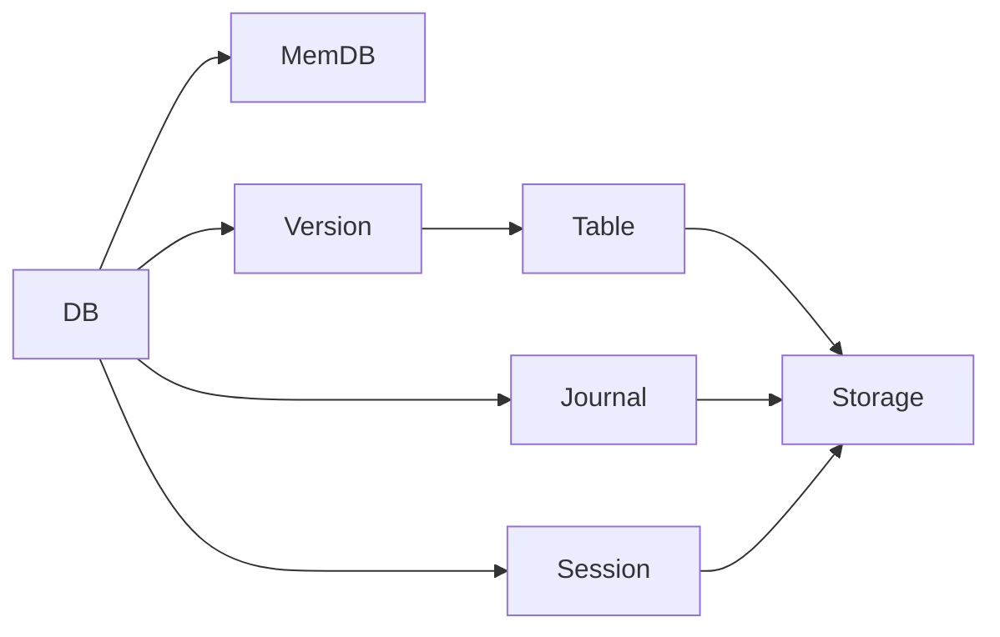

# 核心组件

<cite>
**本文引用的文件**
- [leveldb/db.go](file://leveldb/db.go)
- [leveldb/session.go](file://leveldb/session.go)
- [leveldb/memdb/memdb.go](file://leveldb/memdb/memdb.go)
- [leveldb/table/table.go](file://leveldb/table/table.go)
- [leveldb/table/writer.go](file://leveldb/table/writer.go)
- [leveldb/journal/journal.go](file://leveldb/journal/journal.go)
- [leveldb/storage/storage.go](file://leveldb/storage/storage.go)
- [leveldb/version.go](file://leveldb/version.go)
- [leveldb/session_record.go](file://leveldb/session_record.go)
- [leveldb/db_write.go](file://leveldb/db_write.go)
- [leveldb/db_state.go](file://leveldb/db_state.go)
</cite>

## 目录
1. [引言](#引言)
2. [项目结构](#项目结构)
3. [核心组件](#核心组件)
4. [架构总览](#架构总览)
5. [组件深度分析](#组件深度分析)
6. [依赖关系分析](#依赖关系分析)
7. [性能考量](#性能考量)
8. [故障排查指南](#故障排查指南)
9. [结论](#结论)

## 引言
本文件面向 avccDB 的核心组件，系统性梳理 DB、Session、MemDB、Table 和 Storage 组件的设计与交互。重点阐述：
- DB 作为主入口如何协调各组件工作（会话管理、写入合并、读取顺序、版本历史、快照等）
- Session 如何维护元数据、版本演进与 Manifest 管理
- MemDB 作为内存数据库如何与 Journal 协同写入，支持版本化键值
- Table 实现 SSTable 持久化存储，包含块结构、索引、过滤器与 Merkle 支持
- Storage 提供统一的存储抽象，屏蔽文件系统差异
- 组件间的依赖关系与调用流程，以及设计权衡（内存使用与性能、松耦合与可扩展性）

## 项目结构
从代码组织看，核心围绕“数据库实例”（DB）展开，DB 通过 Session 访问 Storage，并在运行期维护 MemDB、Journal、Table 文件与版本树。整体采用分层与模块化设计：DB 负责高层控制流；Session 负责元数据与版本；MemDB/Journal 负责写入路径；Table/Storage 负责持久化与文件系统抽象。



图表来源
- [leveldb/db.go](file://leveldb/db.go#L1-L120)
- [leveldb/session.go](file://leveldb/session.go#L1-L120)
- [leveldb/version.go](file://leveldb/version.go#L1-L120)
- [leveldb/memdb/memdb.go](file://leveldb/memdb/memdb.go#L1-L120)
- [leveldb/journal/journal.go](file://leveldb/journal/journal.go#L1-L120)
- [leveldb/table/table.go](file://leveldb/table/table.go#L1-L120)
- [leveldb/storage/storage.go](file://leveldb/storage/storage.go#L1-L120)

章节来源
- [leveldb/db.go](file://leveldb/db.go#L1-L120)
- [leveldb/session.go](file://leveldb/session.go#L1-L120)
- [leveldb/version.go](file://leveldb/version.go#L1-L120)
- [leveldb/memdb/memdb.go](file://leveldb/memdb/memdb.go#L1-L120)
- [leveldb/journal/journal.go](file://leveldb/journal/journal.go#L1-L120)
- [leveldb/table/table.go](file://leveldb/table/table.go#L1-L120)
- [leveldb/storage/storage.go](file://leveldb/storage/storage.go#L1-L120)

## 核心组件
- DB：数据库主入口，负责打开/恢复、写入合并、读取、快照、统计、关闭等。内部持有 Session、MemDB、Journal Writer、版本树引用、压缩通道等。
- Session：封装存储锁、选项、比较器、版本树、Manifest 写入器等，负责元数据恢复与提交。
- MemDB：内存跳表实现的键值存储，支持并发读写、容量/大小统计、迭代器，配合 Journal 实现 WAL。
- Table：SSTable 的读写实现，包含块编码、索引、过滤器、Merkle 树支持。
- Storage：统一的存储接口，屏蔽文件系统差异，提供锁、元数据、文件列表、打开/创建/删除/重命名等能力。

章节来源
- [leveldb/db.go](file://leveldb/db.go#L33-L120)
- [leveldb/session.go](file://leveldb/session.go#L36-L120)
- [leveldb/memdb/memdb.go](file://leveldb/memdb/memdb.go#L181-L240)
- [leveldb/table/table.go](file://leveldb/table/table.go#L1-L120)
- [leveldb/storage/storage.go](file://leveldb/storage/storage.go#L139-L189)

## 架构总览
DB 作为协调者，贯穿以下关键流程：
- 打开/恢复：通过 Session 读取/创建 Manifest，恢复 MemDB/Journal 状态，必要时重建/清理文件。
- 写入：写入合并、写入锁、批量写入、大批次事务优化、写入延迟与暂停处理。
- 读取：先查 MemDB（含冻结），再查版本树（多级 SST），支持最新版本/指定版本/版本历史/带证明读取。
- 版本与压缩：版本树管理层级表，触发/调度/执行压缩，更新 MasterRoot（Merkle 根聚合）。
- 关闭：释放资源、关闭 Journal、关闭 Session、回收 MemDB。



图表来源
- [leveldb/db.go](file://leveldb/db.go#L177-L243)
- [leveldb/db.go](file://leveldb/db.go#L295-L497)
- [leveldb/db.go](file://leveldb/db.go#L499-L666)
- [leveldb/session.go](file://leveldb/session.go#L122-L160)
- [leveldb/session_compaction.go](file://leveldb/session_compaction.go#L30-L52)
- [leveldb/version.go](file://leveldb/version.go#L142-L285)
- [leveldb/table/writer.go](file://leveldb/table/writer.go#L453-L488)
- [leveldb/journal/journal.go](file://leveldb/journal/journal.go#L343-L400)

章节来源
- [leveldb/db.go](file://leveldb/db.go#L177-L243)
- [leveldb/db.go](file://leveldb/db.go#L295-L497)
- [leveldb/db.go](file://leveldb/db.go#L499-L666)
- [leveldb/session.go](file://leveldb/session.go#L122-L160)
- [leveldb/session_compaction.go](file://leveldb/session_compaction.go#L30-L52)
- [leveldb/version.go](file://leveldb/version.go#L142-L285)
- [leveldb/table/writer.go](file://leveldb/table/writer.go#L453-L488)
- [leveldb/journal/journal.go](file://leveldb/journal/journal.go#L343-L400)

## 组件深度分析

### DB 组件
- 关键职责
  - 数据库生命周期管理（打开/恢复/关闭）
  - 写入合并与写入锁、批量写入、大批次事务优化
  - 读取路径（MemDB -> 版本树 -> SST）
  - 快照、属性查询、统计、大小估算
  - 版本历史查询、带证明读取、MasterRoot 更新
- 关键字段
  - seq、writeDelay、aliveSnaps/aliveIters、compaction 统计
  - s(session)、mem/frozenMem、journal/journalWriter、journalFd/frozenSeq
  - snapsList、batchPool、writeMergeC/writeMergedC/writeLockC/writeAckC
  - tcompCmdC/mcompCmdC/compErrC 等压缩通道
  - masterRoot/masterRootMu
  - closeW/closeC/closed/closer
- 关键方法
  - Open/OpenFile/Recover、Close
  - Put/PutWithVersion/Delete/Batch、Has/Get/GetWithVersion/GetVersionHistory
  - GetWithProof、GetProperty/Stats、SizeOf
  - flush/rotateMem、compTrigger、updateMasterRoot/computeMasterRoot

```mermaid
classDiagram
class DB {
+uint64 seq
+int64 cWriteDelay
+int32 cWriteDelayN
+int32 inWritePaused
+int32 aliveSnaps
+int32 aliveIters
+uint32 memComp
+uint32 level0Comp
+uint32 nonLevel0Comp
+uint32 seekComp
-*session s
+chan *memdb.DB memPool
-*memDB mem
-*memDB frozenMem
-*journal.Writer journal
+storage.Writer journalWriter
+storage.FileDesc journalFd
+storage.FileDesc frozenJournalFd
+uint64 frozenSeq
+*list.List snapsList
+sync.Pool batchPool
+chan writeMerge writeMergeC
+chan bool writeMergedC
+chan struct{} writeLockC
+chan error writeAckC
+time.Duration writeDelay
+int writeDelayN
+*Transaction tr
+chan cCmd tcompCmdC
+chan cCmd mcompCmdC
+chan error compErrC
+chan error compPerErrC
+chan error compErrSetC
+bool compWriteLocking
+cStats compStats
+int memdbMaxLevel
+RWMutex masterRootMu
+merkle.Hash masterRoot
+sync.WaitGroup closeW
+chan struct{} closeC
+uint32 closed
+io.Closer closer
+Open(...)
+OpenFile(...)
+Recover(...)
+Close() error
+Put(...)
+PutWithVersion(...)
+Delete(...)
+Batch(...)
+Get(...)
+GetWithVersion(...)
+GetVersionHistory(...)
+GetWithProof(...)
+GetProperty(...)
+Stats(...)
+SizeOf(...)
+flush(...)
+updateMasterRoot()
+computeMasterRoot()
}
```

图表来源
- [leveldb/db.go](file://leveldb/db.go#L33-L120)
- [leveldb/db.go](file://leveldb/db.go#L1097-L1106)
- [leveldb/db.go](file://leveldb/db.go#L1115-L1124)
- [leveldb/db.go](file://leveldb/db.go#L1174-L1183)
- [leveldb/db.go](file://leveldb/db.go#L1127-L1146)
- [leveldb/db.go](file://leveldb/db.go#L1388-L1440)
- [leveldb/db.go](file://leveldb/db.go#L1448-L1476)
- [leveldb/db.go](file://leveldb/db.go#L1578-L1641)
- [leveldb/db_write.go](file://leveldb/db_write.go#L274-L329)
- [leveldb/db_write.go](file://leveldb/db_write.go#L394-L437)
- [leveldb/db_write.go](file://leveldb/db_write.go#L444-L446)
- [leveldb/db_write.go](file://leveldb/db_write.go#L65-L130)
- [leveldb/db.go](file://leveldb/db.go#L1491-L1571)

章节来源
- [leveldb/db.go](file://leveldb/db.go#L33-L120)
- [leveldb/db_write.go](file://leveldb/db_write.go#L274-L329)
- [leveldb/db_write.go](file://leveldb/db_write.go#L394-L437)
- [leveldb/db_write.go](file://leveldb/db_write.go#L444-L446)
- [leveldb/db_write.go](file://leveldb/db_write.go#L65-L130)
- [leveldb/db.go](file://leveldb/db.go#L1097-L1106)
- [leveldb/db.go](file://leveldb/db.go#L1115-L1124)
- [leveldb/db.go](file://leveldb/db.go#L1174-L1183)
- [leveldb/db.go](file://leveldb/db.go#L1127-L1146)
- [leveldb/db.go](file://leveldb/db.go#L1388-L1440)
- [leveldb/db.go](file://leveldb/db.go#L1448-L1476)
- [leveldb/db.go](file://leveldb/db.go#L1491-L1571)
- [leveldb/db.go](file://leveldb/db.go#L1578-L1641)

### Session 组件
- 关键职责
  - 存储锁、选项、比较器、版本树管理
  - Manifest 读取/创建/提交（包含序列号、文件号、比较器、压缩指针、表增删记录）
  - 版本演进（spawn/commit/newManifest/flushManifest/setVersion）
- 关键字段
  - stNextFileNum/stJournalNum/stPrevJournalNum/stTempFileNum/stSeqNum
  - stor/storLock/o/icmp/tops
  - manifest/manifestWriter/manifestFd
  - stCompPtrs/stVersion/ntVersionID/refCh/relCh/deltaCh/abandon/closeC/closeW/vmu
- 关键方法
  - newSession、create/recover、commit、newManifest/flushManifest、setVersion、version()

```mermaid
classDiagram
class session {
+int64 stNextFileNum
+int64 stJournalNum
+int64 stPrevJournalNum
+int64 stTempFileNum
+uint64 stSeqNum
-*iStorage stor
+Locker storLock
+*cachedOptions o
+*iComparer icmp
+*tOps tops
-*journal.Writer manifest
+storage.Writer manifestWriter
+storage.FileDesc manifestFd
+[]internalKey stCompPtrs
+*version stVersion
+int64 ntVersionID
+chan *vTask refCh
+chan *vTask relCh
+chan *vDelta deltaCh
+chan int64 abandon
+chan struct{} closeC
+sync.WaitGroup closeW
+sync.Mutex vmu
+newSession(...)
+create() error
+recover() error
+commit(...) error
+newManifest(...)
+flushManifest(...)
+setVersion(...)
+version() *version
+close()
+release()
}
```

图表来源
- [leveldb/session.go](file://leveldb/session.go#L36-L120)
- [leveldb/session.go](file://leveldb/session.go#L122-L160)
- [leveldb/session.go](file://leveldb/session.go#L210-L241)
- [leveldb/session_util.go](file://leveldb/session_util.go#L321-L323)
- [leveldb/session_util.go](file://leveldb/session_util.go#L360-L380)
- [leveldb/session_util.go](file://leveldb/session_util.go#L468-L490)
- [leveldb/session_util.go](file://leveldb/session_util.go#L252-L257)

章节来源
- [leveldb/session.go](file://leveldb/session.go#L36-L120)
- [leveldb/session.go](file://leveldb/session.go#L122-L160)
- [leveldb/session.go](file://leveldb/session.go#L210-L241)
- [leveldb/session_util.go](file://leveldb/session_util.go#L321-L323)
- [leveldb/session_util.go](file://leveldb/session_util.go#L360-L380)
- [leveldb/session_util.go](file://leveldb/session_util.go#L468-L490)
- [leveldb/session_util.go](file://leveldb/session_util.go#L252-L257)

### MemDB 组件
- 关键职责
  - 内存键值存储，基于跳表结构，支持并发读写、容量/大小/长度统计、迭代器
  - 与 Journal 协同写入，支持版本化键值（通过内部键编码）
- 关键字段
  - cmp/rnd、mu/kvData/nodeData/prevNode/maxHeight/n/kvSize
- 关键方法
  - Put/Get/Delete/Contains/Find/NewIterator/Capacity/Size/Free/Len/Reset



图表来源
- [leveldb/memdb/memdb.go](file://leveldb/memdb/memdb.go#L181-L240)
- [leveldb/memdb/memdb.go](file://leveldb/memdb/memdb.go#L276-L314)
- [leveldb/memdb/memdb.go](file://leveldb/memdb/memdb.go#L320-L338)
- [leveldb/memdb/memdb.go](file://leveldb/memdb/memdb.go#L343-L348)
- [leveldb/memdb/memdb.go](file://leveldb/memdb/memdb.go#L355-L365)
- [leveldb/memdb/memdb.go](file://leveldb/memdb/memdb.go#L373-L385)
- [leveldb/memdb/memdb.go](file://leveldb/memdb/memdb.go#L406-L408)
- [leveldb/memdb/memdb.go](file://leveldb/memdb/memdb.go#L411-L415)
- [leveldb/memdb/memdb.go](file://leveldb/memdb/memdb.go#L420-L424)
- [leveldb/memdb/memdb.go](file://leveldb/memdb/memdb.go#L427-L431)
- [leveldb/memdb/memdb.go](file://leveldb/memdb/memdb.go#L434-L438)
- [leveldb/memdb/memdb.go](file://leveldb/memdb/memdb.go#L441-L458)

章节来源
- [leveldb/memdb/memdb.go](file://leveldb/memdb/memdb.go#L181-L240)
- [leveldb/memdb/memdb.go](file://leveldb/memdb/memdb.go#L276-L314)
- [leveldb/memdb/memdb.go](file://leveldb/memdb/memdb.go#L320-L338)
- [leveldb/memdb/memdb.go](file://leveldb/memdb/memdb.go#L343-L348)
- [leveldb/memdb/memdb.go](file://leveldb/memdb/memdb.go#L355-L365)
- [leveldb/memdb/memdb.go](file://leveldb/memdb/memdb.go#L373-L385)
- [leveldb/memdb/memdb.go](file://leveldb/memdb/memdb.go#L406-L408)
- [leveldb/memdb/memdb.go](file://leveldb/memdb/memdb.go#L411-L415)
- [leveldb/memdb/memdb.go](file://leveldb/memdb/memdb.go#L420-L424)
- [leveldb/memdb/memdb.go](file://leveldb/memdb/memdb.go#L427-L431)
- [leveldb/memdb/memdb.go](file://leveldb/memdb/memdb.go#L434-L438)
- [leveldb/memdb/memdb.go](file://leveldb/memdb/memdb.go#L441-L458)

### Table 组件
- 关键职责
  - SSTable 写入：块编码、索引、过滤器、元数据、尾部、校验与压缩
  - Merkle 树支持：块级哈希、树构建、紧凑格式序列化
- 关键字段
  - Writer：writer/err/cmp/filter/compression/blockSize/bpool/dataBlock/indexBlock/filterBlock/pendingBH/offset/nEntries/scratch/comparerScratch/compressionScratch/blockHashes/merkleTree/enableMerkle
- 关键方法
  - Append/BlocksLen/EntriesLen/BytesLen/Close/WriteBlock/FinishBlock/FlushPendingBH
  - Table 文档注释中描述了块、过滤器、索引、尾部等结构



图表来源
- [leveldb/table/writer.go](file://leveldb/table/writer.go#L148-L175)
- [leveldb/table/writer.go](file://leveldb/table/writer.go#L265-L293)
- [leveldb/table/writer.go](file://leveldb/table/writer.go#L296-L303)
- [leveldb/table/writer.go](file://leveldb/table/writer.go#L316-L329)
- [leveldb/table/writer.go](file://leveldb/table/writer.go#L320-L349)
- [leveldb/table/writer.go](file://leveldb/table/writer.go#L346-L449)
- [leveldb/table/writer.go](file://leveldb/table/writer.go#L453-L488)
- [leveldb/table/table.go](file://leveldb/table/table.go#L1-L120)

章节来源
- [leveldb/table/writer.go](file://leveldb/table/writer.go#L148-L175)
- [leveldb/table/writer.go](file://leveldb/table/writer.go#L265-L293)
- [leveldb/table/writer.go](file://leveldb/table/writer.go#L296-L303)
- [leveldb/table/writer.go](file://leveldb/table/writer.go#L316-L329)
- [leveldb/table/writer.go](file://leveldb/table/writer.go#L320-L349)
- [leveldb/table/writer.go](file://leveldb/table/writer.go#L346-L449)
- [leveldb/table/writer.go](file://leveldb/table/writer.go#L453-L488)
- [leveldb/table/table.go](file://leveldb/table/table.go#L1-L120)

### Storage 组件
- 关键职责
  - 统一文件系统抽象：锁、日志、元数据、文件列表、打开/创建/删除/重命名、关闭
- 关键接口
  - Storage 接口：Lock/Log/SetMeta/GetMeta/List/Open/Create/Remove/Rename/Close
  - Reader/Writer/Syncer/Locker/FileDesc 等类型定义



图表来源
- [leveldb/storage/storage.go](file://leveldb/storage/storage.go#L139-L189)
- [leveldb/storage/storage.go](file://leveldb/storage/storage.go#L1-L120)

章节来源
- [leveldb/storage/storage.go](file://leveldb/storage/storage.go#L139-L189)
- [leveldb/storage/storage.go](file://leveldb/storage/storage.go#L1-L120)

### Journal 组件
- 关键职责
  - 预写日志（WAL）读写：块边界、校验、多块恢复、严格模式、丢弃回调
- 关键字段
  - Reader：r/dropper/strict/checksum/seq/i,j,n/last/err/buf
  - Writer：w/f/seq/i,j/written/blockNumber/first/pending/err/buf
- 关键方法
  - NewReader/NewWriter、Next/Flush/Close/Reset、Size



图表来源
- [leveldb/journal/journal.go](file://leveldb/journal/journal.go#L124-L210)
- [leveldb/journal/journal.go](file://leveldb/journal/journal.go#L244-L342)
- [leveldb/journal/journal.go](file://leveldb/journal/journal.go#L343-L400)
- [leveldb/journal/journal.go](file://leveldb/journal/journal.go#L470-L537)

章节来源
- [leveldb/journal/journal.go](file://leveldb/journal/journal.go#L124-L210)
- [leveldb/journal/journal.go](file://leveldb/journal/journal.go#L244-L342)
- [leveldb/journal/journal.go](file://leveldb/journal/journal.go#L343-L400)
- [leveldb/journal/journal.go](file://leveldb/journal/journal.go#L470-L537)

### 版本树与读取流程
- Version：版本树管理层级表集合，提供查找、版本历史、迭代器、偏移估算、压缩评分与触发
- 读取顺序：辅助 MemDB -> 有效/冻结 MemDB -> 版本树 walkOverlapping -> SSTable 查找/迭代器
- 版本历史：先从 MemDB 迭代收集，再从 SSTable 迭代收集，最后合并去重排序



图表来源
- [leveldb/db.go](file://leveldb/db.go#L797-L832)
- [leveldb/version.go](file://leveldb/version.go#L142-L285)
- [leveldb/version.go](file://leveldb/version.go#L431-L532)

章节来源
- [leveldb/db.go](file://leveldb/db.go#L797-L832)
- [leveldb/version.go](file://leveldb/version.go#L142-L285)
- [leveldb/version.go](file://leveldb/version.go#L431-L532)

## 依赖关系分析
- DB 依赖 Session（元数据/版本）、MemDB（内存写入）、Journal（WAL）、Table（SSTable）、Storage（文件系统）
- Session 依赖 Storage（文件操作）、Manifest（Journal Writer）、比较器、版本树
- Table 依赖比较器、过滤器、缓冲池、Merkle（可选）
- Journal 依赖存储 Reader/Writer、校验与块格式
- Storage 提供统一接口，屏蔽具体文件系统差异



图表来源
- [leveldb/db.go](file://leveldb/db.go#L1-L120)
- [leveldb/session.go](file://leveldb/session.go#L1-L120)
- [leveldb/version.go](file://leveldb/version.go#L1-L120)
- [leveldb/table/writer.go](file://leveldb/table/writer.go#L148-L175)
- [leveldb/journal/journal.go](file://leveldb/journal/journal.go#L343-L400)
- [leveldb/storage/storage.go](file://leveldb/storage/storage.go#L139-L189)

章节来源
- [leveldb/db.go](file://leveldb/db.go#L1-L120)
- [leveldb/session.go](file://leveldb/session.go#L1-L120)
- [leveldb/version.go](file://leveldb/version.go#L1-L120)
- [leveldb/table/writer.go](file://leveldb/table/writer.go#L148-L175)
- [leveldb/journal/journal.go](file://leveldb/journal/journal.go#L343-L400)
- [leveldb/storage/storage.go](file://leveldb/storage/storage.go#L139-L189)

## 性能考量
- 内存使用与性能平衡
  - MemDB 容量与写缓冲区大小相关，flush/rotateMem 会在 L0 文件数达到阈值时触发写入延迟或暂停，避免内存膨胀
  - 大批次写入可选择事务直接写入 SST，绕过 Journal，减少 WAL 开销
- 压缩与层级策略
  - 版本树根据层级文件数量/总大小计算压缩评分，触发 L0/L1 等不同策略
  - Merkle 树聚合 MasterRoot，便于快速验证与溯源
- I/O 与并发
  - Storage 提供锁与日志，确保并发安全与一致性
  - Table Writer 使用缓冲池与块压缩，降低磁盘写放大

章节来源
- [leveldb/db_write.go](file://leveldb/db_write.go#L65-L130)
- [leveldb/db_write.go](file://leveldb/db_write.go#L274-L329)
- [leveldb/version.go](file://leveldb/version.go#L646-L696)
- [leveldb/table/writer.go](file://leveldb/table/writer.go#L148-L175)
- [leveldb/storage/storage.go](file://leveldb/storage/storage.go#L139-L189)

## 故障排查指南
- 打开/恢复错误
  - Manifest 缺失/损坏：通过 Recover 流程重建/修复
  - Journal 恢复：逐个 Journal 重放至 MemDB，必要时清理旧 Journal
- 写入失败
  - 写入合并/写入锁阻塞：检查 writeMergeC/writeLockC 是否被占用
  - 压缩错误：compErrC/compPerErrC 中的错误需关注
- 读取异常
  - 版本历史不一致：确认 MemDB 与 SST 的版本范围与删除标记
  - 压缩触发导致读取抖动：查看 cSeek 与压缩评分
- 关闭问题
  - 关闭前确保无未释放快照/迭代器；关闭 Journal 与 Session

章节来源
- [leveldb/db.go](file://leveldb/db.go#L295-L497)
- [leveldb/db.go](file://leveldb/db.go#L499-L666)
- [leveldb/db.go](file://leveldb/db.go#L1578-L1641)
- [leveldb/version.go](file://leveldb/version.go#L534-L549)

## 结论
avccDB 的核心组件通过清晰的职责划分与松耦合设计，实现了高性能、可扩展的 LSM-Tree 数据库：
- DB 作为主入口，协调 Session、MemDB、Journal、Table、Storage 各层
- Session 管理元数据与版本演进，保证一致性与可恢复性
- MemDB/Journal 提供高效的内存写入与 WAL 保障
- Table/Storage 提供稳健的持久化与文件系统抽象
- 版本树与压缩策略在性能与空间之间取得平衡，Merkle 支持增强数据完整性与溯源能力