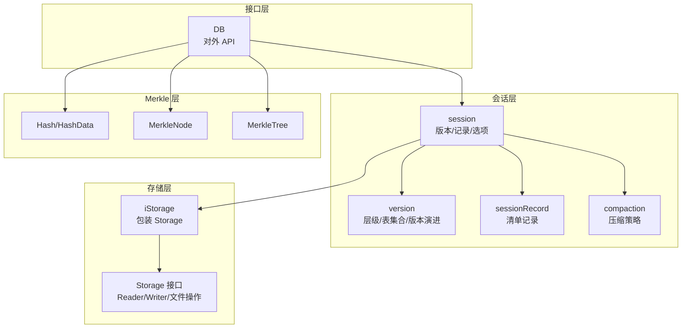
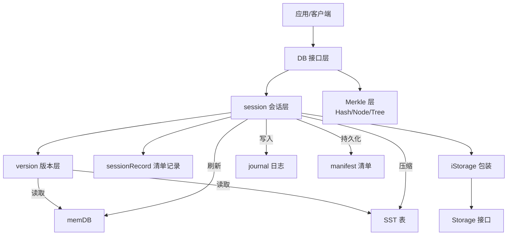
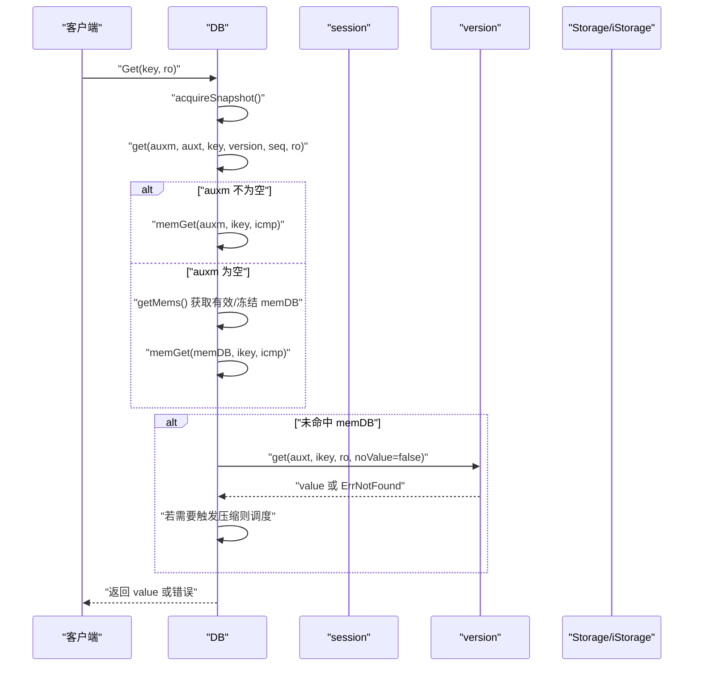
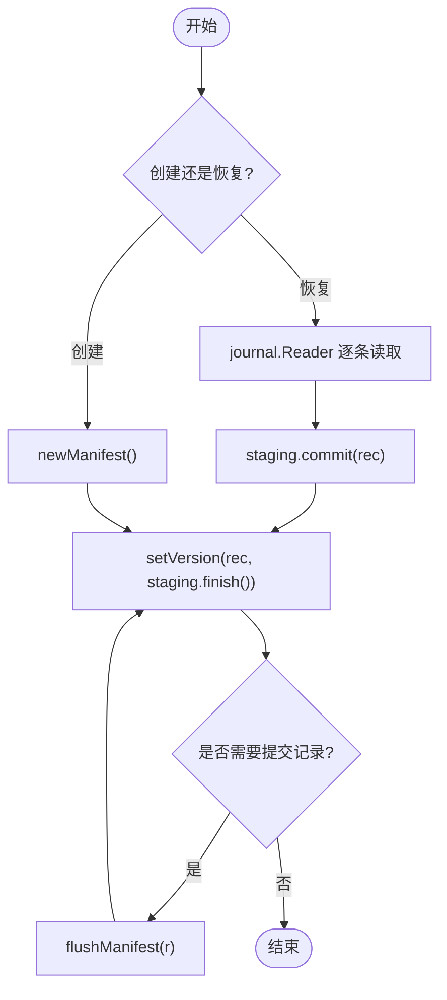
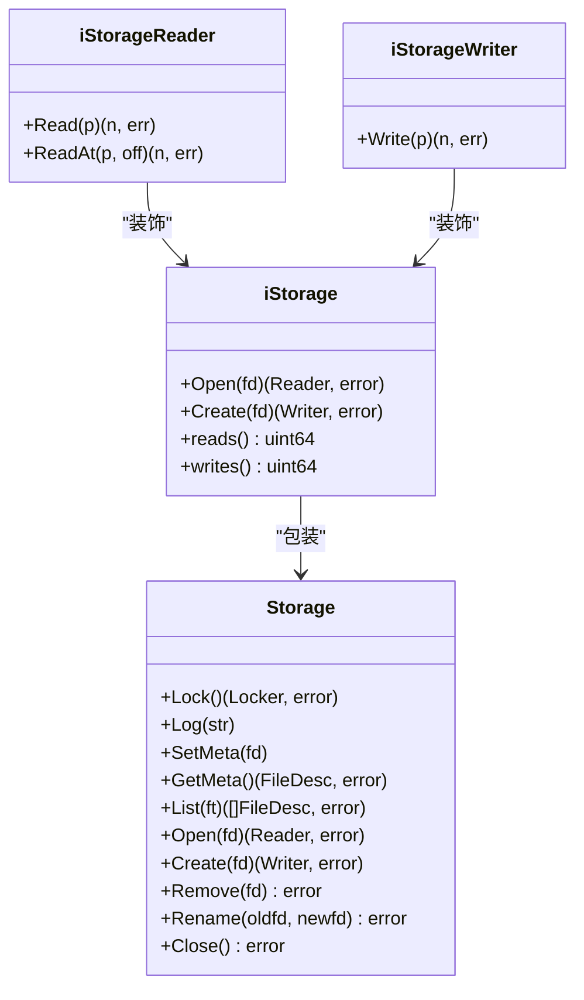
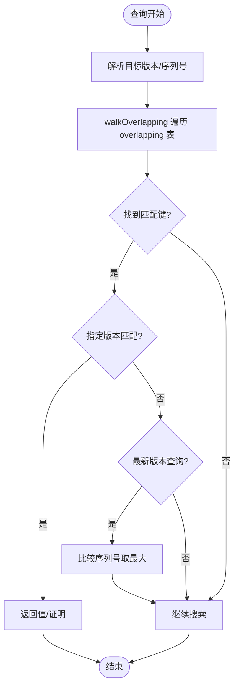
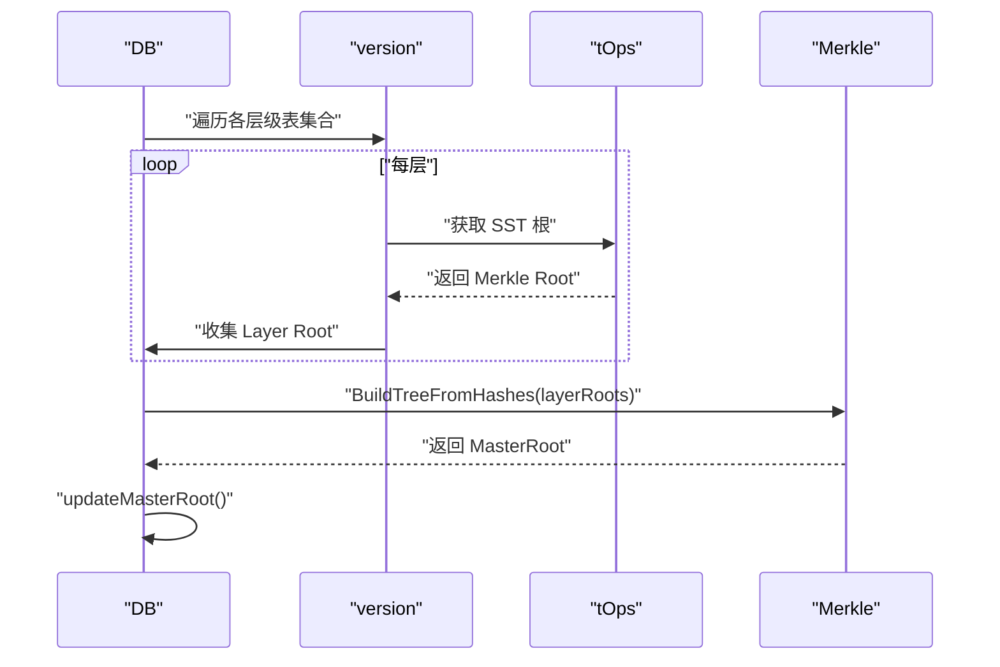
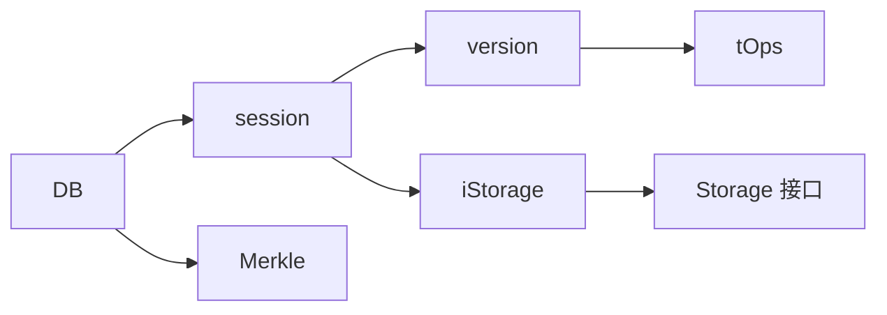

# 分层架构

<cite>
**本文引用的文件**
- [README.md](file://README.md)
- [leveldb/db.go](file://leveldb/db.go)
- [leveldb/session.go](file://leveldb/session.go)
- [leveldb/storage.go](file://leveldb/storage.go)
- [leveldb/storage/storage.go](file://leveldb/storage/storage.go)
- [leveldb/version.go](file://leveldb/version.go)
- [leveldb/session_record.go](file://leveldb/session_record.go)
- [leveldb/session_compaction.go](file://leveldb/session_compaction.go)
- [leveldb/merkle/hash.go](file://leveldb/merkle/hash.go)
- [leveldb/merkle/node.go](file://leveldb/merkle/node.go)
- [leveldb/merkle/tree.go](file://leveldb/merkle/tree.go)
</cite>

## 目录
1. [引言](#引言)
2. [项目结构](#项目结构)
3. [核心组件](#核心组件)
4. [架构总览](#架构总览)
5. [详细组件分析](#详细组件分析)
6. [依赖关系分析](#依赖关系分析)
7. [性能考量](#性能考量)
8. [故障排查指南](#故障排查指南)
9. [结论](#结论)

## 引言
本文件面向 avccDB 的分层架构，聚焦于三层设计：接口层（DB）、会话层（session）、存储层（storage），并解释这些层次如何协同实现 mLSM（多级日志结构模型）的模块化与可扩展性。文档特别说明：
- DB 结构体作为顶层接口层，协调会话（session）、内存数据库（memDB）、存储（storage）等下层组件；
- session 结构体作为会话管理层，管理版本（version）、记录（sessionRecord）和选项（options）；
- storage 包作为存储抽象层，提供统一的文件操作接口；
- 展示接口层、会话层、存储层之间的依赖关系与数据流，并结合 mLSM 的 MasterRoot 概念说明可验证性与溯源能力。

章节来源
- [README.md](file://README.md#L1-L108)

## 项目结构
avccDB 采用典型的分层组织方式：
- 接口层：对外暴露 DB API，负责读写、快照、迭代器、统计等高层操作；
- 会话层：封装数据库状态、版本管理、清单（manifest）恢复与提交、压缩策略选择；
- 存储层：抽象文件系统访问，屏蔽平台差异，提供统一的 Reader/Writer/Storage 接口；
- 版本层：描述 LSM 层级结构、表集合、版本演进与合并策略；
- 记录层：序列化/反序列化 manifest 中的元信息（比较器、文件号、序列号、压缩指针、增删表等）；
- 压缩层：基于版本层选择压缩源与目标，生成迭代器进行合并输出；
- Merkle 层：提供哈希、节点、树与证明，支撑 MasterRoot 聚合与可验证性。

图表来源
- [leveldb/db.go](file://leveldb/db.go#L1-L120)
- [leveldb/session.go](file://leveldb/session.go#L36-L121)
- [leveldb/version.go](file://leveldb/version.go#L21-L90)
- [leveldb/session_record.go](file://leveldb/session_record.go#L55-L132)
- [leveldb/session_compaction.go](file://leveldb/session_compaction.go#L151-L195)
- [leveldb/storage.go](file://leveldb/storage.go#L8-L35)
- [leveldb/storage/storage.go](file://leveldb/storage/storage.go#L139-L189)
- [leveldb/merkle/hash.go](file://leveldb/merkle/hash.go#L12-L66)
- [leveldb/merkle/node.go](file://leveldb/merkle/node.go#L10-L52)
- [leveldb/merkle/tree.go](file://leveldb/merkle/tree.go#L10-L66)

章节来源
- [leveldb/db.go](file://leveldb/db.go#L1-L120)
- [leveldb/session.go](file://leveldb/session.go#L36-L121)
- [leveldb/storage.go](file://leveldb/storage.go#L8-L35)
- [leveldb/storage/storage.go](file://leveldb/storage/storage.go#L139-L189)

## 核心组件
- DB（接口层）
  - 作为对外唯一入口，持有 session、memDB、journal、快照链表、写入合并通道、压缩命令通道、MasterRoot 等；
  - 提供 Open/OpenFile/Recover/Get/GetWithVersion/GetWithProof/GetVersionHistory/NewIterator/GetProperty/Stats/Close 等方法；
  - 在读取路径上，优先检查辅助 memDB、有效/冻结 memDB，再查询版本（version）与 SST 文件；在写入路径上，协调 memDB 刷新、journal 写入与 manifest 提交。
- session（会话层）
  - 封装 Storage 锁、选项缓存、比较器、表操作、当前版本、压缩指针、版本提交与恢复；
  - 负责创建/恢复 manifest、提交 sessionRecord、生成新版本、触发压缩；
  - 通过 iStorage 包装底层 Storage，统计读写字节数。
- version（版本层）
  - 描述 LSM 各层级的表集合，提供查找、迭代器构建、版本演进（spawn）、压缩评分与触发；
  - 支持按版本查询、版本历史收集、寻位采样以触发压缩。
- sessionRecord（记录层）
  - 定义清单字段类型（比较器、journal 号、下一个文件号、序列号、压缩指针、新增/删除表等）；
  - 提供编码/解码逻辑，用于 manifest 的持久化与恢复。
- storage（存储层）
  - 定义 Storage 接口及文件类型枚举（Manifest/Journal/Table/Temp）；
  - iStorage 对 Storage 进行包装，统计读写字节数，提供 Open/Create 的装饰器。
- Merkle（可验证性层）
  - 提供 Hash、MerkleNode、MerkleTree 与相关工具函数，支撑 MasterRoot 聚合与证明生成。

章节来源
- [leveldb/db.go](file://leveldb/db.go#L33-L98)
- [leveldb/session.go](file://leveldb/session.go#L36-L121)
- [leveldb/version.go](file://leveldb/version.go#L21-L90)
- [leveldb/session_record.go](file://leveldb/session_record.go#L24-L67)
- [leveldb/storage.go](file://leveldb/storage.go#L8-L35)
- [leveldb/storage/storage.go](file://leveldb/storage/storage.go#L139-L189)
- [leveldb/merkle/hash.go](file://leveldb/merkle/hash.go#L12-L66)
- [leveldb/merkle/node.go](file://leveldb/merkle/node.go#L10-L52)
- [leveldb/merkle/tree.go](file://leveldb/merkle/tree.go#L10-L66)

## 架构总览
下图展示了 avccDB 的分层架构与交互关系，强调接口层对会话层的协调、会话层对存储层的依赖、以及版本层在读写路径上的作用。

图表来源
- [leveldb/db.go](file://leveldb/db.go#L177-L243)
- [leveldb/session.go](file://leveldb/session.go#L122-L208)
- [leveldb/version.go](file://leveldb/version.go#L142-L285)
- [leveldb/storage.go](file://leveldb/storage.go#L14-L35)
- [leveldb/storage/storage.go](file://leveldb/storage/storage.go#L139-L189)

## 详细组件分析

### DB 组件分析（接口层）
- 角色定位
  - 顶层 API 入口，协调 session、memDB、journal、快照、压缩与存储；
  - 提供并发安全的读写接口，内部维护序列号、写入延迟统计、压缩计数等。
- 关键职责
  - 打开/恢复数据库：Open/OpenFile/Recover，内部创建 session 并恢复或创建 manifest；
  - 读取：Get/GetWithVersion/GetWithProof/GetVersionHistory/Has/NewIterator；
  - 写入：Put/Delete/Batch 等（由 DB 协调 memDB 刷新与 manifest 提交）；
  - 统计与属性：GetProperty/Stats/SizeOf；
  - 关闭：清理资源、关闭 journal、释放 session。
- 与会话层协作
  - 通过 s 字段持有 session，所有版本查询与提交均委托给 session/version；
  - 写入路径中，DB 调用 session.flushMemdb 将 memDB 内容落盘为 SST，并提交到 manifest；
  - 读取路径中，DB 先查辅助 memDB，再查有效/冻结 memDB，最后查 version 与 SST。
- 与存储层协作
  - 通过 session.stor 使用 iStorage 包装的 Storage 接口进行文件列表、打开、创建、重命名、删除等操作；
  - iStorage 统计读写字节数，便于性能监控。
- MasterRoot 集成
  - DB 维护 masterRoot 并提供 GetMasterRoot；
  - 在 flush/compaction 后调用 updateMasterRoot 重新计算聚合根；
  - GetWithProof 返回包含 MasterRoot 的 Merkle 证明，支持跨层验证。

图表来源
- [leveldb/db.go](file://leveldb/db.go#L800-L833)
- [leveldb/db.go](file://leveldb/db.go#L1092-L1126)
- [leveldb/version.go](file://leveldb/version.go#L142-L285)

章节来源
- [leveldb/db.go](file://leveldb/db.go#L33-L98)
- [leveldb/db.go](file://leveldb/db.go#L177-L243)
- [leveldb/db.go](file://leveldb/db.go#L800-L833)
- [leveldb/db.go](file://leveldb/db.go#L1092-L1126)
- [leveldb/db.go](file://leveldb/db.go#L1479-L1571)

### session 组件分析（会话管理层）
- 角色定位
  - 数据库生命周期与状态的管理者，负责 Storage 锁、选项、比较器、版本、压缩指针、清单写入与恢复。
- 关键职责
  - newSession：初始化 session，设置选项、创建表操作器、启动引用循环处理协程；
  - create/recover：创建或恢复 manifest，从 journal 读取记录并应用到版本；
  - commit：根据 sessionRecord 生成新版本，必要时新建或滚动 manifest；
  - flushMemdb：将 memDB 落盘为 SST，选择目标层级并添加到记录；
  - pickCompaction/getCompactionRange/newCompaction：基于版本评分与压缩指针选择压缩任务；
  - setVersion：切换当前版本并释放旧版本。
- 与存储层协作
  - 通过 iStorage 包装 Storage，统一文件操作；
  - 通过 journal.Writer 写入 manifest，通过 stor.List/Open/Create/Rename/Remove 管理文件。
- 与版本层协作
  - version().spawn()/commit()/release() 管理版本演进；
  - setCompPtr/getCompPtr 管理压缩指针，影响后续压缩选择。

图表来源
- [leveldb/session.go](file://leveldb/session.go#L122-L208)
- [leveldb/session.go](file://leveldb/session.go#L210-L243)
- [leveldb/session_compaction.go](file://leveldb/session_compaction.go#L31-L53)

章节来源
- [leveldb/session.go](file://leveldb/session.go#L36-L121)
- [leveldb/session.go](file://leveldb/session.go#L122-L208)
- [leveldb/session.go](file://leveldb/session.go#L210-L243)
- [leveldb/session_compaction.go](file://leveldb/session_compaction.go#L31-L53)

### storage 包（存储抽象层）
- 角色定位
  - 定义统一的文件系统抽象接口，屏蔽平台差异；
  - iStorage 包装 Storage，统计读写字节数，便于监控。
- 关键接口
  - Storage：Lock/Log/SetMeta/GetMeta/List/Open/Create/Remove/Rename/Close；
  - Reader/Writer/Syncer：统一读写与同步；
  - FileDesc：文件类型与编号；
  - FileType：Manifest/Journal/Table/Temp。
- 与会话层协作
  - session.stor 使用 iStorage，所有文件操作经由 iStorage；
  - iStorage.Open/Create 返回装饰器 Reader/Writer，自动统计读写量。

图表来源
- [leveldb/storage/storage.go](file://leveldb/storage/storage.go#L139-L189)
- [leveldb/storage.go](file://leveldb/storage.go#L8-L35)
- [leveldb/storage.go](file://leveldb/storage.go#L14-L31)

章节来源
- [leveldb/storage/storage.go](file://leveldb/storage/storage.go#L139-L189)
- [leveldb/storage.go](file://leveldb/storage.go#L8-L35)

### version 组件分析（版本层）
- 角色定位
  - 描述 LSM 的层级结构与表集合，提供查找、迭代器构建、版本演进与压缩评分；
  - 通过 spawn/commit 实现不可变版本的原子切换。
- 关键职责
  - get/getWithProof/getVersionHistory：按版本/范围查询，遍历 overlapping 表，解析内部键，支持最新版本匹配与特定版本匹配；
  - getIterators：为不同层级构造迭代器，Level-0 合并所有可能重叠的表，其他层级使用索引迭代器；
  - computeCompaction/needCompaction：计算各层级评分，决定是否需要压缩；
  - spawn/finish：基于 sessionRecord 生成新版本，处理新增/删除表，保持有序与不可变。
- 与会话层协作
  - 通过 session.tops 访问表操作器，执行 find/findWithProof/newIterator 等；
  - 通过 session.icmp 进行用户键比较与范围判断。

图表来源
- [leveldb/version.go](file://leveldb/version.go#L142-L285)
- [leveldb/version.go](file://leveldb/version.go#L431-L532)

章节来源
- [leveldb/version.go](file://leveldb/version.go#L21-L90)
- [leveldb/version.go](file://leveldb/version.go#L142-L285)
- [leveldb/version.go](file://leveldb/version.go#L431-L532)

### sessionRecord 组件分析（记录层）
- 角色定位
  - 定义 manifest 中的记录字段与编码/解码格式；
  - 用于持久化比较器名称、journal 号、下一个文件号、序列号、压缩指针、新增/删除表等。
- 关键职责
  - set*/add*/del* 系列方法设置记录字段；
  - encode/decode：使用 varint 编码字段头与数据，支持错误包装与校验；
  - reset* 系列方法清空临时缓冲，避免重复提交。
- 与会话层协作
  - session.commit 传入 sessionRecord，生成新版本并写入 manifest；
  - session.recover 从 manifest journal 逐条读取并应用到 staging。

章节来源
- [leveldb/session_record.go](file://leveldb/session_record.go#L24-L67)
- [leveldb/session_record.go](file://leveldb/session_record.go#L70-L132)
- [leveldb/session_record.go](file://leveldb/session_record.go#L133-L196)
- [leveldb/session_record.go](file://leveldb/session_record.go#L198-L324)

### Merkle 层（可验证性与溯源）
- 角色定位
  - 提供哈希、节点、树与证明生成，支撑 MasterRoot 聚合与跨层验证；
  - DB 在 flush/compaction 后更新 MasterRoot，GetWithProof 返回包含 MasterRoot 的证明。
- 关键职责
  - Hash/HashData/HashConcat：提供哈希计算与拼接；
  - MerkleNode：叶子/内部节点结构，支持序列化与二叉树结构；
  - MerkleTree：构建与遍历，支持快速查找与统计；
  - DB.computeMasterRoot/updateMasterRoot：按层级聚合 SST 根，形成 Layer Root，再聚合为 MasterRoot。

图表来源
- [leveldb/db.go](file://leveldb/db.go#L1491-L1571)
- [leveldb/merkle/hash.go](file://leveldb/merkle/hash.go#L12-L66)
- [leveldb/merkle/tree.go](file://leveldb/merkle/tree.go#L10-L66)

章节来源
- [leveldb/db.go](file://leveldb/db.go#L1479-L1571)
- [leveldb/merkle/hash.go](file://leveldb/merkle/hash.go#L12-L66)
- [leveldb/merkle/node.go](file://leveldb/merkle/node.go#L10-L52)
- [leveldb/merkle/tree.go](file://leveldb/merkle/tree.go#L10-L66)

## 依赖关系分析
- 组件耦合与内聚
  - DB 与 session 高内聚：DB 通过 s 协调 session 的版本、压缩与清单；
  - session 与 version：session 持有 version 指针，通过 spawn/commit 管理不可变版本；
  - session 与 storage：session.stor 为 iStorage，封装 Storage 接口；
  - version 与 tOps：通过 tOps 访问表操作器，执行查找与迭代；
  - DB 与 Merkle：DB 维护 MasterRoot，GetWithProof 返回包含 MasterRoot 的证明。
- 外部依赖与集成点
  - Storage 接口统一文件操作，屏蔽平台差异；
  - journal 用于 manifest 的增量写入；
  - memdb 作为写入缓冲，定期 flush 为 SST。
- 潜在环依赖
  - 代码结构清晰，无明显循环导入；DB 与 session 通过字段引用，但均为单向依赖。

图表来源
- [leveldb/db.go](file://leveldb/db.go#L1-L120)
- [leveldb/session.go](file://leveldb/session.go#L36-L121)
- [leveldb/version.go](file://leveldb/version.go#L21-L90)
- [leveldb/storage.go](file://leveldb/storage.go#L8-L35)
- [leveldb/storage/storage.go](file://leveldb/storage/storage.go#L139-L189)

章节来源
- [leveldb/db.go](file://leveldb/db.go#L1-L120)
- [leveldb/session.go](file://leveldb/session.go#L36-L121)
- [leveldb/version.go](file://leveldb/version.go#L21-L90)
- [leveldb/storage.go](file://leveldb/storage.go#L8-L35)
- [leveldb/storage/storage.go](file://leveldb/storage/storage.go#L139-L189)

## 性能考量
- 读取路径优化
  - memDB 优先命中减少磁盘访问；
  - version.walkOverlapping 仅扫描重叠表，避免全表扫描；
  - 寻位采样（sampleSeek）触发压缩，降低后续读放大。
- 写入路径优化
  - memDB 刷新批量写入，减少小文件数量；
  - journal 增量写入，manifest 按阈值滚动；
  - 并发写入合并池与锁控制，降低竞争。
- 存储层统计
  - iStorage 统计读写字节数，便于 I/O 监控与调优；
  - Storage 接口抽象，便于替换实现（如内存存储）。
- 压缩策略
  - 基于层级评分与压缩指针选择压缩源，避免过度压缩；
  - Level-0 合并策略考虑重叠与大小限制，平衡吞吐与空间占用。

## 故障排查指南
- manifest 恢复失败
  - 检查 session.recover 是否正确读取 journal 并应用到 staging；
  - 若字段缺失或不一致，抛出 ErrManifestCorrupted，需重建或修复。
- journal 回放异常
  - journal.Reader 支持严格模式与校验，错误会被包装为 corrupted；
  - 检查 journal 文件列表、顺序与完整性。
- 压缩错误
  - session.commit 失败时会丢弃无效版本 ID，避免阻塞；
  - 通过 DB.compErrC 获取压缩错误并处理。
- MasterRoot 不一致
  - 在 flush/compaction 后调用 updateMasterRoot；
  - 若 GetMasterRoot 为空，检查各层级 SST 是否存在 Merkle 根。

章节来源
- [leveldb/session.go](file://leveldb/session.go#L122-L208)
- [leveldb/session.go](file://leveldb/session.go#L210-L243)
- [leveldb/db.go](file://leveldb/db.go#L1562-L1571)

## 结论
avccDB 的分层架构以 DB 为接口层、session 为会话层、storage 为存储层，配合 version 与 sessionRecord 实现了清晰的职责分离与高内聚低耦合。该架构支持：
- 模块化：各层职责明确，便于独立演进；
- 可扩展性：通过 Storage 接口与 Merkle 层，可灵活替换存储后端与增强可验证性；
- 可靠性：manifest/journal 的持久化与恢复机制保障一致性；
- 可观测性：iStorage 统计与 DB.GetProperty/Stats 提供运行时洞察；
- 可验证性：MasterRoot 聚合与 GetWithProof 证明，满足溯源与可信验证需求。