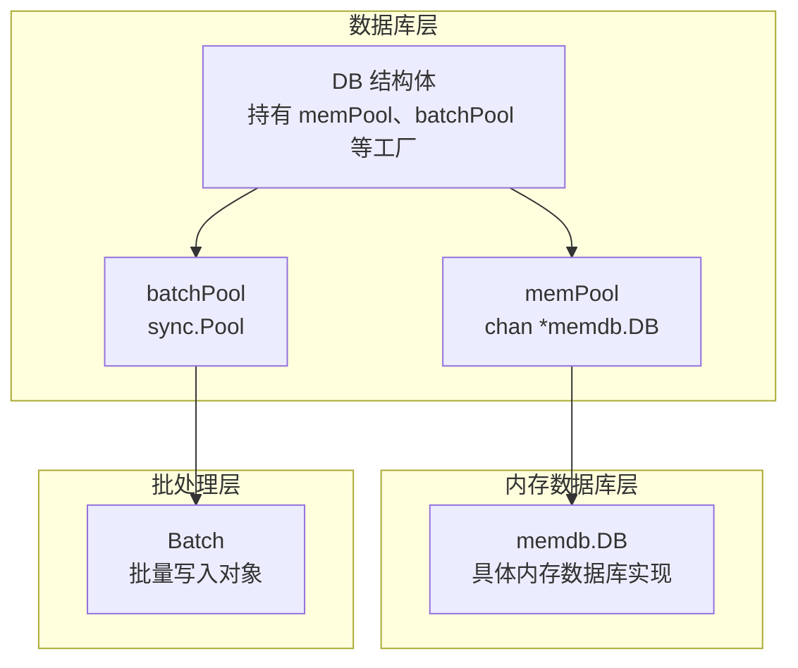
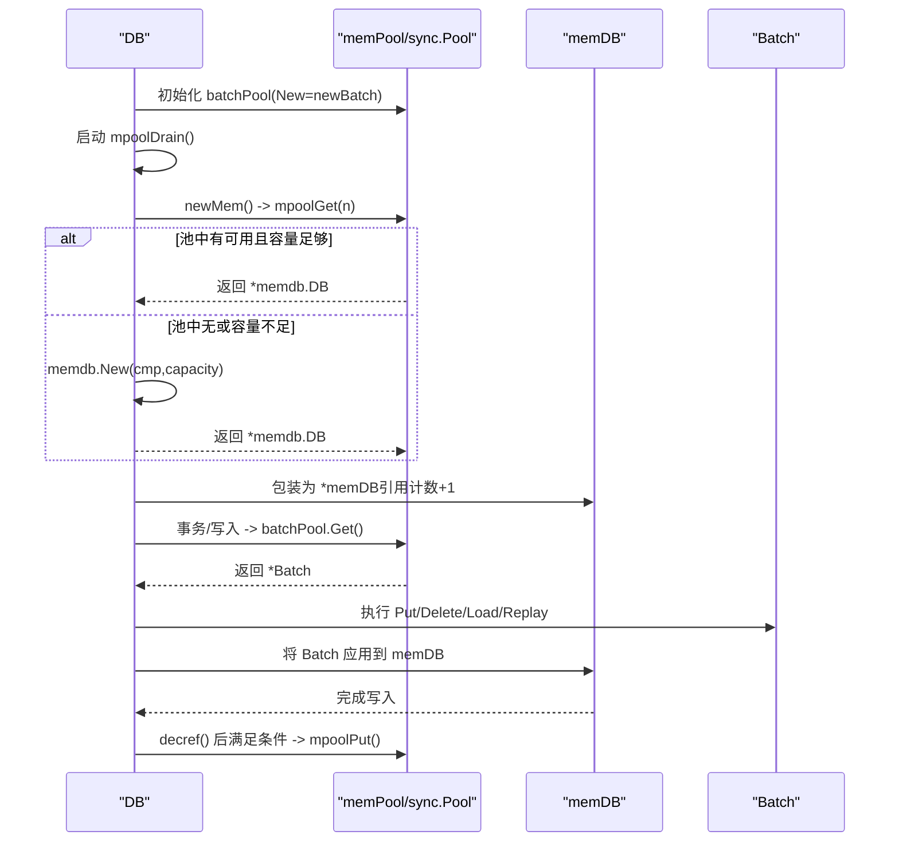
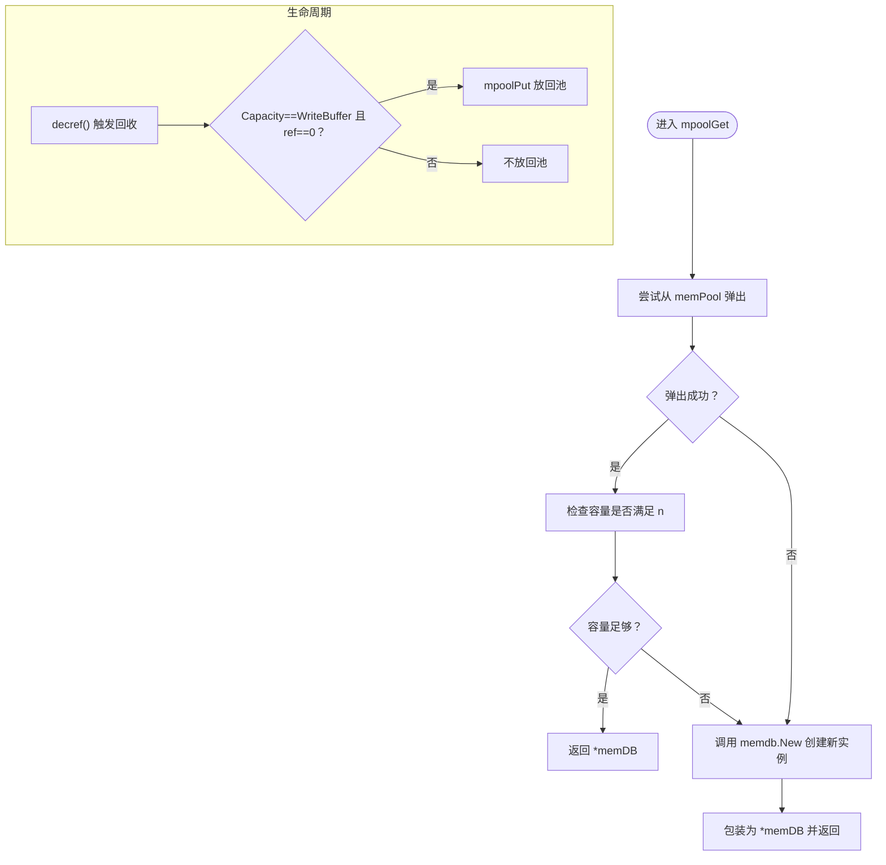
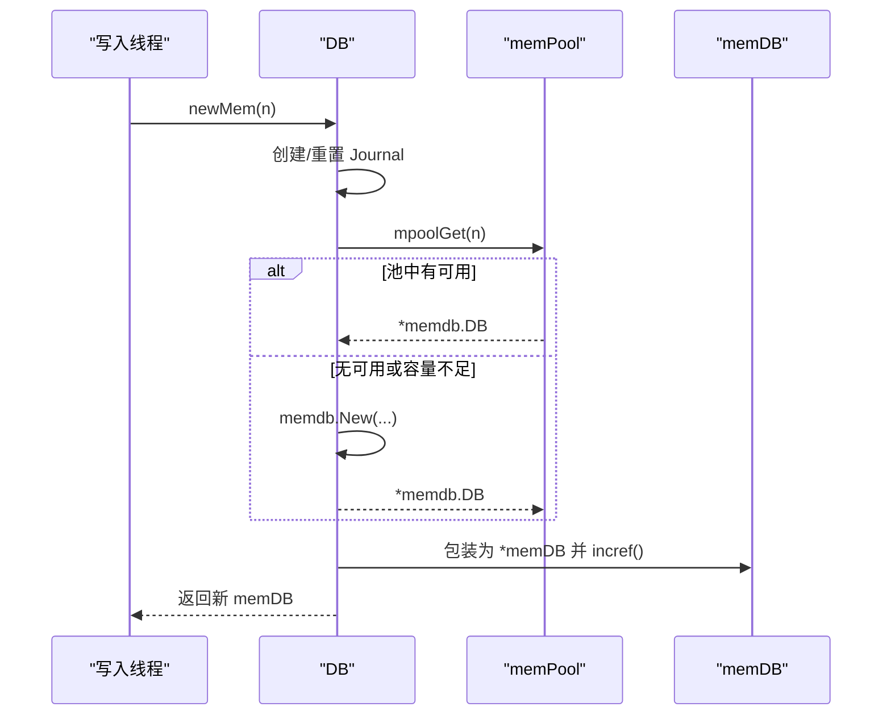
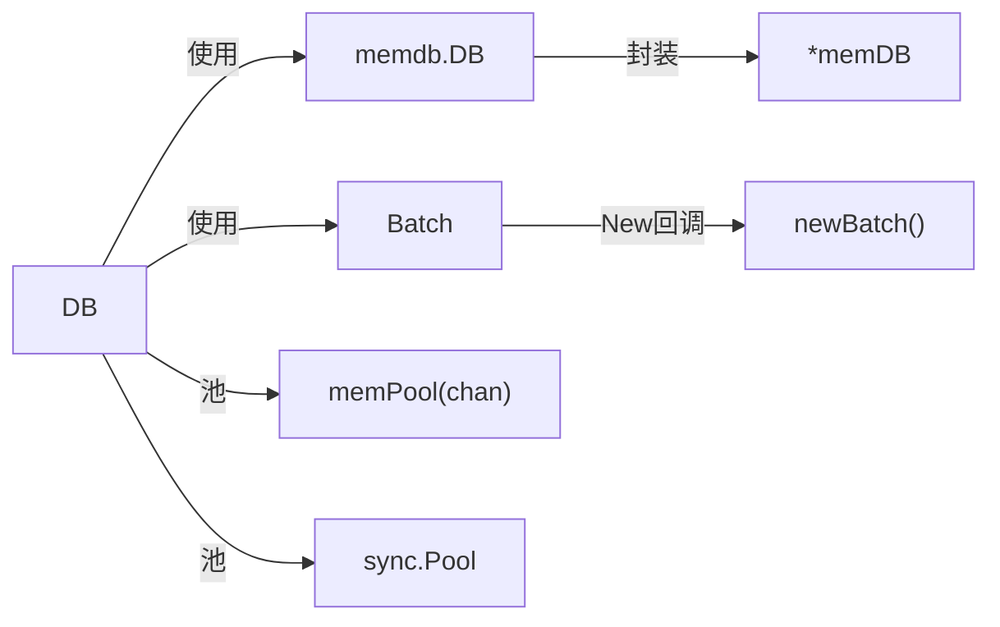

# 工厂模式

<cite>
**本文引用的文件**
- [leveldb/db.go](file://leveldb/db.go)
- [leveldb/db_state.go](file://leveldb/db_state.go)
- [leveldb/db_transaction.go](file://leveldb/db_transaction.go)
- [leveldb/batch.go](file://leveldb/batch.go)
- [leveldb/memdb/memdb.go](file://leveldb/memdb/memdb.go)
- [leveldb/util/buffer_pool.go](file://leveldb/util/buffer_pool.go)
</cite>

## 目录
1. [简介](#简介)
2. [项目结构](#项目结构)
3. [核心组件](#核心组件)
4. [架构总览](#架构总览)
5. [详细组件分析](#详细组件分析)
6. [依赖关系分析](#依赖关系分析)
7. [性能考量](#性能考量)
8. [故障排查指南](#故障排查指南)
9. [结论](#结论)

## 简介
本文件围绕 avccDB 中的“工厂模式”进行系统性技术文档整理，重点阐述以下内容：
- 内存池工厂：由 mpoolGet 与 mpoolDrain 构成，用于高效创建与回收 memDB 实例；
- 批处理对象工厂：由 sync.Pool 的 batchPool 提供，降低批量写入时的内存分配开销；
- newMem 方法：依据配置创建新的内存数据库实例；
- 对象复用与生命周期管理：通过引用计数、容量判断与定时清理，提升整体性能并避免资源泄漏。

## 项目结构
从工厂模式视角看，核心工厂位于数据库层（leveldb），面向两类对象：
- 内存数据库实例 memDB（封装 memdb.DB 并带引用计数）；
- 批处理对象 Batch（通过 sync.Pool 复用）。



图表来源
- [leveldb/db.go](file://leveldb/db.go#L33-L98)
- [leveldb/db_state.go](file://leveldb/db_state.go#L23-L118)
- [leveldb/batch.go](file://leveldb/batch.go#L259-L261)

章节来源
- [leveldb/db.go](file://leveldb/db.go#L33-L98)
- [leveldb/db_state.go](file://leveldb/db_state.go#L23-L118)
- [leveldb/batch.go](file://leveldb/batch.go#L259-L261)

## 核心组件
- 内存池工厂（memPool）
  - mpoolGet：从池中取出可用 memDB，若无或容量不足则新建；
  - mpoolPut：将可复用的 memDB 放回池中；
  - mpoolDrain：周期性清理池中多余对象，关闭时确保池清空。
- 批处理工厂（batchPool）
  - 使用 sync.Pool 复用 Batch 对象，New 回调返回新 Batch；
  - 通过 Reset 或 Reset 后的复用，减少频繁分配。
- 新建内存数据库（newMem）
  - 在写入切换时创建新的 memDB，并冻结旧的 memDB；
  - 利用 mpoolGet 获取合适的 memDB 实例。

章节来源
- [leveldb/db_state.go](file://leveldb/db_state.go#L74-L118)
- [leveldb/db.go](file://leveldb/db.go#L67-L76)
- [leveldb/db_state.go](file://leveldb/db_state.go#L120-L159)
- [leveldb/batch.go](file://leveldb/batch.go#L259-L261)

## 架构总览
下图展示工厂模式在写入路径中的交互：DB 初始化时注册 batchPool；写入切换时通过 newMem 调用 mpoolGet 获取 memDB；事务或写入流程中使用 batchPool 获取 Batch，再将 Batch 应用到 memDB。



图表来源
- [leveldb/db.go](file://leveldb/db.go#L100-L116)
- [leveldb/db_state.go](file://leveldb/db_state.go#L74-L118)
- [leveldb/db_state.go](file://leveldb/db_state.go#L120-L159)
- [leveldb/batch.go](file://leveldb/batch.go#L259-L261)

## 详细组件分析

### 内存池工厂：mpoolGet 与 mpoolDrain
- mpoolGet
  - 优先从 memPool 取出可用的 memdb.DB；
  - 若池为空或容量小于需求，则以写缓冲大小与请求容量的最大值为基准创建新实例；
  - 返回包装后的 *memDB，包含引用计数字段。
- mpoolPut
  - 将可复用的 memDB 放回池中；
  - 仅当容量等于标准写缓冲大小时才放回，避免池中混入非标准尺寸。
- mpoolDrain
  - 周期性从池中取出并丢弃多余对象，防止池无限增长；
  - 关闭时阻塞等待池清空并安全关闭通道。



图表来源
- [leveldb/db_state.go](file://leveldb/db_state.go#L74-L118)
- [leveldb/memdb/memdb.go](file://leveldb/memdb/memdb.go#L461-L479)

章节来源
- [leveldb/db_state.go](file://leveldb/db_state.go#L74-L118)
- [leveldb/memdb/memdb.go](file://leveldb/memdb/memdb.go#L461-L479)

### 批处理对象工厂：batchPool
- 初始化
  - DB 在构造函数中将 batchPool 初始化为 sync.Pool，New 回调为 newBatch；
  - newBatch 返回一个新的 Batch 实例。
- 使用
  - 读取路径中通过 batchPool.Get 获取 Batch；
  - 写入完成后通过 Reset 清理状态，以便下次复用；
  - 该模式显著减少频繁分配与 GC 压力。

```mermaid
classDiagram
class DB {
+batchPool : sync.Pool
+Open(...)
}
class Batch {
+Put(key,value)
+Delete(key)
+Reset()
+Len() int
}
class Factory_newBatch {
+newBatch() interface{}
}
DB --> Factory_newBatch : "New 回调"
DB --> Batch : "Get()/Put()/Reset()"
```

图表来源
- [leveldb/db.go](file://leveldb/db.go#L100-L116)
- [leveldb/batch.go](file://leveldb/batch.go#L259-L261)

章节来源
- [leveldb/db.go](file://leveldb/db.go#L100-L116)
- [leveldb/batch.go](file://leveldb/batch.go#L259-L261)

### newMem：按配置创建新的内存数据库实例
- 功能
  - 在写入切换时冻结当前 memDB，创建新的 Journal 文件；
  - 通过 mpoolGet 获取合适的 memDB 实例，并增加引用计数；
  - 记录冻结序列号，保证后续一致性。
- 关键点
  - 写入线程持有互斥锁，确保切换过程的原子性；
  - 若已有冻结的 memDB 未释放，会直接返回错误。



图表来源
- [leveldb/db_state.go](file://leveldb/db_state.go#L120-L159)

章节来源
- [leveldb/db_state.go](file://leveldb/db_state.go#L120-L159)

### 对象复用与生命周期管理
- 引用计数
  - memDB 结构体包含 ref 字段，通过 incref/decref 管理生命周期；
  - decref 为 0 时，若容量达标则 Reset 并放回池中。
- 容量策略
  - 仅将容量等于标准写缓冲大小的 memDB 放回池中，避免池中碎片化；
  - mpoolDrain 周期性清理池中多余对象，降低内存占用。
- 关闭流程
  - mpoolDrain 在关闭信号到来时停止并清空池；
  - DB.Close() 会清理冻结 memDB 指针，避免悬挂引用。

章节来源
- [leveldb/db_state.go](file://leveldb/db_state.go#L23-L49)
- [leveldb/db_state.go](file://leveldb/db_state.go#L98-L118)
- [leveldb/db_state.go](file://leveldb/db_state.go#L212-L218)

## 依赖关系分析
- 组件耦合
  - DB 直接依赖 memdb.DB 与 Batch；
  - memDB 作为 DB 的内部包装，提供引用计数与容量判定；
  - batchPool 与 DB 生命周期绑定，随 DB 初始化与关闭。
- 外部依赖
  - sync.Pool 提供轻量级对象池；
  - memdb.New 提供内存数据库实例构造；
  - journal.Writer 与 storage 接口负责持久化。



图表来源
- [leveldb/db.go](file://leveldb/db.go#L33-L98)
- [leveldb/db_state.go](file://leveldb/db_state.go#L23-L49)
- [leveldb/batch.go](file://leveldb/batch.go#L259-L261)

章节来源
- [leveldb/db.go](file://leveldb/db.go#L33-L98)
- [leveldb/db_state.go](file://leveldb/db_state.go#L23-L49)
- [leveldb/batch.go](file://leveldb/batch.go#L259-L261)

## 性能考量
- 减少分配
  - memPool 与 batchPool 通过对象复用显著降低频繁分配与 GC 压力；
  - mpoolDrain 定期清理池中多余对象，避免池无限增长导致内存浪费。
- 缓冲区容量
  - mpoolGet 以写缓冲大小与请求容量的最大值为基准创建实例，兼顾吞吐与内存占用；
  - Batch 的 grow 策略在条目数量超过阈值后降低增长幅度，平滑内存增长曲线。
- 并发安全
  - DB 内部使用互斥锁保护 memDB 切换与池操作；
  - 引用计数采用原子操作，避免竞态。

章节来源
- [leveldb/db_state.go](file://leveldb/db_state.go#L74-L118)
- [leveldb/batch.go](file://leveldb/batch.go#L77-L92)

## 故障排查指南
- 冻结 memDB 未释放
  - 症状：newMem 返回“存在冻结 mem”的错误；
  - 排查：确认上一次切换是否正确完成，或等待 mpoolDrain 清理。
- 池溢出或内存增长异常
  - 症状：池中对象过多或内存持续增长；
  - 排查：检查 mpoolDrain 是否正常运行，确认关闭流程是否触发。
- Batch 分配抖动
  - 症状：写入过程中出现频繁分配；
  - 排查：使用 batchPool.Get/Reset，避免重复创建；必要时调整 BatchConfig 的初始容量与 GrowLimit。
- 引用计数异常
  - 症状：decref 后仍访问 memDB 导致崩溃；
  - 排查：确保每次使用后正确释放引用，遵循“谁 incref 谁 decref”的原则。

章节来源
- [leveldb/db_state.go](file://leveldb/db_state.go#L120-L159)
- [leveldb/db_state.go](file://leveldb/db_state.go#L23-L49)
- [leveldb/batch.go](file://leveldb/batch.go#L259-L261)

## 结论
avccDB 的工厂模式通过以下方式实现高性能与稳定的组件生命周期管理：
- 内存池工厂（mpoolGet/mpoolDrain）：按需创建与回收 memDB，结合容量与引用计数策略，避免碎片化与泄漏；
- 批处理工厂（batchPool）：基于 sync.Pool 的对象复用，显著降低分配开销；
- newMem：在写入切换时创建符合配置的新实例，保障一致性与性能；
- 生命周期管理：通过引用计数与定期清理，确保资源及时回收，避免内存膨胀。