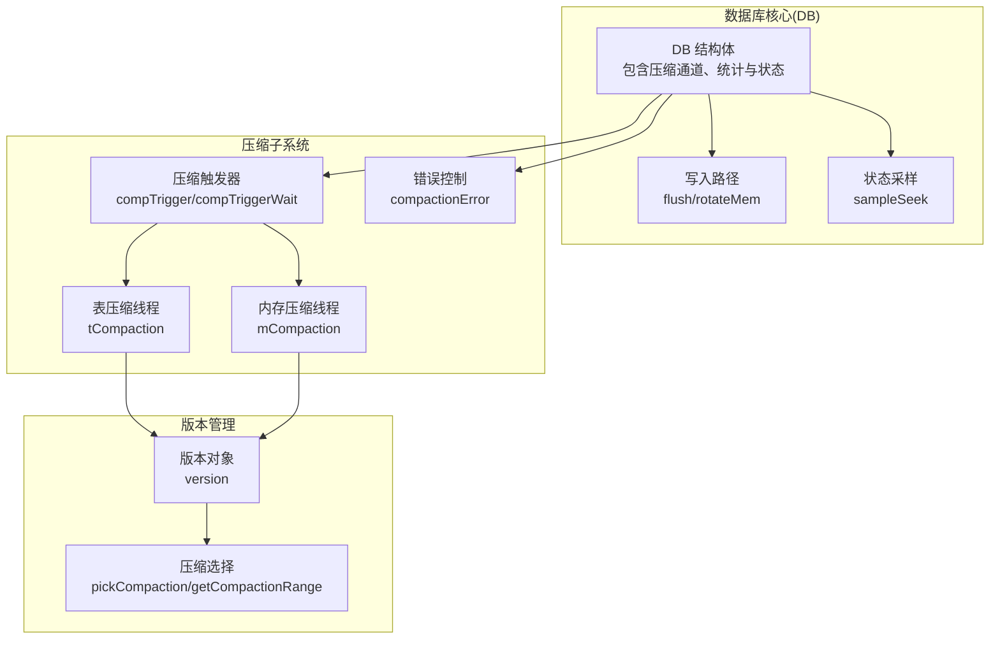
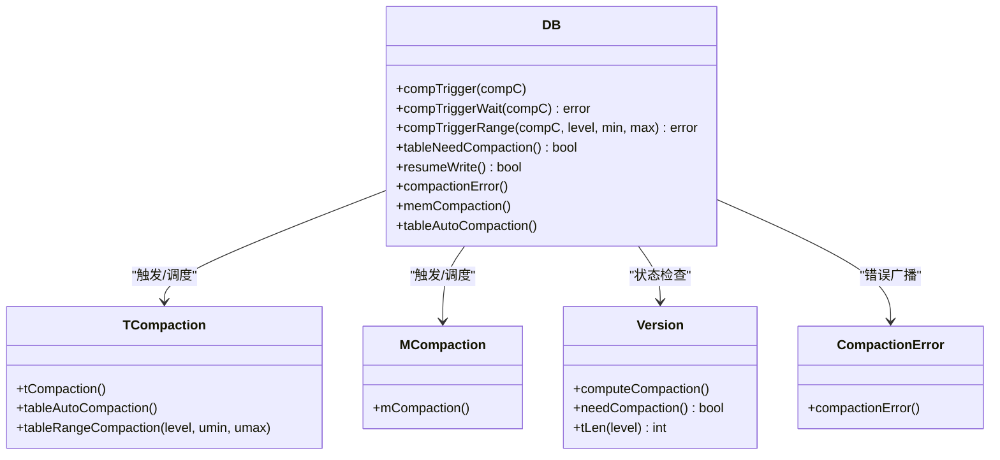
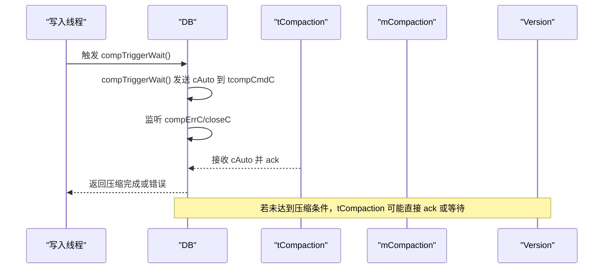
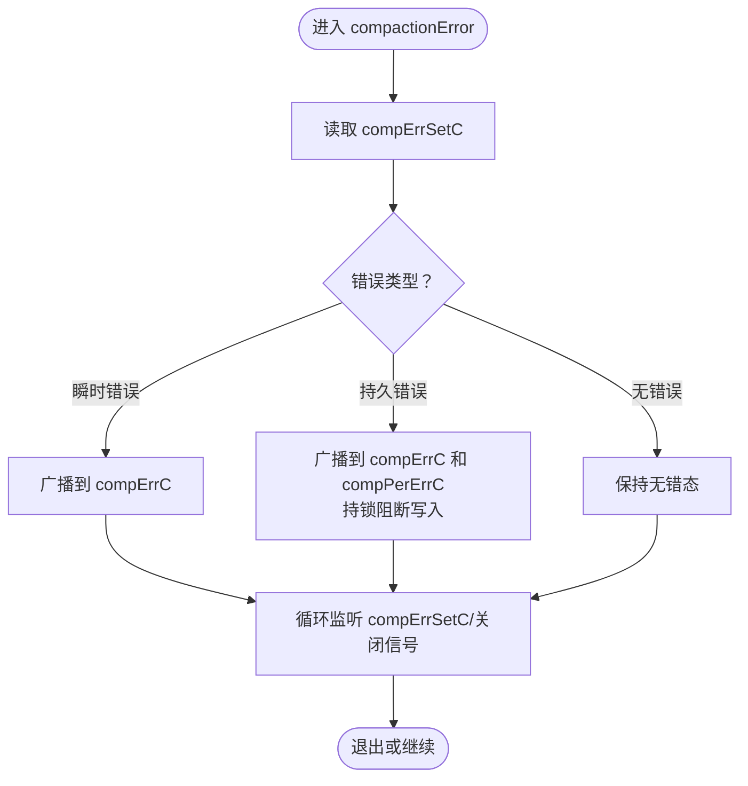
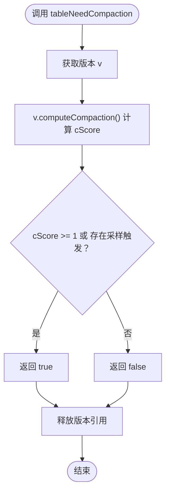
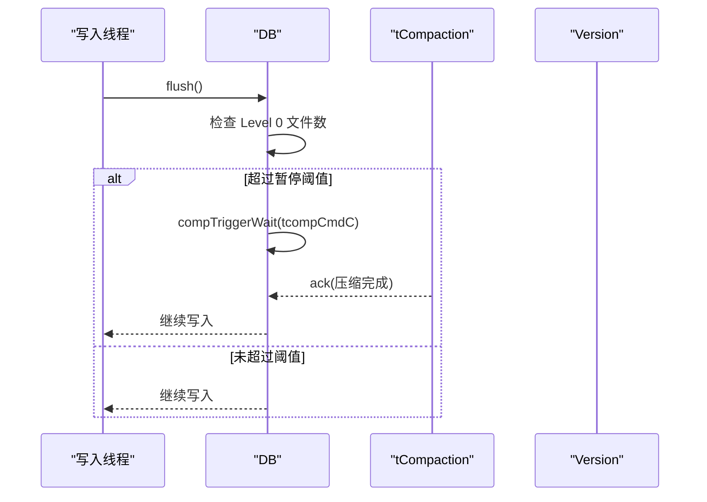
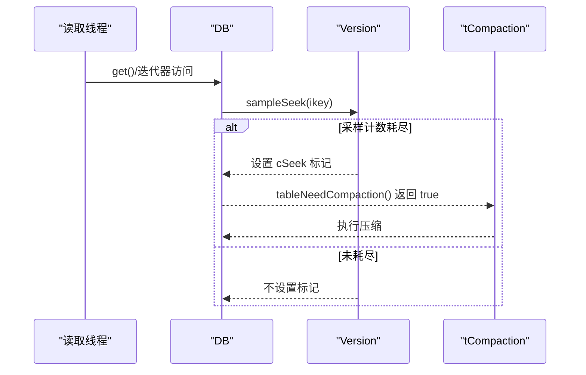
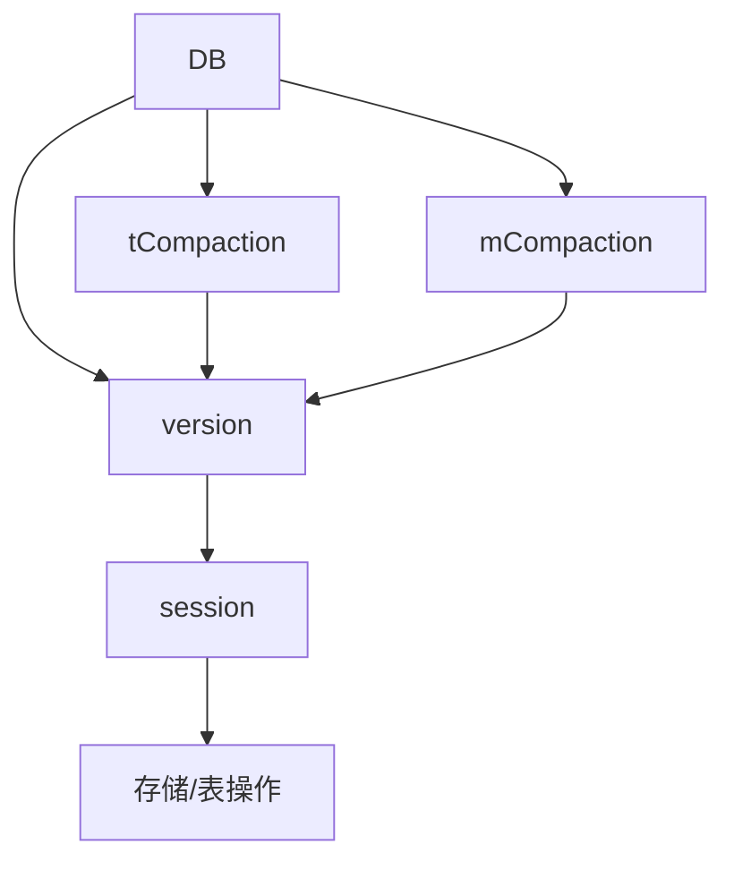

# 观察者模式

<cite>
**本文引用的文件**
- [leveldb/db.go](file://leveldb/db.go)
- [leveldb/db_compaction.go](file://leveldb/db_compaction.go)
- [leveldb/db_state.go](file://leveldb/db_state.go)
- [leveldb/version.go](file://leveldb/version.go)
- [leveldb/session.go](file://leveldb/session.go)
- [leveldb/db_write.go](file://leveldb/db_write.go)
</cite>

## 目录
1. [引言](#引言)
2. [项目结构](#项目结构)
3. [核心组件](#核心组件)
4. [架构总览](#架构总览)
5. [详细组件分析](#详细组件分析)
6. [依赖关系分析](#依赖关系分析)
7. [性能考量](#性能考量)
8. [故障排查指南](#故障排查指南)
9. [结论](#结论)

## 引言
本档聚焦于 avccDB 中“观察者模式”的实现与应用，围绕数据库状态监控与压缩操作触发展开，重点阐释以下要点：
- compTrigger 方法如何作为通知机制，在 Level 0 文件数量达到阈值时触发压缩。
- compErrC、compPerErrC 等通道如何实现错误状态的广播与持久化错误阻断。
- tableNeedCompaction 如何作为状态检查点，驱动压缩调度。
- 通过 UML 序列图展示状态变化检测、通知发送与压缩处理的完整流程。
- 解释该模式如何解耦数据库核心与压缩子系统，提升系统的可维护性与响应性。

## 项目结构
avccDB 的压缩与状态监控主要分布在以下模块：
- 数据库核心：DB 结构体及其实例方法（打开、写入、压缩触发、错误广播等）
- 压缩子系统：内存表刷写、表压缩、自动/范围压缩、压缩事务与提交
- 版本管理：版本快照、压缩评分与是否需要压缩的判定
- 会话层：存储、清单与表操作的协调

图表来源
- [leveldb/db.go](file://leveldb/db.go#L33-L125)
- [leveldb/db_compaction.go](file://leveldb/db_compaction.go#L730-L779)
- [leveldb/db_compaction.go](file://leveldb/db_compaction.go#L813-L889)
- [leveldb/version.go](file://leveldb/version.go#L646-L695)
- [leveldb/session.go](file://leveldb/session.go#L36-L68)

章节来源
- [leveldb/db.go](file://leveldb/db.go#L33-L125)
- [leveldb/db_compaction.go](file://leveldb/db_compaction.go#L730-L779)
- [leveldb/version.go](file://leveldb/version.go#L646-L695)

## 核心组件
- DB 结构体：持有压缩命令通道、错误广播通道、写入暂停标志、压缩统计等；负责启动压缩线程、触发压缩、错误广播与主根更新。
- 压缩线程：
  - mCompaction：处理内存表刷写与触发后续表压缩。
  - tCompaction：根据版本状态与等待队列执行表压缩或范围压缩。
- 错误广播：compactionError 将瞬时错误与持久错误分别广播到不同通道，并在持久错误时持锁阻断写入。
- 状态检查：tableNeedCompaction 通过版本计算压缩评分与“需压缩”标记，作为调度依据。
- 写入路径：flush 在 Level 0 超过暂停阈值时调用 compTriggerWait 阻塞等待压缩完成，从而实现写入与压缩的解耦。

章节来源
- [leveldb/db.go](file://leveldb/db.go#L33-L125)
- [leveldb/db_compaction.go](file://leveldb/db_compaction.go#L813-L889)
- [leveldb/db_compaction.go](file://leveldb/db_compaction.go#L87-L139)
- [leveldb/db_compaction.go](file://leveldb/db_compaction.go#L675-L686)
- [leveldb/db_write.go](file://leveldb/db_write.go#L66-L131)

## 架构总览
下图展示了“观察者模式”在 avccDB 中的体现：DB 作为主题（Subject），压缩线程与错误广播作为观察者（Observer）。DB 通过状态检查与触发器向观察者发出通知，观察者据此执行压缩或错误处理逻辑。

图表来源
- [leveldb/db.go](file://leveldb/db.go#L33-L125)
- [leveldb/db_compaction.go](file://leveldb/db_compaction.go#L675-L686)
- [leveldb/db_compaction.go](file://leveldb/db_compaction.go#L813-L889)
- [leveldb/version.go](file://leveldb/version.go#L646-L695)
- [leveldb/db_compaction.go](file://leveldb/db_compaction.go#L87-L139)

## 详细组件分析

### 组件A：压缩触发器与通知机制（compTrigger）
- 功能定位：作为通知机制，向压缩线程发送“自动压缩”命令；支持等待压缩完成的阻塞式触发。
- 关键行为：
  - compTrigger：非阻塞地将 cAuto 命令放入 tcompCmdC 或 mcompCmdC。
  - compTriggerWait：阻塞等待压缩完成，同时监听错误通道与关闭信号。
- 与观察者的关系：DB 作为主题，tCompaction/mCompaction 作为观察者，接收来自 compTrigger 的命令并执行相应动作。

图表来源
- [leveldb/db_compaction.go](file://leveldb/db_compaction.go#L730-L779)
- [leveldb/db_compaction.go](file://leveldb/db_compaction.go#L813-L889)

章节来源
- [leveldb/db_compaction.go](file://leveldb/db_compaction.go#L730-L779)
- [leveldb/db_compaction.go](file://leveldb/db_compaction.go#L813-L889)

### 组件B：错误状态广播与持久化阻断（compErrC、compPerErrC）
- 功能定位：统一管理压缩过程中的错误状态，区分瞬时错误与持久错误，并进行广播。
- 关键行为：
  - compactionError：从 compErrSetC 接收错误，按类型分发到 compErrC 或 compPerErrC；在持久错误时持锁阻断写入。
  - compTriggerWait/compTriggerRange：在等待压缩完成时，同时监听 compErrC，以便及时感知错误。
- 与观察者的关系：DB 作为主题，写入线程与压缩线程作为观察者，接收错误广播以调整自身行为。

图表来源
- [leveldb/db_compaction.go](file://leveldb/db_compaction.go#L87-L139)

章节来源
- [leveldb/db_compaction.go](file://leveldb/db_compaction.go#L87-L139)

### 组件C：状态检查点（tableNeedCompaction）
- 功能定位：基于版本对象计算压缩评分与“需压缩”标记，作为压缩调度的判断依据。
- 关键行为：
  - tableNeedCompaction：调用版本 needCompaction，返回是否需要压缩。
  - 版本 needCompaction：当 cScore ≥ 1 或存在“采样查找触发压缩”标记时返回真。
  - 版本 computeCompaction：对各层级计算压缩评分，Level 0 使用文件数与 L0 触发阈值比值，其他层级使用总大小与阈值比值。
- 与观察者的关系：DB 作为主题，tCompaction/mCompaction 作为观察者，依据 tableNeedCompaction 的结果决定是否执行压缩。

图表来源
- [leveldb/db_compaction.go](file://leveldb/db_compaction.go#L675-L686)
- [leveldb/version.go](file://leveldb/version.go#L646-L695)

章节来源
- [leveldb/db_compaction.go](file://leveldb/db_compaction.go#L675-L686)
- [leveldb/version.go](file://leveldb/version.go#L646-L695)

### 组件D：写入路径与压缩触发（flush）
- 功能定位：在写入过程中，当 Level 0 文件数超过暂停阈值时，阻塞等待压缩完成，避免无限堆积。
- 关键行为：
  - flush：在达到暂停阈值时调用 compTriggerWait，阻塞等待压缩完成；完成后重置写入暂停标志。
  - 与压缩线程交互：tCompaction 在收到 cAuto 后执行表自动压缩，完成后 ack。
- 与观察者的关系：DB 作为主题，写入线程作为观察者，接收压缩完成信号后继续写入。

图表来源
- [leveldb/db_write.go](file://leveldb/db_write.go#L66-L131)
- [leveldb/db_compaction.go](file://leveldb/db_compaction.go#L730-L779)
- [leveldb/db_compaction.go](file://leveldb/db_compaction.go#L813-L889)

章节来源
- [leveldb/db_write.go](file://leveldb/db_write.go#L66-L131)
- [leveldb/db_compaction.go](file://leveldb/db_compaction.go#L730-L779)
- [leveldb/db_compaction.go](file://leveldb/db_compaction.go#L813-L889)

### 组件E：状态采样与触发（sampleSeek）
- 功能定位：读取路径中对“采样查找”计数，当计数耗尽时设置“需压缩”标记，间接触发压缩。
- 关键行为：
  - sampleSeek：在读取路径中调用，若满足采样条件则设置 cSeek 标记。
  - tableNeedCompaction：将“cSeek 是否为空”纳入“需压缩”判断。
- 与观察者的关系：DB 作为主题，tCompaction 作为观察者，依据 cSeek 标记参与调度。

图表来源
- [leveldb/db_state.go](file://leveldb/db_state.go#L61-L72)
- [leveldb/version.go](file://leveldb/version.go#L534-L549)
- [leveldb/db_compaction.go](file://leveldb/db_compaction.go#L813-L889)

章节来源
- [leveldb/db_state.go](file://leveldb/db_state.go#L61-L72)
- [leveldb/version.go](file://leveldb/version.go#L534-L549)
- [leveldb/db_compaction.go](file://leveldb/db_compaction.go#L813-L889)

## 依赖关系分析
- DB 对压缩线程的依赖：通过通道发送命令，依赖版本对象的状态计算，依赖错误广播通道进行错误传播。
- 压缩线程对版本管理的依赖：通过 pickCompaction/getCompactionRange 获取压缩任务，依赖版本的文件集合与元数据。
- 会话层对存储与表操作的依赖：负责清单记录、版本提交与表读写操作。

图表来源
- [leveldb/db.go](file://leveldb/db.go#L33-L125)
- [leveldb/db_compaction.go](file://leveldb/db_compaction.go#L813-L889)
- [leveldb/version.go](file://leveldb/version.go#L646-L695)
- [leveldb/session.go](file://leveldb/session.go#L36-L68)

章节来源
- [leveldb/db.go](file://leveldb/db.go#L33-L125)
- [leveldb/db_compaction.go](file://leveldb/db_compaction.go#L813-L889)
- [leveldb/version.go](file://leveldb/version.go#L646-L695)
- [leveldb/session.go](file://leveldb/session.go#L36-L68)

## 性能考量
- 触发策略：compTrigger 采用非阻塞发送，避免阻塞写入线程；compTriggerWait 仅在必要时阻塞等待，减少写入延迟。
- 错误回退：compactionError 支持瞬时错误快速恢复，持久错误时持锁阻断写入，防止进一步恶化。
- 状态检查：tableNeedCompaction 基于版本评分与采样触发，避免频繁无效压缩，平衡吞吐与空间占用。
- 写入暂停：flush 在达到暂停阈值时阻塞等待压缩完成，有效控制 Level 0 文件数量增长速度。

## 故障排查指南
- 压缩线程未响应：
  - 检查 compTrigger 是否成功发送命令至 tcompCmdC/mcompCmdC。
  - 确认 tCompaction/mCompaction 线程未处于暂停状态（tcompPauseC）。
- 错误无法传播：
  - 检查 compErrSetC 是否正确写入错误；确认 compactionError 已启动。
  - 区分瞬时错误与持久错误：瞬时错误应广播到 compErrC；持久错误应广播到 compPerErrC 并持锁阻断写入。
- 写入被长时间阻塞：
  - 检查 Level 0 文件数是否持续超过暂停阈值；确认压缩是否在执行且能完成。
  - 查看 resumeWrite 条件是否满足（tLen(0) < pause 触发阈值）。

章节来源
- [leveldb/db_compaction.go](file://leveldb/db_compaction.go#L87-L139)
- [leveldb/db_compaction.go](file://leveldb/db_compaction.go#L813-L889)
- [leveldb/db_write.go](file://leveldb/db_write.go#L66-L131)

## 结论
avccDB 通过“观察者模式”实现了数据库核心与压缩子系统的松耦合：
- DB 作为主题，通过状态检查（tableNeedCompaction）、采样触发（sampleSeek）与触发器（compTrigger/compTriggerWait）向观察者（压缩线程）发出通知。
- 错误广播（compErrC/compPerErrC）确保错误状态在系统内可见，瞬时错误快速恢复，持久错误阻断写入，保障一致性。
- 写入路径（flush）与压缩线程协作，基于阈值与评分动态调节，既保证响应性又维持良好的存储结构。