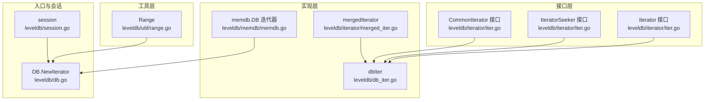
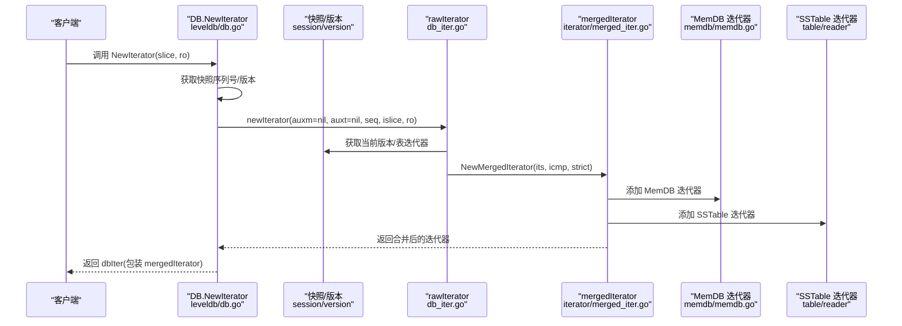
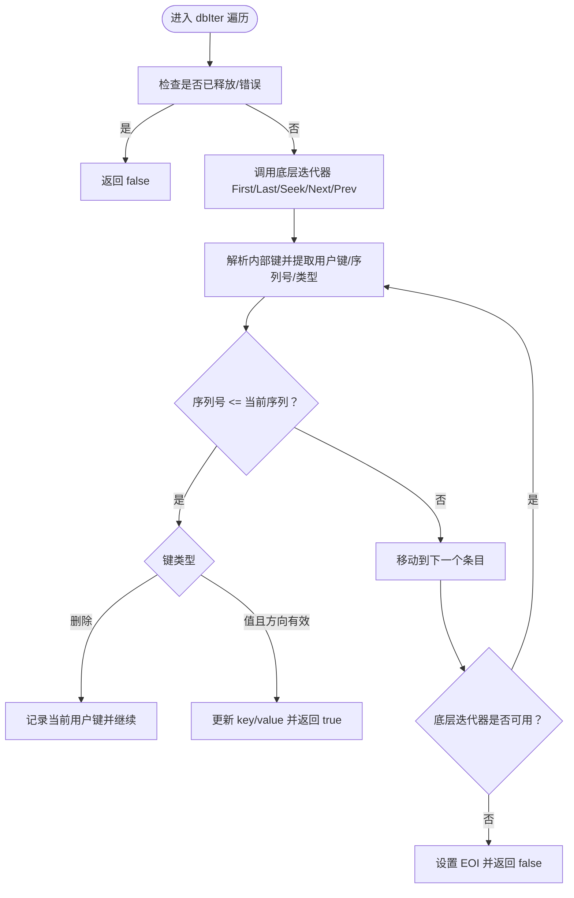
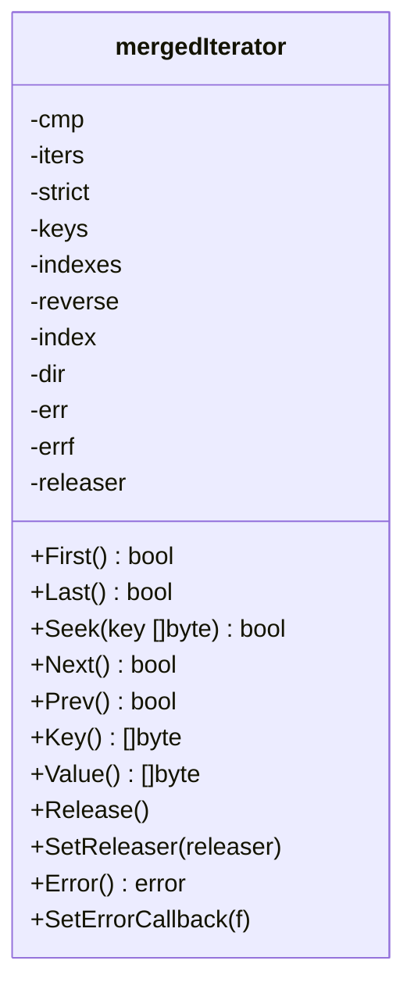
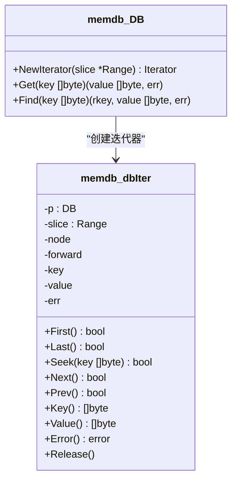
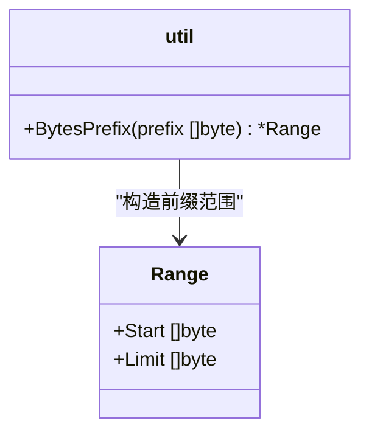
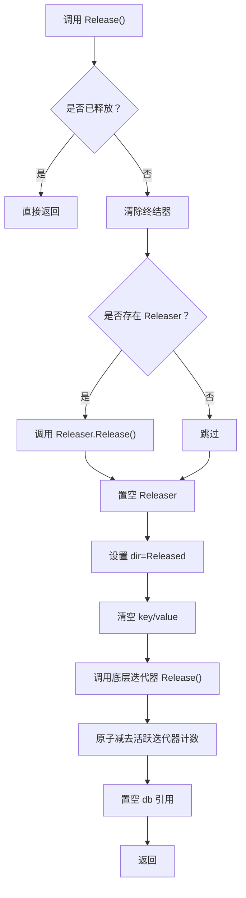
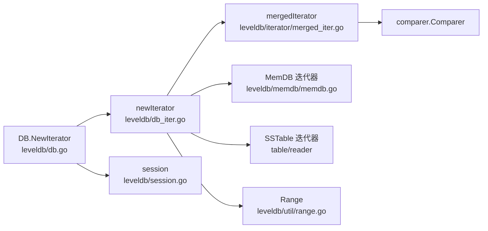

# 迭代器模式

<cite>
**本文引用的文件列表**
- [leveldb/db_iter.go](file://leveldb/db_iter.go)
- [leveldb/iterator/iter.go](file://leveldb/iterator/iter.go)
- [leveldb/util/range.go](file://leveldb/util/range.go)
- [leveldb/db.go](file://leveldb/db.go)
- [leveldb/session.go](file://leveldb/session.go)
- [leveldb/iterator/merged_iter.go](file://leveldb/iterator/merged_iter.go)
- [leveldb/memdb/memdb.go](file://leveldb/memdb/memdb.go)
</cite>

## 目录
1. [简介](#简介)
2. [项目结构](#项目结构)
3. [核心组件](#核心组件)
4. [架构总览](#架构总览)
5. [详细组件分析](#详细组件分析)
6. [依赖关系分析](#依赖关系分析)
7. [性能考量](#性能考量)
8. [故障排查指南](#故障排查指南)
9. [结论](#结论)

## 简介
本文件围绕 avccDB 中的迭代器模式展开，系统化阐述如何通过统一的迭代接口实现对内存数据库（MemDB）与 SSTable 文件的透明遍历，并支持范围查询。重点包括：
- NewIterator 如何创建统一遍历入口，屏蔽底层复杂性；
- dbIter 如何实现 Iterator 接口，提供 First、Last、Seek、Next、Prev 等标准遍历方法；
- util.Range 如何支持高效范围查询；
- Release 方法如何确保资源正确释放；
- UML 类图展示 Iterator 接口、dbIter 实现类与 DB、session 的协作关系。

## 项目结构
avccDB 将迭代器抽象置于独立包中，具体实现分布在 DB 层与各子模块：
- 接口与通用能力：leveldb/iterator 包定义 Iterator、CommonIterator、IteratorSeeker 等接口；
- 合并迭代器：leveldb/iterator/merged_iter.go 提供多源合并遍历；
- 内存数据库迭代器：leveldb/memdb/memdb.go 提供 MemDB 的迭代器实现；
- 数据库层迭代器：leveldb/db_iter.go 定义 dbIter 并封装版本、序列号、严格模式等；
- 范围工具：leveldb/util/range.go 提供 Range 结构与前缀范围构造；
- 入口与会话：leveldb/db.go 暴露 NewIterator；leveldb/session.go 管理版本与表操作。

图表来源
- [leveldb/db_iter.go](file://leveldb/db_iter.go#L63-L122)
- [leveldb/iterator/iter.go](file://leveldb/iterator/iter.go#L21-L95)
- [leveldb/iterator/merged_iter.go](file://leveldb/iterator/merged_iter.go#L27-L61)
- [leveldb/memdb/memdb.go](file://leveldb/memdb/memdb.go#L28-L171)
- [leveldb/util/range.go](file://leveldb/util/range.go#L10-L16)
- [leveldb/db.go](file://leveldb/db.go#L1200-L1230)
- [leveldb/session.go](file://leveldb/session.go#L36-L66)

章节来源
- [leveldb/db_iter.go](file://leveldb/db_iter.go#L63-L122)
- [leveldb/iterator/iter.go](file://leveldb/iterator/iter.go#L21-L95)
- [leveldb/util/range.go](file://leveldb/util/range.go#L10-L16)
- [leveldb/db.go](file://leveldb/db.go#L1200-L1230)
- [leveldb/session.go](file://leveldb/session.go#L36-L66)

## 核心组件
- Iterator 接口族：定义遍历所需的基本方法与错误处理契约，确保上层调用的一致性。
- mergedIterator：将多个底层迭代器合并为一个有序迭代器，负责堆式索引与方向控制。
- dbIter：数据库层迭代器，封装版本序列号、比较器、严格模式、采样策略与资源释放。
- memdb.DB 迭代器：MemDB 的内部迭代器，支持范围切片与顺序遍历。
- Range：键范围描述，支持前缀范围构造，用于限制遍历边界。

章节来源
- [leveldb/iterator/iter.go](file://leveldb/iterator/iter.go#L21-L95)
- [leveldb/iterator/merged_iter.go](file://leveldb/iterator/merged_iter.go#L27-L61)
- [leveldb/db_iter.go](file://leveldb/db_iter.go#L63-L122)
- [leveldb/memdb/memdb.go](file://leveldb/memdb/memdb.go#L28-L171)
- [leveldb/util/range.go](file://leveldb/util/range.go#L10-L16)

## 架构总览
下图展示了从 DB.NewIterator 到 dbIter 的完整流程，以及与合并迭代器、MemDB、SSTable 的协作关系。

图表来源
- [leveldb/db.go](file://leveldb/db.go#L1200-L1230)
- [leveldb/db_iter.go](file://leveldb/db_iter.go#L31-L61)
- [leveldb/iterator/merged_iter.go](file://leveldb/iterator/merged_iter.go#L299-L317)
- [leveldb/memdb/memdb.go](file://leveldb/memdb/memdb.go#L388-L394)
- [leveldb/session.go](file://leveldb/session.go#L36-L66)

## 详细组件分析

### DB.NewIterator 与统一遍历入口
- DB.NewIterator 负责获取最新快照，随后委托给 db_iter.go 中的 newIterator 创建 dbIter。
- newIterator 将用户传入的 util.Range 转换为内部键范围（含序列号与类型），并构建 rawIterator。
- rawIterator 会收集 MemDB、SSTable 与辅助迭代器，使用 NewMergedIterator 合并为单一有序迭代器。

关键点
- 快照保证一致性视图；
- 内部键转换确保按序列号过滤；
- 合并迭代器维持全局有序。

章节来源
- [leveldb/db.go](file://leveldb/db.go#L1200-L1230)
- [leveldb/db_iter.go](file://leveldb/db_iter.go#L31-L61)
- [leveldb/db_iter.go](file://leveldb/db_iter.go#L63-L91)

### dbIter：Iterator 接口实现与遍历逻辑
dbIter 是数据库层的迭代器实现，持有底层迭代器、比较器、序列号、严格模式与采样参数，并提供如下方法：
- Valid/Key/Value/Error：状态与结果访问；
- First/Last/Seek/Next/Prev：标准遍历方法；
- Release/SetReleaser：资源释放与回调设置；
- next/prev：内部状态推进与版本过滤。

遍历要点
- 首次移动后进入 dirSOI，后续移动根据 dirForward/dirBackward 控制；
- 对内部键进行解析，按序列号过滤，跳过删除键；
- 严格模式下遇到解析错误直接报错；
- 采样策略用于触发 seek 触发的 compaction。

图表来源
- [leveldb/db_iter.go](file://leveldb/db_iter.go#L149-L203)
- [leveldb/db_iter.go](file://leveldb/db_iter.go#L204-L244)
- [leveldb/db_iter.go](file://leveldb/db_iter.go#L246-L304)
- [leveldb/db_iter.go](file://leveldb/db_iter.go#L306-L344)

章节来源
- [leveldb/db_iter.go](file://leveldb/db_iter.go#L149-L203)
- [leveldb/db_iter.go](file://leveldb/db_iter.go#L204-L244)
- [leveldb/db_iter.go](file://leveldb/db_iter.go#L246-L304)
- [leveldb/db_iter.go](file://leveldb/db_iter.go#L306-L344)
- [leveldb/db_iter.go](file://leveldb/db_iter.go#L346-L392)

### mergedIterator：多源合并与有序输出
mergedIterator 将多个底层迭代器合并为一个有序迭代器，使用堆维护当前最小键位置，支持：
- First/Last/Seek/Next/Prev：统一方向推进；
- 错误传播与严格模式处理；
- 可设置错误回调与资源释放。

图表来源
- [leveldb/iterator/merged_iter.go](file://leveldb/iterator/merged_iter.go#L27-L61)
- [leveldb/iterator/merged_iter.go](file://leveldb/iterator/merged_iter.go#L145-L187)
- [leveldb/iterator/merged_iter.go](file://leveldb/iterator/merged_iter.go#L189-L245)
- [leveldb/iterator/merged_iter.go](file://leveldb/iterator/merged_iter.go#L261-L275)
- [leveldb/iterator/merged_iter.go](file://leveldb/iterator/merged_iter.go#L291-L317)

章节来源
- [leveldb/iterator/merged_iter.go](file://leveldb/iterator/merged_iter.go#L145-L187)
- [leveldb/iterator/merged_iter.go](file://leveldb/iterator/merged_iter.go#L189-L245)
- [leveldb/iterator/merged_iter.go](file://leveldb/iterator/merged_iter.go#L261-L275)
- [leveldb/iterator/merged_iter.go](file://leveldb/iterator/merged_iter.go#L291-L317)

### MemDB 迭代器：范围与顺序遍历
MemDB 的迭代器支持：
- 范围切片（Start/Limit）；
- Forward/Backward 方向遍历；
- 与比较器配合定位起止节点。

图表来源
- [leveldb/memdb/memdb.go](file://leveldb/memdb/memdb.go#L388-L394)
- [leveldb/memdb/memdb.go](file://leveldb/memdb/memdb.go#L28-L171)

章节来源
- [leveldb/memdb/memdb.go](file://leveldb/memdb/memdb.go#L28-L171)
- [leveldb/memdb/memdb.go](file://leveldb/memdb/memdb.go#L388-L394)

### Range：范围查询与前缀范围
- Range 描述键范围，包含 Start（包含）与 Limit（不包含）；
- BytesPrefix 提供基于字节比较器的前缀范围构造，便于高效范围扫描。

图表来源
- [leveldb/util/range.go](file://leveldb/util/range.go#L10-L16)
- [leveldb/util/range.go](file://leveldb/util/range.go#L18-L33)

章节来源
- [leveldb/util/range.go](file://leveldb/util/range.go#L10-L16)
- [leveldb/util/range.go](file://leveldb/util/range.go#L18-L33)

### Release 与资源管理
- dbIter 在创建时注册终结器，确保未显式释放时也能回收；
- Release 清理内部状态、调用底层迭代器 Release、减少活跃迭代器计数；
- SetReleaser 支持外部资源绑定，避免重复设置。

图表来源
- [leveldb/db_iter.go](file://leveldb/db_iter.go#L360-L392)
- [leveldb/iterator/iter.go](file://leveldb/iterator/iter.go#L51-L70)

章节来源
- [leveldb/db_iter.go](file://leveldb/db_iter.go#L360-L392)
- [leveldb/iterator/iter.go](file://leveldb/iterator/iter.go#L51-L70)

## 依赖关系分析
- DB.NewIterator 依赖 session 版本与表操作（tOps）以获取 SSTable 迭代器；
- dbIter 依赖 mergedIterator 与底层迭代器；
- mergedIterator 依赖 comparer.Comparer 与错误处理；
- MemDB 迭代器与 Range 协作实现范围切片；
- Release 机制贯穿 dbIter 与底层迭代器生命周期。

图表来源
- [leveldb/db.go](file://leveldb/db.go#L1200-L1230)
- [leveldb/db_iter.go](file://leveldb/db_iter.go#L31-L61)
- [leveldb/iterator/merged_iter.go](file://leveldb/iterator/merged_iter.go#L299-L317)
- [leveldb/memdb/memdb.go](file://leveldb/memdb/memdb.go#L388-L394)
- [leveldb/util/range.go](file://leveldb/util/range.go#L10-L16)
- [leveldb/session.go](file://leveldb/session.go#L36-L66)

章节来源
- [leveldb/db.go](file://leveldb/db.go#L1200-L1230)
- [leveldb/db_iter.go](file://leveldb/db_iter.go#L31-L61)
- [leveldb/iterator/merged_iter.go](file://leveldb/iterator/merged_iter.go#L299-L317)
- [leveldb/memdb/memdb.go](file://leveldb/memdb/memdb.go#L388-L394)
- [leveldb/util/range.go](file://leveldb/util/range.go#L10-L16)
- [leveldb/session.go](file://leveldb/session.go#L36-L66)

## 性能考量
- 合并迭代器使用堆维护最小键，Next/Prev 时间复杂度与输入迭代器数量有关；
- 严格模式下错误传播可能中断遍历，但保证数据一致性；
- 采样策略在遍历过程中触发 seek 触发的 compaction，平衡读写放大；
- Range 限制遍历范围可减少无效扫描，提升范围查询效率。

## 故障排查指南
- 迭代器已释放：调用已释放的迭代器会返回错误，需确保在使用期间保持引用；
- 解析错误：内部键解析失败在严格模式下会导致遍历终止，检查键编码与比较器配置；
- 资源泄漏：务必调用 Release 或等待终结器回收，避免活跃迭代器计数异常；
- 范围越界：Start/Limit 设置不当可能导致遍历不到预期数据，确认 Range 构造与比较器匹配。

章节来源
- [leveldb/iterator/iter.go](file://leveldb/iterator/iter.go#L17-L20)
- [leveldb/db_iter.go](file://leveldb/db_iter.go#L149-L203)
- [leveldb/db_iter.go](file://leveldb/db_iter.go#L360-L392)

## 结论
avccDB 的迭代器模式通过统一接口与分层实现，成功屏蔽了 MemDB 与 SSTable 的差异，提供了稳定、一致且高效的遍历体验。dbIter 在版本序列号过滤、严格模式与资源管理方面提供了完备保障；mergedIterator 则确保多源有序输出；Range 工具进一步提升了范围查询的灵活性与性能。整体设计体现了良好的解耦与扩展性，适合在复杂存储层次中进行大规模数据遍历与范围查询。