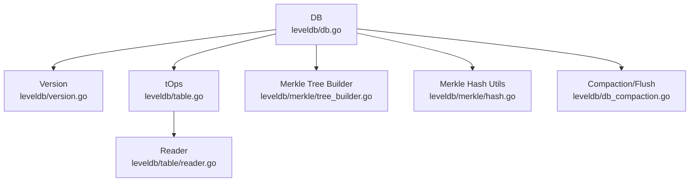
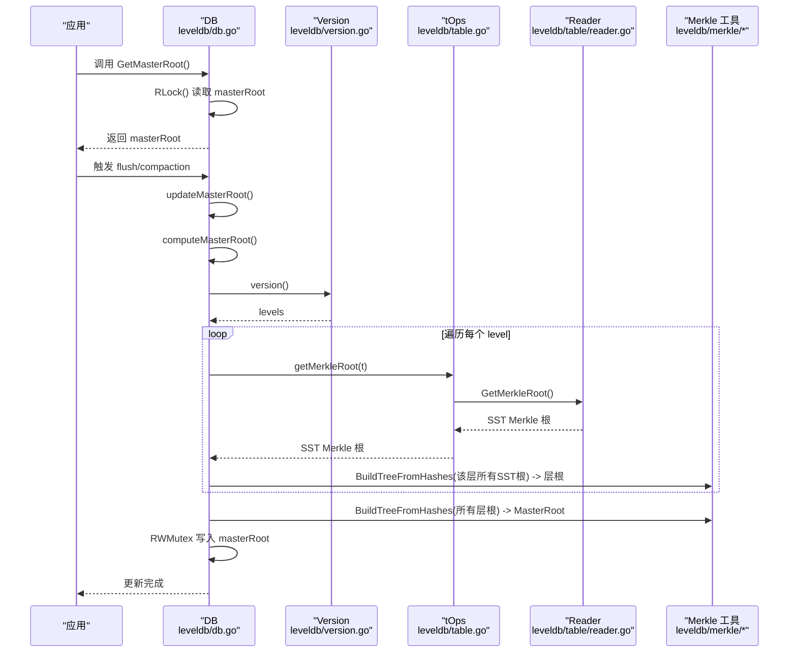
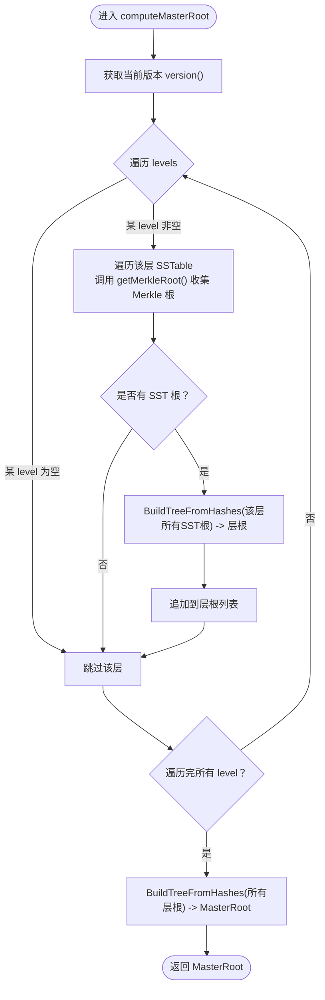
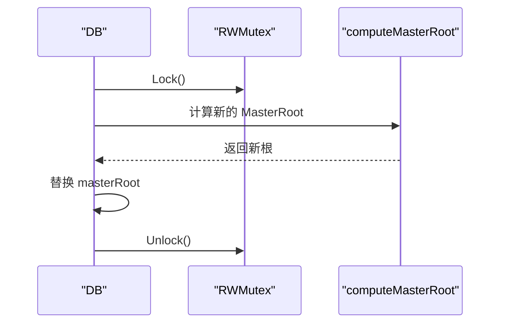
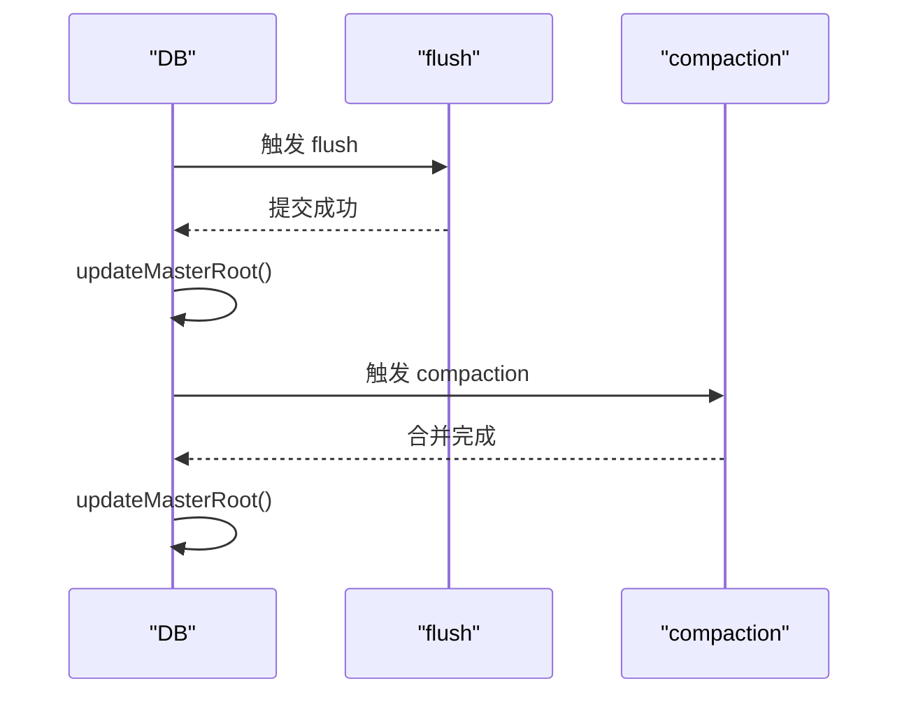
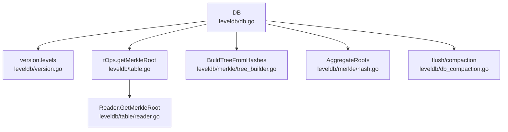

# MasterRoot管理

<cite>
**本文引用的文件**
- [leveldb/db.go](file://leveldb/db.go)
- [leveldb/db_compaction.go](file://leveldb/db_compaction.go)
- [leveldb/version.go](file://leveldb/version.go)
- [leveldb/table.go](file://leveldb/table.go)
- [leveldb/table/reader.go](file://leveldb/table/reader.go)
- [leveldb/merkle/tree_builder.go](file://leveldb/merkle/tree_builder.go)
- [leveldb/merkle/hash.go](file://leveldb/merkle/hash.go)
- [leveldb/mlsm_final_comprehensive_test.go](file://leveldb/mlsm_final_comprehensive_test.go)
</cite>

## 目录
1. [引言](#引言)
2. [项目结构](#项目结构)
3. [核心组件](#核心组件)
4. [架构总览](#架构总览)
5. [详细组件分析](#详细组件分析)
6. [依赖关系分析](#依赖关系分析)
7. [性能考量](#性能考量)
8. [故障排查指南](#故障排查指南)
9. [结论](#结论)
10. [附录](#附录)

## 引言
本文件围绕 avccDB 的 MasterRoot 机制展开，系统化阐述其作为全局数据完整性锚点的设计与实现。MasterRoot（位于 leveldb/db.go 中的 masterRoot 字段）通过逐层聚合各层级 SSTable 的 Merkle 根哈希，构建出一个稳定的全局根哈希，用于跨层级的数据一致性校验与完整性证明。本文将深入解析 computeMasterRoot 方法的实现细节、updateMasterRoot 的更新时机与一致性保障，以及 MasterRoot 在压缩完成后如何安全更新，最后给出 MasterRoot 计算过程的分步图解。

## 项目结构
与 MasterRoot 相关的关键模块与文件如下：
- 数据库核心：leveldb/db.go（DB 结构、MasterRoot 字段、computeMasterRoot、updateMasterRoot、GetMasterRoot）
- 压缩与刷新：leveldb/db_compaction.go（flush、compaction 后触发 updateMasterRoot）
- 版本与层级：leveldb/version.go（version 结构包含 levels，表示多层级 SSTable）
- 表操作与 Merkle 根：leveldb/table.go（tOps.getMerkleRoot）、leveldb/table/reader.go（Reader.GetMerkleRoot）
- Merkle 构建工具：leveldb/merkle/tree_builder.go（BuildTreeFromHashes）、leveldb/merkle/hash.go（AggregateRoots）

图表来源
- [leveldb/db.go](file://leveldb/db.go#L90-L1642)
- [leveldb/version.go](file://leveldb/version.go#L21-L120)
- [leveldb/table.go](file://leveldb/table.go#L347-L477)
- [leveldb/table/reader.go](file://leveldb/table/reader.go#L1106-L1125)
- [leveldb/merkle/tree_builder.go](file://leveldb/merkle/tree_builder.go#L153-L187)
- [leveldb/merkle/hash.go](file://leveldb/merkle/hash.go#L113-L152)
- [leveldb/db_compaction.go](file://leveldb/db_compaction.go#L327-L354)

章节来源
- [leveldb/db.go](file://leveldb/db.go#L90-L1642)
- [leveldb/version.go](file://leveldb/version.go#L21-L120)
- [leveldb/table.go](file://leveldb/table.go#L347-L477)
- [leveldb/table/reader.go](file://leveldb/table/reader.go#L1106-L1125)
- [leveldb/merkle/tree_builder.go](file://leveldb/merkle/tree_builder.go#L153-L187)
- [leveldb/merkle/hash.go](file://leveldb/merkle/hash.go#L113-L152)
- [leveldb/db_compaction.go](file://leveldb/db_compaction.go#L327-L354)

## 核心组件
- DB.masterRoot：全局唯一、只读的 MasterRoot，由所有层级的 SSTable Merkle 根聚合而成，用于跨层级完整性校验。
- computeMasterRoot：遍历 version.levels，对每个层级收集 SSTable 的 Merkle 根，先按层级构建“层根”，再将所有层根聚合为 MasterRoot。
- updateMasterRoot：在 flush 或 compaction 等数据库状态变更后，串行更新 masterRoot，确保并发安全。
- GetMasterRoot：提供线程安全的只读访问接口。
- tOps.getMerkleRoot：从表读取器获取单个 SSTable 的 Merkle 根；Reader.GetMerkleRoot 实际负责加载 Merkle 树并返回根哈希。
- BuildTreeFromHashes：对一组哈希值构建平衡二叉 Merkle 树，作为层根与 MasterRoot 的通用聚合工具。

章节来源
- [leveldb/db.go](file://leveldb/db.go#L90-L1642)
- [leveldb/table.go](file://leveldb/table.go#L469-L477)
- [leveldb/table/reader.go](file://leveldb/table/reader.go#L1106-L1125)
- [leveldb/merkle/tree_builder.go](file://leveldb/merkle/tree_builder.go#L153-L187)

## 架构总览
MasterRoot 的计算与更新贯穿数据库生命周期：
- 初始化：DB 打开后立即调用 updateMasterRoot，确保初始状态具备一致的全局根。
- 运行期：任何导致数据布局变化的操作（如 flush、compaction）都会触发 updateMasterRoot，使 MasterRoot 与当前版本保持同步。
- 查询期：外部可通过 GetMasterRoot 获取当前 MasterRoot，用于跨层级一致性校验或证明生成。

图表来源
- [leveldb/db.go](file://leveldb/db.go#L1479-L1571)
- [leveldb/version.go](file://leveldb/version.go#L21-L120)
- [leveldb/table.go](file://leveldb/table.go#L469-L477)
- [leveldb/table/reader.go](file://leveldb/table/reader.go#L1106-L1125)
- [leveldb/merkle/tree_builder.go](file://leveldb/merkle/tree_builder.go#L153-L187)

## 详细组件分析

### computeMasterRoot：逐层聚合的计算流程
computeMasterRoot 的职责是将数据库的“全局状态”映射为一个稳定的 Merkle 根：
- 从 version.levels 收集每个层级的 SSTable。
- 对每个层级，调用 tOps.getMerkleRoot 获取该 SSTable 的 Merkle 根；若不可用则跳过。
- 将同一层级的所有 SST 根通过 BuildTreeFromHashes 构建“层根”。
- 将所有层根再次通过 BuildTreeFromHashes 构建最终的 MasterRoot。
- 当前实现中，MemDB 的根暂不纳入（注释提示未来可集成）。

图表来源
- [leveldb/db.go](file://leveldb/db.go#L1491-L1560)
- [leveldb/merkle/tree_builder.go](file://leveldb/merkle/tree_builder.go#L153-L187)

章节来源
- [leveldb/db.go](file://leveldb/db.go#L1491-L1560)
- [leveldb/merkle/tree_builder.go](file://leveldb/merkle/tree_builder.go#L153-L187)

### updateMasterRoot：更新时机与一致性保障
- 更新时机：在 flush 与 compaction 等导致数据布局变化的关键路径上，调用 updateMasterRoot。
- 并发控制：使用 RWMutex 保护 masterRoot 的读写，读路径仅持读锁，写路径持写锁，避免读写竞争。
- 一致性：在写锁下重新计算并替换 masterRoot，确保外部读取到的是原子性的最新值。

图表来源
- [leveldb/db.go](file://leveldb/db.go#L1562-L1571)

章节来源
- [leveldb/db.go](file://leveldb/db.go#L1562-L1571)

### MasterRoot 的更新链路（flush/compaction）
- flush：在提交 memdb 刷新为 SSTable 后，调用 updateMasterRoot，确保新写入的数据被纳入 MasterRoot。
- compaction：在合并完成后，同样触发 updateMasterRoot，使压缩产生的新层级布局反映到 MasterRoot。

图表来源
- [leveldb/db_compaction.go](file://leveldb/db_compaction.go#L327-L354)

章节来源
- [leveldb/db_compaction.go](file://leveldb/db_compaction.go#L327-L354)

### MasterRoot 的跨层级验证角色
- 全局锚点：MasterRoot 代表数据库当前所有层级的聚合状态，可用于跨层级的数据一致性校验。
- 与局部证明的关系：当前测试显示，SST 层级内的证明根通常不等于 MasterRoot，这体现了 MasterRoot 的“全局聚合”特性；未来可扩展为跨层级证明的统一锚点。

章节来源
- [leveldb/mlsm_final_comprehensive_test.go](file://leveldb/mlsm_final_comprehensive_test.go#L118-L317)

## 依赖关系分析
- DB 依赖 version 提供 levels 的只读视图。
- DB 通过 tOps 访问表读取器，进而获取 SSTable 的 Merkle 根。
- Merkle 工具提供两层聚合能力：BuildTreeFromHashes 既用于层根，也用于 MasterRoot。
- flush/compaction 调用 updateMasterRoot，形成“状态变更 -> 根更新”的闭环。

图表来源
- [leveldb/db.go](file://leveldb/db.go#L90-L1642)
- [leveldb/version.go](file://leveldb/version.go#L21-L120)
- [leveldb/table.go](file://leveldb/table.go#L469-L477)
- [leveldb/table/reader.go](file://leveldb/table/reader.go#L1106-L1125)
- [leveldb/merkle/tree_builder.go](file://leveldb/merkle/tree_builder.go#L153-L187)
- [leveldb/merkle/hash.go](file://leveldb/merkle/hash.go#L113-L152)
- [leveldb/db_compaction.go](file://leveldb/db_compaction.go#L327-L354)

章节来源
- [leveldb/db.go](file://leveldb/db.go#L90-L1642)
- [leveldb/version.go](file://leveldb/version.go#L21-L120)
- [leveldb/table.go](file://leveldb/table.go#L469-L477)
- [leveldb/table/reader.go](file://leveldb/table/reader.go#L1106-L1125)
- [leveldb/merkle/tree_builder.go](file://leveldb/merkle/tree_builder.go#L153-L187)
- [leveldb/merkle/hash.go](file://leveldb/merkle/hash.go#L113-L152)
- [leveldb/db_compaction.go](file://leveldb/db_compaction.go#L327-L354)

## 性能考量
- 计算复杂度：computeMasterRoot 需要遍历所有层级与 SSTable，时间复杂度近似 O(N)，其中 N 为 SSTable 数量；每层内部通过 BuildTreeFromHashes 构建树，整体为 O(N log N) 级别。
- 并发与锁：GetMasterRoot 使用读锁，读路径开销极低；updateMasterRoot 使用写锁，仅在状态变更时触发，避免频繁写竞争。
- I/O 与缓存：Merkle 根的获取依赖表读取器，需考虑磁盘 I/O 与缓存命中率；建议在高吞吐场景下优化表缓存策略。
- 聚合算法：BuildTreeFromHashes 采用平衡二叉树，递归层级较浅，适合在线计算；AggregateRoots（顺序拼接）在当前实现中未使用，但提供了另一种确定性聚合方案。

## 故障排查指南
- MasterRoot 未更新：确认是否在 flush/compaction 后调用了 updateMasterRoot；检查是否存在持久化错误导致更新被阻断。
- 获取失败：GetMasterRoot 返回错误通常意味着 DB 已关闭或处于异常状态，应检查 DB 生命周期与错误通道。
- Merkle 根为空：Reader.GetMerkleRoot 返回空根可能由于 Merkle 树未启用或加载失败，需检查表元数据与 Merkle 树初始化逻辑。
- 一致性验证失败：若局部证明根不等于 MasterRoot，属于预期行为（跨层级聚合尚未完全实现），应结合版本历史与压缩策略进行定位。

章节来源
- [leveldb/db.go](file://leveldb/db.go#L1479-L1571)
- [leveldb/table/reader.go](file://leveldb/table/reader.go#L1106-L1125)
- [leveldb/mlsm_final_comprehensive_test.go](file://leveldb/mlsm_final_comprehensive_test.go#L118-L317)

## 结论
MasterRoot 作为 avccDB 的全局数据完整性锚点，通过逐层聚合 SSTable 的 Merkle 根，实现了跨层级的一致性校验与证明基础。computeMasterRoot 与 updateMasterRoot 的配合，确保了在数据库状态变更后 MasterRoot 的及时更新；GetMasterRoot 提供了安全的只读访问。尽管当前实现中 MemDB 的根尚未纳入聚合，但整体架构已为未来的跨层级证明与更严格的完整性保障奠定了坚实基础。

## 附录
- MasterRoot 计算步骤（总结）
  1) 获取当前版本的 levels。
  2) 遍历每个 level，收集该层所有 SSTable 的 Merkle 根。
  3) 对每个 level，使用 BuildTreeFromHashes 构建层根。
  4) 对所有层根，使用 BuildTreeFromHashes 构建最终 MasterRoot。
  5) 在写锁下更新 masterRoot，并记录日志。

章节来源
- [leveldb/db.go](file://leveldb/db.go#L1491-L1571)
- [leveldb/merkle/tree_builder.go](file://leveldb/merkle/tree_builder.go#L153-L187)