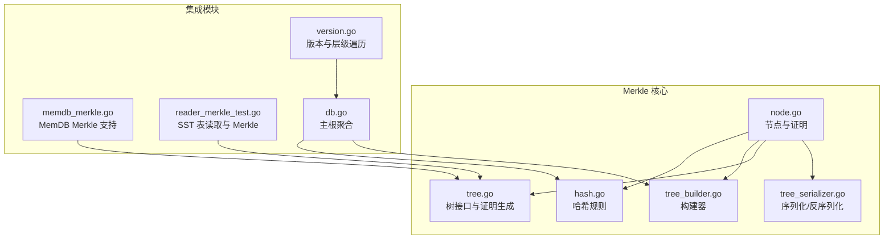
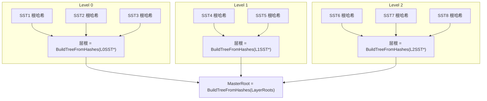
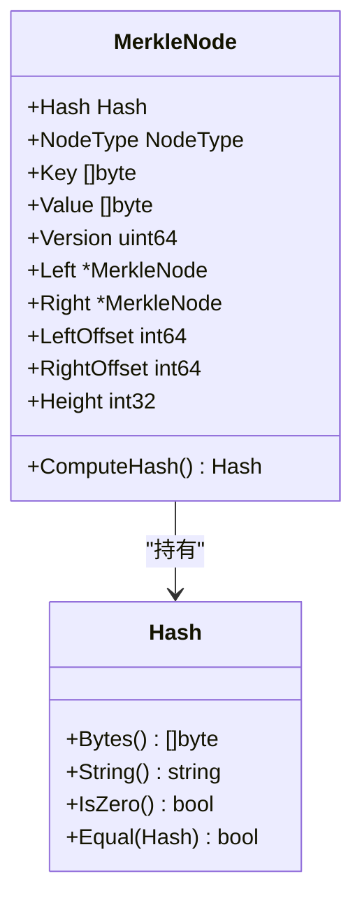
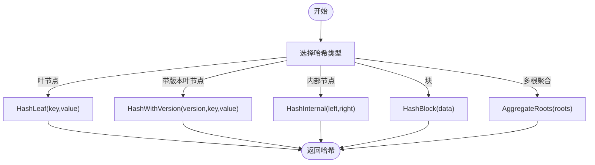
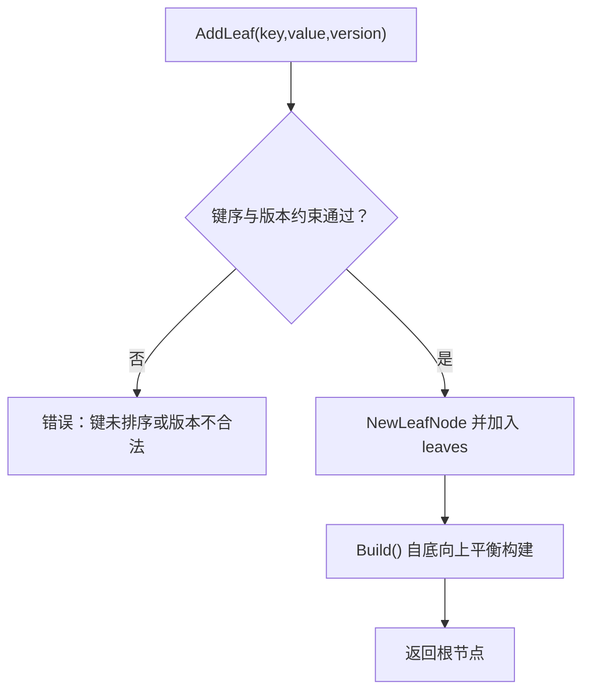
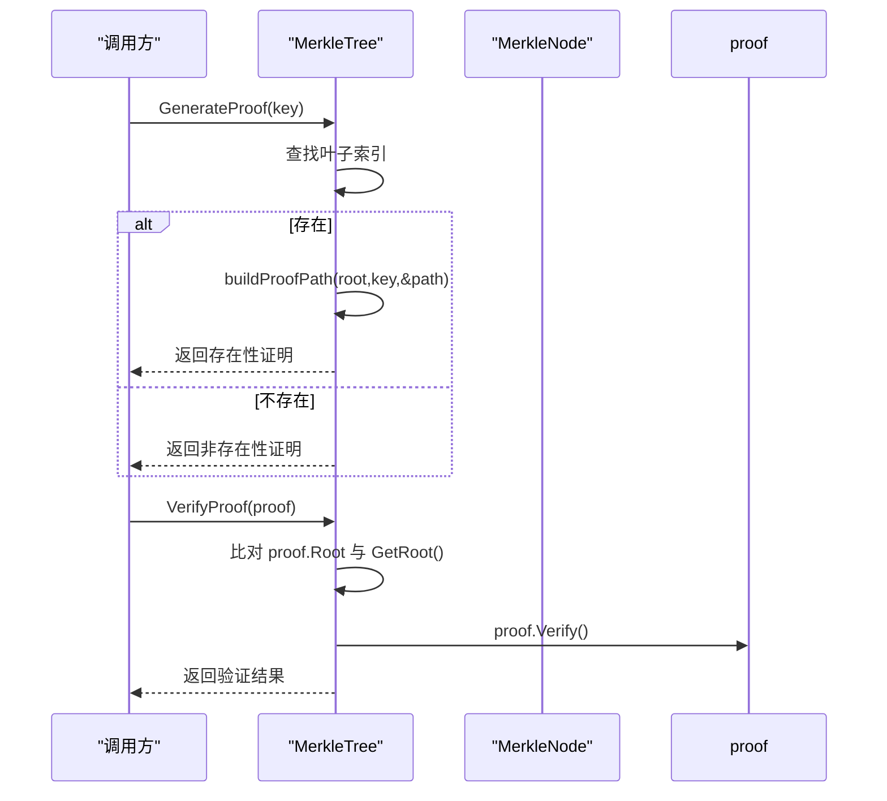
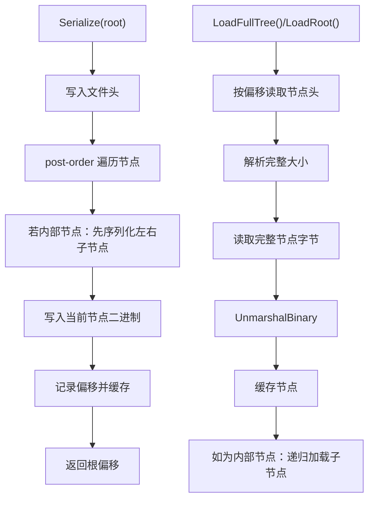
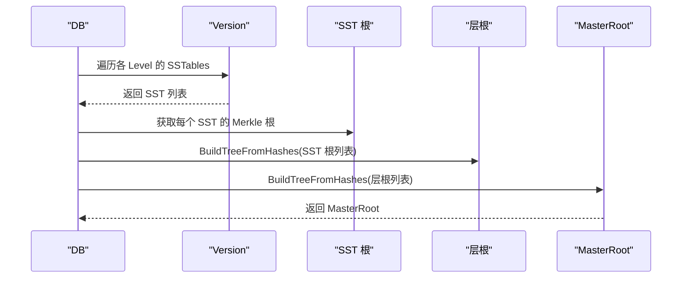
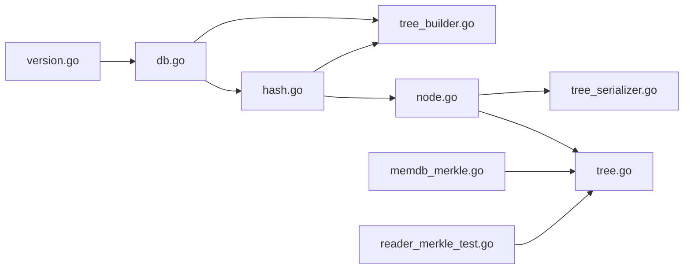

# Merkle树基础

<cite>
**本文引用的文件**
- [leveldb/merkle/node.go](file://leveldb/merkle/node.go)
- [leveldb/merkle/hash.go](file://leveldb/merkle/hash.go)
- [leveldb/merkle/tree_builder.go](file://leveldb/merkle/tree_builder.go)
- [leveldb/merkle/tree.go](file://leveldb/merkle/tree.go)
- [leveldb/merkle/tree_serializer.go](file://leveldb/merkle/tree_serializer.go)
- [leveldb/merkle/merkle_test.go](file://leveldb/merkle/merkle_test.go)
- [leveldb/memdb/memdb_merkle.go](file://leveldb/memdb/memdb_merkle.go)
- [leveldb/table/reader_merkle_test.go](file://leveldb/table/reader_merkle_test.go)
- [leveldb/db.go](file://leveldb/db.go)
- [leveldb/version.go](file://leveldb/version.go)
</cite>

## 目录
1. [引言](#引言)
2. [项目结构](#项目结构)
3. [核心组件](#核心组件)
4. [架构总览](#架构总览)
5. [详细组件分析](#详细组件分析)
6. [依赖关系分析](#依赖关系分析)
7. [性能考量](#性能考量)
8. [故障排查指南](#故障排查指南)
9. [结论](#结论)
10. [附录](#附录)

## 引言
本文件面向 avccDB 的 Merkle 树实现，聚焦于基础数据结构与核心算法，系统性阐述：
- 节点结构：leveldb/merkle/node.go 中的 Node 类型与序列化布局
- 构建过程：leveldb/merkle/tree_builder.go 提供的自顶向下与自底向上的构建策略
- 哈希规则：leveldb/merkle/hash.go 中的叶节点、内部节点与带版本叶节点的哈希计算
- 层级映射：如何将 LSM 层（Level-0 到 Level-N）映射为 Merkle 分层结构（SST 层、层根、主根）
- 动态更新与内存管理：流式构建器与树的增量更新策略

## 项目结构
Merkle 树相关代码集中在 leveldb/merkle 目录，配合 memdb、table、db 等模块在数据库生命周期中生成与维护 Merkle 根，形成从 SST 到层再到主根的三级聚合。

图表来源
- [leveldb/merkle/node.go](file://leveldb/merkle/node.go#L1-L120)
- [leveldb/merkle/hash.go](file://leveldb/merkle/hash.go#L1-L120)
- [leveldb/merkle/tree_builder.go](file://leveldb/merkle/tree_builder.go#L1-L120)
- [leveldb/merkle/tree.go](file://leveldb/merkle/tree.go#L1-L120)
- [leveldb/merkle/tree_serializer.go](file://leveldb/merkle/tree_serializer.go#L1-L120)
- [leveldb/memdb/memdb_merkle.go](file://leveldb/memdb/memdb_merkle.go#L1-L120)
- [leveldb/table/reader_merkle_test.go](file://leveldb/table/reader_merkle_test.go#L1-L120)
- [leveldb/db.go](file://leveldb/db.go#L1490-L1560)
- [leveldb/version.go](file://leveldb/version.go#L1-L120)

章节来源
- [leveldb/merkle/node.go](file://leveldb/merkle/node.go#L1-L120)
- [leveldb/merkle/hash.go](file://leveldb/merkle/hash.go#L1-L120)
- [leveldb/merkle/tree_builder.go](file://leveldb/merkle/tree_builder.go#L1-L120)
- [leveldb/merkle/tree.go](file://leveldb/merkle/tree.go#L1-L120)
- [leveldb/merkle/tree_serializer.go](file://leveldb/merkle/tree_serializer.go#L1-L120)
- [leveldb/memdb/memdb_merkle.go](file://leveldb/memdb/memdb_merkle.go#L1-L120)
- [leveldb/table/reader_merkle_test.go](file://leveldb/table/reader_merkle_test.go#L1-L120)
- [leveldb/db.go](file://leveldb/db.go#L1490-L1560)
- [leveldb/version.go](file://leveldb/version.go#L1-L120)

## 核心组件
- MerkleNode：通用节点类型，支持叶节点与内部节点，包含哈希、高度、偏移等字段；提供序列化/反序列化能力与哈希计算入口
- MerkleTree：基于 MerkleNode 的树接口，提供值查询、证明生成与校验、叶子索引与统计
- TreeBuilder/StreamingTreeBuilder：自底向上平衡构建，支持批量与流式构建，合并子树
- Hash 函数族：定义叶节点、内部节点、带版本叶节点、块哈希与多根聚合的哈希规则
- TreeSerializer/TreeDeserializer：树的持久化与按需加载，支持缓存与紧凑格式
- 集成：MemDB 提供基于当前状态的 Merkle 树；SST 表写入时可生成树；DB 在 flush/compaction 后计算层根与主根

章节来源
- [leveldb/merkle/node.go](file://leveldb/merkle/node.go#L1-L120)
- [leveldb/merkle/tree.go](file://leveldb/merkle/tree.go#L1-L120)
- [leveldb/merkle/tree_builder.go](file://leveldb/merkle/tree_builder.go#L1-L120)
- [leveldb/merkle/hash.go](file://leveldb/merkle/hash.go#L1-L120)
- [leveldb/merkle/tree_serializer.go](file://leveldb/merkle/tree_serializer.go#L1-L120)
- [leveldb/memdb/memdb_merkle.go](file://leveldb/memdb/memdb_merkle.go#L1-L120)
- [leveldb/table/reader_merkle_test.go](file://leveldb/table/reader_merkle_test.go#L1-L120)
- [leveldb/db.go](file://leveldb/db.go#L1490-L1560)

## 架构总览
Merkle 树在数据库中的三层映射：
- SST 层：每个 SSTable 拥有独立 Merkle 树，根哈希记录在表元数据中
- 层级层：同一 Level 内所有 SST 的根哈希组成该层的 Merkle 树，得到层根
- 主根层：所有层根构成顶层 Merkle 树，得到 MasterRoot

图表来源
- [leveldb/db.go](file://leveldb/db.go#L1490-L1560)
- [leveldb/merkle/tree_builder.go](file://leveldb/merkle/tree_builder.go#L153-L187)
- [leveldb/version.go](file://leveldb/version.go#L110-L140)

章节来源
- [leveldb/db.go](file://leveldb/db.go#L1490-L1560)
- [leveldb/merkle/tree_builder.go](file://leveldb/merkle/tree_builder.go#L153-L187)
- [leveldb/version.go](file://leveldb/version.go#L110-L140)

## 详细组件分析

### 节点结构与序列化（leveldb/merkle/node.go）
- 节点类型
  - 叶节点：保存用户键、值、版本号，哈希由 HashLeaf 或 HashWithVersion 计算
  - 内部节点：仅在内存中存在左右子节点指针，序列化时以文件偏移替代指针
- 序列化布局
  - 头部：1 字节类型 + 32 字节哈希 + 4 字节高度
  - 叶节点额外：8 字节版本 + 4 字节键长 + 键数据 + 4 字节值长 + 值数据
  - 内部节点额外：8 字节左偏移 + 8 字节右偏移
- 编码/解码
  - 编码：按布局顺序写入，内部节点先递归编码子节点再写自身
  - 解码：先读头部确定大小，再一次性读取完整节点字节并反序列化
- 哈希计算
  - 叶节点：HashLeaf 或 HashWithVersion（含版本）
  - 内部节点：HashInternal(leftHash, rightHash)

图表来源
- [leveldb/merkle/node.go](file://leveldb/merkle/node.go#L1-L120)
- [leveldb/merkle/hash.go](file://leveldb/merkle/hash.go#L1-L120)

章节来源
- [leveldb/merkle/node.go](file://leveldb/merkle/node.go#L1-L120)
- [leveldb/merkle/hash.go](file://leveldb/merkle/hash.go#L1-L120)

### 哈希计算规则（leveldb/merkle/hash.go）
- 叶节点哈希：对特定标记与键值拼接后进行 SHA-256
- 带版本叶节点哈希：对特定标记、版本号、键值拼接后进行 SHA-256
- 内部节点哈希：对特定标记与左右子节点哈希拼接后进行 SHA-256
- 块哈希：对任意数据块进行 SHA-256
- 多根聚合：对特定标记与多个根哈希顺序拼接后进行 SHA-256，用于层根与主根聚合

图表来源
- [leveldb/merkle/hash.go](file://leveldb/merkle/hash.go#L68-L153)

章节来源
- [leveldb/merkle/hash.go](file://leveldb/merkle/hash.go#L68-L153)

### 树的构建过程（leveldb/merkle/tree_builder.go）
- TreeBuilder
  - 自底向上平衡构建：按层级两两配对构造父节点，奇数个节点则上移
  - 统计信息：节点总数、叶节点数、树高
  - 输入约束：键必须有序，同键时高版本优先
- BuildFromSorted：从已排序 KV 对直接构建
- BuildTreeFromHashes：从哈希列表构建平衡二叉树，作为层根与主根的基础
- StreamingTreeBuilder
  - 流式批处理：达到内存阈值时将当前批次构建为子树并记录根
  - Finalize：合并所有子树根，形成最终树
- 叶迭代与去重
  - 叶迭代器：中序遍历收集叶节点
  - SortAndDeduplicate：按键与版本排序，保留最高版本

图表来源
- [leveldb/merkle/tree_builder.go](file://leveldb/merkle/tree_builder.go#L45-L131)

章节来源
- [leveldb/merkle/tree_builder.go](file://leveldb/merkle/tree_builder.go#L45-L131)
- [leveldb/merkle/tree_builder.go](file://leveldb/merkle/tree_builder.go#L133-L187)
- [leveldb/merkle/tree_builder.go](file://leveldb/merkle/tree_builder.go#L189-L295)
- [leveldb/merkle/tree_builder.go](file://leveldb/merkle/tree_builder.go#L313-L430)

### Merkle 树接口与证明（leveldb/merkle/tree.go）
- MerkleTree
  - 构造：传入根节点并建立叶子索引
  - 查询：通过叶子映射快速定位
  - 证明生成：存在性证明通过自顶向下收集兄弟节点哈希路径
  - 非存在性证明：当前实现简化为返回根（完整实现需边界相邻键）
  - 证明验证：先比对根，再按路径回推哈希并与根比较
  - 更新：不可变树策略，复制重建并重新索引
- 辅助：查找最左/最右键辅助证明路径构建

图表来源
- [leveldb/merkle/tree.go](file://leveldb/merkle/tree.go#L68-L226)

章节来源
- [leveldb/merkle/tree.go](file://leveldb/merkle/tree.go#L68-L226)

### 序列化与反序列化（leveldb/merkle/tree_serializer.go）
- TreeSerializer
  - 文件头：魔数与版本
  - 后序遍历：先写子节点，再写当前节点；记录节点偏移
  - 缓存：避免重复序列化
- TreeDeserializer
  - 按偏移读取：先读头部确定大小，再读取完整节点
  - 懒加载：缓存已加载节点，按需加载子节点
  - 全量加载：递归加载整棵树
- 紧凑格式
  - 仅存储根哈希、高度、叶数量与按层序的内部节点哈希数组，便于快速统计与校验

图表来源
- [leveldb/merkle/tree_serializer.go](file://leveldb/merkle/tree_serializer.go#L20-L120)
- [leveldb/merkle/tree_serializer.go](file://leveldb/merkle/tree_serializer.go#L121-L260)
- [leveldb/merkle/tree_serializer.go](file://leveldb/merkle/tree_serializer.go#L261-L377)

章节来源
- [leveldb/merkle/tree_serializer.go](file://leveldb/merkle/tree_serializer.go#L20-L120)
- [leveldb/merkle/tree_serializer.go](file://leveldb/merkle/tree_serializer.go#L121-L260)
- [leveldb/merkle/tree_serializer.go](file://leveldb/merkle/tree_serializer.go#L261-L377)

### LSM 层到 Merkle 分层的映射
- SST 层：每个 SSTable 的根哈希来自其内部 Merkle 树
- 层级层：同一 Level 的所有 SST 根哈希经 BuildTreeFromHashes 形成层根
- 主根层：所有层根经 BuildTreeFromHashes 形成 MasterRoot
- MemDB：当前实现暂不参与主根聚合（预留扩展）

图表来源
- [leveldb/db.go](file://leveldb/db.go#L1490-L1560)
- [leveldb/merkle/tree_builder.go](file://leveldb/merkle/tree_builder.go#L153-L187)
- [leveldb/version.go](file://leveldb/version.go#L110-L140)

章节来源
- [leveldb/db.go](file://leveldb/db.go#L1490-L1560)
- [leveldb/merkle/tree_builder.go](file://leveldb/merkle/tree_builder.go#L153-L187)
- [leveldb/version.go](file://leveldb/version.go#L110-L140)

### 从一组 SSTable 的根哈希构建层级 Merkle 树
- 步骤
  1) 从版本对象遍历指定 Level 的 SSTables，收集每个 SST 的 Merkle 根
  2) 使用 BuildTreeFromHashes 将该 Level 的 SST 根构造成层根
  3) 对所有层的层根再次调用 BuildTreeFromHashes，得到 MasterRoot
- 注意
  - 若某 Level 无 SST，则跳过
  - MemDB 当前不参与主根聚合（预留）

章节来源
- [leveldb/db.go](file://leveldb/db.go#L1490-L1560)
- [leveldb/merkle/tree_builder.go](file://leveldb/merkle/tree_builder.go#L153-L187)

### 动态更新机制与内存管理
- 动态更新
  - 不可变树策略：每次更新复制现有叶子，插入或替换目标键后重新排序与去重，重建树并更新索引
  - 版本控制：同键高版本优先，去重时保留最高版本
- 内存管理
  - TreeBuilder：自底向上构建，空间复杂度 O(n)，时间复杂度 O(n log n)（平衡树）
  - StreamingTreeBuilder：限制单批节点数，超过阈值即 flush 为子树根，Finalize 合并子树根，有效控制峰值内存
  - TreeSerializer：后序遍历，边写边记录偏移，避免重复序列化
  - TreeDeserializer：按需懒加载，缓存已加载节点，减少 IO 与内存占用
  - 紧凑格式：仅存储必要元数据，显著降低存储与传输成本

章节来源
- [leveldb/merkle/tree.go](file://leveldb/merkle/tree.go#L227-L286)
- [leveldb/merkle/tree_builder.go](file://leveldb/merkle/tree_builder.go#L189-L295)
- [leveldb/merkle/tree_serializer.go](file://leveldb/merkle/tree_serializer.go#L20-L120)

## 依赖关系分析
- 模块耦合
  - node.go 与 hash.go：节点计算依赖哈希函数
  - tree_builder.go 与 hash.go：构建哈希树依赖内部节点哈希
  - tree.go 与 node.go：证明生成依赖节点结构与哈希
  - tree_serializer.go 与 node.go：序列化依赖节点二进制布局
  - memdb_merkle.go 与 merkle：MemDB 依赖 Merkle 接口生成证明
  - table/reader_merkle_test.go 与 merkle：SST 写入/读取与 Merkle 树集成
  - db.go 与 merkle：主根聚合依赖哈希与树构建工具
- 外部依赖
  - SHA-256 哈希库
  - 文件读写与缓冲区

图表来源
- [leveldb/merkle/hash.go](file://leveldb/merkle/hash.go#L1-L120)
- [leveldb/merkle/node.go](file://leveldb/merkle/node.go#L1-L120)
- [leveldb/merkle/tree_builder.go](file://leveldb/merkle/tree_builder.go#L1-L120)
- [leveldb/merkle/tree.go](file://leveldb/merkle/tree.go#L1-L120)
- [leveldb/merkle/tree_serializer.go](file://leveldb/merkle/tree_serializer.go#L1-L120)
- [leveldb/memdb/memdb_merkle.go](file://leveldb/memdb/memdb_merkle.go#L1-L120)
- [leveldb/table/reader_merkle_test.go](file://leveldb/table/reader_merkle_test.go#L1-L120)
- [leveldb/db.go](file://leveldb/db.go#L1490-L1560)
- [leveldb/version.go](file://leveldb/version.go#L1-L120)

章节来源
- [leveldb/merkle/hash.go](file://leveldb/merkle/hash.go#L1-L120)
- [leveldb/merkle/node.go](file://leveldb/merkle/node.go#L1-L120)
- [leveldb/merkle/tree_builder.go](file://leveldb/merkle/tree_builder.go#L1-L120)
- [leveldb/merkle/tree.go](file://leveldb/merkle/tree.go#L1-L120)
- [leveldb/merkle/tree_serializer.go](file://leveldb/merkle/tree_serializer.go#L1-L120)
- [leveldb/memdb/memdb_merkle.go](file://leveldb/memdb/memdb_merkle.go#L1-L120)
- [leveldb/table/reader_merkle_test.go](file://leveldb/table/reader_merkle_test.go#L1-L120)
- [leveldb/db.go](file://leveldb/db.go#L1490-L1560)
- [leveldb/version.go](file://leveldb/version.go#L1-L120)

## 性能考量
- 时间复杂度
  - 构建：自底向上平衡树 O(n)
  - 证明生成：O(log n)
  - 证明验证：O(log n)
- 空间复杂度
  - TreeBuilder：O(n)
  - StreamingTreeBuilder：受 maxMemoryNodes 限制，峰值 O(maxMemoryNodes)
  - TreeSerializer：O(n)（仅偏移与缓存）
  - TreeDeserializer：按需加载，缓存命中可显著降低内存
- I/O 优化
  - 后序序列化减少随机访问
  - 懒加载与缓存提升大树加载效率
- 哈希开销
  - SHA-256 计算为瓶颈，建议在热点路径复用中间结果

## 故障排查指南
- 常见错误
  - 键未排序或版本不合法：AddLeaf 报错
  - 空树：GenerateProof/Verify 返回空树错误
  - 非法节点/哈希长度：反序列化失败
- 定位方法
  - 使用单元测试覆盖哈希、序列化、构建与证明流程
  - 通过基准测试评估构建与证明生成/验证性能
- 建议
  - 在生产环境启用流式构建器，避免内存峰值
  - 对频繁读取的树使用 TreeDeserializer 按需加载
  - 对主根聚合定期校验一致性

章节来源
- [leveldb/merkle/merkle_test.go](file://leveldb/merkle/merkle_test.go#L1-L120)
- [leveldb/merkle/merkle_test.go](file://leveldb/merkle/merkle_test.go#L120-L240)
- [leveldb/merkle/merkle_test.go](file://leveldb/merkle/merkle_test.go#L240-L317)

## 结论
avccDB 的 Merkle 树实现以简洁的节点模型与清晰的哈希规则为基础，结合自底向上的平衡构建与流式内存管理策略，在保证正确性的同时兼顾性能与可维护性。通过将 LSM 层映射为 Merkle 分层结构，实现了从 SST 到主根的可验证一致性，为后续的数据完整性校验与审计提供了坚实基础。

## 附录
- 示例参考
  - 哈希函数测试：[leveldb/merkle/merkle_test.go](file://leveldb/merkle/merkle_test.go#L12-L44)
  - 节点序列化测试：[leveldb/merkle/merkle_test.go](file://leveldb/merkle/merkle_test.go#L46-L75)
  - 树构建与证明测试：[leveldb/merkle/merkle_test.go](file://leveldb/merkle/merkle_test.go#L77-L151)
  - 流式构建测试：[leveldb/merkle/merkle_test.go](file://leveldb/merkle/merkle_test.go#L153-L191)
  - 紧凑格式测试：[leveldb/merkle/merkle_test.go](file://leveldb/merkle/merkle_test.go#L193-L239)
  - SST 表与 Merkle 集成测试：[leveldb/table/reader_merkle_test.go](file://leveldb/table/reader_merkle_test.go#L1-L120)
  - MemDB Merkle 集成：[leveldb/memdb/memdb_merkle.go](file://leveldb/memdb/memdb_merkle.go#L58-L124)
  - 主根聚合逻辑：[leveldb/db.go](file://leveldb/db.go#L1490-L1560)