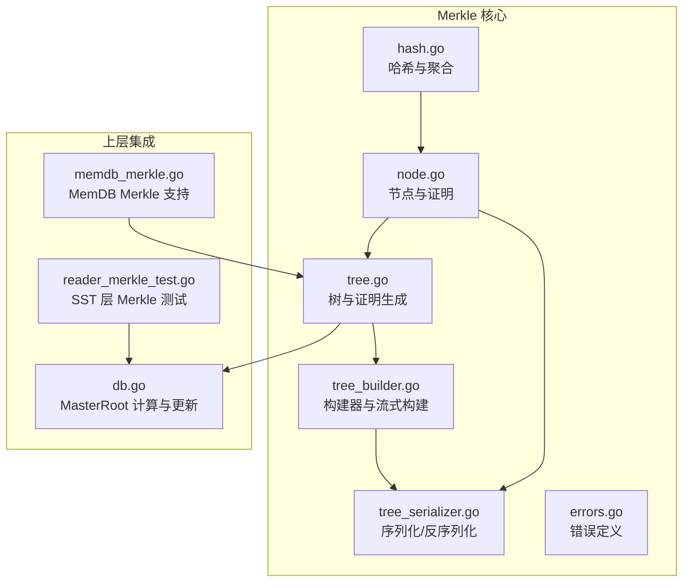
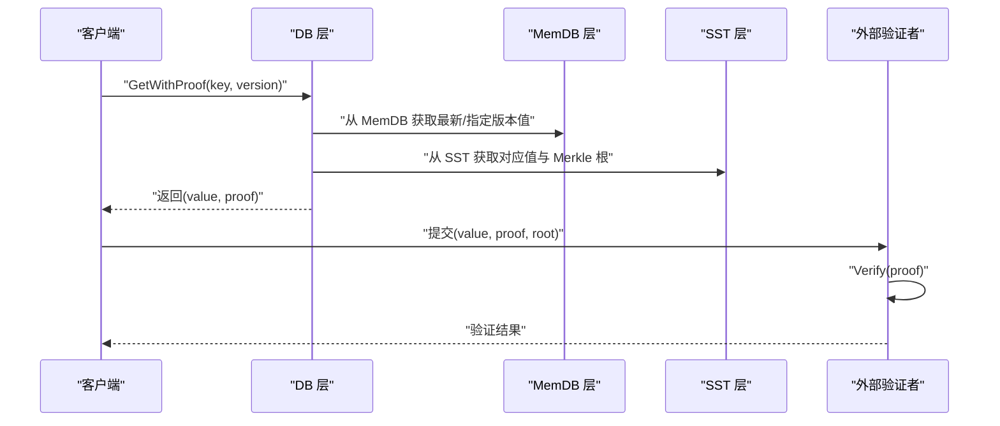
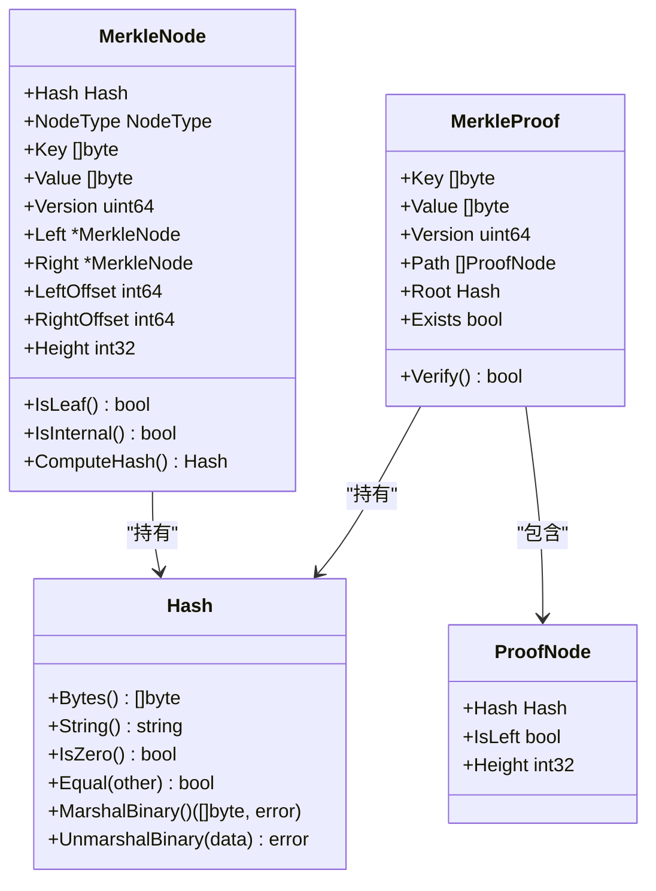
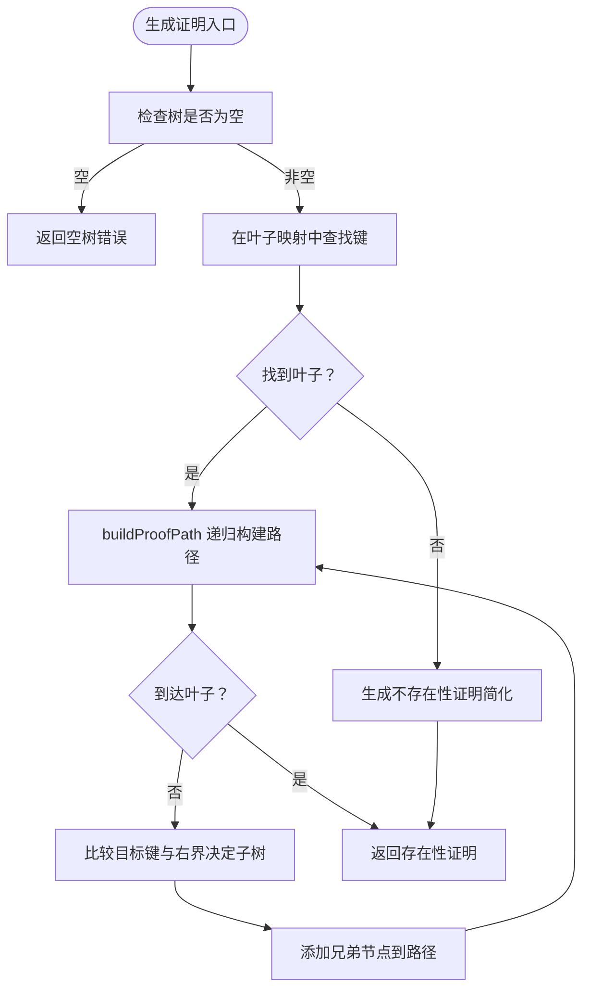
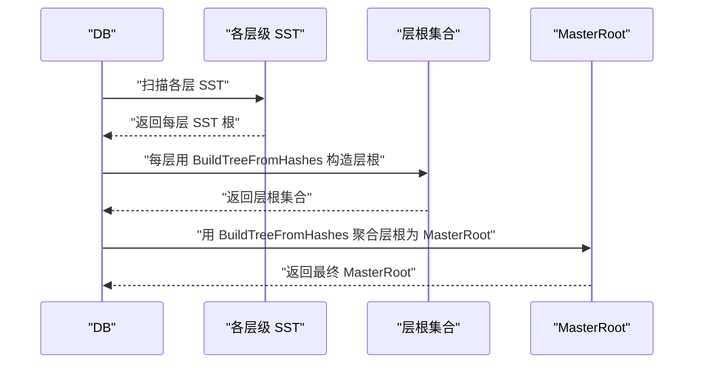
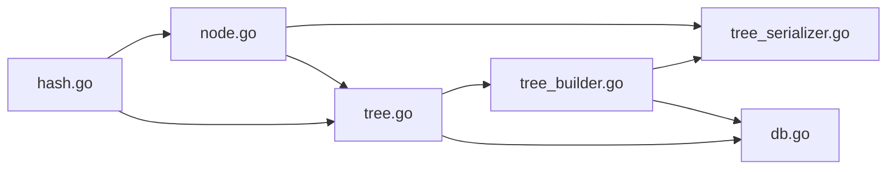
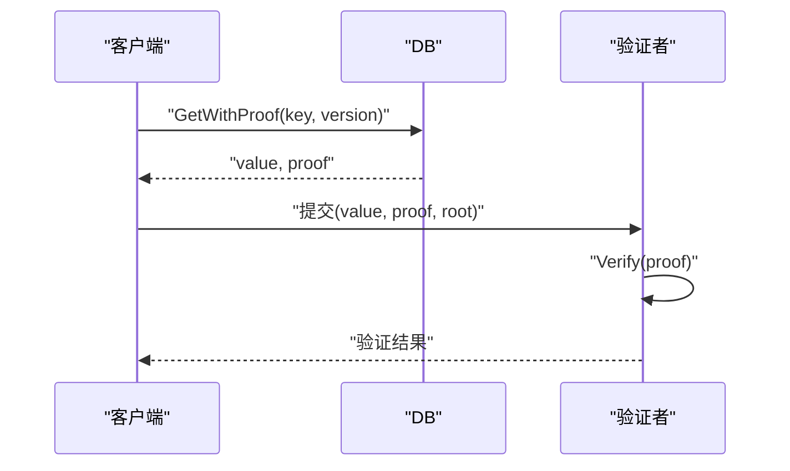

# 数据完整性与Merkle验证

<cite>
**本文引用的文件**
- [leveldb/merkle/hash.go](file://leveldb/merkle/hash.go)
- [leveldb/merkle/node.go](file://leveldb/merkle/node.go)
- [leveldb/merkle/tree.go](file://leveldb/merkle/tree.go)
- [leveldb/merkle/tree_builder.go](file://leveldb/merkle/tree_builder.go)
- [leveldb/merkle/tree_serializer.go](file://leveldb/merkle/tree_serializer.go)
- [leveldb/merkle/errors.go](file://leveldb/merkle/errors.go)
- [leveldb/memdb/memdb_merkle.go](file://leveldb/memdb/memdb_merkle.go)
- [leveldb/table/reader_merkle_test.go](file://leveldb/table/reader_merkle_test.go)
- [leveldb/db.go](file://leveldb/db.go)
</cite>

## 目录
1. [引言](#引言)
2. [项目结构](#项目结构)
3. [核心组件](#核心组件)
4. [架构总览](#架构总览)
5. [详细组件分析](#详细组件分析)
6. [依赖关系分析](#依赖关系分析)
7. [性能考量](#性能考量)
8. [故障排查指南](#故障排查指南)
9. [结论](#结论)
10. [附录](#附录)

## 引言
本文件面向 avccDB 的数据完整性验证机制，聚焦 Merkle 树的实现与应用。内容涵盖：
- Merkle 树的构建过程与哈希计算规则（基于 leveldb/merkle/hash.go 中的算法）
- 树节点结构与序列化格式
- 如何通过 GetWithProof 接口为特定键值生成 Merkle 证明，并由 Verify 方法验证数据真实性
- MasterRoot 的计算机制与更新时机，强调其作为全局一致性哈希的作用
- 端到端验证流程示例，展示在分布式环境中的防篡改校验思路
- 性能开销与优化策略

## 项目结构
围绕 Merkle 的核心代码位于 leveldb/merkle 目录，同时在 leveldb/memdb、leveldb/table 和 leveldb/db 中有集成点：
- Merkle 基础：hash.go、node.go、tree.go、tree_builder.go、tree_serializer.go、errors.go
- 层级整合：memdb_merkle.go（MemDB 层）、table/reader_merkle_test.go（SST 层测试）、db.go（顶层 MasterRoot 计算）

图表来源
- [leveldb/merkle/hash.go](file://leveldb/merkle/hash.go#L1-L153)
- [leveldb/merkle/node.go](file://leveldb/merkle/node.go#L1-L370)
- [leveldb/merkle/tree.go](file://leveldb/merkle/tree.go#L1-L286)
- [leveldb/merkle/tree_builder.go](file://leveldb/merkle/tree_builder.go#L1-L430)
- [leveldb/merkle/tree_serializer.go](file://leveldb/merkle/tree_serializer.go#L1-L377)
- [leveldb/merkle/errors.go](file://leveldb/merkle/errors.go#L1-L32)
- [leveldb/memdb/memdb_merkle.go](file://leveldb/memdb/memdb_merkle.go#L1-L181)
- [leveldb/table/reader_merkle_test.go](file://leveldb/table/reader_merkle_test.go#L1-L275)
- [leveldb/db.go](file://leveldb/db.go#L1520-L1570)

章节来源
- [leveldb/merkle/hash.go](file://leveldb/merkle/hash.go#L1-L153)
- [leveldb/merkle/node.go](file://leveldb/merkle/node.go#L1-L370)
- [leveldb/merkle/tree.go](file://leveldb/merkle/tree.go#L1-L286)
- [leveldb/merkle/tree_builder.go](file://leveldb/merkle/tree_builder.go#L1-L430)
- [leveldb/merkle/tree_serializer.go](file://leveldb/merkle/tree_serializer.go#L1-L377)
- [leveldb/merkle/errors.go](file://leveldb/merkle/errors.go#L1-L32)
- [leveldb/memdb/memdb_merkle.go](file://leveldb/memdb/memdb_merkle.go#L1-L181)
- [leveldb/table/reader_merkle_test.go](file://leveldb/table/reader_merkle_test.go#L1-L275)
- [leveldb/db.go](file://leveldb/db.go#L1520-L1570)

## 核心组件
- 哈希与聚合：定义 Hash 类型、基础哈希函数、叶子/内部节点哈希、带版本的叶子哈希、块哈希、多根聚合等。
- 节点与证明：MerkleNode 结构、MerkleProof 结构、ProofNode 结构、证明验证逻辑、节点序列化/反序列化。
- 树与构建：MerkleTree 提供生成证明、验证证明、更新叶子；TreeBuilder 底向上构建平衡树；StreamingTreeBuilder 支持流式增量构建。
- 层级集成：MemDB 层提供 GetWithProof；SST 层在读取器中启用 Merkle 并可加载树；DB 层计算 MasterRoot 并在 flush/compaction 后更新。

章节来源
- [leveldb/merkle/hash.go](file://leveldb/merkle/hash.go#L1-L153)
- [leveldb/merkle/node.go](file://leveldb/merkle/node.go#L1-L370)
- [leveldb/merkle/tree.go](file://leveldb/merkle/tree.go#L1-L286)
- [leveldb/merkle/tree_builder.go](file://leveldb/merkle/tree_builder.go#L1-L430)
- [leveldb/memdb/memdb_merkle.go](file://leveldb/memdb/memdb_merkle.go#L120-L181)
- [leveldb/table/reader_merkle_test.go](file://leveldb/table/reader_merkle_test.go#L1-L275)
- [leveldb/db.go](file://leveldb/db.go#L1520-L1570)

## 架构总览
Merkle 在 avccDB 中分层实现：
- MemDB 层：维护当前内存状态的 Merkle 树，提供 GetWithProof 获取证明。
- SST 层：每个 SST 文件包含 Merkle 根，读取器可加载树或直接返回证明。
- DB 层：按层级聚合各层 SST 根，最终形成 MasterRoot，用于全局一致性校验。

图表来源
- [leveldb/db.go](file://leveldb/db.go#L1127-L1146)
- [leveldb/memdb/memdb_merkle.go](file://leveldb/memdb/memdb_merkle.go#L120-L181)
- [leveldb/table/reader_merkle_test.go](file://leveldb/table/reader_merkle_test.go#L1-L275)
- [leveldb/merkle/node.go](file://leveldb/merkle/node.go#L122-L152)

## 详细组件分析

### 哈希与聚合（hash.go）
- Hash 类型与工具：提供固定长度字节表示、字符串输出、零值判断、相等比较、二进制编解码。
- 基础哈希函数：
  - HashData：对任意数据做 SHA-256。
  - HashConcat：对多个数据块顺序拼接后做 SHA-256。
  - HashBlock：对整块数据做 SHA-256（SST 使用）。
- 叶子与内部节点哈希：
  - HashLeaf：格式为 0x00 || key || value。
  - HashInternal：格式为 0x01 || leftHash || rightHash。
- 版本化叶子哈希：
  - HashWithVersion：格式为 0x02 || version || key || value。
- 多根聚合：
  - AggregateRoots：格式为 0x03 || root1 || root2 || ...，用于将多个 Merkle 根聚合为更高层的根（如层根聚合为 MasterRoot）。

复杂度与性能要点
- 单次哈希为 O(n)（n 为输入长度），聚合为 O(k·m)，k 为根数量，m 为平均根大小。
- 采用 SHA-256，安全性高但 CPU 成本较高；可通过批量聚合减少重复计算。

章节来源
- [leveldb/merkle/hash.go](file://leveldb/merkle/hash.go#L1-L153)

### 节点与证明（node.go）
- MerkleNode 结构：
  - 包含 Hash、NodeType（叶子/内部）、Key/Value/Version（叶子）、Left/Right（内部）、LeftOffset/RightOffset（序列化用）、Height。
  - ComputeHash：叶子节点根据是否带版本选择 HashLeaf 或 HashWithVersion；内部节点使用 HashInternal(left, right)。
- MerkleProof 结构：
  - Key/Value/Version/Exists，Root 为树根哈希，Path 为从叶到根的兄弟节点列表（含 IsLeft 与 Height）。
- 证明验证（MerkleProof.Verify）：
  - 若存在：从叶子哈希开始，逐层用兄弟节点与 HashInternal 组合向上计算，最终与 Root 比较。
  - 当前实现对不存在性证明简化处理。
- 节点序列化/反序列化：
  - 编码紧凑布局，包含类型、哈希、高度、叶子额外字段（版本、key/value 长度与数据）或内部节点偏移。
  - 解码时按头部信息推导完整节点大小，再一次性读取并解析。

图表来源
- [leveldb/merkle/node.go](file://leveldb/merkle/node.go#L1-L370)

章节来源
- [leveldb/merkle/node.go](file://leveldb/merkle/node.go#L1-L370)

### 树与证明生成（tree.go）
- MerkleTree：
  - 维护 root、比较器、叶子映射（快速定位叶子）、统计信息。
  - GetRoot：返回树根哈希。
  - Get：通过叶子映射查找键对应的值与版本。
  - GenerateProof：存在性证明通过 buildProofPath 收集兄弟节点路径；不存在性证明当前简化处理。
  - VerifyProof：先比对证明 Root 与树根，再调用 MerkleProof.Verify。
  - UpdateLeaf：收集所有叶子，更新或插入目标键的新版本，去重排序后重建树。
- 证明路径构建：
  - 递归遍历，依据比较器与左右边界确定子树方向，沿途记录兄弟节点哈希与方向信息。

图表来源
- [leveldb/merkle/tree.go](file://leveldb/merkle/tree.go#L85-L211)

章节来源
- [leveldb/merkle/tree.go](file://leveldb/merkle/tree.go#L1-L286)

### 构建器与流式构建（tree_builder.go）
- TreeBuilder：
  - AddLeaf/AddLeaves：要求键有序且同键高版本优先；构造叶子节点。
  - Build：单叶直接返回；否则自底向上配对构造平衡树，时间复杂度 O(n log n)。
  - BuildFromSorted：从已排序 KV 对构建。
  - BuildTreeFromHashes：从哈希列表构造平衡树，用于层根聚合。
- StreamingTreeBuilder：
  - 增量添加 KV，达到内存阈值后 flushBatch 构建子树根，最终 mergeSubtrees 合并为完整树。
  - 适合大规模数据的内存受限场景。
- 工具函数：
  - MergeTrees：合并两个无交叠且有序的树。
  - LeafIterator/CollectLeaves/SortAndDeduplicate：遍历、收集与去重（保留最高版本）。

章节来源
- [leveldb/merkle/tree_builder.go](file://leveldb/merkle/tree_builder.go#L1-L430)

### 序列化与紧凑格式（tree_serializer.go）
- TreeSerializer/TreeDeserializer：
  - 写入头（魔数、版本），后序遍历序列化子节点，记录节点偏移，支持缓存复用。
  - 读取时先读头推导节点大小，再一次性读取并反序列化。
- CompactTreeFormat：
  - 仅存储根哈希、高度、叶子数与内部节点哈希数组，便于快速传输与校验。

章节来源
- [leveldb/merkle/tree_serializer.go](file://leveldb/merkle/tree_serializer.go#L1-L377)

### 层级集成与 MasterRoot（memdb_merkle.go、table/reader_merkle_test.go、db.go）
- MemDB 层（memdb_merkle.go）：
  - MerkleDB 包装底层 DB，维护 dirty 标志与 rootHash，提供 GetWithProof 直接委托 MerkleTree.GenerateProof。
- SST 层（table/reader_merkle_test.go）：
  - Writer 可启用 Merkle，写入完成后 SST 包含 Merkle 根；Reader 加载 Merkle 树并支持 GetWithProof。
- DB 层（db.go）：
  - computeMasterRoot：遍历各级 SST，收集每层的 SST 根，先用 BuildTreeFromHashes 构造层根，再将所有层根聚合为 MasterRoot。
  - updateMasterRoot：在 flush/compaction 后更新全局 MasterRoot。
  - DB.GetWithProof：对外提供带版本的值与证明查询接口。

图表来源
- [leveldb/db.go](file://leveldb/db.go#L1520-L1570)
- [leveldb/merkle/tree_builder.go](file://leveldb/merkle/tree_builder.go#L153-L187)

章节来源
- [leveldb/memdb/memdb_merkle.go](file://leveldb/memdb/memdb_merkle.go#L120-L181)
- [leveldb/table/reader_merkle_test.go](file://leveldb/table/reader_merkle_test.go#L1-L275)
- [leveldb/db.go](file://leveldb/db.go#L1520-L1570)

## 依赖关系分析
- MerkleNode/Proof 依赖 Hash 与哈希函数族（HashLeaf/HashInternal/HashWithVersion/AggregateRoots）。
- MerkleTree 依赖 MerkleNode 与 TreeBuilder；TreeBuilder 依赖 Compare 函数与排序/去重工具。
- TreeSerializer 依赖 MerkleNode 的二进制编码；CompactTreeFormat 依赖 MerkleTree 的遍历。
- DB 层依赖 SST 层提供的 Merkle 根，使用 BuildTreeFromHashes 进行层根与 MasterRoot 聚合。

图表来源
- [leveldb/merkle/hash.go](file://leveldb/merkle/hash.go#L1-L153)
- [leveldb/merkle/node.go](file://leveldb/merkle/node.go#L1-L370)
- [leveldb/merkle/tree.go](file://leveldb/merkle/tree.go#L1-L286)
- [leveldb/merkle/tree_builder.go](file://leveldb/merkle/tree_builder.go#L1-L430)
- [leveldb/merkle/tree_serializer.go](file://leveldb/merkle/tree_serializer.go#L1-L377)
- [leveldb/db.go](file://leveldb/db.go#L1520-L1570)

章节来源
- [leveldb/merkle/hash.go](file://leveldb/merkle/hash.go#L1-L153)
- [leveldb/merkle/node.go](file://leveldb/merkle/node.go#L1-L370)
- [leveldb/merkle/tree.go](file://leveldb/merkle/tree.go#L1-L286)
- [leveldb/merkle/tree_builder.go](file://leveldb/merkle/tree_builder.go#L1-L430)
- [leveldb/merkle/tree_serializer.go](file://leveldb/merkle/tree_serializer.go#L1-L377)
- [leveldb/db.go](file://leveldb/db.go#L1520-L1570)

## 性能考量
- 哈希成本：SHA-256 为 CPU 密集型操作；建议批量聚合（AggregateRoots/BuildTreeFromHashes）以减少重复计算。
- 树构建：TreeBuilder 自底向上配对构造平衡树，时间复杂度 O(n log n)；StreamingTreeBuilder 通过分批与合并降低峰值内存占用。
- 证明生成：需要遍历从叶到根的路径，路径长度约 O(log n)，每次内部哈希 O(1)。
- 证明验证：同样 O(log n) 次内部哈希，适合轻量级外部验证。
- 序列化：TreeSerializer 采用后序遍历与偏移记录，避免重复写入；CompactTreeFormat 仅存储必要元数据，适合网络传输与快速校验。

优化建议
- 批量聚合：在 DB 层使用 BuildTreeFromHashes 聚合层根与 MasterRoot，减少多次哈希。
- 流式构建：大表场景使用 StreamingTreeBuilder 控制内存上限。
- 缓存：TreeDeserializer 使用偏移缓存，减少重复 IO。
- 去重与排序：SortAndDeduplicate 保留最高版本，避免冗余节点。

[本节为通用指导，无需具体文件引用]

## 故障排查指南
常见错误与定位
- 空树/键不存在：GenerateProof 返回空树或键未找到错误；VerifyProof 返回 false。
- 节点结构损坏：反序列化时 ErrInvalidNode；检查序列化格式与文件完整性。
- 版本号无效：HashWithVersion 参数异常导致 ErrInvalidVersion。
- 数据损坏：ErrCorruptedData；检查 SST 文件与序列化头。

排查步骤
- 确认树根与证明 Root 一致（VerifyProof 先比对 Root）。
- 复核证明路径方向（IsLeft/IsRight）与高度信息是否正确。
- 检查序列化/反序列化流程，确保节点头部与变长字段长度匹配。
- 在 DB 层确认 MasterRoot 计算链路（各层 SST 根聚合）。

章节来源
- [leveldb/merkle/errors.go](file://leveldb/merkle/errors.go#L1-L32)
- [leveldb/merkle/tree_serializer.go](file://leveldb/merkle/tree_serializer.go#L121-L217)
- [leveldb/merkle/tree.go](file://leveldb/merkle/tree.go#L213-L225)

## 结论
avccDB 的 Merkle 实现以模块化方式覆盖了哈希、节点、树构建、序列化与层级聚合等关键环节。通过 GetWithProof 与 Verify 的配合，可在分布式环境下实现高效、可信的数据完整性校验；MasterRoot 则提供了全局一致性哈希，便于跨层与跨节点的统一校验。结合流式构建与批量聚合策略，可在保证安全性的前提下兼顾性能与资源占用。

[本节为总结，无需具体文件引用]

## 附录

### 端到端验证流程示例（概念流程）
- 步骤 1：客户端向 DB 发起 GetWithProof(key, version) 请求。
- 步骤 2：DB 从 MemDB/SST 层获取值与 Merkle 证明。
- 步骤 3：客户端将 value、proof、root 提交给外部验证者。
- 步骤 4：验证者执行 MerkleProof.Verify，若成功则确认数据真实且未被篡改。
- 步骤 5：在分布式场景中，验证者可进一步使用 MasterRoot 对全库状态进行一致性校验。

图表来源
- [leveldb/db.go](file://leveldb/db.go#L1127-L1146)
- [leveldb/merkle/node.go](file://leveldb/merkle/node.go#L122-L152)

### 关键接口与路径索引
- 生成证明：MerkleTree.GenerateProof（路径参考：file://leveldb/merkle/tree.go#L85-L120）
- 验证证明：MerkleTree.VerifyProof（路径参考：file://leveldb/merkle/tree.go#L213-L225）、MerkleProof.Verify（路径参考：file://leveldb/merkle/node.go#L122-L152）
- 哈希与聚合：HashLeaf/HashInternal/HashWithVersion/AggregateRoots（路径参考：file://leveldb/merkle/hash.go#L68-L152）
- 层根聚合：BuildTreeFromHashes（路径参考：file://leveldb/merkle/tree_builder.go#L153-L187）
- MasterRoot 计算：computeMasterRoot/updateMasterRoot（路径参考：file://leveldb/db.go#L1520-L1570）
- MemDB 证明：MerkleDB.GetWithProof（路径参考：file://leveldb/memdb/memdb_merkle.go#L120-L147）
- SST 证明测试：reader_merkle_test（路径参考：file://leveldb/table/reader_merkle_test.go#L1-L275）