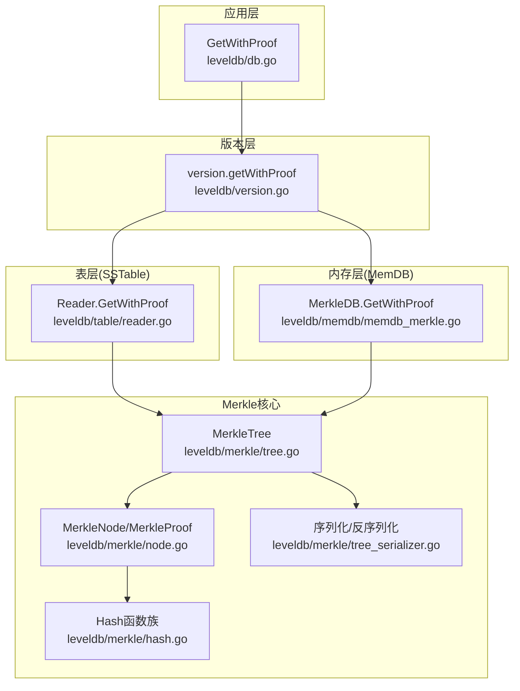
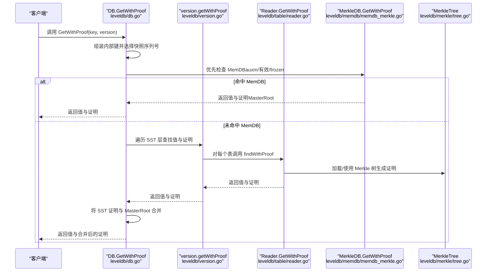
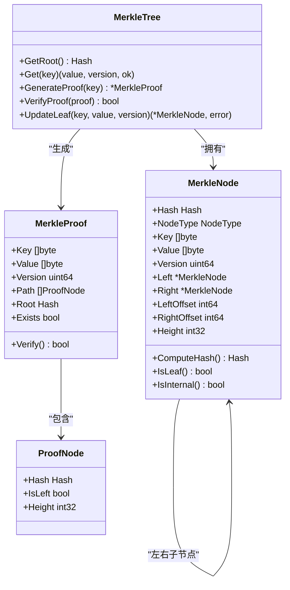
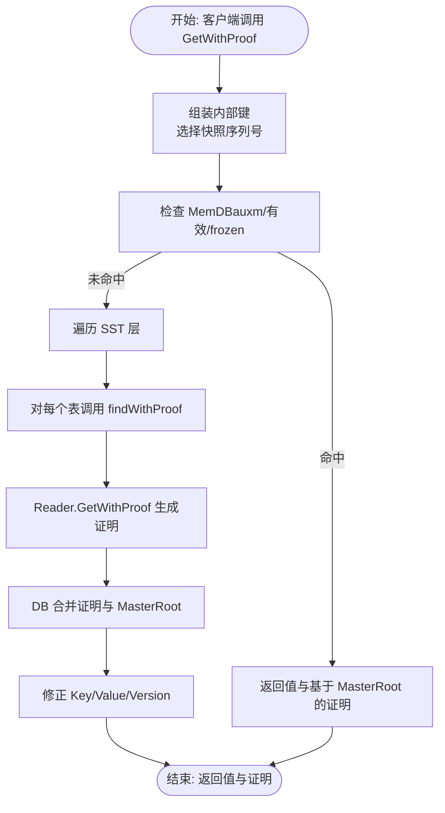
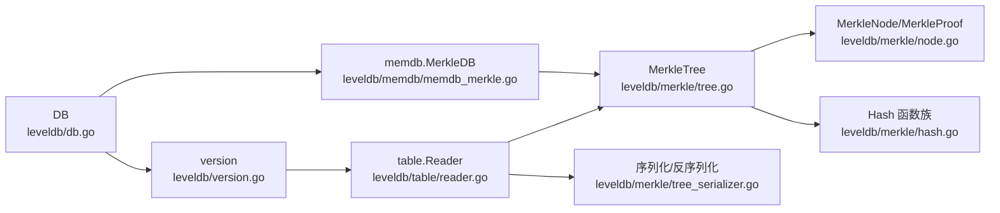

# 证明生成

<cite>
**本文引用的文件**
- [leveldb/db.go](file://leveldb/db.go)
- [leveldb/version.go](file://leveldb/version.go)
- [leveldb/table/reader.go](file://leveldb/table/reader.go)
- [leveldb/memdb/memdb_merkle.go](file://leveldb/memdb/memdb_merkle.go)
- [leveldb/merkle/tree.go](file://leveldb/merkle/tree.go)
- [leveldb/merkle/node.go](file://leveldb/merkle/node.go)
- [leveldb/merkle/hash.go](file://leveldb/merkle/hash.go)
- [leveldb/merkle/tree_builder.go](file://leveldb/merkle/tree_builder.go)
- [leveldb/merkle/tree_serializer.go](file://leveldb/merkle/tree_serializer.go)
</cite>

## 目录
1. [引言](#引言)
2. [项目结构](#项目结构)
3. [核心组件](#核心组件)
4. [架构总览](#架构总览)
5. [详细组件分析](#详细组件分析)
6. [依赖关系分析](#依赖关系分析)
7. [性能考量](#性能考量)
8. [故障排查指南](#故障排查指南)
9. [结论](#结论)

## 引言
本文件面向 avccDB 的 Merkle 证明生成机制，围绕 GetWithProof 接口展开，系统性梳理从数据库入口到最终在 SSTable 或 MemDB 中生成证明的完整路径，并深入解释 MerkleProof 结构中各字段（Key、Value、Path、Root）的生成逻辑与验证流程。同时给出一次端到端调用的代码追踪示例，帮助读者理解跨组件协作过程。

## 项目结构
- 数据库入口：leveldb/db.go 提供 GetWithProof 入口，负责按层搜索并聚合证明。
- 版本层：leveldb/version.go 负责遍历 SST 文件层，尝试获取值和证明。
- 表层（SSTable）：leveldb/table/reader.go 提供 Reader.GetWithProof，支持从 SSTable 生成证明。
- 内存层（MemDB）：leveldb/memdb/memdb_merkle.go 提供 MerkleDB.GetWithProof，支持从内存生成证明。
- Merkle 核心：leveldb/merkle/* 提供树结构、哈希、序列化/反序列化、证明生成与验证等能力。

图表来源
- [leveldb/db.go](file://leveldb/db.go#L1127-L1147)
- [leveldb/version.go](file://leveldb/version.go#L287-L429)
- [leveldb/table/reader.go](file://leveldb/table/reader.go#L1041-L1158)
- [leveldb/memdb/memdb_merkle.go](file://leveldb/memdb/memdb_merkle.go#L126-L147)
- [leveldb/merkle/tree.go](file://leveldb/merkle/tree.go#L1-L286)
- [leveldb/merkle/node.go](file://leveldb/merkle/node.go#L1-L370)
- [leveldb/merkle/hash.go](file://leveldb/merkle/hash.go#L1-L153)
- [leveldb/merkle/tree_serializer.go](file://leveldb/merkle/tree_serializer.go#L1-L377)

章节来源
- [leveldb/db.go](file://leveldb/db.go#L1127-L1147)
- [leveldb/version.go](file://leveldb/version.go#L287-L429)
- [leveldb/table/reader.go](file://leveldb/table/reader.go#L1041-L1158)
- [leveldb/memdb/memdb_merkle.go](file://leveldb/memdb/memdb_merkle.go#L126-L147)
- [leveldb/merkle/tree.go](file://leveldb/merkle/tree.go#L1-L286)
- [leveldb/merkle/node.go](file://leveldb/merkle/node.go#L1-L370)
- [leveldb/merkle/hash.go](file://leveldb/merkle/hash.go#L1-L153)
- [leveldb/merkle/tree_serializer.go](file://leveldb/merkle/tree_serializer.go#L1-L377)

## 核心组件
- DB.GetWithProof：对外暴露的入口，负责按层查找并返回值与证明；若未命中 SST，则构造基于 MasterRoot 的简单证明。
- version.getWithProof：遍历 SST 层，尝试从表层获取值与证明；支持版本匹配与最新版本策略。
- table.Reader.GetWithProof：在 SSTable 层加载 Merkle 树元数据，生成证明（当前实现返回基础结构，完整路径生成在优化阶段）。
- memdb.MerkleDB.GetWithProof：在内存层构建/复用 Merkle 树，生成证明。
- merkle.MerkleTree：提供 GenerateProof、VerifyProof、UpdateLeaf 等核心能力。
- merkle.MerkleNode/MerkleProof：定义节点与证明的数据结构及验证逻辑。
- merkle.Hash 函数族：定义叶子、内部节点、带版本节点、聚合根等哈希格式。
- merkle 序列化/反序列化：支持树的持久化与紧凑格式存储。

章节来源
- [leveldb/db.go](file://leveldb/db.go#L1127-L1147)
- [leveldb/version.go](file://leveldb/version.go#L287-L429)
- [leveldb/table/reader.go](file://leveldb/table/reader.go#L1041-L1158)
- [leveldb/memdb/memdb_merkle.go](file://leveldb/memdb/memdb_merkle.go#L126-L147)
- [leveldb/merkle/tree.go](file://leveldb/merkle/tree.go#L1-L286)
- [leveldb/merkle/node.go](file://leveldb/merkle/node.go#L1-L370)
- [leveldb/merkle/hash.go](file://leveldb/merkle/hash.go#L1-L153)
- [leveldb/merkle/tree_serializer.go](file://leveldb/merkle/tree_serializer.go#L1-L377)

## 架构总览
下图展示了 GetWithProof 的端到端调用链路，从应用层到各层组件的协作方式。

图表来源
- [leveldb/db.go](file://leveldb/db.go#L1127-L1147)
- [leveldb/version.go](file://leveldb/version.go#L287-L429)
- [leveldb/table/reader.go](file://leveldb/table/reader.go#L1041-L1158)
- [leveldb/memdb/memdb_merkle.go](file://leveldb/memdb/memdb_merkle.go#L126-L147)
- [leveldb/merkle/tree.go](file://leveldb/merkle/tree.go#L1-L286)

## 详细组件分析

### DB.GetWithProof（数据库入口）
- 功能要点：
  - 组装内部键（含版本与序列号），选择快照序列号。
  - 优先检查辅助 MemDB 与有效/冻结 MemDB，若命中则直接返回值与基于 MasterRoot 的简单证明。
  - 若未命中 MemDB，则委托版本层遍历 SST 文件层，尝试获取值与证明。
  - 若来自 SST 的证明存在，修正 Key/Value/Version 并通过 CombineWithLayerProof 与 MasterRoot 合并；否则构造仅含 MasterRoot 的简单证明。
- 关键路径：
  - 入口：leveldb/db.go#L1127-L1147
  - 实现：leveldb/db.go#L835-L932

章节来源
- [leveldb/db.go](file://leveldb/db.go#L835-L932)
- [leveldb/db.go](file://leveldb/db.go#L1127-L1147)

### 版本层 version.getWithProof（SST 层遍历）
- 功能要点：
  - 遍历重叠的 SST 文件集合，逐个调用 tops.findWithProof 获取值与证明。
  - 支持版本匹配（latest wildcard、指定版本）与最新版本策略。
  - 在 level<=0 或未指定版本时，比较序列号以选择最新值。
- 关键路径：
  - 实现：leveldb/version.go#L287-L429

章节来源
- [leveldb/version.go](file://leveldb/version.go#L287-L429)

### 表层 Reader.GetWithProof（SSTable 证明生成）
- 功能要点：
  - 使用标准查找路径定位键值，若启用 Merkle 则加载 Merkle 树元数据。
  - 当前实现返回基础证明结构（包含根哈希），完整路径生成在后续优化中完善。
  - 提供 GetMerkleRoot 用于获取表级根哈希。
- 关键路径：
  - 实现：leveldb/table/reader.go#L1041-L1158

章节来源
- [leveldb/table/reader.go](file://leveldb/table/reader.go#L1041-L1158)

### 内存层 MerkleDB.GetWithProof（MemDB 证明生成）
- 功能要点：
  - 通过 MerkleDB 包装底层 memdb.DB，维护 Merkle 树缓存与脏标记。
  - GetWithProof 在需要时构建树，然后调用 MerkleTree.GenerateProof 生成证明。
  - 提供 GetRootHash、BuildMerkleTree 等辅助能力。
- 关键路径：
  - 实现：leveldb/memdb/memdb_merkle.go#L126-L147

章节来源
- [leveldb/memdb/memdb_merkle.go](file://leveldb/memdb/memdb_merkle.go#L126-L147)

### MerkleTree 与证明结构（MerkleProof）
- MerkleTree：
  - 提供 GenerateProof、VerifyProof、UpdateLeaf 等核心方法。
  - buildLeafIndex 建立叶子映射，便于快速定位。
  - generateExistenceProof/buildProofPath 构建从叶子到根的兄弟节点哈希路径。
  - generateNonExistenceProof 当前简化实现，完整实现需证明不存在性。
- MerkleNode/MerkleProof：
  - MerkleNode 定义节点类型、哈希、左右子节点偏移、高度等。
  - MerkleProof 包含 Key、Value、Version、Path、Root、Exists。
  - ProofNode 记录兄弟节点哈希、是否左侧、高度。
  - Verify 对证明进行验证：从叶子哈希开始，逐层与兄弟节点哈希组合计算，最终与 Root 比较。
- Hash 函数族：
  - HashLeaf、HashInternal、HashWithVersion、AggregateRoots 等，定义了不同节点类型的哈希格式与聚合规则。
- 序列化/反序列化：
  - 支持完整树与紧凑格式（CompactTreeFormat）存储，Reader.loadMerkleTree 使用紧凑格式恢复根节点信息。

图表来源
- [leveldb/merkle/tree.go](file://leveldb/merkle/tree.go#L1-L286)
- [leveldb/merkle/node.go](file://leveldb/merkle/node.go#L1-L370)
- [leveldb/merkle/hash.go](file://leveldb/merkle/hash.go#L1-L153)

章节来源
- [leveldb/merkle/tree.go](file://leveldb/merkle/tree.go#L1-L286)
- [leveldb/merkle/node.go](file://leveldb/merkle/node.go#L1-L370)
- [leveldb/merkle/hash.go](file://leveldb/merkle/hash.go#L1-L153)

### 证明结构字段生成逻辑
- Key：用户键。在 DB 层修正为用户键（非内部键），并在 SST 层由 Reader.GetWithProof 返回。
- Value：用户值。在 DB 层修正为实际值。
- Version：版本号。在 DB 层修正为目标版本（latest wildcard 视为任意版本）。
- Path：从叶子到根的兄弟节点哈希序列。由 MerkleTree.buildProofPath 递归构建，记录每个内部节点的兄弟哈希与方向。
- Root：树根哈希。MemDB 层使用 MasterRoot；SST 层使用表级 Merkle 根或紧凑格式根。

章节来源
- [leveldb/db.go](file://leveldb/db.go#L835-L932)
- [leveldb/table/reader.go](file://leveldb/table/reader.go#L1041-L1158)
- [leveldb/merkle/tree.go](file://leveldb/merkle/tree.go#L85-L166)
- [leveldb/merkle/node.go](file://leveldb/merkle/node.go#L98-L152)

### 端到端调用追踪示例
以下示例展示一次 GetWithProof 调用如何跨组件协作完成：
- 步骤 1：客户端调用 DB.GetWithProof(key, version)。
- 步骤 2：DB 组装内部键并选择快照序列号，优先检查 MemDB（auxm/有效/frozen）。
- 步骤 3：若 MemDB 命中，直接返回值与基于 MasterRoot 的简单证明。
- 步骤 4：若未命中，DB 调用 version.getWithProof 遍历 SST。
- 步骤 5：version.getWithProof 对每个表调用 tops.findWithProof 获取值与证明。
- 步骤 6：Reader.GetWithProof 使用 Merkle 树元数据生成证明（当前返回基础结构，完整路径待实现）。
- 步骤 7：DB 将 SST 证明与 MasterRoot 合并，修正 Key/Value/Version 后返回给客户端。

图表来源
- [leveldb/db.go](file://leveldb/db.go#L1127-L1147)
- [leveldb/version.go](file://leveldb/version.go#L287-L429)
- [leveldb/table/reader.go](file://leveldb/table/reader.go#L1041-L1158)

章节来源
- [leveldb/db.go](file://leveldb/db.go#L1127-L1147)
- [leveldb/version.go](file://leveldb/version.go#L287-L429)
- [leveldb/table/reader.go](file://leveldb/table/reader.go#L1041-L1158)

## 依赖关系分析
- 组件耦合：
  - DB 依赖 version 与 memdb，version 依赖 table tops 与 storage。
  - table.Reader 依赖 merkle.MerkleTree 与 merkle.Hash。
  - memdb.MerkleDB 依赖 merkle.MerkleTree 与 memdb.DB。
  - merkle.MerkleTree 依赖 merkle.MerkleNode、merkle.MerkleProof、merkle.Hash。
- 外部依赖：
  - 哈希算法：SHA-256。
  - 序列化：二进制编码与紧凑格式。
- 循环依赖：
  - 代码组织上未见循环导入；Reader 与 MerkleTree 通过接口/组合解耦。

图表来源
- [leveldb/db.go](file://leveldb/db.go#L1127-L1147)
- [leveldb/version.go](file://leveldb/version.go#L287-L429)
- [leveldb/table/reader.go](file://leveldb/table/reader.go#L1041-L1158)
- [leveldb/memdb/memdb_merkle.go](file://leveldb/memdb/memdb_merkle.go#L126-L147)
- [leveldb/merkle/tree.go](file://leveldb/merkle/tree.go#L1-L286)
- [leveldb/merkle/node.go](file://leveldb/merkle/node.go#L1-L370)
- [leveldb/merkle/hash.go](file://leveldb/merkle/hash.go#L1-L153)
- [leveldb/merkle/tree_serializer.go](file://leveldb/merkle/tree_serializer.go#L1-L377)

章节来源
- [leveldb/db.go](file://leveldb/db.go#L1127-L1147)
- [leveldb/version.go](file://leveldb/version.go#L287-L429)
- [leveldb/table/reader.go](file://leveldb/table/reader.go#L1041-L1158)
- [leveldb/memdb/memdb_merkle.go](file://leveldb/memdb/memdb_merkle.go#L126-L147)
- [leveldb/merkle/tree.go](file://leveldb/merkle/tree.go#L1-L286)
- [leveldb/merkle/node.go](file://leveldb/merkle/node.go#L1-L370)
- [leveldb/merkle/hash.go](file://leveldb/merkle/hash.go#L1-L153)
- [leveldb/merkle/tree_serializer.go](file://leveldb/merkle/tree_serializer.go#L1-L377)

## 性能考量
- 内存占用：
  - MerkleTree 在内存中维护叶子映射与内部节点，建议在高并发场景下控制树大小或采用分层聚合（MasterRoot）。
- I/O 与缓存：
  - Reader 通过缓存与块池减少重复读取；Merkle 树元数据采用紧凑格式存储，降低读取开销。
- 版本查询：
  - 最新版本策略会比较序列号，避免不必要的全表扫描；指定版本可直接命中对应层级。
- 证明生成：
  - 当前 SST 层证明生成为基础结构，完整路径生成涉及数据块扫描与索引定位，建议在热点路径上结合缓存与预取策略。

## 故障排查指南
- 常见错误与处理：
  - ErrNotFound：键不存在，返回 ErrNotFound；在 DB 层可能仍返回值（取决于版本与层级）。
  - Merkle 树未加载：Reader.loadMerkleTree 失败时，仍返回值但不附带证明。
  - 版本不匹配：version.getWithProof 会在指定版本不匹配时继续搜索。
- 验证建议：
  - 使用 MerkleProof.Verify 进行本地验证，确保 Path 与 Root 一致。
  - 检查 MasterRoot 是否正确聚合（CombineWithLayerProof）。
- 调试技巧：
  - 打印各层 Key/Value/Version，确认 DB 层修正逻辑是否生效。
  - 检查 MerkleTree 的叶子映射与统计信息（TreeStats）。

章节来源
- [leveldb/db.go](file://leveldb/db.go#L835-L932)
- [leveldb/version.go](file://leveldb/version.go#L287-L429)
- [leveldb/table/reader.go](file://leveldb/table/reader.go#L1041-L1158)
- [leveldb/merkle/node.go](file://leveldb/merkle/node.go#L122-L152)

## 结论
avccDB 的 GetWithProof 机制通过多层协作实现了可信的值与证明返回：MemDB 层提供即时证明（基于 MasterRoot），SST 层通过 Merkle 树元数据生成证明（当前为基础结构，完整路径生成在优化中）。MerkleTree 与 Hash 函数族提供了严谨的证明生成与验证能力。整体设计兼顾性能与安全性，适合在需要去中心化验证的场景中使用。