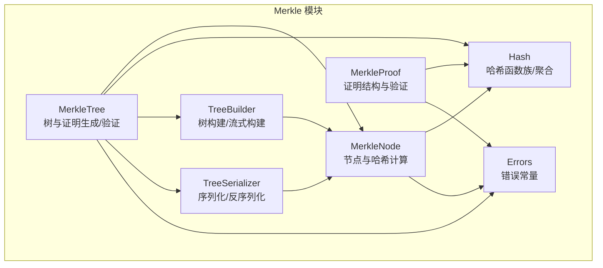
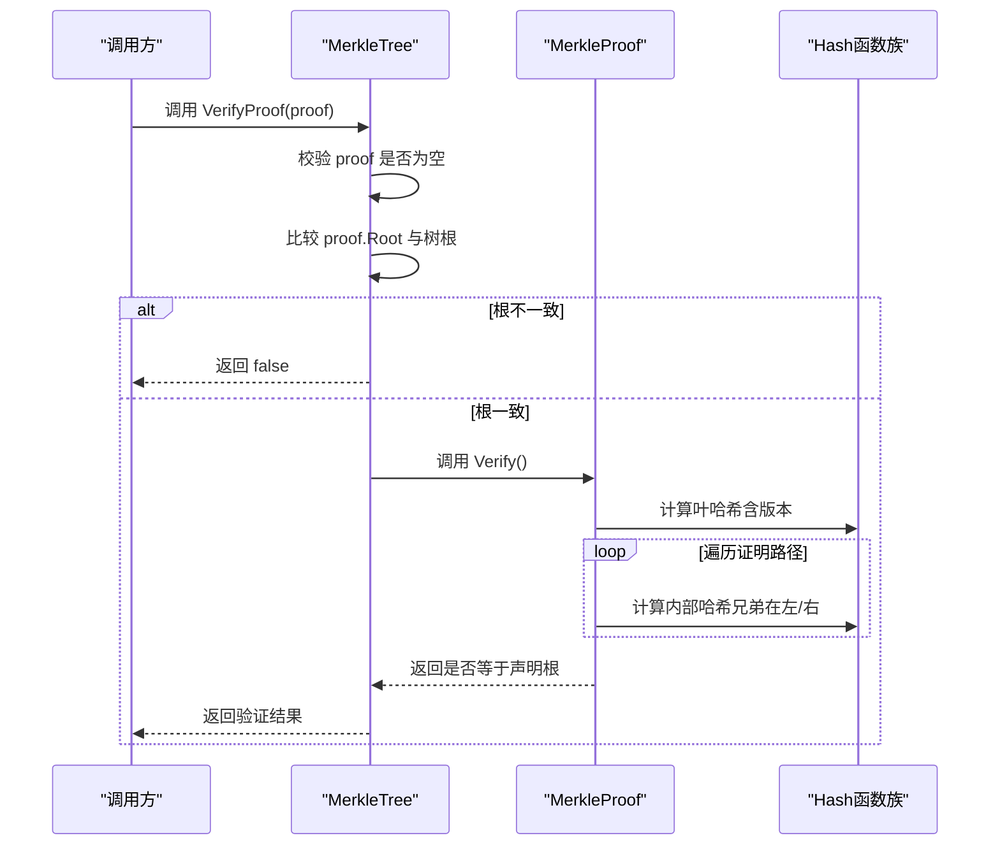
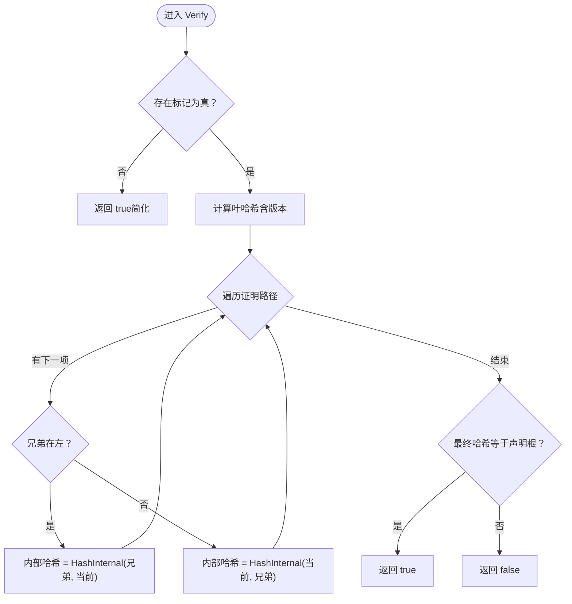
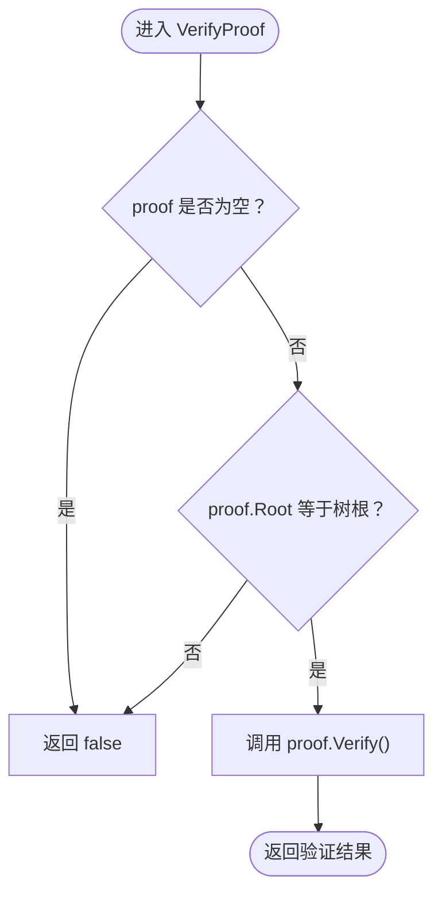
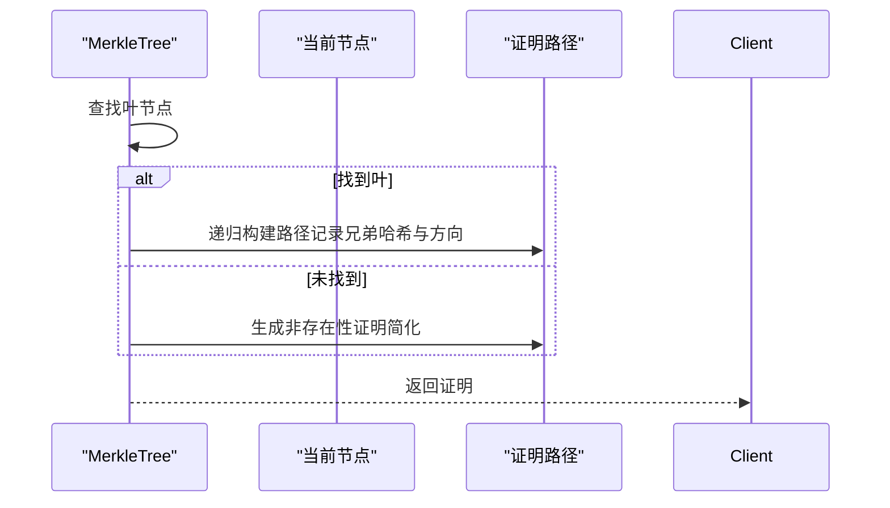
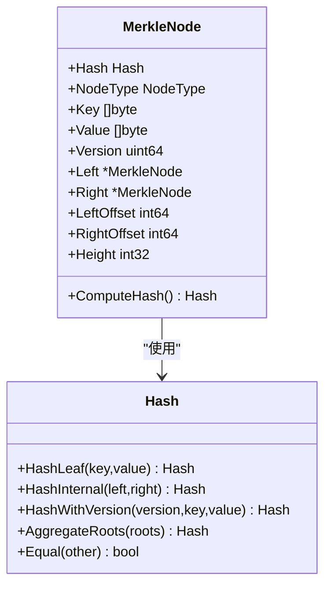
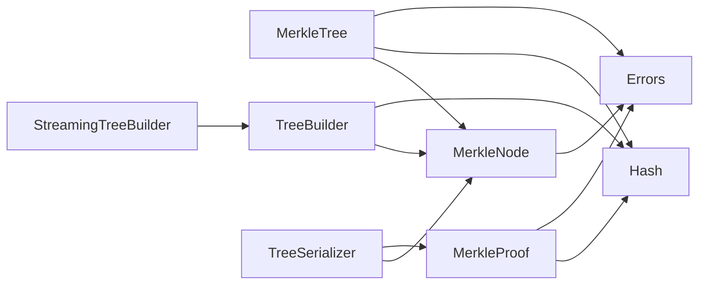

# 证明验证

<cite>
**本文引用的文件**
- [node.go](file://leveldb/merkle/node.go)
- [tree.go](file://leveldb/merkle/tree.go)
- [hash.go](file://leveldb/merkle/hash.go)
- [errors.go](file://leveldb/merkle/errors.go)
- [merkle_test.go](file://leveldb/merkle/merkle_test.go)
- [tree_builder.go](file://leveldb/merkle/tree_builder.go)
- [tree_serializer.go](file://leveldb/merkle/tree_serializer.go)
</cite>

## 目录
1. [引言](#引言)
2. [项目结构](#项目结构)
3. [核心组件](#核心组件)
4. [架构总览](#架构总览)
5. [详细组件分析](#详细组件分析)
6. [依赖关系分析](#依赖关系分析)
7. [性能考量](#性能考量)
8. [故障排查指南](#故障排查指南)
9. [结论](#结论)
10. [附录](#附录)

## 引言
本文件面向 avccDB 的 Merkle 证明验证机制，系统化阐述如何从叶节点哈希出发，沿证明路径逐层向上计算内部哈希，最终与声明的根哈希进行比对，完成数据完整性验证。同时，解释 MerkleTree.VerifyProof 如何作为额外的验证层，确保证明的根哈希与当前 Merkle 树的根一致。文档提供具体验证流程示例、边界情况与潜在失败原因，并给出可操作的排查建议。

## 项目结构
围绕 Merkle 证明验证的核心代码位于 leveldb/merkle 目录：
- MerkleNode：树节点定义与哈希计算
- MerkleProof：证明结构与验证
- MerkleTree：完整树与证明生成、验证
- Hash：哈希函数族与聚合
- 错误常量：统一错误类型
- 构建器与序列化：树构建、流式构建、序列化与反序列化
- 测试：覆盖证明生成与验证的基准与用例

图表来源
- [node.go](file://leveldb/merkle/node.go#L1-L170)
- [tree.go](file://leveldb/merkle/tree.go#L1-L120)
- [hash.go](file://leveldb/merkle/hash.go#L1-L120)
- [tree_builder.go](file://leveldb/merkle/tree_builder.go#L1-L120)
- [tree_serializer.go](file://leveldb/merkle/tree_serializer.go#L1-L120)
- [errors.go](file://leveldb/merkle/errors.go#L1-L32)

章节来源
- [node.go](file://leveldb/merkle/node.go#L1-L170)
- [tree.go](file://leveldb/merkle/tree.go#L1-L120)
- [hash.go](file://leveldb/merkle/hash.go#L1-L120)
- [tree_builder.go](file://leveldb/merkle/tree_builder.go#L1-L120)
- [tree_serializer.go](file://leveldb/merkle/tree_serializer.go#L1-L120)
- [errors.go](file://leveldb/merkle/errors.go#L1-L32)

## 核心组件
- MerkleNode：包含节点类型、键值、版本、左右子节点或偏移、高度等字段；提供叶子/内部节点判断与哈希计算。
- MerkleProof：包含被证明的键、值、版本、证明路径（兄弟节点哈希、方向、高度）、声明根哈希以及存在性标记。
- MerkleTree：维护根节点、键到叶映射、统计信息；提供证明生成、存在性/非存在性证明、与树根一致性校验。
- Hash：定义哈希类型与哈希函数族（叶子、内部、带版本、聚合），以及哈希相等比较。
- TreeBuilder/StreamingTreeBuilder：自排序键值对构建平衡 Merkle 树，支持内存受限的流式构建。
- TreeSerializer：树的二进制序列化与反序列化，支持缓存与偏移记录。

章节来源
- [node.go](file://leveldb/merkle/node.go#L1-L170)
- [node.go](file://leveldb/merkle/node.go#L98-L152)
- [tree.go](file://leveldb/merkle/tree.go#L1-L120)
- [hash.go](file://leveldb/merkle/hash.go#L1-L120)
- [tree_builder.go](file://leveldb/merkle/tree_builder.go#L1-L120)
- [tree_serializer.go](file://leveldb/merkle/tree_serializer.go#L1-L120)

## 架构总览
Merkle 证明验证由两层构成：
- 层内验证：MerkleProof.Verify 从叶哈希出发，按路径逐层向上计算内部哈希，最终与声明根哈希比对。
- 层间验证：MerkleTree.VerifyProof 先检查证明根与树根一致，再委托 MerkleProof.Verify 完成层内验证。

图表来源
- [tree.go](file://leveldb/merkle/tree.go#L213-L225)
- [node.go](file://leveldb/merkle/node.go#L122-L152)
- [hash.go](file://leveldb/merkle/hash.go#L68-L105)

章节来源
- [tree.go](file://leveldb/merkle/tree.go#L213-L225)
- [node.go](file://leveldb/merkle/node.go#L122-L152)
- [hash.go](file://leveldb/merkle/hash.go#L68-L105)

## 详细组件分析

### MerkleProof.Verify：从叶到根的逐层哈希
- 输入：证明对象包含键、值、版本、存在性标记、声明根哈希、证明路径（兄弟节点哈希、方向、高度）。
- 算法要点：
  - 若不存在标记为 false，当前实现返回 true（简化处理，完整实现需通过相邻键证明缺失）。
  - 叶哈希计算：若版本大于 0 使用带版本的叶哈希，否则使用普通叶哈希。
  - 逐层上推：遍历路径，依据兄弟节点方向构造内部哈希，先写兄弟后写当前，保持哈希输入顺序一致。
  - 最终比对：将最终计算得到的哈希与声明根哈希相等比较。
- 复杂度：时间 O(h)，空间 O(1)，h 为树高。

图表来源
- [node.go](file://leveldb/merkle/node.go#L122-L152)
- [hash.go](file://leveldb/merkle/hash.go#L68-L105)

章节来源
- [node.go](file://leveldb/merkle/node.go#L122-L152)
- [hash.go](file://leveldb/merkle/hash.go#L68-L105)

### MerkleTree.VerifyProof：树根一致性与层内验证
- 输入：证明对象。
- 算法要点：
  - 非空校验：proof 为空直接返回 false。
  - 根一致性：比较 proof.Root 与树根，不一致立即返回 false。
  - 委托验证：根一致时调用 proof.Verify() 完成层内验证。
- 作用：确保证明来自当前树状态，避免跨版本或跨树的证明被误用。

图表来源
- [tree.go](file://leveldb/merkle/tree.go#L213-L225)

章节来源
- [tree.go](file://leveldb/merkle/tree.go#L213-L225)

### MerkleTree.GenerateProof：证明生成与路径构建
- 存在性证明：定位叶节点，递归构建从叶到根的路径，每一步记录对应兄弟节点的哈希、方向与高度。
- 非存在性证明：当前实现返回包含声明根与空值的存在性标记为假的证明（完整实现应通过相邻键证明缺失区间）。
- 关键辅助：findLeftmostKey/findRightmostKey 用于确定目标键在左右子树的归属。

图表来源
- [tree.go](file://leveldb/merkle/tree.go#L85-L166)
- [tree.go](file://leveldb/merkle/tree.go#L168-L192)

章节来源
- [tree.go](file://leveldb/merkle/tree.go#L85-L166)
- [tree.go](file://leveldb/merkle/tree.go#L168-L192)

### MerkleNode 与哈希计算：叶/内部/带版本
- 叶哈希：对格式化的数据（如标记、键、值）进行 SHA-256。
- 内部哈希：对格式化的数据（如标记、左子哈希、右子哈希）进行 SHA-256。
- 带版本叶哈希：在叶哈希基础上加入版本号，确保不同版本的数据产生不同哈希。
- 节点哈希：叶子节点直接计算，内部节点基于左右子节点哈希计算。

图表来源
- [node.go](file://leveldb/merkle/node.go#L21-L96)
- [hash.go](file://leveldb/merkle/hash.go#L68-L152)

章节来源
- [node.go](file://leveldb/merkle/node.go#L21-L96)
- [hash.go](file://leveldb/merkle/hash.go#L68-L152)

### 树构建与序列化：构建平衡树与持久化
- TreeBuilder：自排序键值对构建平衡 Merkle 树，支持去重与版本优先策略。
- StreamingTreeBuilder：内存受限的流式构建，分批构建子树并合并。
- TreeSerializer/TreeDeserializer：树的二进制序列化与反序列化，支持偏移记录与缓存。

章节来源
- [tree_builder.go](file://leveldb/merkle/tree_builder.go#L1-L120)
- [tree_builder.go](file://leveldb/merkle/tree_builder.go#L120-L220)
- [tree_serializer.go](file://leveldb/merkle/tree_serializer.go#L1-L120)
- [tree_serializer.go](file://leveldb/merkle/tree_serializer.go#L120-L220)

## 依赖关系分析
- MerkleTree 依赖 MerkleNode 与 Hash，负责证明生成与根一致性校验。
- MerkleProof 依赖 Hash 进行叶/内部哈希计算与最终比较。
- TreeBuilder/StreamingTreeBuilder 依赖 MerkleNode 与 Hash 构建树。
- TreeSerializer 依赖 MerkleNode/MerkleProof 进行序列化与反序列化。
- 错误常量统一了空树、键不存在、无效哈希等场景。

图表来源
- [tree.go](file://leveldb/merkle/tree.go#L1-L120)
- [node.go](file://leveldb/merkle/node.go#L1-L170)
- [hash.go](file://leveldb/merkle/hash.go#L1-L120)
- [tree_builder.go](file://leveldb/merkle/tree_builder.go#L1-L120)
- [tree_serializer.go](file://leveldb/merkle/tree_serializer.go#L1-L120)
- [errors.go](file://leveldb/merkle/errors.go#L1-L32)

章节来源
- [tree.go](file://leveldb/merkle/tree.go#L1-L120)
- [node.go](file://leveldb/merkle/node.go#L1-L170)
- [hash.go](file://leveldb/merkle/hash.go#L1-L120)
- [tree_builder.go](file://leveldb/merkle/tree_builder.go#L1-L120)
- [tree_serializer.go](file://leveldb/merkle/tree_serializer.go#L1-L120)
- [errors.go](file://leveldb/merkle/errors.go#L1-L32)

## 性能考量
- 证明验证：O(h) 时间复杂度，h 为树高；空间 O(1)。验证路径长度与树平衡度相关。
- 证明生成：递归遍历树，O(h)；路径长度取决于树高。
- 树构建：TreeBuilder 自底向上构建平衡树，时间 O(n log n) 或更优；StreamingTreeBuilder 支持内存受限的分批构建。
- 序列化：后序遍历写入，O(N)；反序列化按偏移加载，支持缓存提升性能。

[本节为通用性能讨论，无需特定文件来源]

## 故障排查指南
常见失败原因与排查步骤：
- 证明为空：VerifyProof 直接返回 false。确认调用方传入的证明对象非空。
- 根不一致：VerifyProof 在比较声明根与树根时失败。检查证明来源是否对应当前树状态，或是否存在跨层聚合导致的根差异。
- 版本不匹配：叶哈希包含版本号，若版本错误会导致最终根不一致。核对证明中的版本与数据版本。
- 路径方向错误：兄弟节点方向与实际位置不符会破坏哈希链。检查证明路径中 IsLeft/IsRight 的设置。
- 非存在性证明：当前实现为简化版，完整实现需通过相邻键证明缺失区间。若业务要求严格非存在性证明，请使用完整实现。
- 数据损坏：序列化/反序列化过程中出现损坏会触发错误。检查文件头、版本号与数据长度。
- 键不存在：生成证明时若键不存在，将生成非存在性证明。确认目标键确实不存在或使用正确的键。

章节来源
- [tree.go](file://leveldb/merkle/tree.go#L213-L225)
- [node.go](file://leveldb/merkle/node.go#L122-L152)
- [hash.go](file://leveldb/merkle/hash.go#L68-L105)
- [errors.go](file://leveldb/merkle/errors.go#L1-L32)
- [tree_serializer.go](file://leveldb/merkle/tree_serializer.go#L1-L120)

## 结论
avccDB 的 Merkle 证明验证采用“树根一致性 + 层内哈希链”的双层保障机制。MerkleTree.VerifyProof 先确保证明根与树根一致，再委托 MerkleProof.Verify 完成从叶到根的逐层哈希验证。该设计兼顾安全性与效率，适合在分布式存储与数据库中用于数据完整性证明与跨层聚合场景。对于非存在性证明与跨层聚合，建议结合业务需求完善实现细节。

[本节为总结性内容，无需特定文件来源]

## 附录

### 验证流程示例（概念性）
- 准备：获取目标键的证明对象（包含键、值、版本、存在性标记、声明根哈希、证明路径）。
- 步骤：
  1) 若存在性标记为假，按简化规则返回（完整实现需相邻键证明缺失区间）。
  2) 计算叶哈希（含版本）。
  3) 沿证明路径逐层向上：若兄弟在左，则内部哈希为 HashInternal(兄弟, 当前)；否则为 HashInternal(当前, 兄弟)。
  4) 将最终哈希与声明根哈希比较，相等则验证通过，否则失败。
- 边界：版本变化、兄弟方向错误、路径截断、根不一致均会导致失败。

[本节为概念性流程说明，无需特定文件来源]

### 测试参考
- 证明生成与验证基准：覆盖大规模数据下的生成与验证性能。
- 证明验证用例：验证存在性证明的生成与验证流程。

章节来源
- [merkle_test.go](file://leveldb/merkle/merkle_test.go#L263-L316)
- [merkle_test.go](file://leveldb/merkle/merkle_test.go#L108-L151)