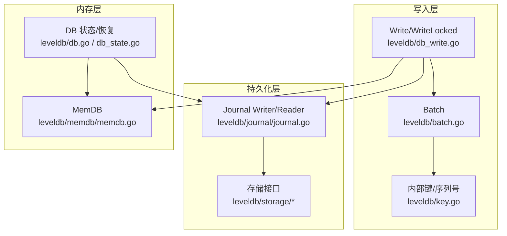
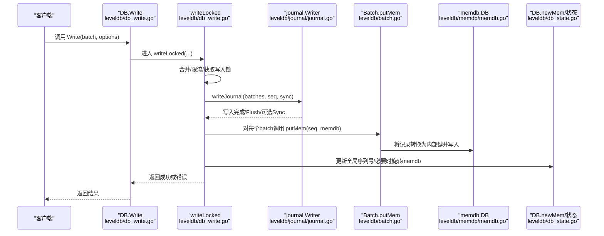
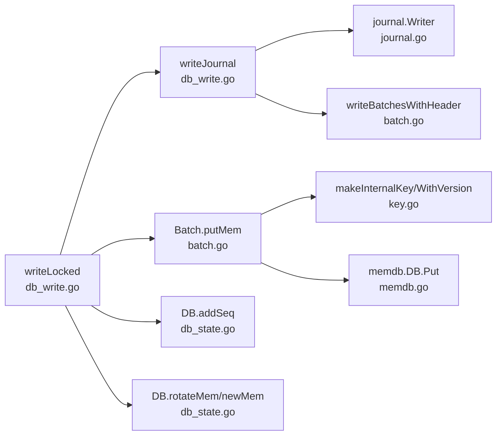

# 原子性保证机制

<cite>
**本文引用的文件列表**
- [leveldb/db_write.go](file://leveldb/db_write.go)
- [leveldb/journal/journal.go](file://leveldb/journal/journal.go)
- [leveldb/memdb/memdb.go](file://leveldb/memdb/memdb.go)
- [leveldb/batch.go](file://leveldb/batch.go)
- [leveldb/db.go](file://leveldb/db.go)
- [leveldb/db_state.go](file://leveldb/db_state.go)
- [leveldb/key.go](file://leveldb/key.go)
</cite>

## 目录
1. [引言](#引言)
2. [项目结构](#项目结构)
3. [核心组件](#核心组件)
4. [架构总览](#架构总览)
5. [详细组件分析](#详细组件分析)
6. [依赖关系分析](#依赖关系分析)
7. [性能考量](#性能考量)
8. [故障排查指南](#故障排查指南)
9. [结论](#结论)

## 引言
本文件聚焦于 avccDB 的批量写入原子性保证机制，系统性解析 Write 方法如何通过 writeLocked 协调写入锁、预写日志（WAL，journal）持久化与内存数据库（memdb）更新，从而确保单次批量写入的原子性。文档还阐明序列号（seq）在维护操作顺序一致性中的作用，以及在写入过程中发生故障时的恢复机制；并结合代码路径给出从 Write 调用到数据落盘的完整原子性保障流程，包括错误处理与资源清理策略。

## 项目结构
围绕原子性主题，本次分析涉及以下关键模块：
- 写入入口与协调：leveldb/db_write.go
- 预写日志（WAL）实现：leveldb/journal/journal.go
- 内存数据库（memdb）实现：leveldb/memdb/memdb.go
- 批量写入与内部键构造：leveldb/batch.go
- 序列号与内部键格式：leveldb/key.go
- 数据库状态与恢复：leveldb/db.go、leveldb/db_state.go

图表来源
- [leveldb/db_write.go](file://leveldb/db_write.go#L1-L330)
- [leveldb/journal/journal.go](file://leveldb/journal/journal.go#L1-L120)
- [leveldb/memdb/memdb.go](file://leveldb/memdb/memdb.go#L1-L120)
- [leveldb/batch.go](file://leveldb/batch.go#L240-L320)
- [leveldb/db.go](file://leveldb/db.go#L499-L666)
- [leveldb/db_state.go](file://leveldb/db_state.go#L1-L120)

章节来源
- [leveldb/db_write.go](file://leveldb/db_write.go#L1-L330)
- [leveldb/journal/journal.go](file://leveldb/journal/journal.go#L1-L120)
- [leveldb/memdb/memdb.go](file://leveldb/memdb/memdb.go#L1-L120)
- [leveldb/batch.go](file://leveldb/batch.go#L240-L320)
- [leveldb/db.go](file://leveldb/db.go#L499-L666)
- [leveldb/db_state.go](file://leveldb/db_state.go#L1-L120)

## 核心组件
- 写入协调器 writeLocked：负责合并写入、获取写入锁、写入 WAL、应用到 memdb、更新序列号、必要时旋转 memdb。
- 预写日志 writeJournal：将批量记录写入 journal 并可选同步刷盘。
- 批量应用 putMem：按批次将记录转换为内部键并写入 memdb。
- 序列号 seq：全局单调递增，用于保证操作顺序与内部键排序。
- 恢复流程 recoverJournal：启动时从 journal 重放，重建 memdb 并提交新 journal。

章节来源
- [leveldb/db_write.go](file://leveldb/db_write.go#L154-L266)
- [leveldb/batch.go](file://leveldb/batch.go#L244-L257)
- [leveldb/db_state.go](file://leveldb/db_state.go#L51-L63)
- [leveldb/db.go](file://leveldb/db.go#L499-L666)

## 架构总览
下图展示一次批量写入从入口到落盘的端到端流程，强调原子性保障点。

图表来源
- [leveldb/db_write.go](file://leveldb/db_write.go#L154-L266)
- [leveldb/journal/journal.go](file://leveldb/journal/journal.go#L470-L536)
- [leveldb/batch.go](file://leveldb/batch.go#L244-L257)
- [leveldb/memdb/memdb.go](file://leveldb/memdb/memdb.go#L273-L315)
- [leveldb/db_state.go](file://leveldb/db_state.go#L120-L159)

## 详细组件分析

### writeLocked：批量写入原子性的核心协调者
- 合并与限流：根据可用 memdb 空间计算合并上限，尝试从合并队列收集多个小写入合并为一次大写入，减少 WAL 写入次数。
- 获取写入锁：使用互斥通道实现单线程写入，避免并发写入竞争。
- 写入 WAL：调用 writeJournal 将合并后的批量记录写入当前 journal，并在需要时执行 Flush/Sync。
- 应用到 memdb：对每个 batch 调用 putMem，将记录转换为内部键后写入有效 memdb。
- 更新序列号：累加所有记录数，原子地增加全局序列号。
- 旋转 memdb：当写入达到阈值时触发旋转，冻结旧 memdb 并创建新的 journal 文件。
- 错误处理与解锁：任一阶段失败均通过 unlockWrite 释放合并/锁资源，确保不会死锁。

章节来源
- [leveldb/db_write.go](file://leveldb/db_write.go#L154-L266)

### writeJournal：批量记录写入 WAL 的实现
- Next 获取当前 journal 写入器，writeBatchesWithHeader 写入批头（包含起始序列号与记录总数），随后 Flush。
- 若 WriteOptions 指定同步，则调用 journalWriter.Sync 以确保持久化到磁盘。
- journal.Writer 使用固定块大小与分块校验，支持多块写入与 CRC 校验，提升容错能力。

章节来源
- [leveldb/db_write.go](file://leveldb/db_write.go#L18-L33)
- [leveldb/journal/journal.go](file://leveldb/journal/journal.go#L370-L468)
- [leveldb/journal/journal.go](file://leveldb/journal/journal.go#L470-L536)
- [leveldb/batch.go](file://leveldb/batch.go#L402-L412)

### putMem：将记录应用到内存表
- 遍历 batch 中的每条记录，调用 makeInternalKey 或 makeInternalKeyWithVersion 构造内部键（包含用户键、版本号、序列号、类型）。
- 将内部键与值写入 memdb，memdb 采用并发安全的读写锁保护，保证写入过程的正确性。

章节来源
- [leveldb/batch.go](file://leveldb/batch.go#L244-L257)
- [leveldb/key.go](file://leveldb/key.go#L77-L104)
- [leveldb/memdb/memdb.go](file://leveldb/memdb/memdb.go#L273-L315)

### 序列号（seq）与内部键：顺序一致性的基石
- 全局单调递增：每次批量写入都会累加记录数量，原子地增加全局序列号，确保后续内部键排序的正确性。
- 内部键格式：非版本键为 ukey + 8 字节 packed(seq<<8|type)，版本键为 ukey + 8 字节 version + 8 字节 packed(seq<<8|type)。
- 排序语义：比较器按用户键相等时优先比较版本（降序），再比较序列号（降序），确保查询与迭代行为符合预期。

章节来源
- [leveldb/db_state.go](file://leveldb/db_state.go#L51-L63)
- [leveldb/key.go](file://leveldb/key.go#L77-L104)
- [leveldb/key.go](file://leveldb/key.go#L119-L132)
- [leveldb/comparer.go](file://leveldb/comparer.go#L53-L101)

### 故障恢复：从 journal 重放到 memdb
- 启动时 recoverJournal 会列出并按文件号排序所有 journal，逐个打开并使用 journal.Reader 读取。
- 严格模式下遇到损坏会中止；非严格模式下跳过损坏块并继续重放。
- 将重放得到的记录按期望序列号写入 memdb，最后创建新的 journal 并提交会话记录，确保后续写入能追加到新的 journal。

章节来源
- [leveldb/db.go](file://leveldb/db.go#L499-L666)
- [leveldb/journal/journal.go](file://leveldb/journal/journal.go#L124-L214)
- [leveldb/journal/journal.go](file://leveldb/journal/journal.go#L244-L314)

### 错误处理与资源清理
- writeLocked 在任一步骤失败时通过 unlockWrite 释放合并信号与写入锁，避免死锁。
- recoverJournal 在重放过程中遇到错误会关闭文件句柄并返回错误，确保不会继续使用损坏的文件。
- journal.Writer/Reader 提供严格的错误类型与丢弃回调，便于上层判断是否跳过或中止。

章节来源
- [leveldb/db_write.go](file://leveldb/db_write.go#L141-L153)
- [leveldb/db.go](file://leveldb/db.go#L599-L666)
- [leveldb/journal/journal.go](file://leveldb/journal/journal.go#L124-L174)

## 依赖关系分析
- writeLocked 依赖：
  - writeJournal：负责 WAL 写入与同步。
  - Batch.putMem：负责将记录应用到 memdb。
  - DB.addSeq：负责全局序列号原子递增。
  - DB.rotateMem/newMem：负责 memdb 切换与 journal 文件管理。
- writeJournal 依赖：
  - journal.Writer.Next/Flush/Sync：负责块级写入与持久化。
  - writeBatchesWithHeader：负责批头编码（起始序列号与记录数）。
- putMem 依赖：
  - makeInternalKey/makeInternalKeyWithVersion：负责内部键构造。
  - memdb.DB.Put：负责写入内存表。

图表来源
- [leveldb/db_write.go](file://leveldb/db_write.go#L154-L266)
- [leveldb/batch.go](file://leveldb/batch.go#L244-L257)
- [leveldb/db_state.go](file://leveldb/db_state.go#L51-L63)
- [leveldb/journal/journal.go](file://leveldb/journal/journal.go#L370-L468)
- [leveldb/key.go](file://leveldb/key.go#L77-L104)
- [leveldb/memdb/memdb.go](file://leveldb/memdb/memdb.go#L273-L315)

## 性能考量
- 合并与限流：通过合并多个小写入减少 WAL 写入次数，降低磁盘写放大。
- 写入锁：单线程写入避免了 memdb 与 journal 的并发竞争，简化了原子性保障。
- Flush/Sync 策略：仅在需要强一致时才进行 Sync，平衡可靠性与性能。
- memdb 旋转：当写入压力过大或达到阈值时旋转 memdb，避免 memdb 过度增长影响读写性能。

章节来源
- [leveldb/db_write.go](file://leveldb/db_write.go#L154-L266)
- [leveldb/db_state.go](file://leveldb/db_state.go#L120-L159)

## 故障排查指南
- 写入失败但 WAL 已写入：检查 writeJournal 是否返回错误，确认 Flush/Sync 是否成功；若失败，writeLocked 会通过 unlockWrite 释放锁与合并信号。
- 重启后数据不一致：确认 recoverJournal 是否正常重放；严格模式下损坏会中止，非严格模式下会跳过并继续；必要时使用 Recover 修复。
- 内存表异常：检查 Batch.putMem 是否抛出错误；确认内部键构造是否正确（版本号与序列号）。
- 存储层问题：journal 文件无法打开/删除时，fileStorage 会返回相应错误，需检查权限与磁盘空间。

章节来源
- [leveldb/db_write.go](file://leveldb/db_write.go#L141-L153)
- [leveldb/db.go](file://leveldb/db.go#L499-L666)
- [leveldb/storage/file_storage.go](file://leveldb/storage/file_storage.go#L465-L585)

## 结论
avccDB 的批量写入通过 writeLocked 将“写入 WAL”和“应用到 memdb”紧密耦合在同一原子窗口内，配合全局序列号与内部键格式，确保了操作顺序一致性与可恢复性。writeJournal 采用块级分块与 CRC 校验，journal.Reader 支持严格/非严格模式，使恢复过程具备良好的容错能力。writeLocked 在任一步骤失败时均通过 unlockWrite 进行资源清理，避免死锁。整体设计在保证强原子性的同时兼顾了性能与可维护性。