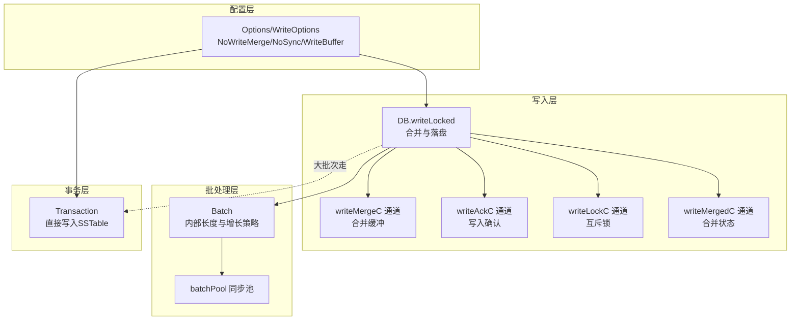
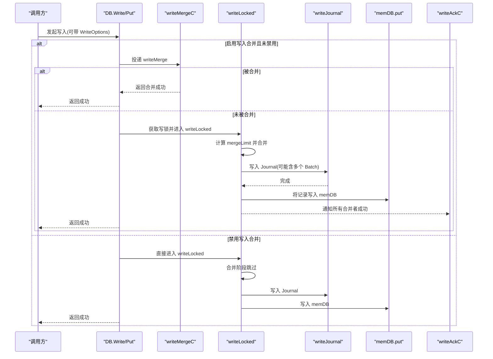
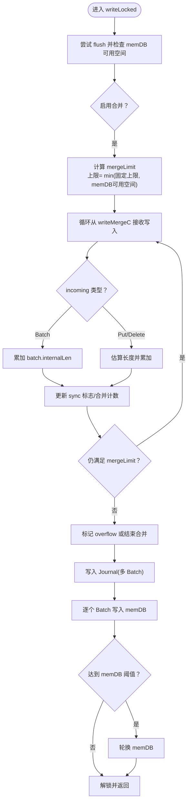
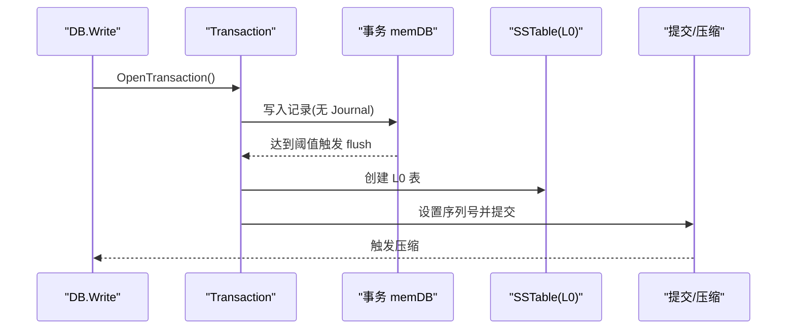
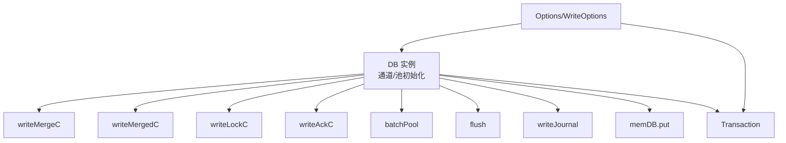

# 性能优化策略

<cite>
**本文引用的文件**
- [leveldb/db_write.go](file://leveldb/db_write.go)
- [leveldb/db_transaction.go](file://leveldb/db_transaction.go)
- [leveldb/batch.go](file://leveldb/batch.go)
- [leveldb/opt/options.go](file://leveldb/opt/options.go)
- [leveldb/db.go](file://leveldb/db.go)
- [leveldb/bench_test.go](file://leveldb/bench_test.go)
</cite>

## 目录
1. [引言](#引言)
2. [项目结构](#项目结构)
3. [核心组件](#核心组件)
4. [架构总览](#架构总览)
5. [详细组件分析](#详细组件分析)
6. [依赖关系分析](#依赖关系分析)
7. [性能考量](#性能考量)
8. [故障排查指南](#故障排查指南)
9. [结论](#结论)
10. [附录](#附录)

## 引言
本文件系统性阐述 avccDB 批量写入的性能优化策略，重点围绕“写入合并（write merge）”机制如何通过 writeMergeC 通道将并发的小批量写入合并为单个大批次，从而降低磁盘 I/O 和锁竞争；详解 writeLocked 中 mergeLimit 的计算逻辑与内存预分配策略；解释 BatchConfig 中 GrowLimit 对内存增长行为的控制；介绍大批次事务的优化处理路径（通过 Transaction 直接写入 SSTable）；并结合实际场景说明如何配置 WriteOptions 以优化吞吐量与延迟，包括 sync 选项的影响与 NoWriteMerge 的使用时机。

## 项目结构
与批量写入性能优化相关的核心模块：
- 写入主流程与合并：leveldb/db_write.go
- 批处理数据结构与内存增长：leveldb/batch.go
- 事务写入路径（大批次优化）：leveldb/db_transaction.go
- 配置项与选项获取：leveldb/opt/options.go
- 数据库实例与通道初始化：leveldb/db.go
- 基准测试与吞吐量对比：leveldb/bench_test.go

图表来源
- [leveldb/db_write.go](file://leveldb/db_write.go#L133-L266)
- [leveldb/batch.go](file://leveldb/batch.go#L63-L136)
- [leveldb/db_transaction.go](file://leveldb/db_transaction.go#L118-L180)
- [leveldb/opt/options.go](file://leveldb/opt/options.go#L362-L412)

章节来源
- [leveldb/db_write.go](file://leveldb/db_write.go#L133-L266)
- [leveldb/batch.go](file://leveldb/batch.go#L63-L136)
- [leveldb/db_transaction.go](file://leveldb/db_transaction.go#L118-L180)
- [leveldb/opt/options.go](file://leveldb/opt/options.go#L362-L412)
- [leveldb/db.go](file://leveldb/db.go#L33-L98)

## 核心组件
- 写入合并通道 writeMergeC：用于收集并发小写入，形成大批次后再统一提交。
- 合并状态通道 writeMergedC：通知发送方是否被成功合并。
- 确认通道 writeAckC：向合并的写入请求返回错误或成功。
- 互斥通道 writeLockC：保证同一时刻只有一个写入路径在执行。
- Batch 内部长度与增长策略：通过 internalLen 计算合并上限，并通过 growLimit 控制内存增长步长。
- Transaction 大批次优化：当单批写入超过 WriteBuffer 时，直接进入事务路径，跳过 Journal，直接写入 SSTable。

章节来源
- [leveldb/db_write.go](file://leveldb/db_write.go#L133-L266)
- [leveldb/batch.go](file://leveldb/batch.go#L63-L136)
- [leveldb/db_transaction.go](file://leveldb/db_transaction.go#L118-L180)
- [leveldb/opt/options.go](file://leveldb/opt/options.go#L362-L412)
- [leveldb/db.go](file://leveldb/db.go#L33-L98)

## 架构总览
写入合并与大批次事务的关键交互如下：

图表来源
- [leveldb/db_write.go](file://leveldb/db_write.go#L268-L375)
- [leveldb/db_write.go](file://leveldb/db_write.go#L155-L266)

## 详细组件分析

### 写入合并机制与 writeMergeC 通道
- 并发写入通过 writeMergeC 通道汇聚，每个写入封装为 writeMerge 结构体，包含同步标志、Batch 指针或键值对信息。
- writeLocked 在进入临界区前先尝试 flush，避免 memDB 过载导致写入阻塞。
- 合并上限 mergeLimit 的计算规则：
  - 若当前 batch 的 internalLen 超过 128KiB，则上限为约 1MiB 减去当前 batch 的 internalLen；
  - 否则上限固定为 128KiB；
  - 实际可用合并空间还受 memDB 可用容量限制（mdbFree - 当前 batch 长度），取两者较小值。
- 合并过程中：
  - 若 incoming.batch 非空，按其 internalLen 累计；
  - 若 incoming 是单条 Put/Delete，按键值长度与内部键开销估算长度累加；
  - 合并期间会动态更新 sync 标志（任一 incoming 为 true 则整体需同步）；
  - 成功合并后通过 writeMergedC 通知发送方，随后通过 writeAckC 返回结果。
- 合并完成后，若 batch 的 internalLen 达到 memDB 可用空间阈值，触发 memDB 轮换以避免后续写入阻塞。

图表来源
- [leveldb/db_write.go](file://leveldb/db_write.go#L155-L266)

章节来源
- [leveldb/db_write.go](file://leveldb/db_write.go#L133-L266)

### writeLocked 中 mergeLimit 计算逻辑与内存预分配策略
- mergeLimit 计算逻辑：
  - 大 batch 场景：上限趋近于 1MiB，避免单次合并过大导致内存压力；
  - 小 batch 场景：固定 128KiB，提升合并效率；
  - 最终上限还需不超过 memDB 可用空间，确保不会因合并而溢出。
- 内存预分配策略：
  - Batch 内部长度 internalLen 用于估算合并上限；
  - growLimit 控制每次扩容的“步长”，默认 3000 条目，避免频繁分配；
  - 当累积条目数超过 growLimit 时，扩容步长按当前条目数除以 growLimit 放大，从而在高负载下平滑增长。

章节来源
- [leveldb/db_write.go](file://leveldb/db_write.go#L171-L229)
- [leveldb/batch.go](file://leveldb/batch.go#L63-L136)
- [leveldb/batch.go](file://leveldb/batch.go#L268-L302)

### BatchConfig 中 GrowLimit 参数与内存增长行为
- GrowLimit 作为 BatchConfig 的字段，允许用户自定义每轮增长的条目阈值；
- 默认情况下 Batch.grow 使用内置常量 3000 作为阈值；
- 当累积条目数超过 GrowLimit，扩容大小按当前条目数除以 GrowLimit 放大，从而在高负载下减少分配次数，平衡性能与内存使用。

章节来源
- [leveldb/batch.go](file://leveldb/batch.go#L268-L302)

### 大批次事务优化处理路径（Transaction 直接写入 SSTable）
- 当单批写入的 internalLen 超过 Options.WriteBuffer 且未禁用大批次事务切换时，Write 将自动切换到事务模式：
  - 打开事务，将 Batch 写入事务的 memDB；
  - 事务 flush 时直接创建 L0 表（SSTable），绕过 Journal；
  - 提交时更新版本号并触发表自动压缩。
- 该路径显著减少 Journal 写入与 fsync 开销，适合大批量写入场景。

图表来源
- [leveldb/db_write.go](file://leveldb/db_write.go#L268-L293)
- [leveldb/db_transaction.go](file://leveldb/db_transaction.go#L118-L180)
- [leveldb/db_transaction.go](file://leveldb/db_transaction.go#L194-L252)
- [leveldb/opt/options.go](file://leveldb/opt/options.go#L310-L316)

章节来源
- [leveldb/db_write.go](file://leveldb/db_write.go#L268-L293)
- [leveldb/db_transaction.go](file://leveldb/db_transaction.go#L118-L180)
- [leveldb/db_transaction.go](file://leveldb/db_transaction.go#L194-L252)
- [leveldb/opt/options.go](file://leveldb/opt/options.go#L310-L316)

### WriteOptions 配置与吞吐量/延迟权衡
- NoWriteMerge：禁用写入合并，适合极小写入或严格顺序要求场景，但会增加 I/O 与锁竞争。
- Sync：开启后强制 fsync，提高可靠性但显著降低吞吐量与增加延迟。
- 与全局 Options.NoSync、NoWriteMerge 协同生效：
  - 若 Options.NoSync=true，则 WriteOptions.Sync=false；
  - 若 Options.NoWriteMerge=true 或 WriteOptions.NoWriteMerge=true，则禁用合并。
- 大批次写入建议：
  - 当单批 internalLen 接近或超过 WriteBuffer 时，优先让 Write 自动切换到事务路径；
  - 若业务上允许最终一致性且追求吞吐，可考虑关闭 Sync 并保持合并开启。

章节来源
- [leveldb/db_write.go](file://leveldb/db_write.go#L268-L375)
- [leveldb/opt/options.go](file://leveldb/opt/options.go#L362-L412)
- [leveldb/opt/options.go](file://leveldb/opt/options.go#L622-L641)

## 依赖关系分析
- DB 实例在初始化时创建 writeMergeC、writeMergedC、writeLockC、writeAckC 等通道，并维护 batchPool 与 memPool；
- writeLocked 依赖 flush、writeJournal、memDB.put 等子流程；
- 大批次事务路径依赖 Transaction.flush 与 SSTable 创建；
- 配置项通过 Options/WriteOptions 提供开关与阈值。

图表来源
- [leveldb/db.go](file://leveldb/db.go#L33-L98)
- [leveldb/db_write.go](file://leveldb/db_write.go#L155-L266)
- [leveldb/db_transaction.go](file://leveldb/db_transaction.go#L118-L180)
- [leveldb/opt/options.go](file://leveldb/opt/options.go#L362-L412)

章节来源
- [leveldb/db.go](file://leveldb/db.go#L33-L98)
- [leveldb/db_write.go](file://leveldb/db_write.go#L155-L266)
- [leveldb/db_transaction.go](file://leveldb/db_transaction.go#L118-L180)
- [leveldb/opt/options.go](file://leveldb/opt/options.go#L362-L412)

## 性能考量
- 合并窗口与上限：
  - 合理设置 WriteBuffer 与 WriteOptions.NoWriteMerge，可避免过多小写入进入合并通道；
  - 大批量写入自动走事务路径，减少 Journal 与 fsync。
- 内存增长与分配：
  - 通过 BatchConfig.GrowLimit 控制扩容步长，避免频繁分配；
  - 在高并发场景下，合并后的 Batch 可复用 batchPool，降低 GC 压力。
- 同步策略：
  - Sync=true 显著降低吞吐，仅在强一致需求时开启；
  - NoSync=true 时，WriteOptions.Sync=false 生效，适合高吞吐低延迟场景。
- 基准测试参考：
  - bench_test 中提供了不同批大小与是否启用压缩、同步等场景的基准，可用于评估不同配置下的吞吐与延迟表现。

章节来源
- [leveldb/batch.go](file://leveldb/batch.go#L268-L302)
- [leveldb/bench_test.go](file://leveldb/bench_test.go#L264-L316)
- [leveldb/opt/options.go](file://leveldb/opt/options.go#L362-L412)

## 故障排查指南
- 合并失败或锁等待：
  - 检查 writeMergedC 是否持续阻塞，可能由于合并上限不足或 memDB 可用空间不足；
  - 关注 writeAckC 是否返回错误，定位具体写入失败原因。
- 大批次事务异常：
  - 若事务提交失败，检查事务 flush 与 SSTable 创建过程的日志；
  - 确认未禁用大批次事务切换（DisableLargeBatchTransaction=false）。
- 配置误用：
  - 确认 Options.NoSync 与 WriteOptions.Sync 的组合是否符合预期；
  - 确认 Options.NoWriteMerge 与 WriteOptions.NoWriteMerge 的设置是否导致未合并。

章节来源
- [leveldb/db_write.go](file://leveldb/db_write.go#L141-L152)
- [leveldb/db_transaction.go](file://leveldb/db_transaction.go#L194-L252)
- [leveldb/opt/options.go](file://leveldb/opt/options.go#L362-L412)

## 结论
avccDB 的批量写入性能优化以“写入合并 + 大批次事务”为核心策略：
- 通过 writeMergeC 将并发小写入聚合为大批次，显著降低 Journal 与 fsync 次数；
- writeLocked 的 mergeLimit 计算与 memDB 可用空间联动，避免内存与 I/O 峰值；
- BatchConfig.GrowLimit 平滑控制内存增长，兼顾吞吐与资源占用；
- 大批次事务路径直接写入 SSTable，跳过 Journal，进一步提升吞吐；
- WriteOptions 的 NoWriteMerge 与 Sync 选项提供灵活的权衡手段，结合业务需求选择最佳配置。

## 附录
- 关键实现位置参考：
  - 合并与落盘：[leveldb/db_write.go](file://leveldb/db_write.go#L155-L266)
  - 合并通道与确认：[leveldb/db_write.go](file://leveldb/db_write.go#L133-L152)
  - 批处理增长策略：[leveldb/batch.go](file://leveldb/batch.go#L63-L136)
  - 大批次事务路径：[leveldb/db_write.go](file://leveldb/db_write.go#L268-L293)、[leveldb/db_transaction.go](file://leveldb/db_transaction.go#L118-L180)
  - 配置项获取：[leveldb/opt/options.go](file://leveldb/opt/options.go#L362-L412)
  - 数据库通道初始化：[leveldb/db.go](file://leveldb/db.go#L33-L98)
  - 基准测试：[leveldb/bench_test.go](file://leveldb/bench_test.go#L264-L316)