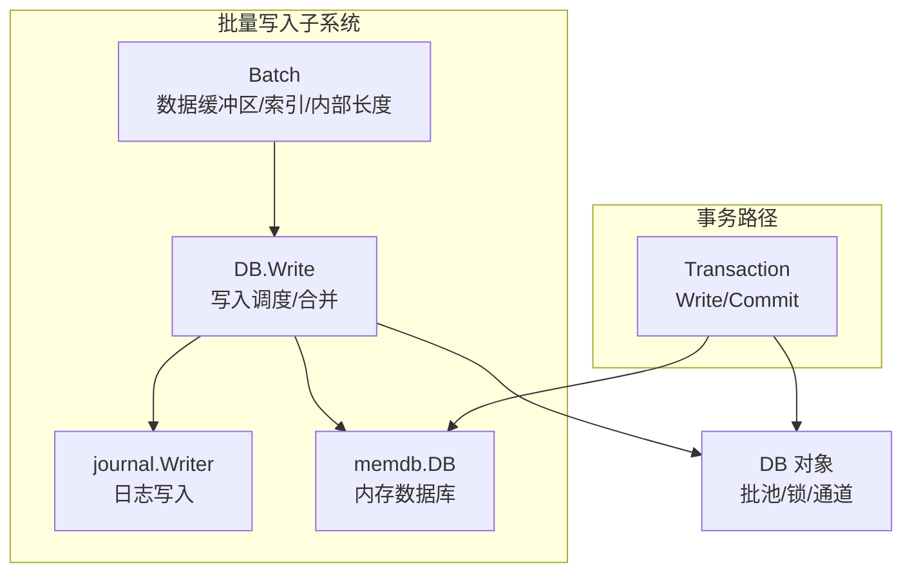
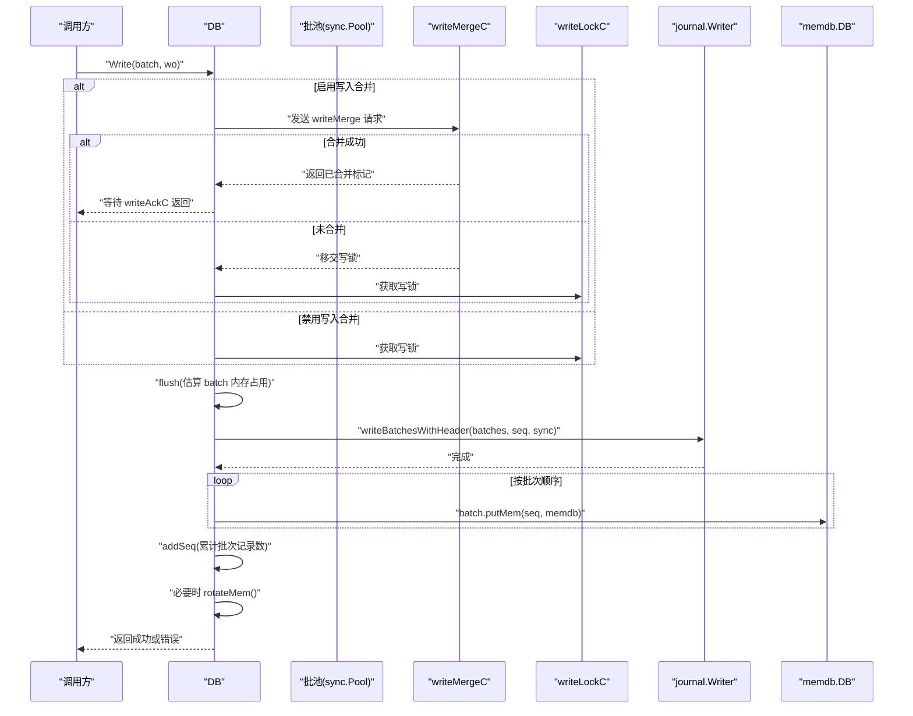
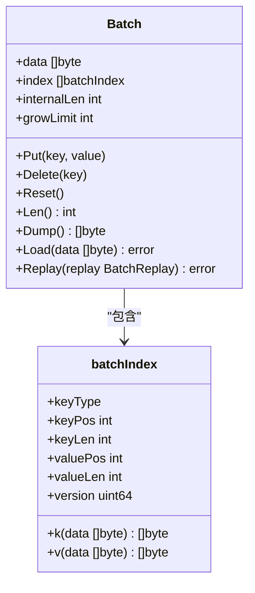
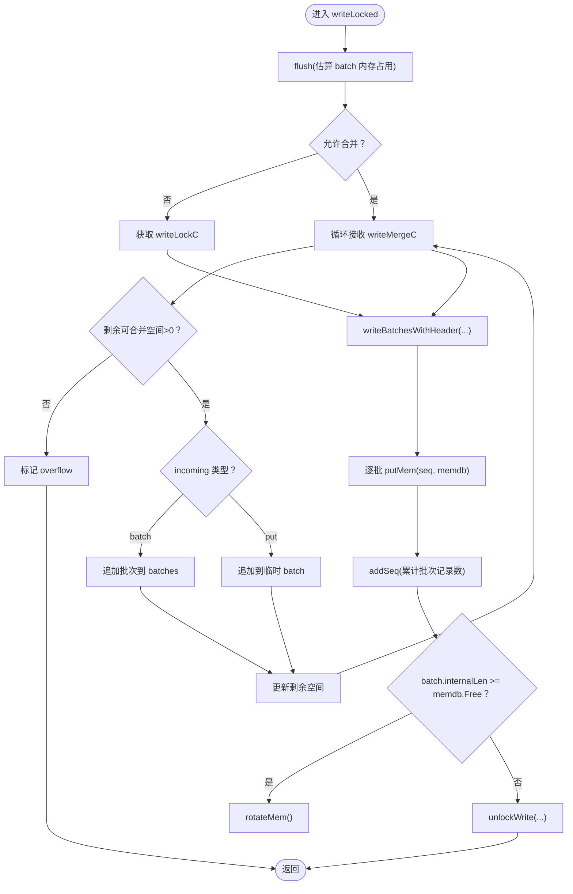
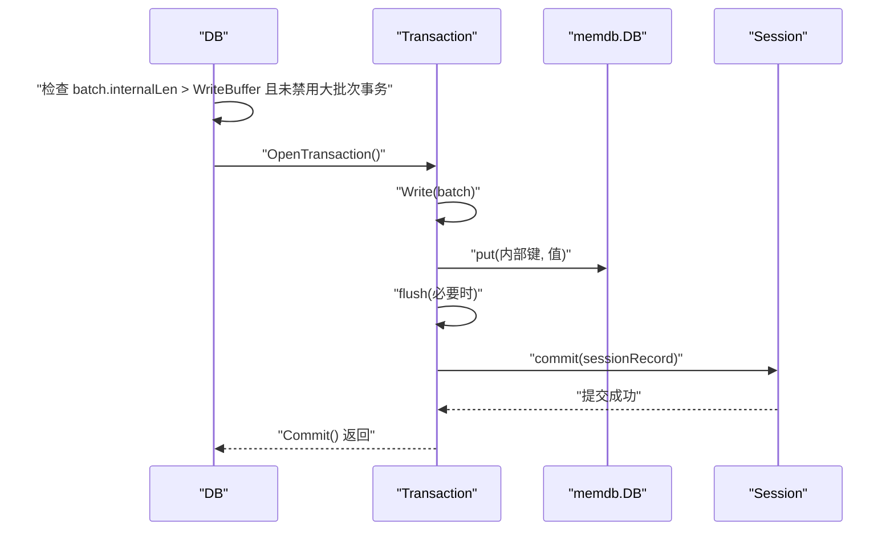
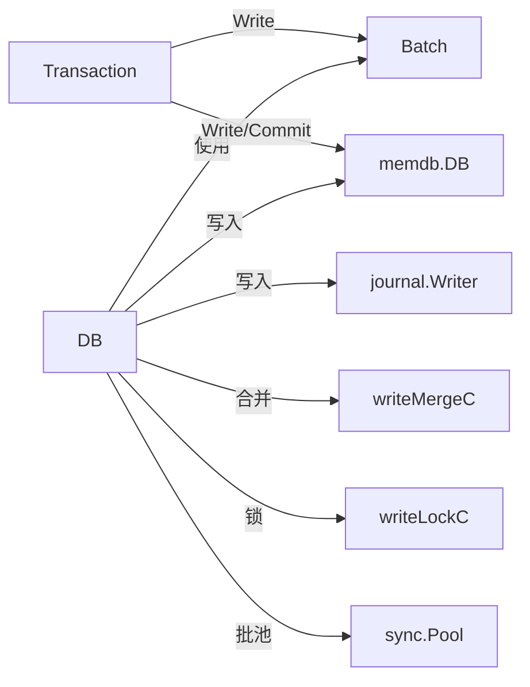

# 批量写入

<cite>
**本文引用的文件列表**
- [batch.go](file://leveldb/batch.go)
- [db_write.go](file://leveldb/db_write.go)
- [db_transaction.go](file://leveldb/db_transaction.go)
- [db.go](file://leveldb/db.go)
- [options.go](file://leveldb/opt/options.go)
- [batch_test.go](file://leveldb/batch_test.go)
</cite>

## 目录
1. [简介](#简介)
2. [项目结构与定位](#项目结构与定位)
3. [核心组件总览](#核心组件总览)
4. [架构概览](#架构概览)
5. [详细组件分析](#详细组件分析)
6. [依赖关系分析](#依赖关系分析)
7. [性能考量与优化策略](#性能考量与优化策略)
8. [故障排查指南](#故障排查指南)
9. [结论](#结论)
10. [附录：使用示例与最佳实践](#附录使用示例与最佳实践)

## 简介
本篇文档围绕 avccDB 的批量写入（Batch）机制展开，系统阐述 Batch 结构设计、内部数据缓冲区与索引组织、Write 方法的批量处理流程、写入合并（write merge）机制、大批次事务优化路径，以及如何通过 WriteOptions 配置写入行为。文档同时提供从基础使用到高级优化的完整知识体系，并以图示方式帮助读者建立对原子性写入与并发控制的理解。

## 项目结构与定位
- 批量写入的核心实现位于 leveldb/batch.go，包含 Batch 结构体、记录编码/解码、内存写入等。
- 写入调度与合并逻辑位于 leveldb/db_write.go，负责将多个 Batch 合并、写入日志、更新序列号、触发内存轮换等。
- 事务路径在 leveldb/db_transaction.go，当 Batch 过大时可绕过日志直接写入表层，提升吞吐。
- 数据库对象定义与批池（sync.Pool）初始化在 leveldb/db.go，其中包含 writeMergeC、writeLockC 等并发控制通道。
- WriteOptions 定义在 leveldb/opt/options.go，用于控制是否启用写入合并与同步策略。

图表来源
- [batch.go](file://leveldb/batch.go#L63-L136)
- [db_write.go](file://leveldb/db_write.go#L133-L266)
- [db_transaction.go](file://leveldb/db_transaction.go#L161-L180)
- [db.go](file://leveldb/db.go#L63-L98)

章节来源
- [batch.go](file://leveldb/batch.go#L63-L136)
- [db_write.go](file://leveldb/db_write.go#L133-L266)
- [db_transaction.go](file://leveldb/db_transaction.go#L161-L180)
- [db.go](file://leveldb/db.go#L63-L98)

## 核心组件总览
- Batch 结构体
  - data：字节缓冲区，按变长编码存储多条记录（键类型、键长度、键、值长度、值），紧凑连续。
  - index：batchIndex 数组，记录每条记录在 data 中的偏移与长度，便于零拷贝访问。
  - internalLen：累计“内部键长度”（含键/值长度与内部键头开销），用于写入合并与内存阈值判断。
  - growLimit：增长阈值，控制缓冲区扩容节奏，避免频繁分配。
- 写入合并（write merge）
  - 通过 writeMergeC 通道收集短小写入请求，合并到一个批次后一次性写入，减少日志写放大与锁竞争。
- 大批次优化
  - 当 Batch 的 internalLen 超过写缓冲阈值且未禁用大批次事务时，DB.Write 将开启事务路径，跳过日志直接写表层。
- 并发控制
  - writeLockC 保护写入临界区；writeMergeC 用于合并；writeMergedC 与 writeAckC 协调合并结果与错误返回。

章节来源
- [batch.go](file://leveldb/batch.go#L63-L136)
- [db_write.go](file://leveldb/db_write.go#L133-L266)
- [db.go](file://leveldb/db.go#L63-L98)

## 架构概览
下面的序列图展示了 DB.Write 的典型调用链，包括写入合并、日志写入、内存写入与序列号更新。

图表来源
- [db_write.go](file://leveldb/db_write.go#L268-L330)
- [db_write.go](file://leveldb/db_write.go#L180-L266)
- [batch.go](file://leveldb/batch.go#L402-L413)

章节来源
- [db_write.go](file://leveldb/db_write.go#L268-L330)
- [db_write.go](file://leveldb/db_write.go#L180-L266)
- [batch.go](file://leveldb/batch.go#L402-L413)

## 详细组件分析

### Batch 结构设计与字段语义
- data
  - 变长编码的记录流，每条记录包含：键类型、键长度、键、值长度（仅 Put）、值。
  - 采用二进制变长整型（uvarint）编码长度字段，节省空间。
- index
  - 记录每条记录在 data 中的起始位置与长度，支持 O(1) 零拷贝访问键/值。
  - 包含版本号字段，用于带版本写入场景。
- internalLen
  - 累计每条记录的“内部键长度”，即键/值长度之和加上内部键头开销（非版本为 8 字节，版本为 16 字节）。
  - 作为写入合并与内存阈值判断的关键指标。
- growLimit
  - 控制缓冲区扩容策略：超过阈值后按固定上限增长，避免内存抖动。

图表来源
- [batch.go](file://leveldb/batch.go#L44-L69)
- [batch.go](file://leveldb/batch.go#L138-L156)
- [batch.go](file://leveldb/batch.go#L191-L205)

章节来源
- [batch.go](file://leveldb/batch.go#L44-L69)
- [batch.go](file://leveldb/batch.go#L138-L156)
- [batch.go](file://leveldb/batch.go#L191-L205)

### 写入合并（write merge）机制
- 合并触发条件
  - 未设置 NoWriteMerge，且 Options 未禁用写入合并。
  - incoming 写入请求通过 writeMergeC 发送，若能与当前批次或批池中的批次合并，则累加 internalLen。
- 合并限制
  - 基于目标 memdb 可用空间与阈值计算合并上限，防止过度合并导致内存压力。
  - 若单条记录或批次超出剩余空间，标记 overflow 并停止合并。
- 锁传递
  - 合并成功则返回已合并标记；否则将写锁移交下一个写入者，确保公平性。
- Ack 与错误传播
  - 合并写入完成后，通过 writeAckC 返回错误，调用方可感知失败。

图表来源
- [db_write.go](file://leveldb/db_write.go#L133-L266)

章节来源
- [db_write.go](file://leveldb/db_write.go#L133-L266)

### 大批次事务优化路径
- 触发条件
  - 当 Batch 的 internalLen 超过 Options.WriteBuffer 且未禁用大批次事务时，DB.Write 自动切换到事务路径。
- 事务写入
  - 通过 OpenTransaction 创建事务，将 Batch 的记录逐一应用到事务的 memdb，不写入日志。
  - 提交时将事务内的 memdb 刷新为 L0 表，随后进行常规提交流程。
- 适用场景
  - 大批量写入且对延迟敏感，或希望避免日志写放大时优先考虑该路径。

图表来源
- [db_write.go](file://leveldb/db_write.go#L280-L293)
- [db_transaction.go](file://leveldb/db_transaction.go#L161-L180)
- [db_transaction.go](file://leveldb/db_transaction.go#L194-L251)

章节来源
- [db_write.go](file://leveldb/db_write.go#L280-L293)
- [db_transaction.go](file://leveldb/db_transaction.go#L161-L180)
- [db_transaction.go](file://leveldb/db_transaction.go#L194-L251)

### WriteOptions 配置与行为
- NoWriteMerge
  - 禁用写入合并，适合需要严格顺序或调试场景。
- Sync
  - 强制同步落盘，提高可靠性但降低吞吐；与 Options.NoSync 配合使用可实现不同级别的一致性权衡。
- 其他相关选项
  - WriteBuffer：影响大批次事务路径的选择。
  - NoSync：整体关闭同步，配合 Sync 使用以实现细粒度控制。

章节来源
- [options.go](file://leveldb/opt/options.go#L362-L371)
- [options.go](file://leveldb/opt/options.go#L723-L744)
- [db_write.go](file://leveldb/db_write.go#L295-L296)

### 批量操作生命周期管理
- 构建
  - 使用 MakeBatch 或 MakeBatchWithConfig 初始化，预估容量与增长阈值。
  - 通过 Put/Delete/PutWithVersion 累积记录，internalLen 会相应增加。
- 提交
  - DB.Write 接收 Batch，执行合并、写日志、写内存、更新序列号、必要时旋转 memdb。
  - 若选择事务路径，先写入事务 memdb，再提交为表层。
- 清理
  - DB.Write 在合并写入后通过 unlockWrite 归还批池资源；批池中的 Batch 由 newBatch 提供复用。

章节来源
- [batch.go](file://leveldb/batch.go#L263-L302)
- [batch.go](file://leveldb/batch.go#L138-L156)
- [db_write.go](file://leveldb/db_write.go#L268-L330)
- [db.go](file://leveldb/db.go#L100-L126)

## 依赖关系分析
- 组件耦合
  - DB 依赖 Batch 的内部结构（data/index/internalLen）进行合并与写入决策。
  - DB.Write 依赖 journal.Writer 写入日志，依赖 memdb.DB 写入内存层。
  - 事务路径依赖 Transaction 的 Write/Commit 流程。
- 并发关系
  - writeMergeC 与 writeLockC 协同，确保写入合并与互斥写入的正确性。
  - 批池通过 sync.Pool 提供 Batch 复用，降低 GC 压力。

图表来源
- [db.go](file://leveldb/db.go#L63-L98)
- [db_write.go](file://leveldb/db_write.go#L133-L266)
- [batch.go](file://leveldb/batch.go#L244-L257)
- [db_transaction.go](file://leveldb/db_transaction.go#L161-L180)

章节来源
- [db.go](file://leveldb/db.go#L63-L98)
- [db_write.go](file://leveldb/db_write.go#L133-L266)
- [batch.go](file://leveldb/batch.go#L244-L257)
- [db_transaction.go](file://leveldb/db_transaction.go#L161-L180)

## 性能考量与优化策略
- 批次大小与合并
  - 合理设置 BatchConfig.GrowLimit，避免过小导致频繁扩容，过大导致单次分配成本高。
  - 对于大量小写入，启用写入合并可显著降低日志写放大与锁竞争。
- 大批次事务
  - 当 internalLen 超过 WriteBuffer 且未禁用大批次事务时，DB.Write 会自动走事务路径，避免日志写入，适合大批量写入。
- 内存与刷新
  - flush 会根据 internalLen 评估 memdb 可用空间，必要时触发 rotateMem，避免内存压力。
- 同步策略
  - 仅在需要强一致性的场景启用 Sync；通常建议默认异步写入，通过定期 fsync 或后台任务平衡一致性与吞吐。
- 批池复用
  - 通过 sync.Pool 复用 Batch，减少分配与 GC 压力；注意在写入完成后及时 Reset 或归还。

章节来源
- [batch.go](file://leveldb/batch.go#L77-L92)
- [batch.go](file://leveldb/batch.go#L268-L302)
- [db_write.go](file://leveldb/db_write.go#L280-L293)
- [db_write.go](file://leveldb/db_write.go#L133-L266)
- [options.go](file://leveldb/opt/options.go#L362-L371)

## 故障排查指南
- 批次损坏
  - decodeBatch/decodeBatchHeader 会在记录格式异常时返回错误，常见原因包括键/值长度编码错误或记录截断。
- 序列号与记录数不匹配
  - 写入前后的 header 中记录数与实际解码数量不符会导致校验失败。
- 合并溢出
  - 当 incoming 写入或批次超出剩余空间时，会标记 overflow 并停止合并，检查写入规模与 memdb 可用空间。
- 同步与只读
  - 启用 Sync 时若底层存储阻塞，可能造成写入延迟；只读模式下无法进行写入操作。

章节来源
- [batch.go](file://leveldb/batch.go#L304-L344)
- [batch.go](file://leveldb/batch.go#L346-L372)
- [db_write.go](file://leveldb/db_write.go#L180-L266)

## 结论
avccDB 的批量写入通过 Batch 的紧凑编码与索引组织、DB.Write 的写入合并与日志写入、以及大批次事务路径，实现了高性能与可靠性的平衡。合理配置 WriteOptions 与 BatchConfig，结合批池复用与内存刷新策略，可在不同负载下获得稳定吞吐与低延迟表现。对于需要强一致性的场景，应谨慎启用 Sync；对于大批量写入，优先考虑事务路径以规避日志写放大。

## 附录：使用示例与最佳实践
- 基础使用
  - 使用 MakeBatch 或 MakeBatchWithConfig 初始化 Batch，累积 Put/Delete，最后调用 DB.Write 提交。
- 写入合并
  - 默认启用写入合并；如需严格顺序或调试，可通过 WriteOptions.NoWriteMerge 关闭。
- 大批次优化
  - 当单次写入规模较大时，DB.Write 会自动选择事务路径；也可手动使用 Transaction.Write。
- 生命周期管理
  - 批池中的 Batch 由 DB 内部管理，无需手动释放；如需自定义容量与增长策略，使用 MakeBatchWithConfig。
- 性能优化建议
  - 预估批次大小，设置合适的 GrowLimit；
  - 对高频小写入启用合并；
  - 避免在热路径中频繁创建新 Batch；
  - 在需要强一致时启用 Sync，其他场景保持异步。

章节来源
- [batch.go](file://leveldb/batch.go#L263-L302)
- [batch_test.go](file://leveldb/batch_test.go#L150-L179)
- [db_write.go](file://leveldb/db_write.go#L268-L330)
- [db_transaction.go](file://leveldb/db_transaction.go#L161-L180)