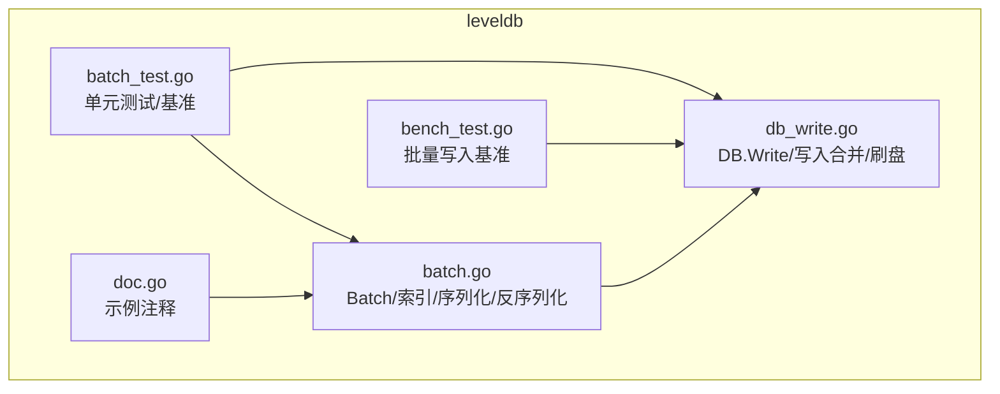
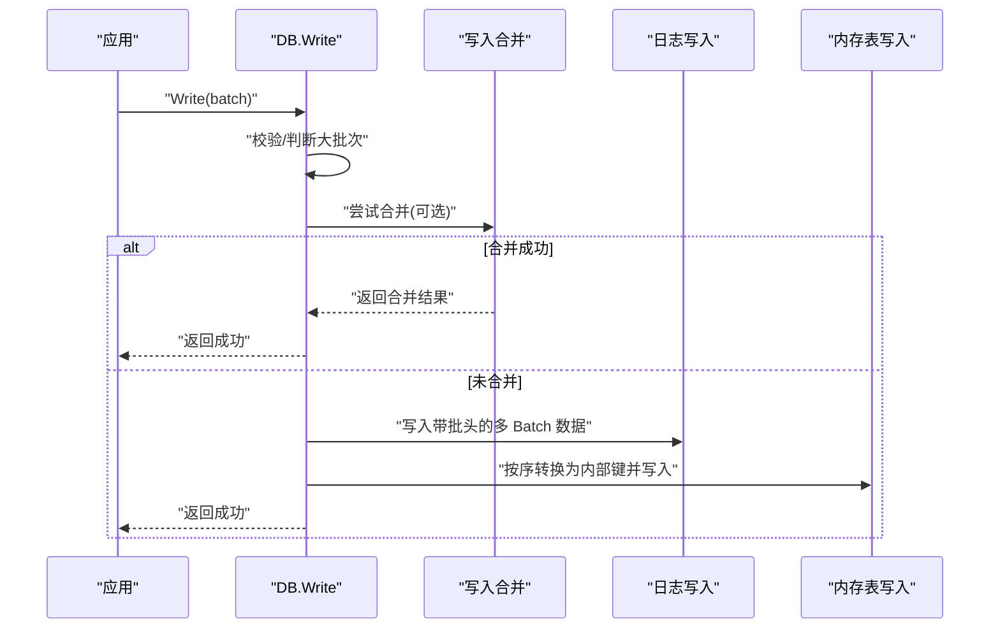
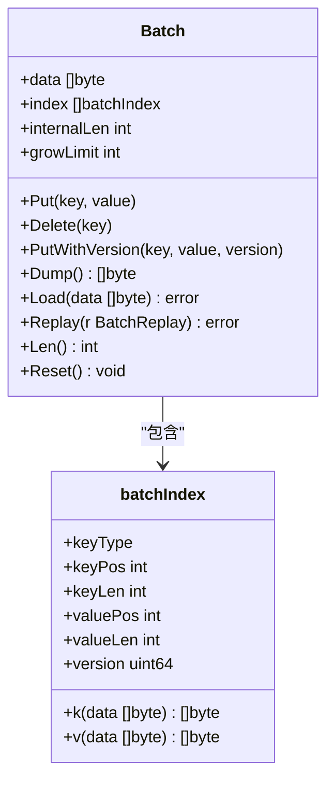
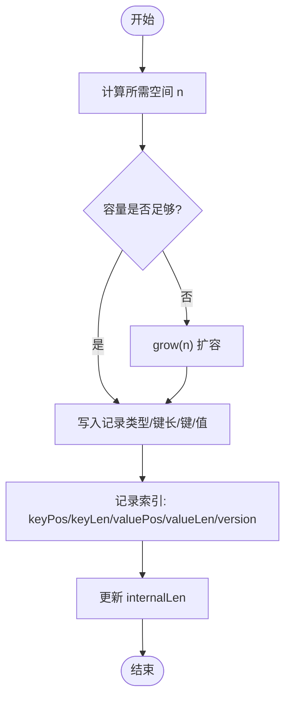
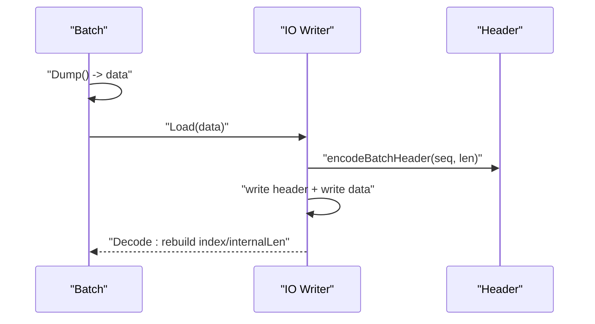
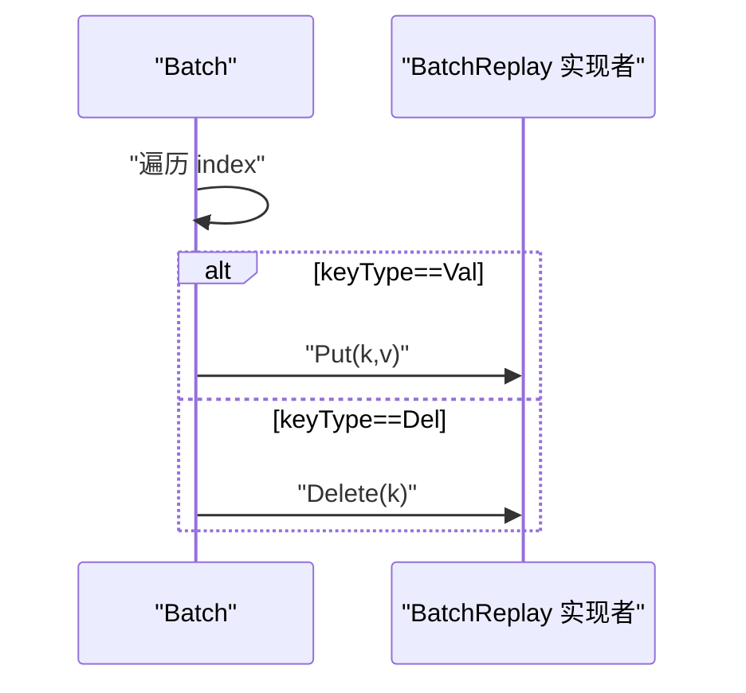
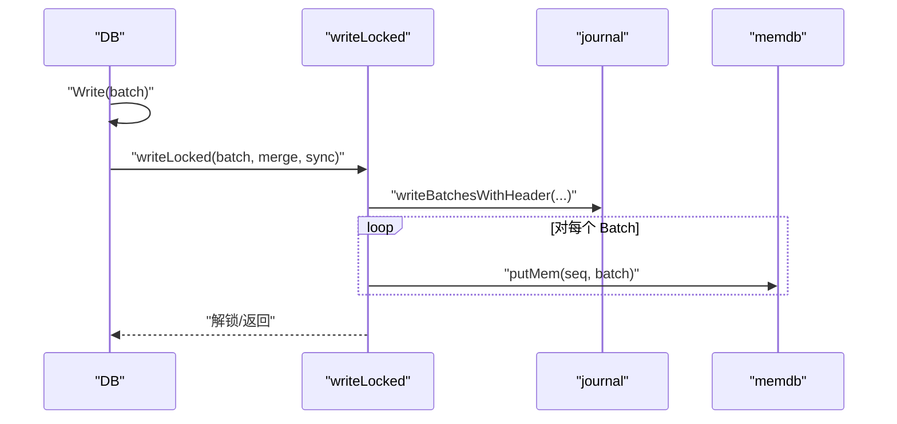
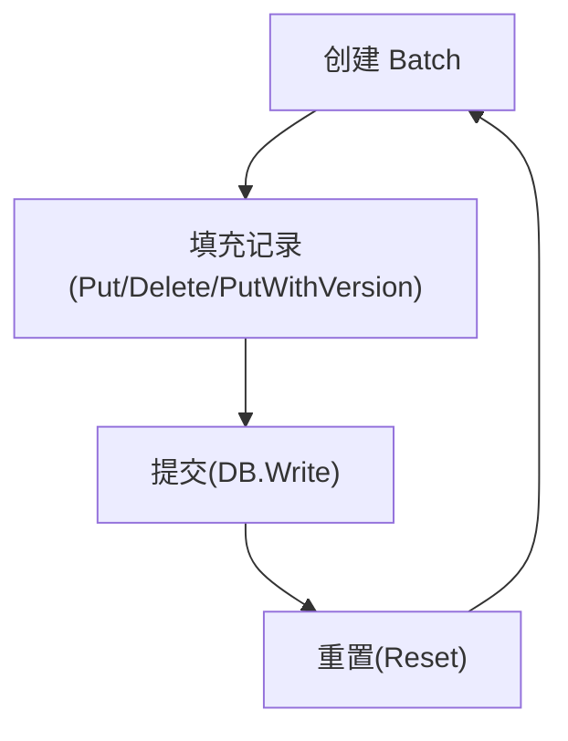
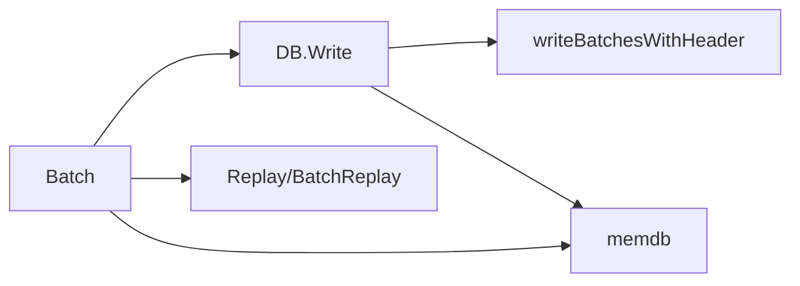

# 批量操作基础

<cite>
**本文引用的文件列表**
- [batch.go](file://leveldb/batch.go)
- [batch_test.go](file://leveldb/batch_test.go)
- [db_write.go](file://leveldb/db_write.go)
- [bench_test.go](file://leveldb/bench_test.go)
- [doc.go](file://leveldb/doc.go)
</cite>

## 目录
1. [简介](#简介)
2. [项目结构与定位](#项目结构与定位)
3. [核心组件](#核心组件)
4. [架构概览](#架构概览)
5. [详细组件分析](#详细组件分析)
6. [依赖关系分析](#依赖关系分析)
7. [性能考量](#性能考量)
8. [故障排查指南](#故障排查指南)
9. [结论](#结论)
10. [附录](#附录)

## 简介
本文件系统性阐述 avccDB 的批量操作基础能力，围绕 Batch 结构体展开，重点解释其三大核心字段 data（操作序列化缓冲区）、index（操作索引数组）与 internalLen（内部键总长度）的作用机制；详解 Put、Delete、PutWithVersion 的构建方式与 Write 提交路径；结合序列化场景下的 Dump/Load 与 BatchReplay 接口，给出从创建、填充、提交到重置的完整生命周期管理实践，并提供面向实际编码模式的最佳实践建议。

## 项目结构与定位
- 批量操作核心位于 leveldb/batch.go，包含 Batch 结构体、索引结构、序列化/反序列化、内存写入辅助等。
- 写入入口位于 leveldb/db_write.go，DB.Write 将 Batch 转换为持久化写入，支持合并、刷盘与内存表写入。
- 测试与基准覆盖了批量头编码解码、Dump/Load、Replay、append 合并、Reset 等行为，确保正确性与性能。
- 示例文档在 leveldb/doc.go 中提供了基本用法注释。

图表来源
- [batch.go](file://leveldb/batch.go#L62-L196)
- [db_write.go](file://leveldb/db_write.go#L268-L330)
- [batch_test.go](file://leveldb/batch_test.go#L1-L178)
- [bench_test.go](file://leveldb/bench_test.go#L119-L212)
- [doc.go](file://leveldb/doc.go#L74-L82)

章节来源
- [batch.go](file://leveldb/batch.go#L62-L196)
- [db_write.go](file://leveldb/db_write.go#L268-L330)
- [batch_test.go](file://leveldb/batch_test.go#L1-L178)
- [bench_test.go](file://leveldb/bench_test.go#L119-L212)
- [doc.go](file://leveldb/doc.go#L74-L82)

## 核心组件
- Batch 结构体
  - data：字节缓冲区，按记录顺序存储序列化的键值对与删除记录。
  - index：batchIndex 数组，记录每条记录在 data 中的偏移、长度及类型，便于零拷贝读取。
  - internalLen：累计“内部键”总长度，用于写入合并与内存压力评估。
  - growLimit：增长阈值，控制内存分配节奏，避免频繁扩容。
- BatchReplay 接口：抽象出批量回放的最小能力，支持 Put/Delete 两种操作。
- 关键方法
  - Put/Delete/PutWithVersion：向 Batch 追加记录。
  - Dump/Load：序列化与反序列化。
  - Replay：将 Batch 回放到实现了 BatchReplay 的目标。
  - Reset：清空并复位状态。
  - Len：返回记录数量。
  - append/decode：内部追加与解析逻辑。

章节来源
- [batch.go](file://leveldb/batch.go#L62-L196)
- [batch.go](file://leveldb/batch.go#L191-L242)
- [batch.go](file://leveldb/batch.go#L263-L303)

## 架构概览
批量写入从应用层构造 Batch，经 DB.Write 提交，可能被合并后写入日志与内存表。Batch 内部以紧凑二进制格式存储，配合 index 实现 O(1) 随机访问与零拷贝读取。

图表来源
- [db_write.go](file://leveldb/db_write.go#L268-L330)
- [db_write.go](file://leveldb/db_write.go#L18-33)
- [batch.go](file://leveldb/batch.go#L374-L413)

章节来源
- [db_write.go](file://leveldb/db_write.go#L268-L330)
- [batch.go](file://leveldb/batch.go#L374-L413)

## 详细组件分析

### Batch 结构体与字段语义
- data
  - 作用：存放所有记录的连续二进制数据，包含记录类型、键长、键、可选值长与值。
  - 特点：通过 grow(n) 动态扩容，采用分段增长策略，避免频繁分配。
- index
  - 作用：记录每条记录在 data 中的偏移与长度，以及记录类型与版本号。
  - 访问器：k(data)、v(data) 基于偏移与长度零拷贝提取键/值。
- internalLen
  - 作用：累计“内部键”总长度，用于写入合并与内存压力评估。
  - 计算规则：非版本键为 keyLen + valueLen + 8；版本键为 keyLen + valueLen + 16。

图表来源
- [batch.go](file://leveldb/batch.go#L62-L196)
- [batch.go](file://leveldb/batch.go#L44-L61)

章节来源
- [batch.go](file://leveldb/batch.go#L62-L196)

### 记录编码与索引更新流程
- appendRec/appendRecWithVersion
  - 计算所需空间，调用 grow(n) 分配或扩容。
  - 写入记录类型、键长、键、可选值长与值。
  - 记录 keyPos/keyLen/valuePos/valueLen 与版本号。
  - 更新 internalLen。
- grow
  - 当剩余容量不足时，根据 growLimit 与当前记录数动态扩大容量，降低分配频率。
- append
  - 合并另一个 Batch 到当前 Batch，同时修正新加入记录的 keyPos/valuePos 偏移。

图表来源
- [batch.go](file://leveldb/batch.go#L77-L136)
- [batch.go](file://leveldb/batch.go#L207-L224)

章节来源
- [batch.go](file://leveldb/batch.go#L77-L136)
- [batch.go](file://leveldb/batch.go#L207-L224)

### 序列化与反序列化：Dump/Load 与 Header
- Dump
  - 返回当前 data 引用，不复制，避免额外内存分配。
- Load
  - 使用 decode(data, -1) 解析 data，重建 index 并累计 internalLen。
- Header
  - encodeBatchHeader/decodeBatchHeader 定义批头格式：8 字节起始序列号 + 4 字节记录条数。
  - writeBatchesWithHeader 将批头与各 Batch.data 连续写出。
  - decodeBatchToMem 在恢复时校验序列号与记录数，逐条生成内部键写入内存表。

图表来源
- [batch.go](file://leveldb/batch.go#L157-L171)
- [batch.go](file://leveldb/batch.go#L374-L413)
- [batch.go](file://leveldb/batch.go#L346-L372)

章节来源
- [batch.go](file://leveldb/batch.go#L157-L171)
- [batch.go](file://leveldb/batch.go#L346-L413)

### 回放接口：BatchReplay
- BatchReplay
  - 定义 Put/Delete 两个回调，用于将 Batch 中的记录回放到任意实现者。
- Replay
  - 遍历 index，按记录类型调用 r.Put/r.Delete，实现无状态回放。
- 实际用途
  - 将 Batch 重新应用到另一个存储或进行一致性校验。
  - 与 Load/Dump 组合，实现跨进程/跨模块的数据迁移。

图表来源
- [batch.go](file://leveldb/batch.go#L38-L43)
- [batch.go](file://leveldb/batch.go#L173-L184)

章节来源
- [batch.go](file://leveldb/batch.go#L38-L43)
- [batch.go](file://leveldb/batch.go#L173-L184)

### 写入提交：DB.Write 与内部键转换
- DB.Write
  - 校验 Batch 是否为空或已关闭。
  - 大批次优化：当 internalLen 超过写缓冲阈值且未禁用大批次事务时，转为 Transaction 写入，跳过日志。
  - 合并策略：根据 WriteOptions 与全局配置决定是否合并，合并时累加 internalLen 限制。
  - 日志写入：writeBatchesWithHeader 写入批头与各 Batch.data。
  - 内存表写入：putMem 按序将记录转换为内部键并写入 memdb。
- 内部键转换
  - 有版本键：makeInternalKeyWithVersion；无版本键：makeInternalKey。
  - 顺序号 seq 由批头起始序列号与记录相对位置确定。

图表来源
- [db_write.go](file://leveldb/db_write.go#L268-L330)
- [db_write.go](file://leveldb/db_write.go#L18-33)
- [batch.go](file://leveldb/batch.go#L244-L257)

章节来源
- [db_write.go](file://leveldb/db_write.go#L268-L330)
- [db_write.go](file://leveldb/db_write.go#L18-33)
- [batch.go](file://leveldb/batch.go#L244-L257)

### 生命周期管理：创建、填充、提交、重置
- 创建
  - MakeBatch(n)：预分配初始容量。
  - MakeBatchWithConfig(config)：按配置初始化初始容量与 growLimit。
- 填充
  - Put/Delete/PutWithVersion：按需追加记录。
  - append/appendRecWithVersion：内部负责编码与索引维护。
- 提交
  - DB.Write(batch)：提交 Batch，可能合并、写日志、写内存表。
- 重置
  - Reset：清空 data/index/internalLen，复位至初始状态，便于复用。

图表来源
- [batch.go](file://leveldb/batch.go#L263-L303)
- [batch.go](file://leveldb/batch.go#L138-L155)
- [batch.go](file://leveldb/batch.go#L191-L196)
- [db_write.go](file://leveldb/db_write.go#L268-L330)

章节来源
- [batch.go](file://leveldb/batch.go#L263-L303)
- [batch.go](file://leveldb/batch.go#L138-L155)
- [batch.go](file://leveldb/batch.go#L191-L196)
- [db_write.go](file://leveldb/db_write.go#L268-L330)

### API 使用与编码模式
- 基础 API 使用
  - Put/Delete/PutWithVersion：构建批量操作。
  - Dump/Load：序列化与反序列化，适合持久化或网络传输。
  - Replay：将 Batch 回放到任意实现 BatchReplay 的对象。
  - Reset：复用 Batch，减少分配。
- 编码模式
  - 批量写入：先填充 Batch，再一次性提交 DB.Write。
  - 大批量优化：当 internalLen 达到阈值时，DB.Write 可能切换为 Transaction 路径，跳过日志。
  - 合并写入：在高并发下，DB.Write 可能合并多个小 Batch，提升吞吐。
  - 版本键：PutWithVersion 支持为同一用户键保留多版本，排序由版本号决定。

章节来源
- [doc.go](file://leveldb/doc.go#L74-L82)
- [db_write.go](file://leveldb/db_write.go#L268-L330)
- [batch_test.go](file://leveldb/batch_test.go#L1-L178)
- [bench_test.go](file://leveldb/bench_test.go#L119-L212)

## 依赖关系分析
- Batch 与 DB 的耦合
  - DB.Write 依赖 Batch 的 Len/Len/internalLen 与 data。
  - DB.Write 依赖 writeBatchesWithHeader/encodeBatchHeader/decodeBatchHeader 进行批头处理。
- Batch 与 memdb 的交互
  - putMem 将记录转换为内部键并写入 memdb。
- Batch 与外部序列化
  - Dump/Load 与 Replay 共同构成序列化回放闭环。

图表来源
- [batch.go](file://leveldb/batch.go#L157-L171)
- [batch.go](file://leveldb/batch.go#L173-L184)
- [batch.go](file://leveldb/batch.go#L244-L257)
- [batch.go](file://leveldb/batch.go#L374-L413)
- [db_write.go](file://leveldb/db_write.go#L268-L330)

章节来源
- [batch.go](file://leveldb/batch.go#L157-L184)
- [batch.go](file://leveldb/batch.go#L244-L257)
- [batch.go](file://leveldb/batch.go#L374-L413)
- [db_write.go](file://leveldb/db_write.go#L268-L330)

## 性能考量
- 扩容策略
  - growLimit 控制每次扩容幅度，避免频繁分配；当记录数超过阈值时，扩容步长按记录数比例缩小，平衡内存与分配成本。
- 合并写入
  - DB.Write 在满足条件时合并多个小 Batch，减少日志写入次数与内存表写入开销。
- 大批次优化
  - 当 internalLen 超过写缓冲阈值且未禁用大批次事务时，DB.Write 自动切换为 Transaction 路径，跳过日志，提高吞吐。
- 预分配
  - MakeBatch/MakeBatchWithConfig 提供初始容量，有助于减少扩容次数。

章节来源
- [batch.go](file://leveldb/batch.go#L77-L92)
- [batch.go](file://leveldb/batch.go#L263-L303)
- [db_write.go](file://leveldb/db_write.go#L268-L330)
- [bench_test.go](file://leveldb/bench_test.go#L150-L178)

## 故障排查指南
- 批头错误
  - decodeBatchHeader/encodeBatchHeader：检查批头长度、序列号与记录数是否一致。
- 记录损坏
  - decodeBatch：检查键/值长度是否越界、记录类型是否有效。
- 内存压力
  - internalLen 过大可能导致写入合并失败或触发内存表旋转，应合理拆分 Batch 或调整 growLimit。
- 回放异常
  - Replay 仅保证按类型回放，不保证幂等性；如需幂等，请在实现 BatchReplay 的对象中自行处理重复写入。

章节来源
- [batch.go](file://leveldb/batch.go#L304-L344)
- [batch.go](file://leveldb/batch.go#L346-L372)
- [batch_test.go](file://leveldb/batch_test.go#L1-L178)

## 结论
Batch 通过紧凑的二进制编码与索引结构，实现了高效的批量写入构建与回放。配合 DB.Write 的合并与大批次优化，可在高并发与大数据量场景下获得稳定吞吐。正确使用 Put/Delete/PutWithVersion、Dump/Load、Replay 与 Reset，能够覆盖从开发到生产的完整生命周期管理需求。

## 附录
- 常见问题
  - 为什么 internalLen 会影响写入性能？答：DB.Write 依据 internalLen 决定是否合并与是否启用大批次事务，直接影响日志与内存表写入路径。
  - 如何避免频繁扩容？答：使用 MakeBatchWithConfig 预估初始容量与 growLimit，或在批量写入前先估算记录规模。
  - 如何安全地序列化 Batch？答：使用 Dump 获取 data 引用，注意不要修改返回的切片；使用 Load 时同样不可修改传入的切片。