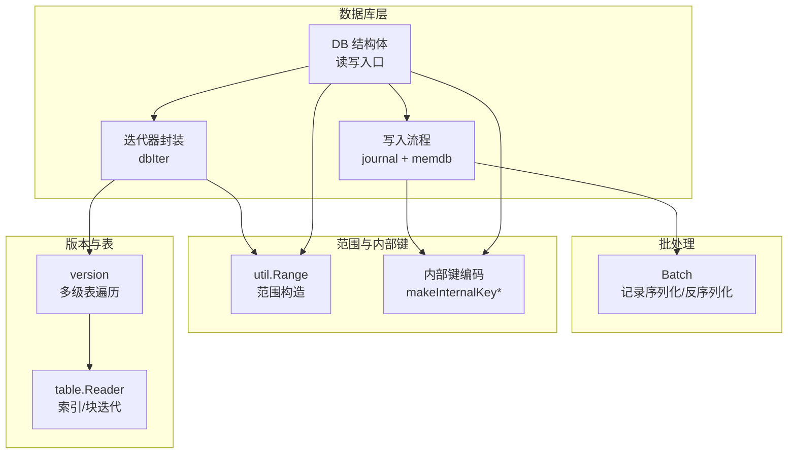
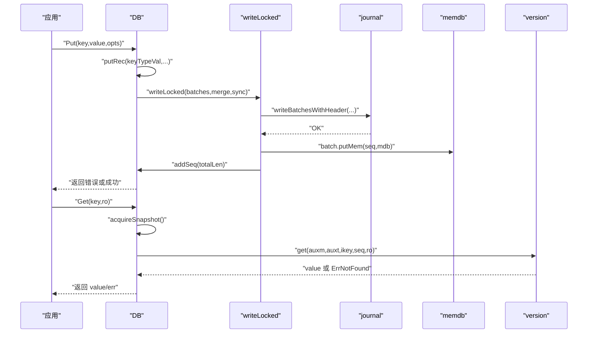
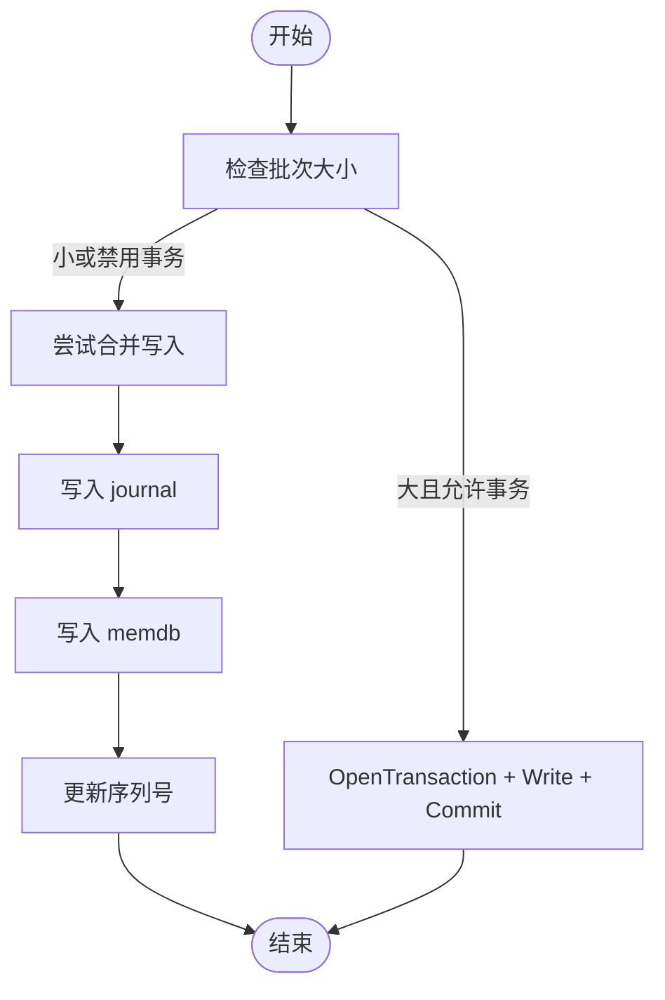
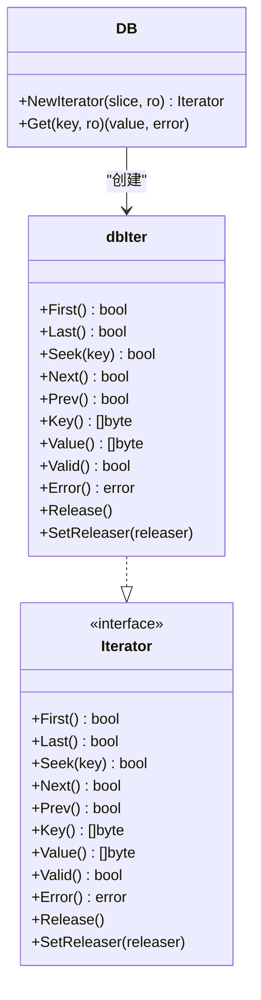
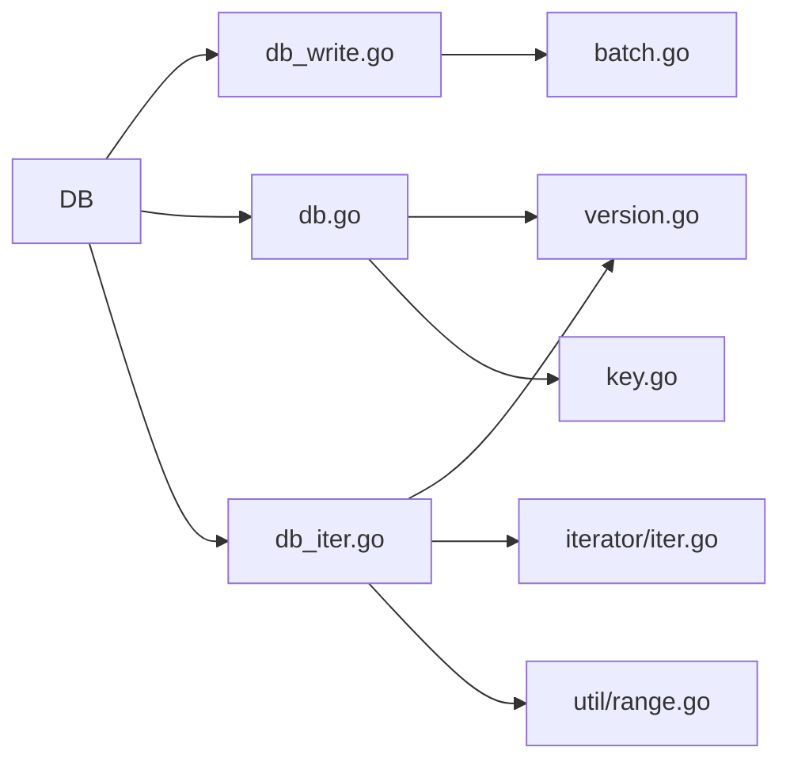

# 核心操作

<cite>
**本文引用的文件**
- [leveldb/db.go](file://leveldb/db.go)
- [leveldb/db_write.go](file://leveldb/db_write.go)
- [leveldb/db_iter.go](file://leveldb/db_iter.go)
- [leveldb/batch.go](file://leveldb/batch.go)
- [leveldb/util/range.go](file://leveldb/util/range.go)
- [leveldb/key.go](file://leveldb/key.go)
- [leveldb/iterator/iter.go](file://leveldb/iterator/iter.go)
- [leveldb/version.go](file://leveldb/version.go)
- [leveldb/db_util.go](file://leveldb/db_util.go)
</cite>

## 目录
1. [简介](#简介)
2. [项目结构](#项目结构)
3. [核心组件](#核心组件)
4. [架构总览](#架构总览)
5. [详细组件分析](#详细组件分析)
6. [依赖关系分析](#依赖关系分析)
7. [性能考量](#性能考量)
8. [故障排查指南](#故障排查指南)
9. [结论](#结论)

## 简介
本章节面向 avccDB 的核心键值操作，系统性梳理 Put、Get、Delete 的参数与行为，详解批量写入（Batch）的原子性与合并策略，以及迭代器（Iterator）的多种使用模式（全量遍历、范围查询、前缀遍历、Seek 定位），并给出生命周期管理的最佳实践。文档兼顾初学者与高级用户的理解需求，既提供概念说明，也给出可直接定位到源码实现的路径。

## 项目结构
围绕核心键值操作的关键模块：
- 数据库接口与读写：db.go、db_write.go
- 迭代器体系：db_iter.go、iterator/iter.go、version.go
- 批处理：batch.go
- 范围工具：util/range.go
- 内部键编码：key.go
- 通用读取接口：db_util.go

图表来源
- [leveldb/db.go](file://leveldb/db.go#L1097-L1106)
- [leveldb/db_write.go](file://leveldb/db_write.go#L154-L265)
- [leveldb/db_iter.go](file://leveldb/db_iter.go#L30-L90)
- [leveldb/batch.go](file://leveldb/batch.go#L138-L164)
- [leveldb/util/range.go](file://leveldb/util/range.go#L9-L33)
- [leveldb/key.go](file://leveldb/key.go#L75-L104)
- [leveldb/version.go](file://leveldb/version.go#L551-L564)
- [leveldb/iterator/iter.go](file://leveldb/iterator/iter.go#L17-L96)

章节来源
- [leveldb/db.go](file://leveldb/db.go#L1097-L1106)
- [leveldb/db_write.go](file://leveldb/db_write.go#L154-L265)
- [leveldb/db_iter.go](file://leveldb/db_iter.go#L30-L90)
- [leveldb/batch.go](file://leveldb/batch.go#L138-L164)
- [leveldb/util/range.go](file://leveldb/util/range.go#L9-L33)
- [leveldb/key.go](file://leveldb/key.go#L75-L104)
- [leveldb/version.go](file://leveldb/version.go#L551-L564)
- [leveldb/iterator/iter.go](file://leveldb/iterator/iter.go#L17-L96)

## 核心组件
- DB.Put / DB.Get / DB.Delete：对外暴露的键值操作，均通过内部统一的写入/读取路径完成。
- Batch：批量写入单元，支持 Put/Delete 记录的序列化、合并与提交。
- 迭代器（Iterator）：提供全量、范围、前缀等遍历能力，封装内部键解析与版本过滤。
- 内部键编码：将用户键与序列号/类型组合，支撑版本化与排序。
- 范围工具：util.Range 与 BytesPrefix，用于构造范围查询与前缀查询。

章节来源
- [leveldb/db.go](file://leveldb/db.go#L1097-L1106)
- [leveldb/db_write.go](file://leveldb/db_write.go#L331-L447)
- [leveldb/batch.go](file://leveldb/batch.go#L138-L164)
- [leveldb/db_iter.go](file://leveldb/db_iter.go#L149-L393)
- [leveldb/util/range.go](file://leveldb/util/range.go#L9-L33)
- [leveldb/key.go](file://leveldb/key.go#L75-L104)

## 架构总览
下面以“写入”和“读取”两条主线展示核心流程。

图表来源
- [leveldb/db_write.go](file://leveldb/db_write.go#L331-L447)
- [leveldb/db_write.go](file://leveldb/db_write.go#L154-L265)
- [leveldb/db.go](file://leveldb/db.go#L797-L832)
- [leveldb/version.go](file://leveldb/version.go#L142-L285)

## 详细组件分析

### Put 操作
- 入口：DB.Put(key, value, wo) 将调用内部 putRec(keyTypeVal, ...)。
- 合并策略：若启用写合并（NoWriteMerge 未设置），会尝试将多个写入合并为一个批次；否则直接获取写锁。
- 日志与内存：先写入 journal，再写入 memdb；必要时触发 memdb 切换。
- 参数与返回：
  - key/value：字节切片；返回 error。
  - wo：WriteOptions，影响是否合并、是否同步刷盘。
- 使用注意：
  - 返回的 error 可能包含“只读”、“关闭”等状态；调用方应正确处理。
  - 对于大批次，内部可能转为事务写入以跳过 journal，提高吞吐。

章节来源
- [leveldb/db_write.go](file://leveldb/db_write.go#L377-L447)
- [leveldb/db_write.go](file://leveldb/db_write.go#L274-L329)
- [leveldb/db_write.go](file://leveldb/db_write.go#L154-L265)

### Get 操作
- 入口：DB.Get(key, ro) 获取最新版本值。
- 快速路径：先查辅助 memdb（auxm），再查有效/冻结 memdb，最后查版本树（version）。
- 版本匹配：内部键中携带序列号与类型，按 seq 降序比较，遇到删除标记则跳过。
- 返回值：value 与 error；当不存在时返回 ErrNotFound。
- 注意事项：
  - 返回的 value 是拷贝后的字节切片，调用方可以安全修改其内容。
  - 若开启严格模式（Strict），内部键解析错误会直接返回。

章节来源
- [leveldb/db.go](file://leveldb/db.go#L1097-L1106)
- [leveldb/db.go](file://leveldb/db.go#L797-L832)
- [leveldb/version.go](file://leveldb/version.go#L142-L285)
- [leveldb/key.go](file://leveldb/key.go#L106-L132)

### Delete 操作
- 入口：DB.Delete(key, wo) 等价于 putRec(keyTypeDel, ...)。
- 行为：写入删除标记，后续读取将被忽略（直到 compaction 合并）。
- 返回：error；不存在也不报错。

章节来源
- [leveldb/db_write.go](file://leveldb/db_write.go#L440-L447)
- [leveldb/db.go](file://leveldb/db.go#L797-L832)

### 批量写入（Batch）
- 构建：
  - Batch.Put/PutWithVersion/Delete 均追加记录，内部采用可增长缓冲区，避免频繁分配。
  - 支持 Load/Dump：Dump 返回底层缓冲区指针（不复制），Load 将外部数据直接作为缓冲区使用。
- 提交：
  - DB.Write(batch, wo)：若批次过大且未禁用大批次事务，则转为事务写入（跳过 journal）。
  - 合并写：在 writeLocked 中尝试合并多个写入，减少 memdb 写入次数。
  - 日志：writeJournal 将批次头（序列号、记录数）与记录体写入 journal。
  - 内存：batch.putMem 将内部键写入 memdb。
- 原子性：
  - 批次内的记录按顺序写入，journal 与 memdb 的写入顺序一致，保证原子性。
  - 大批次事务写入可绕过 journal，直接落盘，提升吞吐但牺牲部分持久化可见性（由配置控制）。

图表来源
- [leveldb/db_write.go](file://leveldb/db_write.go#L274-L329)
- [leveldb/db_write.go](file://leveldb/db_write.go#L154-L265)
- [leveldb/batch.go](file://leveldb/batch.go#L244-L257)

章节来源
- [leveldb/batch.go](file://leveldb/batch.go#L138-L164)
- [leveldb/batch.go](file://leveldb/batch.go#L244-L257)
- [leveldb/db_write.go](file://leveldb/db_write.go#L274-L329)
- [leveldb/db_write.go](file://leveldb/db_write.go#L154-L265)

### 迭代器（Iterator）
- 创建：
  - DB.NewIterator(slice, ro) 获取快照后创建 dbIter。
  - dbIter 内部通过 newRawIterator 合并 memdb、辅助表、主版本表的迭代器。
- 遍历模式：
  - 全量遍历：First/Next 或 Last/Prev。
  - 范围查询：util.Range.Start/Limit 控制闭区间 [Start, Limit)。
  - 前缀遍历：util.BytesPrefix(prefix) 生成 Range，自动计算 limit。
  - Seek 定位：Seek(key) 移动到首个 ≥ key 的位置。
- 生命周期管理：
  - Valid/Error：判断当前是否有效、是否有错误。
  - Key/Value：返回当前键值；注意返回的是内部拷贝，调用方可安全修改。
  - Release：释放资源，必须显式调用；SetReleaser 用于绑定版本/内存数据库的释放器。
- 内部键解析与版本过滤：
  - dbIter 在每次移动时解析内部键，按 seq ≤ 当前快照序列号过滤，跳过删除项，保留最新版本。

图表来源
- [leveldb/db.go](file://leveldb/db.go#L1219-L1229)
- [leveldb/db_iter.go](file://leveldb/db_iter.go#L149-L393)
- [leveldb/iterator/iter.go](file://leveldb/iterator/iter.go#L17-L96)

章节来源
- [leveldb/db_iter.go](file://leveldb/db_iter.go#L30-L90)
- [leveldb/db_iter.go](file://leveldb/db_iter.go#L149-L393)
- [leveldb/util/range.go](file://leveldb/util/range.go#L9-L33)
- [leveldb/iterator/iter.go](file://leveldb/iterator/iter.go#L17-L96)

### 范围与前缀查询
- util.Range：Start（包含）、Limit（不包含）定义闭半开区间。
- util.BytesPrefix：根据前缀构造 Range，自动计算 limit（逐字节进位）。
- 使用建议：
  - 范围查询：传入 util.Range；Seek 定位后用 Next/Prev 遍历。
  - 前缀查询：传入 BytesPrefix(prefix)；内部自动转换为 Range。

章节来源
- [leveldb/util/range.go](file://leveldb/util/range.go#L9-L33)
- [leveldb/db_iter.go](file://leveldb/db_iter.go#L62-L90)

### 内部键与版本
- makeInternalKey / makeInternalKeyWithVersion：将用户键与序列号、类型组合，形成排序键。
- 解析：parseInternalKey / parseInternalKeyWithVersion；支持带版本与不带版本两种格式。
- 版本语义：高版本优先，删除标记（keyTypeDel）用于跳过。

章节来源
- [leveldb/key.go](file://leveldb/key.go#L75-L104)
- [leveldb/key.go](file://leveldb/key.go#L106-L132)
- [leveldb/version.go](file://leveldb/version.go#L142-L285)
- [leveldb/db_iter.go](file://leveldb/db_iter.go#L204-L244)

## 依赖关系分析
- DB 依赖：
  - 写入：db_write.go（journal、memdb、flush、writeLocked）
  - 读取：db.go（get、memGet、版本树）
  - 迭代：db_iter.go（dbIter、newRawIterator、newIterator）
  - 范围：util/range.go
  - 内部键：key.go
  - 版本树：version.go（多级表迭代器）
  - 接口：iterator/iter.go（Iterator 接口）
- 批处理：batch.go（记录编码/解码、putMem）

图表来源
- [leveldb/db.go](file://leveldb/db.go#L797-L832)
- [leveldb/db_write.go](file://leveldb/db_write.go#L154-L265)
- [leveldb/db_iter.go](file://leveldb/db_iter.go#L30-L90)
- [leveldb/version.go](file://leveldb/version.go#L551-L564)
- [leveldb/iterator/iter.go](file://leveldb/iterator/iter.go#L17-L96)
- [leveldb/util/range.go](file://leveldb/util/range.go#L9-L33)
- [leveldb/key.go](file://leveldb/key.go#L75-L104)
- [leveldb/batch.go](file://leveldb/batch.go#L244-L257)

章节来源
- [leveldb/db.go](file://leveldb/db.go#L797-L832)
- [leveldb/db_write.go](file://leveldb/db_write.go#L154-L265)
- [leveldb/db_iter.go](file://leveldb/db_iter.go#L30-L90)
- [leveldb/version.go](file://leveldb/version.go#L551-L564)
- [leveldb/iterator/iter.go](file://leveldb/iterator/iter.go#L17-L96)
- [leveldb/util/range.go](file://leveldb/util/range.go#L9-L33)
- [leveldb/key.go](file://leveldb/key.go#L75-L104)
- [leveldb/batch.go](file://leveldb/batch.go#L244-L257)

## 性能考量
- 写入合并：writeMergeC 通道聚合多个写入，降低 memdb 写入次数；mergeLimit 限制合并空间。
- 刷写节流：flush 根据 L0 文件数量与阈值进行慢速/暂停写入，避免写放大。
- 迭代采样：dbIter.sampleSeek 与版本采样减少不必要的 compaction 触发。
- 大批次事务：Write 对超大批次自动转为事务写入，跳过 journal，提高吞吐。

章节来源
- [leveldb/db_write.go](file://leveldb/db_write.go#L154-L265)
- [leveldb/db_write.go](file://leveldb/db_write.go#L66-L131)
- [leveldb/db_iter.go](file://leveldb/db_iter.go#L124-L135)

## 故障排查指南
- 常见错误类型：
  - ErrNotFound：Get/迭代器遍历到末尾或键不存在。
  - ErrClosed：DB 已关闭，写入/读取失败。
  - ErrReadOnly：只读模式下禁止写入。
  - ErrIterReleased：迭代器已释放仍调用方法。
- 排查要点：
  - 写入：确认 WriteOptions 是否启用合并、是否同步刷盘；检查 journal 写入是否成功。
  - 读取：确认快照序列号、内部键解析是否严格模式；检查版本过滤逻辑。
  - 迭代：确保 Release 被调用；检查 SetReleaser 是否重复设置；关注 Error 返回值。

章节来源
- [leveldb/iterator/iter.go](file://leveldb/iterator/iter.go#L17-L20)
- [leveldb/db_iter.go](file://leveldb/db_iter.go#L360-L393)
- [leveldb/db_write.go](file://leveldb/db_write.go#L503-L530)

## 结论
- Put/Get/Delete 提供了稳定的键值操作接口，内部通过统一的写入与读取路径保证一致性。
- Batch 通过记录序列化与合并写入，显著提升批量写入性能；事务写入在大批次场景下进一步优化吞吐。
- 迭代器提供灵活的遍历方式，配合 Range/BytesPrefix 实现范围与前缀查询；生命周期管理（Release/SetReleaser）是正确使用的前提。
- 内部键编码与版本解析确保了多版本共存与正确排序，配合快照实现一致视图。