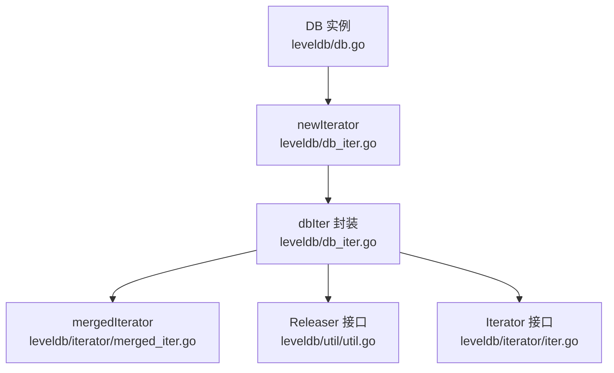
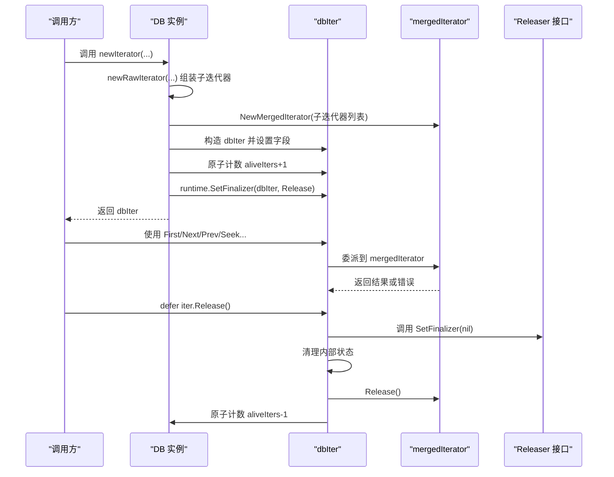
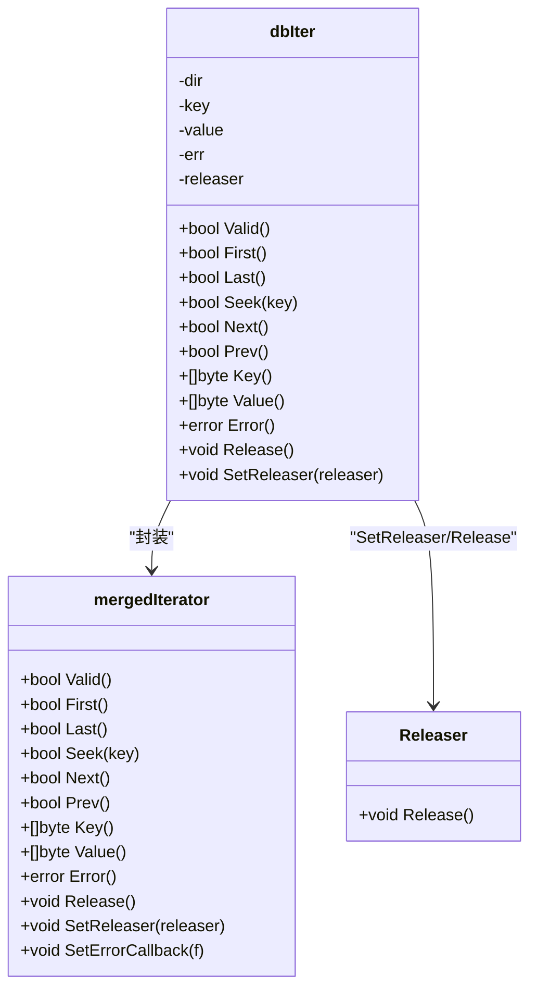
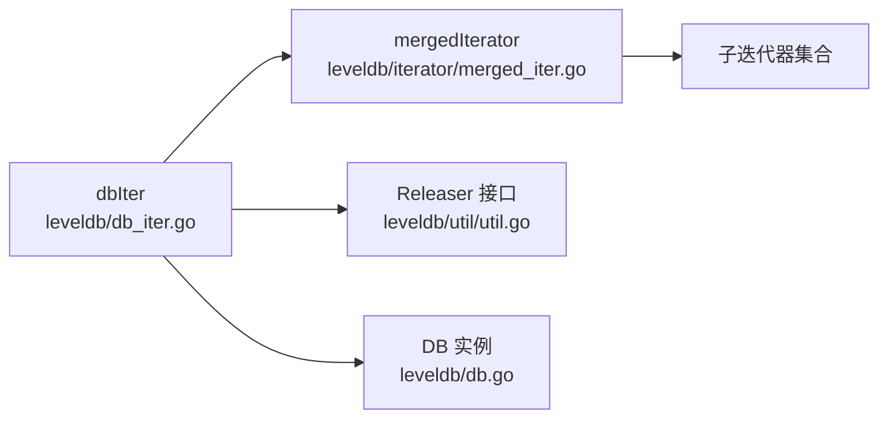

# 生命周期管理

<cite>
**本文引用的文件**
- [leveldb/db_iter.go](file://leveldb/db_iter.go)
- [leveldb/iterator/iter.go](file://leveldb/iterator/iter.go)
- [leveldb/iterator/merged_iter.go](file://leveldb/iterator/merged_iter.go)
- [leveldb/iterator/indexed_iter.go](file://leveldb/iterator/indexed_iter.go)
- [leveldb/util/util.go](file://leveldb/util/util.go)
- [leveldb/db.go](file://leveldb/db.go)
- [leveldb/db_test.go](file://leveldb/db_test.go)
- [leveldb/bench_test.go](file://leveldb/bench_test.go)
- [leveldb/cmd/leveldb-inspector/main.go](file://leveldb/cmd/leveldb-inspector/main.go)
</cite>

## 目录
1. [简介](#简介)
2. [项目结构](#项目结构)
3. [核心组件](#核心组件)
4. [架构总览](#架构总览)
5. [详细组件分析](#详细组件分析)
6. [依赖关系分析](#依赖关系分析)
7. [性能考量](#性能考量)
8. [故障排查指南](#故障排查指南)
9. [结论](#结论)
10. [附录](#附录)

## 简介
本文件聚焦于 avccDB 的迭代器生命周期管理，围绕以下目标展开：
- 解释 Release 方法的重要性：必须显式释放迭代器以避免内存泄漏与文件句柄耗尽。
- 结合 db_iter.go 中的 newIterator 实现，说明迭代器通过 runtime.SetFinalizer 设置终结器作为安全网，但仍需显式调用 Release。
- 说明 Error 方法的使用模式：在迭代器耗尽后调用以检查累积的 I/O 错误。
- 解释 Valid 状态的含义及其与 Next/Prev 返回值的关系。
- 提供最佳实践示例（defer iter.Release()），并讨论并发使用中的问题与解决方案。

## 项目结构
与迭代器生命周期管理直接相关的模块包括：
- 数据库层迭代器封装：leveldb/db_iter.go
- 迭代器接口与通用行为：leveldb/iterator/iter.go
- 多路合并迭代器：leveldb/iterator/merged_iter.go
- 基础资源释放接口：leveldb/util/util.go
- 数据库实例与并发计数：leveldb/db.go
- 使用示例与测试：leveldb/db_test.go、leveldb/bench_test.go、leveldb/cmd/leveldb-inspector/main.go

图表来源
- [leveldb/db_iter.go](file://leveldb/db_iter.go#L63-L91)
- [leveldb/iterator/merged_iter.go](file://leveldb/iterator/merged_iter.go#L299-L317)
- [leveldb/util/util.go](file://leveldb/util/util.go#L19-L36)
- [leveldb/iterator/iter.go](file://leveldb/iterator/iter.go#L21-L95)
- [leveldb/db.go](file://leveldb/db.go#L33-L66)

章节来源
- [leveldb/db_iter.go](file://leveldb/db_iter.go#L63-L91)
- [leveldb/iterator/merged_iter.go](file://leveldb/iterator/merged_iter.go#L299-L317)
- [leveldb/util/util.go](file://leveldb/util/util.go#L19-L36)
- [leveldb/iterator/iter.go](file://leveldb/iterator/iter.go#L21-L95)
- [leveldb/db.go](file://leveldb/db.go#L33-L66)

## 核心组件
- dbIter：数据库层对底层迭代器的封装，负责版本过滤、采样、方向状态与错误传播。
- mergedIterator：多路合并迭代器，内部持有多个子迭代器，统一对外暴露有序遍历。
- Releaser/ReleaseSetter：统一的资源释放接口与设置器，确保可重复释放且幂等。
- Iterator 接口：定义了迭代器的基本能力（First/Last/Seek/Next/Prev/Valid/Error/Key/Value/Release/SetReleaser）。

章节来源
- [leveldb/db_iter.go](file://leveldb/db_iter.go#L107-L122)
- [leveldb/iterator/merged_iter.go](file://leveldb/iterator/merged_iter.go#L27-L41)
- [leveldb/util/util.go](file://leveldb/util/util.go#L19-L36)
- [leveldb/iterator/iter.go](file://leveldb/iterator/iter.go#L21-L95)

## 架构总览
下图展示了从 DB.newIterator 到 dbIter 的创建流程，以及 dbIter 如何通过 mergedIterator 合并底层数据源，并最终由 Release 归还资源。

图表来源
- [leveldb/db_iter.go](file://leveldb/db_iter.go#L31-L61)
- [leveldb/db_iter.go](file://leveldb/db_iter.go#L63-L91)
- [leveldb/db_iter.go](file://leveldb/db_iter.go#L360-L378)
- [leveldb/iterator/merged_iter.go](file://leveldb/iterator/merged_iter.go#L261-L275)
- [leveldb/util/util.go](file://leveldb/util/util.go#L19-L36)
- [leveldb/db.go](file://leveldb/db.go#L33-L66)

## 详细组件分析

### dbIter 生命周期与资源管理
- 创建阶段
  - newIterator 构造 dbIter，并将 mergedIterator 作为底层迭代器。
  - 原子计数 aliveIters+1，用于统计活跃迭代器数量。
  - 通过 runtime.SetFinalizer 将 Release 绑定为终结器，作为兜底安全网。
- 使用阶段
  - Valid 表示当前状态是否有效；当 err 非空或方向状态小于等于 EOI 时无效。
  - Next/Prev/First/Last/Seek 在内部委托给底层 mergedIterator，并进行版本过滤与严格模式下的错误传播。
  - Error 返回累积的错误；在迭代器耗尽后应调用以检查 I/O 错误。
- 释放阶段
  - Release 清除终结器，调用 SetReleaser（如版本/内存数据库引用计数器），清理内部状态，调用底层迭代器 Release，原子计数 aliveIters-1。
  - 若未显式调用 Release，GC 触发终结器时会尝试调用 Release，但此时已无法保证资源被正确回收（例如底层迭代器可能已被关闭或不可用）。

图表来源
- [leveldb/db_iter.go](file://leveldb/db_iter.go#L149-L151)
- [leveldb/db_iter.go](file://leveldb/db_iter.go#L153-L202)
- [leveldb/db_iter.go](file://leveldb/db_iter.go#L204-L244)
- [leveldb/db_iter.go](file://leveldb/db_iter.go#L246-L344)
- [leveldb/db_iter.go](file://leveldb/db_iter.go#L346-L392)
- [leveldb/db_iter.go](file://leveldb/db_iter.go#L360-L378)
- [leveldb/iterator/merged_iter.go](file://leveldb/iterator/merged_iter.go#L63-L65)
- [leveldb/iterator/merged_iter.go](file://leveldb/iterator/merged_iter.go#L67-L117)
- [leveldb/iterator/merged_iter.go](file://leveldb/iterator/merged_iter.go#L119-L143)
- [leveldb/iterator/merged_iter.go](file://leveldb/iterator/merged_iter.go#L145-L187)
- [leveldb/iterator/merged_iter.go](file://leveldb/iterator/merged_iter.go#L199-L245)
- [leveldb/iterator/merged_iter.go](file://leveldb/iterator/merged_iter.go#L247-L259)
- [leveldb/iterator/merged_iter.go](file://leveldb/iterator/merged_iter.go#L261-L275)
- [leveldb/util/util.go](file://leveldb/util/util.go#L19-L36)

章节来源
- [leveldb/db_iter.go](file://leveldb/db_iter.go#L63-L91)
- [leveldb/db_iter.go](file://leveldb/db_iter.go#L149-L151)
- [leveldb/db_iter.go](file://leveldb/db_iter.go#L360-L378)
- [leveldb/iterator/merged_iter.go](file://leveldb/iterator/merged_iter.go#L261-L275)
- [leveldb/util/util.go](file://leveldb/util/util.go#L19-L36)

### mergedIterator 的错误传播与释放
- 错误传播
  - 当底层子迭代器出现错误时，mergedIterator 可根据严格模式决定是否中断或继续下一个子迭代器。
  - Error 返回累积的错误；Valid 在 err 非空或方向状态小于等于 EOI 时为假。
- 释放
  - Release 会依次释放所有子迭代器，并清理内部状态；若存在 Releaser，也会一并释放。

章节来源
- [leveldb/iterator/merged_iter.go](file://leveldb/iterator/merged_iter.go#L50-L61)
- [leveldb/iterator/merged_iter.go](file://leveldb/iterator/merged_iter.go#L63-L65)
- [leveldb/iterator/merged_iter.go](file://leveldb/iterator/merged_iter.go#L261-L275)

### 释放接口与安全网
- Releaser/ReleaseSetter
  - Releaser 定义 Release，要求幂等；ReleaseSetter 支持设置/清除 Releaser。
  - BasicReleaser 提供基础实现，防止重复释放。
- 终结器
  - dbIter 在创建时通过 runtime.SetFinalizer 将 Release 绑定为终结器，作为兜底安全网。
  - 但 GC 时间不确定，且终结器执行时可能已处于不可预期的状态，因此必须显式调用 Release。

章节来源
- [leveldb/util/util.go](file://leveldb/util/util.go#L19-L36)
- [leveldb/util/util.go](file://leveldb/util/util.go#L38-L74)
- [leveldb/db_iter.go](file://leveldb/db_iter.go#L88-L90)

### Error 方法的使用模式
- 在迭代器耗尽后调用 Error，以检查是否存在累积的 I/O 错误。
- 测试与基准代码中广泛采用“遍历完成后调用 Error 检查”的模式，确保不会遗漏错误。

章节来源
- [leveldb/db_test.go](file://leveldb/db_test.go#L220-L234)
- [leveldb/bench_test.go](file://leveldb/bench_test.go#L242-L249)

### Valid 状态与 Next/Prev 返回值的关系
- Valid 仅在 err 为空且方向状态大于 EOI 时为真。
- Next/Prev 返回值表示是否成功移动到下一个/上一个位置；当返回假时，通常意味着到达边界或发生错误，此时应检查 Error。

章节来源
- [leveldb/db_iter.go](file://leveldb/db_iter.go#L149-L151)
- [leveldb/db_iter.go](file://leveldb/db_iter.go#L246-L260)
- [leveldb/db_iter.go](file://leveldb/db_iter.go#L306-L344)

### 最佳实践：defer iter.Release()
- 在所有创建迭代器的路径上，均应使用 defer iter.Release()，确保无论正常退出还是异常返回都能释放资源。
- 示例路径：
  - 基准测试中在多个场景使用 defer iter.Release()。
  - 命令行工具与测试中也广泛采用该模式。

章节来源
- [leveldb/bench_test.go](file://leveldb/bench_test.go#L231-L240)
- [leveldb/bench_test.go](file://leveldb/bench_test.go#L338-L343)
- [leveldb/bench_test.go](file://leveldb/bench_test.go#L386-L391)
- [leveldb/bench_test.go](file://leveldb/bench_test.go#L402-L409)
- [leveldb/cmd/leveldb-inspector/main.go](file://leveldb/cmd/leveldb-inspector/main.go#L249-L249)
- [leveldb/cmd/leveldb-inspector/main.go](file://leveldb/cmd/leveldb-inspector/main.go#L333-L333)
- [leveldb/cmd/leveldb-inspector/main.go](file://leveldb/cmd/leveldb-inspector/main.go#L390-L390)

### 并发使用注意事项
- 迭代器不是线程安全的；建议每个 goroutine 使用独立的迭代器实例。
- 多个迭代器可以并发使用，但每个迭代器必须在各自 goroutine 内部操作。
- DB 层维护 aliveIters 计数，有助于监控系统中活跃迭代器数量，避免资源过度占用。

章节来源
- [leveldb/iterator/iter.go](file://leveldb/iterator/iter.go#L79-L83)
- [leveldb/db.go](file://leveldb/db.go#L33-L66)

## 依赖关系分析
- dbIter 依赖 mergedIterator 提供多路合并与排序；mergedIterator 再依赖各子迭代器的数据源。
- dbIter 通过 util.Releaser 与 SetReleaser 与外部资源（如版本/内存数据库）解耦，便于在释放时正确归还引用。
- DB 层通过 aliveIters 计数与 runtime.SetFinalizer 双重保障迭代器生命周期。

图表来源
- [leveldb/db_iter.go](file://leveldb/db_iter.go#L63-L91)
- [leveldb/iterator/merged_iter.go](file://leveldb/iterator/merged_iter.go#L27-L41)
- [leveldb/util/util.go](file://leveldb/util/util.go#L19-L36)
- [leveldb/db.go](file://leveldb/db.go#L33-L66)

章节来源
- [leveldb/db_iter.go](file://leveldb/db_iter.go#L63-L91)
- [leveldb/iterator/merged_iter.go](file://leveldb/iterator/merged_iter.go#L27-L41)
- [leveldb/util/util.go](file://leveldb/util/util.go#L19-L36)
- [leveldb/db.go](file://leveldb/db.go#L33-L66)

## 性能考量
- 采样与方向状态：dbIter 内部维护 samplingGap 与 dir，减少不必要的开销。
- 原子计数 aliveIters：用于监控活跃迭代器数量，便于定位资源泄漏或过度并发。
- 终结器成本：虽然设置了终结器作为安全网，但不应依赖它；显式释放更可控且性能更好。

章节来源
- [leveldb/db_iter.go](file://leveldb/db_iter.go#L124-L135)
- [leveldb/db_iter.go](file://leveldb/db_iter.go#L88-L90)
- [leveldb/db.go](file://leveldb/db.go#L33-L66)

## 故障排查指南
- 常见问题
  - 忘记释放迭代器：导致内存与文件句柄泄漏；可通过 aliveIters 与系统监控发现异常增长。
  - 未在耗尽后检查 Error：忽略 I/O 错误，导致业务逻辑误判。
  - 并发共享同一迭代器：引发竞态与未定义行为。
- 排查步骤
  - 确认所有创建迭代器的路径都使用 defer iter.Release()。
  - 在迭代结束后调用 iter.Error() 检查错误。
  - 确保每个 goroutine 使用独立迭代器实例。
  - 关注 aliveIters 是否异常升高。

章节来源
- [leveldb/db_test.go](file://leveldb/db_test.go#L220-L234)
- [leveldb/bench_test.go](file://leveldb/bench_test.go#L242-L249)
- [leveldb/iterator/iter.go](file://leveldb/iterator/iter.go#L79-L83)
- [leveldb/db.go](file://leveldb/db.go#L33-L66)

## 结论
- 显式释放是迭代器生命周期管理的核心：即使设置了终结器，也必须在退出前调用 Release，以确保资源及时归还。
- Error 应在迭代器耗尽后调用，用于检查累积的 I/O 错误。
- Valid 与 Next/Prev 返回值共同描述迭代器状态，应结合使用。
- 最佳实践是统一使用 defer iter.Release()，并在并发场景下避免共享迭代器实例。
- 通过 aliveIters 与严格的资源释放策略，可有效避免内存泄漏与文件句柄耗尽问题。

## 附录
- 相关实现参考路径
  - [dbIter 构造与终结器绑定](file://leveldb/db_iter.go#L63-L91)
  - [dbIter 释放流程](file://leveldb/db_iter.go#L360-L378)
  - [mergedIterator 释放流程](file://leveldb/iterator/merged_iter.go#L261-L275)
  - [Releaser 接口与 BasicReleaser](file://leveldb/util/util.go#L19-L74)
  - [Iterator 接口与并发说明](file://leveldb/iterator/iter.go#L79-L83)
  - [测试与基准中的 defer 模式](file://leveldb/db_test.go#L220-L234)
  - [命令行工具中的 defer 模式](file://leveldb/cmd/leveldb-inspector/main.go#L249-L249)