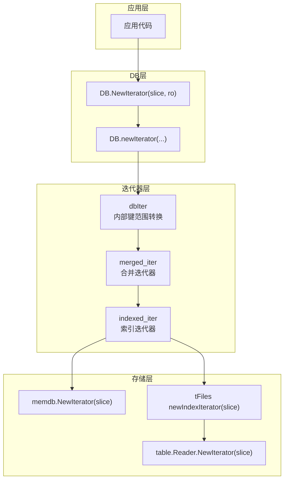
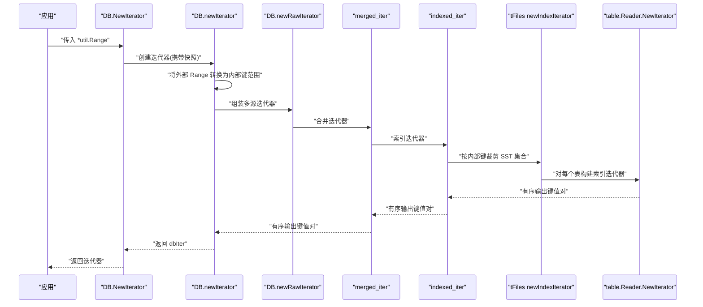
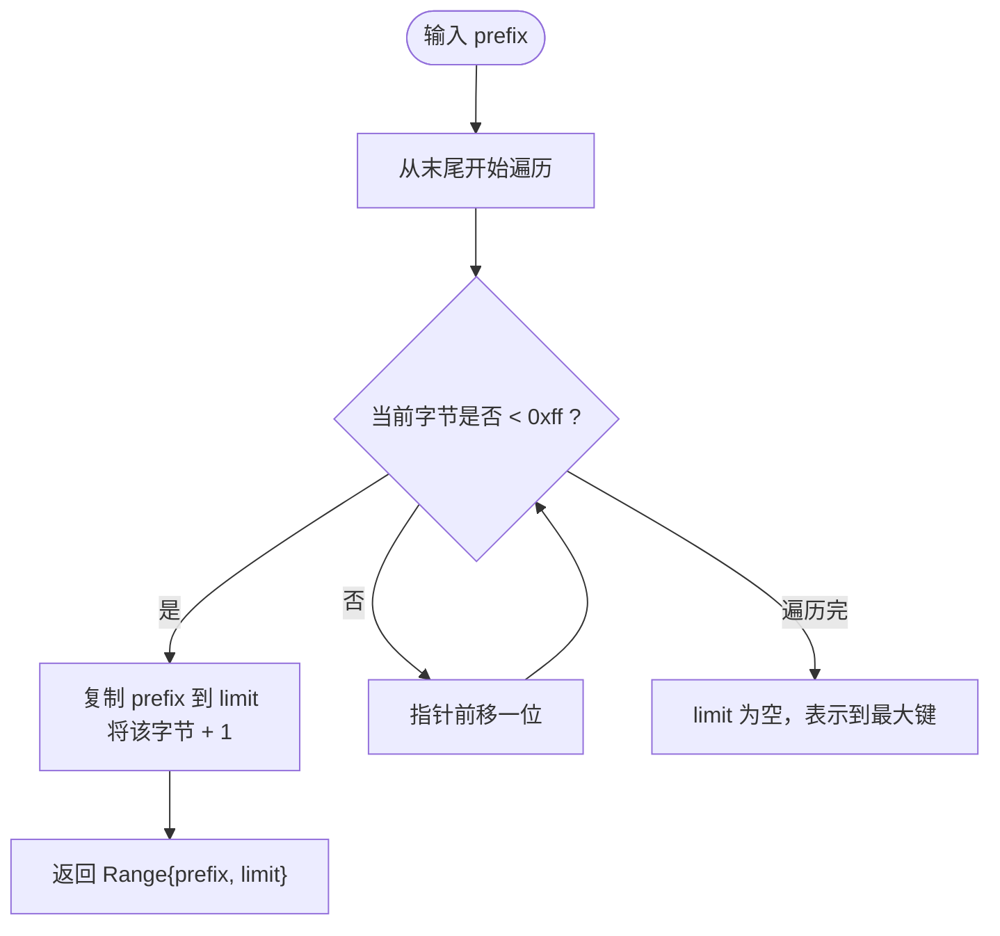
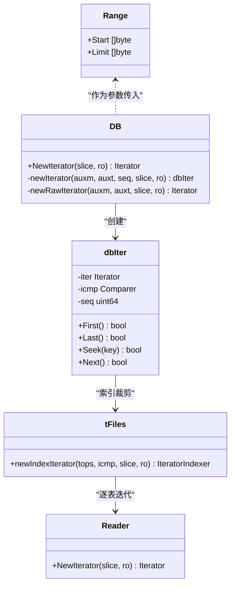
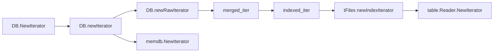
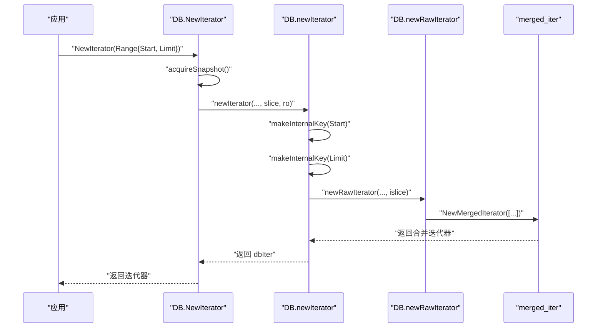

# 范围查询

<cite>
**本文引用的文件**
- [leveldb/util/range.go](file://leveldb/util/range.go)
- [leveldb/db.go](file://leveldb/db.go)
- [leveldb/db_iter.go](file://leveldb/db_iter.go)
- [leveldb/table.go](file://leveldb/table.go)
- [leveldb/table/reader.go](file://leveldb/table/reader.go)
- [leveldb/memdb/memdb.go](file://leveldb/memdb/memdb.go)
- [leveldb/iterator/merged_iter.go](file://leveldb/iterator/merged_iter.go)
- [leveldb/iterator/indexed_iter.go](file://leveldb/iterator/indexed_iter.go)
- [leveldb/db_test.go](file://leveldb/db_test.go)
- [leveldb/doc.go](file://leveldb/doc.go)
- [manualtest/dbstress/main.go](file://manualtest/dbstress/main.go)
</cite>

## 目录
1. [简介](#简介)
2. [项目结构](#项目结构)
3. [核心组件](#核心组件)
4. [架构总览](#架构总览)
5. [详细组件分析](#详细组件分析)
6. [依赖关系分析](#依赖关系分析)
7. [性能考量](#性能考量)
8. [故障排查指南](#故障排查指南)
9. [结论](#结论)
10. [附录](#附录)

## 简介
本篇文档围绕 avccDB 的范围查询能力，系统讲解 util.Range 与 util.BytesPrefix 的设计与使用，阐明如何通过 Start 与 Limit 边界实现高效的数据范围扫描；解释 Range 结构体中 Start 包含、Limit 不包含的半开区间语义；深入剖析 BytesPrefix 函数的实现原理（通过递增最后一个字节生成正确的 Limit 键）；结合 NewIterator 方法说明范围参数如何被转换为内部键进行查询；最后给出前缀遍历、区间查询与全表扫描的实践示例与性能特征。

## 项目结构
与范围查询直接相关的模块包括：
- util：定义 Range 与 BytesPrefix，提供范围构造工具
- DB 层：对外暴露 NewIterator 接口，负责快照与迭代器生命周期管理
- 迭代器层：dbIter 将外部 Range 转换为内部键范围，再委派给底层合并迭代器
- 表层：table/tFiles 在索引阶段按内部键裁剪 SST 文件集合，减少扫描范围
- 内存层：memdb 对内部键范围进行快速定位与遍历
- 迭代器组合：merged_iter 与 indexed_iter 组合多源数据流，统一输出有序结果

图表来源
- [leveldb/db.go](file://leveldb/db.go#L1219-L1229)
- [leveldb/db_iter.go](file://leveldb/db_iter.go#L30-L60)
- [leveldb/db_iter.go](file://leveldb/db_iter.go#L62-L90)
- [leveldb/table.go](file://leveldb/table.go#L285-L305)
- [leveldb/table/reader.go](file://leveldb/table/reader.go#L803-L823)
- [leveldb/memdb/memdb.go](file://leveldb/memdb/memdb.go#L406-L408)
- [leveldb/iterator/merged_iter.go](file://leveldb/iterator/merged_iter.go#L308-L316)
- [leveldb/iterator/indexed_iter.go](file://leveldb/iterator/indexed_iter.go#L238-L240)

章节来源
- [leveldb/db.go](file://leveldb/db.go#L1219-L1229)
- [leveldb/db_iter.go](file://leveldb/db_iter.go#L30-L60)
- [leveldb/db_iter.go](file://leveldb/db_iter.go#L62-L90)
- [leveldb/table.go](file://leveldb/table.go#L285-L305)
- [leveldb/table/reader.go](file://leveldb/table/reader.go#L803-L823)
- [leveldb/memdb/memdb.go](file://leveldb/memdb/memdb.go#L406-L408)
- [leveldb/iterator/merged_iter.go](file://leveldb/iterator/merged_iter.go#L308-L316)
- [leveldb/iterator/indexed_iter.go](file://leveldb/iterator/indexed_iter.go#L238-L240)

## 核心组件
- util.Range：描述半开区间 [Start, Limit)，Start 包含，Limit 不包含
- util.BytesPrefix：基于标准字节比较器，将前缀转换为 Range，自动计算 Limit
- DB.NewIterator：对外接口，返回带快照的迭代器
- DB.newIterator/newRawIterator：将外部 Range 转换为内部键范围，组装多源迭代器
- tFiles.newIndexIterator：在索引层按内部键裁剪 SST 集合，缩小扫描范围
- table.Reader.NewIterator：对单表构建索引迭代器，支持内部键范围
- memdb.NewIterator：对内存层按内部键范围进行定位与遍历

章节来源
- [leveldb/util/range.go](file://leveldb/util/range.go#L9-L16)
- [leveldb/util/range.go](file://leveldb/util/range.go#L18-L32)
- [leveldb/db.go](file://leveldb/db.go#L1219-L1229)
- [leveldb/db_iter.go](file://leveldb/db_iter.go#L30-L60)
- [leveldb/db_iter.go](file://leveldb/db_iter.go#L62-L90)
- [leveldb/table.go](file://leveldb/table.go#L285-L305)
- [leveldb/table/reader.go](file://leveldb/table/reader.go#L803-L823)
- [leveldb/memdb/memdb.go](file://leveldb/memdb/memdb.go#L406-L408)

## 架构总览
下图展示了从应用调用到最终输出键值对的完整流程，以及范围参数如何在各层之间传递与转换。

图表来源
- [leveldb/db.go](file://leveldb/db.go#L1219-L1229)
- [leveldb/db_iter.go](file://leveldb/db_iter.go#L30-L60)
- [leveldb/db_iter.go](file://leveldb/db_iter.go#L62-L90)
- [leveldb/table.go](file://leveldb/table.go#L285-L305)
- [leveldb/table/reader.go](file://leveldb/table/reader.go#L803-L823)
- [leveldb/iterator/merged_iter.go](file://leveldb/iterator/merged_iter.go#L308-L316)
- [leveldb/iterator/indexed_iter.go](file://leveldb/iterator/indexed_iter.go#L238-L240)

## 详细组件分析

### Range 半开区间语义与边界处理
- Start 包含：当外部 Range 指定 Start 时，内部会将其转换为内部键后作为起始位置
- Limit 不包含：Limit 同样转换为内部键，作为上界，不包含在结果集中
- 空边界语义：nil 的 Start 视为“比所有键更小”的键；nil 的 Limit 视为“比所有键更大”的键

章节来源
- [leveldb/util/range.go](file://leveldb/util/range.go#L9-L16)
- [leveldb/db_iter.go](file://leveldb/db_iter.go#L62-L90)
- [leveldb/db_iter.go](file://leveldb/db_iter.go#L30-L60)

### BytesPrefix 实现原理
BytesPrefix 的目标是将“以某前缀开头的所有键”转换为一个半开区间 [prefix, limit)。其实现思路如下：
- 从 prefix 的末尾开始向前扫描，找到第一个小于 0xff 的字节
- 将该字节加一，得到 limit 的前缀；其余高位保持不变
- 若 prefix 全部字节都是 0xff，则无法通过简单加一得到合法 limit，此时返回空 limit，表示“直到最大键”

图表来源
- [leveldb/util/range.go](file://leveldb/util/range.go#L18-L32)

章节来源
- [leveldb/util/range.go](file://leveldb/util/range.go#L18-L32)

### NewIterator 参数转换与内部键生成
- 外部 Range 被转换为内部键范围：Start/Limit 分别通过内部键构造函数生成内部键
- 内部键包含用户键与序列号等元信息，确保在多版本场景下正确排序与可见性
- 转换后的内部键范围随后用于：
  - memdb.NewIterator
  - tFiles.newIndexIterator
  - table.Reader.NewIterator

章节来源
- [leveldb/db_iter.go](file://leveldb/db_iter.go#L62-L90)
- [leveldb/db_iter.go](file://leveldb/db_iter.go#L30-L60)
- [leveldb/memdb/memdb.go](file://leveldb/memdb/memdb.go#L406-L408)
- [leveldb/table.go](file://leveldb/table.go#L285-L305)
- [leveldb/table/reader.go](file://leveldb/table/reader.go#L803-L823)

### 范围参数在索引层的裁剪
- tFiles.newIndexIterator 会根据内部键范围计算起止索引，仅保留与范围相交的 SST 文件
- 这一步显著减少需要打开与遍历的表数量，提升扫描效率

章节来源
- [leveldb/table.go](file://leveldb/table.go#L285-L305)

### 迭代器组合与输出
- DB.newRawIterator 会将内存层、冻结内存层、表层迭代器合并为单一有序流
- merged_iter 负责在多源有序流上进行归并，保证整体有序
- indexed_iter 为表层提供索引访问，加速定位

章节来源
- [leveldb/db_iter.go](file://leveldb/db_iter.go#L30-L60)
- [leveldb/iterator/merged_iter.go](file://leveldb/iterator/merged_iter.go#L308-L316)
- [leveldb/iterator/indexed_iter.go](file://leveldb/iterator/indexed_iter.go#L238-L240)

### 类关系图（代码级）

图表来源
- [leveldb/util/range.go](file://leveldb/util/range.go#L9-L16)
- [leveldb/db.go](file://leveldb/db.go#L1219-L1229)
- [leveldb/db_iter.go](file://leveldb/db_iter.go#L62-L90)
- [leveldb/table.go](file://leveldb/table.go#L285-L305)
- [leveldb/table/reader.go](file://leveldb/table/reader.go#L803-L823)

## 依赖关系分析
- DB.NewIterator 依赖 DB.newIterator 与 DB.newRawIterator
- DB.newIterator 依赖内部键构造函数，将外部 Range 转换为内部键范围
- DB.newRawIterator 依赖版本管理、内存层与表层迭代器，最终由 merged_iter 组合输出
- tFiles.newIndexIterator 依赖内部键比较器，按内部键裁剪 SST 集合
- table.Reader.NewIterator 依赖索引块与块迭代器，提供表内范围扫描

图表来源
- [leveldb/db.go](file://leveldb/db.go#L1219-L1229)
- [leveldb/db_iter.go](file://leveldb/db_iter.go#L30-L60)
- [leveldb/db_iter.go](file://leveldb/db_iter.go#L62-L90)
- [leveldb/table.go](file://leveldb/table.go#L285-L305)
- [leveldb/table/reader.go](file://leveldb/table/reader.go#L803-L823)
- [leveldb/memdb/memdb.go](file://leveldb/memdb/memdb.go#L406-L408)
- [leveldb/iterator/merged_iter.go](file://leveldb/iterator/merged_iter.go#L308-L316)
- [leveldb/iterator/indexed_iter.go](file://leveldb/iterator/indexed_iter.go#L238-L240)

## 性能考量
- 前缀遍历（BytesPrefix）
  - 优点：利用半开区间与内部键排序，避免全表扫描；BytesPrefix 自动计算 Limit，减少边界错误
  - 代价：若前缀极短或分布稀疏，可能仍需扫描较多 SST 文件
  - 场景：日志键、命名空间键、业务前缀键等
- 区间查询（自定义 Range）
  - 优点：可精确限定范围，索引层裁剪有效减少 IO
  - 注意：Start/Limit 必须为内部键格式，否则行为不可预期
  - 场景：时间范围、数值范围、分段统计等
- 全表扫描（nil Range）
  - 优点：最简单
  - 代价：IO 最大，建议配合读选项禁用缓存或限速策略
  - 场景：备份导出、统计汇总等一次性任务

[本节为通用性能讨论，无需列出具体文件来源]

## 故障排查指南
- 迭代器未释放
  - 现象：长时间运行后存活迭代器计数上升
  - 处理：确保每次使用后调用 Release
  - 参考：DB.NewIterator 文档注释明确要求释放迭代器
- 返回的切片内容不应修改
  - 现象：修改迭代器返回的 Key()/Value() 导致后续行为异常
  - 处理：如需保留，请复制一份
  - 参考：DB.NewIterator 注释说明
- BytesPrefix 无效或越界
  - 现象：前缀全为 0xff 时无法生成合法 Limit
  - 处理：检查前缀合法性；必要时改用自定义 Range 或调整前缀策略
- 读取选项影响
  - 现象：频繁读取导致缓存命中率低
  - 处理：合理设置 DontFillCache、Strict 等选项

章节来源
- [leveldb/db.go](file://leveldb/db.go#L1200-L1230)

## 结论
- util.Range 提供了清晰的半开区间语义，配合 BytesPrefix 可以高效表达“以某前缀开头”的查询需求
- DB.NewIterator 将外部 Range 转换为内部键范围，并通过索引裁剪与多源合并迭代器实现高性能扫描
- 在实际工程中，应优先采用 BytesPrefix 进行前缀遍历，或使用自定义 Range 精确控制区间范围，以获得最佳性能与可维护性

[本节为总结性内容，无需列出具体文件来源]

## 附录

### 使用示例路径（不含代码片段）
- 前缀遍历（快照）
  - 示例路径：[leveldb/db_test.go](file://leveldb/db_test.go#L2099-L2101)
  - 示例路径：[leveldb/db_test.go](file://leveldb/db_test.go#L2146-L2147)
  - 示例路径：[leveldb/db_test.go](file://leveldb/db_test.go#L2279-L2280)
- 前缀遍历（手动测试）
  - 示例路径：[manualtest/dbstress/main.go](file://manualtest/dbstress/main.go#L146-L152)
- 区间查询
  - 示例路径：[leveldb/doc.go](file://leveldb/doc.go#L63-L72)
- 全表扫描
  - 示例路径：[leveldb/doc.go](file://leveldb/doc.go#L54-L61)

### 关键流程时序图（范围参数转换）

图表来源
- [leveldb/db.go](file://leveldb/db.go#L1219-L1229)
- [leveldb/db_iter.go](file://leveldb/db_iter.go#L62-L90)
- [leveldb/db_iter.go](file://leveldb/db_iter.go#L30-L60)
- [leveldb/iterator/merged_iter.go](file://leveldb/iterator/merged_iter.go#L308-L316)