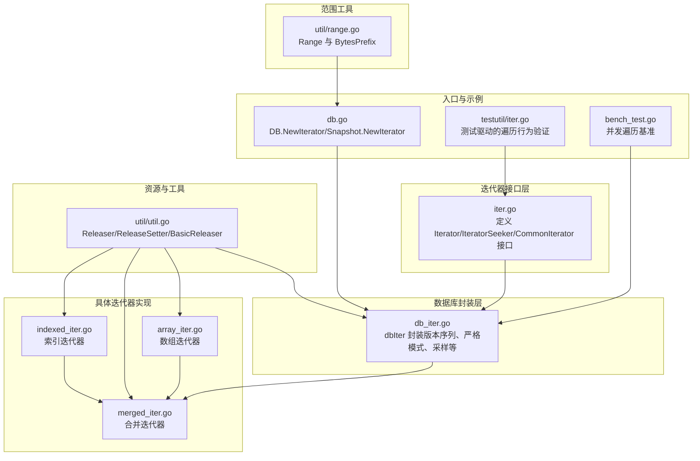
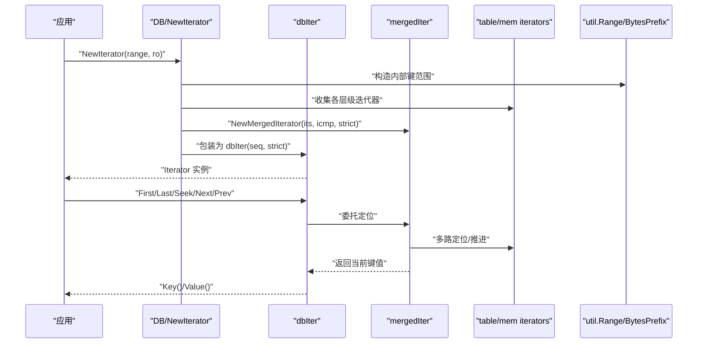
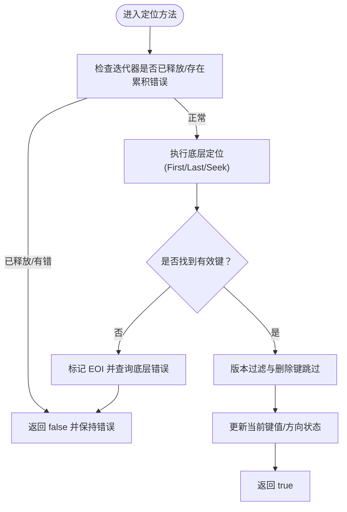
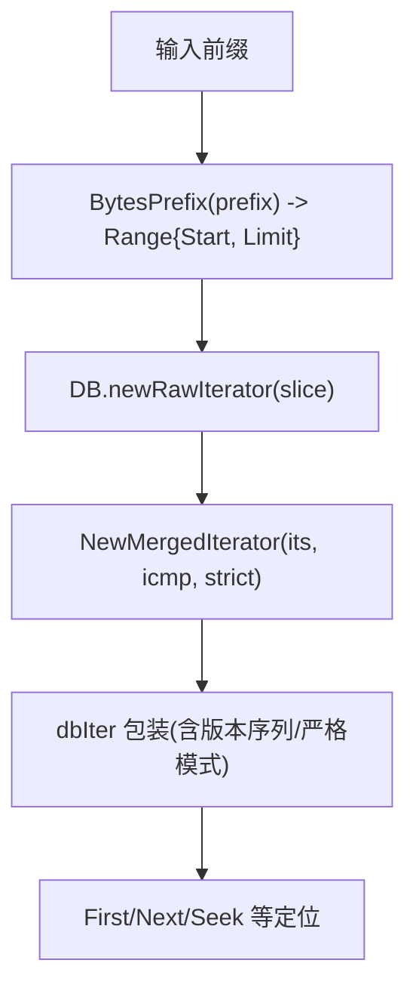
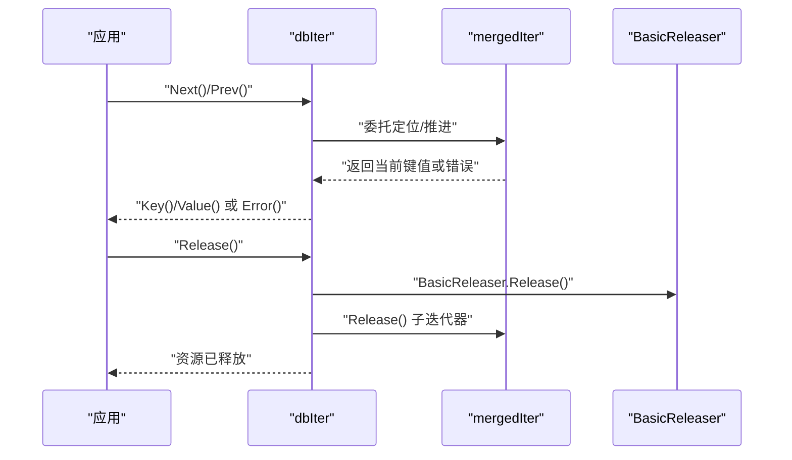
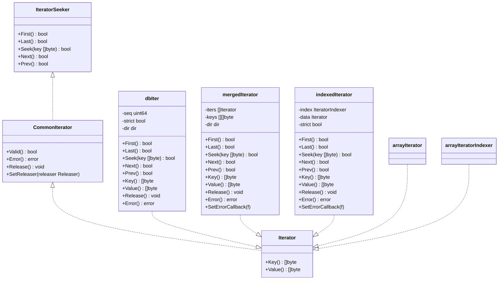
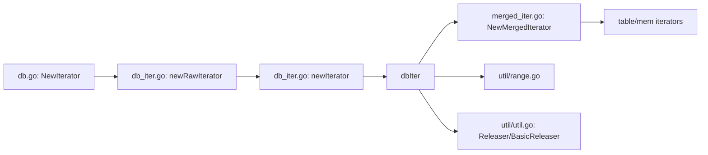

# 迭代器

<cite>
**本文引用的文件**
- [leveldb/iterator/iter.go](file://leveldb/iterator/iter.go)
- [leveldb/db_iter.go](file://leveldb/db_iter.go)
- [leveldb/util/range.go](file://leveldb/util/range.go)
- [leveldb/iterator/array_iter.go](file://leveldb/iterator/array_iter.go)
- [leveldb/iterator/merged_iter.go](file://leveldb/iterator/merged_iter.go)
- [leveldb/iterator/indexed_iter.go](file://leveldb/iterator/indexed_iter.go)
- [leveldb/util/util.go](file://leveldb/util/util.go)
- [leveldb/db.go](file://leveldb/db.go)
- [leveldb/testutil/iter.go](file://leveldb/testutil/iter.go)
- [leveldb/bench_test.go](file://leveldb/bench_test.go)
</cite>

## 目录
1. [简介](#简介)
2. [项目结构](#项目结构)
3. [核心组件](#核心组件)
4. [架构总览](#架构总览)
5. [详细组件分析](#详细组件分析)
6. [依赖关系分析](#依赖关系分析)
7. [性能考量](#性能考量)
8. [故障排查指南](#故障排查指南)
9. [结论](#结论)
10. [附录](#附录)

## 简介
本文件系统性阐述 avccDB 的迭代器体系，围绕 Iterator 接口及其子类，详解定位方法（First、Last、Seek、Next、Prev）的工作原理与使用场景；深入解析范围查询（util.Range 与 util.BytesPrefix）的实现与应用；结合测试与基准用例说明全量遍历、前缀遍历与精确范围查询的实现方式；最后聚焦迭代器生命周期管理（Next 调用模式、Release 资源释放、Error 错误处理），兼顾初学者与高级用户的理解需求。

## 项目结构
迭代器相关代码主要分布在以下模块：
- 接口与基础能力：leveldb/iterator/iter.go
- 数据库层迭代器封装：leveldb/db_iter.go
- 范围工具：leveldb/util/range.go
- 基础数组迭代器：leveldb/iterator/array_iter.go
- 合并迭代器：leveldb/iterator/merged_iter.go
- 索引迭代器：leveldb/iterator/indexed_iter.go
- 资源释放工具：leveldb/util/util.go
- 对外入口与示例：leveldb/db.go、leveldb/testutil/iter.go、leveldb/bench_test.go

图表来源
- [leveldb/iterator/iter.go](file://leveldb/iterator/iter.go#L1-L133)
- [leveldb/db_iter.go](file://leveldb/db_iter.go#L1-L120)
- [leveldb/util/range.go](file://leveldb/util/range.go#L1-L33)
- [leveldb/iterator/array_iter.go](file://leveldb/iterator/array_iter.go#L1-L182)
- [leveldb/iterator/merged_iter.go](file://leveldb/iterator/merged_iter.go#L1-L351)
- [leveldb/iterator/indexed_iter.go](file://leveldb/iterator/indexed_iter.go#L1-L242)
- [leveldb/util/util.go](file://leveldb/util/util.go#L1-L74)
- [leveldb/db.go](file://leveldb/db.go#L1215-L1230)
- [leveldb/testutil/iter.go](file://leveldb/testutil/iter.go#L1-L328)
- [leveldb/bench_test.go](file://leveldb/bench_test.go#L461-L507)

章节来源
- [leveldb/iterator/iter.go](file://leveldb/iterator/iter.go#L1-L133)
- [leveldb/db_iter.go](file://leveldb/db_iter.go#L1-L120)
- [leveldb/util/range.go](file://leveldb/util/range.go#L1-L33)
- [leveldb/iterator/array_iter.go](file://leveldb/iterator/array_iter.go#L1-L182)
- [leveldb/iterator/merged_iter.go](file://leveldb/iterator/merged_iter.go#L1-L351)
- [leveldb/iterator/indexed_iter.go](file://leveldb/iterator/indexed_iter.go#L1-L242)
- [leveldb/util/util.go](file://leveldb/util/util.go#L1-L74)
- [leveldb/db.go](file://leveldb/db.go#L1215-L1230)
- [leveldb/testutil/iter.go](file://leveldb/testutil/iter.go#L1-L328)
- [leveldb/bench_test.go](file://leveldb/bench_test.go#L461-L507)

## 核心组件
- 接口族
  - IteratorSeeker：提供 First、Last、Seek、Next、Prev 定位方法
  - CommonIterator：在定位方法基础上增加 Valid、Error、Releaser、ReleaseSetter
  - Iterator：在 CommonIterator 基础上增加 Key、Value
- dbIter：数据库层迭代器，负责版本序列过滤、严格模式、方向状态、采样触发等
- 具体实现
  - 数组迭代器：基于有序数组的随机访问与顺序遍历
  - 合并迭代器：多路归并，按比较器顺序输出
  - 索引迭代器：索引层返回数据迭代器，逐个展开
- 范围工具
  - Range：起止闭区间定义
  - BytesPrefix：基于字节比较器的前缀范围构造

章节来源
- [leveldb/iterator/iter.go](file://leveldb/iterator/iter.go#L21-L133)
- [leveldb/db_iter.go](file://leveldb/db_iter.go#L97-L122)
- [leveldb/util/range.go](file://leveldb/util/range.go#L9-L33)
- [leveldb/iterator/array_iter.go](file://leveldb/iterator/array_iter.go#L13-L37)
- [leveldb/iterator/merged_iter.go](file://leveldb/iterator/merged_iter.go#L17-L41)
- [leveldb/iterator/indexed_iter.go](file://leveldb/iterator/indexed_iter.go#L14-L32)

## 架构总览
下图展示从 DB 层到具体迭代器的调用链与职责分工。

图表来源
- [leveldb/db.go](file://leveldb/db.go#L1215-L1230)
- [leveldb/db_iter.go](file://leveldb/db_iter.go#L31-L91)
- [leveldb/iterator/merged_iter.go](file://leveldb/iterator/merged_iter.go#L299-L317)
- [leveldb/util/range.go](file://leveldb/util/range.go#L9-L33)

## 详细组件分析

### 定位方法工作原理与使用场景
- First/Last
  - First：移动到最小键位置，随后通过内部循环跳过删除键、保留最新版本键，并记录当前键值
  - Last：移动到最大键位置，随后反向推进，同样进行删除键跳过与版本选择
- Seek
  - 将外部键转换为内部键后定位，再进入与 Next 类似的版本过滤流程
- Next/Prev
  - Next：向前推进，遇到删除键则跳过，遇到新键或相同键的新版本时更新当前键值
  - Prev：向后推进，逻辑类似 Last 的逆向过程
- 使用场景
  - 全量遍历：配合 First/Next 或 Last/Prev
  - 范围扫描：先 Seek 到起始键，再循环 Next
  - 反向扫描：先 Last/Prev，再循环 Next（注意方向状态）

图表来源
- [leveldb/db_iter.go](file://leveldb/db_iter.go#L149-L202)
- [leveldb/db_iter.go](file://leveldb/db_iter.go#L204-L244)
- [leveldb/db_iter.go](file://leveldb/db_iter.go#L246-L344)

章节来源
- [leveldb/db_iter.go](file://leveldb/db_iter.go#L149-L344)

### 范围查询：util.Range 与 util.BytesPrefix
- Range
  - Start：包含；Limit：不包含
  - 用于限定遍历的起止范围
- BytesPrefix
  - 基于标准字节比较器，将前缀转换为“下一个字节序列”的上界，形成闭起点开终点的范围
- 在 DB 层的应用
  - DB.NewIterator 接收 *util.Range，内部将其转换为内部键范围后再传入底层迭代器
  - Snapshot.NewIterator 同理

图表来源
- [leveldb/util/range.go](file://leveldb/util/range.go#L9-L33)
- [leveldb/db_iter.go](file://leveldb/db_iter.go#L63-L91)
- [leveldb/db.go](file://leveldb/db.go#L1215-L1230)

章节来源
- [leveldb/util/range.go](file://leveldb/util/range.go#L9-L33)
- [leveldb/db_iter.go](file://leveldb/db_iter.go#L63-L91)
- [leveldb/db.go](file://leveldb/db.go#L1215-L1230)

### 全量遍历、前缀遍历与精确范围查询
- 全量遍历
  - 使用 DB.NewIterator(nil, ro) 获取完整快照迭代器
  - 通过 First/Next 或 Last/Prev 循环遍历
- 前缀遍历
  - 使用 util.BytesPrefix(prefix) 构造 Range，传入 DB.NewIterator
  - 通过 First/Next 遍历该前缀范围内的键
- 精确范围查询
  - 使用 util.Range{Start: s, Limit: l} 构造范围
  - 通过 Seek(s)/Next 遍历至 Limit 前结束

章节来源
- [leveldb/db.go](file://leveldb/db.go#L1215-L1230)
- [leveldb/util/range.go](file://leveldb/util/range.go#L9-L33)
- [leveldb/testutil/iter.go](file://leveldb/testutil/iter.go#L1-L328)

### 迭代器生命周期管理
- Next 方法的调用模式
  - 每次调用 Next/Prev 后，Key()/Value() 返回当前键值
  - 当返回 false 时，表示到达边界（SOI/EOI）
- Release 资源释放机制
  - dbIter.Release：清理 finalizer、调用关联 Releaser、置空内部迭代器、原子计数减一
  - 合并/索引迭代器会递归释放其持有的子迭代器
  - BasicReleaser 提供统一的释放与重复释放安全保证
- Error 方法的错误处理
  - dbIter.Error 返回累积错误；当底层迭代器出现错误时，dbIter 会设置错误并清空当前键值
  - 严格模式下，合并/索引迭代器对损坏错误会直接中断并上报

图表来源
- [leveldb/db_iter.go](file://leveldb/db_iter.go#L360-L393)
- [leveldb/iterator/merged_iter.go](file://leveldb/iterator/merged_iter.go#L261-L275)
- [leveldb/util/util.go](file://leveldb/util/util.go#L38-L74)

章节来源
- [leveldb/db_iter.go](file://leveldb/db_iter.go#L360-L393)
- [leveldb/iterator/merged_iter.go](file://leveldb/iterator/merged_iter.go#L261-L275)
- [leveldb/util/util.go](file://leveldb/util/util.go#L38-L74)

### 具体迭代器实现要点

#### 数组迭代器（Array/ArrayIndexer）
- 通过数组的长度与二分搜索定位，支持顺序推进
- 支持 Index/Get 形式，分别返回键值或数据迭代器

章节来源
- [leveldb/iterator/array_iter.go](file://leveldb/iterator/array_iter.go#L13-L37)
- [leveldb/iterator/array_iter.go](file://leveldb/iterator/array_iter.go#L39-L182)

#### 合并迭代器（MergedIterator）
- 多路迭代器堆排序，按比较器顺序输出
- 支持严格模式：损坏错误可导致提前终止
- 提供 SetErrorCallback 以捕获底层错误

章节来源
- [leveldb/iterator/merged_iter.go](file://leveldb/iterator/merged_iter.go#L17-L41)
- [leveldb/iterator/merged_iter.go](file://leveldb/iterator/merged_iter.go#L50-L91)
- [leveldb/iterator/merged_iter.go](file://leveldb/iterator/merged_iter.go#L119-L143)
- [leveldb/iterator/merged_iter.go](file://leveldb/iterator/merged_iter.go#L145-L245)
- [leveldb/iterator/merged_iter.go](file://leveldb/iterator/merged_iter.go#L291-L317)

#### 索引迭代器（IndexedIterator）
- 索引层返回数据迭代器，逐个展开
- 支持严格模式：索引层错误不可忽略，数据层损坏错误可按严格模式处理

章节来源
- [leveldb/iterator/indexed_iter.go](file://leveldb/iterator/indexed_iter.go#L14-L32)
- [leveldb/iterator/indexed_iter.go](file://leveldb/iterator/indexed_iter.go#L70-L113)
- [leveldb/iterator/indexed_iter.go](file://leveldb/iterator/indexed_iter.go#L115-L163)
- [leveldb/iterator/indexed_iter.go](file://leveldb/iterator/indexed_iter.go#L165-L195)
- [leveldb/iterator/indexed_iter.go](file://leveldb/iterator/indexed_iter.go#L211-L242)

### 类型关系与继承

图表来源
- [leveldb/iterator/iter.go](file://leveldb/iterator/iter.go#L21-L133)
- [leveldb/db_iter.go](file://leveldb/db_iter.go#L97-L122)
- [leveldb/iterator/merged_iter.go](file://leveldb/iterator/merged_iter.go#L27-L41)
- [leveldb/iterator/indexed_iter.go](file://leveldb/iterator/indexed_iter.go#L24-L32)
- [leveldb/iterator/array_iter.go](file://leveldb/iterator/array_iter.go#L124-L182)

## 依赖关系分析
- DB 层通过 DB.newIterator/newRawIterator 组装底层迭代器，并以 NewMergedIterator 合并
- dbIter 作为外观对象，负责版本序列过滤、严格模式、方向状态与采样
- util.Range/BytesPrefix 仅影响范围切片，不改变迭代器接口语义
- 资源释放通过 util.Releaser/ReleaseSetter 与 BasicReleaser 统一管理

图表来源
- [leveldb/db.go](file://leveldb/db.go#L1215-L1230)
- [leveldb/db_iter.go](file://leveldb/db_iter.go#L31-L91)
- [leveldb/util/range.go](file://leveldb/util/range.go#L9-L33)
- [leveldb/util/util.go](file://leveldb/util/util.go#L19-L74)

章节来源
- [leveldb/db.go](file://leveldb/db.go#L1215-L1230)
- [leveldb/db_iter.go](file://leveldb/db_iter.go#L31-L91)
- [leveldb/util/range.go](file://leveldb/util/range.go#L9-L33)
- [leveldb/util/util.go](file://leveldb/util/util.go#L19-L74)

## 性能考量
- 采样触发：dbIter.sampleSeek 基于键值大小动态采样，减少不必要的 compaction 触发
- 并发遍历：基准测试展示了多 goroutine 下的并发遍历模式，建议每个 goroutine 使用独立迭代器
- 严格模式：严格模式下损坏错误会阻断迭代，避免污染结果，但可能降低吞吐

章节来源
- [leveldb/db_iter.go](file://leveldb/db_iter.go#L124-L135)
- [leveldb/bench_test.go](file://leveldb/bench_test.go#L461-L507)

## 故障排查指南
- 常见错误
  - ErrIterReleased：迭代器已释放仍被调用
  - 底层错误：通过 Error() 查询，严格模式下会直接中断
- 排查步骤
  - 确认迭代器未被提前 Release
  - 在每次定位后检查 Error() 是否为空
  - 若需要跨并发共享，确保每个 goroutine 拥有独立迭代器实例
- 测试参考
  - testutil/iter.go 提供了丰富的遍历行为验证与边界条件覆盖

章节来源
- [leveldb/iterator/iter.go](file://leveldb/iterator/iter.go#L17-L20)
- [leveldb/db_iter.go](file://leveldb/db_iter.go#L137-L147)
- [leveldb/testutil/iter.go](file://leveldb/testutil/iter.go#L1-L328)

## 结论
avccDB 的迭代器体系以统一接口为核心，通过 dbIter 封装版本序列与严格模式，借助合并/索引/数组等具体实现满足多样遍历需求。范围查询由 util.Range 与 util.BytesPrefix 提供简洁表达。生命周期管理强调显式释放与错误查询，配合严格模式与采样策略，既保证正确性也兼顾性能。初学者可从全量遍历与前缀遍历入手，进阶用户可利用合并/索引迭代器与范围裁剪实现复杂查询模式。

## 附录
- 示例路径（非代码片段）
  - 全量遍历：参见 [leveldb/db.go](file://leveldb/db.go#L1215-L1230) 中 NewIterator 的使用
  - 前缀遍历：参见 [leveldb/util/range.go](file://leveldb/util/range.go#L18-L33) 与 [leveldb/db_iter.go](file://leveldb/db_iter.go#L63-L91)
  - 精确范围查询：参见 [leveldb/util/range.go](file://leveldb/util/range.go#L9-L17) 与 [leveldb/testutil/iter.go](file://leveldb/testutil/iter.go#L175-L230)
  - 并发遍历基准：参见 [leveldb/bench_test.go](file://leveldb/bench_test.go#L461-L507)