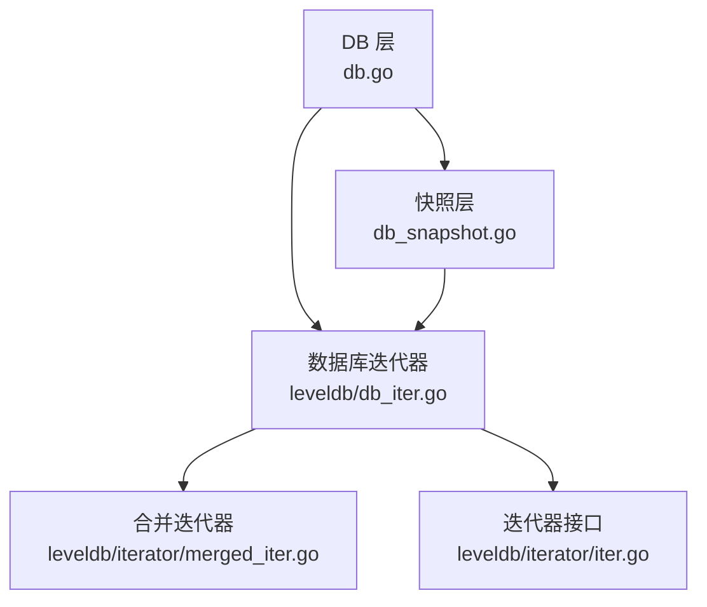
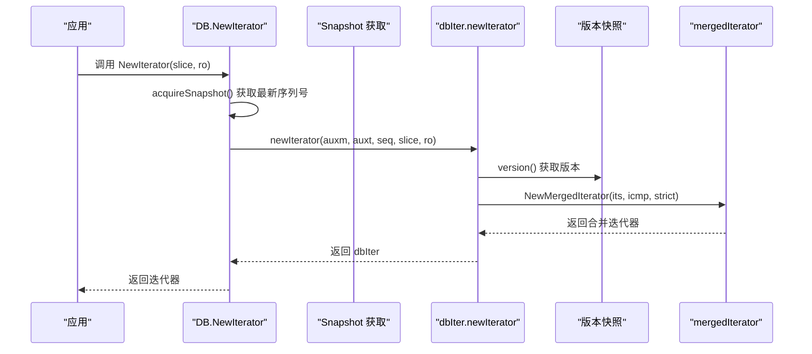
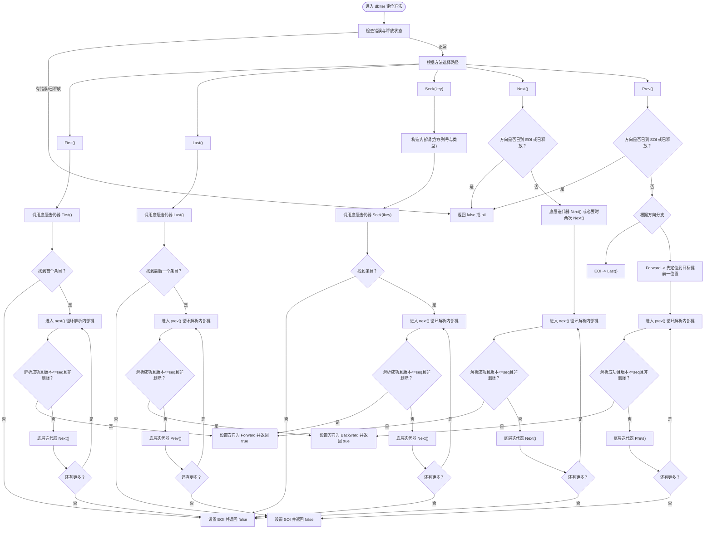
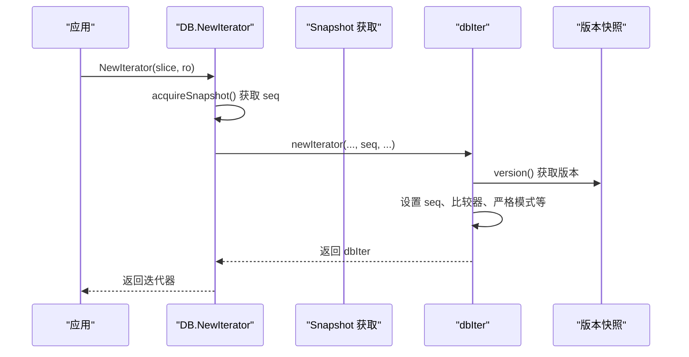
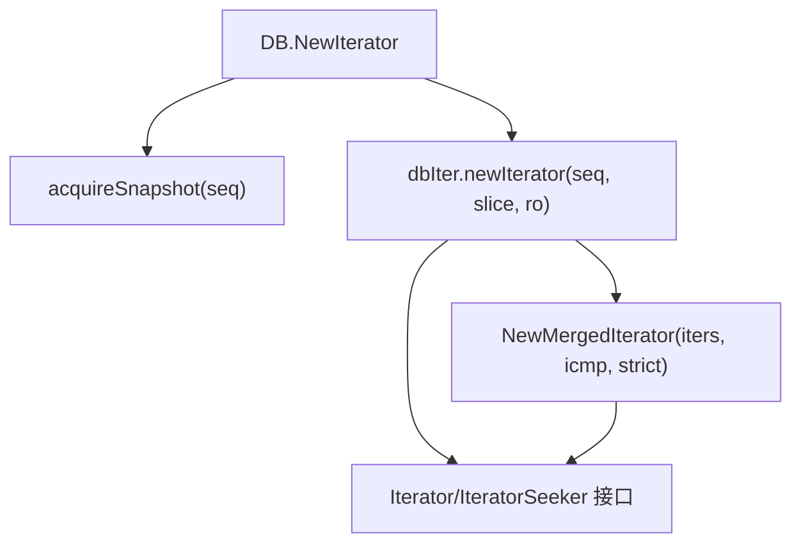

# 迭代器基础

<cite>
**本文引用的文件**
- [leveldb/db_iter.go](file://leveldb/db_iter.go)
- [leveldb/iterator/iter.go](file://leveldb/iterator/iter.go)
- [leveldb/db.go](file://leveldb/db.go)
- [leveldb/db_snapshot.go](file://leveldb/db_snapshot.go)
- [leveldb/iterator/merged_iter.go](file://leveldb/iterator/merged_iter.go)
- [leveldb/testutil/iter.go](file://leveldb/testutil/iter.go)
</cite>

## 目录
1. [简介](#简介)
2. [项目结构](#项目结构)
3. [核心组件](#核心组件)
4. [架构总览](#架构总览)
5. [详细组件分析](#详细组件分析)
6. [依赖关系分析](#依赖关系分析)
7. [性能考量](#性能考量)
8. [故障排查指南](#故障排查指南)
9. [结论](#结论)
10. [附录](#附录)

## 简介
本篇文档围绕 avccDB 的迭代器基础操作展开，重点讲解 Iterator 接口的核心定位方法：First、Last、Seek、Next 和 Prev 的工作机制与使用场景。我们将结合 db.go 中 NewIterator 的实现，说明迭代器如何与数据库版本快照协同工作；并深入解析 Seek 方法的语义（定位到第一个键大于或等于给定键的键值对），以及它在范围查询中的基础作用。最后提供初学者友好的使用示例与常见误区提示，帮助读者正确地进行全表遍历与精确查找。

## 项目结构
avccDB 的迭代器相关代码主要分布在以下模块：
- 数据库层：db.go 提供对外的 NewIterator 接口，内部通过快照序列号控制可见性。
- 快照层：db_snapshot.go 负责生成与释放快照，确保迭代器视图稳定。
- 迭代器接口层：iterator/iter.go 定义了 Iterator/IteratorSeeker 接口及通用行为。
- 合并迭代器：iterator/merged_iter.go 实现多路合并迭代器，作为底层迭代器的组合器。
- 数据库迭代器实现：leveldb/db_iter.go 提供基于版本快照的数据库级迭代器 dbIter，包含 First、Last、Seek、Next、Prev 的具体逻辑。

图表来源
- [leveldb/db.go](file://leveldb/db.go#L1200-L1230)
- [leveldb/db_snapshot.go](file://leveldb/db_snapshot.go#L133-L166)
- [leveldb/db_iter.go](file://leveldb/db_iter.go#L31-L61)
- [leveldb/iterator/merged_iter.go](file://leveldb/iterator/merged_iter.go#L299-L317)
- [leveldb/iterator/iter.go](file://leveldb/iterator/iter.go#L21-L96)

章节来源
- [leveldb/db.go](file://leveldb/db.go#L1200-L1230)
- [leveldb/db_snapshot.go](file://leveldb/db_snapshot.go#L133-L166)
- [leveldb/db_iter.go](file://leveldb/db_iter.go#L31-L61)
- [leveldb/iterator/merged_iter.go](file://leveldb/iterator/merged_iter.go#L299-L317)
- [leveldb/iterator/iter.go](file://leveldb/iterator/iter.go#L21-L96)

## 核心组件
- Iterator/IteratorSeeker 接口：定义了 First、Last、Seek、Next、Prev 等定位方法，以及 Key、Value、Valid、Error、Release 等通用能力。
- dbIter：数据库级迭代器，封装了版本序列号、比较器、底层迭代器、采样策略等，实现了上述定位方法。
- 合并迭代器 mergedIterator：将多个子迭代器按键序合并，Seek/Next/Prev 基于堆维护当前最小键。
- 快照 Snapshot：提供一致的数据库视图，NewIterator 在创建时获取最新快照并持有其序列号。

章节来源
- [leveldb/iterator/iter.go](file://leveldb/iterator/iter.go#L21-L96)
- [leveldb/db_iter.go](file://leveldb/db_iter.go#L107-L122)
- [leveldb/iterator/merged_iter.go](file://leveldb/iterator/merged_iter.go#L27-L41)
- [leveldb/db_snapshot.go](file://leveldb/db_snapshot.go#L133-L166)

## 架构总览
下图展示了从应用调用 NewIterator 到最终定位到键值对的关键流程，以及快照与版本的关系。

图表来源
- [leveldb/db.go](file://leveldb/db.go#L1200-L1230)
- [leveldb/db_snapshot.go](file://leveldb/db_snapshot.go#L27-L46)
- [leveldb/db_iter.go](file://leveldb/db_iter.go#L63-L91)
- [leveldb/iterator/merged_iter.go](file://leveldb/iterator/merged_iter.go#L299-L317)

## 详细组件分析

### Iterator 接口与核心定位方法
- First：移动到第一个键值对；若无则返回 false。
- Last：移动到最后一个键值对；若无则返回 false。
- Seek(key)：移动到第一个键大于或等于给定 key 的键值对；返回是否存在该键值对。
- Next：向前移动到下一个键值对；返回是否到达末尾。
- Prev：向后移动到上一个键值对；返回是否到达开头。

这些方法在接口层面定义了统一的行为契约，具体实现由 dbIter 等类型完成。

章节来源
- [leveldb/iterator/iter.go](file://leveldb/iterator/iter.go#L21-L49)

### dbIter 的定位方法实现要点
- First/Last：委托底层迭代器 First/Last，然后进入 next()/prev() 循环以过滤删除键、版本号、用户键比较等，直到找到有效键值对或到达边界。
- Seek：将传入 key 封装为内部键（携带序列号与类型），调用底层迭代器 Seek，再进入 next() 以满足版本与去重要求。
- Next/Prev：在方向切换时处理边界状态，循环解析内部键，跳过删除项，保留最新版本，更新当前键值对。
- Key/Value：仅在 Valid() 且未释放时返回当前键值对，否则返回 nil。

图表来源
- [leveldb/db_iter.go](file://leveldb/db_iter.go#L149-L393)

章节来源
- [leveldb/db_iter.go](file://leveldb/db_iter.go#L149-L393)

### Seek 方法的语义与范围查询基础
- 语义：Seek(key) 定位到第一个键大于或等于给定 key 的键值对。对于数据库迭代器，会先将 key 封装为内部键（携带序列号与类型），再调用底层迭代器 Seek。
- 版本过滤：即使底层迭代器定位到了目标键，dbIter 的 next()/prev() 循环还会根据版本号（<= seq）与键类型（跳过删除项）进一步筛选，确保返回的是“可见”的最新版本键值对。
- 范围查询基础：由于 Seek 具备“>= key”的定位能力，结合 First/Last 与 Next/Prev，可实现任意范围的顺序遍历。例如：
  - 全表遍历：First() 后循环 Next()。
  - 精确查找：Seek(key) 后判断 Key() 是否等于 key。
  - 前缀扫描：Seek(prefix) 后循环 Next() 直到 Key() 不再以 prefix 开头。

章节来源
- [leveldb/db_iter.go](file://leveldb/db_iter.go#L186-L202)
- [leveldb/iterator/iter.go](file://leveldb/iterator/iter.go#L35-L40)

### 迭代器与数据库版本快照协同
- NewIterator：在创建迭代器前，DB 会获取一个最新快照（acquireSnapshot），并将该快照的序列号 seq 传递给 dbIter。dbIter 在 Seek/遍历时始终以该 seq 为上限过滤版本，从而保证视图一致性。
- 快照释放：DB 在创建迭代器后即可释放快照句柄，但迭代器内部仍持有版本引用（versionReleaser），确保在迭代期间版本不会被回收。
- Snapshot.NewIterator：快照对象也提供 NewIterator，其行为与 DB.NewIterator 类似，但直接使用快照持有的序列号。

图表来源
- [leveldb/db.go](file://leveldb/db.go#L1200-L1230)
- [leveldb/db_snapshot.go](file://leveldb/db_snapshot.go#L27-L46)
- [leveldb/db_iter.go](file://leveldb/db_iter.go#L63-L91)

章节来源
- [leveldb/db.go](file://leveldb/db.go#L1200-L1230)
- [leveldb/db_snapshot.go](file://leveldb/db_snapshot.go#L133-L166)
- [leveldb/db_iter.go](file://leveldb/db_iter.go#L63-L91)

### 合并迭代器与多源遍历
- mergedIterator 将多个子迭代器按键序合并，Seek/Next/Prev 基于堆维护当前最小键索引，依次输出各子迭代器的键值对。
- 对于数据库迭代器，底层会将内存表、辅助表、主版本表等多路迭代器合并，形成统一的键序视图，再由 dbIter 进行版本过滤与去重。

章节来源
- [leveldb/iterator/merged_iter.go](file://leveldb/iterator/merged_iter.go#L27-L41)
- [leveldb/iterator/merged_iter.go](file://leveldb/iterator/merged_iter.go#L119-L143)
- [leveldb/iterator/merged_iter.go](file://leveldb/iterator/merged_iter.go#L145-L187)
- [leveldb/iterator/merged_iter.go](file://leveldb/iterator/merged_iter.go#L189-L245)
- [leveldb/db_iter.go](file://leveldb/db_iter.go#L31-L61)

### 使用示例与最佳实践
- 全表遍历
  - 步骤：NewIterator(nil, ro) -> First() -> 循环 Next() -> Release()
  - 注意：每次调用 Next() 后，Key()/Value() 仅在 Valid() 且未释放时有效。
- 精确查找
  - 步骤：NewIterator(nil, ro) -> Seek(key) -> 比较 Key() 是否等于 key -> Release()
  - 注意：Seek(key) 可能定位到大于等于 key 的第一个键，需显式比较确认。
- 范围查询
  - 步骤：NewIterator(range, ro) -> Seek(range.Start) -> 循环 Next() 直到 Key() 超出 range.Limit -> Release()

章节来源
- [leveldb/testutil/iter.go](file://leveldb/testutil/iter.go#L107-L173)
- [leveldb/testutil/iter.go](file://leveldb/testutil/iter.go#L175-L229)
- [leveldb/db.go](file://leveldb/db.go#L1200-L1230)

### 常见误区与注意事项
- 在 Next/Prev 返回 false 后继续调用 Key()/Value()：此时迭代器处于 EOI/SOI 边界，Key()/Value() 返回 nil，应停止使用并检查 Valid() 或 Error()。
- 未释放迭代器：每次使用后必须调用 Release()，避免资源泄漏与统计计数异常。
- 快照与迭代器生命周期：快照释放并不影响已创建的迭代器，迭代器内部持有版本引用，直至 Release()。
- 错误处理：迭代器遇到错误时会标记错误并在后续调用中返回 false，应通过 Error() 查询并处理。

章节来源
- [leveldb/db_iter.go](file://leveldb/db_iter.go#L149-L170)
- [leveldb/db_iter.go](file://leveldb/db_iter.go#L346-L358)
- [leveldb/db_iter.go](file://leveldb/db_iter.go#L390-L393)
- [leveldb/iterator/iter.go](file://leveldb/iterator/iter.go#L72-L96)

## 依赖关系分析
- DB.NewIterator 依赖快照序列号与版本快照，确保迭代器视图稳定。
- dbIter 依赖合并迭代器 mergedIterator 与比较器，负责版本过滤与方向控制。
- 迭代器接口定义了统一契约，便于替换底层实现。

图表来源
- [leveldb/db.go](file://leveldb/db.go#L1200-L1230)
- [leveldb/db_snapshot.go](file://leveldb/db_snapshot.go#L27-L46)
- [leveldb/db_iter.go](file://leveldb/db_iter.go#L63-L91)
- [leveldb/iterator/merged_iter.go](file://leveldb/iterator/merged_iter.go#L299-L317)
- [leveldb/iterator/iter.go](file://leveldb/iterator/iter.go#L21-L96)

章节来源
- [leveldb/db.go](file://leveldb/db.go#L1200-L1230)
- [leveldb/db_iter.go](file://leveldb/db_iter.go#L63-L91)
- [leveldb/iterator/merged_iter.go](file://leveldb/iterator/merged_iter.go#L299-L317)
- [leveldb/iterator/iter.go](file://leveldb/iterator/iter.go#L21-L96)

## 性能考量
- 采样与随机化：dbIter 支持采样策略，通过随机采样触发 seek 统计，有助于评估访问热点与优化策略。
- 合并迭代器的堆操作：mergedIterator 的 Seek/Next/Prev 基于堆，时间复杂度与输入迭代器数量相关，建议合理组织输入以减少合并成本。
- 版本过滤开销：每次定位后仍需解析内部键、比较版本与类型，注意批量遍历时的 CPU 消耗。

章节来源
- [leveldb/db_iter.go](file://leveldb/db_iter.go#L93-L95)
- [leveldb/db_iter.go](file://leveldb/db_iter.go#L124-L135)
- [leveldb/iterator/merged_iter.go](file://leveldb/iterator/merged_iter.go#L145-L187)

## 故障排查指南
- 迭代器返回 false 但仍需检查 Error()：某些情况下迭代器可能因底层错误而失败，应通过 Error() 获取具体原因。
- Key()/Value() 返回 nil：通常发生在迭代器无效或已释放，应先调用 Valid() 或检查 Error()。
- 并发安全：迭代器不保证并发安全，应在专用 goroutine 中使用；同时修改数据库与并发使用同一迭代器可能导致不可预期结果。

章节来源
- [leveldb/db_iter.go](file://leveldb/db_iter.go#L149-L170)
- [leveldb/db_iter.go](file://leveldb/db_iter.go#L346-L358)
- [leveldb/iterator/iter.go](file://leveldb/iterator/iter.go#L72-L96)

## 结论
avccDB 的迭代器体系通过快照序列号与版本过滤，确保了稳定的视图一致性；通过合并迭代器实现了多源键序整合；通过统一的 Iterator 接口，First/Last/Seek/Next/Prev 提供了强大的定位与遍历能力。理解 Seek 的“>= key”语义及其与版本过滤的配合，是实现高效范围查询与精确查找的关键。遵循正确的使用模式与错误处理策略，可显著提升遍历性能与稳定性。

## 附录
- 初学者使用清单
  - 全表遍历：NewIterator -> First -> 循环 Next -> Release
  - 精确查找：NewIterator -> Seek(key) -> 比较 Key() -> Release
  - 范围查询：NewIterator(range) -> Seek(range.Start) -> 循环 Next -> Release
  - 错误处理：每次调用后检查 Error()，在 Valid() 为真时使用 Key()/Value()
  - 资源管理：务必调用 Release() 释放迭代器

章节来源
- [leveldb/testutil/iter.go](file://leveldb/testutil/iter.go#L107-L173)
- [leveldb/testutil/iter.go](file://leveldb/testutil/iter.go#L175-L229)
- [leveldb/db.go](file://leveldb/db.go#L1200-L1230)