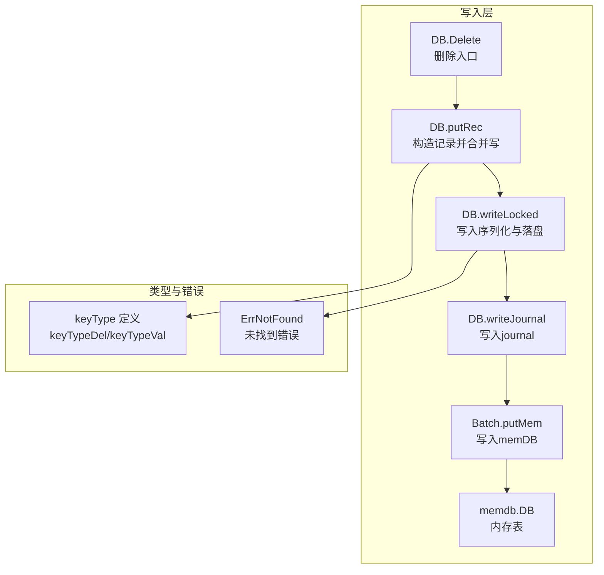
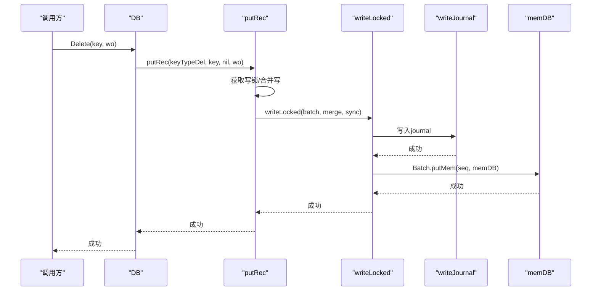
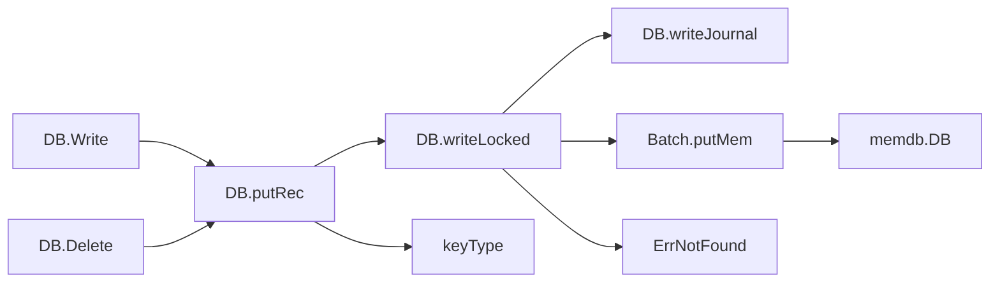

# Delete操作

<cite>
**本文引用的文件**
- [leveldb/db_write.go](file://leveldb/db_write.go)
- [leveldb/db.go](file://leveldb/db.go)
- [leveldb/key.go](file://leveldb/key.go)
- [leveldb/batch.go](file://leveldb/batch.go)
- [leveldb/errors/errors.go](file://leveldb/errors/errors.go)
- [leveldb/db_test.go](file://leveldb/db_test.go)
- [leveldb/testutil/db.go](file://leveldb/testutil/db.go)
</cite>

## 目录
1. [简介](#简介)
2. [项目结构](#项目结构)
3. [核心组件](#核心组件)
4. [架构总览](#架构总览)
5. [详细组件分析](#详细组件分析)
6. [依赖关系分析](#依赖关系分析)
7. [性能考量](#性能考量)
8. [故障排查指南](#故障排查指南)
9. [结论](#结论)
10. [附录](#附录)

## 简介
本篇文档围绕 avccDB 的 Delete 操作进行系统化说明，重点覆盖以下方面：
- db.Delete 方法的实现与使用方式
- 参数与返回值语义：key []byte、wo *opt.WriteOptions
- Delete 的“键不存在不报错”的特性及其原因
- Delete 如何通过 putRec 写入 keyTypeDel 类型记录，并写入 journal 与更新 memDB 实现逻辑删除
- 从获取写锁、写入删除记录到更新内存状态的完整流程
- 结合测试与示例，说明如何正确处理删除后的读取行为

## 项目结构
与 Delete 相关的关键模块与文件如下：
- 写入路径：DB.Delete -> DB.putRec -> DB.writeLocked -> DB.writeJournal -> Batch.putMem -> memdb.DB
- 键类型定义：keyTypeDel、keyTypeVal
- 错误常量：ErrNotFound
- 测试与使用示例：db_test.go、testutil/db.go

图表来源
- [leveldb/db_write.go](file://leveldb/db_write.go#L444-L446)
- [leveldb/db_write.go](file://leveldb/db_write.go#L331-L374)
- [leveldb/db_write.go](file://leveldb/db_write.go#L154-L265)
- [leveldb/key.go](file://leveldb/key.go#L31-L48)
- [leveldb/errors/errors.go](file://leveldb/errors/errors.go#L19-L23)

章节来源
- [leveldb/db_write.go](file://leveldb/db_write.go#L444-L446)
- [leveldb/key.go](file://leveldb/key.go#L31-L48)
- [leveldb/errors/errors.go](file://leveldb/errors/errors.go#L19-L23)

## 核心组件
- DB.Delete：对外暴露的删除接口，内部委托给 putRec 并传入 keyTypeDel
- DB.putRec：统一的记录写入入口，负责合并写、获取写锁、构造 Batch 并调用 writeLocked
- DB.writeLocked：写入序列化、写 journal、写 memDB、更新序列号、必要时旋转 memDB
- keyTypeDel：内部键的删除类型标识，用于区分删除与普通值
- ErrNotFound：读取时用于表示键不存在的标准错误

章节来源
- [leveldb/db_write.go](file://leveldb/db_write.go#L444-L446)
- [leveldb/db_write.go](file://leveldb/db_write.go#L331-L374)
- [leveldb/db_write.go](file://leveldb/db_write.go#L154-L265)
- [leveldb/key.go](file://leveldb/key.go#L31-L48)
- [leveldb/errors/errors.go](file://leveldb/errors/errors.go#L19-L23)

## 架构总览
Delete 的整体流程如下：
- 外部调用 DB.Delete(key, wo)
- DB.Delete 调用 DB.putRec(keyTypeDel, key, nil, wo)
- DB.putRec 获取写锁，构造 Batch 并追加 keyTypeDel 记录
- DB.writeLocked 将 Batch 序列化写入 journal，再写入 memDB
- 返回成功（即使键不存在也不报错）

图表来源
- [leveldb/db_write.go](file://leveldb/db_write.go#L444-L446)
- [leveldb/db_write.go](file://leveldb/db_write.go#L331-L374)
- [leveldb/db_write.go](file://leveldb/db_write.go#L154-L265)

## 详细组件分析

### DB.Delete 方法
- 入口：DB.Delete(key []byte, wo *opt.WriteOptions) error
- 行为：直接调用 DB.putRec(keyTypeDel, key, nil, wo)，即以删除类型写入一条记录
- 返回值：成功时返回 nil；若数据库关闭则返回关闭错误；其他写入错误由底层传播
- 关键点：Delete 不会因为键不存在而返回错误，这与 Get 的 ErrNotFound 行为一致，体现了“逻辑删除”的设计

章节来源
- [leveldb/db_write.go](file://leveldb/db_write.go#L444-L446)

### DB.putRec 与写入合并
- 功能：统一记录写入入口，支持写合并（write merge）与同步选项
- 合并策略：根据 wo.NoWriteMerge 与全局配置决定是否尝试合并
- 写锁获取：优先尝试通过 writeMergeC 通道合并，失败则获取 writeLockC
- 构造 Batch：Reset 后 appendRec(keyTypeDel, key, nil)
- 调用 writeLocked 执行实际写入

章节来源
- [leveldb/db_write.go](file://leveldb/db_write.go#L331-L374)

### DB.writeLocked：写入序列化与落盘
- 刷写 memDB：先尝试 flush，避免写入过快导致 compaction 压力过大
- 合并写：在 merge 模式下，持续从 writeMergeC 接收待合并的写请求
- 写 journal：调用 writeJournal 将批记录写入 journal
- 写 memDB：遍历批次，逐个调用 Batch.putMem 写入 memDB
- 更新序列号：累加批次长度并更新 DB.seq
- 旋转 memDB：当容量不足时触发 rotateMem

章节来源
- [leveldb/db_write.go](file://leveldb/db_write.go#L154-L265)

### 内部键类型与删除标记
- keyType 定义：keyTypeDel（删除）、keyTypeVal（值）
- 内部键编码：内部键包含用户键与序列号+类型字段，删除类型通过最低 8 位标识
- 删除标记：Delete 写入 keyTypeDel 记录，作为逻辑删除的标记

章节来源
- [leveldb/key.go](file://leveldb/key.go#L31-L48)

### 读取路径与 ErrNotFound
- 读取时遇到 keyTypeDel 会返回 ErrNotFound，保证上层感知“键不存在”
- 该行为在 memGet 中体现：解析内部键后，若类型为 keyTypeDel，则返回 ErrNotFound

章节来源
- [leveldb/db.go](file://leveldb/db.go#L769-L796)
- [leveldb/errors/errors.go](file://leveldb/errors/errors.go#L19-L23)

### 使用示例与测试验证
- 单键删除：db_test.go 中通过 harness.delete 调用 Delete 并断言无错误
- 删除后读取：testutil/db.go 中 Delete 后调用 TestDeletedKey，期望 ErrNotFound
- 批量删除：mlsm_final_comprehensive_test.go 展示了批量删除与历史版本查询的行为

章节来源
- [leveldb/db_test.go](file://leveldb/db_test.go#L210-L218)
- [leveldb/testutil/db.go](file://leveldb/testutil/db.go#L162-L173)
- [leveldb/mlsm_final_comprehensive_test.go](file://leveldb/mlsm_final_comprehensive_test.go#L373-L415)

## 依赖关系分析
- DB.Delete 依赖 DB.putRec
- DB.putRec 依赖 DB.writeLocked、DB.writeJournal、Batch.appendRec
- DB.writeLocked 依赖 memDB 写入接口 Batch.putMem
- 键类型定义来自 key.go，错误常量来自 errors/errors.go

图表来源
- [leveldb/db_write.go](file://leveldb/db_write.go#L268-L330)
- [leveldb/db_write.go](file://leveldb/db_write.go#L331-L374)
- [leveldb/db_write.go](file://leveldb/db_write.go#L154-L265)
- [leveldb/key.go](file://leveldb/key.go#L31-L48)
- [leveldb/errors/errors.go](file://leveldb/errors/errors.go#L19-L23)

章节来源
- [leveldb/db_write.go](file://leveldb/db_write.go#L268-L330)
- [leveldb/db_write.go](file://leveldb/db_write.go#L331-L374)
- [leveldb/db_write.go](file://leveldb/db_write.go#L154-L265)
- [leveldb/key.go](file://leveldb/key.go#L31-L48)
- [leveldb/errors/errors.go](file://leveldb/errors/errors.go#L19-L23)

## 性能考量
- 写合并：通过 writeMergeC 通道合并多个小写入，减少 journal 与 memDB 写入次数
- 刷写节流：writeLocked 中先 flush，避免写入过快导致 compaction 延迟
- 旋转阈值：当写入接近 memDB 容量时触发 rotateMem，降低后续写入压力
- 同步选项：wo.Sync 控制是否 fsync，影响吞吐与可靠性权衡

章节来源
- [leveldb/db_write.go](file://leveldb/db_write.go#L154-L265)
- [leveldb/db_write.go](file://leveldb/db_write.go#L268-L330)

## 故障排查指南
- 删除后读取仍返回值
  - 可能原因：mLSM 保留历史版本，Get(latest) 仍可返回旧值
  - 解决建议：明确业务语义，必要时使用 GetWithVersion 查询特定版本或确认是否需要历史保留
- 删除返回错误
  - 可能原因：数据库已关闭、写入合并冲突、journal 写入失败
  - 解决建议：检查 DB 是否关闭、wo.Sync 设置、磁盘空间与权限
- 读取 ErrNotFound
  - 正常行为：键不存在或已被删除（keyTypeDel），属于预期

章节来源
- [leveldb/db_test.go](file://leveldb/db_test.go#L210-L218)
- [leveldb/testutil/db.go](file://leveldb/testutil/db.go#L162-L173)
- [leveldb/mlsm_final_comprehensive_test.go](file://leveldb/mlsm_final_comprehensive_test.go#L373-L415)

## 结论
- DB.Delete 是一个轻量的逻辑删除接口，内部通过 putRec 统一写入流程
- Delete 不会因键不存在而返回错误，符合上层“幂等删除”的常见需求
- 删除通过 keyTypeDel 标记写入 journal 与 memDB，读取时遇到删除标记返回 ErrNotFound
- 写入路径具备写合并、刷写节流与旋转阈值等优化，兼顾吞吐与稳定性

## 附录
- 参数说明
  - key []byte：要删除的键
  - wo *opt.WriteOptions：写入选项，包括 NoWriteMerge 与 Sync
- 返回值说明
  - 成功：返回 nil
  - 关闭：返回关闭错误
  - 其他：底层写入错误
- 使用注意事项
  - 删除后读取应预期 ErrNotFound 或历史版本（取决于具体实现）
  - 若需要强一致性与严格错误反馈，请结合业务场景评估是否需要额外校验

章节来源
- [leveldb/db_write.go](file://leveldb/db_write.go#L444-L446)
- [leveldb/db_write.go](file://leveldb/db_write.go#L331-L374)
- [leveldb/db_write.go](file://leveldb/db_write.go#L154-L265)
- [leveldb/key.go](file://leveldb/key.go#L31-L48)
- [leveldb/errors/errors.go](file://leveldb/errors/errors.go#L19-L23)
- [leveldb/db_test.go](file://leveldb/db_test.go#L210-L218)
- [leveldb/testutil/db.go](file://leveldb/testutil/db.go#L162-L173)
- [leveldb/mlsm_final_comprehensive_test.go](file://leveldb/mlsm_final_comprehensive_test.go#L373-L415)