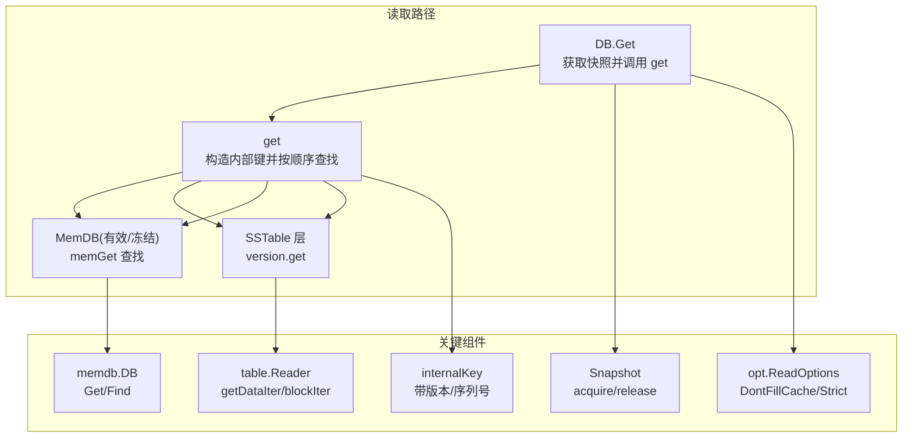
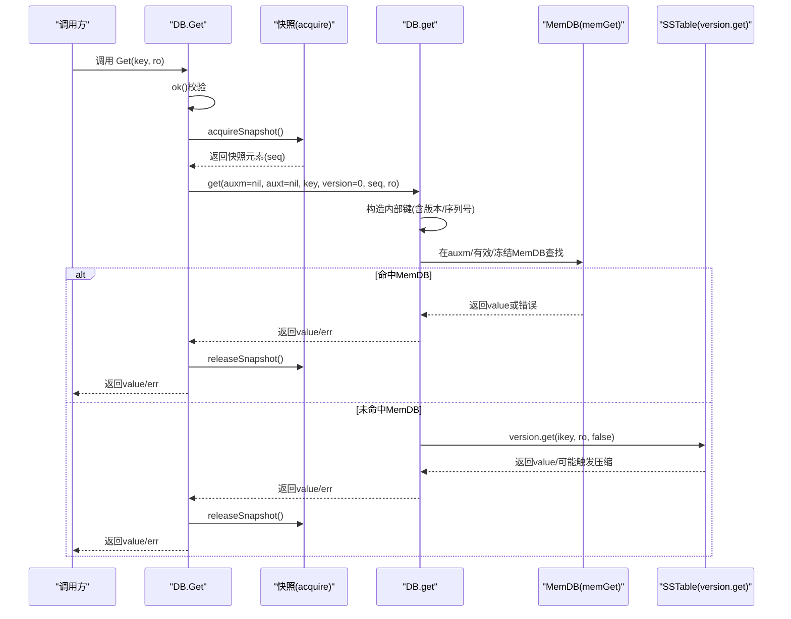
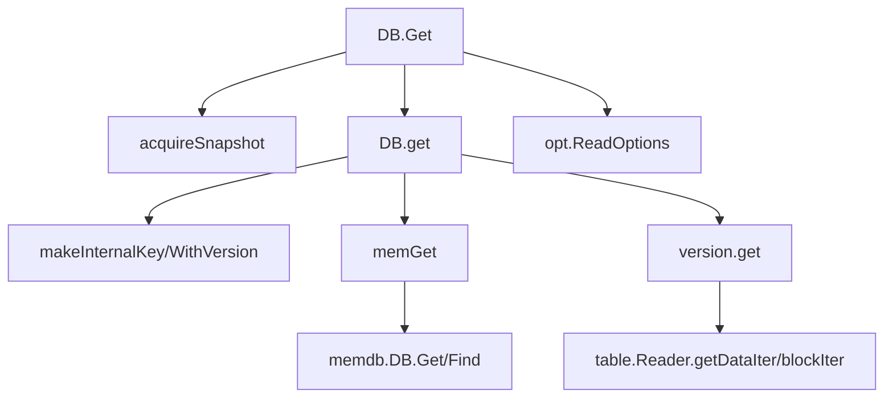

# Get操作

<cite>
**本文引用的文件**
- [leveldb/db.go](file://leveldb/db.go)
- [leveldb/memdb/memdb.go](file://leveldb/memdb/memdb.go)
- [leveldb/table/reader.go](file://leveldb/table/reader.go)
- [leveldb/opt/options.go](file://leveldb/opt/options.go)
- [leveldb/db_snapshot.go](file://leveldb/db_snapshot.go)
- [leveldb/key.go](file://leveldb/key.go)
</cite>

## 目录
1. [简介](#简介)
2. [项目结构](#项目结构)
3. [核心组件](#核心组件)
4. [架构总览](#架构总览)
5. [详细组件分析](#详细组件分析)
6. [依赖关系分析](#依赖关系分析)
7. [性能考量](#性能考量)
8. [故障排查指南](#故障排查指南)
9. [结论](#结论)

## 简介
本篇文档围绕 avccDB 的 Get 操作进行系统化说明，重点覆盖 DB.Get 方法的实现与使用方式。内容包括：
- 参数与返回值语义：key []byte、ro *opt.ReadOptions；返回 value []byte、err error
- 返回字节切片的不可变性与拷贝策略
- Get 操作的读取路径：从快照一致性到内存数据库(MemDB)再到 SSTable 的查找顺序
- 版本查询与快照一致性保障
- 读取选项 ReadOptions 的作用与最佳实践
- 错误处理与常见问题定位

## 项目结构
与 Get 操作直接相关的核心模块如下：
- 数据库入口与读取路径：leveldb/db.go
- 内存数据库实现：leveldb/memdb/memdb.go
- 表层读取器与块迭代器：leveldb/table/reader.go
- 读取选项定义：leveldb/opt/options.go
- 快照与一致性：leveldb/db_snapshot.go
- 内部键编码与版本支持：leveldb/key.go

图表来源
- [leveldb/db.go](file://leveldb/db.go#L798-L833)
- [leveldb/memdb/memdb.go](file://leveldb/memdb/memdb.go#L355-L365)
- [leveldb/table/reader.go](file://leveldb/table/reader.go#L770-L787)
- [leveldb/opt/options.go](file://leveldb/opt/options.go#L694-L721)
- [leveldb/db_snapshot.go](file://leveldb/db_snapshot.go#L27-L60)
- [leveldb/key.go](file://leveldb/key.go#L75-L104)

章节来源
- [leveldb/db.go](file://leveldb/db.go#L798-L833)
- [leveldb/memdb/memdb.go](file://leveldb/memdb/memdb.go#L355-L365)
- [leveldb/table/reader.go](file://leveldb/table/reader.go#L770-L787)
- [leveldb/opt/options.go](file://leveldb/opt/options.go#L694-L721)
- [leveldb/db_snapshot.go](file://leveldb/db_snapshot.go#L27-L60)
- [leveldb/key.go](file://leveldb/key.go#L75-L104)

## 核心组件
- DB.Get：对外暴露的读取接口，负责获取快照并委托给内部 get 方法执行实际查找。
- DB.get：核心读取逻辑，按“辅助 MemDB -> 有效/冻结 MemDB -> SSTable”顺序查找，并在必要时触发表级压缩。
- memGet：在 MemDB 中查找指定内部键，解析版本与删除标记，返回值或错误。
- table.Reader：提供块迭代器，用于在 SSTable 中定位目标键。
- opt.ReadOptions：控制读取行为，如是否填充缓存、严格模式等。
- Snapshot：快照对象，确保读取期间的一致性视图。

章节来源
- [leveldb/db.go](file://leveldb/db.go#L1092-L1107)
- [leveldb/db.go](file://leveldb/db.go#L798-L833)
- [leveldb/memdb/memdb.go](file://leveldb/memdb/memdb.go#L355-L365)
- [leveldb/table/reader.go](file://leveldb/table/reader.go#L770-L787)
- [leveldb/opt/options.go](file://leveldb/opt/options.go#L694-L721)
- [leveldb/db_snapshot.go](file://leveldb/db_snapshot.go#L27-L60)

## 架构总览
下图展示 Get 操作从入口到最终返回的关键交互：

图表来源
- [leveldb/db.go](file://leveldb/db.go#L1092-L1107)
- [leveldb/db.go](file://leveldb/db.go#L798-L833)
- [leveldb/db_snapshot.go](file://leveldb/db_snapshot.go#L27-L60)

## 详细组件分析

### DB.Get 与 DB.get 的实现要点
- DB.Get 获取最新快照，传入 version=0，委托给 DB.get 执行查找。
- DB.get 先构造内部键（内部键包含用户键、版本号、序列号与类型），然后依次在：
  - 辅助 MemDB（可选）
  - 有效 MemDB
  - 冻结 MemDB
  - SSTable 层（version.get）
- 若在 SSTable 层命中，且需要触发压缩，则通过 compTrigger 触发一次表级压缩。
- 返回值为“自有拷贝”，调用方可安全修改返回的字节切片。

章节来源
- [leveldb/db.go](file://leveldb/db.go#L1092-L1107)
- [leveldb/db.go](file://leveldb/db.go#L798-L833)

### 内部键与版本查询
- 内部键格式支持版本字段（16 字节）与非版本字段（8 字节），用于区分不同版本的同一用户键。
- 当 version=0 时，使用特殊标记匹配任意版本；当 version>0 时，仅匹配指定版本。
- 内部键的用户键部分用于比较，序列号与类型用于排序与删除标记判断。

章节来源
- [leveldb/key.go](file://leveldb/key.go#L75-L104)
- [leveldb/key.go](file://leveldb/key.go#L119-L132)
- [leveldb/key.go](file://leveldb/key.go#L162-L171)

### MemDB 查找流程（memGet）
- 在 MemDB 中通过 Find 定位首个大于等于内部键的条目。
- 解析内部键：
  - 若为带版本键：比较用户键一致且类型非删除则命中；否则继续。
  - 若为非版本键：同样比较用户键一致且类型非删除则命中。
- 若解析失败或返回 ErrNotFound，则继续向后查找或返回未命中。
- 返回值为“自有拷贝”，调用方可安全修改。

章节来源
- [leveldb/db.go](file://leveldb/db.go#L768-L795)
- [leveldb/memdb/memdb.go](file://leveldb/memdb/memdb.go#L355-L365)

### SSTable 查找流程（version.get）
- 通过版本管理器获取当前版本视图，再调用其 get 方法在各层级的 SSTable 中查找。
- 使用内部键进行定位，必要时构建块迭代器以扫描数据块。
- 若命中，可能触发一次表级压缩（由返回标志指示）。

章节来源
- [leveldb/db.go](file://leveldb/db.go#L824-L833)
- [leveldb/table/reader.go](file://leveldb/table/reader.go#L770-L787)

### 快照一致性与序列号
- DB.Get 在进入读取前会获取一个快照，快照记录当前序列号，保证读取期间不会看到后续写入。
- 快照释放发生在返回之后，确保读取过程中的视图稳定。
- 快照列表维护最小未被占用的序列号，避免过早回收。

章节来源
- [leveldb/db.go](file://leveldb/db.go#L1092-L1107)
- [leveldb/db_snapshot.go](file://leveldb/db_snapshot.go#L27-L60)
- [leveldb/db_snapshot.go](file://leveldb/db_snapshot.go#L62-L72)

### 读取选项 ReadOptions 的影响
- DontFillCache：若为 true，则本次读取不填充块缓存；默认 false。
- Strict：与全局严格级别组合，当前主要影响 StrictReader（读取严格模式）。
- 读取选项在 get 与 version.get 中传递，影响底层块读取与校验策略。

章节来源
- [leveldb/opt/options.go](file://leveldb/opt/options.go#L694-L721)
- [leveldb/db.go](file://leveldb/db.go#L798-L833)

### 返回值的不可变性与拷贝策略
- DB.Get 与 DB.get 的返回值均为“自有拷贝”，调用方可安全修改返回的字节切片。
- 这一特性在 MemDB 查找与 SSTable 返回时均得到保证，避免外部修改影响内部存储。

章节来源
- [leveldb/db.go](file://leveldb/db.go#L1092-L1107)
- [leveldb/db.go](file://leveldb/db.go#L798-L833)

### 版本查询与快照一致性
- DB.GetWithVersion 支持按指定版本读取；version=0 表示最新版本。
- 两者均通过快照保证一致性，读取时使用快照序列号作为查询上下文。

章节来源
- [leveldb/db.go](file://leveldb/db.go#L1115-L1124)
- [leveldb/db.go](file://leveldb/db.go#L1092-L1107)

## 依赖关系分析
- DB.Get 依赖快照机制（acquire/release）与内部 get 实现。
- get 依赖内部键构造、MemDB 查找与 SSTable 层查找。
- MemDB 查找依赖内部键解析与删除标记判断。
- SSTable 层依赖块迭代器与索引块定位。
- ReadOptions 影响底层块读取与缓存策略。

图表来源
- [leveldb/db.go](file://leveldb/db.go#L1092-L1107)
- [leveldb/db.go](file://leveldb/db.go#L798-L833)
- [leveldb/key.go](file://leveldb/key.go#L75-L104)
- [leveldb/memdb/memdb.go](file://leveldb/memdb/memdb.go#L355-L365)
- [leveldb/table/reader.go](file://leveldb/table/reader.go#L770-L787)
- [leveldb/opt/options.go](file://leveldb/opt/options.go#L694-L721)

章节来源
- [leveldb/db.go](file://leveldb/db.go#L1092-L1107)
- [leveldb/db.go](file://leveldb/db.go#L798-L833)
- [leveldb/key.go](file://leveldb/key.go#L75-L104)
- [leveldb/memdb/memdb.go](file://leveldb/memdb/memdb.go#L355-L365)
- [leveldb/table/reader.go](file://leveldb/table/reader.go#L770-L787)
- [leveldb/opt/options.go](file://leveldb/opt/options.go#L694-L721)

## 性能考量
- 优先命中 MemDB 可显著降低磁盘访问；合理设置 WriteBuffer 有助于提升 MemDB 命中率。
- ReadOptions.DontFillCache 可减少缓存污染，适合一次性读取或批量扫描场景。
- 严格模式（StrictReader）会增加读取开销，建议仅在需要严格校验时启用。
- 压缩触发：SSTable 层命中时可能触发压缩，应关注写放大与读取延迟的平衡。

## 故障排查指南
- 未命中：返回 ErrNotFound，检查 key 是否存在或版本是否正确。
- 内部键异常：内部键解析失败会报错，确认 key 编码与版本字段是否符合规范。
- 严格模式错误：开启 StrictReader 或 StrictBlockChecksum 后，读取过程中遇到损坏会直接报错。
- 快照释放：对已释放的快照调用 Get 将返回特定错误，确保快照生命周期管理正确。
- 返回值修改：虽然返回值是自有拷贝，但请勿在并发场景下共享同一返回值切片，避免竞态。

章节来源
- [leveldb/db.go](file://leveldb/db.go#L768-L795)
- [leveldb/opt/options.go](file://leveldb/opt/options.go#L130-L174)
- [leveldb/db_snapshot.go](file://leveldb/db_snapshot.go#L97-L115)

## 结论
- DB.Get 提供了稳定的读取入口，通过快照确保一致性，返回自有拷贝便于安全修改。
- 读取路径清晰：先查 MemDB，再查 SSTable，必要时触发压缩。
- ReadOptions 与内部键版本机制共同支撑了灵活的查询能力与严格的读取约束。
- 建议在生产环境中：
  - 明确 ReadOptions 的使用场景，避免不必要的严格模式
  - 正确管理快照生命周期
  - 注意返回值的拷贝语义，避免并发共享导致的问题