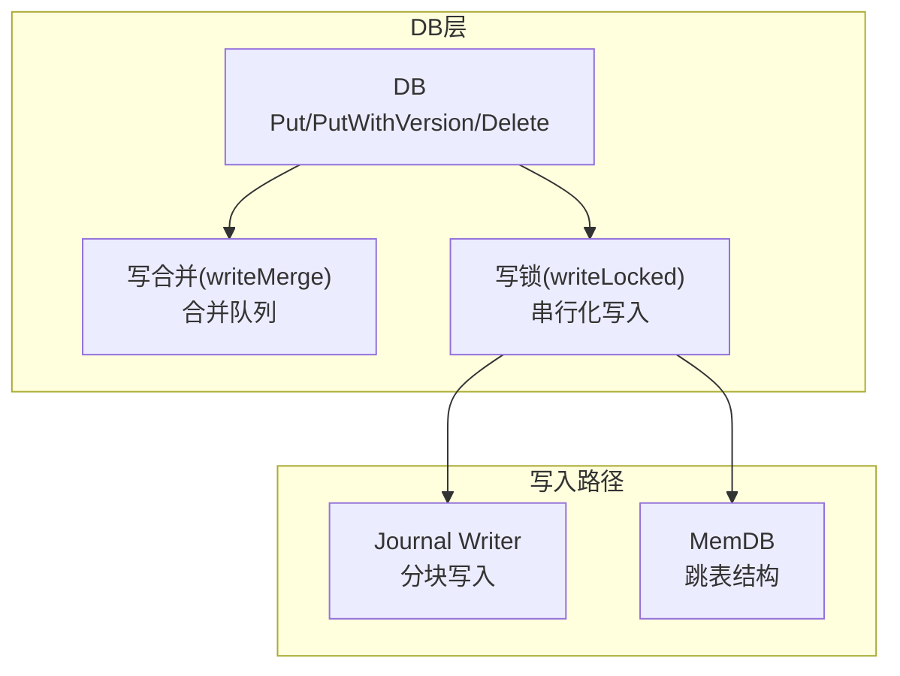
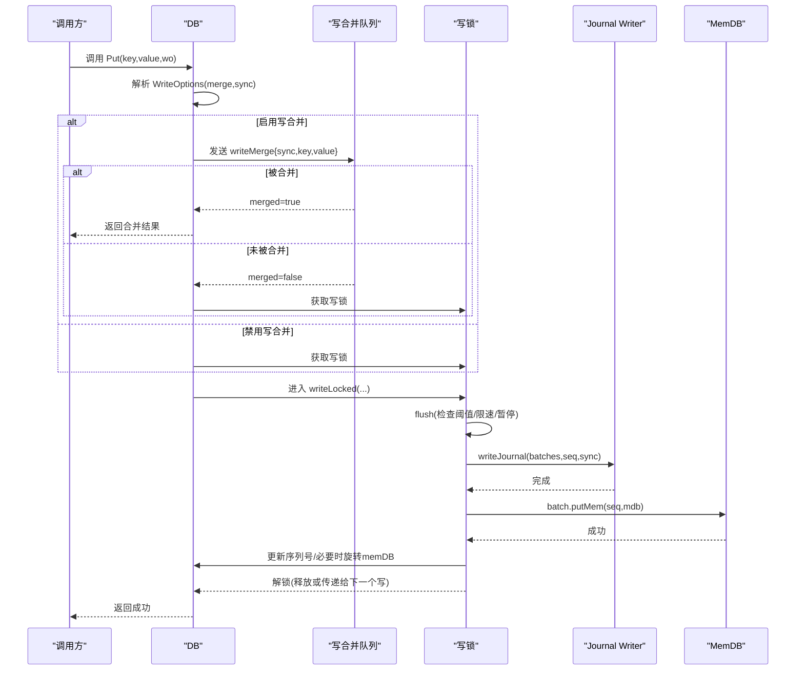
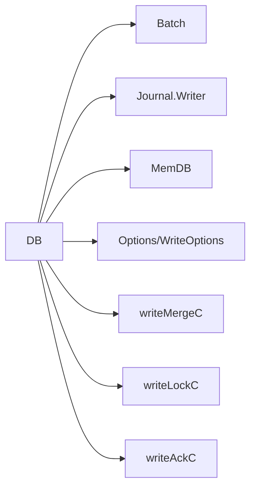

# Put操作

<cite>
**本文引用的文件列表**
- [leveldb/db_write.go](file://leveldb/db_write.go)
- [leveldb/db.go](file://leveldb/db.go)
- [leveldb/batch.go](file://leveldb/batch.go)
- [leveldb/memdb/memdb.go](file://leveldb/memdb/memdb.go)
- [leveldb/journal/journal.go](file://leveldb/journal/journal.go)
- [leveldb/key.go](file://leveldb/key.go)
- [leveldb/opt/options.go](file://leveldb/opt/options.go)
- [leveldb/db_test.go](file://leveldb/db_test.go)
</cite>

## 目录
1. [简介](#简介)
2. [项目结构与定位](#项目结构与定位)
3. [核心组件与职责](#核心组件与职责)
4. [架构总览](#架构总览)
5. [详细组件分析](#详细组件分析)
6. [依赖关系分析](#依赖关系分析)
7. [性能与优化建议](#性能与优化建议)
8. [故障排查指南](#故障排查指南)
9. [结论](#结论)
10. [附录：使用示例与最佳实践](#附录使用示例与最佳实践)

## 简介
本篇文档围绕 avccDB 的 Put 操作进行系统化说明，重点覆盖：
- db.Put 方法的实现与使用方式
- 参数含义（key、value、wo *opt.WriteOptions）
- 返回值与错误处理
- 写入路径中的关键步骤：获取写锁、写入 journal、更新 memDB
- 写入合并（writeMerge）机制与写锁（writeLocked）保障的数据一致性
- 版本化写入（PutWithVersion）与内部键构造规则
- WriteOptions 配置与常见错误处理策略

目标是帮助初学者快速上手，同时为高级用户提供性能优化与稳定性保障的参考。

## 项目结构与定位
- Put 操作位于数据库写入路径的核心位置，贯穿以下模块：
  - DB 层：对外暴露 Put/PutWithVersion/Delete 等写接口，并负责写合并、写锁、序列号管理等
  - Batch：将单条 Put 封装为批量记录，统一编码后写入 journal 并应用到 memDB
  - Journal：按块与分片格式持久化写入，支持校验与恢复
  - MemDB：内存跳表结构，提供高并发下的原子写入能力
  - Internal Key：将用户键与版本/序列号打包为内部键，用于排序与版本控制

图表来源
- [leveldb/db_write.go](file://leveldb/db_write.go#L133-L266)
- [leveldb/journal/journal.go](file://leveldb/journal/journal.go#L343-L537)
- [leveldb/memdb/memdb.go](file://leveldb/memdb/memdb.go#L273-L315)

章节来源
- [leveldb/db_write.go](file://leveldb/db_write.go#L133-L266)
- [leveldb/db.go](file://leveldb/db.go#L1-L120)

## 核心组件与职责
- DB.Put(key, value, wo)
  - 对外入口，封装单条写入为 Batch 记录，触发写合并或直接进入写锁流程
- DB.putRec(keyType, key, value, wo)
  - 公共底层实现，支持普通写入与带版本写入
- DB.writeLocked(batch, ourBatch, merge, sync)
  - 串行化写入执行器：刷盘阈值检查、写 journal、写 memDB、序列号推进、必要时旋转 memDB
- DB.writeMergeC/writeMergedC/writeLockC
  - 写合并通道与写锁通道，协调并发写入
- Batch.appendRec / appendRecWithVersion
  - 将 key/value 编码为 batch 数据，计算 internalLen 用于合并限制
- Journal.Writer
  - 分块写入，支持 flush/sync，确保持久化安全
- MemDB.Put
  - 原子写入内存跳表，支持并发读写

章节来源
- [leveldb/db_write.go](file://leveldb/db_write.go#L133-L447)
- [leveldb/batch.go](file://leveldb/batch.go#L94-L136)
- [leveldb/journal/journal.go](file://leveldb/journal/journal.go#L343-L537)
- [leveldb/memdb/memdb.go](file://leveldb/memdb/memdb.go#L273-L315)

## 架构总览
下面以序列图展示一次典型的 Put 写入流程，包括写合并、写锁、journal 与 memDB 更新：

图表来源
- [leveldb/db_write.go](file://leveldb/db_write.go#L268-L447)
- [leveldb/db_write.go](file://leveldb/db_write.go#L154-L266)
- [leveldb/journal/journal.go](file://leveldb/journal/journal.go#L343-L537)
- [leveldb/batch.go](file://leveldb/batch.go#L244-L257)
- [leveldb/memdb/memdb.go](file://leveldb/memdb/memdb.go#L273-L315)

## 详细组件分析

### DB.Put 与 DB.putRec
- 参数说明
  - key：用户键字节切片
  - value：用户值字节切片
  - wo：写选项，决定是否启用写合并与同步落盘
- 行为要点
  - 若 wo 禁用写合并或全局禁用，则直接走写锁路径
  - 否则尝试将本次写入放入写合并队列；若被合并成功则直接返回
  - 若未被合并，则获取写锁，进入 writeLocked 执行
- 返回值
  - 成功返回 nil；失败返回具体错误（如 ErrClosed、存储错误、压缩/校验错误等）

章节来源
- [leveldb/db_write.go](file://leveldb/db_write.go#L332-L447)
- [leveldb/db_write.go](file://leveldb/db_write.go#L377-L385)

### 写合并机制（writeMerge）
- 结构体字段
  - sync：是否需要同步落盘
  - batch：待合并的 Batch
  - keyType/key/value：单条 Put 的记录
  - version：版本号（仅在带版本写入时有效）
- 合并策略
  - 计算合并上限：基于 batch/internalLen 与 memDB 可用空间
  - 循环从写合并队列消费，累计合并 batch 或单条记录
  - 合并过程中动态更新 sync（任一合并项要求同步都会触发）
  - 当合并上限不足或遇到溢出时停止合并
- 合并完成后的处理
  - 通过 writeMergedC 通知发送者“已合并”，并通过 writeAckC 返回错误或成功
  - 若未合并，则将写锁交给当前写入者

章节来源
- [leveldb/db_write.go](file://leveldb/db_write.go#L133-L229)
- [leveldb/db_write.go](file://leveldb/db_write.go#L141-L152)

### 写锁与 writeLocked（数据一致性保障）
- flush 阶段
  - 根据写入大小与 L0 触发阈值进行限速/暂停/旋转 memDB
- 写 journal
  - 使用 writeJournal 将批次头与各 batch 数据写入 journal
  - 若 wo.Sync 或合并项要求同步，则对 journalWriter 执行同步
- 写 memDB
  - 逐个 batch 调用 batch.putMem，将内部键写入 MemDB
  - 为每个记录分配递增的序列号
- 序列号推进与 memDB 旋转
  - 增量推进全局序列号
  - 当写入大小达到 memDB 可用空间阈值时触发旋转
- 解锁
  - 通过 unlockWrite 释放写锁或传递给下一个等待写入者

章节来源
- [leveldb/db_write.go](file://leveldb/db_write.go#L154-L266)
- [leveldb/db_write.go](file://leveldb/db_write.go#L18-L33)
- [leveldb/batch.go](file://leveldb/batch.go#L244-L257)
- [leveldb/memdb/memdb.go](file://leveldb/memdb/memdb.go#L273-L315)

### 内部键与版本化写入
- 内部键构造
  - makeInternalKey：非版本键，包含 ukey + 8 字节序列号+类型
  - makeInternalKeyWithVersion：版本键，包含 ukey + 8 字节版本 + 8 字节序列号+类型
- 版本化写入
  - PutWithVersion 将 version 传入 appendRecWithVersion，最终在 batch.putMem 中生成带版本的内部键
  - 版本键排序优先按版本降序，再按序列号降序

章节来源
- [leveldb/key.go](file://leveldb/key.go#L75-L104)
- [leveldb/key.go](file://leveldb/key.go#L119-L132)
- [leveldb/batch.go](file://leveldb/batch.go#L98-L136)
- [leveldb/batch.go](file://leveldb/batch.go#L244-L257)

### Journal 写入细节
- Writer.Next/Flush/Close
  - Next 返回单个 journal 写入器，写满块后自动切换下一块
  - Flush 完成当前 journal 并可选同步
  - Close 完成并关闭
- 分块与校验
  - 每块固定大小，包含多个紧密打包的 chunk
  - chunk 头含校验和、长度与类型，支持严格模式下的校验失败处理

章节来源
- [leveldb/journal/journal.go](file://leveldb/journal/journal.go#L343-L537)

### MemDB 写入细节
- Put/Delete 原子性
  - 使用互斥锁保护，覆盖旧值或插入新节点
  - 删除时维护链表指针，不回收已分配缓冲区
- 并发模型
  - 读多写少场景下，读写锁提升并发度；写入路径仍保持串行化（由 DB.writeLocked 控制）

章节来源
- [leveldb/memdb/memdb.go](file://leveldb/memdb/memdb.go#L273-L315)

## 依赖关系分析
- DB 对 Batch/Journal/MemDB 的依赖
  - DB.Put/PutWithVersion -> Batch.appendRec/appendRecWithVersion -> batch.putMem -> MemDB.Put
  - DB.writeLocked -> writeJournal -> Journal.Writer
- 写合并与写锁的协作
  - writeMergeC 与 writeLockC 协同，避免竞争条件
  - writeMergedC 与 writeAckC 提供合并确认与错误传播
- 选项对行为的影响
  - WriteOptions.NoWriteMerge、Sync
  - Options.NoWriteMerge、NoSync、WriteBuffer、WriteL0SlowdownTrigger/WriteL0PauseTrigger

图表来源
- [leveldb/db_write.go](file://leveldb/db_write.go#L268-L447)
- [leveldb/opt/options.go](file://leveldb/opt/options.go#L723-L766)

章节来源
- [leveldb/db_write.go](file://leveldb/db_write.go#L268-L447)
- [leveldb/opt/options.go](file://leveldb/opt/options.go#L362-L412)
- [leveldb/opt/options.go](file://leveldb/opt/options.go#L723-L766)

## 性能与优化建议
- 启用写合并
  - 在高并发小写入场景下显著减少 journal 写入次数与 memDB 更新开销
  - 通过 WriteOptions.NoWriteMerge 或 Options.NoWriteMerge 关闭
- 合理设置 WriteBuffer
  - 大写缓冲区可减少 memDB 刷盘频率，但会增加内存占用
  - 超过 WriteBuffer 的大批次可考虑使用事务模式（自动切换），绕过 journal
- 同步策略
  - 默认异步写入，追求吞吐；需要强一致时开启 Sync
  - Journal Writer 的同步成本较高，应谨慎使用
- L0 触发阈值
  - WriteL0SlowdownTrigger/WriteL0PauseTrigger 会在 L0 表过多时自动限速/暂停，避免写放大
- 版本化写入
  - 需要保留历史版本时使用 PutWithVersion；注意版本键长度与排序开销

章节来源
- [leveldb/db_write.go](file://leveldb/db_write.go#L280-L293)
- [leveldb/opt/options.go](file://leveldb/opt/options.go#L392-L412)
- [leveldb/opt/options.go](file://leveldb/opt/options.go#L723-L766)

## 故障排查指南
- 常见错误类型
  - ErrClosed：DB 已关闭，无法写入
  - 存储相关错误：文件打开/写入/同步失败
  - Journal 校验错误：块/分片校验失败（严格模式下）
  - 内部键错误：内部键格式非法
- 排查步骤
  - 确认 DB 是否处于只读模式或已关闭
  - 检查存储权限与磁盘空间
  - 若启用严格模式，关注 Journal 校验日志
  - 使用 Recover/OpenFile 修复损坏的 DB
- 错误传播路径
  - writeLocked 中的任何阶段失败都会通过 unlockWrite 传播到所有合并参与者

章节来源
- [leveldb/db_write.go](file://leveldb/db_write.go#L141-L152)
- [leveldb/journal/journal.go](file://leveldb/journal/journal.go#L149-L214)
- [leveldb/key.go](file://leveldb/key.go#L17-L30)

## 结论
- Put 操作通过“写合并 + 写锁”的双层机制，在保证数据一致性的前提下最大化吞吐
- 写入路径清晰：先写 journal 再写 memDB，配合序列号与必要的 memDB 旋转，确保顺序与持久化
- 版本化写入为多版本场景提供基础能力
- 正确配置 WriteOptions 与 Options 是获得稳定性能的关键

## 附录：使用示例与最佳实践

### 基本用法
- 单条写入
  - 使用 DB.Put(key, value, wo) 完成一次写入
  - 示例参考：[leveldb/db_test.go](file://leveldb/db_test.go#L165-L169)
- 批量写入
  - 使用 Batch.Pack/Write 组合，适合大量写入
  - 示例参考：[leveldb/db_test.go](file://leveldb/db_test.go#L159-L163)
- 版本化写入
  - 使用 DB.PutWithVersion(key, value, version, wo)，适用于需要保留历史版本的场景
  - 示例参考：[leveldb/db_write.go](file://leveldb/db_write.go#L387-L438)

### WriteOptions 配置建议
- 高吞吐低延迟
  - 默认配置即可；若需要更强一致性，开启 Sync
- 高并发小写入
  - 保持写合并开启；适当增大 WriteBuffer
- 大批次写入
  - 可考虑使用事务模式（自动切换），绕过 journal，提高吞吐

章节来源
- [leveldb/db_test.go](file://leveldb/db_test.go#L159-L169)
- [leveldb/db_write.go](file://leveldb/db_write.go#L280-L293)
- [leveldb/opt/options.go](file://leveldb/opt/options.go#L723-L766)

### 参数内容修改的安全性说明
- Put/PutWithVersion/Delete 在返回前不会修改传入的 key/value
- Write 在返回前不会修改传入的 Batch 内容
- 建议在调用后立即丢弃对原始参数的引用，避免外部并发修改导致不可预期行为

章节来源
- [leveldb/db_write.go](file://leveldb/db_write.go#L273-L275)
- [leveldb/db_write.go](file://leveldb/db_write.go#L377-L385)
- [leveldb/batch.go](file://leveldb/batch.go#L138-L156)