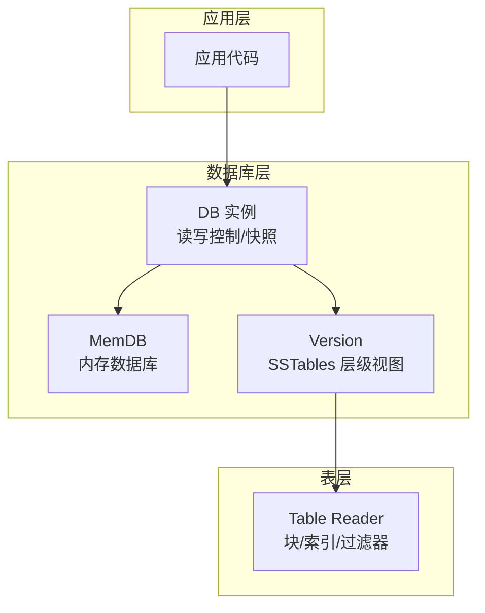
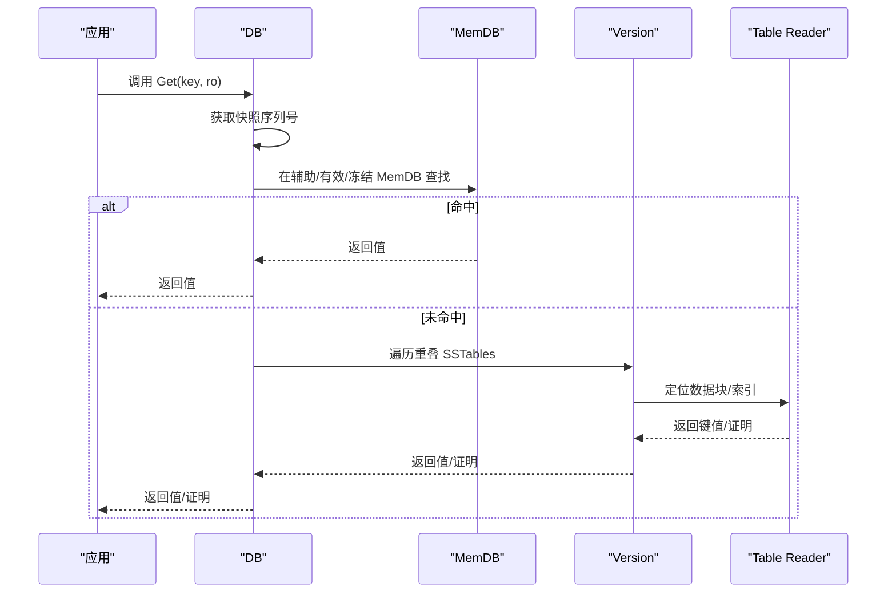
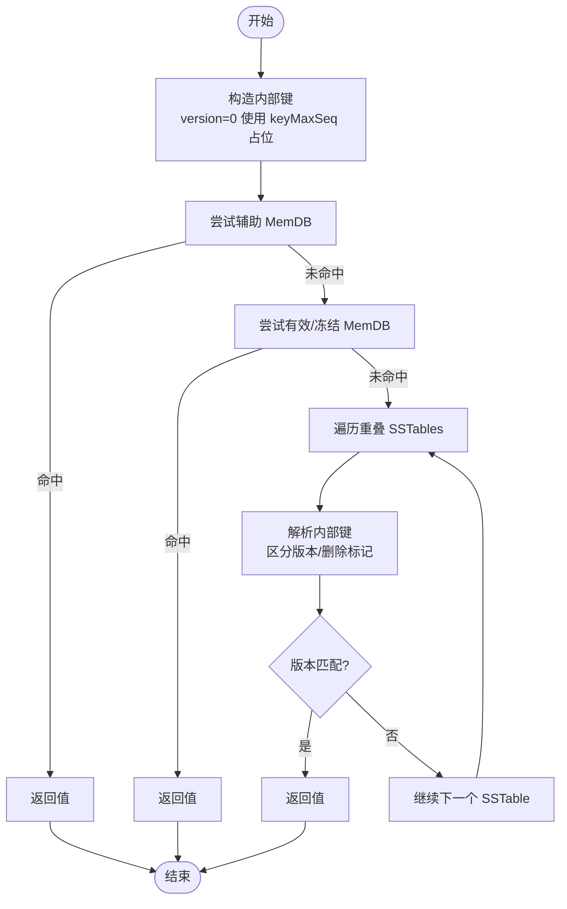
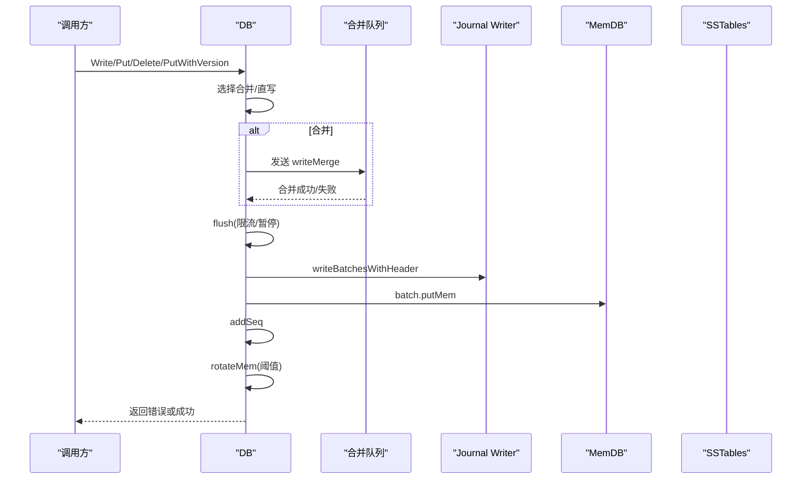
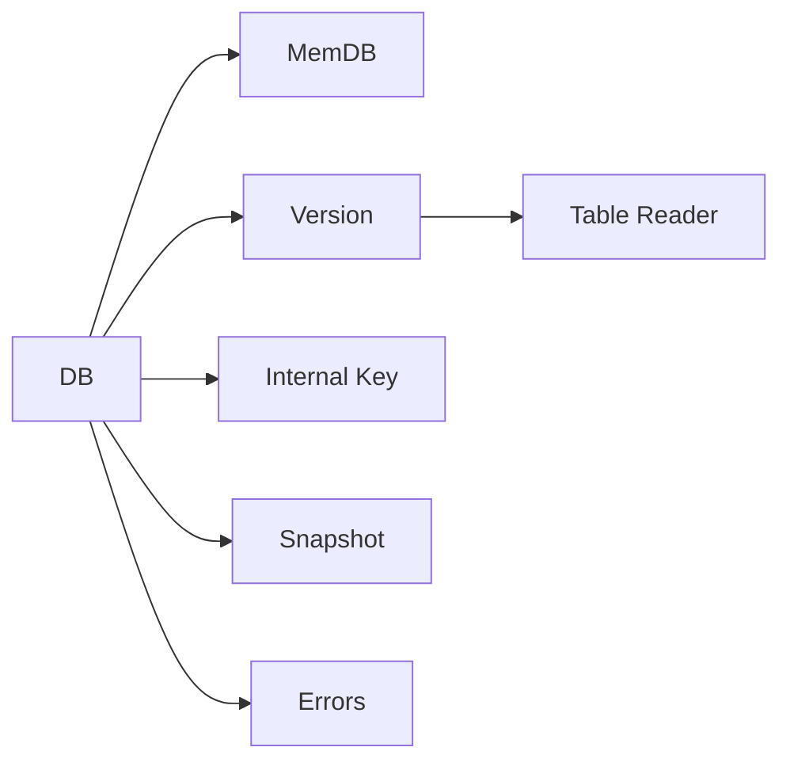

# 键值操作

<cite>
**本文引用的文件**
- [leveldb/db.go](file://leveldb/db.go)
- [leveldb/db_write.go](file://leveldb/db_write.go)
- [leveldb/memdb/memdb.go](file://leveldb/memdb/memdb.go)
- [leveldb/table/reader.go](file://leveldb/table/reader.go)
- [leveldb/key.go](file://leveldb/key.go)
- [leveldb/version.go](file://leveldb/version.go)
- [leveldb/db_snapshot.go](file://leveldb/db_snapshot.go)
- [leveldb/errors.go](file://leveldb/errors.go)
</cite>

## 目录
1. [简介](#简介)
2. [项目结构](#项目结构)
3. [核心组件](#核心组件)
4. [架构总览](#架构总览)
5. [详细组件分析](#详细组件分析)
6. [依赖关系分析](#依赖关系分析)
7. [性能考量](#性能考量)
8. [故障排查指南](#故障排查指南)
9. [结论](#结论)
10. [附录](#附录)

## 简介
本文件围绕 avccDB 的键值操作进行系统化文档化，重点覆盖以下内容：
- Put、Get、Delete 方法的参数、返回值与使用注意事项（含返回字节切片不可变性的说明）
- PutWithVersion 如何支持版本化存储，以及 Get 操作如何处理“最新版本”和“指定版本”
- 写入路径中 writeLocked 如何通过锁与合并机制保证数据一致性
- 读取路径中如何从内存数据库（MemDB）与 SSTable 中获取数据
- 结合代码示例路径说明错误处理与资源管理的最佳实践

## 项目结构
本仓库采用分层模块化组织，键值操作主要涉及：
- 数据库入口与读写控制：leveldb/db.go、leveldb/db_write.go
- 内存数据库：leveldb/memdb/memdb.go
- 表层读取与迭代器：leveldb/table/reader.go
- 版本与内部键格式：leveldb/key.go、leveldb/version.go
- 快照与并发一致性：leveldb/db_snapshot.go
- 错误类型：leveldb/errors.go

图表来源
- [leveldb/db.go](file://leveldb/db.go#L1092-L1146)
- [leveldb/db_write.go](file://leveldb/db_write.go#L377-L447)
- [leveldb/memdb/memdb.go](file://leveldb/memdb/memdb.go#L351-L386)
- [leveldb/table/reader.go](file://leveldb/table/reader.go#L512-L800)
- [leveldb/version.go](file://leveldb/version.go#L142-L285)

章节来源
- [leveldb/db.go](file://leveldb/db.go#L1092-L1146)
- [leveldb/db_write.go](file://leveldb/db_write.go#L377-L447)

## 核心组件
- DB：数据库主入口，提供 Put、Get、Delete、GetWithVersion、GetWithProof、GetVersionHistory 等方法；负责快照、序列号、写入合并与写入锁定。
- MemDB：内存中的跳表式键值存储，提供 Put/Delete/Get/Find/NewIterator 等能力。
- Table Reader：SSTable 的只读访问器，支持块迭代、索引迭代、过滤器等。
- Internal Key：内部键格式包含用户键、版本号、序列号与类型，用于区分版本与删除标记。
- Version：描述当前 LSM 层级的快照视图，负责在多层级 SSTables 上查找键值。

章节来源
- [leveldb/db.go](file://leveldb/db.go#L1092-L1146)
- [leveldb/memdb/memdb.go](file://leveldb/memdb/memdb.go#L351-L386)
- [leveldb/table/reader.go](file://leveldb/table/reader.go#L512-L800)
- [leveldb/key.go](file://leveldb/key.go#L75-L146)
- [leveldb/version.go](file://leveldb/version.go#L142-L285)

## 架构总览
键值操作的总体流程如下：
- 写入：DB 将记录写入内存（MemDB），同时写入日志（Journal），必要时触发刷新（Flush）到磁盘 SSTables，并更新序列号与主根哈希（MasterRoot）。
- 读取：DB 先尝试从辅助 MemDB、有效 MemDB、冻结 MemDB 查找；若未命中，则在 Version 视图下遍历重叠的 SSTables，解析内部键以匹配版本或最新版本，最终返回值与可选证明。

图表来源
- [leveldb/db.go](file://leveldb/db.go#L1092-L1146)
- [leveldb/version.go](file://leveldb/version.go#L142-L285)
- [leveldb/table/reader.go](file://leveldb/table/reader.go#L512-L800)

## 详细组件分析

### Put 方法族
- DB.Put(key, value, wo)：设置给定键的值，覆盖旧值；支持写入合并与同步选项。
- DB.PutWithVersion(key, value, version, wo)：设置带版本号的值，允许多版本共存，按版本降序排列。
- DB.Delete(key, wo)：删除键，不存在也不报错。

实现要点
- 参数与返回
  - key、value：字节切片；value 可为空（Delete 场景）
  - wo：写入选项，控制是否合并、是否同步落盘
  - 返回：错误（如 ErrClosed、ErrReadOnly、写入合并/刷盘失败）
- 写入路径
  - 通过 writeLocked 执行：先尝试合并（writeMergeC），再写 Journal，随后写入 MemDB，最后递增序列号；必要时触发旋转 MemDB 或 Compaction。
  - 合并策略：根据批次大小与可用内存限制决定是否合并，避免过度竞争。
- 版本化
  - PutWithVersion 使用内部键格式携带版本号，便于后续 GetWithVersion 与版本历史查询。

章节来源
- [leveldb/db_write.go](file://leveldb/db_write.go#L377-L447)
- [leveldb/db_write.go](file://leveldb/db_write.go#L155-L266)
- [leveldb/key.go](file://leveldb/key.go#L90-L104)

### Get 方法族
- DB.Get(key, ro)：获取最新版本的值；返回 ErrNotFound 若不存在。
- DB.GetWithVersion(key, version, ro)：获取指定版本的值；version=0 表示最新版本。
- DB.GetWithProof(key, version, ro)：获取值与 Merkle 证明，用于无需信任数据库的验证。
- DB.GetVersionHistory(key, minVersion, maxVersion, ro)：查询指定范围内的所有版本条目。

实现要点
- 最新版本与指定版本
  - Get 与 GetWithVersion 在内部构造内部键时，若 version=0 则使用 keyMaxSeq 作为目标版本占位，表示“匹配任意版本”，从而在版本解析时选择最新序列号的条目。
- 读取路径
  - 先查辅助 MemDB（auxm），再查有效/冻结 MemDB；若未命中，再在 Version 视图下遍历重叠 SSTables，解析内部键以匹配版本或最新版本。
- 返回值与不可变性
  - Get/GetWithVersion 返回值为“自有副本”，调用方可安全修改返回切片；但内部键解析返回的切片不建议修改。
- 版本历史
  - 通过遍历 SSTables 并使用迭代器收集指定范围内的版本条目，去重后按版本升序返回。

图表来源
- [leveldb/db.go](file://leveldb/db.go#L798-L833)
- [leveldb/version.go](file://leveldb/version.go#L142-L285)
- [leveldb/key.go](file://leveldb/key.go#L119-L146)

章节来源
- [leveldb/db.go](file://leveldb/db.go#L798-L833)
- [leveldb/db.go](file://leveldb/db.go#L1092-L1146)
- [leveldb/version.go](file://leveldb/version.go#L142-L285)
- [leveldb/key.go](file://leveldb/key.go#L119-L146)

### Delete 方法
- DB.Delete(key, wo)：删除键；不存在不报错。
- 实现机制：内部以删除类型记录写入 MemDB 与 Journal，后续读取时遇到删除类型直接返回 ErrNotFound。

章节来源
- [leveldb/db_write.go](file://leveldb/db_write.go#L440-L447)
- [leveldb/db.go](file://leveldb/db.go#L769-L796)

### 写入一致性与合并
- writeLocked：写入主流程，负责：
  - 刷盘前的限流与暂停检测（flush）
  - 写入 Journal（writeJournal）
  - 写入 MemDB（batch.putMem）
  - 更新序列号（addSeq）
  - 释放/旋转 MemDB（rotateMem）
  - 解锁与合并结果传播（unlockWrite）
- 写入合并：通过 writeMergeC 通道聚合多个小写入，减少 Journal 与 MemDB 写入次数；当合并上限或容量不足时，会拒绝合并并交出写锁。

图表来源
- [leveldb/db_write.go](file://leveldb/db_write.go#L155-L266)
- [leveldb/db_write.go](file://leveldb/db_write.go#L18-L33)

章节来源
- [leveldb/db_write.go](file://leveldb/db_write.go#L155-L266)
- [leveldb/db_write.go](file://leveldb/db_write.go#L18-L33)

### 读取路径：MemDB 与 SSTable
- MemDB 读取：memGet 优先匹配带版本的内部键，若匹配不到则回退到非版本键；遇到删除类型返回 ErrNotFound。
- SSTable 读取：version.get 遍历重叠 SSTables，解析内部键以匹配版本或最新版本；对于最新版本查询，比较序列号以确定最新值。

章节来源
- [leveldb/db.go](file://leveldb/db.go#L769-L796)
- [leveldb/version.go](file://leveldb/version.go#L142-L285)
- [leveldb/memdb/memdb.go](file://leveldb/memdb/memdb.go#L351-L386)
- [leveldb/table/reader.go](file://leveldb/table/reader.go#L512-L800)

### 版本化内部键与解析
- 内部键格式：
  - 非版本键：用户键 + 序列号+类型（8 字节）
  - 版本键：用户键 + 版本号（8 字节）+ 序列号+类型（8 字节）
- 解析逻辑：
  - parseInternalKey：解析非版本键
  - parseInternalKeyWithVersion：解析版本键并提取版本号
  - hasVersion/extractVersion：判断与提取版本号

章节来源
- [leveldb/key.go](file://leveldb/key.go#L75-L146)

### 快照与并发一致性
- 快照：DB.acquireSnapshot 记录当前序列号，确保读取期间的数据一致性；DB.releaseSnapshot 释放快照。
- Snapshot 对象：封装快照元素，提供 Get/Has/NewIterator/Release 等方法；释放快照不会影响已返回的迭代器。

章节来源
- [leveldb/db_snapshot.go](file://leveldb/db_snapshot.go#L27-L60)
- [leveldb/db_snapshot.go](file://leveldb/db_snapshot.go#L82-L187)

## 依赖关系分析
- DB 依赖 MemDB、Version、Table Reader、Internal Key、快照与错误类型
- 写入路径依赖 Journal Writer、Batch、序列号管理
- 读取路径依赖 Version.walkOverlapping、Table Reader 的 find/findWithProof、迭代器

图表来源
- [leveldb/db.go](file://leveldb/db.go#L1092-L1146)
- [leveldb/version.go](file://leveldb/version.go#L142-L285)
- [leveldb/table/reader.go](file://leveldb/table/reader.go#L512-L800)
- [leveldb/key.go](file://leveldb/key.go#L75-L146)
- [leveldb/db_snapshot.go](file://leveldb/db_snapshot.go#L82-L187)
- [leveldb/errors.go](file://leveldb/errors.go#L13-L21)

章节来源
- [leveldb/db.go](file://leveldb/db.go#L1092-L1146)
- [leveldb/version.go](file://leveldb/version.go#L142-L285)
- [leveldb/table/reader.go](file://leveldb/table/reader.go#L512-L800)
- [leveldb/key.go](file://leveldb/key.go#L75-L146)
- [leveldb/db_snapshot.go](file://leveldb/db_snapshot.go#L82-L187)
- [leveldb/errors.go](file://leveldb/errors.go#L13-L21)

## 性能考量
- 写入合并：合理使用 WriteOptions.NoWriteMerge 与 Write 合并，可显著降低 Journal 与 MemDB 写入次数，提高吞吐。
- 写入限流与暂停：当 L0 文件过多或写入过快导致压缩跟不上时，DB 会自动延时或暂停写入，避免写放大。
- 读取优化：GetWithVersion 与 GetVersionHistory 会遍历重叠 SSTables，建议合理设计键空间与版本粒度，减少不必要的扫描。
- 迭代器与快照：NewIterator 与 GetSnapshot 提供一致视图，但需注意及时释放，避免持有过多快照导致序列号推进受阻。

## 故障排查指南
常见错误与处理
- ErrNotFound：键不存在时返回；GetWithVersion 在指定版本不存在时也返回该错误。
- ErrClosed：DB 已关闭；写入/读取前应检查 ok()。
- ErrReadOnly：只读模式；SetReadOnly 后无法写入。
- ErrSnapshotReleased：快照已释放；请在释放前完成所有读取与迭代。
- Journal/表层错误：可能由校验和不匹配或块损坏引起，需检查存储介质与配置。

资源管理
- 写入完成后立即返回，但内部可能仍持有资源（如 Batch、MemDB 引用）；确保使用 sync 选项时关注落盘延迟。
- 读取路径中返回的值为自有副本，可安全修改；但内部键解析返回的切片不建议修改。
- 快照与迭代器必须显式释放，避免泄漏与序列号推进问题。

章节来源
- [leveldb/errors.go](file://leveldb/errors.go#L13-L21)
- [leveldb/db.go](file://leveldb/db.go#L1092-L1146)
- [leveldb/db_snapshot.go](file://leveldb/db_snapshot.go#L168-L187)

## 结论
- Put/Get/Delete/GetWithVersion/GetVersionHistory/GetWithProof 提供了完整的键值操作与版本化能力。
- 写入通过 writeLocked 与写入合并保障一致性与性能；读取通过 MemDB 与 SSTables 的双路径实现高效检索。
- 版本化内部键格式与解析逻辑清晰，支持最新版本与指定版本查询，以及版本历史溯源。
- 正确处理返回值的不可变性、资源释放与错误类型，是稳定使用的关键。

## 附录
- 使用建议
  - 写入：批量写入优先考虑 Write 合并；大批次可考虑事务写入以绕过 Journal。
  - 读取：需要强一致视图时使用快照；版本查询时明确版本范围以减少扫描。
  - 错误处理：区分 ErrNotFound 与其他错误；只读模式下避免写入。
- 示例路径参考
  - 写入入口：[leveldb/db_write.go](file://leveldb/db_write.go#L377-L447)
  - 读取入口：[leveldb/db.go](file://leveldb/db.go#L1092-L1146)
  - 版本解析：[leveldb/key.go](file://leveldb/key.go#L119-L146)
  - MemDB 读取：[leveldb/memdb/memdb.go](file://leveldb/memdb/memdb.go#L351-L386)
  - SSTable 读取：[leveldb/version.go](file://leveldb/version.go#L142-L285)
  - 快照管理：[leveldb/db_snapshot.go](file://leveldb/db_snapshot.go#L27-L60)