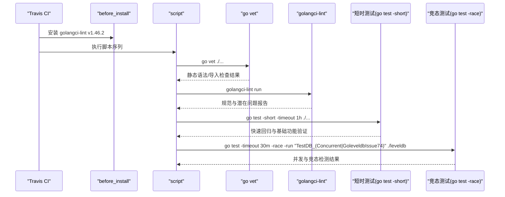
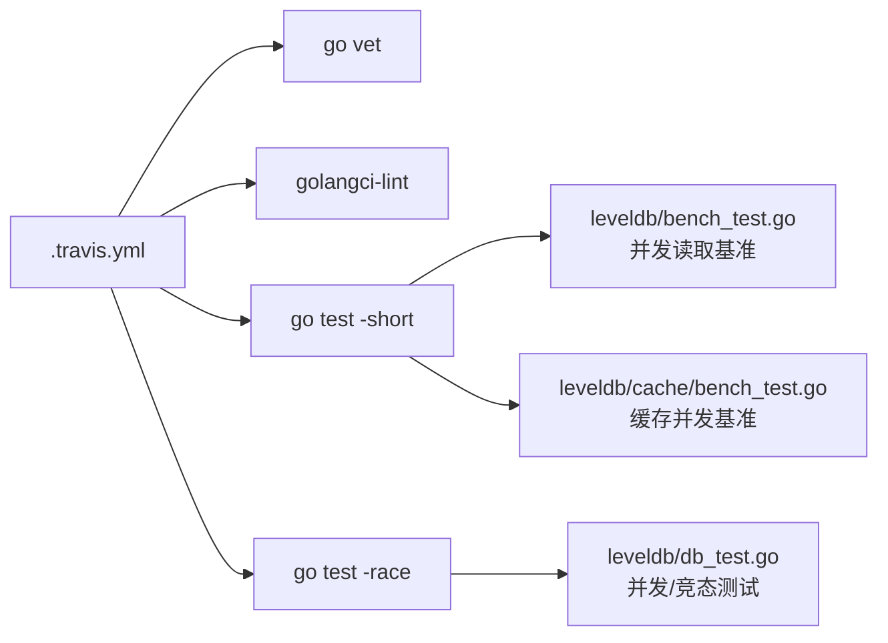

# CI/CD与自动化流程

<cite>
**本文引用的文件**
- [.travis.yml](file://.travis.yml)
- [.golangci.yml](file://.golangci.yml)
- [go.mod](file://go.mod)
- [README.md](file://README.md)
- [leveldb/db_test.go](file://leveldb/db_test.go)
- [leveldb/mlsm_final_comprehensive_test.go](file://leveldb/mlsm_final_comprehensive_test.go)
- [leveldb/mlsm_version_history_test.go](file://leveldb/mlsm_version_history_test.go)
- [leveldb/bench_test.go](file://leveldb/bench_test.go)
- [leveldb/cache/bench_test.go](file://leveldb/cache/bench_test.go)
- [leveldb/cache/cache_test.go](file://leveldb/cache/cache_test.go)
- [leveldb/manualtest/dbstress/main.go](file://manualtest/dbstress/main.go)
</cite>

## 目录
1. [简介](#简介)
2. [项目结构](#项目结构)
3. [核心组件](#核心组件)
4. [架构总览](#架构总览)
5. [详细组件分析](#详细组件分析)
6. [依赖关系分析](#依赖关系分析)
7. [性能考量](#性能考量)
8. [故障排查指南](#故障排查指南)
9. [结论](#结论)
10. [附录](#附录)

## 简介
本文件面向 avccDB 的 CI/CD 自动化流程，围绕 .travis.yml 中定义的流水线步骤，系统性解析从代码静态检查到多版本兼容性测试、竞态条件检测与长时/并发测试的设计意图与实现要点。同时结合 .golangci.yml 配置说明静态检查规则，并给出开发者本地测试建议与 CI 失败日志定位方法，帮助团队在高并发场景下保障 mLSM 架构的线程安全与稳定性。

## 项目结构
仓库采用按模块与层次组织的结构，核心目录包括：
- cmd：命令行工具入口
- leveldb：核心数据库实现与测试
- manualtest：手动压力测试与示例
- 根目录配置：Travis CI、Go 模块与静态检查配置

```mermaid
graph TB
A[".travis.yml<br/>CI 流水线定义"] --> B["before_install<br/>安装 golangci-lint"]
A --> C["script<br/>执行测试步骤"]
C --> C1["go vet ./..."]
C --> C2["golangci-lint run"]
C --> C3["go test -short -timeout 1h ./..."]
C --> C4["go test -timeout 30m -race -run \"TestDB_(Concurrent|GoleveldbIssue74)\" ./leveldb"]
D[".golangci.yml<br/>静态检查规则"] --> E["启用的 linters"]
F["go.mod<br/>Go 版本要求"] --> G["1.14 及以上"]
H["README.md<br/>使用与并发说明"] --> I["DB 并发安全声明"]
```

图表来源
- [.travis.yml](file://.travis.yml#L1-L16)
- [.golangci.yml](file://.golangci.yml#L1-L12)
- [go.mod](file://go.mod#L1-L5)
- [README.md](file://README.md#L1-L26)

章节来源
- [.travis.yml](file://.travis.yml#L1-L16)
- [.golangci.yml](file://.golangci.yml#L1-L12)
- [go.mod](file://go.mod#L1-L5)
- [README.md](file://README.md#L1-L26)

## 核心组件
- Travis CI 流水线：定义 Go 版本矩阵与四步执行序列，覆盖静态检查、短时测试与竞态检测。
- golangci-lint：通过 before_install 安装指定版本，配合 .golangci.yml 启用格式化、规范与类型检查等规则。
- 测试子集：包含通用短测与针对并发与竞态的专项测试，聚焦 leveldb 包内的并发与历史版本特性。
- 性能基准：提供并发读取与缓存并发操作的基准测试，辅助评估高并发下的吞吐与延迟。

章节来源
- [.travis.yml](file://.travis.yml#L1-L16)
- [.golangci.yml](file://.golangci.yml#L1-L12)
- [leveldb/db_test.go](file://leveldb/db_test.go#L1743-L1884)
- [leveldb/db_test.go](file://leveldb/db_test.go#L2061-L2140)
- [leveldb/bench_test.go](file://leveldb/bench_test.go#L465-L507)
- [leveldb/cache/bench_test.go](file://leveldb/cache/bench_test.go#L115-L201)

## 架构总览
下图展示 CI 流水线在 Travis 上的执行顺序与各阶段职责：



图表来源
- [.travis.yml](file://.travis.yml#L1-L16)
- [.golangci.yml](file://.golangci.yml#L1-L12)

## 详细组件分析

### Travis CI 流水线与 Go 版本矩阵
- 语言与环境：使用 go 语言环境。
- 版本矩阵：1.14.x、1.18.x、tip（Go 开发版），用于验证跨版本兼容性与早期引入的新特性/变更对现有代码的影响。
- before_install：通过官方安装脚本安装 golangci-lint v1.46.2 到 GOPATH/bin，确保后续 lint 步骤可用。
- script 四步：
  1) go vet ./...：对全部包执行静态分析，发现语法、导入与基本风格问题。
  2) golangci-lint run：执行 .golangci.yml 中启用的 linters，统一代码质量标准。
  3) go test -short -timeout 1h ./...：快速回归测试，覆盖大部分非长耗时逻辑，设置 1 小时超时。
  4) go test -timeout 30m -race -run "TestDB_(Concurrent|GoleveldbIssue74)" ./leveldb：仅运行并发与竞态相关测试，设置 30 分钟超时，确保在高并发场景下验证线程安全。

章节来源
- [.travis.yml](file://.travis.yml#L1-L16)
- [go.mod](file://go.mod#L1-L5)

### golangci-lint 安装与规则配置
- 安装方式：通过 curl 下载官方安装脚本并安装到 GOPATH/bin，版本固定为 v1.46.2，保证 CI 稳定可复现。
- 规则启用：
  - gofmt：自动格式化
  - gocritic：代码风格与潜在问题检查（部分检查项被禁用）
  - unconvert：消除不必要的类型转换
- 禁用规则：示例中禁用了若干 gocritic 检查，避免过度严格导致噪音或误报。

章节来源
- [.travis.yml](file://.travis.yml#L1-L16)
- [.golangci.yml](file://.golangci.yml#L1-L12)

### 多版本兼容性测试的重要性
- 目标：确保在 1.14.x、1.18.x 与 tip 三个版本上均能编译、通过静态检查与测试，降低因 Go 语言演进而引入的破坏性变更风险。
- 价值：提前发现 API 变更、GC 行为差异、编译器优化变化对并发与内存管理的影响，保障生产环境的稳定性。

章节来源
- [.travis.yml](file://.travis.yml#L6-L10)
- [go.mod](file://go.mod#L1-L5)

### 静态检查与 go vet 的作用
- go vet：发现导入未使用、printf 风格错误、结构体字段未导出等问题，作为第一道防线。
- golangci-lint：在 go vet 基础上扩展更多规则，统一代码风格与潜在问题识别，减少人工 review 成本。

章节来源
- [.travis.yml](file://.travis.yml#L11-L16)
- [.golangci.yml](file://.golangci.yml#L1-L12)

### 常规测试套件运行（go test -short）
- 范围：./...，即整个仓库的所有包。
- 目的：快速验证核心功能与回归路径，避免长耗时测试干扰日常 CI。
- 超时：1 小时，平衡覆盖率与 CI 时长。

章节来源
- [.travis.yml](file://.travis.yml#L14-L16)

### 竞态条件检测（-race）与专项测试
- 专项测试集合：仅运行 leveldb 包内以 TestDB_Concurrent 与 TestDB_GoleveldbIssue74 开头的测试，聚焦并发写入、迭代器、快照与竞态问题。
- -race 参数：启用 Go 内置竞态检测器，捕获数据竞争、死锁与同步错误。
- 超时：30 分钟，为高并发场景预留充足时间。
- 设计目的：在高并发写入、随机读取、迭代器遍历与批量事务等复杂场景下，验证 mLSM 架构的线程安全性与一致性。

章节来源
- [.travis.yml](file://.travis.yml#L15-L16)
- [leveldb/db_test.go](file://leveldb/db_test.go#L1743-L1884)
- [leveldb/db_test.go](file://leveldb/db_test.go#L2061-L2140)

### 长超时测试与并发测试用例设计
- 长超时测试：通过 -timeout 30m 运行竞态敏感测试，允许长时间并发压力下的稳定运行，观察后台 compaction、迭代器与快照行为。
- 并发测试用例：
  - TestDB_Concurrent：多 goroutine 并发 Put/Get/Iterate，校验键值一致性与序号递增约束。
  - TestDB_GoleveldbIssue74：模拟大量批量写入与读取交替，验证在特定选项与高负载下的稳定性。
- 目的：在真实高并发场景下暴露潜在的数据竞争、迭代器失效、快照一致性等问题，确保 mLSM 在复杂工作负载下的健壮性。

章节来源
- [leveldb/db_test.go](file://leveldb/db_test.go#L1743-L1884)
- [leveldb/db_test.go](file://leveldb/db_test.go#L2061-L2140)

### mLSM 架构的线程安全性验证
- 版本化写入与历史查询：通过大规模写入与版本历史查询测试，验证多版本一致性与查询正确性。
- Compaction 与并发：在不强制 Compaction 的情况下观察自然分布，再在 Compaction 后进行二次验证，确保压缩过程不影响数据完整性。
- 并发读写与迭代：并发写入与迭代器遍历同时进行，验证快照隔离与迭代器一致性。
- 缓存并发：缓存模块的并发基准与测试覆盖插入、查找、删除等操作的线程安全。

章节来源
- [leveldb/mlsm_final_comprehensive_test.go](file://leveldb/mlsm_final_comprehensive_test.go#L1-L200)
- [leveldb/mlsm_version_history_test.go](file://leveldb/mlsm_version_history_test.go#L1-L200)
- [leveldb/cache/bench_test.go](file://leveldb/cache/bench_test.go#L115-L201)
- [leveldb/cache/cache_test.go](file://leveldb/cache/cache_test.go#L163-L219)

### 本地开发者测试流程
- 本地安装 Go：满足 go.mod 中的最低版本要求（至少 1.14）。
- 本地静态检查：先运行 go vet 与 golangci-lint，修复报告的问题后再进入测试阶段。
- 本地回归测试：go test -short ./...，确保快速通过。
- 本地竞态检测：go test -race -run "TestDB_(Concurrent|GoleveldbIssue74)" ./leveldb，观察是否存在数据竞争。
- 本地性能基准：go test -bench=. -run=^$ ./leveldb 或针对具体子包运行基准测试，评估并发读取与缓存性能。
- 本地压力测试：参考 manualtest/dbstress/main.go 的并发写入与读取模式，自定义参数进行压力验证。

章节来源
- [go.mod](file://go.mod#L1-L5)
- [.golangci.yml](file://.golangci.yml#L1-L12)
- [leveldb/db_test.go](file://leveldb/db_test.go#L1743-L1884)
- [leveldb/db_test.go](file://leveldb/db_test.go#L2061-L2140)
- [leveldb/bench_test.go](file://leveldb/bench_test.go#L465-L507)
- [manualtest/dbstress/main.go](file://manualtest/dbstress/main.go#L461-L510)

### 如何解读 CI 失败日志进行问题定位
- go vet 失败：通常为语法、导入或 printf 风格问题，优先修复；若涉及第三方依赖，确认版本兼容性。
- golangci-lint 失败：根据规则输出逐条修复，必要时调整 .golangci.yml 中的启用/禁用规则。
- go test -short 失败：关注失败用例的输入与期望输出，缩小范围到对应包或函数；检查是否与竞态相关。
- -race 失败：出现数据竞争或同步错误，重点检查共享变量访问、锁使用、原子操作与迭代器生命周期；结合 README.md 中的并发安全声明核对使用方式。
- 长超时测试失败：可能由资源争用或死锁引起，结合 -race 输出与日志定位热点路径。

章节来源
- [.travis.yml](file://.travis.yml#L11-L16)
- [README.md](file://README.md#L18-L26)

## 依赖关系分析
- Travis CI 依赖 Go 版本矩阵与 golangci-lint 安装脚本，确保静态检查与测试在不同 Go 版本下一致。
- 测试依赖 leveldb 包内的并发与竞态测试用例，覆盖写入、读取、迭代与快照等关键路径。
- 性能基准依赖 leveldb 与缓存模块的基准测试，用于评估并发读取与缓存操作的吞吐与延迟。



图表来源
- [.travis.yml](file://.travis.yml#L1-L16)
- [leveldb/db_test.go](file://leveldb/db_test.go#L1743-L1884)
- [leveldb/db_test.go](file://leveldb/db_test.go#L2061-L2140)
- [leveldb/bench_test.go](file://leveldb/bench_test.go#L465-L507)
- [leveldb/cache/bench_test.go](file://leveldb/cache/bench_test.go#L115-L201)

## 性能考量
- 并发读取基准：通过 BenchmarkDBReadConcurrent 与 BenchmarkDBReadConcurrent2 评估多 goroutine 下的读取性能与方向切换开销。
- 缓存并发基准：覆盖插入、查找、删除的并行场景，评估缓存节点数与统计信息对性能的影响。
- 写入与批量：通过 manualtest/dbstress/main.go 的并发写入与读取模式，模拟生产级压力，指导调优参数（如缓冲区大小、压缩策略）。

章节来源
- [leveldb/bench_test.go](file://leveldb/bench_test.go#L465-L507)
- [leveldb/cache/bench_test.go](file://leveldb/cache/bench_test.go#L115-L201)
- [manualtest/dbstress/main.go](file://manualtest/dbstress/main.go#L461-L510)

## 故障排查指南
- 数据竞争定位：使用 -race 输出的 goroutine 序列与共享变量访问路径，逐步回溯到具体函数与锁使用点。
- 迭代器失效：检查迭代器生命周期与数据库关闭时机，确保在迭代过程中不会关闭数据库或释放快照。
- 并发写入冲突：核对批量写入与随机读取的并发边界，避免未加锁的共享状态访问。
- 静态检查失败：优先修复 go vet 报告的语法与导入问题，再处理 golangci-lint 的风格与潜在问题。

章节来源
- [.travis.yml](file://.travis.yml#L11-L16)
- [leveldb/db_test.go](file://leveldb/db_test.go#L1743-L1884)
- [leveldb/db_test.go](file://leveldb/db_test.go#L2061-L2140)

## 结论
本 CI/CD 流水线通过多版本矩阵、静态检查、短时回归与竞态检测，全面覆盖了 avccDB 在不同 Go 版本与高并发场景下的质量门禁。结合 .golangci.yml 的规则与专项并发测试，能够有效提升代码质量与系统稳定性。建议开发者在本地先行完成静态检查与短测，再进行竞态与性能验证，以缩短反馈周期并提高合并效率。

## 附录
- Go 版本要求：go.mod 明确最低版本为 1.14。
- 并发安全声明：README.md 指出 DB 实例支持并发使用，所有方法可从多个 goroutine 并发调用。
- 专项测试命名：并发测试以 TestDB_Concurrent 开头，竞态问题相关以 TestDB_GoleveldbIssue74 开头。

章节来源
- [go.mod](file://go.mod#L1-L5)
- [README.md](file://README.md#L18-L26)
- [leveldb/db_test.go](file://leveldb/db_test.go#L1743-L1884)
- [leveldb/db_test.go](file://leveldb/db_test.go#L2061-L2140)