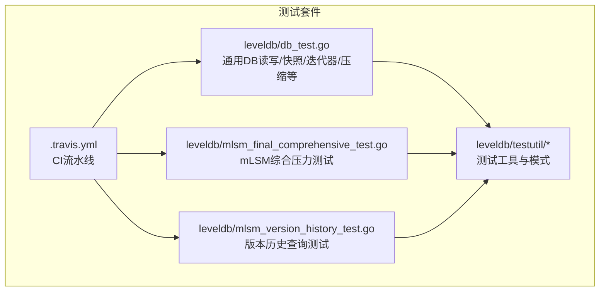
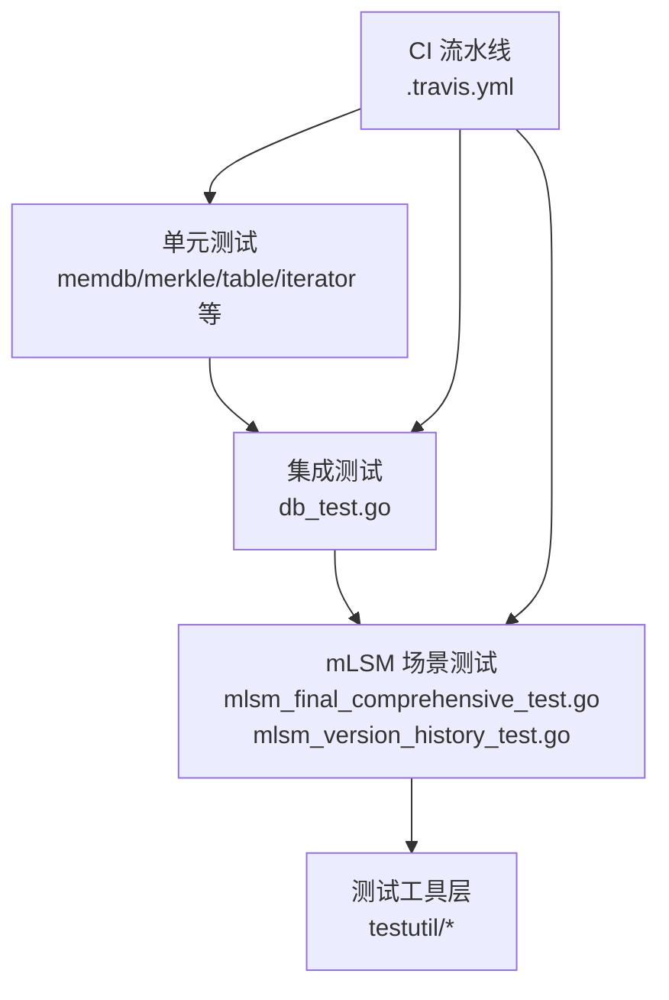
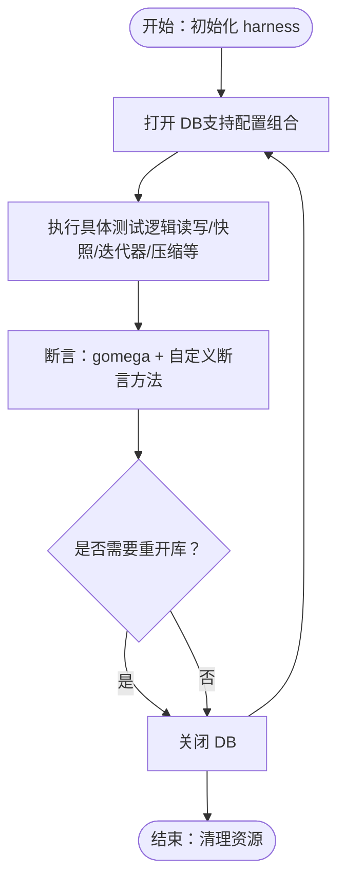
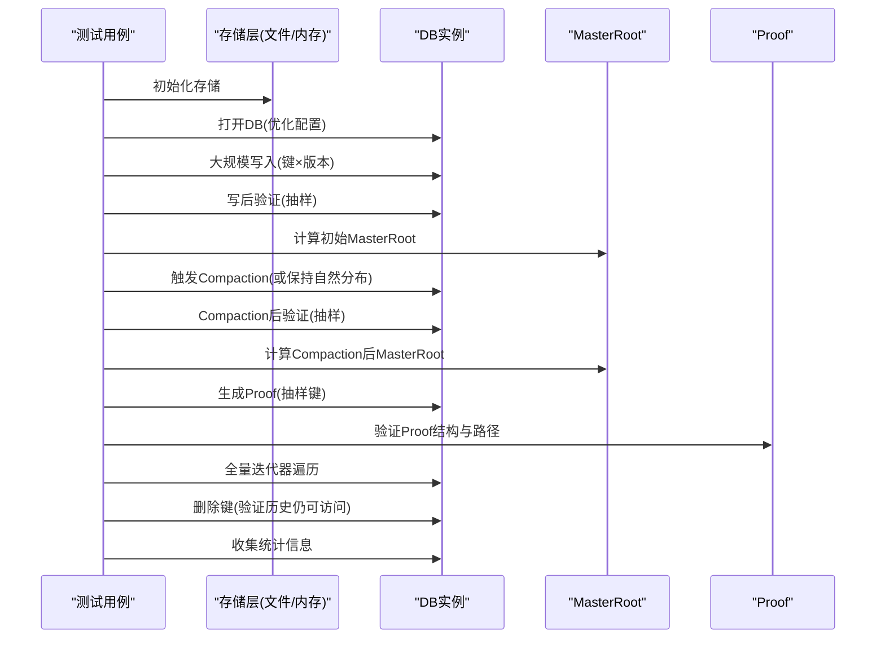
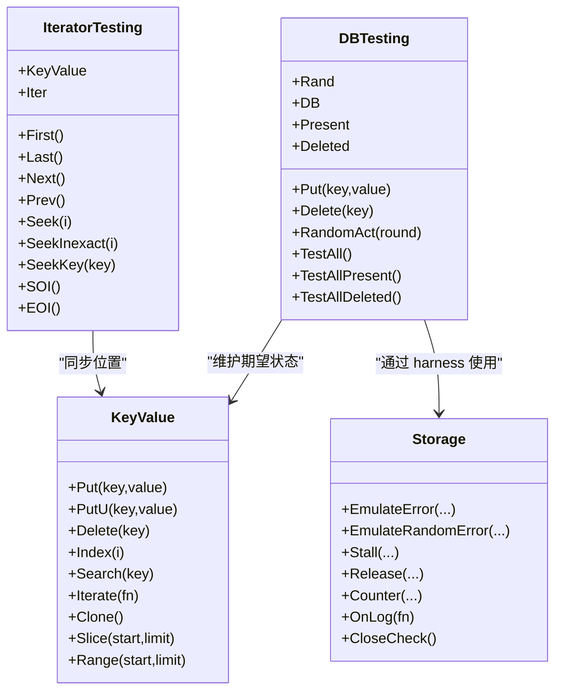
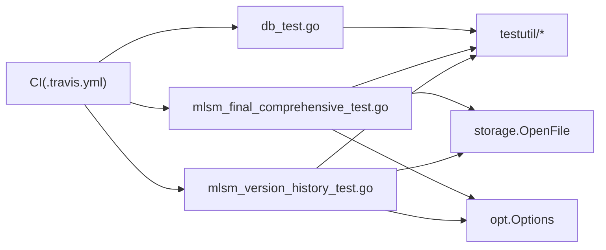

# 测试与验证

<cite>
**本文引用的文件列表**
- [leveldb/db_test.go](file://leveldb/db_test.go)
- [leveldb/mlsm_final_comprehensive_test.go](file://leveldb/mlsm_final_comprehensive_test.go)
- [leveldb/mlsm_version_history_test.go](file://leveldb/mlsm_version_history_test.go)
- [.travis.yml](file://.travis.yml)
- [leveldb/testutil/db.go](file://leveldb/testutil/db.go)
- [leveldb/testutil/ginkgo.go](file://leveldb/testutil/ginkgo.go)
- [leveldb/testutil/kv.go](file://leveldb/testutil/kv.go)
- [leveldb/testutil/iter.go](file://leveldb/testutil/iter.go)
- [leveldb/testutil/util.go](file://leveldb/testutil/util.go)
- [leveldb/testutil/storage.go](file://leveldb/testutil/storage.go)
- [leveldb/testutil/kvtest.go](file://leveldb/testutil/kvtest.go)
- [leveldb/testutil_test.go](file://leveldb/testutil_test.go)
- [leveldb/leveldb_suite_test.go](file://leveldb/leveldb_suite_test.go)
</cite>

## 目录
1. [简介](#简介)
2. [项目结构与测试组织](#项目结构与测试组织)
3. [核心组件与测试范围](#核心组件与测试范围)
4. [架构概览与测试交互](#架构概览与测试交互)
5. [详细组件分析](#详细组件分析)
6. [依赖关系分析](#依赖关系分析)
7. [性能与压力测试建议](#性能与压力测试建议)
8. [故障排查指南](#故障排查指南)
9. [结论](#结论)
10. [附录：最佳实践与示例](#附录最佳实践与示例)

## 简介
本文件面向 avccDB（基于 goleveldb 的扩展）的测试体系，系统梳理单元测试、集成测试与压力测试的覆盖范围与执行方式，重点解读关键测试文件（如 db_test.go、mlsm_final_comprehensive_test.go），并说明 testutil 包提供的测试辅助工具与模式。同时，结合 .travis.yml 中的 CI 流程，给出运行测试、解读结果与扩展测试的最佳实践，特别强调测试在保障 mLSM 架构正确性（版本一致性、Merkle 证明有效性）方面的作用。

## 项目结构与测试组织
- 单元测试集中在各模块目录下的 *_test.go 文件，例如 leveldb/ 下的 db_test.go、memdb_test.go、merkle_test.go 等。
- 集成测试与端到端验证集中在 leveldb/ 目录下，如 mlsm_final_comprehensive_test.go、mlsm_version_history_test.go。
- 测试工具与辅助框架位于 leveldb/testutil/，提供统一的 DB/迭代器/键值对测试模式，以及模拟存储层能力。
- CI 配置位于根目录 .travis.yml，定义了代码检查与自动化测试步骤。

图表来源
- [leveldb/db_test.go](file://leveldb/db_test.go#L1-L120)
- [leveldb/mlsm_final_comprehensive_test.go](file://leveldb/mlsm_final_comprehensive_test.go#L1-L120)
- [leveldb/mlsm_version_history_test.go](file://leveldb/mlsm_version_history_test.go#L1-L120)
- [leveldb/testutil/db.go](file://leveldb/testutil/db.go#L1-L120)
- [.travis.yml](file://.travis.yml#L1-L16)

章节来源
- [leveldb/db_test.go](file://leveldb/db_test.go#L1-L120)
- [leveldb/mlsm_final_comprehensive_test.go](file://leveldb/mlsm_final_comprehensive_test.go#L1-L120)
- [leveldb/mlsm_version_history_test.go](file://leveldb/mlsm_version_history_test.go#L1-L120)
- [.travis.yml](file://.travis.yml#L1-L16)

## 核心组件与测试范围
- 通用 DB 测试（db_test.go）
  - 覆盖点：空库、读写、删除、快照、多级有序、重开库、冻结内存表读取、并发写入、迭代器行为、压缩策略等。
  - 典型测试函数：TestDB_Locking、TestDB_Empty、TestDB_ReadWrite、TestDB_PutDeleteGet、TestDB_GetSnapshot、TestDB_GetLevel0Ordering、TestDB_GetOrderedByLevels、TestDB_GetPicksCorrectFile、TestDB_GetEncountersEmptyLevel0 等。
- mLSM 综合压力测试（mlsm_final_comprehensive_test.go）
  - 覆盖点：超大规模写入（20万键×5版本=100万条记录）、写后验证、MasterRoot 计算、Compaction 后验证、Proof 生成与验证、全量迭代器遍历、删除与 Tombstone 行为、统计信息收集。
  - 关键断言：版本一致性、Merkle 路径结构完整性、MasterRoot 在 Compaction 前后的一致性或更新、删除后历史版本可查询（mLSM 保留历史）。
- 版本历史查询测试（mlsm_version_history_test.go）
  - 覆盖点：GetVersionHistory 的全量查询、范围查询、最小/最大边界、Compaction 前后一致性、多键场景。
- 测试工具（testutil/*）
  - 提供统一的 DB 接口抽象（Put/Delete/Get/Find/NewIterator）、键值对容器（KeyValue）、迭代器测试（IteratorTesting）、随机化与打乱索引（ShuffledIndex/RandomIndex）、存储层模拟（Storage：错误注入、阻塞、计数）等。

章节来源
- [leveldb/db_test.go](file://leveldb/db_test.go#L570-L760)
- [leveldb/mlsm_final_comprehensive_test.go](file://leveldb/mlsm_final_comprehensive_test.go#L1-L200)
- [leveldb/mlsm_version_history_test.go](file://leveldb/mlsm_version_history_test.go#L1-L140)
- [leveldb/testutil/db.go](file://leveldb/testutil/db.go#L1-L120)
- [leveldb/testutil/kv.go](file://leveldb/testutil/kv.go#L1-L120)
- [leveldb/testutil/iter.go](file://leveldb/testutil/iter.go#L1-L120)
- [leveldb/testutil/storage.go](file://leveldb/testutil/storage.go#L1-L120)

## 架构概览与测试交互
测试体系围绕以下层次展开：
- 单元测试层：针对具体模块（如 memdb、merkle、table、iterator）的行为验证。
- 集成测试层：对 DB 层整体行为（读写、快照、压缩、迭代器）进行端到端验证。
- mLSM 场景测试层：面向版本化写入、历史查询、Merkle 证明、MasterRoot 的一致性与稳定性。
- 测试工具层：testutil 提供统一接口、随机化、迭代器与键值对测试模式，以及存储层模拟。

图表来源
- [leveldb/db_test.go](file://leveldb/db_test.go#L1-L120)
- [leveldb/mlsm_final_comprehensive_test.go](file://leveldb/mlsm_final_comprehensive_test.go#L1-L120)
- [leveldb/mlsm_version_history_test.go](file://leveldb/mlsm_version_history_test.go#L1-L120)
- [leveldb/testutil/db.go](file://leveldb/testutil/db.go#L1-L120)
- [.travis.yml](file://.travis.yml#L1-L16)

## 详细组件分析

### db_test.go：通用 DB 行为与一致性测试
- 设计要点
  - 使用 harness 封装 DB 生命周期、存储、读写选项与断言方法，统一测试模板。
  - 通过 truno/trun 等函数在多种配置组合（过滤器、压缩、禁用大批次事务、重开库）下重复执行同一测试逻辑，提升鲁棒性。
  - 使用 gomega 断言，结合自定义日志与关闭策略（失败时保留数据）。
- 关键测试覆盖
  - 基础读写与删除、快照隔离、多级有序、冻结内存表读取、迭代器边界与顺序、压缩触发与层级分布、重开库一致性等。
- 代表性测试函数
  - TestDB_Locking、TestDB_Empty、TestDB_ReadWrite、TestDB_PutDeleteGet、TestDB_GetSnapshot、TestDB_GetLevel0Ordering、TestDB_GetOrderedByLevels、TestDB_GetPicksCorrectFile、TestDB_GetEncountersEmptyLevel0 等。

图表来源
- [leveldb/db_test.go](file://leveldb/db_test.go#L80-L160)
- [leveldb/db_test.go](file://leveldb/db_test.go#L570-L760)

章节来源
- [leveldb/db_test.go](file://leveldb/db_test.go#L80-L160)
- [leveldb/db_test.go](file://leveldb/db_test.go#L570-L760)

### mLSM 综合压力测试：mlsm_final_comprehensive_test.go
- 设计要点
  - 超大规模写入（20万键×5版本=100万条记录），触发多层 Compaction。
  - 写后验证、Compaction 后验证、MasterRoot 计算与一致性、Proof 生成与验证（含 Merkle 路径校验与 MasterRoot 对比）、全量迭代器遍历、删除与 Tombstone 行为验证、统计信息收集。
- 关键断言
  - 版本一致性：按版本号精确查询与最新版本一致性。
  - Merkle 证明：Proof 结构完整性与路径一致性；在未完全实现跨层聚合时，允许 Proof.Root 与 MasterRoot 不一致的场景。
  - MasterRoot：Compaction 前后一致性或更新。
  - 删除：mLSM 保留历史，删除后仍可通过指定版本查询历史数据。
- 流程示意

图表来源
- [leveldb/mlsm_final_comprehensive_test.go](file://leveldb/mlsm_final_comprehensive_test.go#L1-L200)
- [leveldb/mlsm_final_comprehensive_test.go](file://leveldb/mlsm_final_comprehensive_test.go#L200-L360)
- [leveldb/mlsm_final_comprehensive_test.go](file://leveldb/mlsm_final_comprehensive_test.go#L360-L479)

章节来源
- [leveldb/mlsm_final_comprehensive_test.go](file://leveldb/mlsm_final_comprehensive_test.go#L1-L200)
- [leveldb/mlsm_final_comprehensive_test.go](file://leveldb/mlsm_final_comprehensive_test.go#L200-L360)
- [leveldb/mlsm_final_comprehensive_test.go](file://leveldb/mlsm_final_comprehensive_test.go#L360-L479)

### 版本历史查询测试：mlsm_version_history_test.go
- 设计要点
  - 针对 GetVersionHistory 的全量查询、范围查询（min/max）、单侧边界、非存在键处理。
  - Compaction 前后版本历史一致性验证，多键场景覆盖。
- 关键断言
  - 版本号与值一一对应，范围查询结果符合边界约束。
  - Compaction 不影响历史版本的完整性与顺序。

章节来源
- [leveldb/mlsm_version_history_test.go](file://leveldb/mlsm_version_history_test.go#L1-L140)
- [leveldb/mlsm_version_history_test.go](file://leveldb/mlsm_version_history_test.go#L140-L230)
- [leveldb/mlsm_version_history_test.go](file://leveldb/mlsm_version_history_test.go#L230-L286)

### testutil 包：测试工具与模式
- DB 接口与测试模式（db.go）
  - 定义 Put/Delete/Get/Find/NewIterator 接口，DBTesting 统一 Put/Delete/随机动作序列与断言。
  - 提供 TestAll/TestAllPresent/TestAllDeleted/TestPresentKV/TestDeletedKey 等断言方法。
- 键值对容器（kv.go）
  - KeyValue：有序键值集合，支持 Put/PutU/Delete/Index/Search/Iterate/Clone/Slice/Range 等。
  - 提供特殊构造（空键/空值/单键/大值/特殊键/多键/生成键值）与随机生成。
- 迭代器测试（iter.go）
  - IteratorTesting：封装 First/Last/Next/Prev/Seek/SeekInexact/SeekKey/EOI/SOI 等行为，并与 KeyValue 对象同步位置。
  - DoIteratorTesting：对迭代器进行全面的顺序、逆序、随机定位与边界测试。
- 工具函数（util.go）
  - 随机种子与随机源、字节分隔符/后继键、随机索引/打乱索引、范围选择、最大/最小等。
- 存储层模拟（storage.go）
  - Storage：包装 storage.Storage，提供错误注入（固定/随机）、阻塞（Stall/Release）、计数（Counter）、日志（OnLog）、关闭检查（CloseCheck）等。
  - 支持文件系统与内存存储切换，便于快速清理与复现问题。
- 键值对测试（kvtest.go）
  - TestFind/TestGet/TestHas/TestIter/TestFindAfterLast 等断言函数。
  - KeyValueTesting/AllKeyValueTesting：批量覆盖空集、特殊键值、生成数据等场景。
- 测试适配器（testutil_test.go）
  - testingDB/testingTransaction：将 DB/Transaction 适配为测试接口，便于统一测试模式。

图表来源
- [leveldb/testutil/db.go](file://leveldb/testutil/db.go#L1-L120)
- [leveldb/testutil/kv.go](file://leveldb/testutil/kv.go#L1-L120)
- [leveldb/testutil/iter.go](file://leveldb/testutil/iter.go#L1-L120)
- [leveldb/testutil/storage.go](file://leveldb/testutil/storage.go#L1-L120)

章节来源
- [leveldb/testutil/db.go](file://leveldb/testutil/db.go#L1-L120)
- [leveldb/testutil/kv.go](file://leveldb/testutil/kv.go#L1-L120)
- [leveldb/testutil/iter.go](file://leveldb/testutil/iter.go#L1-L120)
- [leveldb/testutil/storage.go](file://leveldb/testutil/storage.go#L1-L120)
- [leveldb/testutil/kvtest.go](file://leveldb/testutil/kvtest.go#L1-L120)
- [leveldb/testutil_test.go](file://leveldb/testutil_test.go#L1-L60)

## 依赖关系分析
- 测试套件依赖关系
  - db_test.go 依赖 testutil 的 Storage、DBHarness、gomega 断言。
  - mLSM 综合测试依赖 storage.OpenFile、opt.Options、DB 的版本化接口（PutWithVersion/GetWithVersion/GetWithProof/GetMasterRoot/Stats）。
  - 版本历史测试依赖 storage.NewMemStorage、opt.Options、DB 的 GetVersionHistory。
  - testutil 提供统一的 DB/迭代器/键值对测试模式，贯穿各测试文件。
- CI 依赖
  - .travis.yml 使用 golangci-lint、go vet、go test -short 与特定 race 测试，确保静态检查与基础稳定性。

图表来源
- [leveldb/db_test.go](file://leveldb/db_test.go#L1-L120)
- [leveldb/mlsm_final_comprehensive_test.go](file://leveldb/mlsm_final_comprehensive_test.go#L1-L120)
- [leveldb/mlsm_version_history_test.go](file://leveldb/mlsm_version_history_test.go#L1-L120)
- [leveldb/testutil/storage.go](file://leveldb/testutil/storage.go#L1-L120)
- [leveldb/testutil/db.go](file://leveldb/testutil/db.go#L1-L120)
- [.travis.yml](file://.travis.yml#L1-L16)

章节来源
- [leveldb/db_test.go](file://leveldb/db_test.go#L1-L120)
- [leveldb/mlsm_final_comprehensive_test.go](file://leveldb/mlsm_final_comprehensive_test.go#L1-L120)
- [leveldb/mlsm_version_history_test.go](file://leveldb/mlsm_version_history_test.go#L1-L120)
- [leveldb/testutil/storage.go](file://leveldb/testutil/storage.go#L1-L120)
- [.travis.yml](file://.travis.yml#L1-L16)

## 性能与压力测试建议
- 基于现有测试扩展
  - 在 db_test.go 中增加高并发写入与读取的基准测试（bench_test.go 已存在），结合 -bench/-benchtime/-benchmem 参数评估吞吐与内存分配。
  - 在 mLSM 综合测试中引入不同写缓冲、SST 大小、压缩策略组合，观察 Compaction 行为与 MasterRoot 更新频率。
- 压力测试维度
  - 数据规模：从万级到百万级键，逐步扩大以观察压缩与迭代器性能。
  - 并发场景：利用 -race 检测竞态，结合 db_test.go 中的并发写入测试。
  - 存储层压力：通过 testutil.Storage 的错误注入与阻塞，模拟磁盘抖动、网络延迟等异常。
- 统计指标
  - 使用 DB.Stats 收集层级表数量、大小、Compaction 耗时，评估压缩效率与空间放大。

[本节为通用建议，无需列出具体文件来源]

## 故障排查指南
- 常见问题定位
  - 存储层异常：使用 testutil.Storage 的 EmulateError/EmulateRandomError 注入错误，配合 Stall/Release 控制 I/O 阶段，复现并定位问题。
  - 迭代器异常：通过 IteratorTesting 的全面遍历与边界测试，快速发现 Seek/Next/Prev 的不一致。
  - 版本一致性：在 mLSM 综合测试中，对比 Compaction 前后的 MasterRoot 与版本查询结果，确认历史版本未丢失。
- 日志与清理
  - Storage.OnLog 记录 I/O 事件，便于回溯。
  - CloseCheck 确保无泄漏文件句柄；失败时可启用保留策略以便人工检查。
- CI 失败排查
  - go vet 与 golangci-lint 失败优先修复静态检查问题。
  - -race 测试失败需定位并发写入/读取竞争点，结合 db_test.go 的并发测试用例逐项排除。

章节来源
- [leveldb/testutil/storage.go](file://leveldb/testutil/storage.go#L520-L697)
- [leveldb/testutil/iter.go](file://leveldb/testutil/iter.go#L1-L120)
- [leveldb/mlsm_final_comprehensive_test.go](file://leveldb/mlsm_final_comprehensive_test.go#L360-L479)
- [.travis.yml](file://.travis.yml#L1-L16)

## 结论
本测试体系通过单元测试、集成测试与 mLSM 场景测试三层次覆盖，结合 testutil 的统一工具与模拟能力，有效保障了 avccDB 在复杂数据模型与高负载场景下的正确性与稳定性。db_test.go 提供基础行为验证，mlsm_final_comprehensive_test.go 与 mlsm_version_history_test.go 则聚焦 mLSM 的版本一致性与 Merkle 证明有效性。CI 流程确保静态检查与基础稳定性，建议在此基础上进一步完善压力与并发测试，持续提升系统可靠性。

[本节为总结，无需列出具体文件来源]

## 附录：最佳实践与示例

### 如何运行现有测试套件
- 基础测试
  - go test -short -timeout 1h ./...
- 并发与特定问题测试
  - go test -timeout 30m -race -run "TestDB_(Concurrent|GoleveldbIssue74)" ./leveldb
- BDD 风格测试（可选）
  - 若需使用 ginkgo/gomega 的 BDD 测试，可在 testutil/ginkgo.go 中注册 RunSuite，然后在相应模块中使用 Describe/It 等语法组织测试。

章节来源
- [.travis.yml](file://.travis.yml#L1-L16)
- [leveldb/testutil/ginkgo.go](file://leveldb/testutil/ginkgo.go#L1-L22)

### 编写新测试的最佳实践
- 使用 testutil 的统一模式
  - 使用 DBTesting/KeyValue/IteratorTesting 快速构建测试骨架，减少样板代码。
  - 通过 AllKeyValueTesting 批量覆盖多种键值场景。
- 面向 mLSM 的测试要点
  - 版本一致性：严格校验版本号与值的对应关系，范围查询边界。
  - Merkle 证明：验证 Proof 结构完整性与路径一致性；在跨层聚合未完全实现时，合理放宽断言条件。
  - MasterRoot：比较 Compaction 前后 MasterRoot，确保一致性或正确更新。
- 并发与稳定性
  - 使用 -race 检测竞态；在 db_test.go 的并发写入测试基础上扩展更多并发场景。
- 存储层异常模拟
  - 使用 Storage 的错误注入与阻塞，模拟磁盘故障、网络抖动等极端情况，验证恢复与一致性。

章节来源
- [leveldb/testutil/db.go](file://leveldb/testutil/db.go#L1-L120)
- [leveldb/testutil/kv.go](file://leveldb/testutil/kv.go#L1-L120)
- [leveldb/testutil/iter.go](file://leveldb/testutil/iter.go#L1-L120)
- [leveldb/testutil/storage.go](file://leveldb/testutil/storage.go#L1-L120)
- [leveldb/testutil/kvtest.go](file://leveldb/testutil/kvtest.go#L1-L120)
- [.travis.yml](file://.travis.yml#L1-L16)