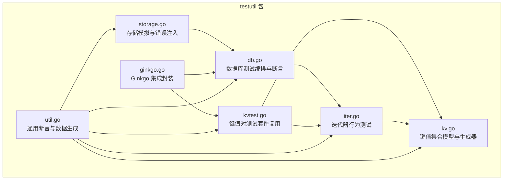
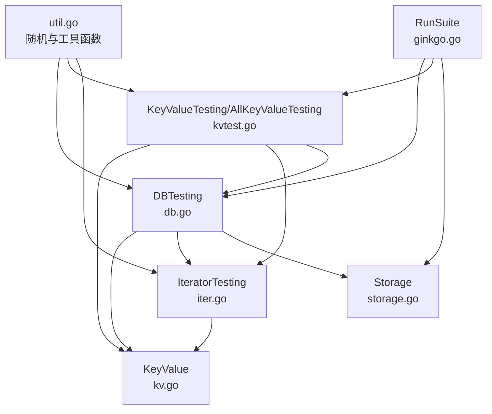
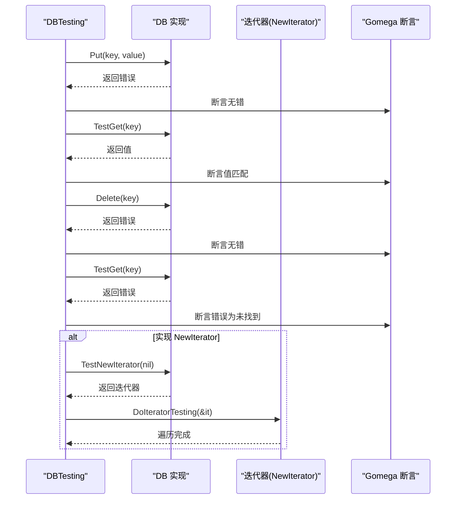
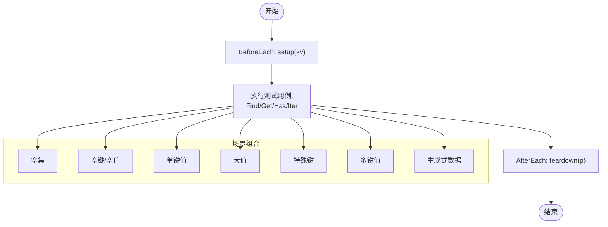
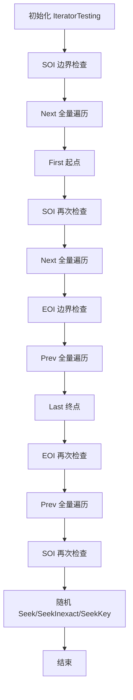
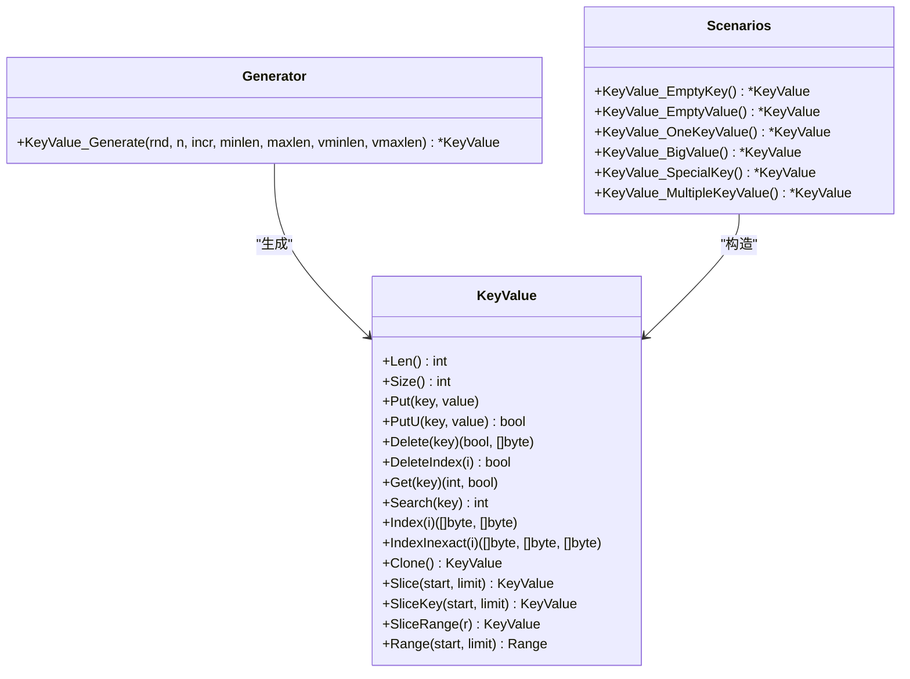
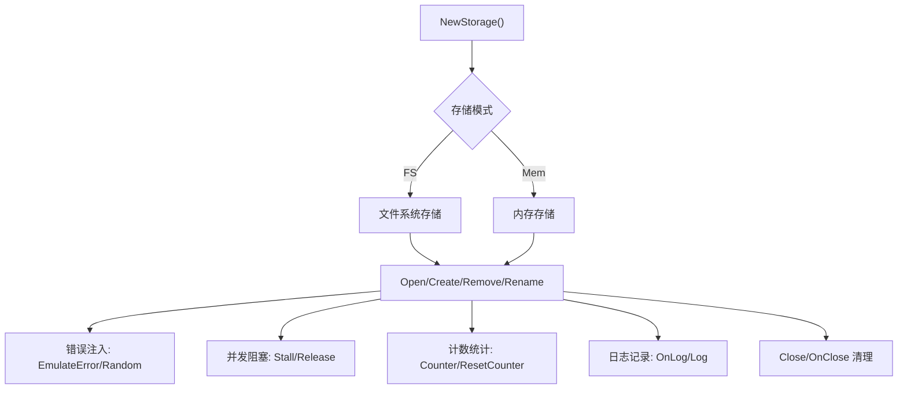
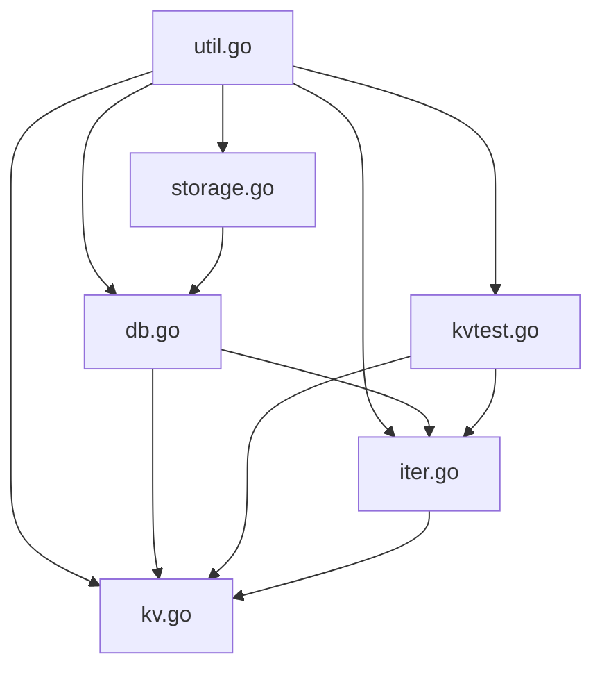

# 测试工具与辅助包

<cite>
**本文引用的文件**
- [db.go](file://leveldb/testutil/db.go)
- [kvtest.go](file://leveldb/testutil/kvtest.go)
- [storage.go](file://leveldb/testutil/storage.go)
- [ginkgo.go](file://leveldb/testutil/ginkgo.go)
- [util.go](file://leveldb/testutil/util.go)
- [iter.go](file://leveldb/testutil/iter.go)
- [kv.go](file://leveldb/testutil/kv.go)
</cite>

## 目录
1. [简介](#简介)
2. [项目结构](#项目结构)
3. [核心组件](#核心组件)
4. [架构总览](#架构总览)
5. [详细组件分析](#详细组件分析)
6. [依赖关系分析](#依赖关系分析)
7. [性能考量](#性能考量)
8. [故障排查指南](#故障排查指南)
9. [结论](#结论)
10. [附录](#附录)

## 简介
本文件系统性文档化 testutil 包提供的测试辅助工具与通用测试模式，重点覆盖以下方面：
- 数据库层：db.go 中的测试数据库初始化与清理机制、统一断言与随机操作流程。
- 键值对层：kvtest.go 的键值对测试套件复用设计，涵盖查找、存在性、迭代等行为。
- 存储层：storage.go 提供内存与文件存储的模拟实现，支持错误注入、并发阻塞与计数统计。
- 框架集成：ginkgo.go 对 Ginkgo 测试框架的集成封装，支持同步前后置钩子与失败处理器注册。
- 工具函数：util.go 提供通用断言、数据生成器与比较器，支撑可重复、可维护的测试用例。
- 迭代器测试：iter.go 与 kv.go 定义了迭代器行为与键值集合模型，确保遍历、定位、范围切片的正确性。

这些工具在保证 Merkle 树结构一致性、版本历史正确性和数据完整性验证方面发挥关键作用，帮助开发者快速构建高质量的单元与集成测试。

## 项目结构
testutil 包位于 leveldb/testutil 下，围绕“数据库测试”“键值对测试”“存储模拟”“Ginkgo 集成”“通用工具”五大模块组织，形成可复用的测试基础设施。

图表来源
- [db.go](file://leveldb/testutil/db.go#L1-L223)
- [kvtest.go](file://leveldb/testutil/kvtest.go#L1-L213)
- [iter.go](file://leveldb/testutil/iter.go#L1-L328)
- [kv.go](file://leveldb/testutil/kv.go#L1-L353)
- [storage.go](file://leveldb/testutil/storage.go#L1-L697)
- [ginkgo.go](file://leveldb/testutil/ginkgo.go#L1-L22)
- [util.go](file://leveldb/testutil/util.go#L1-L168)

章节来源
- [db.go](file://leveldb/testutil/db.go#L1-L223)
- [kvtest.go](file://leveldb/testutil/kvtest.go#L1-L213)
- [iter.go](file://leveldb/testutil/iter.go#L1-L328)
- [kv.go](file://leveldb/testutil/kv.go#L1-L353)
- [storage.go](file://leveldb/testutil/storage.go#L1-L697)
- [ginkgo.go](file://leveldb/testutil/ginkgo.go#L1-L22)
- [util.go](file://leveldb/testutil/util.go#L1-L168)

## 核心组件
- 数据库测试编排（DBTesting）
  - 统一断言：存在性、删除后不可见、随机 Put/Delete 行为校验。
  - 迭代器补充测试：自动创建迭代器并执行完整遍历序列。
- 键值对测试套件（KeyValueTesting/AllKeyValueTesting）
  - 复用测试用例：Find、Get、Has、NewIterator 的多场景覆盖。
  - 场景组合：空集、空键/值、单键值、大值、特殊键、多键值、生成式数据等。
- 迭代器行为测试（IteratorTesting/DoIteratorTesting）
  - 行为覆盖：First/Last/Next/Prev/Seek/SeekInexact/SeekKey，边界与随机定位。
- 存储模拟（Storage）
  - 文件/内存双模：NewStorage 自动选择 FS 或 Mem。
  - 错误注入：EmulateError/EmulateErrorOnce/EmulateRandomError。
  - 并发阻塞：Stall/Release 控制特定操作的等待。
  - 计数统计：按操作类型与文件类型统计次数与字节数。
- Ginkgo 集成（RunSuite）
  - 同步前后置钩子：SynchronizedBeforeSuite/SynchronizedAfterSuite。
  - 失败处理：RegisterFailHandler(Fail)。
- 通用工具（RandomSeed/NewRand/BytesSeparator/BytesAfter/RandomIndex/ShuffledIndex/RandomRange/Max/Min）
  - 种子管理与随机源：确保可重现性。
  - 键空间工具：生成分隔键、后继键，辅助边界测试。
  - 遍历与采样：随机索引、洗牌索引、随机区间。

章节来源
- [db.go](file://leveldb/testutil/db.go#L72-L223)
- [kvtest.go](file://leveldb/testutil/kvtest.go#L98-L213)
- [iter.go](file://leveldb/testutil/iter.go#L53-L328)
- [kv.go](file://leveldb/testutil/kv.go#L18-L353)
- [storage.go](file://leveldb/testutil/storage.go#L246-L697)
- [ginkgo.go](file://leveldb/testutil/ginkgo.go#L8-L22)
- [util.go](file://leveldb/testutil/util.go#L26-L168)

## 架构总览
下图展示了 testutil 包内各模块之间的交互关系，以及它们如何协同完成测试编排与断言。

图表来源
- [db.go](file://leveldb/testutil/db.go#L72-L223)
- [kvtest.go](file://leveldb/testutil/kvtest.go#L98-L213)
- [iter.go](file://leveldb/testutil/iter.go#L53-L328)
- [kv.go](file://leveldb/testutil/kv.go#L18-L353)
- [storage.go](file://leveldb/testutil/storage.go#L246-L697)
- [ginkgo.go](file://leveldb/testutil/ginkgo.go#L8-L22)
- [util.go](file://leveldb/testutil/util.go#L26-L168)

## 详细组件分析

### 数据库测试编排（db.go）
- 设计要点
  - DBTesting 封装了 Put/Delete/Get/Has/NewIterator 等接口，统一断言与状态追踪。
  - 内置 Deleted/Present 键值集合，记录已删除与当前存在的键值，便于批量断言。
  - 支持 PostFn 回调，可在每次操作后执行自定义检查。
  - 提供随机动作（PutRandom/DeleteRandom）与 DoDBTesting 全流程编排。
  - 自动补充迭代器测试：若实现 NewIterator 接口，则创建迭代器并执行完整遍历序列。
- 关键流程
  - Put：更新 Present 集合、清空 Deleted 对应键、断言写入成功、验证可见性。
  - Delete：从 Present 删除并加入 Deleted，断言读取不存在。
  - RandomAct：交替执行 PutRandom/DeleteRandom，覆盖复杂时序。
  - DoDBTesting：预热（多次随机 Put/Delete），随后执行随机轮次，最后进行迭代器测试。
- 与 Merkle/版本历史的关系
  - 通过统一的 Put/Delete 断言与迭代器遍历，确保数据一致性与顺序正确性，间接验证版本历史与树结构的正确性。

图表来源
- [db.go](file://leveldb/testutil/db.go#L140-L223)

章节来源
- [db.go](file://leveldb/testutil/db.go#L72-L223)

### 键值对测试套件（kvtest.go）
- 设计要点
  - TestFind/TestGet/TestHas：覆盖精确键与非精确键的行为，断言返回值与错误。
  - TestIter：基于 NewIterator 创建迭代器，委托给 DoIteratorTesting 执行完整遍历。
  - KeyValueTesting：以 Given/BeforeEach/AfterEach 组织测试生命周期，支持 setup/teardown。
  - AllKeyValueTesting：内置多种典型数据场景（空集、空键/值、单键值、大值、特殊键、多键值、生成式数据），统一复用测试逻辑。
- 与 Merkle/版本历史的关系
  - 通过不同键值分布与大小的组合，验证查找、遍历与范围切片在不同数据密度下的稳定性，间接保障版本历史与树结构的一致性。

图表来源
- [kvtest.go](file://leveldb/testutil/kvtest.go#L98-L213)

章节来源
- [kvtest.go](file://leveldb/testutil/kvtest.go#L1-L213)

### 迭代器行为测试（iter.go）
- 设计要点
  - IteratorTesting：封装 Pos、Act/LastAct、Rand、PostFn 等状态，提供 First/Last/Next/Prev/Seek/SeekInexact/SeekKey 等方法。
  - DoIteratorTesting：执行完整遍历序列（SOI/EOI、双向全走、随机定位、边界与中间定位），并多次打乱顺序验证鲁棒性。
  - 与 KeyValue 协作：通过 Index/IndexInexact/SeekKey 等方法，确保遍历与定位与键值集合一致。
- 与 Merkle/版本历史的关系
  - 严格的遍历与定位断言，确保在不同版本快照与合并场景下，迭代器行为稳定，避免出现跳过或重复访问。

图表来源
- [iter.go](file://leveldb/testutil/iter.go#L280-L328)

章节来源
- [iter.go](file://leveldb/testutil/iter.go#L1-L328)

### 键值集合模型（kv.go）
- 设计要点
  - KeyValue：有序键值集合，提供 Put/PutU/Delete/DeleteIndex/Get/Search/Index/IndexInexact/Clone/Slice/Range 等操作。
  - 生成器：KeyValue_Generate 基于固定字符集与增量策略生成大量有序键，支持不同长度与值长度范围。
  - 场景构造：提供多种预设场景（空键、空值、单键值、大值、特殊键、多键值）。
- 与 Merkle/版本历史的关系
  - 有序性与二分搜索能力，确保查找、范围切片与迭代器定位的正确性，为版本历史与树结构的正确性提供基础。

图表来源
- [kv.go](file://leveldb/testutil/kv.go#L18-L353)

章节来源
- [kv.go](file://leveldb/testutil/kv.go#L1-L353)

### 存储模拟与错误注入（storage.go）
- 设计要点
  - 双模存储：NewStorage 自动选择文件系统存储或内存存储；支持 OnClose 回调决定是否保留路径。
  - 错误注入：EmulateError/EmulateErrorOnce/EmulateRandomError 支持按操作类型与文件类型注入确定性或随机错误。
  - 并发阻塞：Stall/Release 在指定模式与类型上阻塞线程，配合条件变量协调。
  - 统计计数：按模式与类型统计操作次数与字节数，便于性能与行为审计。
  - 日志记录：OnLog/Log 提供带调用栈位置的日志输出。
- 与 Merkle/版本历史的关系
  - 通过模拟磁盘错误与延迟，验证在崩溃恢复、重试与并发写入场景下的数据完整性与一致性，间接保障版本历史与树结构的正确性。

图表来源
- [storage.go](file://leveldb/testutil/storage.go#L246-L697)

章节来源
- [storage.go](file://leveldb/testutil/storage.go#L1-L697)

### Ginkgo 集成封装（ginkgo.go）
- 设计要点
  - RunSuite：注册失败处理器、运行同步前后置钩子、启动 RunSpecs。
  - 与 Defer/RunDefer 协同：支持按组延迟执行 setup/teardown，便于跨文件共享初始化逻辑。
- 使用建议
  - 在测试入口调用 RunSuite，即可统一管理 Ginkgo 生命周期与失败处理。

章节来源
- [ginkgo.go](file://leveldb/testutil/ginkgo.go#L8-L22)

### 通用断言与数据生成（util.go）
- 设计要点
  - 随机种子与随机源：RandomSeed/NewRand 保证测试可重现。
  - 键空间工具：BytesSeparator/BytesAfter 生成分隔键与后继键，用于边界测试。
  - 遍历与采样：RandomIndex/ShuffledIndex/RandomRange 提供多样化的随机化策略。
  - 辅助函数：Max/Min 简化边界判断。
- 与 Merkle/版本历史的关系
  - 通过随机化与边界键生成，增强测试覆盖面，确保在极端与边界条件下版本历史与树结构的稳定性。

章节来源
- [util.go](file://leveldb/testutil/util.go#L26-L168)

## 依赖关系分析
- 组件耦合
  - DBTesting 依赖 KeyValue 与迭代器接口，同时可选依赖 NewIterator 接口。
  - KeyValueTesting 依赖 KeyValue 与迭代器接口，贯穿多个测试场景。
  - IteratorTesting 依赖 KeyValue 与迭代器接口，提供完整遍历序列。
  - Storage 作为底层抽象，被 DBTesting 与测试用例间接使用。
  - util.go 为所有测试模块提供通用工具，耦合度低但使用广泛。
- 外部依赖
  - Ginkgo/Gomega：测试框架与断言库。
  - leveldb/iterator：迭代器接口与行为。
  - leveldb/storage：存储接口与文件描述符。
  - leveldb/util：范围切片等工具。

图表来源
- [db.go](file://leveldb/testutil/db.go#L72-L223)
- [kvtest.go](file://leveldb/testutil/kvtest.go#L98-L213)
- [iter.go](file://leveldb/testutil/iter.go#L53-L328)
- [kv.go](file://leveldb/testutil/kv.go#L18-L353)
- [storage.go](file://leveldb/testutil/storage.go#L246-L697)
- [util.go](file://leveldb/testutil/util.go#L26-L168)

章节来源
- [db.go](file://leveldb/testutil/db.go#L72-L223)
- [kvtest.go](file://leveldb/testutil/kvtest.go#L98-L213)
- [iter.go](file://leveldb/testutil/iter.go#L53-L328)
- [kv.go](file://leveldb/testutil/kv.go#L18-L353)
- [storage.go](file://leveldb/testutil/storage.go#L246-L697)
- [util.go](file://leveldb/testutil/util.go#L26-L168)

## 性能考量
- 随机化与洗牌
  - 使用 ShuffledIndex 与 RandomIndex 进行多样化遍历，有助于发现性能瓶颈与异常路径。
- 计数统计
  - Storage.Counter 提供按模式与类型的统计，可用于评估 I/O 模式与优化空间。
- 并发阻塞
  - Stall/Release 可用于模拟高负载与竞争条件，验证锁与同步机制的健壮性。
- 大数据集生成
  - KeyValue_Generate 支持大规模数据生成，结合迭代器测试验证范围扫描与定位性能。

## 故障排查指南
- 断言失败
  - 使用 DBTesting/IteratorTesting 的 Text 方法查看最近一次动作与键，快速定位问题。
  - 在 PostFn 中添加额外断言，捕获边界条件与异常路径。
- 存储错误
  - 通过 EmulateError/EmulateRandomError 注入错误，验证错误处理与重试逻辑。
  - 使用 CloseCheck/OnClose 确保资源释放与临时目录清理。
- 并发问题
  - 使用 Stall/Release 控制特定操作的并发节奏，复现并修复竞态。
- 日志与定位
  - OnLog/Log 输出包含调用栈位置，便于快速定位问题来源。

章节来源
- [db.go](file://leveldb/testutil/db.go#L96-L139)
- [iter.go](file://leveldb/testutil/iter.go#L81-L105)
- [storage.go](file://leveldb/testutil/storage.go#L337-L564)

## 结论
testutil 包通过模块化的设计与强大的复用能力，为 LevelDB 的数据库层、迭代器与存储层提供了全面的测试基础设施。借助统一的断言、随机化与错误注入机制，能够高效验证数据一致性、版本历史正确性与数据完整性，显著提升测试效率与质量。建议在新增功能或修改现有逻辑时优先使用这些工具，以保持测试体系的一致性与可维护性。

## 附录
- 快速上手示例（路径指引）
  - 数据库测试编排：参考 [db.go](file://leveldb/testutil/db.go#L140-L223) 中的 Put/Delete/RandomAct/DoDBTesting。
  - 键值对测试套件：参考 [kvtest.go](file://leveldb/testutil/kvtest.go#L98-L213) 中的 KeyValueTesting/AllKeyValueTesting。
  - 迭代器行为测试：参考 [iter.go](file://leveldb/testutil/iter.go#L280-L328) 中的 DoIteratorTesting。
  - 存储模拟与错误注入：参考 [storage.go](file://leveldb/testutil/storage.go#L592-L660) 中的 EmulateError/EmulateRandomError/Stall/Release。
  - Ginkgo 集成：参考 [ginkgo.go](file://leveldb/testutil/ginkgo.go#L8-L22) 中的 RunSuite。
  - 通用工具：参考 [util.go](file://leveldb/testutil/util.go#L66-L168) 中的 RandomSeed/NewRand/BytesSeparator/BytesAfter/RandomIndex/ShuffledIndex/RandomRange/Max/Min。