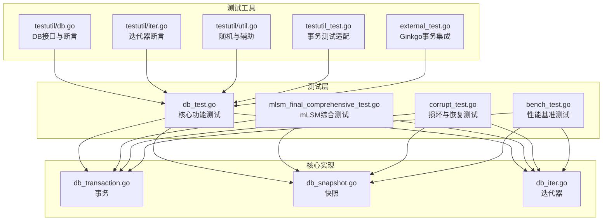
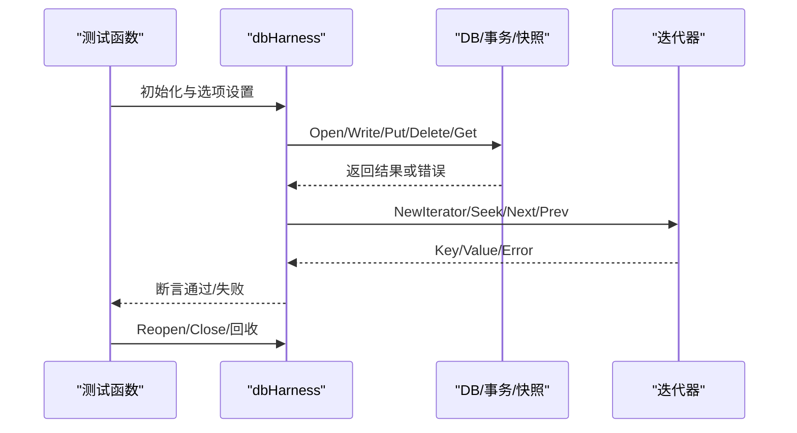
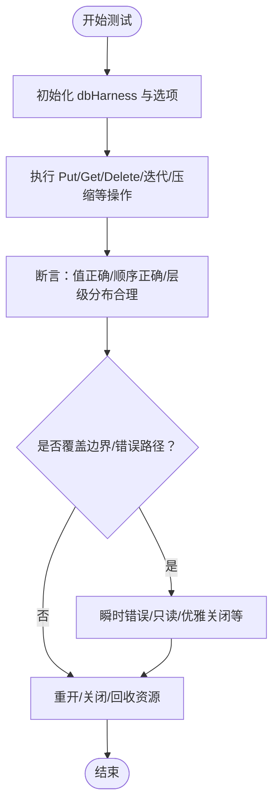
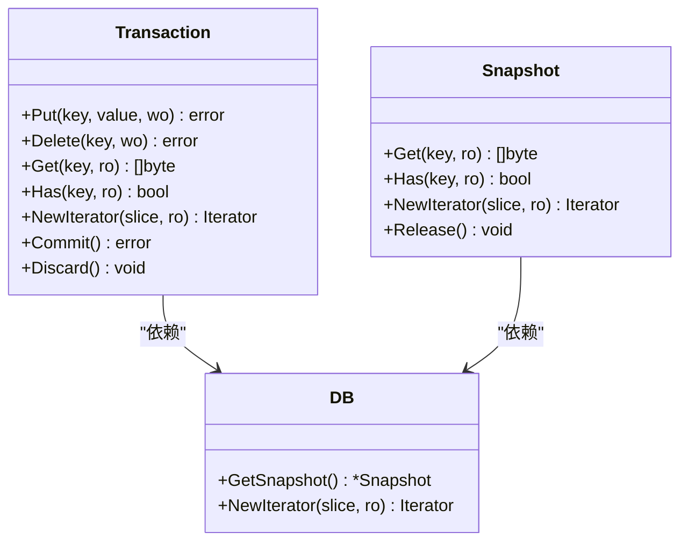
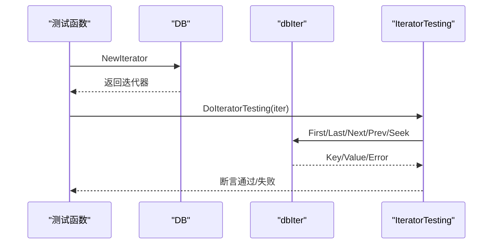
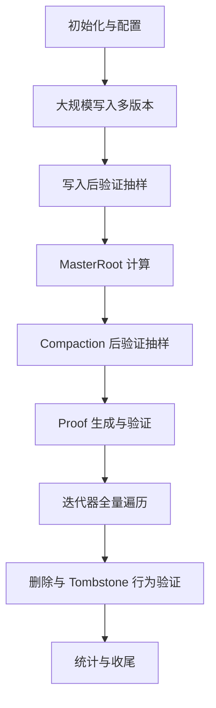
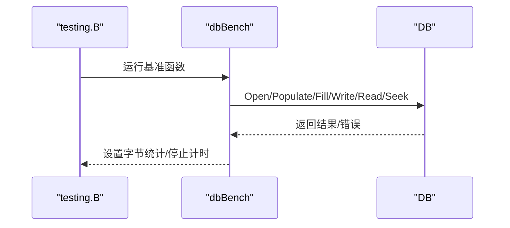
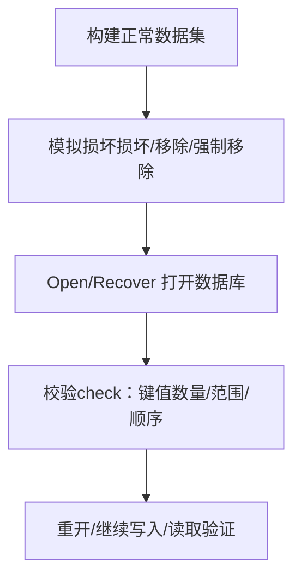
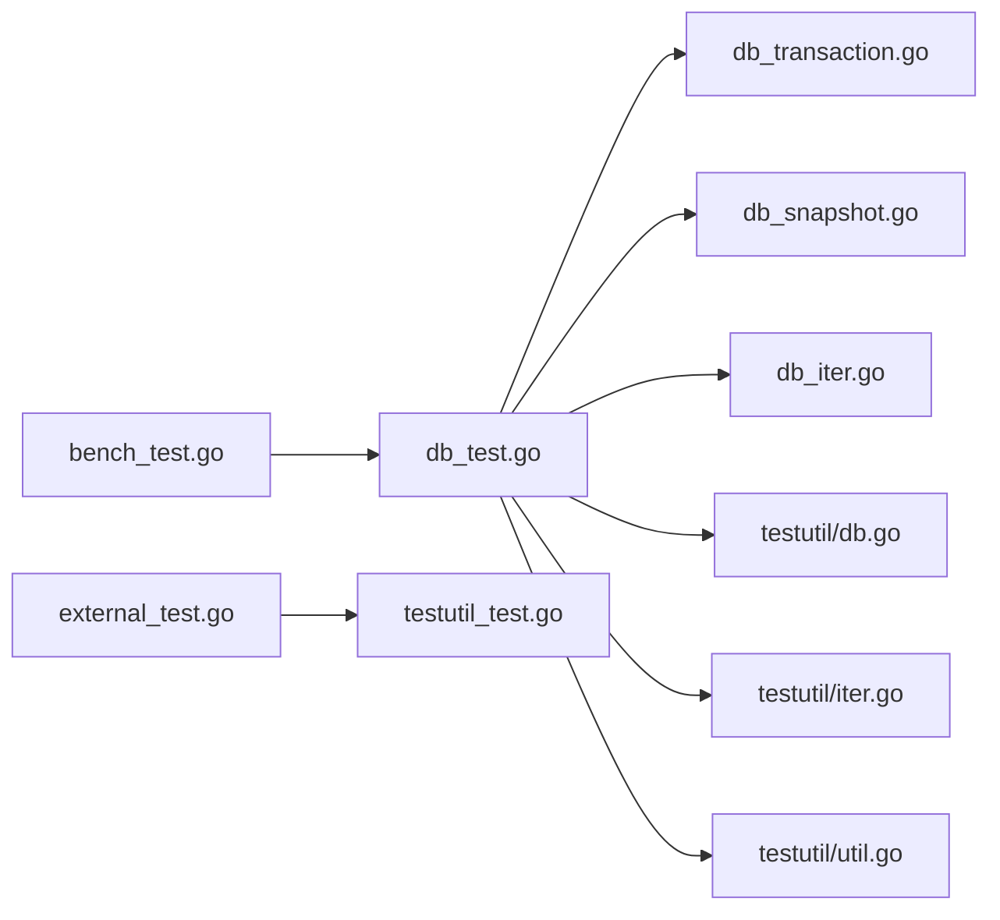

# 测试类型

<cite>
**本文引用的文件**
- [leveldb/db_test.go](file://leveldb/db_test.go)
- [leveldb/mlsm_final_comprehensive_test.go](file://leveldb/mlsm_final_comprehensive_test.go)
- [leveldb/bench_test.go](file://leveldb/bench_test.go)
- [leveldb/corrupt_test.go](file://leveldb/corrupt_test.go)
- [leveldb/db_transaction.go](file://leveldb/db_transaction.go)
- [leveldb/db_snapshot.go](file://leveldb/db_snapshot.go)
- [leveldb/db_iter.go](file://leveldb/db_iter.go)
- [leveldb/testutil/db.go](file://leveldb/testutil/db.go)
- [leveldb/testutil/iter.go](file://leveldb/testutil/iter.go)
- [leveldb/testutil/util.go](file://leveldb/testutil/util.go)
- [leveldb/testutil_test.go](file://leveldb/testutil_test.go)
- [leveldb/external_test.go](file://leveldb/external_test.go)
</cite>

## 目录
1. [引言](#引言)
2. [项目结构](#项目结构)
3. [核心组件](#核心组件)
4. [架构总览](#架构总览)
5. [详细组件分析](#详细组件分析)
6. [依赖关系分析](#依赖关系分析)
7. [性能考量](#性能考量)
8. [故障排查指南](#故障排查指南)
9. [结论](#结论)
10. [附录](#附录)

## 引言
本文件面向 avccDB 的测试体系，系统化梳理单元测试、集成测试与压力测试的编写范式与断言策略，结合 db_test.go 中的核心功能测试、mlsm_final_comprehensive_test.go 中的 mLSM 架构综合测试、bench_test.go 中的性能基准测试，以及 corrupt_test.go 中的数据损坏与恢复测试，帮助读者快速掌握如何覆盖边界条件与错误路径，确保系统在高并发、大规模数据与异常场景下的正确性与鲁棒性。

## 项目结构
测试相关代码主要集中在 leveldb 目录下：
- 单元与集成测试：db_test.go、mlsm_final_comprehensive_test.go、corrupt_test.go
- 性能基准测试：bench_test.go
- 事务与快照：db_transaction.go、db_snapshot.go
- 迭代器：db_iter.go
- 通用测试工具：testutil/*（db.go、iter.go、util.go、testutil_test.go、external_test.go）

图表来源
- [leveldb/db_test.go](file://leveldb/db_test.go#L1-L120)
- [leveldb/mlsm_final_comprehensive_test.go](file://leveldb/mlsm_final_comprehensive_test.go#L1-L60)
- [leveldb/bench_test.go](file://leveldb/bench_test.go#L1-L60)
- [leveldb/corrupt_test.go](file://leveldb/corrupt_test.go#L1-L60)
- [leveldb/db_transaction.go](file://leveldb/db_transaction.go#L1-L60)
- [leveldb/db_snapshot.go](file://leveldb/db_snapshot.go#L1-L60)
- [leveldb/db_iter.go](file://leveldb/db_iter.go#L1-L60)
- [leveldb/testutil/db.go](file://leveldb/testutil/db.go#L1-L60)
- [leveldb/testutil/iter.go](file://leveldb/testutil/iter.go#L1-L60)
- [leveldb/testutil/util.go](file://leveldb/testutil/util.go#L1-L60)
- [leveldb/testutil_test.go](file://leveldb/testutil_test.go#L1-L60)
- [leveldb/external_test.go](file://leveldb/external_test.go#L1-L60)

章节来源
- [leveldb/db_test.go](file://leveldb/db_test.go#L1-L120)
- [leveldb/mlsm_final_comprehensive_test.go](file://leveldb/mlsm_final_comprehensive_test.go#L1-L60)
- [leveldb/bench_test.go](file://leveldb/bench_test.go#L1-L60)
- [leveldb/corrupt_test.go](file://leveldb/corrupt_test.go#L1-L60)

## 核心组件
- 测试 Harness 与断言策略
  - db_test.go 提供 dbHarness 封装，统一打开/关闭/重开数据库、Put/Delete/Get、快照、迭代器、压缩等常用操作，并内置断言工具（如 getVal、assertNumKeys、sizeAssert 等），便于快速构造测试场景与验证结果。
  - testutil/db.go 定义了 Get/Put/Delete/NewIterator 等接口与 DoDBTesting、TestIter 等通用断言流程，支持随机化与多轮次验证，覆盖边界与错误路径。
- 事务与快照
  - db_transaction.go 提供事务对象，支持在事务内 Put/Delete/Get/迭代，内部 flush 到 L0 并维护序列号，用于并发与隔离性测试。
  - db_snapshot.go 提供 Snapshot 对象，基于序列号快照读取，保证读取一致性；迭代器在快照生命周期内有效。
- 迭代器
  - db_iter.go 实现底层迭代器合并逻辑，支持 First/Last/Next/Prev/Seek 等操作，配合严格模式与采样率控制，保障遍历顺序与性能。
- 基准测试
  - bench_test.go 提供多种基准场景（写入、批量写入、随机写、覆盖写、读取、反向读取、seek、并发读取等），使用 testing.B 控制计时与字节统计，便于评估吞吐量与延迟。

章节来源
- [leveldb/db_test.go](file://leveldb/db_test.go#L1-L200)
- [leveldb/testutil/db.go](file://leveldb/testutil/db.go#L1-L120)
- [leveldb/db_transaction.go](file://leveldb/db_transaction.go#L1-L120)
- [leveldb/db_snapshot.go](file://leveldb/db_snapshot.go#L1-L120)
- [leveldb/db_iter.go](file://leveldb/db_iter.go#L1-L120)
- [leveldb/bench_test.go](file://leveldb/bench_test.go#L1-L120)

## 架构总览
以下序列图展示典型测试工作流：Harness 初始化 -> 执行操作 -> 断言 -> 重开/回收资源。

图表来源
- [leveldb/db_test.go](file://leveldb/db_test.go#L1-L120)
- [leveldb/db_transaction.go](file://leveldb/db_transaction.go#L1-L120)
- [leveldb/db_snapshot.go](file://leveldb/db_snapshot.go#L1-L120)
- [leveldb/db_iter.go](file://leveldb/db_iter.go#L1-L120)

## 详细组件分析

### 单元测试与集成测试（db_test.go）
- 测试目标
  - 验证 Put/Get/Delete 正确性与持久化一致性
  - 快照读取一致性与生命周期管理
  - 迭代器顺序、seek、边界与并发安全
  - 压缩、大小估算、层级分布、只读模式、优雅关闭等
- 关键测试点与断言策略
  - Put/Get/Delete 正确性：使用 h.put/h.getVal/h.delete 配合 reopen 验证重启后数据一致。
  - 快照：h.getSnapshot 创建多个快照，分别验证读取历史版本；释放后行为符合预期。
  - 迭代器：TestDB_IteratorPinsRef、TestDB_ConcurrentIterator 等验证迭代器在并发写入下的顺序与一致性。
  - 压缩与层级：TestDB_CompactionsGenerateMultipleFiles、TestDB_OverlapInLevel0 等验证压缩触发与层级分布。
  - 只读与优雅关闭：TestDB_ReadOnly、TestDB_GracefulClose 验证只读模式与关闭过程中的行为。
- 边界与错误路径
  - TestDB_ClosedIsClosed 验证关闭后各接口返回预期错误。
  - TestDB_TransientError、TestDB_TableCompactionBuilder 展示瞬时错误处理与重试。
  - TestDB_ReadOnly 验证只读模式下的写入拒绝与读取一致性。

图表来源
- [leveldb/db_test.go](file://leveldb/db_test.go#L1175-L1240)
- [leveldb/db_test.go](file://leveldb/db_test.go#L1748-L1812)
- [leveldb/db_test.go](file://leveldb/db_test.go#L2852-L2887)
- [leveldb/db_test.go](file://leveldb/db_test.go#L2925-L3002)

章节来源
- [leveldb/db_test.go](file://leveldb/db_test.go#L588-L615)
- [leveldb/db_test.go](file://leveldb/db_test.go#L1175-L1202)
- [leveldb/db_test.go](file://leveldb/db_test.go#L1748-L1812)
- [leveldb/db_test.go](file://leveldb/db_test.go#L2852-L2887)
- [leveldb/db_test.go](file://leveldb/db_test.go#L2925-L3002)

### 事务与快照行为测试
- 事务（Transaction）
  - 支持在事务内 Put/Delete/迭代，内部 flush 到 L0 并维护序列号，用于并发与隔离性测试。
  - 通过 external_test.go 与 testutil_test.go 的适配，可在 Ginkgo 场景中创建、提交、丢弃事务并验证一致性。
- 快照（Snapshot）
  - 基于序列号快照读取，保证读取一致性；迭代器在快照生命周期内有效。
  - db_snapshot.go 提供快照获取、释放与最小序列号计算，避免过早清理导致的数据丢失。

图表来源
- [leveldb/db_transaction.go](file://leveldb/db_transaction.go#L1-L200)
- [leveldb/db_snapshot.go](file://leveldb/db_snapshot.go#L1-L188)
- [leveldb/testutil_test.go](file://leveldb/testutil_test.go#L50-L91)
- [leveldb/external_test.go](file://leveldb/external_test.go#L88-L117)

章节来源
- [leveldb/db_transaction.go](file://leveldb/db_transaction.go#L1-L200)
- [leveldb/db_snapshot.go](file://leveldb/db_snapshot.go#L1-L188)
- [leveldb/testutil_test.go](file://leveldb/testutil_test.go#L50-L91)
- [leveldb/external_test.go](file://leveldb/external_test.go#L88-L117)

### 迭代器行为测试
- db_iter.go 提供底层迭代器合并逻辑，支持 First/Last/Next/Prev/Seek 等操作，严格模式与采样率控制保证遍历顺序与性能。
- testutil/iter.go 定义 DoIteratorTesting，覆盖 SOI/EOI、随机 seek、正向/反向遍历等，确保迭代器在各种场景下行为正确。

图表来源
- [leveldb/db_iter.go](file://leveldb/db_iter.go#L1-L200)
- [leveldb/testutil/iter.go](file://leveldb/testutil/iter.go#L1-L120)

章节来源
- [leveldb/db_iter.go](file://leveldb/db_iter.go#L1-L200)
- [leveldb/testutil/iter.go](file://leveldb/testutil/iter.go#L1-L120)

### mLSM 综合测试（mlsm_final_comprehensive_test.go）
- 测试目标
  - 大规模写入与多版本读取验证
  - MasterRoot 计算与一致性
  - Compaction 后数据完整性
  - Proof 生成与验证（包含跨层聚合限制说明）
  - 迭代器全量遍历与删除（Tombstone）行为
- 关键流程
  - 规模化写入：按键写入多个版本，统计吞吐与进度
  - 写入后与 Compaction 后双阶段验证：抽样校验每个键的各版本值前缀
  - MasterRoot：记录初始值，Compaction 后比较是否更新
  - Proof：抽样验证结构完整性与路径一致性，若未完全实现跨层聚合则与 MasterRoot 比较
  - 迭代器：全量遍历统计键数，验证去重与顺序
  - 删除：验证删除后历史版本仍可查询（mLSM保留历史特性）

图表来源
- [leveldb/mlsm_final_comprehensive_test.go](file://leveldb/mlsm_final_comprehensive_test.go#L1-L120)
- [leveldb/mlsm_final_comprehensive_test.go](file://leveldb/mlsm_final_comprehensive_test.go#L120-L240)
- [leveldb/mlsm_final_comprehensive_test.go](file://leveldb/mlsm_final_comprehensive_test.go#L240-L360)
- [leveldb/mlsm_final_comprehensive_test.go](file://leveldb/mlsm_final_comprehensive_test.go#L360-L467)

章节来源
- [leveldb/mlsm_final_comprehensive_test.go](file://leveldb/mlsm_final_comprehensive_test.go#L1-L120)
- [leveldb/mlsm_final_comprehensive_test.go](file://leveldb/mlsm_final_comprehensive_test.go#L120-L240)
- [leveldb/mlsm_final_comprehensive_test.go](file://leveldb/mlsm_final_comprehensive_test.go#L240-L360)
- [leveldb/mlsm_final_comprehensive_test.go](file://leveldb/mlsm_final_comprehensive_test.go#L360-L467)

### 性能基准测试（bench_test.go）
- 测试目标
  - 评估写入吞吐（单条 Put、批量写、随机写、覆盖写）
  - 评估读取吞吐（顺序读、反向读、seek、并发读取）
  - 评估不同配置（压缩开关、只读、表重建等）对性能的影响
- 关键方法
  - dbBench 封装打开/填充/写入/读取/seek/迭代等流程，使用 testing.B 控制计时与字节统计
  - 多组基准用例：BenchmarkDBWrite/BenchmarkDBWriteBatch/BenchmarkDBPut/BenchmarkDBRead/BenchmarkDBSeek/BenchmarkDBReadConcurrent 等
- 指标建议
  - 吞吐量：records/s 或 MB/s
  - 延迟：平均/中位/尾延迟（可通过 testing.B 的计时与迭代次数推导）
  - I/O 读取次数：结合存储计数器与属性查询

图表来源
- [leveldb/bench_test.go](file://leveldb/bench_test.go#L60-L120)
- [leveldb/bench_test.go](file://leveldb/bench_test.go#L264-L330)
- [leveldb/bench_test.go](file://leveldb/bench_test.go#L332-L463)

章节来源
- [leveldb/bench_test.go](file://leveldb/bench_test.go#L60-L120)
- [leveldb/bench_test.go](file://leveldb/bench_test.go#L264-L330)
- [leveldb/bench_test.go](file://leveldb/bench_test.go#L332-L463)

### 数据损坏与恢复测试（corrupt_test.go）
- 测试目标
  - 验证损坏场景下的修复能力：日志损坏、表文件损坏、索引损坏、Manifest 缺失/损坏、缺失表文件等
  - 验证序列号恢复与一致性
- 关键方法
  - dbCorruptHarness 基于 dbHarness，扩展 corrupt/removeOne/forceRemoveAll/check 等能力
  - 使用 storage.FileType 选择文件类型，定位并修改文件内容模拟损坏
  - 通过 Recover/Open/Check 验证修复后的数据一致性与读取正确性

图表来源
- [leveldb/corrupt_test.go](file://leveldb/corrupt_test.go#L24-L120)
- [leveldb/corrupt_test.go](file://leveldb/corrupt_test.go#L222-L320)
- [leveldb/corrupt_test.go](file://leveldb/corrupt_test.go#L321-L487)

章节来源
- [leveldb/corrupt_test.go](file://leveldb/corrupt_test.go#L24-L120)
- [leveldb/corrupt_test.go](file://leveldb/corrupt_test.go#L222-L320)
- [leveldb/corrupt_test.go](file://leveldb/corrupt_test.go#L321-L487)

## 依赖关系分析
- 测试工具链
  - testutil/db.go、testutil/iter.go、testutil/util.go 提供统一的断言与随机化工具，贯穿 db_test.go、external_test.go 等测试文件
  - testutil_test.go 为事务测试提供适配层，将 Transaction 包装为可测试接口
- 组件耦合
  - db_test.go 与 db_transaction.go/db_snapshot.go/db_iter.go 存在直接调用关系，体现测试对核心组件行为的覆盖
  - bench_test.go 与 db_test.go 共享部分工具（如随机值生成、存储封装），便于复用

图表来源
- [leveldb/db_test.go](file://leveldb/db_test.go#L1-L120)
- [leveldb/db_transaction.go](file://leveldb/db_transaction.go#L1-L60)
- [leveldb/db_snapshot.go](file://leveldb/db_snapshot.go#L1-L60)
- [leveldb/db_iter.go](file://leveldb/db_iter.go#L1-L60)
- [leveldb/testutil/db.go](file://leveldb/testutil/db.go#L1-L60)
- [leveldb/testutil/iter.go](file://leveldb/testutil/iter.go#L1-L60)
- [leveldb/testutil/util.go](file://leveldb/testutil/util.go#L1-L60)
- [leveldb/testutil_test.go](file://leveldb/testutil_test.go#L50-L91)
- [leveldb/external_test.go](file://leveldb/external_test.go#L88-L117)
- [leveldb/bench_test.go](file://leveldb/bench_test.go#L60-L120)

章节来源
- [leveldb/db_test.go](file://leveldb/db_test.go#L1-L120)
- [leveldb/testutil/db.go](file://leveldb/testutil/db.go#L1-L120)
- [leveldb/testutil/iter.go](file://leveldb/testutil/iter.go#L1-L120)
- [leveldb/testutil/util.go](file://leveldb/testutil/util.go#L1-L120)
- [leveldb/testutil_test.go](file://leveldb/testutil_test.go#L50-L91)
- [leveldb/external_test.go](file://leveldb/external_test.go#L88-L117)
- [leveldb/bench_test.go](file://leveldb/bench_test.go#L60-L120)

## 性能考量
- 基准测试设计
  - 使用 testing.B 的 ResetTimer/StartTimer/StopTimer 精确测量关键阶段
  - 通过 b.SetBytes 统计每轮操作的字节数，便于计算吞吐量
  - 并发读取使用 b.RunParallel，评估多核下的线程安全与吞吐提升
- 指标解读
  - 吞吐量：记录数/秒或字节数/秒
  - 延迟：通过计时与迭代次数估算平均/尾延迟
  - I/O 读取次数：结合存储计数器与属性查询，评估过滤器与缓存效果
- 配置影响
  - 压缩开关、块大小、写缓冲、压缩表大小等会影响吞吐与延迟，应对比不同配置下的表现

章节来源
- [leveldb/bench_test.go](file://leveldb/bench_test.go#L120-L220)
- [leveldb/bench_test.go](file://leveldb/bench_test.go#L332-L463)

## 故障排查指南
- 常见问题与定位
  - 只读模式写入被拒绝：检查 ReadOnly 配置与 SetReadOnly 调用
  - 关闭后接口报错：确认关闭流程与句柄释放顺序
  - 迭代器错误：检查迭代器生命周期与错误处理
  - 压缩与层级异常：核对压缩触发阈值与层级分布
- 损坏场景恢复
  - 使用 Recover 打开数据库，逐步校验数据范围与键值
  - 对 Manifest 缺失/损坏场景，先尝试修复再继续写入/读取
  - 对表文件损坏，优先恢复可用文件并验证一致性

章节来源
- [leveldb/db_test.go](file://leveldb/db_test.go#L2852-L2887)
- [leveldb/db_test.go](file://leveldb/db_test.go#L1533-L1608)
- [leveldb/corrupt_test.go](file://leveldb/corrupt_test.go#L222-L320)

## 结论
- 单元与集成测试通过 db_test.go 的 dbHarness 与 testutil 工具，系统覆盖 Put/Get/Delete、快照、迭代器、压缩与只读/优雅关闭等核心行为，断言策略清晰且可复用。
- mLSM 综合测试以大规模写入与多版本读取为核心，验证 MasterRoot 一致性、Proof 结构与跨层聚合限制、迭代器与删除行为，形成对 mLSM 特性的完整验证闭环。
- 基准测试以 bench_test.go 为基础，提供多维度吞吐与延迟评估，便于在不同配置下进行性能对比。
- 损坏与恢复测试通过 corrupt_test.go 的损坏模拟与 Recover 流程，验证系统在异常场景下的鲁棒性与数据完整性。

## 附录
- 编写范式与断言策略
  - 使用 dbHarness 统一初始化/重开/断言，减少重复代码
  - 采用 testutil 的随机化与多轮次断言，覆盖边界与错误路径
  - 对并发场景，使用 WaitGroup 与原子变量控制生命周期，确保稳定性
  - 对性能测试，使用 ResetTimer/StopTimer/SetBytes 精确统计指标
- 代码实例路径（仅列路径，不展示具体代码）
  - Put/Get/Delete 正确性验证：[leveldb/db_test.go](file://leveldb/db_test.go#L588-L615)
  - 快照一致性验证：[leveldb/db_test.go](file://leveldb/db_test.go#L1175-L1202)
  - 迭代器行为验证：[leveldb/db_test.go](file://leveldb/db_test.go#L1748-L1812)
  - mLSM 多版本与 MasterRoot：[leveldb/mlsm_final_comprehensive_test.go](file://leveldb/mlsm_final_comprehensive_test.go#L120-L240)
  - mLSM Proof 与跨层聚合：[leveldb/mlsm_final_comprehensive_test.go](file://leveldb/mlsm_final_comprehensive_test.go#L240-L360)
  - 基准测试写入/读取：[leveldb/bench_test.go](file://leveldb/bench_test.go#L264-L330)
  - 基准测试并发读取：[leveldb/bench_test.go](file://leveldb/bench_test.go#L466-L508)
  - 损坏场景与恢复：[leveldb/corrupt_test.go](file://leveldb/corrupt_test.go#L222-L320)