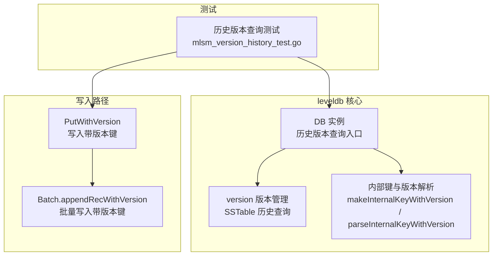
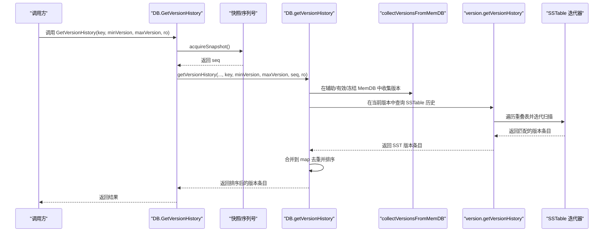
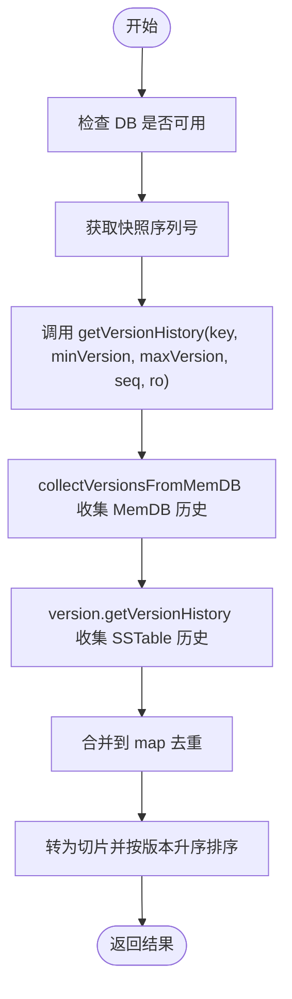
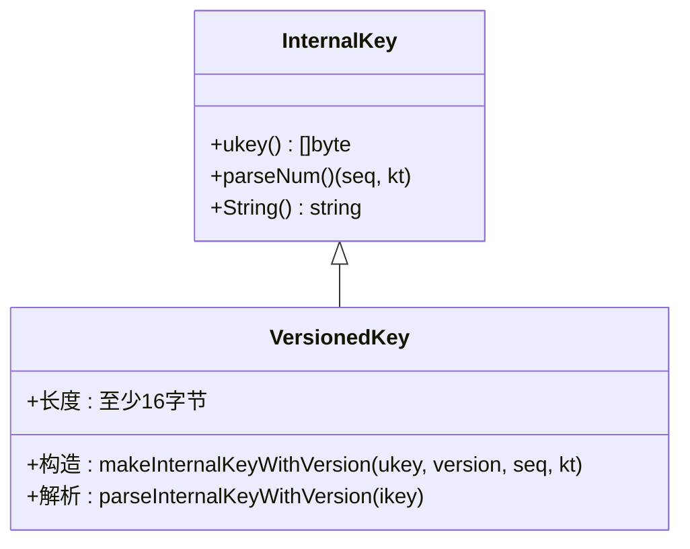
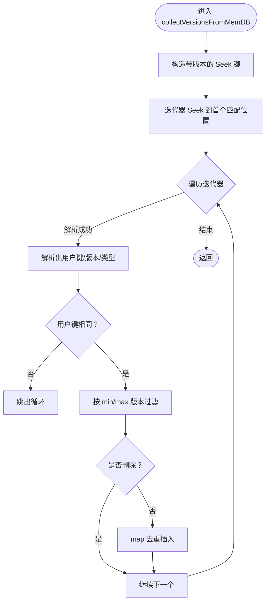
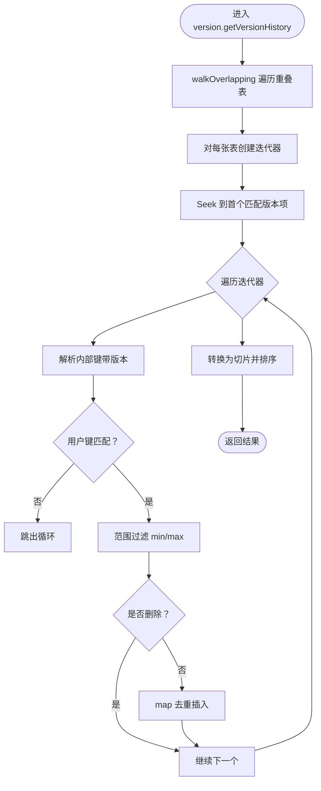
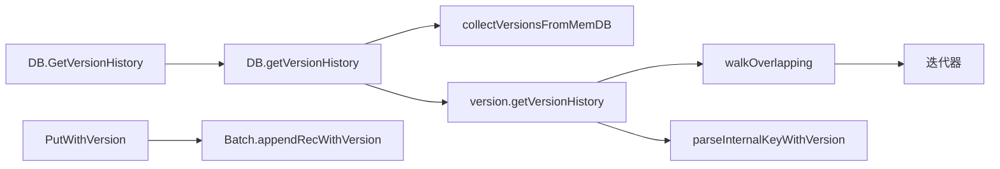

# 历史版本查询

<cite>
**本文引用的文件**
- [db.go](file://leveldb/db.go)
- [version.go](file://leveldb/version.go)
- [key.go](file://leveldb/key.go)
- [mlsm_version_history_test.go](file://leveldb/mlsm_version_history_test.go)
- [db_write.go](file://leveldb/db_write.go)
- [batch.go](file://leveldb/batch.go)
</cite>

## 目录
1. [简介](#简介)
2. [项目结构](#项目结构)
3. [核心组件](#核心组件)
4. [架构总览](#架构总览)
5. [详细组件分析](#详细组件分析)
6. [依赖关系分析](#依赖关系分析)
7. [性能考量](#性能考量)
8. [故障排查指南](#故障排查指南)
9. [结论](#结论)
10. [附录](#附录)

## 简介
本文件面向 avccDB 的历史版本查询能力，围绕 GetVersionHistory 接口进行深入解析。目标是帮助读者理解：
- 如何通过 GetVersionHistory(key, minVersion, maxVersion, readOptions) 查询特定键在指定版本范围内的所有历史变更记录；
- 系统如何从内存数据库（MemDB）与 SSTable 文件中收集版本数据；
- 使用 map 结构进行去重与排序；
- minVersion 与 maxVersion 参数的使用方法及边界情况（例如 0 表示无限制）；
- 结合测试用例，给出查询所有版本、特定范围版本与单个版本的参考路径。

## 项目结构
与历史版本查询直接相关的模块主要集中在以下文件：
- 数据库入口与历史版本查询实现：leveldb/db.go
- 版本管理与 SSTable 历史查询：leveldb/version.go
- 内部键格式与版本字段解析：leveldb/key.go
- 历史版本查询测试用例：leveldb/mlsm_version_history_test.go
- 写入带版本键的实现：leveldb/db_write.go、leveldb/batch.go

图表来源
- [db.go](file://leveldb/db.go#L1175-L1184)
- [version.go](file://leveldb/version.go#L431-L532)
- [key.go](file://leveldb/key.go#L90-L146)
- [db_write.go](file://leveldb/db_write.go#L387-L432)
- [batch.go](file://leveldb/batch.go#L94-L136)
- [mlsm_version_history_test.go](file://leveldb/mlsm_version_history_test.go#L1-L139)

章节来源
- [db.go](file://leveldb/db.go#L1175-L1184)
- [version.go](file://leveldb/version.go#L431-L532)
- [key.go](file://leveldb/key.go#L90-L146)
- [db_write.go](file://leveldb/db_write.go#L387-L432)
- [batch.go](file://leveldb/batch.go#L94-L136)
- [mlsm_version_history_test.go](file://leveldb/mlsm_version_history_test.go#L1-L139)

## 核心组件
- GetVersionHistory 入口：负责获取快照序列号并调用内部版本历史查询逻辑。
- 内部版本历史查询：从 MemDB（含辅助 MemDB 与有效/冻结 MemDB）与 SSTable 中收集匹配版本，使用 map 去重并按版本升序排序。
- 内部键与版本解析：提供带版本字段的内部键构造与解析，确保历史查询的正确性。
- 写入带版本键：PutWithVersion 与 Batch.appendRecWithVersion 支持以版本号写入键值，形成历史数据基础。

章节来源
- [db.go](file://leveldb/db.go#L1175-L1184)
- [db.go](file://leveldb/db.go#L934-L1047)
- [version.go](file://leveldb/version.go#L431-L532)
- [key.go](file://leveldb/key.go#L90-L146)
- [db_write.go](file://leveldb/db_write.go#L387-L432)
- [batch.go](file://leveldb/batch.go#L94-L136)

## 架构总览
GetVersionHistory 的调用链如下：
- 外部调用：GetVersionHistory(key, minVersion, maxVersion, ro)
- 获取快照：acquireSnapshot → 传入 seq
- 内部查询：getVersionHistory(auxm, auxt, key, minVersion, maxVersion, seq, ro)
  - MemDB 搜索：collectVersionsFromMemDB（辅助 MemDB、有效 MemDB、冻结 MemDB）
  - SSTable 搜索：version.getVersionHistory（遍历重叠表，迭代器扫描）
  - 合并与去重：map[version]value
  - 排序输出：按版本升序返回

图表来源
- [db.go](file://leveldb/db.go#L1175-L1184)
- [db.go](file://leveldb/db.go#L934-L1047)
- [version.go](file://leveldb/version.go#L431-L532)

## 详细组件分析

### GetVersionHistory 接口与调用流程
- 入口方法：GetVersionHistory(key, minVersion, maxVersion, ro)
- 快照机制：通过 acquireSnapshot 获取稳定序列号 seq，保证查询期间数据一致性。
- 内部实现：getVersionHistory 调用 collectVersionsFromMemDB 收集 MemDB 历史，再调用 version.getVersionHistory 收集 SSTable 历史，最后合并去重并按版本升序排序。

图表来源
- [db.go](file://leveldb/db.go#L1175-L1184)
- [db.go](file://leveldb/db.go#L934-L1047)

章节来源
- [db.go](file://leveldb/db.go#L1175-L1184)
- [db.go](file://leveldb/db.go#L934-L1047)

### 内部键格式与版本字段
- 内部键格式（带版本）：ukey | version(8字节) | seq+type(8字节)
- 解析函数：parseInternalKeyWithVersion 可从内部键中提取用户键、版本号、序列号与类型。
- 寻址策略：makeInternalKeyWithVersion 构造带版本的内部键用于迭代与查找；keyMaxSeq 作为“通配符”用于匹配任意版本。

图表来源
- [key.go](file://leveldb/key.go#L90-L146)

章节来源
- [key.go](file://leveldb/key.go#L90-L146)

### MemDB 历史收集（collectVersionsFromMemDB）
- 迭代器寻址：使用带版本的内部键进行 Seek，定位到第一个可能的版本项。
- 范围过滤：根据 minVersion 与 maxVersion 判断是否保留该版本。
- 删除跳过：跳过删除标记的版本。
- 去重策略：仅当 map 中不存在该版本时才加入，确保 MemDB 的最新写入优先。

图表来源
- [db.go](file://leveldb/db.go#L995-L1047)

章节来源
- [db.go](file://leveldb/db.go#L995-L1047)

### SSTable 历史收集（version.getVersionHistory）
- 重叠表扫描：walkOverlapping 遍历与目标键重叠的所有表（含辅助层）。
- 迭代器扫描：对每张表创建迭代器，Seek 到首个可能版本项，逐项解析。
- 范围过滤与去重：同上，仅保留指定范围内的非删除版本，并通过 map 去重。
- 排序输出：将 map 转为切片并按版本升序排序。

图表来源
- [version.go](file://leveldb/version.go#L431-L532)

章节来源
- [version.go](file://leveldb/version.go#L431-L532)

### 参数 minVersion 与 maxVersion 的使用与边界
- minVersion > 0：仅保留 ≥ minVersion 的版本；
- maxVersion > 0：仅保留 ≤ maxVersion 的版本；
- minVersion = 0：无下界；
- maxVersion = 0：无上界；
- keyMaxSeq 作为“通配符”用于匹配任意版本，确保查询能覆盖所有版本。

章节来源
- [db.go](file://leveldb/db.go#L995-L1047)
- [version.go](file://leveldb/version.go#L431-L532)
- [key.go](file://leveldb/key.go#L50-L66)

### 写入带版本键（支持历史生成）
- PutWithVersion：以指定版本写入键值，形成历史数据基础。
- Batch.appendRecWithVersion：批量写入时可携带版本号，内部长度包含版本字段。

章节来源
- [db_write.go](file://leveldb/db_write.go#L387-L432)
- [batch.go](file://leveldb/batch.go#L94-L136)

### 测试用例参考路径
以下为测试中使用的查询示例路径（不展示具体代码内容）：
- 查询所有版本（无范围限制）：参见 [mlsm_version_history_test.go](file://leveldb/mlsm_version_history_test.go#L50-L71)
- 查询指定范围 [150, 250]：参见 [mlsm_version_history_test.go](file://leveldb/mlsm_version_history_test.go#L72-L90)
- 查询最小版本 ≥ 200：参见 [mlsm_version_history_test.go](file://leveldb/mlsm_version_history_test.go#L91-L109)
- 查询最大版本 ≤ 200：参见 [mlsm_version_history_test.go](file://leveldb/mlsm_version_history_test.go#L110-L128)
- 查询不存在的键：参见 [mlsm_version_history_test.go](file://leveldb/mlsm_version_history_test.go#L129-L137)

章节来源
- [mlsm_version_history_test.go](file://leveldb/mlsm_version_history_test.go#L1-L139)

## 依赖关系分析
- DB.GetVersionHistory 依赖：
  - 快照获取（acquireSnapshot/releaseSnapshot）
  - DB.getVersionHistory（内部实现）
  - MemDB 收集：collectVersionsFromMemDB
  - 版本管理：version.getVersionHistory
- version.getVersionHistory 依赖：
  - walkOverlapping（遍历重叠表）
  - 迭代器（newIterator）
  - 内部键解析：parseInternalKeyWithVersion
- 写入侧依赖：
  - PutWithVersion 与 Batch.appendRecWithVersion 提供带版本键的数据源

图表来源
- [db.go](file://leveldb/db.go#L1175-L1184)
- [db.go](file://leveldb/db.go#L934-L1047)
- [version.go](file://leveldb/version.go#L431-L532)
- [key.go](file://leveldb/key.go#L119-L146)
- [db_write.go](file://leveldb/db_write.go#L387-L432)
- [batch.go](file://leveldb/batch.go#L94-L136)

章节来源
- [db.go](file://leveldb/db.go#L1175-L1184)
- [db.go](file://leveldb/db.go#L934-L1047)
- [version.go](file://leveldb/version.go#L431-L532)
- [key.go](file://leveldb/key.go#L119-L146)
- [db_write.go](file://leveldb/db_write.go#L387-L432)
- [batch.go](file://leveldb/batch.go#L94-L136)

## 性能考量
- 迭代器寻址：通过构造带版本的 Seek 键，减少无效扫描，提升命中效率。
- 去重策略：使用 map[version]value 先入为主（MemDB 优先），避免重复版本条目。
- 排序成本：最终按版本升序排序，时间复杂度 O(k log k)，k 为匹配版本数。
- SSTable 扫描：walkOverlapping 仅扫描与目标键重叠的表，降低 IO 开销。
- 并发与快照：通过快照序列号保证查询期间一致性，避免写入竞争带来的额外开销。

[本节为通用性能讨论，不直接分析具体文件]

## 故障排查指南
- 未找到键：当 MemDB 与 SSTable 均未找到匹配版本时，返回 ErrNotFound。
- 参数边界：minVersion 或 maxVersion 设为 0 表示无限制；若两者均为 0，则查询所有版本。
- 删除版本：删除标记的版本会被跳过，不会出现在结果中。
- 写入失败：确认写入路径是否使用了 PutWithVersion 或 Batch.appendRecWithVersion，确保键具备版本字段。

章节来源
- [db.go](file://leveldb/db.go#L934-L1047)
- [version.go](file://leveldb/version.go#L431-L532)
- [db_write.go](file://leveldb/db_write.go#L387-L432)
- [batch.go](file://leveldb/batch.go#L94-L136)

## 结论
GetVersionHistory 通过统一的快照机制与分层数据源（MemDB 与 SSTable）实现了高效的历史版本查询。其核心在于：
- 使用带版本的内部键进行精确寻址；
- 通过 map 去重与排序，确保结果正确且有序；
- 参数 minVersion 与 maxVersion 提供灵活的范围控制；
- 测试用例覆盖了常见场景，便于验证与扩展。

[本节为总结性内容，不直接分析具体文件]

## 附录
- 查询所有版本：参见 [mlsm_version_history_test.go](file://leveldb/mlsm_version_history_test.go#L50-L71)
- 查询范围 [150, 250]：参见 [mlsm_version_history_test.go](file://leveldb/mlsm_version_history_test.go#L72-L90)
- 查询最小版本 ≥ 200：参见 [mlsm_version_history_test.go](file://leveldb/mlsm_version_history_test.go#L91-L109)
- 查询最大版本 ≤ 200：参见 [mlsm_version_history_test.go](file://leveldb/mlsm_version_history_test.go#L110-L128)
- 查询不存在的键：参见 [mlsm_version_history_test.go](file://leveldb/mlsm_version_history_test.go#L129-L137)