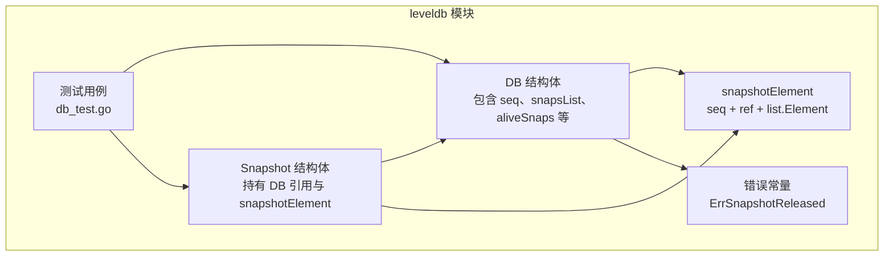
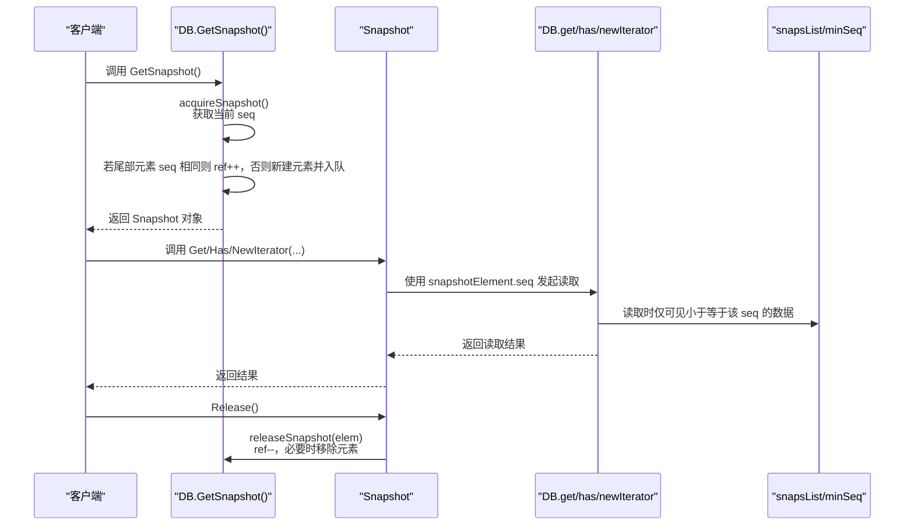
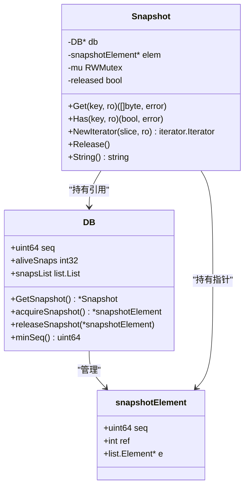
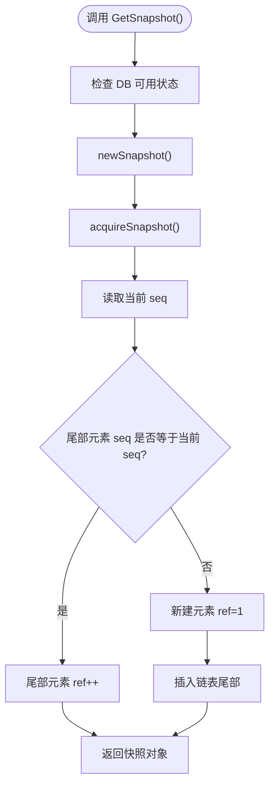
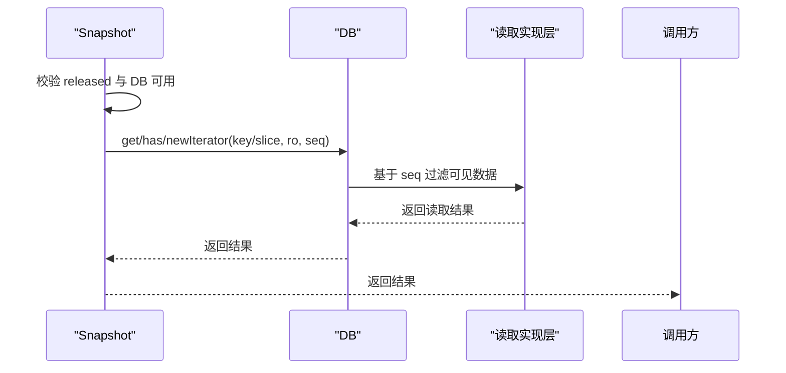
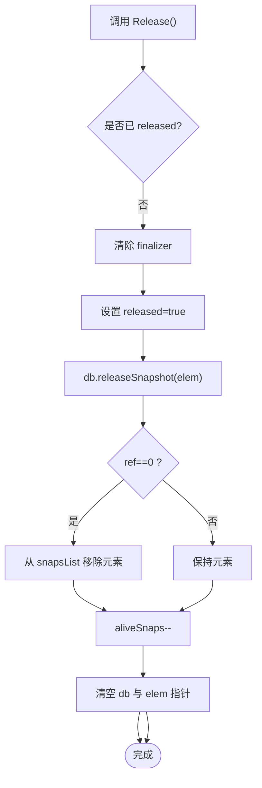
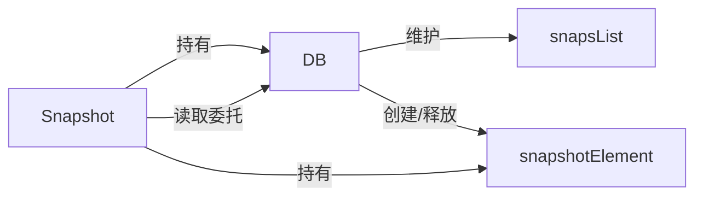

# 快照管理

<cite>
**本文引用的文件**
- [leveldb/db_snapshot.go](file://leveldb/db_snapshot.go)
- [leveldb/db.go](file://leveldb/db.go)
- [leveldb/db_test.go](file://leveldb/db_test.go)
- [leveldb/errors.go](file://leveldb/errors.go)
</cite>

## 目录
1. [简介](#简介)
2. [项目结构](#项目结构)
3. [核心组件](#核心组件)
4. [架构总览](#架构总览)
5. [详细组件分析](#详细组件分析)
6. [依赖关系分析](#依赖关系分析)
7. [性能考量](#性能考量)
8. [故障排查指南](#故障排查指南)
9. [结论](#结论)

## 简介
本文件围绕 avccDB 的快照（Snapshot）功能进行系统化说明，重点阐述其在一致性读取中的作用与实现机制。内容涵盖：
- 如何通过 GetSnapshot() 在某一时间点创建数据库的一致性视图；
- 快照内部的序列号（seq）分配与引用计数管理；
- 快照如何保证读取操作看到原子性、不可变的数据库快照，避免受后续写入影响；
- Snapshot 结构体的生命周期管理：获取、Has、NewIterator、Release 的调用时机；
- 基于 db_test.go 中的测试用例，展示多快照并存时的一致性读取行为。

## 项目结构
快照相关的核心代码位于 leveldb 子模块中，主要涉及以下文件：
- 快照接口与实现：leveldb/db_snapshot.go
- 数据库主入口与快照导出：leveldb/db.go
- 行为验证与并发场景测试：leveldb/db_test.go
- 错误常量定义：leveldb/errors.go

图表来源
- [leveldb/db.go](file://leveldb/db.go#L33-L120)
- [leveldb/db_snapshot.go](file://leveldb/db_snapshot.go#L21-L95)
- [leveldb/db_test.go](file://leveldb/db_test.go#L665-L697)
- [leveldb/errors.go](file://leveldb/errors.go#L16-L16)

章节来源
- [leveldb/db.go](file://leveldb/db.go#L33-L120)
- [leveldb/db_snapshot.go](file://leveldb/db_snapshot.go#L21-L95)

## 核心组件
- DB：数据库实例，维护全局序列号 seq、快照列表 snapsList、存活快照计数 aliveSnaps，并提供 GetSnapshot() 导出快照。
- Snapshot：快照对象，封装对底层 DB 的只读访问，内部持有 snapshotElement，用于限定读取可见性。
- snapshotElement：快照元素，记录快照对应的序列号 seq、引用计数 ref，以及在 snapsList 中的位置节点 e。

关键职责与关系
- DB.acquireSnapshot() 基于当前 seq 获取或复用快照元素；若最新 seq 与尾部元素相同则增加引用计数，否则新建元素并加入链表尾部。
- DB.releaseSnapshot() 减少引用计数，当 ref 归零时从链表移除该元素。
- DB.minSeq() 返回“未被任何快照遮挡”的最小序列号，用于控制可删除的历史数据范围。
- DB.GetSnapshot() 调用 newSnapshot() 创建 Snapshot 对象，设置 finalizer 并递增 aliveSnaps。
- Snapshot.Get/Has/NewIterator/Release 将读取请求路由到 DB 层，并使用 snapshotElement.seq 作为读取上下文。

章节来源
- [leveldb/db.go](file://leveldb/db.go#L33-L120)
- [leveldb/db.go](file://leveldb/db.go#L1236-L1242)
- [leveldb/db_snapshot.go](file://leveldb/db_snapshot.go#L21-L95)
- [leveldb/db_snapshot.go](file://leveldb/db_snapshot.go#L97-L188)

## 架构总览
下图展示了快照在读取路径中的位置与交互：

图表来源
- [leveldb/db.go](file://leveldb/db.go#L1236-L1242)
- [leveldb/db_snapshot.go](file://leveldb/db_snapshot.go#L27-L45)
- [leveldb/db_snapshot.go](file://leveldb/db_snapshot.go#L48-L60)
- [leveldb/db_snapshot.go](file://leveldb/db_snapshot.go#L97-L166)

## 详细组件分析

### 快照类图

图表来源
- [leveldb/db.go](file://leveldb/db.go#L33-L120)
- [leveldb/db.go](file://leveldb/db.go#L1236-L1242)
- [leveldb/db_snapshot.go](file://leveldb/db_snapshot.go#L21-L95)
- [leveldb/db_snapshot.go](file://leveldb/db_snapshot.go#L97-L188)

章节来源
- [leveldb/db.go](file://leveldb/db.go#L33-L120)
- [leveldb/db_snapshot.go](file://leveldb/db_snapshot.go#L21-L95)
- [leveldb/db_snapshot.go](file://leveldb/db_snapshot.go#L97-L188)

### GetSnapshot() 与快照创建流程
- DB.GetSnapshot() 先检查 DB 是否可用，再调用 newSnapshot()。
- DB.newSnapshot() 调用 acquireSnapshot() 获取或复用 snapshotElement，同时递增 aliveSnaps 并设置 finalizer，确保对象回收时自动释放。
- DB.acquireSnapshot() 以互斥锁保护，基于当前 seq 分配快照元素：
  - 若 snapsList 尾部元素的 seq 与当前 seq 相同，则直接增加其 ref 并返回；
  - 否则新建元素，设置 ref=1，并将元素插入链表尾部；
  - 若当前 seq 小于尾部元素 seq，会触发 panic（序列号必须单调递增）。

图表来源
- [leveldb/db.go](file://leveldb/db.go#L1236-L1242)
- [leveldb/db_snapshot.go](file://leveldb/db_snapshot.go#L82-L90)
- [leveldb/db_snapshot.go](file://leveldb/db_snapshot.go#L27-L45)

章节来源
- [leveldb/db.go](file://leveldb/db.go#L1236-L1242)
- [leveldb/db_snapshot.go](file://leveldb/db_snapshot.go#L82-L90)
- [leveldb/db_snapshot.go](file://leveldb/db_snapshot.go#L27-L45)

### 读取路径与一致性保障
- Snapshot.Get/Has/NewIterator 在执行前先检查自身是否已释放（released），若已释放则返回相应错误。
- 三个读取方法均将实际读取委托给 DB 层，并传入 snapshotElement.seq 作为读取上下文。
- 由于读取时以该 seq 为上限，后续写入产生的新版本不会出现在该快照的读取结果中，从而保证“原子性快照”语义。
- NewIterator 的注释明确指出：读取键值对保证一致，且迭代器与底层 DB 的并发修改是安全的。

图表来源
- [leveldb/db_snapshot.go](file://leveldb/db_snapshot.go#L97-L166)

章节来源
- [leveldb/db_snapshot.go](file://leveldb/db_snapshot.go#L97-L166)

### 引用计数与生命周期管理
- DB.acquireSnapshot() 返回的 snapshotElement 包含 ref 计数。当多个快照共享同一 seq 时，ref 递增，避免重复创建。
- DB.releaseSnapshot() 在 ref 归零时从 snapsList 移除元素，防止内存泄漏。
- DB.minSeq() 返回“未被任何快照遮挡”的最小序列号，用于确定哪些历史数据可以清理。
- Snapshot.Release() 会：
  - 清理 finalizer；
  - 设置 released=true；
  - 调用 db.releaseSnapshot(elem)；
  - 递减 aliveSnaps；
  - 清空 db 与 elem 指针，防止悬挂引用。

图表来源
- [leveldb/db_snapshot.go](file://leveldb/db_snapshot.go#L172-L188)
- [leveldb/db_snapshot.go](file://leveldb/db_snapshot.go#L48-L60)

章节来源
- [leveldb/db_snapshot.go](file://leveldb/db_snapshot.go#L48-L60)
- [leveldb/db_snapshot.go](file://leveldb/db_snapshot.go#L172-L188)

### 多快照并存与一致性读取（测试驱动）
- 测试用例展示了在同一数据库上创建多个快照的行为：
  - 先写入若干键值，随后连续创建 s1、s2、s3 三个快照；
  - 在每个快照中读取同一键，应分别看到各自创建时的数据版本；
  - 在释放部分快照后，剩余快照仍能正确读取对应版本；
  - 未释放的快照不影响后续写入与 compaction。
- 另一个测试用例专门验证快照列表与最小序列号（minSeq）的计算逻辑，确保：
  - 当不同快照元素的 seq 不同时，minSeq 正确反映“未被遮挡的最小 seq”；
  - 释放元素后，minSeq 随之变化；
  - 重新获取相同或不同 seq 的快照时，minSeq 保持正确。

章节来源
- [leveldb/db_test.go](file://leveldb/db_test.go#L1174-L1201)
- [leveldb/db_test.go](file://leveldb/db_test.go#L1203-L1239)

## 依赖关系分析
- 组件耦合
  - DB 与 snapshotElement：DB 维护 snapsList，负责分配与释放 snapshotElement；
  - Snapshot 与 DB：Snapshot 仅持有 DB 指针与 snapshotElement 指针，不直接持有数据；
  - 读取路径：Snapshot.Get/Has/NewIterator 最终委托 DB 实现层，使用 snapshotElement.seq 控制可见性。
- 外部依赖
  - 并发同步：DB.snapsMu 保护快照列表；Snapshot.mu 保护自身状态；
  - 内存管理：runtime.SetFinalizer 用于兜底释放；Release() 显式释放以减少 GC 压力。

图表来源
- [leveldb/db.go](file://leveldb/db.go#L33-L120)
- [leveldb/db_snapshot.go](file://leveldb/db_snapshot.go#L21-L95)
- [leveldb/db_snapshot.go](file://leveldb/db_snapshot.go#L97-L188)

章节来源
- [leveldb/db.go](file://leveldb/db.go#L33-L120)
- [leveldb/db_snapshot.go](file://leveldb/db_snapshot.go#L21-L95)
- [leveldb/db_snapshot.go](file://leveldb/db_snapshot.go#L97-L188)

## 性能考量
- 快照创建成本低：当多个快照共享同一 seq 时，仅增加引用计数，避免重复分配；
- 读取开销可控：读取路径使用 snapshotElement.seq 作为过滤条件，无需额外拷贝；
- 并发安全：DB.snapsMu 与 Snapshot.mu 提供必要的互斥保护；
- 资源统计：aliveSnaps 与 aliveIters 用于监控存活对象数量，便于诊断泄漏与资源占用。

## 故障排查指南
- 快照已释放
  - 现象：调用 Snapshot.Get/Has/NewIterator 时返回“快照已释放”错误；
  - 排查：确认是否提前调用了 Release() 或对象被 GC 回收（finalizer 触发）。
  - 参考：错误常量定义与 Release() 行为。
- 序列号异常
  - 现象：出现“序列号不是单调递增”的 panic；
  - 排查：检查是否存在并发修改 seq 的逻辑或外部重放导致 seq 回退。
- 引用计数异常
  - 现象：出现“负引用计数”的 panic；
  - 排查：确认 Release() 调用次数与 acquireSnapshot() 成对匹配，避免重复释放。

章节来源
- [leveldb/errors.go](file://leveldb/errors.go#L16-L16)
- [leveldb/db_snapshot.go](file://leveldb/db_snapshot.go#L39-L41)
- [leveldb/db_snapshot.go](file://leveldb/db_snapshot.go#L57-L59)
- [leveldb/db_snapshot.go](file://leveldb/db_snapshot.go#L172-L188)

## 结论
- GetSnapshot() 提供了在任意时刻对数据库的“原子性快照”，通过 snapshotElement.seq 与 DB 的读取实现共同保证一致性；
- 引用计数与链表管理确保快照对象高效复用与及时回收；
- 多快照并存时，各快照彼此隔离，互不影响彼此的可见性；
- 通过测试用例验证了快照在并发与 compaction 场景下的正确性与稳定性。