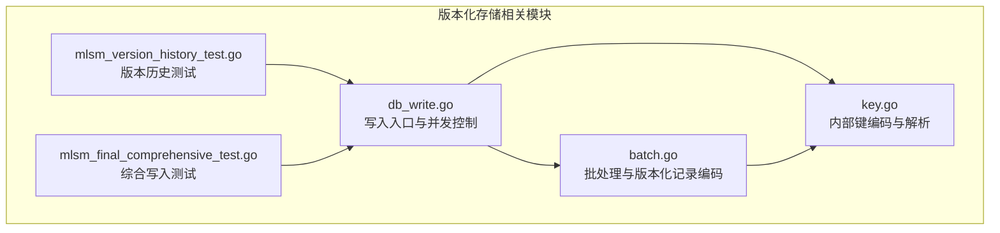
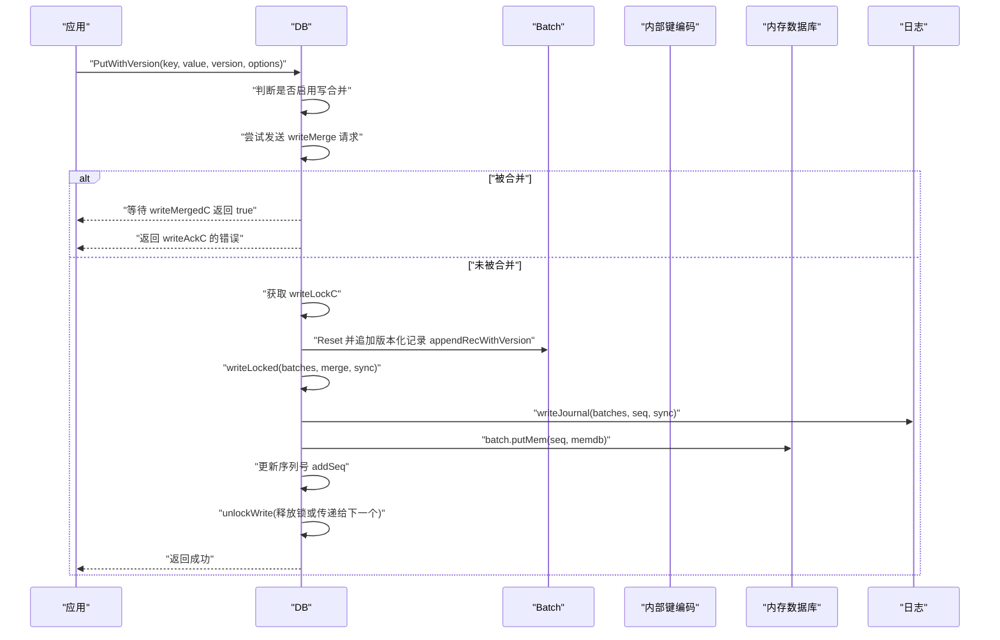
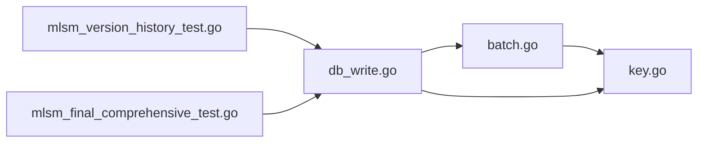

# 版本化存储

<cite>
**本文引用的文件**
- [leveldb/db_write.go](file://leveldb/db_write.go)
- [leveldb/batch.go](file://leveldb/batch.go)
- [leveldb/key.go](file://leveldb/key.go)
- [leveldb/mlsm_version_history_test.go](file://leveldb/mlsm_version_history_test.go)
- [leveldb/mlsm_final_comprehensive_test.go](file://leveldb/mlsm_final_comprehensive_test.go)
</cite>

## 目录
1. [简介](#简介)
2. [项目结构](#项目结构)
3. [核心组件](#核心组件)
4. [架构总览](#架构总览)
5. [详细组件分析](#详细组件分析)
6. [依赖关系分析](#依赖关系分析)
7. [性能考量](#性能考量)
8. [故障排查指南](#故障排查指南)
9. [结论](#结论)
10. [附录](#附录)

## 简介
本文件围绕 avccDB 的版本化存储能力，系统性阐述 PutWithVersion 操作的实现机制。重点包括：
- 如何通过 PutWithVersion(key, value, version, writeOptions) 将数据与特定版本号关联存储；
- 内部键编码机制：版本号与用户键合并形成复合键；
- 写入流程中的并发控制与写合并（write merge）机制；
- 结合 batch.go 中 appendRecWithVersion 方法，说明批量操作如何处理版本化记录；
- 提供实际测试用例路径，展示如何为同一键写入多个版本的数据。

## 项目结构
与版本化存储直接相关的模块主要集中在以下文件：
- 写入入口与并发控制：leveldb/db_write.go
- 批处理与版本化记录编码：leveldb/batch.go
- 内部键编码与解析：leveldb/key.go
- 版本历史查询与多版本写入测试：leveldb/mlsm_version_history_test.go、leveldb/mlsm_final_comprehensive_test.go

图表来源
- [leveldb/db_write.go](file://leveldb/db_write.go#L387-L438)
- [leveldb/batch.go](file://leveldb/batch.go#L94-L136)
- [leveldb/key.go](file://leveldb/key.go#L75-L104)
- [leveldb/mlsm_version_history_test.go](file://leveldb/mlsm_version_history_test.go#L1-L139)
- [leveldb/mlsm_final_comprehensive_test.go](file://leveldb/mlsm_final_comprehensive_test.go#L73-L116)

章节来源
- [leveldb/db_write.go](file://leveldb/db_write.go#L387-L438)
- [leveldb/batch.go](file://leveldb/batch.go#L94-L136)
- [leveldb/key.go](file://leveldb/key.go#L75-L104)
- [leveldb/mlsm_version_history_test.go](file://leveldb/mlsm_version_history_test.go#L1-L139)
- [leveldb/mlsm_final_comprehensive_test.go](file://leveldb/mlsm_final_comprehensive_test.go#L73-L116)

## 核心组件
- PutWithVersion 写入入口：负责获取写锁、构造单条版本化记录，并调用写入主流程。
- 批处理 Batch：支持版本化记录编码 appendRecWithVersion，以及批量合并写入。
- 内部键编码：makeInternalKeyWithVersion 将用户键、版本号、序列号与类型组合为内部键；parseInternalKeyWithVersion 解析版本化内部键。
- 并发与写合并：writeMergeC、writeMergedC、writeLockC 协调多写入合并与互斥。

章节来源
- [leveldb/db_write.go](file://leveldb/db_write.go#L387-L438)
- [leveldb/batch.go](file://leveldb/batch.go#L94-L136)
- [leveldb/key.go](file://leveldb/key.go#L75-L104)

## 架构总览
下图展示了 PutWithVersion 的端到端调用链路，从应用层到内部键编码与写入主流程。

图表来源
- [leveldb/db_write.go](file://leveldb/db_write.go#L387-L438)
- [leveldb/db_write.go](file://leveldb/db_write.go#L155-L266)
- [leveldb/batch.go](file://leveldb/batch.go#L244-L257)
- [leveldb/key.go](file://leveldb/key.go#L75-L104)

## 详细组件分析

### PutWithVersion 实现机制
- 入口行为
  - 检查 DB 是否可用；
  - 判断是否启用写合并与同步选项；
  - 优先尝试通过 writeMergeC 发送请求以参与写合并；若被合并则等待 writeMergedC 与 writeAckC 返回；
  - 若未被合并，则获取 writeLockC，进入串行写入路径。
- 构造版本化记录
  - 从对象池获取 Batch，Reset；
  - 调用 appendRecWithVersion(keyTypeVal, key, value, version) 追加一条带版本号的记录；
  - 调用 writeLocked 执行写入主流程。
- 写入主流程（writeLocked）
  - flush 阶段尝试触发内存表刷新与限流；
  - 写合并阶段：在 mergeLimit 与内存可用容量范围内，持续从 writeMergeC 接收其他写入请求进行合并，累计合并计数 merged；
  - 写日志：writeJournal 写入合并后的批次；
  - 写内存：batch.putMem 将内部键写入内存数据库；
  - 更新序列号：addSeq；
  - 释放锁：unlockWrite，根据 overflow 决定是否将锁传递给下一个等待者。

章节来源
- [leveldb/db_write.go](file://leveldb/db_write.go#L387-L438)
- [leveldb/db_write.go](file://leveldb/db_write.go#L155-L266)

### 内部键编码机制
- 复合键格式（版本化）
  - 用户键 ukey 后接 8 字节版本号 version，再接 8 字节序列号+类型（seq<<8|type），形成内部键 ik。
- 编码与解析
  - 编码：makeInternalKeyWithVersion(dst, ukey, version, seq, kt)；
  - 解析：parseInternalKeyWithVersion(ik) 返回 ukey、version、seq、kt；
  - 非版本化内部键仅包含 ukey 后接 8 字节 seq+type。
- 用户键提取
  - internalKey.ukey() 根据是否含版本信息，自动跳过相应字节长度，得到用户键。

章节来源
- [leveldb/key.go](file://leveldb/key.go#L75-L104)
- [leveldb/key.go](file://leveldb/key.go#L119-L146)
- [leveldb/key.go](file://leveldb/key.go#L162-L171)

### 批处理与版本化记录
- 追加版本化记录
  - appendRecWithVersion(kt, key, value, version) 计算所需空间，按需写入版本号（当 version>0 时），随后写入键长、键值、可选值；
  - 更新 internalLen：版本化记录额外计入 8 字节（非版本化记录为 8 字节），版本化记录额外 8 字节（版本字段）。
- 批内写入内存
  - batch.putMem(seq, memdb) 逐条记录生成内部键（含版本号），写入内存数据库。
- 批合并
  - 在 writeLocked 合并阶段，对 incoming.put 请求计算 internalLen（含版本字段时额外 8 字节），满足合并限制则追加到 ourBatch，最终统一写入。

章节来源
- [leveldb/batch.go](file://leveldb/batch.go#L94-L136)
- [leveldb/batch.go](file://leveldb/batch.go#L244-L257)
- [leveldb/db_write.go](file://leveldb/db_write.go#L184-L228)

### 并发控制与写合并机制
- 通道与状态
  - writeMergeC：接收写合并请求；
  - writeMergedC：通知请求是否被合并；
  - writeLockC：互斥锁，保证一次只有一个写入线程持有；
  - writeAckC：向被合并的请求方返回错误或成功。
- 合并策略
  - mergeLimit 基于当前批次大小与内存可用容量动态计算；
  - 对 incoming.batch 与 incoming.put 分别计算 internalLen，超过限制则标记 overflow 并跳出合并循环；
  - 合并过程中累积 merged 数量，并向请求方发送 true 表示已被合并。
- 锁释放
  - unlockWrite 根据 overflow 决定是否将锁传递给下一个等待者，否则释放锁。

章节来源
- [leveldb/db_write.go](file://leveldb/db_write.go#L133-L152)
- [leveldb/db_write.go](file://leveldb/db_write.go#L184-L228)
- [leveldb/db_write.go](file://leveldb/db_write.go#L141-L152)

### 多版本写入流程（批量场景）
- 批处理追加
  - Batch.PutWithVersion(key, value, version) 调用 appendRecWithVersion，将版本化记录写入批次缓冲；
  - 批次内部维护 index 与 internalLen，便于后续统一写入。
- 写入主流程
  - writeLocked 将批次写入日志与内存数据库，按批次长度递增序列号；
  - 若批次过大，可能触发事务路径（跳过日志直接写表），但版本化记录仍以内部键形式存储。

章节来源
- [leveldb/batch.go](file://leveldb/batch.go#L145-L148)
- [leveldb/batch.go](file://leveldb/batch.go#L244-L257)
- [leveldb/db_write.go](file://leveldb/db_write.go#L240-L266)

### 实际用例路径（为同一键写入多个版本）
- 单键多版本写入
  - 使用 PutWithVersion(key, value, version, nil) 循环写入不同版本；
  - 示例路径：[leveldb/mlsm_final_comprehensive_test.go](file://leveldb/mlsm_final_comprehensive_test.go#L73-L116)
- 多键多版本历史验证
  - 写入多键不同版本范围，使用 GetVersionHistory 查询并断言；
  - 示例路径：
    - [leveldb/mlsm_version_history_test.go](file://leveldb/mlsm_version_history_test.go#L1-L139)
    - [leveldb/mlsm_version_history_test.go](file://leveldb/mlsm_version_history_test.go#L232-L285)

章节来源
- [leveldb/mlsm_final_comprehensive_test.go](file://leveldb/mlsm_final_comprehensive_test.go#L73-L116)
- [leveldb/mlsm_version_history_test.go](file://leveldb/mlsm_version_history_test.go#L1-L139)
- [leveldb/mlsm_version_history_test.go](file://leveldb/mlsm_version_history_test.go#L232-L285)

## 依赖关系分析
- 组件耦合
  - DB 依赖 Batch 进行记录编码与批量写入；
  - Batch 依赖 key.go 的内部键编码/解码工具；
  - DB 通过通道与锁协调并发写入，避免竞态。
- 关键依赖链
  - DB.PutWithVersion -> Batch.appendRecWithVersion -> makeInternalKeyWithVersion -> 写入内存数据库；
  - DB.writeLocked -> writeJournal -> batch.putMem -> unlockWrite。

图表来源
- [leveldb/db_write.go](file://leveldb/db_write.go#L387-L438)
- [leveldb/batch.go](file://leveldb/batch.go#L94-L136)
- [leveldb/key.go](file://leveldb/key.go#L75-L104)
- [leveldb/mlsm_version_history_test.go](file://leveldb/mlsm_version_history_test.go#L1-L139)
- [leveldb/mlsm_final_comprehensive_test.go](file://leveldb/mlsm_final_comprehensive_test.go#L73-L116)

## 性能考量
- 写合并阈值
  - mergeLimit 动态计算，避免一次性合并过多导致内存压力；
  - 当 incoming.put 的 internalLen 超过剩余容量时，标记 overflow 并停止合并。
- 序列号分配
  - writeLocked 按批次长度递增序列号，确保版本化记录的顺序一致性；
  - 非版本化记录同样使用序列号排序，但不携带版本字段。
- 大批次优化
  - 当批次大小超过写缓冲阈值且允许大批次事务时，走事务路径，跳过日志直接写表，减少日志开销。

章节来源
- [leveldb/db_write.go](file://leveldb/db_write.go#L171-L228)
- [leveldb/db_write.go](file://leveldb/db_write.go#L280-L293)
- [leveldb/batch.go](file://leveldb/batch.go#L244-L257)

## 故障排查指南
- 常见错误来源
  - 内部键损坏：parseInternalKeyWithVersion/parseInternalKey 抛出内部键损坏错误；
  - 写合并失败：writeAckC 返回来自上游的错误；
  - 并发冲突：writeMergeC/ writeLockC 通道阻塞，检查是否启用了写合并与同步选项。
- 排查步骤
  - 确认版本号与键长度符合编码规范；
  - 检查 writeLocked 的 flush 与 rotateMem 是否触发异常；
  - 观察 writeMergedC 与 writeAckC 的返回，定位被合并请求的状态。

章节来源
- [leveldb/key.go](file://leveldb/key.go#L119-L146)
- [leveldb/db_write.go](file://leveldb/db_write.go#L141-L152)
- [leveldb/db_write.go](file://leveldb/db_write.go#L240-L266)

## 结论
- PutWithVersion 通过内部键编码将版本号与用户键绑定，形成可排序的复合键；
- 写入采用写合并与互斥锁协同，既提升吞吐又保证一致性；
- 批处理在编码与写入阶段均考虑版本化字段，确保多版本共存与顺序正确；
- 测试覆盖了单键多版本与多键多版本的历史查询，验证版本化存储的可靠性与持久性。

## 附录
- 版本化内部键格式（小端序）
  - 非版本化：ukey + 8 字节（seq<<8|type）
  - 版本化：ukey + 8 字节（version） + 8 字节（seq<<8|type）
- 关键 API 路径
  - PutWithVersion：[leveldb/db_write.go](file://leveldb/db_write.go#L387-L438)
  - appendRecWithVersion：[leveldb/batch.go](file://leveldb/batch.go#L94-L136)
  - makeInternalKeyWithVersion：[leveldb/key.go](file://leveldb/key.go#L75-L104)
  - parseInternalKeyWithVersion：[leveldb/key.go](file://leveldb/key.go#L119-L146)
  - 批量写入与合并：[leveldb/db_write.go](file://leveldb/db_write.go#L155-L266)
  - 多版本写入示例：[leveldb/mlsm_final_comprehensive_test.go](file://leveldb/mlsm_final_comprehensive_test.go#L73-L116)
  - 版本历史查询示例：[leveldb/mlsm_version_history_test.go](file://leveldb/mlsm_version_history_test.go#L1-L139)