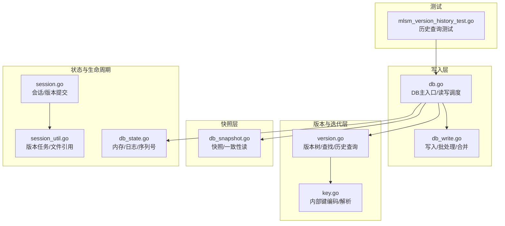

# 版本控制与数据溯源

<cite>
**本文引用的文件**
- [leveldb/db.go](file://leveldb/db.go)
- [leveldb/db_state.go](file://leveldb/db_state.go)
- [leveldb/db_write.go](file://leveldb/db_write.go)
- [leveldb/db_snapshot.go](file://leveldb/db_snapshot.go)
- [leveldb/version.go](file://leveldb/version.go)
- [leveldb/key.go](file://leveldb/key.go)
- [leveldb/mlsm_version_history_test.go](file://leveldb/mlsm_version_history_test.go)
- [leveldb/session.go](file://leveldb/session.go)
- [leveldb/session_util.go](file://leveldb/session_util.go)
</cite>

## 目录
1. [简介](#简介)
2. [项目结构](#项目结构)
3. [核心组件](#核心组件)
4. [架构总览](#架构总览)
5. [详细组件分析](#详细组件分析)
6. [依赖关系分析](#依赖关系分析)
7. [性能考量](#性能考量)
8. [故障排查指南](#故障排查指南)
9. [结论](#结论)
10. [附录](#附录)

## 简介
本文件围绕 avccDB 的多版本控制（MVCC）与数据溯源能力，系统性阐述内部版本编码机制、历史版本查询接口、版本快照的一致性读取作用，以及基于 db_state.go 的状态管理与版本生命周期、垃圾回收机制。文档同时给出 PutWithVersion 等写入接口如何实现版本化存储、系统如何自动管理版本号，并结合测试用例展示典型应用场景：审计追踪与数据回滚。

## 项目结构
本仓库采用分层模块组织，与 MVCC 和溯源密切相关的模块包括：
- 写入与事务：db_write.go、db.go
- 版本与迭代：version.go、db.go
- 键编码与解析：key.go
- 快照与一致性读：db_snapshot.go
- 状态与内存/日志管理：db_state.go
- 会话与版本生命周期：session.go、session_util.go
- 测试与示例：mlsm_version_history_test.go

图表来源
- [leveldb/db_write.go](file://leveldb/db_write.go#L380-L530)
- [leveldb/db.go](file://leveldb/db.go#L1-L200)
- [leveldb/version.go](file://leveldb/version.go#L1-L200)
- [leveldb/key.go](file://leveldb/key.go#L1-L197)
- [leveldb/db_snapshot.go](file://leveldb/db_snapshot.go#L1-L188)
- [leveldb/db_state.go](file://leveldb/db_state.go#L1-L237)
- [leveldb/session.go](file://leveldb/session.go#L1-L243)
- [leveldb/session_util.go](file://leveldb/session_util.go#L48-L237)
- [leveldb/mlsm_version_history_test.go](file://leveldb/mlsm_version_history_test.go#L1-L286)

章节来源
- [leveldb/db.go](file://leveldb/db.go#L1-L200)
- [leveldb/db_write.go](file://leveldb/db_write.go#L380-L530)
- [leveldb/version.go](file://leveldb/version.go#L1-L200)
- [leveldb/key.go](file://leveldb/key.go#L1-L197)
- [leveldb/db_snapshot.go](file://leveldb/db_snapshot.go#L1-L188)
- [leveldb/db_state.go](file://leveldb/db_state.go#L1-L237)
- [leveldb/session.go](file://leveldb/session.go#L1-L243)
- [leveldb/session_util.go](file://leveldb/session_util.go#L48-L237)
- [leveldb/mlsm_version_history_test.go](file://leveldb/mlsm_version_history_test.go#L1-L286)

## 核心组件
- 版本编码与解析
  - 内部键格式：非版本键包含用户键+序列号+类型；版本键在非版本键基础上增加“版本号”字段，形成“用户键|版本号|序列号+类型”的紧凑编码。解析函数可区分版本键与非版本键，并提取版本号、序列号与类型。
  - 关键常量：最大序列号、最大打包值、最大版本号等，确保编码安全与排序语义。
- 历史版本查询
  - GetVersionHistory 接口：在指定版本范围内返回某键的所有历史版本条目，按版本升序排列；支持无界范围查询。
  - 版本历史收集：遍历所有层级表，使用迭代器扫描匹配键的版本条目，过滤删除标记，保留最高层级可见的版本值。
- 版本化写入
  - PutWithVersion：以指定版本写入键值，覆盖旧版本；批量写入时同样支持带版本记录。
  - 自动序列号管理：写入路径中序列号由全局原子递增维护，保证单调递增且与写入顺序一致。
- 一致性读取与快照
  - Snapshot：基于当前序列号创建快照，读取时以快照序列号作为可见性边界，实现一致性读取。
  - 最小序列号：用于判定哪些历史版本仍需保留，避免过早清理仍在被快照引用的历史数据。
- 版本生命周期与垃圾回收
  - 版本任务循环：会话维护版本引用/释放队列，严格按版本ID顺序处理，避免误删仍被引用的文件。
  - 文件引用计数：通过增量差分（delta）或全量引用，跟踪每个表文件的活跃度，超时或无引用时触发删除。

章节来源
- [leveldb/key.go](file://leveldb/key.go#L50-L197)
- [leveldb/version.go](file://leveldb/version.go#L431-L532)
- [leveldb/db_write.go](file://leveldb/db_write.go#L380-L438)
- [leveldb/db.go](file://leveldb/db.go#L1141-L1182)
- [leveldb/db_snapshot.go](file://leveldb/db_snapshot.go#L21-L188)
- [leveldb/db_state.go](file://leveldb/db_state.go#L51-L118)
- [leveldb/session_util.go](file://leveldb/session_util.go#L48-L237)

## 架构总览
下图展示了从写入到版本查询与快照读取的关键交互路径，以及版本生命周期管理。

图表来源
- [leveldb/db_write.go](file://leveldb/db_write.go#L380-L438)
- [leveldb/db.go](file://leveldb/db.go#L1141-L1182)
- [leveldb/db_snapshot.go](file://leveldb/db_snapshot.go#L21-L188)
- [leveldb/version.go](file://leveldb/version.go#L431-L532)

## 详细组件分析

### 版本编码与内部键解析
- 编码规则
  - 非版本键：用户键 + 序列号 + 类型（8字节）
  - 版本键：用户键 + 版本号（8字节） + 序列号 + 类型（8字节）
  - 解析函数：支持解析版本键与非版本键，提取用户键、版本号、序列号与类型。
- 排序与可见性
  - 版本键按“用户键,版本号,序列号”排序，版本号越大越新；序列号用于同一版本内的写入顺序。
  - 查询时若未指定目标版本，则选择最高序列号的可见版本；若指定版本则精确匹配。

图表来源
- [leveldb/key.go](file://leveldb/key.go#L90-L146)

章节来源
- [leveldb/key.go](file://leveldb/key.go#L50-L197)

### 历史版本查询接口与实现
- 接口定义
  - GetVersionHistory(key, minVersion, maxVersion, ro)：返回指定键在版本范围内的历史版本条目，按版本升序排列。
- 实现要点
  - 使用快照序列号作为可见性边界，避免读到未来版本。
  - 遍历所有层级表，使用迭代器定位目标键起始位置，扫描匹配键的所有版本条目。
  - 过滤删除标记，保留最高层级可见的版本值，最终按版本号排序输出。

图表来源
- [leveldb/version.go](file://leveldb/version.go#L431-L532)
- [leveldb/db.go](file://leveldb/db.go#L1141-L1182)

章节来源
- [leveldb/version.go](file://leveldb/version.go#L431-L532)
- [leveldb/db.go](file://leveldb/db.go#L1141-L1182)

### 版本化写入与序列号管理
- 写入路径
  - PutWithVersion 将键值写入内部键（含版本号），并进入写入管线；批量写入时同样支持带版本记录。
  - 写入前获取写锁，必要时启用写合并；随后将记录写入内存数据库与日志。
- 序列号管理
  - 全局原子递增序列号，保证单调递增；冻结旧内存数据库时保存冻结序列号，用于后续恢复与一致性判断。
  - 日志回放时根据批次更新序列号，确保重启后序列号连续。

图表来源
- [leveldb/db_write.go](file://leveldb/db_write.go#L380-L438)
- [leveldb/db_state.go](file://leveldb/db_state.go#L51-L118)

章节来源
- [leveldb/db_write.go](file://leveldb/db_write.go#L380-L438)
- [leveldb/db_state.go](file://leveldb/db_state.go#L51-L118)

### 快照与一致性读取
- 快照创建
  - 基于当前序列号创建快照元素，引用计数递增；最小序列号用于判定哪些历史版本仍需保留。
- 一致性读取
  - Snapshot.Get/Has/NewIterator 使用快照序列号作为可见性边界，确保读取到的数据不会受后续写入影响。
- 生命周期
  - 快照释放后引用计数递减，当计数归零时从链表移除；DB 关闭时清理残留快照。

图表来源
- [leveldb/db_snapshot.go](file://leveldb/db_snapshot.go#L21-L188)
- [leveldb/db.go](file://leveldb/db.go#L63-L72)

章节来源
- [leveldb/db_snapshot.go](file://leveldb/db_snapshot.go#L21-L188)
- [leveldb/db.go](file://leveldb/db.go#L63-L72)

### 版本生命周期与垃圾回收
- 版本任务循环
  - 会话维护版本引用/释放通道，严格按版本ID顺序处理；当版本被长时间占用时，转换为全量引用以避免阻塞。
- 文件引用计数
  - 通过增量差分（added/deleted）跟踪文件引用；当引用计数降至零时删除对应表文件。
- 弃用与清理
  - 当提交失败或版本长时间未被消费时，会弃用版本ID并清理相关资源，防止版本任务堆积。

图表来源
- [leveldb/session_util.go](file://leveldb/session_util.go#L48-L237)
- [leveldb/session.go](file://leveldb/session.go#L1-L243)

章节来源
- [leveldb/session_util.go](file://leveldb/session_util.go#L48-L237)
- [leveldb/session.go](file://leveldb/session.go#L1-L243)

## 依赖关系分析
- 组件耦合
  - DB 对写入、快照、版本查询有直接依赖；版本查询依赖版本树与迭代器；写入依赖内存数据库与日志。
  - 版本树与键编码解耦，通过内部键格式统一解析。
- 外部依赖
  - 存储层抽象（文件/内存）、比较器、迭代器等基础组件。
- 循环依赖
  - 通过会话与版本树的引用计数与任务循环避免循环引用导致的资源泄漏。

图表来源
- [leveldb/db.go](file://leveldb/db.go#L1-L200)
- [leveldb/version.go](file://leveldb/version.go#L1-L200)
- [leveldb/key.go](file://leveldb/key.go#L1-L197)
- [leveldb/db_write.go](file://leveldb/db_write.go#L380-L530)
- [leveldb/db_snapshot.go](file://leveldb/db_snapshot.go#L1-L188)

章节来源
- [leveldb/db.go](file://leveldb/db.go#L1-L200)
- [leveldb/version.go](file://leveldb/version.go#L1-L200)
- [leveldb/key.go](file://leveldb/key.go#L1-L197)
- [leveldb/db_write.go](file://leveldb/db_write.go#L380-L530)
- [leveldb/db_snapshot.go](file://leveldb/db_snapshot.go#L1-L188)

## 性能考量
- 写入性能
  - 写合并与批量写入可减少日志与内存写入次数；序列号原子递增开销极低。
- 读取性能
  - 历史查询通过迭代器扫描匹配键的版本条目，建议合理设置压缩阈值与表大小，减少层级数量。
- 快照与并发
  - 快照仅持有序列号引用，不复制数据；大量快照会延长最小序列号，影响垃圾回收效率。
- 版本清理
  - 严格按版本ID顺序处理任务，避免阻塞；及时释放不再使用的版本，降低内存与磁盘占用。

## 故障排查指南
- 常见错误
  - ErrNotFound：键不存在或在指定版本范围内无可见版本。
  - ErrClosed：DB 已关闭，无法执行写入或读取。
  - ErrSnapshotReleased：快照已释放，不应再使用。
- 定位思路
  - 检查写入是否成功（序列号是否递增）。
  - 确认历史查询范围是否正确（min/max 是否为0表示无界）。
  - 快照生命周期：确保在读取期间未提前释放。
  - 版本清理：长时间持有快照会导致历史版本无法清理，关注最小序列号变化。

章节来源
- [leveldb/db.go](file://leveldb/db.go#L1141-L1182)
- [leveldb/db_snapshot.go](file://leveldb/db_snapshot.go#L100-L188)

## 结论
avccDB 通过内部键的版本编码与严格的版本树遍历，实现了高效的版本化存储与历史版本查询；结合快照机制，提供了强一致性的读取视图；通过会话与版本任务循环，确保版本生命周期与垃圾回收的有序与高效。PutWithVersion 等接口简化了版本化写入，配合 GetVersionHistory 可满足审计追踪与数据回滚等典型场景。

## 附录
- 实际应用场景示例
  - 审计追踪：对关键业务键使用块高作为版本号，通过 GetVersionHistory 查询任意时间点的状态变更。
  - 数据回滚：基于历史版本回放或选择性恢复，实现可控的数据回滚。
- 测试参考
  - 版本历史查询测试覆盖了单键多版本、范围查询、压缩后一致性、多键场景等，可作为集成验证的参考。

章节来源
- [leveldb/mlsm_version_history_test.go](file://leveldb/mlsm_version_history_test.go#L1-L286)