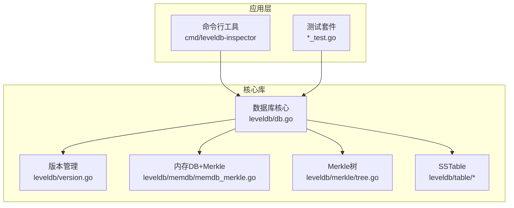
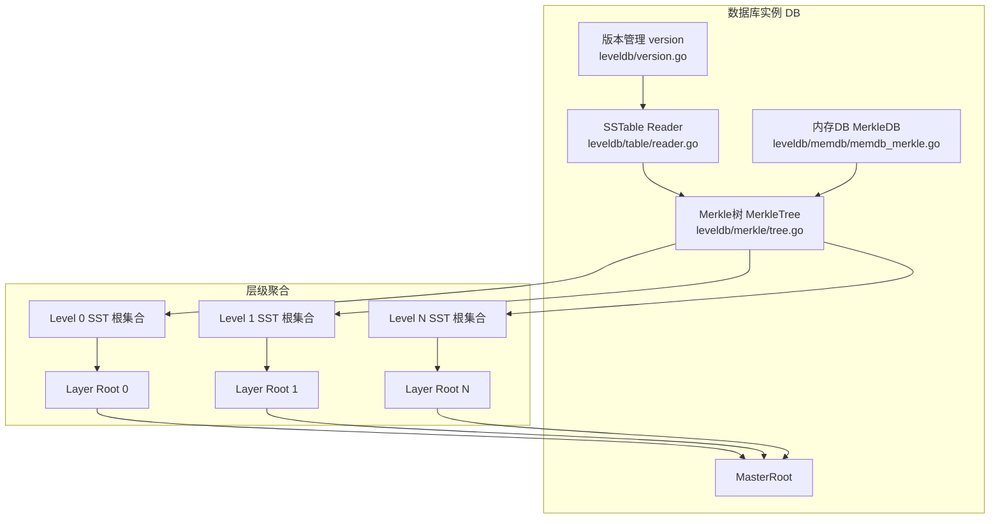
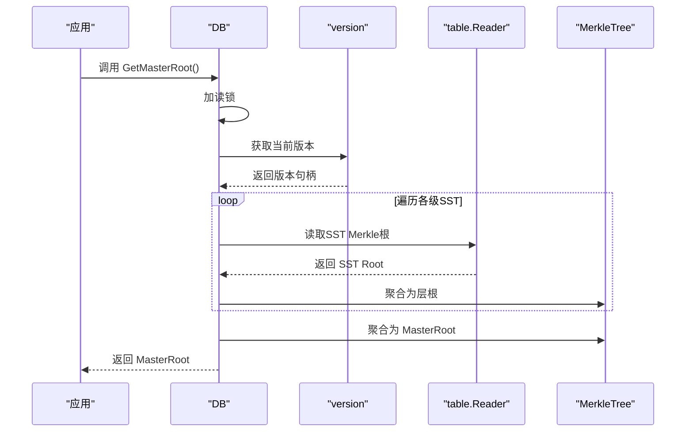
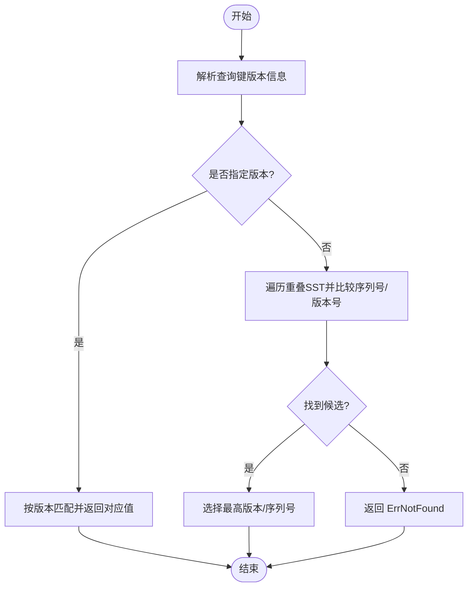
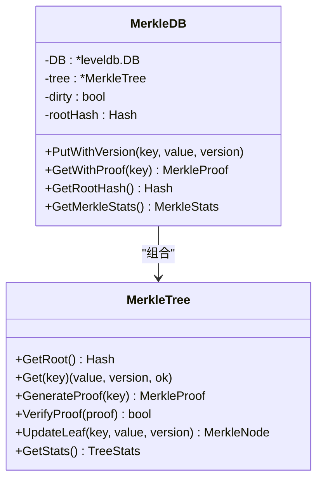
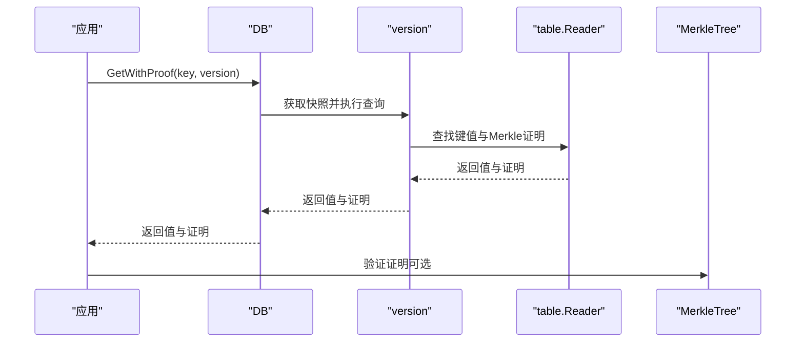
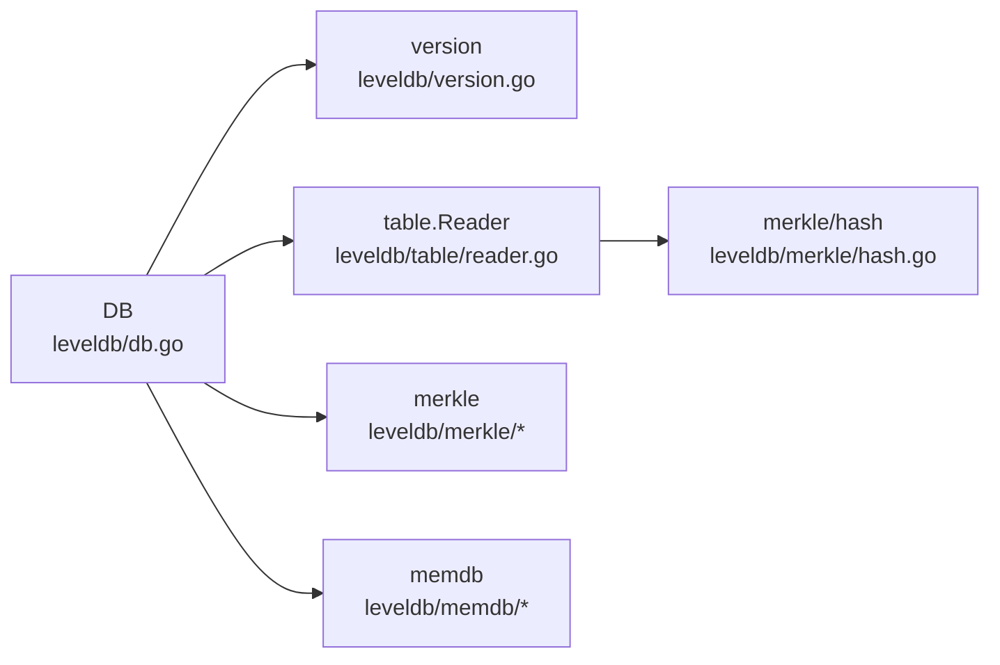

# 项目概述

<cite>
**本文引用的文件列表**
- [README.md](file://README.md)
- [doc.go](file://leveldb/doc.go)
- [db.go](file://leveldb/db.go)
- [version.go](file://leveldb/version.go)
- [mlsm_version_history_test.go](file://leveldb/mlsm_version_history_test.go)
- [mlsm_final_comprehensive_test.go](file://leveldb/mlsm_final_comprehensive_test.go)
- [tree.go](file://leveldb/merkle/tree.go)
- [memdb_merkle.go](file://leveldb/memdb/memdb_merkle.go)
- [table.go](file://leveldb/table/table.go)
- [reader.go](file://leveldb/table/reader.go)
- [hash.go](file://leveldb/merkle/hash.go)
</cite>

## 目录
1. [引言](#引言)
2. [项目结构](#项目结构)
3. [核心组件](#核心组件)
4. [架构总览](#架构总览)
5. [详细组件分析](#详细组件分析)
6. [依赖关系分析](#依赖关系分析)
7. [性能考量](#性能考量)
8. [故障排查指南](#故障排查指南)
9. [结论](#结论)
10. [附录](#附录)

## 引言
avccDB是一个基于Go语言实现的增强型键值存储数据库，其核心目标是在标准LevelDB之上集成Merkle树结构，从而实现数据完整性验证、版本溯源与防篡改能力。该项目通过“mLSM”（multi-version LSM）架构，将LSM-Tree与Merkle树深度融合，形成三层哈希聚合体系：SST层根（SST Merkle Root）、层级根（Layer Root）、主根（MasterRoot）。该设计使得数据库具备：
- 数据完整性与不可否认性：通过Merkle证明验证任意键值的历史版本与当前状态；
- 多版本并发控制（MVCC）：支持按版本读取、范围版本查询与版本历史回溯；
- 跨层级聚合校验：MasterRoot可作为全局一致性快照，用于审计与合规验证。

适用场景包括但不限于：
- 区块链与分布式账本：交易状态树、区块头校验、跨块审计；
- 审计系统：不可篡改的数据溯源与证据链；
- 安全敏感应用：金融、政务、医疗等对数据可信度要求极高的领域。

## 项目结构
仓库采用模块化分层组织，核心目录与职责如下：
- cmd/leveldb-inspector：数据库检查工具（用于查看层级信息、版本统计等）；
- leveldb：核心数据库实现，包含LSM-Tree、表读写、版本管理、事务、快照、Merkle树集成等；
- leveldb/merkle：Merkle树实现与序列化工具；
- leveldb/memdb：内存数据库与Merkle树集成；
- leveldb/table：SSTable结构与读写器；
- leveldb/testutil：测试工具集；
- manualtest：手动测试程序；
- 根目录：README、go.mod、go.sum、.travis.yml、.golangci.yml。

图表来源
- [db.go](file://leveldb/db.go#L1-L120)
- [version.go](file://leveldb/version.go#L1-L60)
- [memdb_merkle.go](file://leveldb/memdb/memdb_merkle.go#L1-L40)
- [tree.go](file://leveldb/merkle/tree.go#L1-L40)
- [table.go](file://leveldb/table/table.go#L1-L60)

章节来源
- [README.md](file://README.md#L1-L108)
- [doc.go](file://leveldb/doc.go#L1-L93)

## 核心组件
- 数据库实例与生命周期
  - DB结构体封装了写入合并、压缩、快照、事务、MasterRoot等关键状态；提供Open/OpenFile/Recover等入口。
  - 关键字段：序列号、写延迟统计、内存DB与冻结内存DB、日志写入器、快照链表、写合并通道、压缩错误通道、MasterRoot互斥锁与根哈希等。
- 版本模型与MVCC
  - version结构表示某一时刻的文件布局，支持按版本查找、范围版本历史查询、seek采样触发压缩等。
  - 支持版本化内部键编码，允许同一用户键存在多个版本，按序列号或版本号选择最新或指定版本。
- Merkle树与MasterRoot
  - MerkleTree提供叶子索引、存在/不存在证明生成、证明验证、更新叶子等能力。
  - DB维护MasterRoot，由各层级SST根哈希聚合而成，支持跨层级一致性校验。
- 内存DB与Merkle集成
  - MerkleDB在内存DB之上构建Merkle树，提供GetWithProof、GetRootHash等接口，支持版本化写入。
- SSTable与读取
  - table包定义SSTable结构、块布局、索引与过滤器；Reader负责块迭代、键查找与Merkle根提取。

章节来源
- [db.go](file://leveldb/db.go#L33-L120)
- [version.go](file://leveldb/version.go#L26-L60)
- [tree.go](file://leveldb/merkle/tree.go#L1-L40)
- [memdb_merkle.go](file://leveldb/memdb/memdb_merkle.go#L1-L40)
- [table.go](file://leveldb/table/table.go#L1-L60)

## 架构总览
avccDB在标准LevelDB之上引入“mLSM”增强，形成三层Merkle聚合：
- 层级一：SST层根（SST Merkle Root）——每个SSTable维护自身Merkle树根；
- 层级二：层级根（Layer Root）——同一层级内所有SST根哈希组成一棵Merkle树，得到层根；
- 层级三：主根（MasterRoot）——将所有层根再次组成一棵Merkle树，得到最终MasterRoot。

图表来源
- [db.go](file://leveldb/db.go#L1491-L1560)
- [version.go](file://leveldb/version.go#L142-L285)
- [memdb_merkle.go](file://leveldb/memdb/memdb_merkle.go#L1-L120)
- [reader.go](file://leveldb/table/reader.go#L1-L60)
- [tree.go](file://leveldb/merkle/tree.go#L1-L40)

## 详细组件分析

### 数据库核心：DB与MasterRoot
- MasterRoot计算流程
  - 从当前版本中遍历各级SSTable，提取每张表的Merkle根；
  - 将同层所有SST根聚合成层根（Merkle树）；
  - 将所有层根聚合成最终MasterRoot（顶层Merkle树）。
- 并发与缓存
  - MasterRoot使用读写锁保护，避免在写入/压缩过程中被并发读取；
  - 更新时机：flush/compaction后调用updateMasterRoot刷新。

图表来源
- [db.go](file://leveldb/db.go#L1479-L1560)
- [version.go](file://leveldb/version.go#L142-L285)
- [reader.go](file://leveldb/table/reader.go#L1-L60)
- [hash.go](file://leveldb/merkle/hash.go#L127-L152)

章节来源
- [db.go](file://leveldb/db.go#L1479-L1560)

### 版本管理与MVCC
- 版本查找策略
  - 支持按版本精确查找、最新版本查找、Wildcard通配查找；
  - 对于非版本化键，兼容传统语义；对于版本化键，按版本号与序列号优先级选择结果。
- 版本历史查询
  - 提供GetVersionHistory接口，可在给定范围内收集所有版本条目，支持最小/最大版本限制；
  - 即使经过多次Compaction，历史版本仍可完整保留与查询。

图表来源
- [version.go](file://leveldb/version.go#L142-L285)
- [version.go](file://leveldb/version.go#L287-L429)
- [version.go](file://leveldb/version.go#L431-L532)

章节来源
- [version.go](file://leveldb/version.go#L142-L285)
- [version.go](file://leveldb/version.go#L287-L429)
- [version.go](file://leveldb/version.go#L431-L532)

### Merkle树与证明生成
- MerkleTree能力
  - 快速叶子索引、存在/不存在证明生成、证明验证、更新叶子并重建树；
  - 提供统计信息与根节点导出，便于序列化与外部验证。
- 内存DB集成
  - MerkleDB在内存层维护Merkle树，支持PutWithVersion写入、GetWithProof生成证明、GetRootHash获取根哈希；
  - 通过脏标记与懒加载避免每次写入都重建树。

图表来源
- [tree.go](file://leveldb/merkle/tree.go#L1-L120)
- [memdb_merkle.go](file://leveldb/memdb/memdb_merkle.go#L1-L120)

章节来源
- [tree.go](file://leveldb/merkle/tree.go#L1-L120)
- [memdb_merkle.go](file://leveldb/memdb/memdb_merkle.go#L1-L120)

### 读取流程与证明获取
- GetWithProof
  - 通过版本管理器在SST层查找键值与Merkle证明，若命中则返回值与证明；
  - 证明可用于验证数据真实性，无需信任数据库本身。
- 迭代器与范围扫描
  - 支持按范围、前缀等条件迭代，内部处理版本化键与非版本化键的差异。

图表来源
- [db.go](file://leveldb/db.go#L1127-L1147)
- [version.go](file://leveldb/version.go#L287-L429)
- [reader.go](file://leveldb/table/reader.go#L1-L60)

章节来源
- [db.go](file://leveldb/db.go#L1127-L1147)
- [version.go](file://leveldb/version.go#L287-L429)

### 写入与版本化
- PutWithVersion
  - 支持带版本号的写入，版本号通常代表区块高度等业务语义；
  - 写入合并策略与同步选项可配置，保证吞吐与持久性平衡。
- MVCC读写
  - 读取时通过快照隔离，确保读取一致性；
  - 写入后可通过GetWithVersion查询历史版本，实现版本溯源。

章节来源
- [db.go](file://leveldb/db.go#L387-L432)
- [db.go](file://leveldb/db.go#L1092-L1126)

### 基本使用模式
- 创建/打开数据库
  - 使用Open/OpenFile打开或创建数据库，支持只读模式与恢复模式；
  - 可通过选项启用布隆过滤器、设置写缓冲区大小等。
- 读写与迭代
  - Get/Put/Delete基本操作；
  - NewIterator支持范围与前缀扫描；
  - Batch批量写入提升吞吐。
- 版本化与证明
  - PutWithVersion写入版本化数据；
  - GetWithVersion按版本读取；
  - GetVersionHistory查询版本历史；
  - GetWithProof获取证明并验证。

章节来源
- [README.md](file://README.md#L15-L108)
- [doc.go](file://leveldb/doc.go#L9-L92)

## 依赖关系分析
- 组件耦合
  - DB与version紧密耦合：DB持有version指针，读取路径通过version.walkOverlapping与find/findWithProof实现；
  - DB与table/merkle强耦合：SST层根与Merkle树根的获取依赖table.Reader与merkle包；
  - DB与memdb：内存层MerkleDB用于快速证明生成与根哈希计算。
- 外部依赖
  - Go标准库（容器、加密、并发、时间等）；
  - 第三方压缩库（snappy）用于SSTable块压缩。

图表来源
- [db.go](file://leveldb/db.go#L1-L120)
- [version.go](file://leveldb/version.go#L1-L60)
- [reader.go](file://leveldb/table/reader.go#L1-L60)
- [hash.go](file://leveldb/merkle/hash.go#L127-L152)
- [memdb_merkle.go](file://leveldb/memdb/memdb_merkle.go#L1-L40)

章节来源
- [db.go](file://leveldb/db.go#L1-L120)
- [version.go](file://leveldb/version.go#L1-L60)
- [reader.go](file://leveldb/table/reader.go#L1-L60)
- [hash.go](file://leveldb/merkle/hash.go#L127-L152)
- [memdb_merkle.go](file://leveldb/memdb/memdb_merkle.go#L1-L40)

## 性能考量
- 写入路径
  - 写入合并与批处理：通过writeMergeC/writeMergedC/writeLockC协调写入，减少锁竞争；
  - 写缓冲区与压缩：WriteBuffer与Compression影响flush频率与SST大小，进而影响MasterRoot聚合成本。
- 读取路径
  - 版本查找：按层级重叠扫描，命中后按版本/序列号选择最优值；
  - 迭代器：Level-0合并读取，其他层级索引迭代，支持范围与前缀扫描。
- Merkle树开销
  - 内存层MerkleDB通过脏标记与懒加载降低重建频率；
  - MasterRoot聚合在flush/compaction后触发，避免频繁全量计算。

[本节为通用性能讨论，不直接分析具体文件]

## 故障排查指南
- 常见错误类型
  - ErrNotFound：键不存在或指定版本不存在；
  - ErrCorrupted：检测到数据损坏，可使用Recover函数恢复；
  - 事务提交失败：可能因压缩错误或资源不足，需重试或调整阈值。
- 排查步骤
  - 检查数据库状态：确认是否处于只读模式、是否已关闭；
  - 触发压缩：必要时调用CompactRange或等待后台压缩；
  - 验证MasterRoot：在写入/压缩后重新获取MasterRoot，确认一致性；
  - 使用测试用例：参考版本历史与综合测试，定位问题边界。

章节来源
- [db.go](file://leveldb/db.go#L177-L243)
- [db.go](file://leveldb/db.go#L245-L293)
- [mlsm_version_history_test.go](file://leveldb/mlsm_version_history_test.go#L1-L139)
- [mlsm_final_comprehensive_test.go](file://leveldb/mlsm_final_comprehensive_test.go#L1-L120)

## 结论
avccDB通过在标准LevelDB上深度集成Merkle树，实现了数据完整性、版本溯源与防篡改的统一架构。其三层聚合（SST根→层根→MasterRoot）与MVCC设计，使其在区块链、审计与安全敏感场景中具备显著优势。项目提供了完善的API与测试覆盖，既适合初学者循序渐进学习，也为专家级用户提供深入扩展的空间。

[本节为总结性内容，不直接分析具体文件]

## 附录

### 学习路径建议
- 初学者
  - 先阅读README与doc.go，了解基本使用与API；
  - 运行示例代码，熟悉Open/Get/Put/Iterator/Batch等基础操作；
  - 阅读版本历史测试，理解MVCC与版本化读取。
- 进阶者
  - 深入理解db.go与version.go，掌握版本管理与读取路径；
  - 研究merkle包与memdb_merkle.go，理解Merkle树与MasterRoot聚合；
  - 阅读table包，理解SSTable结构与读取器工作原理。
- 专家级
  - 分析压缩与flush流程，理解MasterRoot更新时机；
  - 扩展MerkleDB与SST层证明生成，实现跨层证明聚合；
  - 结合测试用例进行压力与一致性验证。

章节来源
- [README.md](file://README.md#L15-L108)
- [doc.go](file://leveldb/doc.go#L9-L92)
- [mlsm_version_history_test.go](file://leveldb/mlsm_version_history_test.go#L1-L139)
- [mlsm_final_comprehensive_test.go](file://leveldb/mlsm_final_comprehensive_test.go#L1-L120)