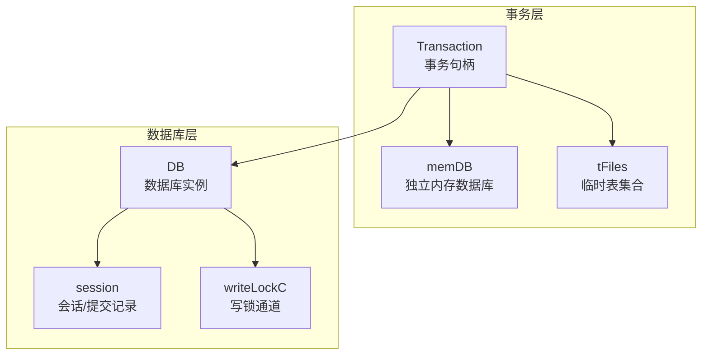
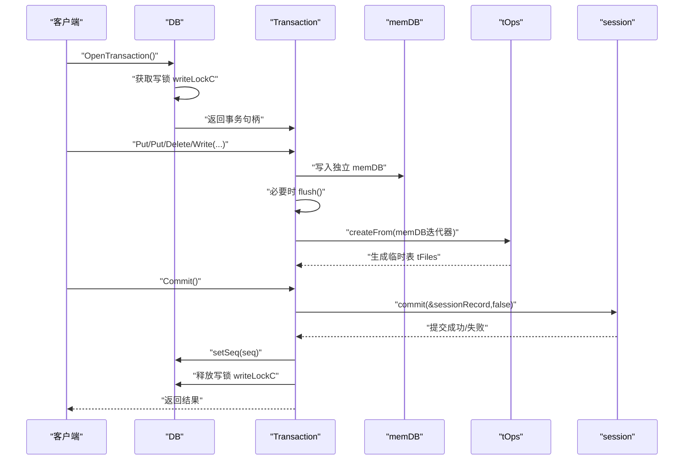
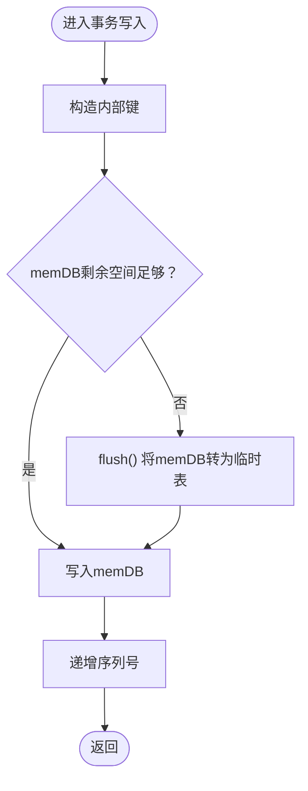
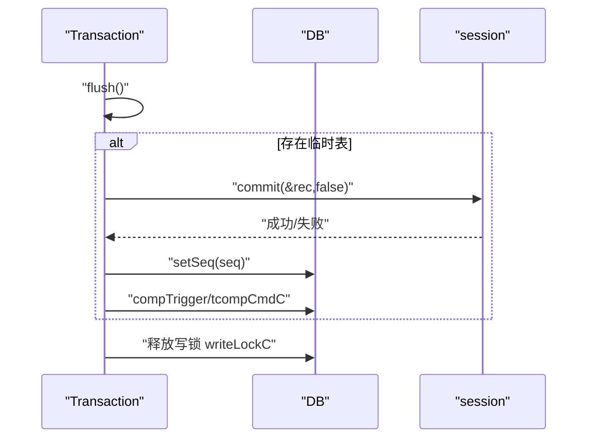
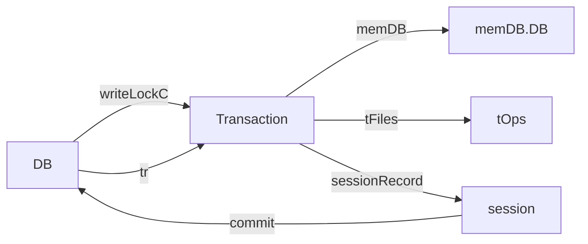

# 事务

<cite>
**本文引用的文件**
- [db_transaction.go](file://leveldb/db_transaction.go)
- [db.go](file://leveldb/db.go)
- [memdb.go](file://leveldb/memdb/memdb.go)
- [table.go](file://leveldb/table.go)
- [session.go](file://leveldb/session.go)
- [db_write.go](file://leveldb/db_write.go)
- [external_test.go](file://leveldb/external_test.go)
- [main.go](file://manualtest/dbstress/main.go)
</cite>

## 目录
1. [简介](#简介)
2. [项目结构](#项目结构)
3. [核心组件](#核心组件)
4. [架构总览](#架构总览)
5. [详细组件分析](#详细组件分析)
6. [依赖关系分析](#依赖关系分析)
7. [性能考量](#性能考量)
8. [故障排查指南](#故障排查指南)
9. [结论](#结论)
10. [附录：使用示例与最佳实践](#附录使用示例与最佳实践)

## 简介
本章面向 avccDB 的事务功能，系统阐述事务如何提供原子性与隔离性保障，如何将多个写入操作组合为不可分割的单元；并深入解析事务的内部实现机制：如何使用独立的内存数据库（memDB）与临时表（tFiles）暂存变更，以及在提交（Commit）时如何将这些变更原子地应用到主数据库。同时对比事务与常规写入路径的差异，给出何时使用事务（如批量写入大量数据）的建议，并提供开启、写入、提交与回滚的完整示例路径与注意事项。

## 项目结构
围绕事务的核心代码主要分布在以下模块：
- 事务句柄与生命周期管理：leveldb/db_transaction.go
- 数据库主流程与并发控制：leveldb/db.go
- 内存数据库实现：leveldb/memdb/memdb.go
- 表操作与临时表管理：leveldb/table.go
- 会话与提交记录：leveldb/session.go
- 常规写入路径与大批次优化：leveldb/db_write.go
- 使用示例与测试参考：leveldb/external_test.go、manualtest/dbstress/main.go



图表来源
- [db_transaction.go](file://leveldb/db_transaction.go#L21-L335)
- [db.go](file://leveldb/db.go#L33-L120)
- [table.go](file://leveldb/table.go#L86-L120)
- [session.go](file://leveldb/session.go#L36-L66)

章节来源
- [db_transaction.go](file://leveldb/db_transaction.go#L21-L335)
- [db.go](file://leveldb/db.go#L33-L120)

## 核心组件
- 事务句柄（Transaction）
  - 维护独立的 memDB 与临时表集合 tFiles，用于暂存事务内的所有写入。
  - 提供 Get/Has/NewIterator/Put/Delete/Write/Commit/Discard 等方法。
  - 通过互斥锁保护状态，防止并发误用；关闭后禁止继续调用。
- 内存数据库（memDB）
  - 轻量级跳表实现，支持并发读取、有序遍历与高吞吐写入。
  - 事务写入先落至 memDB，必要时触发 flush 将其转为临时表。
- 临时表集合（tFiles）
  - flush 后生成的表文件集合，按层级与文件号组织，参与后续提交。
- 数据库（DB）
  - 全局写锁 writeLockC 控制事务与常规写入的互斥。
  - 提交阶段通过 session.commit 应用事务记录，更新序列号与版本。
- 会话（session）
  - 记录事务提交所需的元信息（如表文件、序列号等），并负责持久化提交。

章节来源
- [db_transaction.go](file://leveldb/db_transaction.go#L21-L116)
- [memdb.go](file://leveldb/memdb/memdb.go#L182-L210)
- [table.go](file://leveldb/table.go#L86-L120)
- [session.go](file://leveldb/session.go#L36-L66)
- [db.go](file://leveldb/db.go#L33-L120)

## 架构总览
事务的提交流程由“写入暂存”和“原子提交”两部分组成：
- 写入暂存：事务写入先写入独立 memDB，当空间不足或显式 flush 时，将 memDB 转换为临时表（tFiles），并记录到事务记录（sessionRecord）中。
- 原子提交：事务在 Commit 时，设置事务最大序列号，加锁提交（compCommitLk），多次重试直至成功；成功后更新数据库序列号，触发压缩并释放写锁。



图表来源
- [db_transaction.go](file://leveldb/db_transaction.go#L92-L248)
- [table.go](file://leveldb/table.go#L372-L401)
- [session.go](file://leveldb/session.go#L122-L200)
- [db.go](file://leveldb/db.go#L33-L120)

## 详细组件分析

### 事务类图（对象关系）
```mermaid
classDiagram
    class Transaction {
        -DB db
        -RWMutex lk
        -uint64 seq
        -memDB* mem
        -tFiles tables
        -[]byte ikScratch
        -sessionRecord rec
        -cStatStaging stats
        -bool closed
        +Get(key, ro) ([]byte,error)
        +Has(key, ro) (bool,error)
        +NewIterator(slice, ro) Iterator
        +Put(key, value, wo) error
        +Delete(key, wo) error
        +Write(batch, wo) error
        +Commit() error
        +Discard() void
        -flush() error
        -put(kt,key,value) error
        -setDone() void
    }
    class DB {
        +uint64 seq
        +chan struct{} writeLockC
        +Transaction* tr
        +OpenTransaction() (*Transaction,error)
        +waitCompaction() error
        +setSeq(seq) void
    }
    class memDB {
        +DB* DB
        +Put(key,value) error
        +Delete(key) error
        +NewIterator(slice) Iterator
        +Len() int
        +Reset() void
        +incref()/decref() void
    }
    class tFiles {
        +append(tFile) void
        +size() int64
        +sortByKey()/sortByNum() void
    }
    class session {
        +commit(record,bootstrap) error
        +allocFileNum() int64
    }
    Transaction --> DB : "持有引用"
    Transaction --> memDB : "使用"
    Transaction --> tFiles : "生成"
    DB --> Transaction : "tr 指针"
    DB --> session : "提交"
```

图表来源
- [db_transaction.go](file://leveldb/db_transaction.go#L21-L116)
- [db.go](file://leveldb/db.go#L33-L120)
- [memdb.go](file://leveldb/memdb/memdb.go#L182-L210)
- [table.go](file://leveldb/table.go#L86-L120)
- [session.go](file://leveldb/session.go#L36-L66)

### 事务写入与 flush 流程
- 写入路径：事务写入先构造内部键（包含序列号与类型），检查 memDB 剩余空间，不足则 flush；随后写入 memDB 并递增序列号。
- flush 流程：将 memDB 的内容通过 tOps.createFrom 迭代器转换为临时表，更新事务记录与统计信息，必要时重置或复用 memDB。



图表来源
- [db_transaction.go](file://leveldb/db_transaction.go#L118-L130)
- [db_transaction.go](file://leveldb/db_transaction.go#L92-L116)

章节来源
- [db_transaction.go](file://leveldb/db_transaction.go#L92-L130)

### 事务提交流程
- Commit 前确保 flush 完成；若存在临时表，则设置事务记录的序列号，加锁提交（compCommitLk），最多重试三次；成功后更新数据库序列号，触发压缩并释放写锁。
- Discard 则丢弃临时表并释放资源。



图表来源
- [db_transaction.go](file://leveldb/db_transaction.go#L189-L248)
- [db.go](file://leveldb/db.go#L33-L120)

章节来源
- [db_transaction.go](file://leveldb/db_transaction.go#L189-L248)

### 事务与常规写入的差异
- 常规写入（DB.Write）：
  - 可合并小批次，写入日志（journal）并写入当前 memDB，必要时旋转 memDB。
  - 对于较大的批，可自动降级为使用事务以跳过日志直接写表，提高吞吐。
- 事务写入：
  - 所有写入均暂存于独立 memDB，不立即进入主 memDB，直到 Commit。
  - Commit 时一次性提交，避免中间态对其他读取可见。

章节来源
- [db_write.go](file://leveldb/db_write.go#L268-L330)
- [db_write.go](file://leveldb/db_write.go#L239-L266)

## 依赖关系分析
- 事务依赖
  - 事务依赖 DB 的全局写锁 writeLockC 保证互斥；依赖 memDB 池化机制获取独立 memDB；依赖 tOps 将 memDB 转为临时表；最终通过 session.commit 提交到持久化层。
- 关键耦合点
  - DB.tr 指针确保同一时刻仅有一个事务处于活跃状态。
  - compCommitLk 保证提交过程中的互斥与一致性。
  - writeLockC 作为全局写锁，协调事务与常规写入。



图表来源
- [db_transaction.go](file://leveldb/db_transaction.go#L21-L335)
- [db.go](file://leveldb/db.go#L33-L120)
- [table.go](file://leveldb/table.go#L372-L401)
- [session.go](file://leveldb/session.go#L122-L200)

章节来源
- [db_transaction.go](file://leveldb/db_transaction.go#L21-L335)
- [db.go](file://leveldb/db.go#L33-L120)

## 性能考量
- 事务的代价
  - 事务在 flush 阶段会将 memDB 转为临时表，这会增加一次构建表的成本；且事务期间独占写锁，可能阻塞其他写入。
  - 文档注释明确指出：事务非常昂贵，尤其当事务规模较小时会过度影响压缩；建议当需要合并的数据量达到“Options.WriteBuffer”级别以上才使用事务。
- 大批次优化
  - 常规写入路径在批大小超过写缓冲阈值时，会自动降级为使用事务（OpenTransaction + Write + Commit），从而跳过日志，减少写放大。
- 压缩与暂停
  - 事务提交后会触发压缩；当 L0 表数量达到阈值时，会等待压缩完成后再继续。

章节来源
- [db_transaction.go](file://leveldb/db_transaction.go#L284-L297)
- [db_write.go](file://leveldb/db_write.go#L280-L293)
- [db_transaction.go](file://leveldb/db_transaction.go#L277-L283)

## 故障排查指南
- 事务已关闭错误
  - 当对已关闭（Commit 或 Discard）的事务再次调用方法时，会返回“事务已关闭”的错误。请确保在事务完成后不再使用该句柄。
- 提交失败与重试
  - Commit 在提交失败时会进行最多三次重试；若仍失败，需由用户决定重试或丢弃事务。
- 写锁竞争
  - 事务与常规写入共享全局写锁 writeLockC；若长时间持锁，可能造成写入延迟。可通过批量写入或选择合适的写入方式降低竞争。
- 压缩阻塞
  - 当 L0 表过多时，事务提交会等待压缩完成；若出现长时间延迟，可检查压缩策略与阈值配置。

章节来源
- [db_transaction.go](file://leveldb/db_transaction.go#L189-L248)
- [db_transaction.go](file://leveldb/db_transaction.go#L277-L283)
- [db.go](file://leveldb/db.go#L33-L120)

## 结论
avccDB 的事务通过“独立 memDB + 临时表”的设计，在提交前将多条写入原子化地应用到主数据库。它在提供原子性的同时，也带来额外的 flush 成本与写锁竞争风险。对于大批量写入场景，优先考虑使用事务；对于小批量或高频写入，常规写入路径更合适。正确理解事务的生命周期、flush 触发条件与提交重试机制，有助于在性能与一致性之间取得平衡。

## 附录：使用示例与最佳实践

### 开启事务
- 示例路径：参考外部测试中打开事务的步骤。
  - [示例路径](file://leveldb/external_test.go#L101-L103)

### 写入与提交
- 示例路径：参考压力测试中使用事务写入与提交的流程。
  - [示例路径](file://manualtest/dbstress/main.go#L392-L407)

### 回滚（丢弃）
- 示例路径：参考外部测试中丢弃事务的操作。
  - [示例路径](file://leveldb/external_test.go#L97-L99)

### 何时使用事务
- 场景建议
  - 批量写入大量数据，合并写入以减少写放大与日志成本。
  - 需要强一致性的多步写入，确保要么全部成功，要么全部失败。
- 注意事项
  - 避免小事务频繁触发 flush 与压缩；建议事务体量达到“Options.WriteBuffer”级别以上再使用。
  - 事务期间独占写锁，注意与其他写入的并发冲突。

章节来源
- [db_transaction.go](file://leveldb/db_transaction.go#L284-L297)
- [db_write.go](file://leveldb/db_write.go#L280-L293)
- [external_test.go](file://leveldb/external_test.go#L88-L117)
- [main.go](file://manualtest/dbstress/main.go#L392-L407)