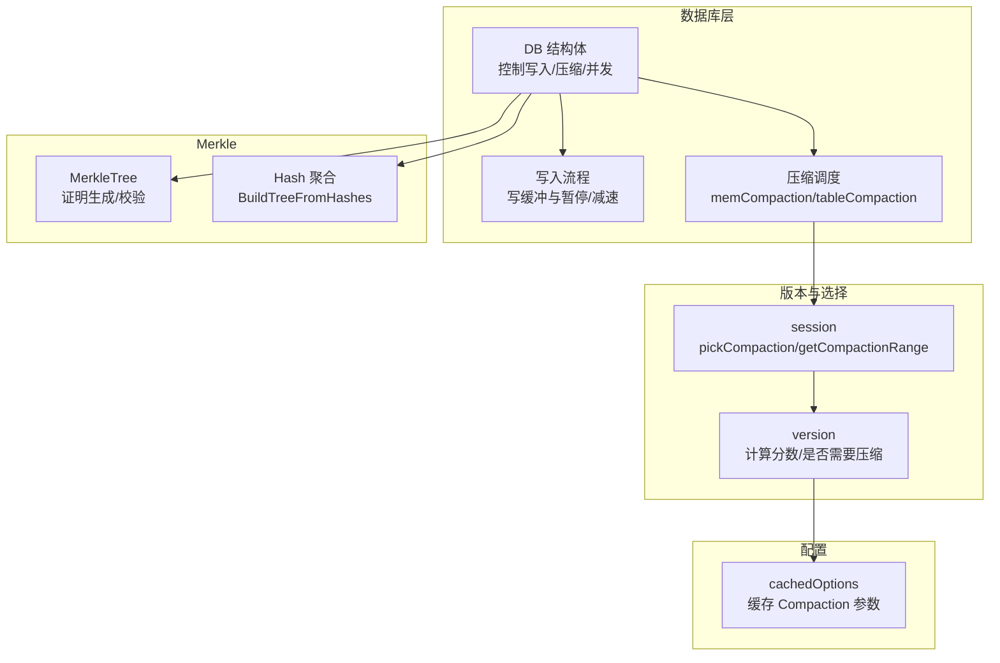
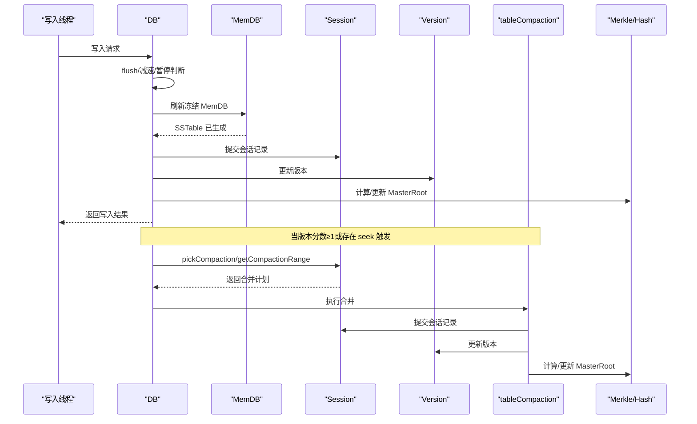
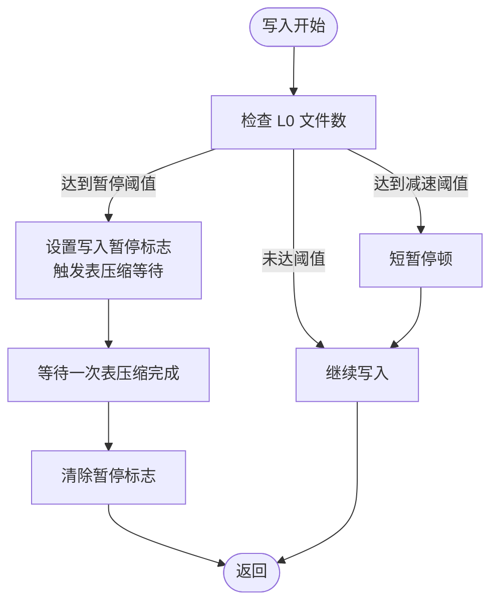
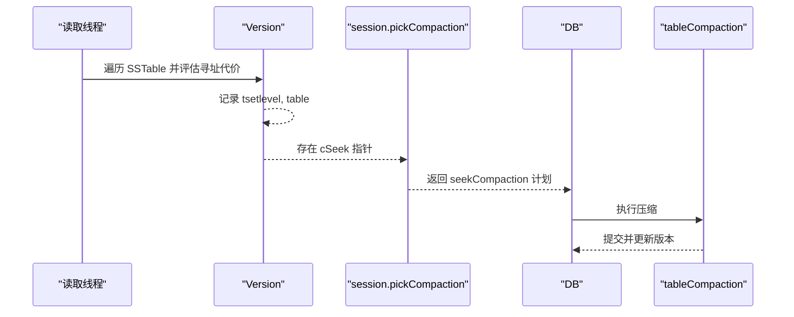
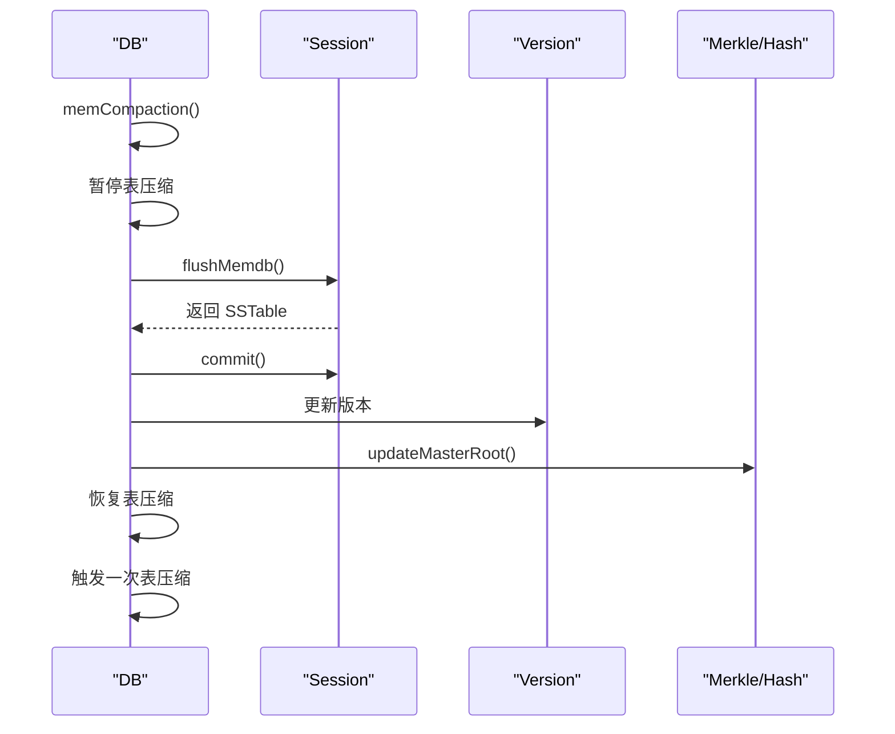
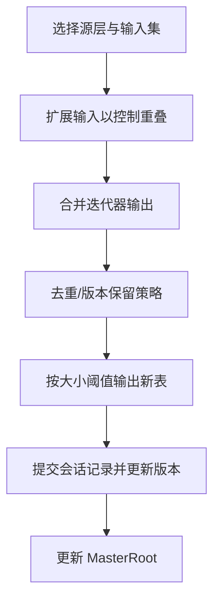
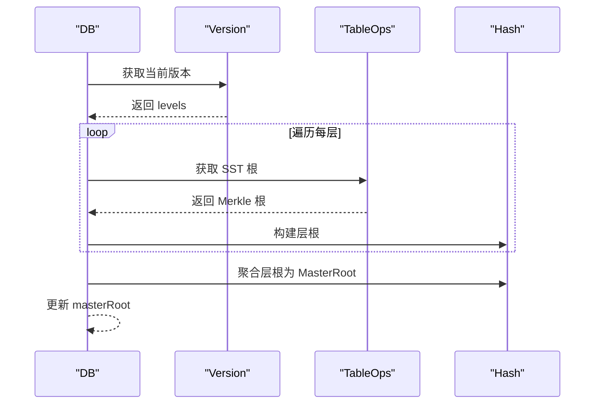
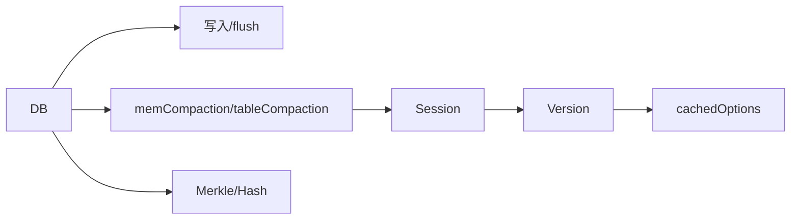

# 压缩

<cite>
**本文引用的文件列表**
- [leveldb/db_compaction.go](file://leveldb/db_compaction.go)
- [leveldb/session_compaction.go](file://leveldb/session_compaction.go)
- [leveldb/db.go](file://leveldb/db.go)
- [leveldb/version.go](file://leveldb/version.go)
- [leveldb/options.go](file://leveldb/options.go)
- [leveldb/db_write.go](file://leveldb/db_write.go)
- [leveldb/merkle/tree.go](file://leveldb/merkle/tree.go)
- [leveldb/merkle/hash.go](file://leveldb/merkle/hash.go)
- [leveldb/mlsm_final_comprehensive_test.go](file://leveldb/mlsm_final_comprehensive_test.go)
</cite>

## 目录
1. [简介](#简介)
2. [项目结构](#项目结构)
3. [核心组件](#核心组件)
4. [架构总览](#架构总览)
5. [详细组件分析](#详细组件分析)
6. [依赖关系分析](#依赖关系分析)
7. [性能考量](#性能考量)
8. [故障排查指南](#故障排查指南)
9. [结论](#结论)
10. [附录](#附录)

## 简介
本文件面向 avccDB 的压缩功能，聚焦其在 mLSM 架构中的实现与行为。内容涵盖：
- 内存压缩（memCompaction）与表压缩（tableCompaction）的触发机制，包括基于 Level 0 文件数量的触发（WriteL0PauseTrigger）与基于读取延迟的触发（seekCompaction）。
- 压缩过程：从 MemDB 刷新到 SSTable、多层表合并、Merkle 树更新以及 MasterRoot 的重新计算。
- 性能影响：写入延迟（write delay）与 I/O 负载；给出通过配置项（如 CompactionTableSize、CompactionTotalSize）进行调优的建议。
- 数据完整性验证：压缩如何与 Merkle 证明协同工作，确保压缩后的数据仍可生成有效证明。

## 项目结构
围绕压缩的核心代码主要位于以下模块：
- 数据库控制与调度：db.go、db_compaction.go、db_write.go
- 版本与选择策略：version.go、session_compaction.go
- 配置缓存与参数：options.go
- Merkle 树与聚合：merkle/tree.go、merkle/hash.go
- 行为验证与示例：mlsm_final_comprehensive_test.go

图表来源
- [leveldb/db.go](file://leveldb/db.go#L33-L120)
- [leveldb/db_compaction.go](file://leveldb/db_compaction.go#L269-L355)
- [leveldb/session_compaction.go](file://leveldb/session_compaction.go#L56-L95)
- [leveldb/version.go](file://leveldb/version.go#L646-L695)
- [leveldb/options.go](file://leveldb/options.go#L48-L107)
- [leveldb/merkle/tree.go](file://leveldb/merkle/tree.go#L1-L66)
- [leveldb/merkle/hash.go](file://leveldb/merkle/hash.go#L113-L152)

章节来源
- [leveldb/db.go](file://leveldb/db.go#L33-L120)
- [leveldb/db_compaction.go](file://leveldb/db_compaction.go#L269-L355)
- [leveldb/session_compaction.go](file://leveldb/session_compaction.go#L56-L95)
- [leveldb/version.go](file://leveldb/version.go#L646-L695)
- [leveldb/options.go](file://leveldb/options.go#L48-L107)
- [leveldb/merkle/tree.go](file://leveldb/merkle/tree.go#L1-L66)
- [leveldb/merkle/hash.go](file://leveldb/merkle/hash.go#L113-L152)

## 核心组件
- 内存压缩（memCompaction）
  - 将冻结的 MemDB 刷新为 SSTable，写入目标层级由版本选择决定；完成后提交会话记录并更新 MasterRoot。
  - 触发时机：当存在冻结 MemDB 且非空时自动触发；期间会暂停表压缩，完成后恢复并触发一次表压缩。
- 表压缩（tableCompaction）
  - 自动选择或按范围选择要合并的表，构建输出表；支持 trivial 移动与普通合并；完成后提交并更新 MasterRoot。
  - 触发时机：版本分数达到阈值（基于 L0 文件数或各层总大小）或因读取延迟触发（seekCompaction）。
- 版本与选择策略
  - 版本维护每层文件集合与压缩分数；当分数≥1或存在 seek 触发时需要压缩。
  - 选择器根据分数与 seek 指针挑选源层与输入集。
- 配置缓存
  - 缓存 CompactionTableSize、CompactionTotalSize、CompactionSourceLimit 等参数，按层级动态计算。
- Merkle 与 MasterRoot
  - 压缩后重建各层 SST 根的 Merkle 树，再聚合为层根，最终聚合为 MasterRoot；提供接口查询当前 MasterRoot。

章节来源
- [leveldb/db_compaction.go](file://leveldb/db_compaction.go#L269-L355)
- [leveldb/db_compaction.go](file://leveldb/db_compaction.go#L567-L629)
- [leveldb/session_compaction.go](file://leveldb/session_compaction.go#L56-L95)
- [leveldb/version.go](file://leveldb/version.go#L646-L695)
- [leveldb/options.go](file://leveldb/options.go#L48-L107)
- [leveldb/db.go](file://leveldb/db.go#L1479-L1569)

## 架构总览
下图展示了压缩在 mLSM 中的关键交互：写入触发 memCompaction，随后可能触发 tableCompaction；压缩完成后更新 Merkle 层级与 MasterRoot。

图表来源
- [leveldb/db_write.go](file://leveldb/db_write.go#L66-L131)
- [leveldb/db_compaction.go](file://leveldb/db_compaction.go#L269-L355)
- [leveldb/session_compaction.go](file://leveldb/session_compaction.go#L56-L95)
- [leveldb/version.go](file://leveldb/version.go#L646-L695)
- [leveldb/db.go](file://leveldb/db.go#L1479-L1569)

## 详细组件分析

### 触发机制：基于 L0 文件数量（WriteL0PauseTrigger）
- 写入路径中，当 Level 0 的文件数达到“暂停阈值”时，写入会被阻塞等待一次表压缩完成；同时设置写入暂停标志，避免写入堆积。
- 写入路径还包含“减速阈值”，超过则短暂停顿以缓解压力。
- 该机制通过版本统计的 L0 分数与配置项共同决定是否触发压缩。

图表来源
- [leveldb/db_write.go](file://leveldb/db_write.go#L66-L131)
- [leveldb/db_compaction.go](file://leveldb/db_compaction.go#L681-L686)
- [leveldb/version.go](file://leveldb/version.go#L646-L695)

章节来源
- [leveldb/db_write.go](file://leveldb/db_write.go#L66-L131)
- [leveldb/db_compaction.go](file://leveldb/db_compaction.go#L681-L686)
- [leveldb/version.go](file://leveldb/version.go#L646-L695)

### 触发机制：基于读取延迟（seekCompaction）
- 读取路径在遍历 SSTable 时，若发现某表的“寻址代价”过高，会在版本中记录一个 seek 指针；当版本检测到存在该指针时即判定需要压缩。
- 选择器据此挑选特定表进行压缩，以降低后续读取成本。

图表来源
- [leveldb/version.go](file://leveldb/version.go#L142-L285)
- [leveldb/session_compaction.go](file://leveldb/session_compaction.go#L86-L95)
- [leveldb/db_compaction.go](file://leveldb/db_compaction.go#L567-L629)

章节来源
- [leveldb/version.go](file://leveldb/version.go#L142-L285)
- [leveldb/session_compaction.go](file://leveldb/session_compaction.go#L86-L95)
- [leveldb/db_compaction.go](file://leveldb/db_compaction.go#L567-L629)

### 压缩过程：MemDB 刷新到 SSTable
- 冻结 MemDB 存在时，执行 memCompaction：暂停表压缩、调用 session.flushMemdb 生成 SSTable、提交会话记录、更新统计、丢弃冻结 MemDB、更新 MasterRoot，最后恢复表压缩并触发一次表压缩。
- 该流程保证 MemDB 刷新期间不会被其他表压缩打断，且刷新后立即更新全局 Merkle 根。

图表来源
- [leveldb/db_compaction.go](file://leveldb/db_compaction.go#L269-L355)
- [leveldb/session_compaction.go](file://leveldb/session_compaction.go#L31-L53)
- [leveldb/db.go](file://leveldb/db.go#L1479-L1569)

章节来源
- [leveldb/db_compaction.go](file://leveldb/db_compaction.go#L269-L355)
- [leveldb/session_compaction.go](file://leveldb/session_compaction.go#L31-L53)
- [leveldb/db.go](file://leveldb/db.go#L1479-L1569)

### 压缩过程：多层表合并与输出
- tableCompaction 会根据版本选择器确定源层与输入集，必要时扩展输入以控制重叠；对迭代器输出进行去重与版本保留策略（mLSM 特性：保留历史版本与删除标记用于 Merkle 证明）。
- 输出表大小受 CompactionTableSize 控制；完成后提交并更新版本与 MasterRoot。

图表来源
- [leveldb/db_compaction.go](file://leveldb/db_compaction.go#L567-L629)
- [leveldb/session_compaction.go](file://leveldb/session_compaction.go#L197-L246)
- [leveldb/db.go](file://leveldb/db.go#L1479-L1569)

章节来源
- [leveldb/db_compaction.go](file://leveldb/db_compaction.go#L567-L629)
- [leveldb/session_compaction.go](file://leveldb/session_compaction.go#L197-L246)
- [leveldb/db.go](file://leveldb/db.go#L1479-L1569)

### Merkle 树更新与 MasterRoot 重新计算
- 压缩完成后，DB 会遍历当前版本的所有层级，收集每层 SST 的 Merkle 根，构建层根；再将所有层根聚合得到 MasterRoot。
- 提供 GetMasterRoot 接口查询当前 MasterRoot，便于外部验证数据库一致性。

图表来源
- [leveldb/db.go](file://leveldb/db.go#L1479-L1569)
- [leveldb/merkle/hash.go](file://leveldb/merkle/hash.go#L113-L152)

章节来源
- [leveldb/db.go](file://leveldb/db.go#L1479-L1569)
- [leveldb/merkle/hash.go](file://leveldb/merkle/hash.go#L113-L152)

### 与数据完整性验证协同工作
- mLSM 要求保留历史版本与删除标记，以支持 Merkle 证明（存在/不存在证明）。压缩过程中对版本与删除标记的处理遵循这一要求，确保压缩后仍可生成有效证明。
- 综合测试覆盖了大规模写入、版本查询、MasterRoot 计算与压缩后数据完整性验证，体现压缩与 Merkle 的协同效果。

章节来源
- [leveldb/db_compaction.go](file://leveldb/db_compaction.go#L500-L526)
- [leveldb/mlsm_final_comprehensive_test.go](file://leveldb/mlsm_final_comprehensive_test.go#L1-L200)

## 依赖关系分析
- DB 对写入、压缩、版本与 Merkle 的依赖清晰：写入触发 memCompaction；压缩触发提交与版本更新；压缩完成后更新 MasterRoot。
- 版本选择器依赖 cachedOptions 的参数缓存，按层级动态计算 CompactionTableSize、CompactionTotalSize、CompactionSourceLimit 等。
- Merkle 层面通过 BuildTreeFromHashes 聚合 SST 根与层根，形成 MasterRoot。

图表来源
- [leveldb/db.go](file://leveldb/db.go#L33-L120)
- [leveldb/db_compaction.go](file://leveldb/db_compaction.go#L269-L355)
- [leveldb/session_compaction.go](file://leveldb/session_compaction.go#L56-L95)
- [leveldb/version.go](file://leveldb/version.go#L646-L695)
- [leveldb/options.go](file://leveldb/options.go#L48-L107)
- [leveldb/merkle/hash.go](file://leveldb/merkle/hash.go#L113-L152)

章节来源
- [leveldb/db.go](file://leveldb/db.go#L33-L120)
- [leveldb/db_compaction.go](file://leveldb/db_compaction.go#L269-L355)
- [leveldb/session_compaction.go](file://leveldb/session_compaction.go#L56-L95)
- [leveldb/version.go](file://leveldb/version.go#L646-L695)
- [leveldb/options.go](file://leveldb/options.go#L48-L107)
- [leveldb/merkle/hash.go](file://leveldb/merkle/hash.go#L113-L152)

## 性能考量
- 写入延迟（write delay）
  - 当 L0 文件数接近或超过暂停阈值时，写入会被阻塞等待一次表压缩完成；这会增加写入延迟但能避免 L0 过度膨胀导致的读放大。
  - 减速阈值用于在达到暂停阈值前进行短暂停顿，平滑写入压力。
- I/O 负载
  - memCompaction 会产生一次写放大（MemDB → SSTable），随后的 tableCompaction 会产生多次读放大（多表合并 → 新表）。
  - 通过合理设置 CompactionTableSize 与 CompactionTotalSize 可控制单次输出大小与层间总大小，平衡吞吐与空间占用。
- 配置调优建议
  - CompactionTableSize：较小值可提升压缩频率与空间效率，但增加写放大；较大值减少写放大但可能增大单次 I/O。
  - CompactionTotalSize：用于衡量层内总大小，过大可能导致读放大；过小会频繁触发压缩。
  - WriteL0PauseTrigger / WriteL0SlowdownTrigger：根据写缓冲与磁盘能力调整，避免 L0 过度堆积。
  - DisableSeeksCompaction：若读取延迟问题不显著，可关闭 seekCompaction 以减少额外压缩开销。

章节来源
- [leveldb/db_write.go](file://leveldb/db_write.go#L66-L131)
- [leveldb/version.go](file://leveldb/version.go#L646-L695)
- [leveldb/options.go](file://leveldb/options.go#L48-L107)

## 故障排查指南
- 压缩错误传播
  - DB 维护压缩错误通道，区分瞬时错误与持久错误；遇到持久错误会持有写锁并阻塞写入，直至错误解除。
- 压缩事务回滚
  - 压缩采用事务式执行，失败时可回滚已创建的临时文件，避免损坏。
- 读取延迟异常
  - 若 seekCompaction 频繁触发，检查是否存在热点键或读取模式导致寻址代价高；适当增大 CompactionTableSize 或调整层间比例。

章节来源
- [leveldb/db_compaction.go](file://leveldb/db_compaction.go#L87-L139)
- [leveldb/db_compaction.go](file://leveldb/db_compaction.go#L356-L431)

## 结论
avccDB 在 mLSM 架构中实现了稳健的压缩体系：通过 L0 文件数与读取延迟双触发机制，结合版本选择策略与事务式压缩，既保障了写入性能与稳定性，又维持了数据完整性与 Merkle 证明能力。配合合理的配置参数，可在吞吐、空间与延迟之间取得良好平衡。

## 附录
- 关键接口与路径参考
  - memCompaction：[leveldb/db_compaction.go](file://leveldb/db_compaction.go#L269-L355)
  - tableCompaction：[leveldb/db_compaction.go](file://leveldb/db_compaction.go#L567-L629)
  - 选择器 pickCompaction：[leveldb/session_compaction.go](file://leveldb/session_compaction.go#L56-L95)
  - 选择器 getCompactionRange：[leveldb/session_compaction.go](file://leveldb/session_compaction.go#L98-L134)
  - 版本分数与触发 needCompaction：[leveldb/version.go](file://leveldb/version.go#L646-L695)
  - 写入暂停/减速：[leveldb/db_write.go](file://leveldb/db_write.go#L66-L131)
  - MasterRoot 查询与更新：[leveldb/db.go](file://leveldb/db.go#L1479-L1569)
  - Merkle 根聚合：[leveldb/merkle/hash.go](file://leveldb/merkle/hash.go#L113-L152)
  - 综合测试（含 MasterRoot 验证）：[leveldb/mlsm_final_comprehensive_test.go](file://leveldb/mlsm_final_comprehensive_test.go#L1-L200)