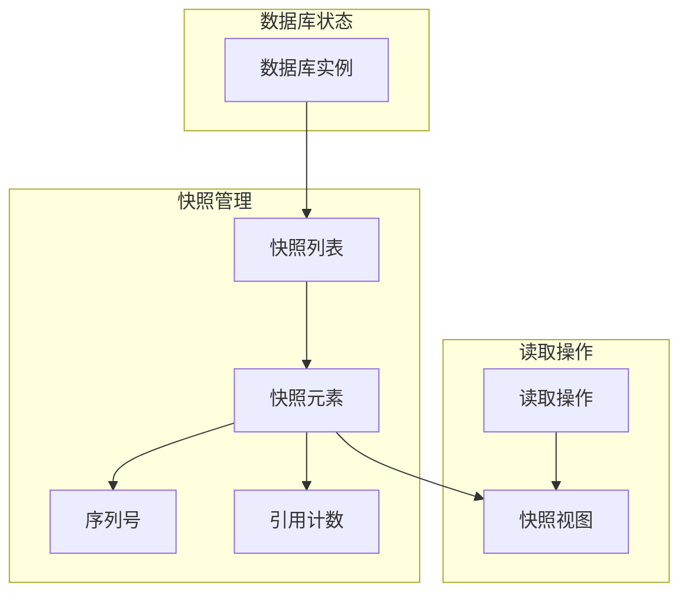
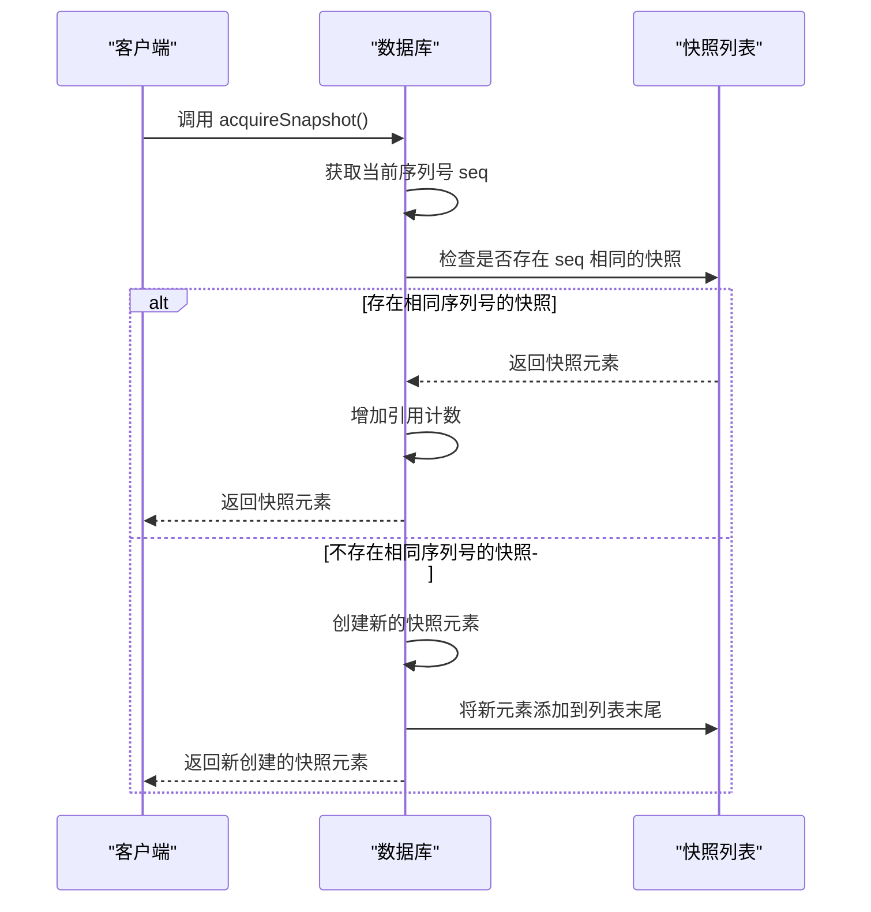
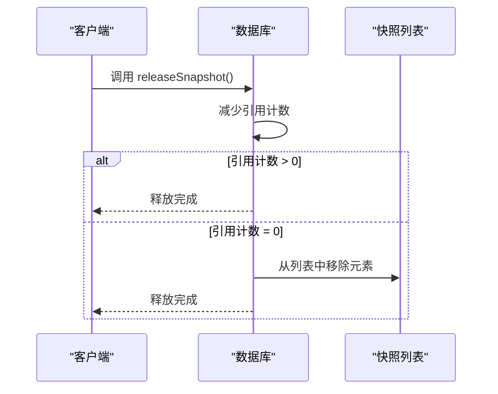
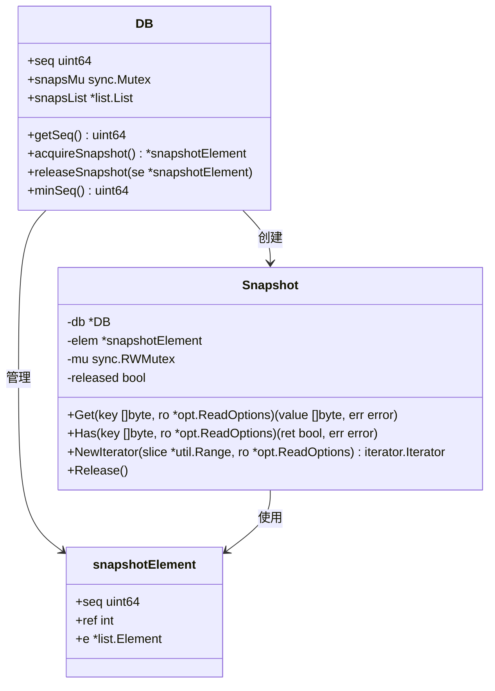
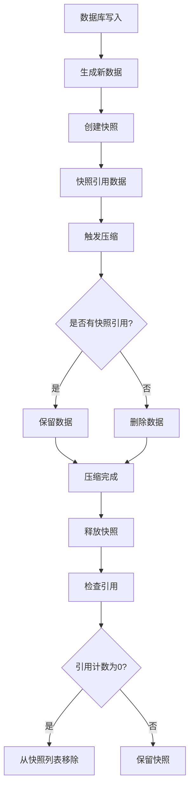

# 快照

<cite>
**本文档中引用的文件**   
- [db_snapshot.go](file://leveldb/db_snapshot.go)
- [db.go](file://leveldb/db.go)
- [version.go](file://leveldb/version.go)
- [db_compaction.go](file://leveldb/db_compaction.go)
- [session.go](file://leveldb/session.go)
- [session_compaction.go](file://leveldb/session_compaction.go)
- [session_util.go](file://leveldb/session_util.go)
- [key.go](file://leveldb/key.go)
- [db_util.go](file://leveldb/db_util.go)
</cite>

## 目录
1. [简介](#简介)
2. [快照机制概述](#快照机制概述)
3. [快照的创建与生命周期管理](#快照的创建与生命周期管理)
4. [快照在MVCC中的作用](#快照在mvcc中的作用)
5. [快照与压缩的协同工作](#快照与压缩的协同工作)
6. [使用示例](#使用示例)
7. [资源影响](#资源影响)
8. [结论](#结论)

## 简介
avccDB的快照功能为数据库提供了一种在特定时间点创建一致性视图的机制。通过使用序列号（seq），快照确保了读取操作的隔离性，使得在快照存在期间，读取操作能够看到数据库在创建快照时的一致状态，而不会受到后续写入操作的影响。快照的创建、引用计数管理和释放机制是实现这一功能的核心。此外，快照在多版本并发控制（MVCC）中扮演着关键角色，并与压缩过程协同工作，防止正在被快照引用的旧数据被过早删除。

## 快照机制概述



**图源**
- [db_snapshot.go](file://leveldb/db_snapshot.go#L21-L45)
- [db.go](file://leveldb/db.go#L63-L65)

**节源**
- [db_snapshot.go](file://leveldb/db_snapshot.go#L21-L45)
- [db.go](file://leveldb/db.go#L63-L65)

## 快照的创建与生命周期管理

### 快照创建（acquireSnapshot）
快照的创建是通过`acquireSnapshot`方法实现的。该方法首先获取当前数据库的最新序列号，然后检查快照列表中是否存在具有相同序列号的快照元素。如果存在，则增加该快照元素的引用计数；否则，创建一个新的快照元素并将其添加到快照列表的末尾。



**图源**
- [db_snapshot.go](file://leveldb/db_snapshot.go#L28-L45)

**节源**
- [db_snapshot.go](file://leveldb/db_snapshot.go#L28-L45)

### 快照释放（releaseSnapshot）
快照的释放是通过`releaseSnapshot`方法实现的。该方法减少快照元素的引用计数，当引用计数降为0时，将该快照元素从快照列表中移除。



**图源**
- [db_snapshot.go](file://leveldb/db_snapshot.go#L49-L57)

**节源**
- [db_snapshot.go](file://leveldb/db_snapshot.go#L49-L57)

## 快照在MVCC中的作用



**图源**
- [db_snapshot.go](file://leveldb/db_snapshot.go#L21-L88)
- [db.go](file://leveldb/db.go#L36-L65)

**节源**
- [db_snapshot.go](file://leveldb/db_snapshot.go#L21-L88)
- [db.go](file://leveldb/db.go#L36-L65)

## 快照与压缩的协同工作



**图源**
- [db_snapshot.go](file://leveldb/db_snapshot.go#L63-L69)
- [session_compaction.go](file://leveldb/session_compaction.go#L86-L94)
- [session_util.go](file://leveldb/session_util.go#L70-L247)

**节源**
- [db_snapshot.go](file://leveldb/db_snapshot.go#L63-L69)
- [session_compaction.go](file://leveldb/session_compaction.go#L86-L94)
- [session_util.go](file://leveldb/session_util.go#L70-L247)

## 使用示例

### 一致性备份
```go
// 获取快照用于一致性备份
snap, err := db.GetSnapshot()
if err != nil {
    // 处理错误
}
defer snap.Release()

// 使用快照进行备份操作
// 所有读取操作都将基于快照创建时的一致性视图
```

### 长时间运行查询
```go
// 为长时间运行的查询创建快照
snap, err := db.GetSnapshot()
if err != nil {
    // 处理错误
}
defer snap.Release()

// 执行长时间查询
iter := snap.NewIterator(nil, nil)
for iter.Next() {
    // 处理数据
}
iter.Release()
```

**节源**
- [db.go](file://leveldb/db.go#L1237-L1243)
- [db_snapshot.go](file://leveldb/db_snapshot.go#L82-L90)

## 资源影响
快照机制对系统资源有一定的影响。每个活动的快照都会占用内存来存储其元数据，并且会阻止压缩过程删除被引用的数据文件，这可能导致磁盘空间的暂时增加。此外，快照列表的维护需要同步操作，可能对写入性能产生轻微影响。因此，建议在使用完快照后及时释放，以避免不必要的资源消耗。

**节源**
- [db.go](file://leveldb/db.go#L42-L43)
- [db_snapshot.go](file://leveldb/db_snapshot.go#L88-L89)

## 结论
avccDB的快照功能通过序列号和引用计数机制，为数据库提供了一种高效的一致性视图。它不仅确保了读取操作的隔离性，还在MVCC和压缩过程中发挥着重要作用。通过合理使用快照，可以实现一致性备份和长时间运行查询等高级功能，同时需要注意管理快照的生命周期以优化资源使用。