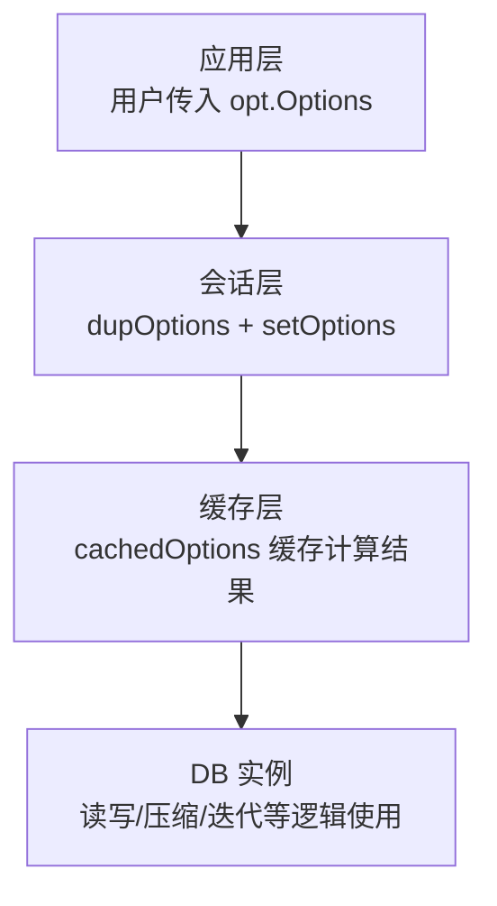
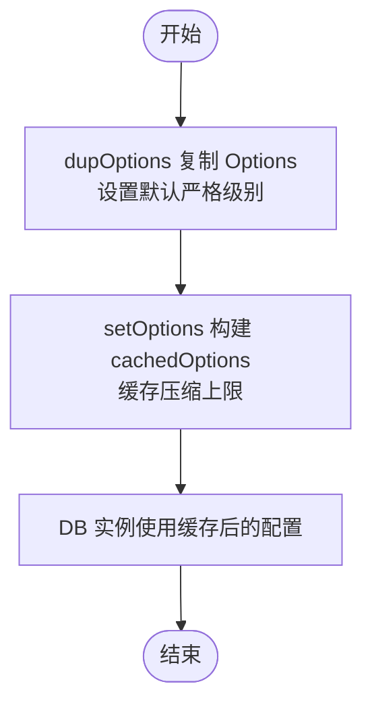

# 配置选项

<cite>
**本文引用的文件**
- [options.go](file://leveldb/opt/options.go)
- [options_darwin.go](file://leveldb/opt/options_darwin.go)
- [options_default.go](file://leveldb/opt/options_default.go)
- [options.go](file://leveldb/options.go)
- [db.go](file://leveldb/db.go)
- [main.go](file://manualtest/dbstress/main.go)
</cite>

## 目录
1. [简介](#简介)
2. [项目结构与定位](#项目结构与定位)
3. [核心组件概览](#核心组件概览)
4. [架构总览](#架构总览)
5. [详细配置项解析](#详细配置项解析)
6. [依赖关系与数据流](#依赖关系与数据流)
7. [性能影响与调优建议](#性能影响与调优建议)
8. [故障排查指南](#故障排查指南)
9. [结论](#结论)
10. [附录：常用配置示例路径](#附录常用配置示例路径)

## 简介
本文件为 avccDB 的配置选项（opt.Options）的权威参考，系统梳理并解释所有可配置参数，包括但不限于：
- 写入与压缩相关：WriteBuffer、CompactionTableSize、CompactionL0Trigger、WriteL0SlowdownTrigger、WriteL0PauseTrigger
- 块与缓存相关：BlockSize、BlockCacheCapacity、OpenFilesCacheCapacity、BlockCacher、OpenFilesCacher
- 其他关键阈值与策略：CompactionExpandLimitFactor、CompactionGPOverlapsFactor、CompactionSourceLimitFactor、IteratorSamplingRate、FilterBaseLg、MaxManifestFileSize
- 严格模式与行为开关：Strict、NoSync、NoWriteMerge、DisableBlockCache、DisableSeeksCompaction、DisableLargeBatchTransaction 等

本文将给出每个选项的默认值、取值范围、对读写吞吐量与延迟、内存与磁盘 I/O 的影响，并提供面向高写入、高读取、内存受限等场景的调优建议与示例路径。

## 项目结构与定位
- 配置定义位于 leveldb/opt/options.go，包含 Options 结构体、默认常量、Getter 方法与严格模式枚举。
- 平台差异默认值在 options_darwin.go（macOS）与 options_default.go（非 macOS）中覆盖。
- 会话层将用户 Options 复制并缓存到 cachedOptions，以减少重复计算与提升访问性能。
- DB 打开流程中通过 newSession 与 setOptions 应用配置。



图表来源
- [options.go](file://leveldb/options.go#L14-L44)
- [options.go](file://leveldb/opt/options.go#L176-L424)
- [options.go](file://leveldb/options.go#L48-L108)

章节来源
- [options.go](file://leveldb/opt/options.go#L176-L424)
- [options.go](file://leveldb/options.go#L14-L44)
- [options.go](file://leveldb/options.go#L48-L108)

## 核心组件概览
- Options：数据库全局配置入口，包含缓存、压缩、写入、过滤器、严格模式等字段。
- cachedOptions：对压缩相关上限进行预计算缓存，避免每次访问重复计算。
- Getter 方法族：统一处理默认值、零值与负值的语义，保证健壮性。
- 平台默认：OpenFilesCacheCapacity 在 macOS 与非 macOS 上有不同默认值。

章节来源
- [options.go](file://leveldb/opt/options.go#L176-L424)
- [options.go](file://leveldb/options.go#L48-L108)
- [options_darwin.go](file://leveldb/opt/options_darwin.go#L1-L9)
- [options_default.go](file://leveldb/opt/options_default.go#L1-L9)

## 架构总览
下图展示从应用层传入配置到 DB 实例生效的关键流程。

```mermaid
sequenceDiagram
participant App as "应用"
participant Opt as "opt.Options"
participant Sess as "session.setOptions"
participant Cache as "cachedOptions"
participant DB as "DB 实例"
App->>Opt : 构造/修改 Options
App->>Sess : 传入 Options
Sess->>Sess : dupOptions 复制并设置默认严格级别
Sess->>Cache : 创建 cachedOptions 并缓存计算结果
Cache-->>Sess : 返回已缓存的上限/阈值
Sess-->>DB : 将 Options 注入 DB
DB-->>App : 可安全并发使用
```

图表来源
- [options.go](file://leveldb/options.go#L14-L44)
- [options.go](file://leveldb/options.go#L48-L108)
- [db.go](file://leveldb/db.go#L177-L200)

章节来源
- [options.go](file://leveldb/options.go#L14-L44)
- [options.go](file://leveldb/options.go#L48-L108)
- [db.go](file://leveldb/db.go#L177-L200)

## 详细配置项解析

### 写入与压缩相关
- WriteBuffer（写入缓冲区大小）
  - 默认值：参见默认常量
  - 取值范围：> 0；若<=0则使用默认值
  - 影响：增大可提升写吞吐，但占用更多内存；过小会导致频繁 flush，增加磁盘写放大
  - 关联 Getter：GetWriteBuffer
- CompactionTableSize（压缩表大小）
  - 默认值：参见默认常量
  - 取值范围：> 0；若<=0则使用默认值
  - 影响：决定各层级生成的 SSTable 目标大小；与乘数共同决定层级间规模
  - 计算：GetCompactionTableSize(level)
- CompactionL0Trigger（L0 表数量触发压缩）
  - 默认值：参见默认常量
  - 取值范围：> 0；若==0则使用默认值
  - 影响：L0 表过多会触发压缩，影响写入延迟；过小导致频繁压缩，过大导致 L0 积压
  - Getter：GetCompactionL0Trigger
- WriteL0SlowdownTrigger（L0 表数量慢速写入阈值）
  - 默认值：参见默认常量
  - 取值范围：> 0；若==0则使用默认值
  - 影响：超过该阈值时触发写入慢速，避免 L0 过度膨胀
  - Getter：GetWriteL0SlowdownTrigger
- WriteL0PauseTrigger（L0 表数量暂停写入阈值）
  - 默认值：参见默认常量
  - 取值范围：> 0；若==0则使用默认值
  - 影响：超过该阈值时暂停写入，保护系统免受 L0 压缩风暴影响
  - Getter：GetWriteL0PauseTrigger
- CompactionExpandLimitFactor（压缩扩展限制因子）
  - 默认值：参见默认常量
  - 取值范围：> 0；若<=0则使用默认值
  - 影响：用于限制一次压缩后目标层级的大小上限
  - Getter：GetCompactionExpandLimit(level)
- CompactionGPOverlapsFactor（祖父层重叠限制因子）
  - 默认值：参见默认常量
  - 取值范围：> 0；若<=0则使用默认值
  - 影响：限制单个表在祖父层（Level+2）可能产生的重叠数量
  - Getter：GetCompactionGPOverlaps(level)
- CompactionSourceLimitFactor（压缩源大小限制因子）
  - 默认值：参见默认常量
  - 取值范围：> 0；若<=0则使用默认值
  - 影响：限制非 L0 层压缩的源大小
  - Getter：GetCompactionSourceLimit(level)
- IteratorSamplingRate（迭代采样率）
  - 默认值：参见默认常量
  - 取值范围：>=0；若<0则禁用采样
  - 影响：用于指导压缩触发时机；禁用后由其他机制控制
  - Getter：GetIteratorSamplingRate()

章节来源
- [options.go](file://leveldb/opt/options.go#L241-L280)
- [options.go](file://leveldb/opt/options.go#L228-L240)
- [options.go](file://leveldb/opt/options.go#L401-L411)
- [options.go](file://leveldb/opt/options.go#L470-L499)
- [options.go](file://leveldb/opt/options.go#L501-L541)
- [options.go](file://leveldb/opt/options.go#L353-L361)
- [options.go](file://leveldb/opt/options.go#L470-L499)
- [options.go](file://leveldb/opt/options.go#L486-L491)

### 块与缓存相关
- BlockSize（块大小）
  - 默认值：参见默认常量
  - 取值范围：> 0；若<=0则使用默认值
  - 影响：影响 SSTable 块大小，进而影响读放大与压缩效率
  - Getter：GetBlockSize()
- BlockCacheCapacity（块缓存容量）
  - 默认值：参见默认常量
  - 取值范围：>=0；若<0则视为 0（禁用缓存）
  - 影响：提升读性能，降低磁盘 I/O；过高会挤占内存
  - Getter：GetBlockCacheCapacity()
- OpenFilesCacheCapacity（打开文件缓存容量）
  - 默认值：macOS=200；非 macOS=500（平台差异）
  - 取值范围：>=0；若<0则视为 0（禁用缓存）
  - 影响：减少文件句柄/元数据开销，提高并发读写稳定性
  - Getter：GetOpenFilesCacheCapacity()
- BlockCacher（块缓存算法）
  - 默认值：LRU
  - 取值范围：可选择 LRU 或禁用
  - Getter：GetBlockCacher()
- OpenFilesCacher（打开文件缓存算法）
  - 默认值：LRU
  - 取值范围：可选择 LRU 或禁用
  - Getter：GetOpenFilesCacher()

章节来源
- [options.go](file://leveldb/opt/options.go#L209-L213)
- [options.go](file://leveldb/opt/options.go#L185-L201)
- [options.go](file://leveldb/opt/options.go#L372-L382)
- [options.go](file://leveldb/opt/options.go#L24-L45)
- [options_darwin.go](file://leveldb/opt/options_darwin.go#L1-L9)
- [options_default.go](file://leveldb/opt/options_default.go#L1-L9)

### 其他关键阈值与策略
- FilterBaseLg（布隆过滤器块大小对数）
  - 默认值：参见默认常量
  - 取值范围：> 0；若<=0则使用默认值
  - 影响：决定布隆过滤器粒度，影响命中率与存储开销
  - Getter：GetFilterBaseLg()
- MaxManifestFileSize（MANIFEST 文件最大尺寸）
  - 默认值：参见默认常量
  - 取值范围：> 0；若<=0则使用默认值
  - 影响：控制 MANIFEST 切分频率，避免单文件过大
  - Getter：GetMaxManifestFileSize()
- Compression（块压缩类型）
  - 默认值：参见默认常量
  - 取值范围：默认/无压缩/snappy
  - Getter：GetCompression()
- BlockRestartInterval（块重启间隔）
  - 默认值：参见默认常量
  - 取值范围：> 0；若<=0则使用默认值
  - 影响：键编码压缩效果与查找成本
  - Getter：GetBlockRestartInterval()

章节来源
- [options.go](file://leveldb/opt/options.go#L413-L424)
- [options.go](file://leveldb/opt/options.go#L418-L424)
- [options.go](file://leveldb/opt/options.go#L289-L292)
- [options.go](file://leveldb/opt/options.go#L203-L207)

### 严格模式与行为开关
- Strict（严格级别）
  - 默认值：参见默认常量
  - 取值范围：位掩码组合（Manifest/Journal/BlockChecksum/Compaction/Reader/Recovery 等）
  - Getter：GetStrict(strict)
- NoSync（禁用同步）
  - 默认值：false
  - 影响：关闭 fsync 提升写吞吐，但牺牲持久性
  - Getter：GetNoSync()
- NoWriteMerge（禁用写合并）
  - 默认值：false
  - 影响：禁用写合并可能降低写放大，但也可能增加写放大
  - Getter：GetNoWriteMerge()
- DisableBlockCache（禁用块缓存）
  - 默认值：false
  - 影响：完全禁用块缓存，降低内存占用但显著增加读放大
  - Getter：GetDisableBlockCache()
- DisableSeeksCompaction（禁用“按查找触发的压缩”）
  - 默认值：false
  - 影响：禁用后可能减少小压缩，但可能增加读放大
  - Getter：GetDisableSeeksCompaction()
- DisableLargeBatchTransaction（禁用大批次事务）
  - 默认值：false
  - 影响：大批次写入是否切换到事务模式
  - Getter：GetDisableLargeBatchTransaction()

章节来源
- [options.go](file://leveldb/opt/options.go#L130-L174)
- [options.go](file://leveldb/opt/options.go#L362-L371)
- [options.go](file://leveldb/opt/options.go#L367-L371)
- [options.go](file://leveldb/opt/options.go#L294-L303)
- [options.go](file://leveldb/opt/options.go#L317-L323)
- [options.go](file://leveldb/opt/options.go#L310-L315)

## 依赖关系与数据流
- Options 通过 dupOptions 复制并注入默认严格级别，随后 setOptions 构建 cachedOptions，缓存压缩相关上限数组，供后续读写/压缩流程直接使用。
- DB 打开流程中，newSession 调用 setOptions 完成配置注入；DB 实例内部统计与控制变量（如写延迟、压缩统计）与配置协同工作。



图表来源
- [options.go](file://leveldb/options.go#L14-L44)
- [options.go](file://leveldb/options.go#L48-L108)
- [db.go](file://leveldb/db.go#L177-L200)

章节来源
- [options.go](file://leveldb/options.go#L14-L44)
- [options.go](file://leveldb/options.go#L48-L108)
- [db.go](file://leveldb/db.go#L177-L200)

## 性能影响与调优建议

### 通用原则
- 写入为主的工作负载：适当增大 WriteBuffer 与 CompactionTableSize，降低 flush 次数；适度提高 WriteL0SlowdownTrigger 与 WriteL0PauseTrigger，避免 L0 压缩风暴。
- 读取为主的工作负载：启用块缓存（BlockCacheCapacity），合理设置 BlockSize；开启布隆过滤器（FilterBaseLg），降低磁盘 I/O。
- 内存受限环境：减小 BlockCacheCapacity 与 OpenFilesCacheCapacity；必要时禁用块缓存（DisableBlockCache）或降低 BlockSize；谨慎使用压缩以平衡 CPU 与内存。
- 高并发读写：提高 OpenFilesCacheCapacity；避免过度禁用写合并（NoWriteMerge）；合理设置 CompactionL0Trigger 与压缩因子，保持 L0 清晰。

### 针对不同工作负载的建议
- 高写入（OLTP/写密集）：
  - 增大 WriteBuffer（例如默认值的 2–4 倍）
  - 适度增大 CompactionTableSize 与 CompactionTotalSize，减少压缩次数
  - 提高 WriteL0SlowdownTrigger 与 WriteL0PauseTrigger（例如默认值的 1.5–2 倍）
  - 合理设置 CompactionExpandLimitFactor、CompactionGPOverlapsFactor、CompactionSourceLimitFactor，避免单次压缩过大
  - 可考虑禁用 DisableSeeksCompaction 以减少小压缩
- 高读取（OLAP/读密集）：
  - 提升 BlockCacheCapacity（例如默认值的 2–4 倍）
  - 设置合理的 BlockSize（例如默认值的 2–4 倍）
  - 启用布隆过滤器（FilterBaseLg 保持默认或略增）
  - 适度降低 CompactionL0Trigger，避免 L0 过多导致读放大
- 内存受限（容器/边缘设备）：
  - 降低 BlockCacheCapacity 与 OpenFilesCacheCapacity 至 1/4–1/2 默认值
  - 必要时禁用块缓存（DisableBlockCache）
  - 降低 CompactionTableSize 与 CompactionTotalSize，减少内存峰值
  - 保持默认 BlockSize 或略降，降低内存占用

### 示例路径（不展示具体代码，仅提供路径）
- 高写入场景示例（命令行参数驱动）：[dbstress/main.go](file://manualtest/dbstress/main.go#L80-L92)
- 严格模式与块校验示例：[dbstress/main.go](file://manualtest/dbstress/main.go#L170-L177)
- 缓冲池与块缓存开关示例：[dbstress/main.go](file://manualtest/dbstress/main.go#L88-L91)

章节来源
- [main.go](file://manualtest/dbstress/main.go#L80-L92)
- [main.go](file://manualtest/dbstress/main.go#L170-L177)
- [main.go](file://manualtest/dbstress/main.go#L88-L91)

## 故障排查指南
- 写入被暂停或慢速：
  - 检查 WriteL0PauseTrigger 与 WriteL0SlowdownTrigger 是否过低
  - 观察 L0 表数量与压缩队列状态
- 读取延迟高：
  - 检查 BlockCacheCapacity 是否过低
  - 确认 BlockSize 是否过大导致缓存命中率下降
- 内存占用过高：
  - 降低 BlockCacheCapacity、OpenFilesCacheCapacity
  - 减小 CompactionTableSize 与 CompactionTotalSize
  - 必要时禁用块缓存（DisableBlockCache）
- 压缩风暴或写入抖动：
  - 提高 CompactionL0Trigger 与压缩因子
  - 适度降低 CompactionExpandLimitFactor、CompactionGPOverlapsFactor、CompactionSourceLimitFactor
- MANIFEST 过大导致恢复缓慢：
  - 调整 MaxManifestFileSize 以更频繁切分

章节来源
- [options.go](file://leveldb/opt/options.go#L401-L411)
- [options.go](file://leveldb/opt/options.go#L228-L240)
- [options.go](file://leveldb/opt/options.go#L470-L499)
- [options.go](file://leveldb/opt/options.go#L418-L424)

## 结论
opt.Options 提供了覆盖写入、压缩、缓存、过滤器与严格模式的完整配置面。通过理解各参数的默认值、取值范围与性能影响，结合工作负载特征进行针对性调优，可在吞吐、延迟、内存与磁盘 I/O 之间取得最佳平衡。建议在生产环境中以基准测试验证配置效果，并持续监控 DB 统计指标（如写延迟、压缩统计、L0 表数量）以动态微调。

## 附录：常用配置示例路径
- 高写入场景（命令行参数）：[dbstress/main.go](file://manualtest/dbstress/main.go#L80-L92)
- 严格模式与块校验：[dbstress/main.go](file://manualtest/dbstress/main.go#L170-L177)
- 缓冲池与块缓存开关：[dbstress/main.go](file://manualtest/dbstress/main.go#L88-L91)