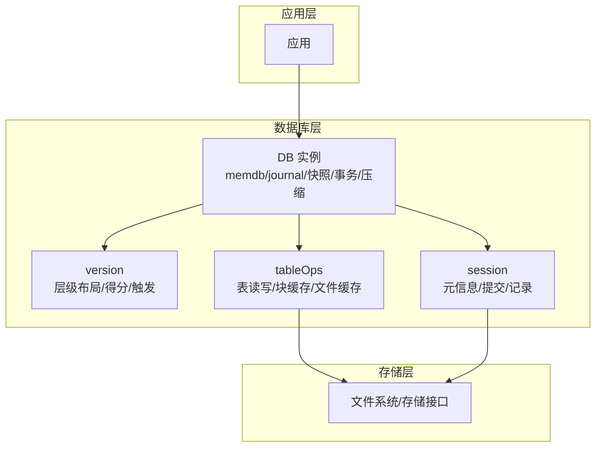
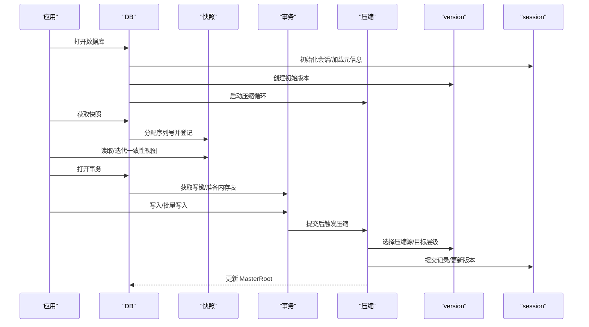
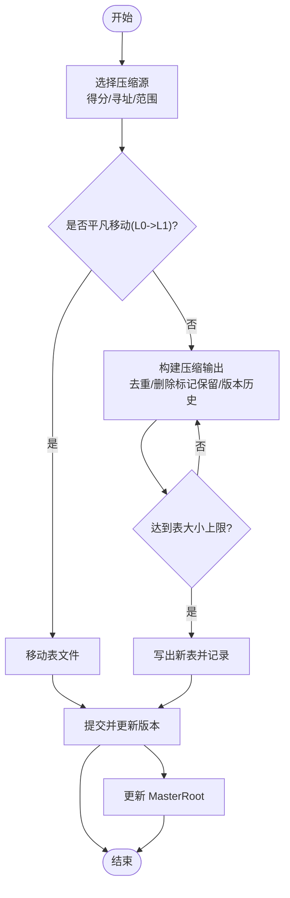
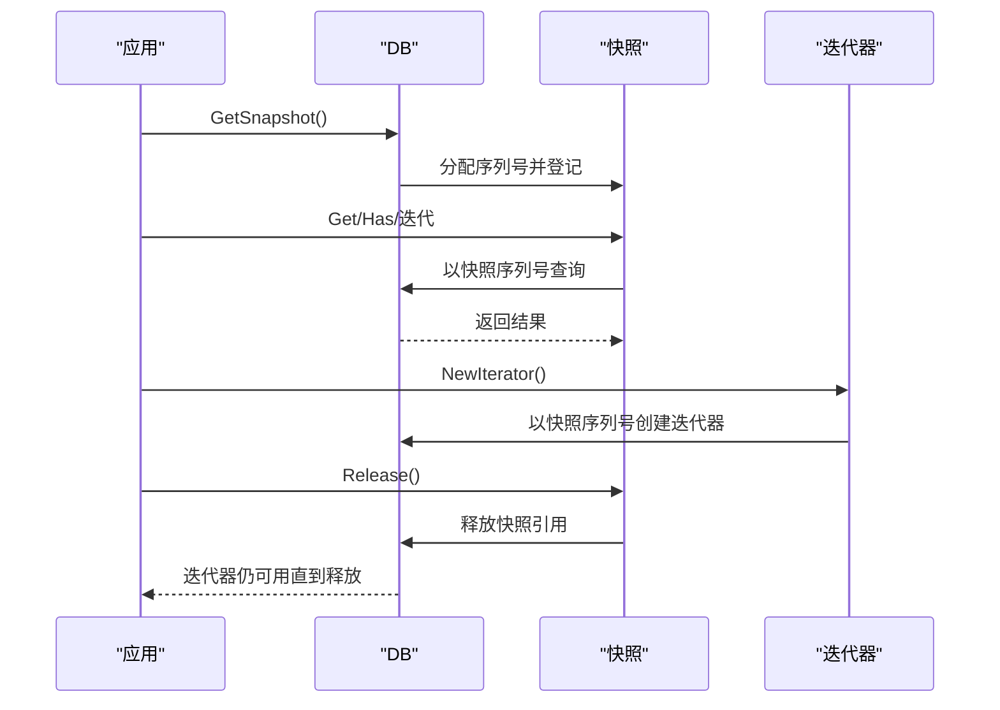
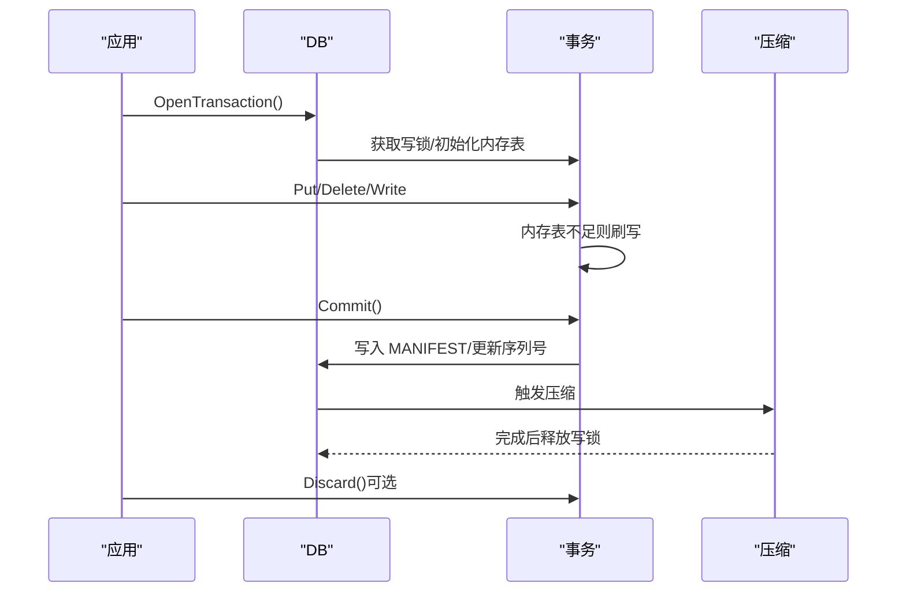
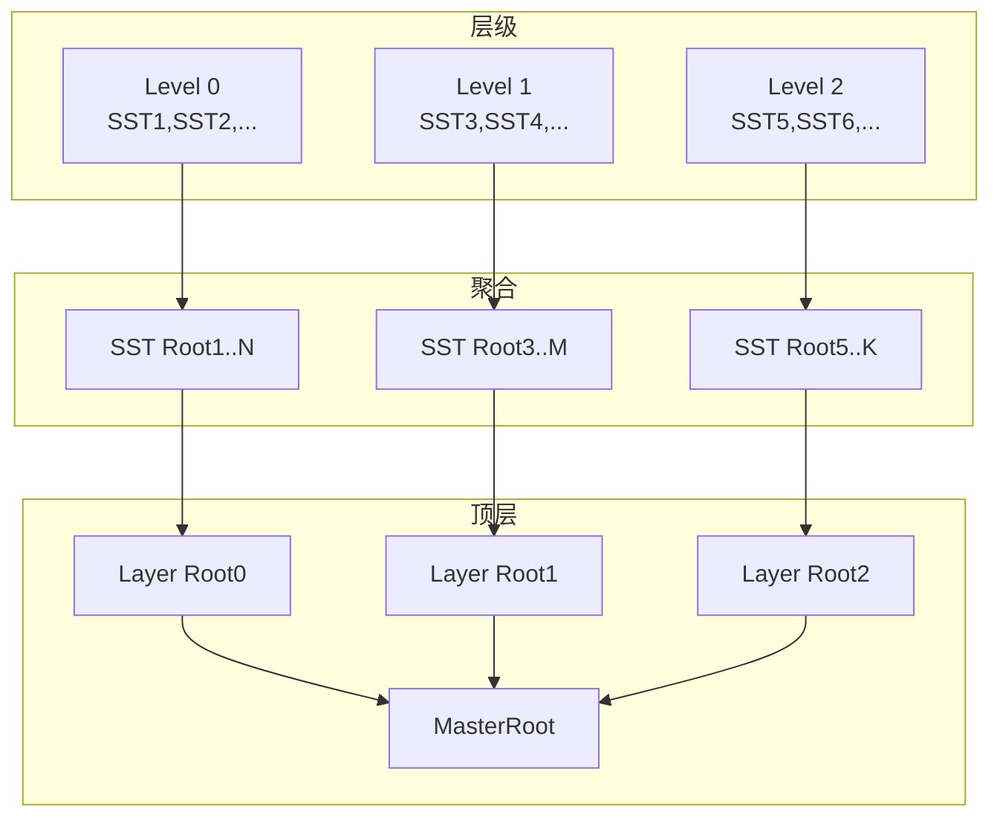
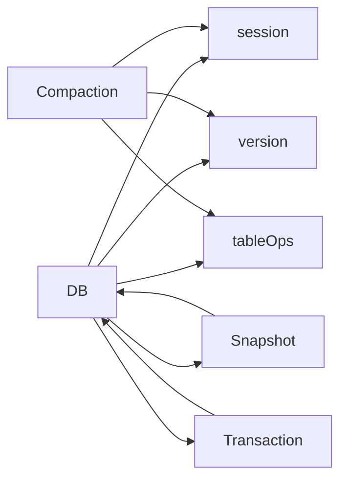

# 高级特性

<cite>
**本文引用的文件**
- [leveldb/db_compaction.go](file://leveldb/db_compaction.go)
- [leveldb/db_snapshot.go](file://leveldb/db_snapshot.go)
- [leveldb/db_transaction.go](file://leveldb/db_transaction.go)
- [leveldb/opt/options.go](file://leveldb/opt/options.go)
- [leveldb/db.go](file://leveldb/db.go)
- [leveldb/session_compaction.go](file://leveldb/session_compaction.go)
- [leveldb/version.go](file://leveldb/version.go)
- [leveldb/cache/cache.go](file://leveldb/cache/cache.go)
- [leveldb/table.go](file://leveldb/table.go)
- [leveldb/merkle/hash.go](file://leveldb/merkle/hash.go)
- [leveldb/merkle/tree.go](file://leveldb/merkle/tree.go)
- [leveldb/merkle/node.go](file://leveldb/merkle/node.go)
- [leveldb/mlsm_final_comprehensive_test.go](file://leveldb/mlsm_final_comprehensive_test.go)
</cite>

## 目录
1. [简介](#简介)
2. [项目结构](#项目结构)
3. [核心组件](#核心组件)
4. [架构总览](#架构总览)
5. [详细组件分析](#详细组件分析)
6. [依赖关系分析](#依赖关系分析)
7. [性能考量](#性能考量)
8. [故障排查指南](#故障排查指南)
9. [结论](#结论)
10. [附录：配置项一览与调优建议](#附录配置项一览与调优建议)

## 简介
本文件面向 avccDB 的高级特性，围绕压缩（Compaction）、快照（Snapshot）、事务（Transaction）以及配置选项展开，系统性解释触发机制、执行流程、性能与存储影响，并给出配置调优建议。同时，结合 mLSM（多版本 LSM）能力与 MasterRoot 的计算，说明这些特性如何协同工作以保障一致性与可验证性。

## 项目结构
- 存储层：表（SSTable）与块缓存、文件缓存、缓冲池等由 opt 与 table 层提供。
- 内存层：memdb 与 journal 组成易失但有序的数据结构，负责写放大前的暂存。
- 版本与会话：version 描述当前层级布局，session 负责元信息与提交记录。
- 压缩：memdb 刷写与表间压缩，包含暂停/恢复、错误处理与重试退避。
- 快照：基于序列号冻结视图，保证读操作一致性。
- 事务：单事务锁、内存表合并、提交与回滚路径。
- mLSM 与 MasterRoot：按层级聚合 SST 根哈希，形成可验证的 MasterRoot。

图表来源
- [leveldb/db.go](file://leveldb/db.go#L33-L120)
- [leveldb/version.go](file://leveldb/version.go#L21-L60)
- [leveldb/session_compaction.go](file://leveldb/session_compaction.go#L151-L200)
- [leveldb/table.go](file://leveldb/table.go#L537-L566)

章节来源
- [leveldb/db.go](file://leveldb/db.go#L33-L120)
- [leveldb/version.go](file://leveldb/version.go#L21-L60)
- [leveldb/session_compaction.go](file://leveldb/session_compaction.go#L151-L200)
- [leveldb/table.go](file://leveldb/table.go#L537-L566)

## 核心组件
- 压缩（Compaction）
  - memdb 刷写到 SSTable 并落盘，生成新层级文件。
  - 表间压缩（level0 与非 level0），支持“寻址触发”与“大小阈值”两种触发方式。
  - 支持暂停/恢复、错误传播与重试退避，确保稳定性。
- 快照（Snapshot）
  - 基于序列号冻结视图，读操作在该序列号下保持一致。
  - 提供迭代器与 Get/Has 接口，释放快照不影响已持有的迭代器。
- 事务（Transaction）
  - 单事务锁，内存表合并，提交时写入 MANIFEST 并更新序列号。
  - 支持回滚（丢弃）与重试提交。
- 配置（Options）
  - 包含缓存、压缩、写缓冲、L0/L1 触发与限流、严格模式等关键参数。
- mLSM 与 MasterRoot
  - 按层级聚合 SST 根哈希，形成 Layer Root；再聚合形成 MasterRoot，用于状态可验证。

章节来源
- [leveldb/db_compaction.go](file://leveldb/db_compaction.go#L269-L355)
- [leveldb/db_compaction.go](file://leveldb/db_compaction.go#L567-L630)
- [leveldb/db_snapshot.go](file://leveldb/db_snapshot.go#L21-L90)
- [leveldb/db_transaction.go](file://leveldb/db_transaction.go#L284-L336)
- [leveldb/opt/options.go](file://leveldb/opt/options.go#L176-L424)
- [leveldb/db.go](file://leveldb/db.go#L1493-L1569)

## 架构总览
压缩、快照、事务与配置共同构成 avccDB 的高级特性体系：
- 压缩通过版本得分与范围选择决定何时、何地进行压缩，平衡吞吐与空间占用。
- 快照冻结序列号，使读操作在一致性视图下进行，避免写放大期间的可见性问题。
- 事务提供原子写入路径，减少多次小写放大，提升吞吐。
- 配置项贯穿读写路径，影响缓存命中、压缩节奏、写停顿与严格性。
- mLSM 与 MasterRoot 为状态可验证提供基础，便于审计与一致性证明。

图表来源
- [leveldb/db.go](file://leveldb/db.go#L100-L175)
- [leveldb/db_snapshot.go](file://leveldb/db_snapshot.go#L21-L90)
- [leveldb/db_transaction.go](file://leveldb/db_transaction.go#L284-L336)
- [leveldb/db_compaction.go](file://leveldb/db_compaction.go#L567-L630)
- [leveldb/version.go](file://leveldb/version.go#L646-L696)

## 详细组件分析

### 压缩（Compaction）机制与执行流程
- 触发机制
  - 版本得分：level-0 以文件数比值触发；其他层级以总大小与阈值比值触发。
  - 寻址触发：迭代器采样命中热点表，触发针对该表的压缩。
  - 范围触发：指定层级与键区间，限制源表数量，避免一次性压缩过多。
- 执行流程
  - memdb 刷写：将内存表转为 SSTable，插入目标层级，提交并更新 MasterRoot。
  - 表间压缩：构建 tableCompactionBuilder，按用户键去重、删除标记保留、版本历史保留策略，输出新的 SSTable。
  - 提交：通过 sessionRecord 记录新增/删除文件，提交到 MANIFEST，更新版本。
  - 统计与回退：统计读写耗时与字节数，错误时进入持久化错误通道或回滚。
- 性能与空间影响
  - 写放大：memdb 刷写与表间压缩均带来写放大；合理设置 WriteBuffer 与 CompactionTableSize 可降低峰值。
  - 空间回收：删除标记与过期版本清理显著减少磁盘占用；严格模式下更严格。
  - 停顿与降速：L0 文件数超过阈值触发写停顿；接近慢速阈值触发写减速。
- 关键路径参考
  - memdb 刷写与提交：[leveldb/db_compaction.go](file://leveldb/db_compaction.go#L269-L355)
  - 表间压缩与提交：[leveldb/db_compaction.go](file://leveldb/db_compaction.go#L567-L630)
  - 触发策略与范围选择：[leveldb/session_compaction.go](file://leveldb/session_compaction.go#L55-L134)
  - 版本得分与是否需要压缩：[leveldb/version.go](file://leveldb/version.go#L646-L696)

图表来源
- [leveldb/db_compaction.go](file://leveldb/db_compaction.go#L567-L630)
- [leveldb/db_compaction.go](file://leveldb/db_compaction.go#L356-L555)
- [leveldb/session_compaction.go](file://leveldb/session_compaction.go#L55-L134)
- [leveldb/version.go](file://leveldb/version.go#L646-L696)

章节来源
- [leveldb/db_compaction.go](file://leveldb/db_compaction.go#L269-L355)
- [leveldb/db_compaction.go](file://leveldb/db_compaction.go#L567-L630)
- [leveldb/session_compaction.go](file://leveldb/session_compaction.go#L55-L134)
- [leveldb/version.go](file://leveldb/version.go#L646-L696)

### 快照（Snapshot）的创建、使用与生命周期
- 创建与持有
  - 通过获取最新序列号并登记到快照列表，形成一致性视图。
  - 快照对象持有引用计数，释放快照不会影响已返回的迭代器。
- 读取行为
  - Get/Has/NewIterator 在快照序列号下查询，保证跨并发读的一致性。
- 生命周期管理
  - 最小未被快照持有的序列号用于压缩清理过期数据。
  - 快照释放后从链表移除，防止悬挂引用。
- 关键路径参考
  - 快照结构与序列号管理：[leveldb/db_snapshot.go](file://leveldb/db_snapshot.go#L21-L72)
  - 快照对象与读接口：[leveldb/db_snapshot.go](file://leveldb/db_snapshot.go#L74-L188)
  - DB 层获取快照：[leveldb/db.go](file://leveldb/db.go#L1232-L1243)

图表来源
- [leveldb/db_snapshot.go](file://leveldb/db_snapshot.go#L21-L188)
- [leveldb/db.go](file://leveldb/db.go#L1232-L1243)

章节来源
- [leveldb/db_snapshot.go](file://leveldb/db_snapshot.go#L21-L188)
- [leveldb/db.go](file://leveldb/db.go#L1232-L1243)

### 事务（Transaction）支持与回滚
- 设计要点
  - 单事务锁，避免与其他事务或写冲突。
  - 事务内写入先写内存表，必要时刷写到 L0。
  - 提交时写入 MANIFEST，更新序列号，触发压缩。
- 回滚与重试
  - Discard 清理临时表文件；Commit 失败可重试。
  - 提交失败时保留事务状态，允许用户决定重试或丢弃。
- 关键路径参考
  - 事务对象与读写接口：[leveldb/db_transaction.go](file://leveldb/db_transaction.go#L21-L117)
  - 写入与刷写逻辑：[leveldb/db_transaction.go](file://leveldb/db_transaction.go#L92-L116)
  - 提交流程与等待压缩：[leveldb/db_transaction.go](file://leveldb/db_transaction.go#L189-L248)
  - 打开事务与写锁：[leveldb/db_transaction.go](file://leveldb/db_transaction.go#L284-L336)

图表来源
- [leveldb/db_transaction.go](file://leveldb/db_transaction.go#L284-L336)
- [leveldb/db_transaction.go](file://leveldb/db_transaction.go#L189-L248)

章节来源
- [leveldb/db_transaction.go](file://leveldb/db_transaction.go#L21-L117)
- [leveldb/db_transaction.go](file://leveldb/db_transaction.go#L189-L248)
- [leveldb/db_transaction.go](file://leveldb/db_transaction.go#L284-L336)

### mLSM 与 MasterRoot：一致性与可验证性
- 层次化聚合
  - 每个层级的 SST 根哈希组成 Layer Root；所有 Layer Root 组成 MasterRoot。
  - 该设计支持分层验证与最终一致性证明。
- 计算与更新
  - 在 memdb 刷写与表间压缩完成后更新 MasterRoot，确保状态与物理结构一致。
- 测试验证
  - 综合测试覆盖多版本写入、读取与 MasterRoot 计算，验证一致性。
- 关键路径参考
  - MasterRoot 计算与更新：[leveldb/db.go](file://leveldb/db.go#L1493-L1569)
  - Merkle 树与哈希工具：[leveldb/merkle/hash.go](file://leveldb/merkle/hash.go#L1-L66)
  - Merkle 树结构与遍历：[leveldb/merkle/tree.go](file://leveldb/merkle/tree.go#L1-L66)
  - Merkle 节点定义：[leveldb/merkle/node.go](file://leveldb/merkle/node.go#L1-L52)
  - 综合测试用例：[leveldb/mlsm_final_comprehensive_test.go](file://leveldb/mlsm_final_comprehensive_test.go#L118-L159)

图表来源
- [leveldb/db.go](file://leveldb/db.go#L1493-L1569)
- [leveldb/merkle/hash.go](file://leveldb/merkle/hash.go#L113-L152)

章节来源
- [leveldb/db.go](file://leveldb/db.go#L1493-L1569)
- [leveldb/merkle/hash.go](file://leveldb/merkle/hash.go#L1-L66)
- [leveldb/merkle/tree.go](file://leveldb/merkle/tree.go#L1-L66)
- [leveldb/merkle/node.go](file://leveldb/merkle/node.go#L1-L52)
- [leveldb/mlsm_final_comprehensive_test.go](file://leveldb/mlsm_final_comprehensive_test.go#L118-L159)

## 依赖关系分析
- 组件耦合
  - DB 依赖 session（元信息/提交）、version（层级布局/触发）、tableOps（表读写/缓存）。
  - 压缩模块依赖 session 的 pickCompaction 与提交接口。
  - 快照模块依赖 DB 的序列号与最小未快照序列号。
  - 事务模块依赖 DB 的写锁与提交接口。
- 外部依赖
  - 缓存：LRU 等算法通过 opt 传入，tableOps 构建时生效。
  - 存储：文件系统抽象，支持同步/异步写策略。

图表来源
- [leveldb/db.go](file://leveldb/db.go#L33-L120)
- [leveldb/db_compaction.go](file://leveldb/db_compaction.go#L567-L630)
- [leveldb/db_snapshot.go](file://leveldb/db_snapshot.go#L21-L90)
- [leveldb/db_transaction.go](file://leveldb/db_transaction.go#L284-L336)

章节来源
- [leveldb/db.go](file://leveldb/db.go#L33-L120)
- [leveldb/db_compaction.go](file://leveldb/db_compaction.go#L567-L630)
- [leveldb/db_snapshot.go](file://leveldb/db_snapshot.go#L21-L90)
- [leveldb/db_transaction.go](file://leveldb/db_transaction.go#L284-L336)

## 性能考量
- 写放大与吞吐
  - WriteBuffer 控制 memdb 大小，过大导致刷写成本高，过小导致频繁刷写。
  - CompactionTableSize 与倍增因子影响压缩输出大小与写放大。
  - DisableSeeksCompaction 可减少小量压缩，但可能增加读放大。
- 存储与缓存
  - BlockCacheCapacity 与 BlockCacher 影响块缓存命中率。
  - OpenFilesCacheCapacity 与 OpenFilesCacher 影响文件句柄复用。
  - DisableBlockCache/DisableBufferPool 可减少内存占用但影响性能。
- 压缩节奏与停顿
  - WriteL0PauseTrigger 与 WriteL0SlowdownTrigger 控制 L0 文件数带来的停顿/降速。
  - DisableCompactionBackoff 可关闭重试退避，适合特定压测场景。
- 严格模式
  - StrictCompaction/StrictBlockChecksum 等严格标志提升可靠性但可能影响性能。
- mLSM 与 MasterRoot
  - 计算 MasterRoot 会在压缩/刷写后触发，适度增加 CPU 开销，换取更强一致性证明能力。

章节来源
- [leveldb/opt/options.go](file://leveldb/opt/options.go#L176-L424)
- [leveldb/table.go](file://leveldb/table.go#L537-L566)
- [leveldb/cache/cache.go](file://leveldb/cache/cache.go#L1-L200)
- [leveldb/db.go](file://leveldb/db.go#L1493-L1569)

## 故障排查指南
- 压缩错误与持久化
  - compactionError 通道区分瞬时错误与持久化错误，持久化错误会阻塞写入并持有写锁。
  - 重试采用指数退避，可通过 DisableCompactionBackoff 关闭。
- 事务提交失败
  - Commit 失败时保留事务状态，可重试或 Discard。
  - 提交成功后更新序列号并触发压缩。
- 快照异常
  - 快照引用计数为负或序列号递减会触发断言，检查快照生命周期管理。
- 严格模式与恢复
  - 严格模式下损坏的表/日志会阻止打开或在读取时失败，需使用 Recover 或调整 Strict 设置。

章节来源
- [leveldb/db_compaction.go](file://leveldb/db_compaction.go#L87-L139)
- [leveldb/db_transaction.go](file://leveldb/db_transaction.go#L189-L248)
- [leveldb/db_snapshot.go](file://leveldb/db_snapshot.go#L21-L72)
- [leveldb/opt/options.go](file://leveldb/opt/options.go#L130-L175)

## 结论
avccDB 的高级特性通过压缩、快照、事务与配置的协同，实现了高性能、强一致与可验证的状态管理。压缩策略兼顾吞吐与空间；快照提供读一致性；事务提供原子写路径；配置项为不同场景提供精细调优空间；mLSM 与 MasterRoot 则为状态可验证提供了基础设施。结合本文的触发机制、执行流程与调优建议，可在生产环境中获得稳定且可预测的性能表现。

## 附录：配置项一览与调优建议
以下为 opt.Options 中与高级特性密切相关的配置项及其作用与调优建议（节选）：

- 缓存与压缩
  - BlockCacher/BlockCacheCapacity：块缓存算法与容量，提升读命中率。
  - DisableBlockCache：禁用块缓存，降低内存占用但影响读性能。
  - BlockCacheEvictRemoved：移除表时强制驱逐缓存块，减少碎片。
  - BlockRestartInterval/BlockSize：块大小与重启间隔，影响压缩与索引效率。
  - Compression：块压缩算法，平衡 CPU 与带宽。
  - DisableBufferPool：禁用缓冲池，减少内存分配开销但可能增加 GC 压力。
- 写与压缩节奏
  - WriteBuffer：memdb 大小阈值，过大写放大高，过小刷写频繁。
  - CompactionTableSize/CompactionTableSizeMultiplier/CompactionTableSizeMultiplierPerLevel：压缩输出大小与层级倍增，影响写放大与压缩频率。
  - CompactionTotalSize/CompactionTotalSizeMultiplier/CompactionTotalSizeMultiplierPerLevel：层级总大小阈值，决定何时触发压缩。
  - CompactionL0Trigger：L0 文件数阈值，触发 level-0 压缩。
  - CompactionExpandLimitFactor/CompactionSourceLimitFactor/CompactionGPOverlapsFactor：扩展/源限制/祖父层重叠限制，控制单次压缩规模。
  - DisableSeeksCompaction：禁用寻址触发压缩，减少小量压缩但可能增加读放大。
  - IteratorSamplingRate：迭代器采样率，影响寻址触发压缩的敏感度。
  - DisableCompactionBackoff：禁用压缩重试退避，便于压测或特殊场景。
- 写停顿与降速
  - WriteL0PauseTrigger/WriteL0SlowdownTrigger：L0 文件数阈值，分别触发写停顿与写减速。
- 严格模式
  - Strict：Manifest/Journal/Block/Compaction/Reader/Recovery 等严格级别，提升可靠性但可能影响性能。
- 其他
  - ReadOnly：只读模式，适合只读场景。
  - NoSync/NoWriteMerge：禁用 fsync 与写合并，追求极致吞吐但牺牲持久性/顺序性。
  - OpenFilesCacher/OpenFilesCacheCapacity：文件句柄缓存，减少文件句柄开销。
  - MaxManifestFileSize：MANIFEST 文件最大尺寸，超过阈值会滚动新文件。

章节来源
- [leveldb/opt/options.go](file://leveldb/opt/options.go#L176-L424)
- [leveldb/opt/options.go](file://leveldb/opt/options.go#L470-L541)
- [leveldb/opt/options.go](file://leveldb/opt/options.go#L571-L692)
- [leveldb/table.go](file://leveldb/table.go#L537-L566)
- [leveldb/cache/cache.go](file://leveldb/cache/cache.go#L1-L200)